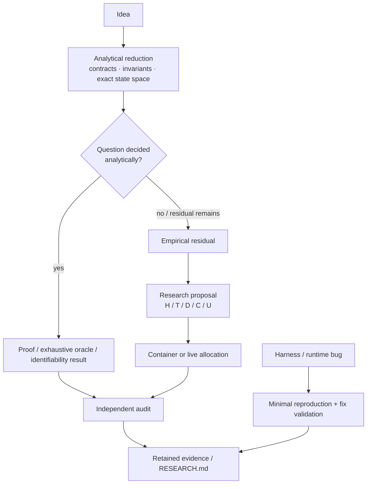

# Repository GitHub configuration

This directory contains repository-facing GitHub configuration and automation.

## Issue intake

- [`ISSUE_TEMPLATE/idea.yml`](ISSUE_TEMPLATE/idea.yml) — design/research ideas.
- [`ISSUE_TEMPLATE/research-proposal.yml`](ISSUE_TEMPLATE/research-proposal.yml) — falsifiable research proposals, including analytical, exhaustive, oracle-based, and empirical methods.
- [`ISSUE_TEMPLATE/bug-report.yml`](ISSUE_TEMPLATE/bug-report.yml) — reproducible defects.

Research intake follows the analytical-first decision flow in [`docs/RESEARCH_METHOD.md`](../docs/RESEARCH_METHOD.md).

## Intake flow

The diagram is an intake/navigation view. It does not require every idea to become an experiment, and it does not turn a bug fix or analytical result into a promoted runtime claim.

## Automation

- [`workflows/`](workflows/) — GitHub Actions for runtime checks, release packaging, pages, research retention, and scoped live research workflows.
- [`workflows/README.md`](workflows/README.md) — workflow map and interpretation notes.

Workflow presence is not a support or promotion claim. Scientific status is recorded in the relevant research report and [`../RESEARCH.md`](../RESEARCH.md); user-facing release status is defined under [`../release/`](../release/).