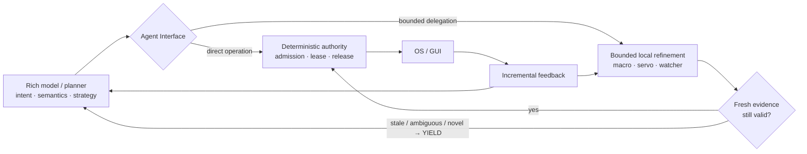

# Agent Interface

**A faster interface between AI agents and computers.**

> **Research thesis:** AI agents are becoming highly capable, but the computer-control tools they use are still primitive. If the model is held fixed, a better interface should let the same agent use computers with less waiting, fewer redundant observations, fewer model boundaries, and less recovery work at the same correctness.

> **Status: Research Preview.** This repository is the public research record. User-facing GitHub Releases are reserved for runnable distributions people can actually download and try.

[Landing page](https://unjuno.github.io/agent-interface/) · [Docs](docs/README.md) · [Research](RESEARCH.md) · [Architecture](docs/architecture.md) · [Roadmap](ROADMAP.md) · [Runtime](runtime/README.md) · [Contribute](CONTRIBUTING.md)

## What this project is

Agent Interface holds the model fixed and asks whether a better computer interface can reduce avoidable waiting and repeated work without weakening correctness.

- The rich model keeps semantic intent and strategy.
- Bounded local mechanisms handle high-frequency refinement, verification, and invalidation when they can do so safely.
- Fresh evidence governs authority; stale, ambiguous, or novel state must yield back to stronger reasoning.
- Universal computer control remains the fallback floor when optimized routes are unavailable.

## System shape



## Start here

| Need | Canonical place |
|---|---|
| Current research direction | [Current goal](docs/CURRENT_GOAL.md) |
| What has been measured and what remains open | [Progress from baseline](docs/PROGRESS_FROM_BASELINE.md) |
| Current architecture | [Architecture](docs/architecture.md) |
| Detailed evidence ledger | [Research index](RESEARCH.md) |
| Analysis vs experiment workflow | [Research method](docs/RESEARCH_METHOD.md) |
| Relationship between evidence, runtime, and release | [Evidence map](docs/EVIDENCE_MAP.md) |
| Use the current action/image interface | [Current interface guide](runtime/USING_CURRENT_INTERFACE.md) |
| Public API/CLI/MCP integration and remaining gaps | [Public transport handoff](docs/PUBLIC_TRANSPORT_HANDOFF_2026-09-20.md) |
| Runnable construction preview | [Runtime](runtime/README.md) |
| User-facing release boundary | [Release contract](release/README.md) |

## Research method

Questions that are exactly determined by contracts, invariants, finite state spaces, or reference oracles are reduced analytically first. Experiments are reserved for the residual that depends on real operating systems, applications, models, timing distributions, workloads, or other environment-dependent behavior.

The clean comparison keeps model, task, environment, and correctness requirement fixed while changing only the interface. See [Research method](docs/RESEARCH_METHOD.md).

## Evidence and scope

This repository contains analytical results, controlled experiments, live GUI studies, retained failures, audits, and integration work. A component PASS is not automatically an integrated PASS or product claim.

- Evidence ledger: [RESEARCH.md](RESEARCH.md)
- Research workspace: [research/README.md](research/README.md)
- Analytical research: [research/analysis/README.md](research/analysis/README.md)
- Latest detailed handoff: [docs/LOCAL_RESEARCH_HANDOFF.md](docs/LOCAL_RESEARCH_HANDOFF.md)
- Terminology and status words: [docs/TERMINOLOGY.md](docs/TERMINOLOGY.md)

Current evidence remains scoped. Broad human-tempo computer use, stable cross-platform runtime semantics, and a finished user-facing distribution are not established by this repository.

## Repository layout

```text
.
├── README.md              # public entry point
├── RESEARCH.md            # detailed evidence ledger
├── ROADMAP.md             # research and release sequence
├── docs/                  # current goal, architecture, method, evidence map
├── research/              # analysis, experiments, raw evidence, retained failures
├── runtime/               # promoted executable semantics and runnable preview
├── release/               # packaging and release-readiness evidence
└── site/                  # public presentation layer
```

Completed evidence paths are generally kept stable for provenance; navigation is added around them instead of cosmetically moving historical artifacts.

## Reproduce and contribute

Research harnesses can inject real input. Use an isolated session or disposable environment and follow the specific experiment's instructions.

```bash
python -m pip install -r research/requirements.txt
```

Design ideas and analytical or empirical research proposals are welcome. See [CONTRIBUTING.md](CONTRIBUTING.md) and the [Idea issue form](https://github.com/Unjuno/agent-interface/issues/new?template=idea.yml).

## More detail

The previous extended root README material is retained in [docs/PUBLIC_README_DETAILS.md](docs/PUBLIC_README_DETAILS.md). It is kept for continuity and provenance, not as the recommended starting point.

## License

Apache License 2.0. See [LICENSE](LICENSE).
