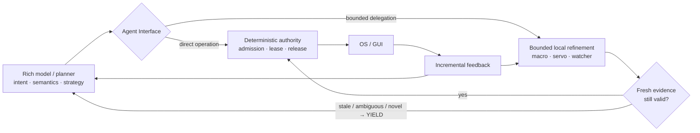

# Agent Interface

**A faster interface between AI agents and computers.**

> **Research thesis:** AI agents are becoming highly capable, but the computer-control tools they use are still primitive. If the model is held fixed, a better interface should let the same agent use computers with less waiting, fewer redundant observations, fewer model boundaries, and less recovery work at the same correctness.

> **Status: Research Preview.** This repository is the public research record. User-facing GitHub Releases will be reserved for runnable distributions that people can actually download and try.

[Landing page](https://unjuno.github.io/agent-interface/) · [Principles](docs/principles.md) · [Research index](RESEARCH.md) · [Architecture](docs/architecture.md) · [Roadmap](ROADMAP.md) · [Open an idea](https://github.com/Unjuno/agent-interface/issues/new?template=idea.yml)

Current progress from the initial baseline: [achieved capabilities, measured
bottlenecks and remaining release gates](docs/PROGRESS_FROM_BASELINE.md).

Latest research handoff: [measured progress, failures and next steps](docs/LOCAL_RESEARCH_HANDOFF.md).

Current Linux research caller: [components, usage and evidence limits](research/live_control/CURRENT_CLIENT.md).

## Project at a glance

| | |
|---|---|
| **Goal** | Keep the model fixed and improve the computer interface: less waiting, fewer redundant observations, fewer unnecessary model boundaries, and less recovery work at the same correctness. |
| **Current design invariant** | Preserve rich-model intent; localize the high-frequency refinement loop. |
| **Control model** | Rich model for semantics/strategy; bounded local macro/servo/watcher execution for high-cadence refinement; fresh evidence and explicit YIELD at the authority boundary. |
| **Current status** | Research Preview. The repository is an evidence record; user-facing Releases are reserved for runnable distributions. |
| **Main evidence environment** | Linux/X11 research harnesses, with scoped live GUI, recovery, observation, concurrency, and DOOM studies. |
| **Release posture** | Component PASS is not an integrated PASS. Broad human-tempo, cross-platform, and stable-runtime claims remain open. |

## System shape



## Where to start

| If you want to… | Read |
|---|---|
| Understand the thesis | [Principles](docs/principles.md) |
| See the current architecture | [Architecture](docs/architecture.md) |
| See the current research goal | [Current goal](docs/CURRENT_GOAL.md) |
| Check measured progress and remaining gates | [Progress from baseline](docs/PROGRESS_FROM_BASELINE.md) |
| Inspect the evidence ledger | [Research index](RESEARCH.md) |
| Follow the latest handoff and failures | [Local research handoff](docs/LOCAL_RESEARCH_HANDOFF.md) |
| Try the runnable construction preview | [Runtime preview](runtime/README.md) |
| See what must happen before release | [Roadmap](ROADMAP.md) and [release contract](release/README.md) |

## The hypothesis

Most computer-use systems still resemble:

```text
model -> one action -> screenshot -> model -> one action -> screenshot -> ...
```

Agent Interface asks whether the interface, not only the model, is now a major bottleneck:

```text
strong planner
    -> semantic method / short reactive program
    -> guarded local execution
    -> immediate useful feedback
    -> observe only meaningful change
    -> deoptimize only the stale layer
    -> return to the model when semantics require it
```

The clean experiment is simple:

```text
same model
same task
same environment
same correctness requirement

only the interface changes
```

Then measure model boundaries, serialization, observation cost, latency, retries, recovery, and eventually real token use separately.

## Component principles

The eventual tool should satisfy four constraints from the start:

1. **Install quickly.** A user should be able to install or unpack it, start it, connect an agent, and use it without app-specific setup.
2. **Work with every agent.** The core should be model- and vendor-agnostic. Model-specific adapters belong outside the runtime core.
3. **Do not stop the agent's thinking.** After an action, return the earliest trustworthy feedback instead of blocking on fixed waits or unnecessarily complete observations. Reduce **agent idle time**.
4. **React locally.** Input delivery, state-change detection, local verification, retry, and fine motor correction should stay in the local fast path when they do not require semantic reasoning.

Full rationale: [`docs/principles.md`](docs/principles.md).

## Ideas shaping the system

| Idea | Why it exists | Expected effect | State |
|---|---|---|---|
| **Universal fallback** | Optimizations must never be required for basic correctness | Unknown apps still work | Baseline |
| **Self-compiling semantic methods** | Repeated successful traces should not be replanned forever | Fewer model turns / less serialization | Baseline |
| **Layered lifetimes** | A stale coordinate, binding, or visual cache does not imply the task meaning changed | Less relearning | Promoted |
| **Guarded Hierarchical Deoptimization** | Predictably stale fast paths should be skipped before failure | Better reliability / lower tail latency | Promoted |
| **Latest-only visual state** | Old frames are not extra evidence about the current GUI | Less stale-state processing | Runtime principle |
| **Event-driven observation** | Polling without state change creates work but no information | Fewer captures / faster feedback | Experimental baseline |
| **Observation gating** | An unchanged or irrelevant screen should not consume another model-visible image | Lower visual/token cost | Active research |
| **Visual delta / changed-region feedback** | A small local change does not justify resending the whole frame | Lower visual bandwidth | Active research |
| **Local verification** | Deterministic postconditions do not always need model interpretation | Fewer model escalations | Active design |
| **Input delivery semantics** | Sending an OS event is not the same as application consumption | Higher correctness | Measured |
| **Closed-loop motor control** | Pointer movement and on-screen movement are not always identical | Better fine control | Experimental |

## Current evidence

These are scoped research measurements, not production claims.

| Experiment | Result | Scope |
|---|---:|---|
| Sparse reactive control | B1 reached 8/8 success on XTerm, Chromium, Calc, and Inkscape in the development screen | Linux/X11, small `n=8/app` |
| Route-level deoptimization | Inkscape observation reduced **51.9%** and planner-byte proxy **27.8%** vs method invalidation | 72 hidden episodes |
| XTerm focus guard | p99 reduced about **77.5%** | 72 hidden episodes |
| Chromium geometry guard | p99 reduced about **75.4%** | 72 hidden episodes |
| Layered binding + route guards | 72/72 success with predictable stale-route execution eliminated before execution | Chromium drift + process replacement |
| Exact unchanged-frame suppression (O1) | 96/96 tasks per strategy; 17.15% same-trace image reduction; zero false suppressions | [Four real apps, 24 fresh pairs/app](research/observation_gating/REPORT.md); scripted controller, no model/token measurement; local speedup unproven |
| Exact tile transport (O2) | 32/32 tasks per strategy; 70.73% same-trace serialized-byte reduction; 553 exact frames | [Four apps, 8 fresh pairs/app](research/observation_tiles/REPORT.md); reconstructed full images, no token saving or local speedup established |
| Assistant-operated research interface | Calc, Inkscape and XTerm tasks completed through reconstructed images; feedback wait and PNG-reference reuse exercised | [Three exploratory sessions](research/observation_tiles/DEVELOPMENT.md), not a controlled model performance comparison |

Raw reports and CSVs are under [`research/`](research/). `planner bytes` are not tokens, `observed pixels` are not image tokens, and local wall time is not model-in-loop latency.

## Repository map

```text
.
├── README.md              # public project entry point
├── RESEARCH.md            # detailed evidence ledger
├── ROADMAP.md             # research and release sequence
├── docs/
│   └── README.md          # documentation map and canonical status links
├── research/
│   └── README.md          # experimental workspace map; reports/evidence live below it
├── runtime/
│   └── README.md          # runnable construction preview and runtime entry points
├── release/
│   └── README.md          # user-facing release contract and readiness boundary
├── site/                  # GitHub Pages landing/proof pages
└── .github/               # issue templates and repository workflows
```

Use [`docs/README.md`](docs/README.md) for the documentation map and [`research/README.md`](research/README.md) for the experimental workspace. The large number of retained experiment directories is intentional: failed, stopped, superseded, and scoped results remain available for provenance.

## Reproducing the research

Current real-app harnesses target Linux/X11 and can inject real keyboard and pointer input. Use an isolated X session or disposable container.

```bash
python -m pip install -r research/requirements.txt
python research/real_apps_v1/real_app_suite_v1.py --help
```

Read [`RESEARCH.md`](RESEARCH.md) before interpreting benchmark numbers.

## Ideas and contributions

This project explicitly accepts design ideas, not only bug reports.

If you can remove unnecessary observations, model calls, serialization, retries, latency, or fragile assumptions **without removing information the agent needs**, open an [Idea issue](https://github.com/Unjuno/agent-interface/issues/new?template=idea.yml).

A useful idea can be simple:

1. What work or information flow is wasteful today?
2. What is the smallest mechanism that removes it?
3. Why should correctness or precision be preserved or improved?

If it is mature enough to benchmark, use the stricter [Research proposal](https://github.com/Unjuno/agent-interface/issues/new?template=research-proposal.yml) form.

## Repository vs Releases

- **Repository:** research, experiments, rejected ideas, benchmarks, design notes, and evolving implementation work.
- **GitHub Releases:** future runnable distributions a user can download, install/unpack, and actually try.
- **Historical `v0.0.1-research.*` tags:** archival snapshots created while bootstrapping the public research record; not the target user-distribution format.

The user-release contract is documented in [`release/README.md`](release/README.md).

## What is not proven yet

- Cross-platform generality beyond current Linux/X11 evidence.
- Production-grade automatic method discovery.
- Broad end-to-end model/token savings beyond the first scoped evidence-presentation result.
- Stable runtime/API semantics.
- A finished user-facing runtime distribution.

Python remains the experimentation vehicle while semantics are changing quickly. A lower-level production implementation comes after the algorithmic boundary stabilizes.

## Research discipline

Every promoted change should define H/T/D/C/U: hypothesis, minimum test, decision rule, competing explanation, and uncertainty. Correctness is a hard gate. Small noisy wins are not promotions. Negative results remain part of the record.

See [`CONTRIBUTING.md`](CONTRIBUTING.md).

## License

Apache License 2.0. See [`LICENSE`](LICENSE).

## Detailed research record

The complete retained narrative remains in this README for auditability, but is collapsed by default so the public entry point stays scannable. The underlying claims, numbers, caveats, and links below are unchanged.

<details>
<summary><strong>Expand the retained research narrative</strong></summary>

Runnable construction preview: [golden desktop demo](runtime/README.md). The
one-command WSLg path checks its environment, audits the frozen comparison, or
runs a fresh persistent six-task workflow. The current v3 path keeps two image-
grounding turns on one minimized app-server thread. Its first frozen run completes
6/6 exact tasks with cold compilation, warm reuse, stale-reference refusal,
bounded repair, post-repair reuse and57/57 verified releases; see the scoped
[v3 report](runtime/GOLDEN_DESKTOP_DEMO_V3.md).

The first fresh compiled-interface GUI pair now crosses two local
observe/action transitions without a frontier-model resumption.  On a private
Chromium form, the positive path enters exact `t991025`, selects Submit only
after fresh field-change and target evidence, and passes the independent POST
scorer.  Its action-to-feedback intervals are773.005ms and568.488ms; first action
to semantic completion is1.855s.  A paired page-change case completes one action,
issues no Submit, and carries `unknown_state`, one completed action and confirmed
partial delivery through adaptive caller v2.  Two Luna-low calls report18,792
input tokens.  Failed v1-v3 allocations remain preserved; v4 exposed the typed-
reason loss and v5 repairs it.  One pair supplies mechanics evidence only, with no
rate, speedup, token-saving or human-tempo claim.  See
[compiled GUI interface live v5](research/live_control/COMPILED_GUI_INTERFACE_LIVE_V5.md).

A matched live Inkscape study now measures when a client can understand useful
post-action feedback. Across eight fresh same-seed sessions in balanced order,
the ordinary exact-PNG path reaches semantic readiness at a287.757ms median;
an action-scoped no-authority probe over the already reconstructed frame reaches
238.038ms, a49.718ms reduction. All8 selections independently pass, use the same
click+observe program and two client exchanges, and finish with empty input.
Frame results later reconcile exactly to durable PNGs. The first allocation is
retained failed for applying the candidate's first-feedback bound to the baseline;
the separately frozen repair changes only that health bound. This is one scripted
Inkscape predicate with no model, token, broad speed or human-tempo claim. See
[release-aware preparation](research/live_control/RELEASE_AWARE_PREPARATION_V1.md).

The matched semantic-repair sequence retains an upstream-capacity v1 failure and
a v2 stale-source refusal. V3 adds one post-model passive exact observation and
current patch revalidation. All four fresh Chromium arms then independently save
the exact token and release input. Cached local repair reaches recovery in a
109.966ms median with9,351 input tokens, versus8,115.268ms and18,702 tokens for
Luna-low visual reacquisition: differences of8,005.302ms and9,351 tokens on this
calibrated resize fixture. Six calls are fully accounted and189 files audit on
Windows/WSL. This is bounded same-task evidence, not a general speed or token
claim. See the
[matched semantic repair report](research/live_control/MATCHED_SEMANTIC_REPAIR_V1.md).

Adaptive acquisition caller v3 now expresses that measured local-first policy in
one shared route. It can try one no-authority zero-model repair and sends only
configured missing, ambiguous or changed evidence to an accounted model fallback.
After fallback inference it requires a later exact observation tied to the model
call before ordinary input admission. Ten direct tests and a seven-scenario
retained audit pass on Windows/WSL with no fresh GUI or model call. This is
integration mechanics; the following v2 study supplies its first natural live
caller run. See
[adaptive caller v3](research/live_control/ADAPTIVE_ACQUISITION_CALLER_V3.md).

That shared route now passes its first real two-case integration. A -120px
Chromium resize takes the zero-repair-call local path; a real Save hover changes
the patch, produces local `missing`, invokes one Luna-low fallback, and requires a
later call-bound target match before input. Both seed217 cases save the exact
token, reach useful feedback about248–249ms after Submit admission and release
all input. Total inputs are9,348 and18,696 tokens, but the mutations differ, so
these are not comparative savings. V1's safe pre-action gate failure remains
retained. See [adaptive semantic repair live v2](research/live_control/ADAPTIVE_SEMANTIC_REPAIR_LIVE_V2.md).

The two resulting target crops now have a common action-grounded memory receipt.
Each 42x18 artifact is bound to its exact source observation and target hash,
the admitted Submit program and verified empty release, the first reconciled
successful effect and independent output, and its full local/model recovery
trace. Matching retrieval still requires a current exact observation, target
revalidation and fresh input admission. This retrospective construction made no
new model calls and does not show a memory benefit; it prepares the held-out
crop/full-frame/no-memory comparison. See [action-grounded visual memory v1](research/live_control/ACTION_GROUNDED_VISUAL_MEMORY_V1.md).

That frozen comparison has now run once on three actual Chromium target/decoy
states. No-memory, prior-full-frame and action-crop arms each complete3/3 exact
submissions with zero wrong target and verified release. Actual input is28,035,
31,791 and28,188 tokens respectively: crop uses3,603 fewer tokens than full
history at equal correctness, while no-memory is still153 tokens lower and also
perfect. The crop arm rejects its old appearance as misleading in the trap case.
This makes crop eligible as a conditional replacement for full history, while
current-only remains the default when sufficient. See the [live memory ablation](research/live_control/ACTION_GROUNDED_MEMORY_ABLATION_LIVE_V1.md).


An archived OpenTTD cross-domain test changes the crop decision: two road
effects were independently verified from the game engine, then classified
using the same exact current screens under no memory, full pre/post frames and
bounded action-effect crops. Current-only/full each got2/2; the crop got1/2,
falsely contradicting A→B. Input was18,736/23,748/19,424 tokens respectively.
The crop costs less than full history, but its correctness regression means it
does not transfer into the shared client. The failed condition and all raw
calls are retained for a later history-needed, occlusion-cleared revisit. See
the [OpenTTD effect memory ablation](research/live_control/OPENTTD_EFFECT_MEMORY_ABLATION_V1.md).

The newest held-out OpenTTD toolbar study removes the answer coordinate from the
candidate path. A first preregistered pair is retained failed: Luna-low calls its
choice visually unambiguous, but its three points omit company finances and the
independent window oracle stays false. V2 uses the same model point only as a
coarse anchor, detects30 repeated toolbar slots from source pixels and probes a
fixed five-slot neighborhood in bounded3+2 batches. Its association fault stops
before the second model call and target input; stable binds receipt5 at `[485,51]`,
rehovers the same tooltip, clicks through ordinary admission and independently
opens finances. The v2 calls report9,296+10,178 input tokens and take33.920s to
independent evaluation; the hover batches alone take6.400s. All126 v1/v2 frames
audit exactly on Windows/WSL. This is an accuracy/recovery candidate for one
OpenTTD toolbar, with no general grounding, token or speed claim. See
[model-proposed active evidence](research/live_control/OPENTTD_ACTIVE_EVIDENCE_V2.md).

The first scoped target-handle allocation is a retained negative result. A
runtime-owned textured OpenTTD region survives a same-session X11 surface move:
fresh binding revalidation observes the window manager's actual `[17,20]`
translation, derives `[837,71]` from a handle offset, and passes the click through
ordinary owner admission in280.790ms with verified release. The preregistered
endpoint incorrectly expected the requested `[16,0]` move, and the run has no
independent semantic task effect, so the candidate remains on hold. An earlier
flat-region archive attempt also aliases and is preserved. See
[scoped target handles](research/live_control/SCOPED_TARGET_HANDLES_V1.md).

A preregistered matched Chromium follow-up then passes both directions. After a
real client move, the positive handle derives the Save button from observed
binding delta and independently submits exact `t991005`; input ack to useful
frame is60.016ms and to independent semantic completion192.643ms. After the same
mint and move, navigating the same surface to `about:blank` returns `MISSING`, admits
zero pointer input and creates no submission. All36 frames audit exactly across
Windows/WSL. Box/frame authorship and model-boundary savings remain unproven, so
this advances only to another matched-domain replication.

The first Luna-low model-facing screen preserves strict action correctness4/4,
but fails its preregistered token gate. Two coordinate calls report12,583 input
tokens each; two no-image handle calls report11,332 and54,244, with42,240 cached
in the latter. The identical-prompt variance means the current CLI context is not
controlled enough to claim image/token savings. That result is retained without
retry and required the tighter caller tested below. See
[target-handle model screen](research/live_control/TARGET_HANDLE_MODEL_SCREEN_V1.md).

A controlled-context follow-up repairs the measurement path and then executes
four fresh Chromium sessions. Image-coordinate and no-image alias-handle arms
both independently save2/2. Reported input is9,280 per coordinate call and8,013
per handle call, a1,267-token descriptive reduction with zero within-arm
variance. The handle arm queries current status read-only, revalidates again
after model wait, and releases all input;62 exact frames audit cross-OS. Its
session alias repairs a retained2/2 unknown-handle failure caused by exposing
opaque random registry IDs. Handle adds two durable calls, only two cases/arm
exist, and the0.823s mean timing difference is not a causal speedup. See
[target-handle live ABBA](research/live_control/TARGET_HANDLE_MODEL_LIVE_ABBA_V1.md).

The extra read-only handle query is now combined with fresh capture in one bounded
operation. A preregistered scripted Chromium pair independently saves2/2 while
`observe_target_handle` binds its result to the exact returned observation and
reduces durable calls from14 to12 versus separate observe/query. All29 frames
replay cross-OS. The202.583/365.441ms workflow values are one sample per arm and
do not establish causal latency; no model or token call occurs here. A fresh
OpenTTD transfer then resolves Road Construction through the same operation and
completes the five-tile L; all four independent engine checks pass over37 exact
frames. This remains scripted, development-known geometry. See
[combined observe-target](research/live_control/OBSERVE_TARGET_HANDLE_V1.md).

A fresh same-prompt Luna-low pair then integrates the combined operation at the
model boundary. Both calls return the strict alias action at8,013 input tokens.
Stable independently saves and uses14 durable calls, versus16 in the prior
separate-query handle cases. After the other model call, navigating the same
surface to `about:blank` makes admission return `MISSING`; the proposed target
click receives zero pointer admissions and no submission exists. The pair adds37
exact cross-OS frames. This is one known form and does not establish broad token
or latency improvement.

The next preregistered pair removes the caller-authored absolute target box from
that known form. Luna-low identifies Save at point `[270,243]` in both current
screens. `target_handle_mint_from_point` derives a24x14 region and mints the
private-ID-backed alias only after an exact fresh patch check. Stable follows an
observed `[20,8]` surface move, resolves `[290,251]` and independently saves exact
`t991014`. In the paired post-model `about:blank` change, the source/current patch
digests differ, so no handle is created, zero target pointer input is admitted and
the program stops `needs_decision`. All35 frames and patch digests audit on
Windows/WSL. Post-hoc review also finds that the prompt requests absolute
screenshot coordinates while task code assigns the `window_content`
transformation frame. Region and frame authorship remain caller-controlled and
the evidence covers one known button, so promotion is held; this is not general
visual identity or a speed/token claim. See
[model-point target derivation](research/live_control/MODEL_POINT_TARGET_V1.md).

A corrected contract now makes the model author the missing semantics. In two
fresh seed991015 sessions, Luna-low returns point space
`source_observation_pixels`, point `[270,243]` and motion model
`surface_origin_translation`2/2 at9,264/9,265 reported input tokens. Stable
follows the same `[20,8]` surface move and independently saves `t991015`; the
post-model changed page again refuses before handle creation with zero target
pointer input. All36 frames audit cross-OS. Stable takes8.343s from decision start
to independent evaluation, including7.446s in the model call; one episode and a
scripted final click establish no speedup. The fixed24x14 region and known button
remain. See [explicit point and motion contract](research/live_control/POINT_TARGET_CONTRACT_V2.md).

The first cross-domain transfer of that contract is a retained OpenTTD failure.
Two identical Luna-low tasks author the correct source-pixel and surface-motion
semantics, but choose toolbar points `[650,51]` and `[432,51]` instead of the
independently known Road Construction target `[820,51]`. The stable wrong-icon
handle still follows the window manager's actual `[21,28]` delta; a local
postcondition then stops before later mutation, with0 guard change and verified
release. The transient negative also mints the unrelated unchanged region rather
than refusing. All62 frames and patch digests audit on Windows/WSL. Direct
full-frame semantic grounding is0/2, so the next candidate adds bounded delayed
hover labels for a fixed icon set. See
[OpenTTD point-contract transfer](research/live_control/OPENTTD_POINT_CONTRACT_V1.md).

Bounded active hover evidence repairs that known semantic target in a
preregistered follow-up. Exact persistent tooltip observations identify three
fixed toolbar candidates; Luna-low selects Road Construction at `[820,51]` in
all three hover-enabled calls. The first run is preserved because it mistakenly
made the hover highlight part of target identity and safely stopped after the
highlight disappeared. The corrected pair clears hover, proves the original
24x14 patch is restored, and mints from that persistent source. Its negative
rehover case returns `MISSING` before any target click; its stable case follows
an actual `[21,28]` surface move, resolves `[841,79]`, completes the guarded L,
and passes all four independent engine checks. The 81 corrected frames audit on
Windows/WSL. Input rises from the failed direct baseline's 9,296 to
9,935--9,936 tokens and active hover adds about 3.6s, so this is an accuracy and
recovery result rather than a speedup. Candidates remain development-known. See
[OpenTTD hover target rebase](research/live_control/OPENTTD_HOVER_TARGET_REBASE_V1.md).

Frame resolution now runs inside the candidate interface. A fresh1152x720
OpenTTD pair sends only original1024 coordinates plus explicit frame identity;
the runtime resolves clicks, drags and condition boxes from the latest pointer
binding. Repeat stops and target completes2/2 against the independent engine
score over69 exact frames. A separate post-admission X11 move changes geometry
before the first click; InputOwner refuses it with zero pointer admissions in
105.333ms submit-to-terminal time. This is a scoped correctness and recovery
boundary, with no speed or automatic-frame claim. See
[live framed pointer intents](research/live_control/FRAMED_POINTER_INTENTS_V1.md).

OpenTTD resolution transfer now exposes and repairs a coordinate-frame error.
Two preregistered global translations fail and remain preserved: application
chrome and saved map content do not share one transform. Separating screen-fixed
toolbar controls from window-relative viewport paths then passes target/repeat
pairs at1280x720 and an unobserved1152x720 replication4/4. The path-derived
conditions agree with the independent engine score, and all265 frames across
failures and corrected studies replay exactly on Windows/WSL. A strict pure
coordinate-frame API records the distinction. The task still uses one known save
and scripted paths, with2.46–2.60s local feedback. See
[OpenTTD coordinate frames](research/live_control/OPENTTD_COORDINATE_FRAMES_V1.md).

The newest OpenTTD study removes one manual condition-authoring step: disjoint
target and guard boxes are derived directly from the already admitted two-segment
pointer path. Frozen-frame calibration classifies unchanged, first-segment and
later-segment states3/3. On fresh seed991004, a preregistered `-16px` negative
fails as an experimental control because OpenTTD snaps it onto the same correct
tiles; the local condition and independent engine scorer both report success.
A separately preregistered completed-segment repeat is correctly stopped before
the second drag, with zero target change and independent score false. All106
fresh frames and lifecycle checks audit cross-OS. The path remains development-
known and condition feedback takes about2.5s, so held-out geometry and human
tempo remain open. See [path-derived OpenTTD geometry](research/live_control/OPENTTD_TARGET_GUARD_DERIVED_GEOMETRY_V1.md).

A fresh OpenTTD transfer now tests the placement target/guard condition against
the independent engine scorer. The first preregistered pair retains a missing-
toolbar-opener driver failure and safely stops both allocations. Adding only that
one click passes a wrong-row/target pair; an unchanged reverse-order replication
passes again. Target admits the second L segment and independently completes2/2;
wrong-row stops before it2/2. All119 corrected exact frames and lifecycle checks
audit cross-OS. This is a same-seed scripted candidate with human-authored boxes,
about2.5s to the local condition and no model/token/human-speed claim. See
[fresh OpenTTD target/guard continuation](research/live_control/OPENTTD_TARGET_GUARD_LIVE_V1.md).

The first preregistered live bounded-effect allocation now completes the OpenTTD
five-tile L objective. After the first drag, the interface appends path-local
before/after/difference panels below the current full frame. Fixed Astra recognizes
A-to-B, proceeds directly to B-to-C and passes the independent guard in7 turns,
116,879 input tokens and109.034s. The retained v6 baseline used12 turns/199,613
tokens, repeated A-to-B twice and failed. This is one sequential same-task result;
retain for replication, with no causal percentage or general speed claim. See
[live effect evidence](research/live_control/OPENTTD_EFFECT_LIVE_V1.md).

An unchanged preregistered replication then builds A-to-B once but cannot resolve
the effect beneath sign/transient occlusion. It performs two observation-only
inspections and safely stops on turn8, with no repeated A-to-B mutation. The
candidate is now1/2 for same-task hard success and2/2 for preventing that repeated
completed-segment drag, so it remains HOLD. The run also exposes and repairs a
finish classifier that mislabeled typed safe stop as a turn limit. See
[effect replication](research/live_control/OPENTTD_EFFECT_REPLICATION_V2.md).

The diagnosed presentation boundary discarded the original drag evidence after
each inspection-only turn. A bounded effect-memory candidate now carries one
unresolved drag as original before/after, latest inspection and action difference.
In two preregistered archived v8 contexts, the raw outputs are uncertain2/2 while
new Astra-medium samples with memory classify observed2/2 and choose the same
B-to-C continuation. Input rises764 tokens across the two calls. This is a fixed-
context signal for a fresh live test, not promotion or a correctness claim. See
[bounded effect memory](research/live_control/OPENTTD_EFFECT_MEMORY_V1.md).

The first preregistered fresh live allocation of that memory independently passes
the five-tile L score. It inspects once after each of two distinct drags, carries
the matching effect across both inspection boundaries and verifies on turn9.
There are zero repeated completed-segment drags and all17 terminals release input.
The episode costs151,853 input tokens and153.027s to semantic completion, slower
than v7. Retain for unchanged replication; do not promote. See
[live bounded effect memory](research/live_control/OPENTTD_EFFECT_MEMORY_LIVE_V1.md).
An unchanged preregistered replication follows the same two inspect/resolve
boundaries and independently succeeds on turn9. The live memory candidate is now
2/2 hard success and2/2 zero completed-segment repeats. V10 uses151,842 input
tokens and160.837s, so the speed deficit remains. Advance to changed geometry,
without promotion. See [memory replication](research/live_control/OPENTTD_EFFECT_MEMORY_REPLICATION_V2.md).

The first changed-geometry allocation uses a new seed991004 save and moves the
five-tile L contract to tiles684,685,686,750,814. The two distinct drags complete
the task with zero surrounding changes and zero repeated completed-segment input,
but Astra needs five inspection turns to accept the first effect and leaves the
second uncertain at the12-turn bound. The independent engine score succeeds;
controller-verified hard success does not, and semantic completion time is not
recorded. The run uses204,114 input tokens,195.604s model wait and50 durable
calls. A separate selector repairs the discovered result/failure filename
assumption in offline cross-OS controls. Hold the memory candidate and repair
completion feedback before another live geometry run. See
[changed L geometry](research/live_control/OPENTTD_EFFECT_MEMORY_GEOMETRY_V3.md).

A preregistered fixed-context follow-up rejects the first pixel-only effect
receipt prompt. Exact-prompt Astra recognizes the retained road effect2/2,
while the receipt condition remains uncertain2/2 and adds156 input tokens per
call. No live action is run. The next candidate will use an agent-authored visual
postcondition as a local in-program barrier, separate from input authority. See
[persistent visual-effect receipt](research/live_control/PERSISTENT_EFFECT_RECEIPT_V1.md).

The first local in-program form is also rejected by a fresh X11 correctness
control. It requests a24px Inkscape move but reaches12px; a single-ROI threshold
still counts163 persistent pixels and starts the later Save step. The paired
unmet condition correctly stops before Save, and all input releases verify.
Changed-pixel totals remain advisory only; continuation requires a task-relative
visual condition. See
[local visual continuation barrier](research/live_control/LOCAL_VISUAL_BARRIER_V1.md).

A target-relative replacement then passes one fresh X11 met/partial pair. After
bounded settling, two immutable-anchor samples admit Save for an independently
reconstructed24px move and stop before Save for a20px partial move. The target
SVG preserves the requested displacement;18 frames and both release terminals
audit cross-OS. This covers scripted object displacement only; whether a model
can author the condition remains untested. See
[local displacement postcondition](research/live_control/LOCAL_DISPLACEMENT_POSTCONDITION_V1.md).

In a preregistered fixed-context follow-up, Luna-low and Astra-medium each author
a strict source patch2/2. All four conditions accept retained24px samples and
reject20px samples. The prompt fixes most fields and no GUI input occurs, so this
is an authorship signal for a fresh live transfer rather than promotion. See
[model-authored displacement condition](research/live_control/LOCAL_DISPLACEMENT_AUTHORSHIP_V1.md).

The unchanged first Luna patch now passes two opposite-order fresh X11
target/partial pairs. Target24px admits Save2/2 and partial20px stops before
Save2/2. All38 exact frames, canonical authored identity, saved SVGs and input
releases audit cross-OS. A line-ending-sensitive preregistration failure is
retained before input. Promote only as a same-task moved-object local condition;
pointer paths are scripted and the model call is outside the live episode. See
[fresh authored-condition transfer](research/live_control/LOCAL_DISPLACEMENT_TRANSFER_V1.md).

A placement-specific target/guard operator now separates required change from
forbidden change inside a bounded program. Its first archived allocation exposes
two false stops caused by pre-effect sampling, so the runtime now requires a
bounded settle immediately before evaluation. The unchanged boxes and thresholds
then classify six engine-diagnosed OpenTTD effects6/6: three first segments, two
completed-segment repeats and one guard mutation. A fresh scripted Inkscape
target/partial/guard allocation passes3/3 after one retained focus interruption;
28 exact frames, SVG state and releases audit cross-OS. Fresh OpenTTD transfer
and reverse-order replication are recorded above. See
[local target-and-guard postcondition](research/live_control/LOCAL_TARGET_GUARD_POSTCONDITION_V1.md).

Process-scoped timing envelopes now cover fresh Calc and OpenTTD tasks. Calc
saves 480/192 in 23.976s with 21.334s of wrapper-observed model wait. OpenTTD uses
batched delayed-hover contact sheets and an adaptive two-Luna/six-Astra route to
build a guarded three-tile road in111.853s with91.781s of model wait and126,420
reported input tokens. The OpenTTD task independently succeeds in two fresh
runs, although the first run exposed a result-schema packaging failure after
the positive score. Two matched blocks find fixed Astra2/2, adaptive1/2 and fixed
Luna0/2. A third fixed-Astra episode passes in92.377s with6 calls, taking its
same-task record to3/3. The second adaptive run falsely declares visual completion
before the independent score fails. A fresh v3 control now preserves that negative
score as a typed failure instead of an assertion. Different task allocations and
a human control remain before any route or speed claim. A preregistered fourth
fixed-Astra episode changes the initial UI by pre-opening Road Construction and
passes in89.272s with6 calls/97,696 input tokens. It removes toolbar discovery
but still uses the same number of model turns and durable calls because targeting
confirmation expands. This is one changed UI state, not a speedup or new-geometry
result. A subsequent preregistered seed-991002 task moves the engine contract
from tiles678..680 to465..467 and shifts the visible target. Fixed Astra passes
in89.097s, but uses7 turns,114,177 input tokens,32 frames and24 durable calls:
more interface work than the prior geometry despite a shorter sampled wall time.
The geometry-derived scorer is retained; no speed or general-route claim follows.
The next seed-991003 allocation changes the objective to a five-tile L with two
directional segments and a shared corner. Its fixture and negative control pass,
but the first preregistered Astra allocation stops before pointer input when its
new driver violates the durable journal identity contract. That harness failure
is retained without retry. A separately preregistered corrected allocation runs
eight actions, but Astra falsely verifies completion after 148.339s and 146,736
reported input tokens. The B-to-C leg is correct; the A-to-B leg is empty and a
four-tile road appears one map row above it. The route is rejected.
A checkpointed allocation prevents the second mutation and false verify, but
uses 11 turns/182,284 input tokens before an uncertain safe stop; it does not
complete the task. A model-free Ctrl+2 probe then makes the obstructing trees
transparent while independently preserving all road, owner and save state.
Exposing it as a typed method keeps a fresh allocation free of additional road
mutations, but Astra calls the toggle three times and safely stops on turn 12
after 198,746 input tokens without completing the task. Fresh scripted
calibration shows five nearby offsets build the intended A-to-B tiles and that
the tool state survives a 15-second program boundary. The next contract changes
the toggle into a one-way, state-aware pre-action view method.
The tracked pre-action OpenTTD view transition now has live evidence. It costs
428.854ms and adds no model boundary. Astra reaches a rejected verify in7 turns
and115,045 input tokens, down from v4's12/198,746, but again builds A-to-B one
row high. A follow-up adding only general sign-to-map-square semantics reaches
the12-turn limit with199,613 tokens and no verify or safe stop. Its formal finish
outcome is unavailable because the driver exits before consuming the limit
abort. A posthoc audit of263 continuous source-pinned observer records proves a
stable partial result: A-to-B is built, B-to-C remains empty and the model repeats
the same A-to-B drag twice. The failure is retained without retry; prose-only
anchoring is not promoted. See [effect-state diagnosis](research/live_control/OPENTTD_EFFECT_POSTHOC_V1.md).

The v6 limit-path evidence gap is repaired in driver v5: a model-free live probe
applies12 observe-only proposals, accepts the supervisor stop, emits an
independent `bounded_turn_limit` result and exits0. A separate zero-model view
study finds Ctrl+1 changes custom sign presentation on both seed991003 L and
held-out seed991002 straight geometry without changing scored task/save state.
Normal game progress contaminates full-frame difference counts, so this remains
an unpromoted paired-observation candidate pending a paused matched comparison.

The paused comparison now isolates1,151 changed pixels after a zero-change
stability frame. In a fixed Astra A/B/B/A targeting diagnostic, opaque and
transparent sign views both pass2/2 and each use30,572 input tokens. No
grounding or token benefit is detected, so the sign transform is not promoted.

The newest observation-boundary study physically withholds one live Chromium
region: full input reads the exact value 4/4 and redacted input preserves explicit
policy UNKNOWN 4/4. The region geometry audits exactly, but metadata adds 112
input tokens/call. A six-episode follow-up completes the adjacent visible Save
task in all three full/unmarked/explicit conditions with zero hidden-region
actions. A required-field mutation succeeds only with full evidence; both
redacted conditions stop with zero live input. A later same-prompt pair binds
the model proposal to its observation and policy version: a stable policy
executes and verifies, while a policy tightened after model return rejects the
model's actual edit proposal before any input. Crop/history/alternate-channel
bypass cases remain open. A subsequent scoped
refinement keeps the old value hidden but permits one exact whole replacement:
the unprivileged model call stops, the newly bound call executes and verifies,
and replay against the old policy is refused.
Pre-model bundle controls also refuse 13 crop/history/alternate-channel and
binding variants, while eight strict proposal controls exclude append, partial
selection and caller-supplied steps. These are scoped offline controls over the
live artifact, not a deployed privacy claim.
The assistant has used received-image references and bounded programs in Calc
and browser fixtures. An optional final-result read collected ready Calc early
and final evidence in one caller invocation, and skipped itself on a browser
direct-final result. These are small research episodes, not proof of general
speedup or human-like tempo; outer decision waits remain measured in seconds.

Recent recovery candidate: [bounded followup after input interruption](research/live_control/CALC_COMBINED_LIVE.md). In one actual Calc task, the caller collected short passive followups inside the original operation, avoiding two separate followup invocations while preserving interruption reasons and correct saved values. Socket round trips remained unchanged. This is an optional research path with report-compatibility work outstanding, not a general speed or token-saving claim.

</details>

## Latest integrated result

For the current direction and handoff, see [Current goal](docs/CURRENT_GOAL.md) and [Local research handoff](docs/LOCAL_RESEARCH_HANDOFF.md).

<details>
<summary><strong>Expand the integrated-result narrative</strong></summary>

The preregistered Issue #57 desktop comparison retains persistent compiled
control for this fixed workflow. Plain, ephemeral and persistent each complete
6/6 exact tasks; persistent refuses the invalid layout-A reference before input,
repairs once, and reaches measured token break-even at task 2. With fresh schema
acquisition charged, cumulative input is 63,128/63,779/26,563 and elapsed time is
56.412/73.238/44.131s. This is one finite allocation, not a general speed or
reliability claim. See
[`research/live_control/INTEGRATED_EFFICIENCY_LIVE_V1.md`](research/live_control/INTEGRATED_EFFICIENCY_LIVE_V1.md).

The frozen v39 MAP01 run repaired the unauthored empty-coast interruption loop:
at least one coast model answer completed despite health loss, while returned
actions still faced fresh immediate validity. Three of six model plans were
admitted. One active model plan was revoked after typed health dropped below
its six-point loss predicate; the matching input lease released keys/buttons
early and then closed at an empty terminal. Independent score was one kill,
zero deaths and no map exit. The first audit's PNG-count assumption failed on
one exact unchanged AIT reuse; a versioned pixel audit passes on Windows/WSL.
See [v39 coast liveness result](research/doom/MAP01_V39_COAST_LIVENESS_LIVE_V1.md).

The frozen v38 integrated MAP01 run admitted one schema-v6 model plan with an
exact `running-action-v3` program/lease binding. Four of six pending answers
were interrupted when health fell below unauthored empty-cover hard minima; one other active
answer failed fresh action validity before input. All seven accepted programs
released empty, and 119 early typed health/ammo observations reconciled with
the exact frames. The score was no kills, no deaths and no map exit. This
exposes the integrated interface path but leaves policy renewal and useful
control continuity open. See [v38 integrated live result](research/doom/MAP01_V38_INTEGRATED_LIVE_V1.md).

The frozen MAP01 schema-v6 endpoint preflight completed one real Luna-low
no-image request and accepted the response format. A separate six-decision
v32 live episode then exposed the final-admission race: five returned plans
were refused after policy invalidation, including one completed/eligible
answer whose cover source expired before input; one plan was accepted. All ten
cover/plan programs released empty, and independent scoring recorded one kill,
no death and no MAP01 exit after59.752s of advancing control. The result proves
the refusal boundary under this threat state while leaving useful live control
and MAP01 completion open. See [v32 live and schema-v6 preflight](research/doom/MAP01_V32_FINAL_ADMISSION_LIVE_V1.md).

The continuously advancing MAP01 showcase now has a bounded local reaction
path: one live `no_visible_effect` receipt admitted a model-authored fallback in
95.33 ms without another model call. The 12-decision run did not exit the map,
so this is mechanism evidence rather than a completion or general speed claim.
See [the contingency report](research/doom/MAP01_CONTINGENCY_V1.md) and
[the launch scope in Issue #58](https://github.com/Unjuno/agent-interface/issues/58).

The first separately frozen Astra hero attempt is retained without rerun. It
reached later rooms and killed one enemy, then died after 149.911 seconds and 13
decisions without exiting MAP01. The world clock measured 35.016 tics/second,
but fixed ten-second cover expired before seven model calls returned. See the
[full scoped result and 2x telemetry video](research/doom/MAP01_ASTRA_ATTEMPT_V1.md).

The pre-artifact semantic feedback boundary has also transferred from Inkscape
selection to one deterministic Chromium completion predicate. The repaired
seed207 allocation rejected a blank frame in42.098ms and delivered exact useful
submission feedback in286.471ms,24.767ms before its PNG and156.657ms before
terminal; the independent saved token and empty release matched. The first
allocation's checker failure remains retained. See
[`research/live_control/CHROMIUM_SEMANTIC_PROBE_TRANSFER_V1.md`](research/live_control/CHROMIUM_SEMANTIC_PROBE_TRANSFER_V1.md).

The Chromium semantic predicate now follows an actual same-surface window
translation. A fixed-screen control rejected the moved frame, while the
window-content predicate delivered useful feedback in275.781ms and refused a
later resize before reading stale crop pixels. The first stale-binding refusal
remains retained. See
[`research/live_control/TARGET_RELATIVE_SEMANTIC_PROBE_V1.md`](research/live_control/TARGET_RELATIVE_SEMANTIC_PROBE_V1.md).

A verified Save-button target handle can now regenerate the no-authority
completion predicate after a same-surface resize. Handle resolution and contract
repair took0.091ms and0.145ms; the task then completed with no frontier-model
resumption. The relation is fixture-calibrated. See
[`research/live_control/TARGET_HANDLE_SEMANTIC_REPAIR_V1.md`](research/live_control/TARGET_HANDLE_SEMANTIC_REPAIR_V1.md).

</details>

