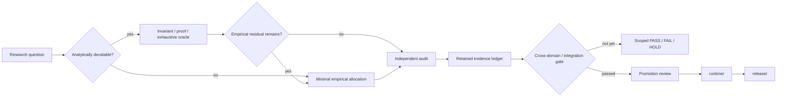

# Issue #6367 T0 — matched protective-adaptation method fixture (2026-10-04)

`METHOD_PASS_SCOPED`: candidate and independent raw-only auditor each ran once with zero retries. All 18 externally scheduled offers and 9 matched pairs were reconstructed; three auditor mutations were rejected. Host Python 3.14.5 was used because OrbStack image inspection failed with a containerd content-blob error; no image pull/retry/container launch occurred. This is synthetic method evidence only, not live #59 efficacy, MAP01 recovery, physical occupancy, or product benefit. The separate successor audit caught the frozen auditor's top-level safety-disposition blind spot; original T0 evidence remains unchanged. See the [report and checksummed artifacts](research/analysis/protective_local_adaptation_6367_t0_20261004/REPORT.md), [successor audit](research/analysis/protective_local_adaptation_6367_reaudit_v1/README.md), and [Issue #6367](https://github.com/Unjuno/agent-interface/issues/6367).

# Issue #7834 T0 A01 — carryover-aware optional-adaptation estimator (2026-10-05)

The exact finite two-cluster/four-decision-point candidate and raw-only auditor each ran once and passed the scoped oracle gate. IPW excursion estimate 0.150000000000000 vs exact oracle 0.150000000000000; both predeclared history strata matched. The unweighted/history-ignorant and executed-only controls missed the oracle; all five support/timing/missingness/interference/proximal-distal controls passed. This is synthetic method evidence only, executed host-only because OrbStack's local image-content store returned `operation not supported`; no GUI, user, live task, or product claim. See [report and immutable outputs](research/analysis/optional_adaptation_mrt_7834_t0_a01_20261005/REPORT.md) and [Issue #7834](https://github.com/Unjuno/agent-interface/issues/7834).

# Issue #7466 A03 — within-episode feedback gate for adaptive checkpoints (2026-10-05)

The frozen candidate and independent auditor each ran once (no retries). Candidate exit 0 produced 432 episodes / 669,050 ticks and passed the calibration gate; auditor exit 0 reconstructed all rows with no errors and rejected all four mutation controls. Formal disposition is `FAIL_UNSAFE_RESUME`: all 144 reversed-cohort episode×cost rows (24 distinct streams across six cost cells) were incomplete, and informative cost improvement missed the required 10% gate at checkpoint/replay costs 4/1 and 8/1. Independent and reversed signals never activated and exactly followed event fallback, but this did not satisfy completion or all-cell benefit. The 300 MB candidate raw remains locally preserved with a lossless gzip transport copy; do not claim a real interruption, GUI, model, persistence, safety, or production-latency result. A02's preformal STOP and the earlier A01 outcome remain unchanged. See the [formal report](research/analysis/hazard_checkpoint_7466_feedback_gate_a03_20261004/REPORT.md), [run record](research/analysis/hazard_checkpoint_7466_feedback_gate_a03_20261004/RUN.md), and [Issue #7466](https://github.com/Unjuno/agent-interface/issues/7466).

# Issue #7709 T0 — latency interval coverage under synthetic regimes (2026-10-05)

Across 240 null-effect datasets per workload, row-independent pooled intervals covered the true route contrast in 29.6–32.5%; session-cluster intervals covered it in 93.3–94.2% with ≤6.7% false promotion. Four fixed time blocks retained in the all-window session estimate; 5% censored pairs remained at the frozen penalty. Candidate result: `METHOD_PASS_SCOPED`; the first raw auditor `AUDIT_FAILED` 4/5 from a floating-point-only false-promotion recomputation mismatch and remains unchanged; frozen auditor v2 independently passed 8/8 without candidate/raw rerun. Synthetic only: this implicates row-independence under the chosen autocorrelation/session heterogeneity, not real route performance or a data-driven change-point detector. See [report and artifacts](research/analysis/latency_regime_coverage_7709_t0_20261005/REPORT.md) and [Issue #7709](https://github.com/Unjuno/agent-interface/issues/7709).


# Issue #7709 T0b — independent expanded stress variant (2026-10-05)

A separately frozen 500-replicate/cell stress variant covered stationary, abrupt, warm-up, and gradual-drift families at 8 and 16 sessions, with 24 paired windows/session and 10% joint administrative censoring. Row-i.i.d. coverage was 31.6–37.2%; session-level all-window coverage was 92.8–96.4%, with null false promotion 1.8–3.0%. Boundary perturbations changed the integrated interval by at most 4.27e-14 ms and all three mutations were rejected by the raw-only audit. Important limit: the descriptive detector emitted 1.324–2.616 boundaries even in stationary null; coverage improvement is from session-level replication, not validated segmentation. This is additive to, not a replacement for, the original #7729 T0; the T1 HOLD and T2 gate remain. See [expanded report](research/analysis/latency_coverage_7709_t0_20261005/REPORT.md) and [Issue #7709](https://github.com/Unjuno/agent-interface/issues/7709).

# Issue #7709 T1 — retained-trace feasibility (2026-10-05)

Read-only feasibility audit of pinned main evidence: all 1,051 files in the public archive passed manifest/hash checks; the model-visible evidence is one fixed-order direct→guarded pair (six exact-once tasks per route), with no independent run/session identity. Direct task 6 lacks a saved-image visual-completion cue. Three older API/CLI/MCP sets are one-shot transport-only observations (zero model calls/input actions), and #3569 stopped before any route call; neither cohort is pooled. Candidate v2 and independent audit passed. Disposition `HOLD_TOO_FEW_INDEPENDENT_RUNS`; no historical T2 inference or route-performance claim. Candidate v1's incorrect preliminary output remains preserved and superseded. See [report](research/analysis/latency_regime_coverage_7709_t1_feasibility_20261005/REPORT.md), [artifacts](research/analysis/latency_regime_coverage_7709_t1_feasibility_20261005/SHA256SUMS), and [Issue #7709](https://github.com/Unjuno/agent-interface/issues/7709).

# Issue #7728 T0 — client energy-counter eligibility (2026-10-05)

The native, unprivileged macOS `powermetrics` probe refused to run without superuser access; no privilege escalation was attempted. Its local documentation identifies reported power as estimated and process Energy Impact as a rough proxy, not a cumulative joule counter with explicit resolution. Disposition `HOLD_ENERGY_SENSOR_UNAVAILABLE`; the first two auditor attempts' man-page-format parsing failures remain preserved, while v3 independently confirmed the stop. No GUI/model/route task or energy comparison was run. See [report and raw evidence](research/analysis/client_energy_per_effect_7728_t0_20261005/REPORT.md) and [Issue #7728](https://github.com/Unjuno/agent-interface/issues/7728).

# Issue #59 A01 — ammo depletion during renewable fire cover (2026-10-05)

Current-main v39's synthetic monitor-boundary probe returned `FAIL_AMMO_DEPLETION_NOT_GUARDED`: while a notional active fire cover had health=100, typed ammo 4→0 did not trigger a policy-invalidation event; unchanged positive ammo was preserved and health 100→89 correctly invalidated. The independent source-level audit passed 7/7 checks. This is not live firing, game, key-release, survival, or usefulness evidence; formal live allocation remained 0/0. OrbStack's read-only image inventory failed on a cached containerd blob, so no image pull/build/restart occurred; the stdlib-only boundary ran on host CPython 3.14.5. Any live successor requires a separately assigned lane. See [report and frozen artifacts](research/doom/v39_ammo_cover_guard_59_a01_20261005/REPORT.md) and [Issue #59](https://github.com/Unjuno/agent-interface/issues/59).

# Issue #59 A02 — composed health/ammo cover guard (2026-10-05)

A separate construction prototype composed the current generic typed-signal guard twice. It preserved a notional fire cover for positive ammo (including the ammo=1 boundary) and invalidated on zero, unknown, stale-sequence, or binding-mismatched ammo, as well as health below its floor. The independent audit passed 24/24 checks. `PASS_DUAL_SIGNAL_FAIL_CLOSED` is construction-only: the current v39 controller remains health-only, and no live controller/game/input/release behavior or task effect was exercised. See [report and frozen artifacts](research/doom/v39_ammo_cover_guard_59_a02_20261005/REPORT.md) and [Issue #59](https://github.com/Unjuno/agent-interface/issues/59).

# Issue #59 A03 — paired-epoch ammo-aware cover guard (2026-10-05)

A fresh ten-case construction probe added a strict common sequence/capture/binding gate before composing health and ammo guards. Coherent positive ammo (including 1) was preserved; zero ammo, health below floor, split sequence/time, binding mismatch, Boolean/float aliases, and unknown ammo failed closed. Independent audit 44/44; `PASS_PAIRED_EPOCH_FAIL_CLOSED`, construction-only. No current controller integration or live/game/input/release/task-effect evidence. The separately assigned live lane remains required. See [report and frozen artifacts](research/doom/v39_ammo_cover_pair_guard_59_a03_20261005/REPORT.md) and [Issue #59](https://github.com/Unjuno/agent-interface/issues/59).

# Issue #59 — A02 per-key trace source attribution (2026-10-05)

Frozen-source audit A05 independently reconciled the two inter-key `query_keymap` events in the retained A02 operation trace. The events are the historical V12 fixture owner's post-up and next pre-up physical probes; A02's transition wrapper joins their receipts. The current V39 V15 closure instead uses V4→V3→current V12: each explicit up issues KeyRelease/XSync, with no inter-release keymap query, followed by one owner-state sample after the batch. The current V12 keymap query is only in terminal release cleanup. Candidate passed 12/12 assertions and independent source/raw auditor v2 passed with zero errors; A05 auditor v1's AST identity failure remains preserved. This corrects the apparent query-contract conflict but confirms that V39 production still lacks per-key physical-state evidence; XSync is not application-consumption evidence. Read-only source attribution only: no A02 rerun, live X11, GUI, game, model, latency bound, useful feedback, recovery, or task-effect claim. A02 candidate/audit failure and construction-stop records remain preserved. See [report and artifacts](research/doom/map01_v39_perkey_bridge_source_audit_a01_20261005/RESULT.md) and [Issue #59](https://github.com/Unjuno/agent-interface/issues/59).

# Issue #59 — shared-display owner-pair Xvfb A03 (2026-10-05)

On one private Xvfb server, a single-owner W down/up control produced global keymap `false→true→false`. Two distinct current V4/V3/V12 owners then admitted W under different leases; after owner A's receipt-verified single-key up, the global keymap was false while owner B still reported keycode 25 locally held. B's later up verified and the final server keymap was neutral. Candidate and raw-only auditor each ran once and exited 0. This confirms cross-owner interference for the frozen single-key release path and supports the exclusive-display/cooperative-arbiter boundary; it is not physical, application, GUI, or game evidence. A03 is frozen at PR #7974 head `c896362a`; the PR later advanced to a batch-release path that A03 did not exercise. The live threat-control/MAP01 gate remains separate. See [A03 report and checksummed artifacts](research/doom/map01_v39_owner_pair_xvfb_a01_20261005/A03/README.md).

# Issue #59 — Astra retained failure video triage (2026-10-05)

Reviewed the complete labelled 2x video with time-sampled frames and joined its threat visibility to retained model waits, cover programs, decision-frame HUD and 852-row runtime events. The first visible threat appears across the lower area near live time 36 s. One firing/strafe cover overlaps an 11.741 s model call and spends 11 rounds across the surrounding decision window as sampled health falls 100→84; damage timing cannot be localized within that window. Later fresh route-finding answers continue as health falls to zero; with an approaching on-screen enemy, ammo remains 37 and no later primary command fires. Seven of 13 waits outlasted fixed ten-second cover (9.771 s total, 3.765 s max); eight contingencies were authored, none fired. This is a delayed-reaction diagnosis, not stale model-answer replay: answers use fresh sequences/images. Per-decision damage windows include the following primary action, so the observation does not assign damage causally to cover or a particular enemy. One kill, one death, no exit; no threat-source, counterfactual, or recovery claim. This advances required retained-failure diagnosis only; no live allocation was assigned or run. See [triage](research/doom/MAP01_ASTRA_SYSTEM_FAILURE_TRIAGE_V1.md), [frozen attempt](research/doom/MAP01_ASTRA_ATTEMPT_V1.md), and [Issue #59](https://github.com/Unjuno/agent-interface/issues/59).

# Issue #59 — retained v39 fire-cover ammo timeline (posthoc, 2026-10-05)

Read-only reconstruction of the retained v39 trace found three fire-cover model-wait windows with 122 typed observations and seven observed ammo decreases (46→44, 43→41, 40→37); none reached zero. Health invalidated the final window. Independent reconstruction passed 5/5. This is explicitly posthoc, not a new live allocation; the sole aggregate score cannot establish per-window usefulness, and no physical-key, causal firing, safety, or MAP01-clear claim is made. See [report and frozen artifacts](research/doom/v39_fire_cover_ammo_timeline_59_p01_20261005/REPORT.md) and [Issue #59](https://github.com/Unjuno/agent-interface/issues/59).

# Issue #59 T0 — v39 release-sink failure custody (2026-10-04)

An exploratory host-Python construction probe of the distinct pinned v13 executor found that `_release_event` marks an action published before calling the sink. Both raise-before-accept and accept-then-raise suppress retries without a `delivery_unknown` record; the escaped exception also bypasses later `release_all` and terminal publication in the inspected caller path. Saved-data audit and source pins pass. This is not prospectively frozen and does not exercise a full executor thread, live owner/sink, container, game, model, or input; no production, physical-release, or task-effect claim follows. See the [retained experiment and audit](research/doom/v39_release_sink_failure_59_7474_t0_20261004/README.md) and [Issue #59](https://github.com/Unjuno/agent-interface/issues/59).

# Issue #7383 T0 — freshness-gated observation hedging (2026-10-04)

One host-CPU deterministic simulator allocation (no container, model, GUI, GPU or network) passed the finite method gate. A 6 ms threshold from 200 disjoint calibration traces reduced p95 from 89 to 12 ms in the declared independent-heavy-tail fixture; consumed secondary work was 4.46% of baseline primary work and deadline misses fell 20→0. The independent 1,000-row auditor rejected partial-response, stale-generation, double-admission and omitted-loser-work mutations. Strongly correlated delays and a serialized queue showed no p95 gain. This establishes a synthetic conditional method result only: actual capture tails, current critical-path attribution, end-to-end benefit, and application-effect non-interference remain unmeasured; do not adopt or launch T1 without fresh critical-path evidence and a separately authorized private-fixture allocation. See the [report and exact artifacts](research/analysis/observation_hedging_7383_t0_20261004/REPORT.md) and [Issue #7383](https://github.com/Unjuno/agent-interface/issues/7383).

# Issue #6645 T1b independent evidence revalidation / WSLc HOLD (2026-10-03)

One frozen raw-only host auditor returned `PASS_INDEPENDENT_REVALIDATION`: 30 parent files verified, five synthetic rows/ten decisions reconstructed, three gate deltas, zero errors, no candidate/container invocation. Six pure tests reject 23 effective corruptions; the earlier failed verifier/source is retained. This checks internal consistency, not fresh causal evidence. Outcome-bearing IDs remain a caveat: a three-file neutral-ID WSLc payload is prepared but its formal candidate/auditor remain 0/0 under the unresolved #5085 shared-state/allocation HOLD. Two pre-HOLD environment-only preflights are disclosed. The original T1b evidence is unchanged; no label-invariance, runtime equivalence, performance, memory enforcement, or live-safety claim. See [report and retained evidence](research/analysis/counterexample_guard_coverage_gate_6645_t1b_revalidation_20261003/REPORT.md) and [Issue #6645](https://github.com/Unjuno/agent-interface/issues/6645).

# Issue #6645 T1b — isolated coverage-gate counterfactual (2026-10-03)

Append-only correction and successor to the merged T1 record below: independent review found T1's comparator did not isolate the gate, so its causal inference is withdrawn without changing its raw allocation. T1b held candidate-visible input fixed and changed only the gate boolean; a separate container could not access the oracle. The frozen five-row allocation returned `PASS_COVERAGE_GATE_ISOLATED_SCOPED`: hidden harmful case ADMIT without gate and UNKNOWN with gate, observationally identical safe case UNKNOWN with gate, and complete controls ADMIT/REFUSE. Independent audit had zero errors. This remains a synthetic fixture assuming a complete external family registry; it establishes neither unknown-unknown discovery nor live safety/performance behavior. See [T1b report and retained raw evidence](research/analysis/counterexample_guard_coverage_gate_6645_t1b_v1/REPORT.md) and [Issue #6645](https://github.com/Unjuno/agent-interface/issues/6645).

# Issue #6645 T1 — hidden-family coverage-gate challenge (2026-10-03)

The new five-row OrbStack finite test passed its scoped coverage-gate criterion. A coverage-blind guard admitted the hidden modal-occlusion harmful case; with the registered required family absent from the candidate's covered set, the frozen gate returned UNKNOWN. Complete-coverage safe control admitted, known stale target refused, unregistered family UNKNOWN. The separate raw-only auditor reconstructed all five rows with zero errors; candidate/auditor each ran once, no retries. `PASS_COVERAGE_GATE_SCOPED` only: it assumes an externally complete family registry and proves neither unknown-unknown discovery nor live skill, GUI, safety, or performance behavior. See [report and raw evidence](research/analysis/counterexample_guard_coverage_gate_6645_t1_v1/REPORT.md) and [Issue #6645](https://github.com/Unjuno/agent-interface/issues/6645).

# Issue #6308 allocation-07 — transfer-inclusive RTX 3080 benchmark (withdrawn)

The frozen allocation and fresh synthetic dataset are retained, but the requested exclusive GPU interval was withdrawn before execution when the user selected a different shared-memory question. `STOP_WITHDRAWN_BEFORE_CANDIDATE`: candidate=0, auditor=0, retries=0; no GPU measurement or scientific PASS/FAIL is claimed. Do not replay this allocation. It is distinct from successor #6329. See the [immutable stop and frozen package](research/analysis/gpu_supervisor_transfer_breakeven_4972_a07_20261002/STOP.md) and [Issue #6308](https://github.com/Unjuno/agent-interface/issues/6308).

# Issue #6319 allocation-08 — six-worker memory-sharing proposal (duplicate-allocation STOP)

The branch-held six-worker CUDA probe used seed `49720261008`, which collided with a concurrent allocation registration on #6322. It stopped before candidate/auditor/CUDA (`0/0/0`); this does not test the memory-sharing hypothesis. The branch's six source files are retained separately from #6322's different transfer-latency STOP. No candidate rerun is authorized; #6329 allocation 09 is a distinct successor. See the [STOP and preserved proposal](research/analysis/gpu_six_worker_memory_sharing_4972_a08_20261002/STOP.md) and [Issue #6319](https://github.com/Unjuno/agent-interface/issues/6319).

# Issue #6530: temporal-effect identity across timezone transitions (2026-10-02)

New OrbStack allocation A01 ran the frozen eight-case New York temporal fixture in the dedicated VM's private Docker Engine; candidate and independent raw-only auditor each ran once and exited 0, audit `PASS` (8 rows, no errors). The typed oracle detected the planted daily-local-versus-fixed-UTC recurrence error accepted by both display-string and offset-only baselines, and returned both possible instants for an unresolved fall-back fold. This is a synthetic method-only result, not a GUI/calendar or real persisted-effect claim. The predecessor WSLc pre-start STOP in PR #6666 remains unchanged. See the [A01 report and checksummed artifacts](research/analysis/temporal_effect_identity_6530_orbstack_a01_20261002/REPORT.md) and [Issue #6530](https://github.com/Unjuno/agent-interface/issues/6530).

# Issue #6581 T0b: path-width constrained continuous GUI fixture (2026-10-02)

One frozen OrbStack candidate and one separate raw-only Python auditor ran once; both exited 0 and the auditor returned `PASS_METHOD_SCOPED` for six authored scenarios. The identical wide/narrow pointer traces reached the same endpoint but saved only in the wide corridor; the endpoint-after-exit adversary remained unsaved. Variable-width, corner-union, and ordinary unconstrained controls matched their frozen rules. This is a synthetic fixture/oracle result only—not ordinary GUI, human/agent movement, Steering-Law, timing, benefit, or safety evidence. Construction and auditor-container launch failures are preserved; the #6581 predecessor `STOP_DATA` remains unchanged and T1 remains open. See the [report, preregistration, freeze, and checksummed formal evidence](research/analysis/path_width_continuous_gui_6581_t0b_v1/REPORT.md) and [Issue #6581](https://github.com/Unjuno/agent-interface/issues/6581).

# Issue #6617 T0: revision-timed cutover (2026-10-02)

## Issue #6619 T0: action-bound visual residual (2026-10-02)

Retained as `STOP_AUDIT_MUTATION_CONTROL_DEFECT`. Candidate and auditor each ran once in pinned, network-disabled WSLc; no retries. The initial auditor's nominal `METHOD_PASS_SCOPED` is invalidated because the mutation harness did not independently validate corruptions. The sole held-out flash was detected by both action-bound and raw-delta arms at the same budget; no incremental benefit is demonstrated. No live GUI/game visual safety inference. See [report](research/analysis/action_bound_residual_6619_t0_v1/REPORT.md) and [Issue #6619](https://github.com/Unjuno/agent-interface/issues/6619).

The frozen WSLc T0 compared final-only preparation, an intentionally unsafe naive-provisional arm, and exact-version-bound read-only preparation over 10 scripted cases (30 traces). One stable logical-time schedule favored version-bound preparation by 3 ticks (3 vs 6); both safe arms had zero provisional/unauthenticated/uncommitted inputs, while the naive comparator's 9 provisional inputs stayed visibly unsafe. A separate raw-only audit exited 0 and rejected all four frozen corruptions. This is `PASS_METHOD_SCOPED` only for the deterministic model; it says nothing about ASR, actual speaker identity or intent, voice/GUI safety, real effects, human utility, or measured latency. WSLc emitted an unsupported swap/cgroup warning; enforcement is not claimed. See [the report and checksummed formal artifacts](research/analysis/revision_timed_cutover_6617_t0_v1/REPORT.md) and [Issue #6617](https://github.com/Unjuno/agent-interface/issues/6617).
# Issue #6604: disturbance-timescale profile T0 (2026-10-02)

Successor isolated OrbStack Docker allocation 02 returned `PASS_METHOD_SCOPED`: a pinned-image candidate emitted 14 finite synthetic rows and an independent raw-only auditor reconstructed all 14 with zero errors. The planted matrix recovered the declared crossover (slow local-periodic error 10 vs direct 16; fast-reversal direct 45 vs local 59); pooled totals selected direct 61 vs local 69, hiding its slow-stratum loss. The no-crossover pair retained one ordering, and the unobservable semantic-swap case carried no semantic-effect claim. The predecessor shared-engine allocation 01 HOLD remains unchanged. See the [retained report and outputs](research/analysis/disturbance_timescale_6604_t0_v1/REPORT.md), [exact runtime record](research/analysis/disturbance_timescale_6604_t0_v1/formal_02/RUN_RECORD.json), and [Issue #6604](https://github.com/Unjuno/agent-interface/issues/6604). This establishes a deterministic method fixture only; no real controller, GUI, task-effect, safety, latency, or product-benefit result is claimed.

# Issue #6576: extreme-tail eligibility pilot A02 (2026-10-02)

### Follow-up: timer quantization exposes an eligibility-contract gap

Fresh OrbStack Docker construction A01 tested continuous versus rounded
synthetic timing samples. Independent audit confirmed that q=1.0 rounding was
still labeled `ELIGIBLE_REFERENCE` with six distinct values among 333 training
q90 exceedances; q=0.25 had 21 distinct values and also passed. The continuous
control was rejected by the existing block-median ratio gate (1.545 > 1.5).
This is a finite counterexample showing the current gate omits a measurement-
resolution/tie-support condition, not a p99 calibration or real release result.
Candidate and raw-only audit each ran once, exit 0, no retry. See the full
[A01 run record](research/analysis/extreme_tail_eligibility_6576_construction_v1/timer_quantization_a01_20261002/RUN_RECORD.md)
and [frozen hypothesis/protocol](research/analysis/extreme_tail_eligibility_6576_construction_v1/timer_quantization_a01_20261002/PREREGISTRATION.md).

Fresh-seed follow-up A02 tested a 20-distinct-q90-exceedance support rule on
30 fixtures per resolution. It held all 30/30 baseline-eligible q=1.0 samples,
added 0/21 holds to continuous controls, and held 7/24 intermediate q=0.25
samples; independent audit passed the frozen `PASS_SUPPORT_RULE_SCOPED`
criteria. This tests only these synthetic generator/quantum arms and does not
validate 20 as a production threshold. See the [A02 run record](research/analysis/extreme_tail_eligibility_6576_construction_v1/timer_quantization_a02_20261002/RUN_RECORD.md).

Fresh-seed cutoff sweep A03 (50 samples per q=0/0.25/0.5/1.0 arm) found cutoff
8 the smallest tested threshold meeting the preregistered synthetic criteria:
48/50 eligible q=1.0 cases held, with 0/31 continuous and 0/36 q=0.25 cases
additionally held. Cutoff 20 held 14/36 q=0.25 fixtures; q=0.5 had only 2/50
baseline-eligible cases. This is a generator-specific finite tradeoff, not a
production cutoff. See the [A03 run record](research/analysis/extreme_tail_eligibility_6576_construction_v1/timer_quantization_a03_20261002/RUN_RECORD.md).

A dedicated OrbStack Ubuntu machine ran its own pinned-image Docker Engine; no shared Engine was used. One preregistered stationary synthetic case (4,000 train + 4,000 holdout) produced `ELIGIBLE_REFERENCE`; the candidate and independent raw-only audit each ran once and exited 0, with `PASS_METHOD_SCOPED PASS_RAW_ONLY`. The eligible-gated p99 holdout was 42/4,000 (exact 95% CI 0.00758–0.01417); the TailID-equivalent p99 was 45/4,000 (0.00822–0.01502); both include nominal 1%. This one-case pilot establishes neither superiority nor TailID parity, and makes no physical input-release, safety, or worst-case claim. The formal six-case T0 remains unrun. See the [frozen run, raw output and hashes](research/analysis/extreme_tail_eligibility_6576_construction_v1/orbstack_pilot_a02_20261002/RUN_RECORD.md), [H/T/D/C/U and frozen input](research/analysis/extreme_tail_eligibility_6576_construction_v1/orbstack_pilot_a02_20261002/PREREGISTRATION.md), and [Issue #6576](https://github.com/Unjuno/agent-interface/issues/6576).

Successor CRAN/R parity studies then compared pinned TailID 1.0.0/ismev 1.43
with the Python port in isolated OrbStack Docker containers. A03 stopped on an
R harness error; A04 retained candidate outputs but its auditor crashed; A05
completed the independent audit and failed numerical parity on one of six
fresh synthetic fixtures (relative scale delta 0.001965, shape delta 0.002028,
CI endpoint delta 0.003308), while all six candidate/sensitive-index and
threshold checks passed. The Python port is not verified numerically
equivalent at the preregistered tolerances. This remains synthetic method
evidence only; the formal six-case T0 and physical release/safety evidence are
still unestablished. See the additive [A03](research/analysis/extreme_tail_eligibility_6576_construction_v1/orbstack_cran_parity_a03_20261002/RUN_RECORD.md), [A04](research/analysis/extreme_tail_eligibility_6576_construction_v1/orbstack_cran_parity_a04_20261002/RUN_RECORD.md), and [A05](research/analysis/extreme_tail_eligibility_6576_construction_v1/orbstack_cran_parity_a05_20261002/RUN_RECORD.md) run records.

Follow-up optimizer-sensitivity successors A06/A07 each retained a distinct
infrastructure/auditor STOP without retry. A08 then completed on six new
synthetic fixtures with independent raw-only audit: alternative converged R
starts crossed the frozen sensitivity gate on 4/6, while default R/Python
parameter parity passed 6/6. This makes optimizer-path sensitivity a plausible
contributor to A05's isolated mismatch, but does not establish that causal
explanation or a global MLE. All three run packages, failed starts, raw outputs
and hashes are retained separately; formal six-case T0 and physical release
evidence remain pending.

# Issue #6501 T0-01 / T0b-01: scope-typed singleflight (2026-10-02)

T0-01 is preserved as `STOP_OUTPUT_SERIALIZATION` / `NOT_EVALUATED`: the candidate ran once, the independent auditor ran once, retries were zero, and the wrapper's literal backslash-n caused JSON parsing to fail. No raw auditor result exists. The original STOP and receipts are immutable in [the predecessor package](research/analysis/scope_typed_singleflight_6501_t0_20261002/REPORT.md).

The distinct, frozen WSLc successor T0b-01 returned `PASS_METHOD_SCOPED`: one candidate invocation, one independent raw-only auditor invocation, zero retries; 10/10 cases audited with no violations, and construction tests passed 24/24. The independent audit found 20 verifier calls without coalescing, 11 for unsafe predicate-only keying, and 14 for scope-typed keying. Summed per-caller latency was 145/100/115 ms in a stipulated 5 ms serial-service model; only the single truly equivalent overlap fell from two calls / 15 ms to one / 10 ms with scope-typed sharing. Predicate-only keying failed the planted different-target, contradictory-dependency, and restart/ABA controls. Other stale-return, deadline, cancellation, owner-failure, UNKNOWN, and late-caller gates were retained.

These latency values are simulated—not measured CPU, runtime, GUI, or end-to-end performance. WSLc used the cached digest-pinned CPython 3.12.14 image with network disabled, read-only source and output-only mount; it warned that swap/cgroup limits are unsupported. No memory enforcement is claimed. This establishes neither Docker parity nor migration of #6389, real verifier equivalence, runtime serialization, freshness under live GUI changes, or authority sharing. See [the successor report and raw audit](research/analysis/scope_typed_singleflight_6501_t0b_20261002/REPORT.md), [Issue #6501](https://github.com/Unjuno/agent-interface/issues/6501), and immutable [T0 STOP evidence](research/analysis/scope_typed_singleflight_6501_t0_20261002/STOP.json).

# Issue #6509: claim-scoped partial verdicts T0 (2026-10-02)

One frozen OrbStack candidate evaluated 15 verifier traces under three policies (45 rows); a separate raw-only auditor reconstructed all 45 and returned `PASS_METHOD_SCOPED`, errors `[]`. The claim ladder returned 4 complete, 2 counterexample, 9 unknown; it produced no partial-positive ALLOW and no consumer side effects. The deliberately unsafe scalar comparator produced 11 partial-positive ALLOW rows. On the authored decisive identity-negative case, logical decision time was 1 ms for claim-ladder versus 11 ms all-or-nothing; these are stipulated simulation times, not measured latency. Contradictory, stale, wrong-scope, torn-receipt and crash/replay controls were included. No actual journal crash, GUI, live verifier, authority, safety or product claim. See [report, preregistration, raw output and audit](research/analysis/claim_scoped_partial_verdict_6509_t0_20261002/REPORT.md) and [Issue #6509](https://github.com/Unjuno/agent-interface/issues/6509).

# Issue #6468: artifact-viability cut sets T0b (2026-10-02)

A one-shot synthetic candidate plus an independent raw auditor covered two seven-check contracts and six paired cases (12 routes). One equal-partial document pair (8/8) had opposite viability due to citation binding; the spreadsheet formula pair scored 8 vs 7 after both formula and range failures. Cosmetic failure remained viable, missing export failed, rendered UNKNOWN remained UNKNOWN, and the no-inversion control passed. The auditor reconstructed both minimal-cut-set collections, matched strict TaskContract decisions on all 12 routes, and rejected all five frozen mutations. Result: `SUBSUMED_BY_12`—cut sets add diagnosis but no incremental viability decisions in this fixture. Method-only synthetic scope; no live artifacts, human judgement, GUI/model route, efficiency, or product result. See [report and raw evidence](research/analysis/artifact_viability_cutsets_6468_t0b_20261002/REPORT.md) and [Issue #6468](https://github.com/Unjuno/agent-interface/issues/6468). The predecessor pre-candidate STOP remains in [PR #6487](https://github.com/Unjuno/agent-interface/pull/6487).

### Issue #6195 delay–gain stability T0 (2026-10-01)

One host-CPU candidate and one separately implemented raw-only auditor ran once on the frozen exact-rational scalar fixture; both exited 0, with five trajectories reconstructed and five corruption probes rejected. Post-run inspection found the `capped_hold` arm emitted `-6/5` despite the frozen `1/2` actuator cap. The auditor copied the same omission and failed to test the cap. Final disposition: `FAIL_METHOD_T0; FAIL_AUDIT_COVERAGE_GAP`; the generated auditor PASS label remains unchanged raw history but is not accepted as the package conclusion. Candidate/audit raw hashes are `ba058e40b10c3dfbd2939b79429296c88308eb095a86a4fcc0f7f2f82f5b0e24` / `b9211d5f8b8f32a44026524caafed3be1fb989d162e17af5999e50efd3a128ec`. No retry or repair run. This finite authored fixture has no GUI/DOOM, runtime, task-effect, safety, human-control, or GPU inference. See [the failure report](research/analysis/delay_gain_stability_6195_t0_host_20261001_01/REPORT.md) and [unchanged raw outputs](research/analysis/delay_gain_stability_6195_t0_host_20261001_01/outputs/DELAY-GAIN-STABILITY-6195-T0-HOST-20261001-01/).

### Issue #6195: retained MAP01 delay–gain trace eligibility T1 (2026-10-01)

Two SHA-pinned v38/v39 logs were inventoried once on local host CPU. Both had source captures, but neither contained the consumed-generation binding, fully identity-joined held-input release, same-domain decision/action/effect clock, independently task-relevant effect, or repeated correction chain required for a delay×policy T2. Candidate: `HOLD_NO_CLOSED_LOOP_TRACE`, 0/2 eligible. The separate raw audit reconstructed both summaries and rejected five corruptions, but failed to bind its shared stale allocation-01 literal to registered allocation-02. Final package disposition: `FAIL_ALLOCATION_BINDING_AUDIT_GAP; DATA_HOLD_NO_CLOSED_LOOP_TRACE`; no retry or T2. Scope is retained-log eligibility only—not physical occupancy, stability, task effect, GUI/DOOM safety, or product behavior. See [frozen report and raw artifacts](research/analysis/map01_delay_gain_t1_trace_eligibility_6195_20261001_01/REPORT.md).

# Issue #6373: context-preserving delegation T0 (2026-10-02)

# Issue #5260 successor A01: Tk first-character construction gate (2026-10-02)

Three construction-only private-Xvfb probes were recorded in `research/integration/tk_firstchar_5260_a01_20261002/`. Smoke-01 and smoke-02 preserve candidate exit 0 / independent audit FAIL; smoke-03 passed the scoped one-row raw audit (exact local save 1/1, first Tk KeyPress on the target Entry, first-visual XWD hash verified). OCR did not resolve the visible `h`; baseline XWD integrity was unstable and is excluded from the gate. **No formal 96-trial allocation ran:** the linked #5260/#5296 issue text does not authorize a fresh allocation, so status is `HOLD_NOT_AUTHORIZED`, not a scientific result. Construction PASS says nothing about a first-character failure rate, readiness guarantee, production UI, or product acceptance. See [preregistration, construction chronology, runner and auditor](research/integration/tk_firstchar_5260_a01_20261002/PREREG.md) and [#5296](https://github.com/Unjuno/agent-interface/issues/5296).

# Issue #6373: context-preserving delegation T0 (2026-10-02)

Eight synthetic task-chain fixtures compared NO_RESTORE, SUMMARY_ONLY, RESTORE_ONLY, and RESTORE_PLUS_DIFF. The one-shot candidate plus audit-only successor reconstructed 32/32 rows: RESTORE_PLUS_DIFF achieved 5/8 zero-mismatch next-task fixtures versus SUMMARY_ONLY 3/8 (4 vs 9 modeled context mismatches), preserving all stipulated task effects, external changes, required artifacts, and unresolved state. Blind RESTORE_ONLY reached 6/8 but erased an intended cell effect, overwrote an external viewport, deleted required download evidence, and falsely cleared unresolved modal/held input in four fixtures. `PASS_METHOD_SCOPED` only for this stipulated finite model; no GUI, callback, human, or latency claim. See [full report](research/analysis/context_preserving_delegation_6373_t0_v1/REPORT.md) and [Issue #6373](https://github.com/Unjuno/agent-interface/issues/6373).

# Issue #6351: cross-role meaning drift T0 (2026-10-02)

An OrbStack CPU-only synthetic test used eight non-handoff histories and machine roles (planner, verifier, effect/obligation owner). A flattened “COMPLETED” status incorrectly erased an unresolved child obligation and contradictory receipts in 2/8 cases. Typed receipt queries and role projections matched all 56 audited role fields; the projection added no demonstrated correctness over typed queries, so the Issue's rule yields `CONSOLIDATE_NO_INCREMENTAL_VALUE`. The first two audits were invalid and retained; an independent audit-only successor validated the candidate bytes without rerunning them. No runtime, external-effect, model, or human claim. See [full report and all allocations](research/analysis/cross_role_meaning_drift_6351_t0_v1/REPORT.md) and [Issue #6351](https://github.com/Unjuno/agent-interface/issues/6351).

# Issue #5366 T3: resource-envelope freshness (2026-10-02)

A distinct additive successor tested whether a declared read-resource bound remains valid across load-generation changes. One candidate and one independent auditor reconstructed 12/12 synthetic rows (`PASS_METHOD_SCOPED`). Semantic-only admission missed the 2 ms controller deadline in 2/4 cases; a resource-bound gate without generation binding missed once because it admitted a stale low bound; the generation-bound gate returned UNKNOWN for stale/unknown bounds, admitted one current low-cost read, refused one current over-budget read, and had 0/4 deadline misses. Construction suite: 5/5, with four raw-corruption controls. This is a deterministic manifest/freshness method result, not an X11/AT-SPI measurement or live runtime guarantee. No container was used because the shared owner remains unresolved under #5085. See [T3 report and frozen raw evidence](research/analysis/effect_interference_5366_t3_v1/REPORT.md) and [Issue #5366](https://github.com/Unjuno/agent-interface/issues/5366).

# Issue #5366 T2: semantic effect vs resource interference (2026-10-02)

A frozen synthetic scheduler fixture compared semantic-only admission, reject-all observations, and a separate resource-envelope gate over five read-only observations. One candidate invocation and one independent raw-only audit reconstructed 15/15 rows (`PASS_METHOD_SCOPED`): semantic-only admitted 5/5 but missed the controller's synthetic 2 ms deadline in 3/5; blanket refusal admitted 0/5; the two-dimensional gate admitted the two known-benign observations, denied two over-budget reads, and left an unknown bound `UNKNOWN`, with 0/5 deadline misses. Construction suite passed 5/5 and rejected five raw mutations. This demonstrates only finite contract expressiveness; the declared resource bounds and service times are stipulated, not measured X11/AT-SPI or runtime timings. OrbStack was not used because the shared active container's owner/lease is unresolved in #5085; no container was altered or launched. See [the frozen report, source, raw output and audit](research/analysis/effect_interference_5366_t2_v1/REPORT.md) and [Issue #5366](https://github.com/Unjuno/agent-interface/issues/5366).

### Issue #6081: error-carry compilation of bounded directional intents T0 successor (2026-10-02)

One OrbStack candidate run produced 80 exact-rational rows over 10 cases, 4-way/8-way action tables and four policies. A separate raw auditor reconstructed 80/80 rows; a distinct gate auditor found horizon-wide nearest and per-slot nearest identical in all 20 alphabet/case cells, and error carry lowered worst-prefix squared error on 9/9 eligible safe nonrepresentable cells. Candidate safety-envelope breaches were 0, versus 2 unique nearest-baseline cells; switches, release and refusal gates passed. A fixed-control successor passed 21/21 exact/zero/refusal checks. The first auditor STOP and the second auditor's overstrict FAIL remain unmodified; later audit-only successors applied the frozen gate without candidate replay. `PASS_METHOD_SCOPED` applies only to the exact rational constant-displacement fixture—not calibrated inputs, game/GUI physics, live safety, task effect, or MAP01. See [H/T/D/U report, freezes, raw and audit chronology](research/analysis/error_carry_6081_successor_orbstack_20261002/REPORT.md) and [Issue #6081](https://github.com/Unjuno/agent-interface/issues/6081).

### Issue #6156: escrowed optional-resource budgets T0 (2026-10-02)

A bounded two-worker, four-right escrow state machine was exhaustively enumerated through depth 6: 9,988 reachable states and 27,748 transitions. The independent auditor reproduced both state and transition digests (`PASS_METHOD_SCOPED`); pre-freeze Docker construction tests passed 13/13. Balanced synthetic demand completed 4/4 optional units with two setup round-trips versus four central per-use checks; skew/crash completed 2/4 with two rights stranded. Heartbeat-only reclaim permitted a planted fifth consume against B=4; old generations, duplicate/delayed ACKs, mandatory verifier bypass, and role-label laundering were rejected. This is a finite protocol-method result, not measured latency, arbitrary distributed implementation, live GUI, or product evidence. See [the report and raw candidate/audit](research/analysis/escrow_optional_budget_6156_t0_20261002/REPORT.md).

### Issue #6262: GPU-assisted applicability certificate T0 (2026-10-02)

The frozen synthetic fixture had 12 feasible cells, 23 two-way projections, a planted predecessor failure and one unqualified route. The CUDA candidate exhaustively enumerated 4,096 evidence subsets. An independent pure-Python auditor matched every gate and rejected all four mutations (`PASS_METHOD_SCOPED`). A flat 83.33% success count and factorwise coverage would admit the wide fixture claim; the certificate refused it while retaining the exact qualified `t01` narrow claim. This is method evidence only: no real reusable skill, GUI, applicability, safety, or GPU performance claim. See [the report and raw evidence](research/analysis/skill_applicability_6262_gpu_t0_v1/REPORT.md).

### Issue #6133 T1c: worker-aging measurement-gate successor (2026-10-02)

One digest-pinned, network-disabled WSLc construction reconstructed 600 synthetic rows across 15 lifecycle-policy cells. The detector found the planted joint RSS/latency leak in 3/3 policies and rejected cache-only, thermal-only, no-aging and hidden-state false-aging controls. Per-job measurements use one pre-transition age; pending obligations defer restarts; stale-generation receipt rejection is required only after actual modeled generation changes. The independent raw-only audit returned `PASS_METHOD_SCOPED`, zero errors; the 4-test construction suite passed. T1b's `METHOD_FAIL_AUDIT` remains intact. The synthetic method result does not establish actual process aging or safe runtime restart; T0's `HOLD_RESTART_PATH_NOT_QUALIFIED` remains. See [report, freeze, raw evidence and run record](research/analysis/worker_aging_6133_t1c_20261002/REPORT.md) and [Issue #6133](https://github.com/Unjuno/agent-interface/issues/6133).

### Issue #6262: WSL Podman CUDA successor reproduction (2026-10-02)

The unchanged #6262 synthetic CUDA candidate ran once in a pinned, network-disabled WSL Podman container with NVIDIA CDI passthrough. It enumerated 4,096/4,096 evidence subsets on the local RTX 3080; the independent CPU auditor exactly reconstructed every semantic row, refused 1,987 naive joint false promotions and the wide claim, retained the exact qualified `t01` narrow claim, and rejected all four frozen mutations. `PASS_CONTAINER_REPRODUCTION_SCOPED`; no retries. This is an environment-reproduction result only—not a real skill, GUI, safety, GPU-speed, or Docker-parity claim. The immutable predecessor result and its original non-container execution remain untouched. See [the freeze, raw evidence, manifest, and report](research/analysis/skill_applicability_6262_wslc_t0b_v1/REPORT.md) and [PR #6289](https://github.com/Unjuno/agent-interface/pull/6289).

### Issue #6710 successor to #6650: independent persistence-throttle controller-law replay (2026-10-02)

Allocation 01 is retained as `STOP_AUDITOR_FREEZE_KEY` before fixture/raw input. Its source and stderr are unchanged; it was not retried. Distinct allocation 02 ran one digest-pinned, network-disabled OrbStack auditor (candidate=0, retry=0) and reconstructed all 9×4 policy outputs exactly, with 0 mismatches and 9/9 corruption controls rejected. This is a scoped audit-conformance result only. It does not reverse #6650 T0's `FAIL_HYPOTHESIS` (age-persistence stale deliveries 6 vs queue-length 3 on the frozen sustained-overload trace), establish policy utility, or support a runtime/safety claim. See [report, both freezes, raw audit receipt, and failure record](research/analysis/persistence_gated_throttle_6650_control_replay_20261002_01/REPORT.md) and [successor Issue #6710](https://github.com/Unjuno/agent-interface/issues/6710).

# Research index

### Issue #6613 successor: EDF deadline scheduling A01 (2026-10-03)

The fresh 40-seed × 3-stratum × 3-policy WSL CPU experiment returned
`FAIL_HYPOTHESIS`: EDF completed 1.80 optional requests on time per asymmetric
trace on average, below FIFO (2.65) and shortest-service-first (4.95). The
independent raw-only auditor replayed all 360 rows and rejected all five frozen
mutations; mandatory events completed and no hard-eligibility mismatch was
found. This synthetic finite fixture is not a people, GUI, operational-fairness,
safety or product result. Both this successor and the prior service-debt
hypothesis remain failed; neither is to be tuned or rerun. See [the full report
and checksummed raw evidence](research/analysis/service_fairness_6613_edf_a01_20261003/REPORT.md)
and [Issue #6613](https://github.com/Unjuno/agent-interface/issues/6613).

### Issue #5890 intake-versus-test denominator successor A02 (2026-10-02)

One fresh 25-row host-CPU synthetic stream retained all 16 screened-out ideas
in the qualitative intake funnel but excluded them from the statistical test
family. All five formally started opportunities remained visible, including a
negative trial abandoned after an interim result and a STOP without valid
statistical evidence. Four eligible claims and four deterministic method/safety
checks stayed in their separate ledgers. A separate raw-only auditor replayed
25/25 rows and rejected all five frozen corruptions. Disposition:
`PASS_METHOD_SCOPED`. This is bookkeeping evidence on one authored stream, not
an FDR/error-rate guarantee, intake-quality estimate, GUI/model result, or
safety/product claim. Allocation A01's pre-candidate STOP and prior #5890
allocation-02 result remain unchanged. See the [report and raw artifacts](research/analysis/portfolio_multiplicity_5890_intake_a02_20261003/REPORT.md)
and [Issue #5890](https://github.com/Unjuno/agent-interface/issues/5890).

### Issue #6533: frame-qualified collateral checks T0 (2026-10-02)

One frozen OrbStack CPU fixture emitted 44 rows (11 traces × 4 policies); a separate raw-state auditor reconstructed all 44 with zero errors. The qualified-frame policy matched the full-state oracle on all 11 traces, including full fallback for alias, hidden/incomplete writer coverage, stale generation, and non-durable state. On three disjoint-size cases, checker-accounted bytes were 79.1% lower in aggregate (14,491 → 3,023), while the 8-cell case regressed 2.13× (473 → 1,007); wall-time figures are descriptive in-process measurements only. Disposition: `PASS_METHOD_SCOPED` for this synthetic method fixture. No real GUI/app writer completeness, race, safety, or end-to-end performance claim; UNKNOWN/FULL_CHECK remains the default beyond qualified evidence. See [the report and raw allocation](research/analysis/frame_qualified_collateral_6533_t0_20261002/REPORT.md) and [Issue #6533](https://github.com/Unjuno/agent-interface/issues/6533), which remains open.

Agent Interface is being developed by analysis and experiment rather than by locking an API early. This file is the evidence ledger for the public repository.

### Issue #6045: opportunity-conditioned age of actuated information T0 (2026-10-02)

The 18-row synthetic method fixture ran once in a pinned `linux/arm64` CPU container; a separate network-disabled raw-only auditor independently reconstructed all rows and returned `PASS_METHOD_SCOPED`, errors `[]`. Planted witnesses showed a route with lower delivery age can miss the declared opportunity while the older-observation route is timely, and identical onset→effect latency can hide different source ages/validity. Unattributed multi-observation use, uncertain clock order, interval/deadline overlap, and irrelevant activity fail closed. This is a first-row measurement-method result only: no live model/GUI/task, causal-use, safety, or efficacy evidence. The run had no separate #5085 slot grant; this coordination caveat is retained explicitly and no existing container/VM was inspected or modified. See [the immutable report and raw run](research/analysis/opportunity_conditioned_actuated_info_6045_t0_20261002/REPORT.md) and [Issue #6045](https://github.com/Unjuno/agent-interface/issues/6045). Issue #6045 remains open.

### Issue #5927: task-relative feedback necessity T0 container successor (2026-10-02)

One candidate invocation in a pinned OrbStack `linux/arm64` Python 3.12.14 container reported a minimum of one fresh `persistence_receipt` exchange for the authored save/modal positive case and zero exchanges for the shared-safe-action null control. A separate network-disabled container ran the independent v2 raw auditor; it reconstructed both cases and returned `PASS_RAW_AUDIT`, errors `[]`. The construction suite passed 8/8; candidate/auditor retries: 0. Disposition: `PASS_METHOD_SCOPED` for the finite task/channel fixture only—not a universal GUI or model-call lower bound, truthful live receipt, latency/cost, live effect, or safety result. Predecessor host allocations remain unchanged. Current-main readback found four predecessor raw-output SHA256SUMS entries that do not match their committed bytes; these historical raw files were not inputs here and the discrepancy is retained, not repaired. See [allocation-03 report, freeze and raw output](research/analysis/feedback_necessity_5927_orbstack_t0_v1/REPORT.md), [full H/T/D/C/U and integrity notes](research/analysis/feedback_necessity_5927_orbstack_t0_v1/README.md), and [Issue #5927](https://github.com/Unjuno/agent-interface/issues/5927).

### Issue #6038: label/control ambiguity T0

Successor allocation S2 ran the ten-case synthetic finite fixture once in two separate pinned OrbStack containers; an independent audit reconstructed all decisions/final field states and rejected four corruption mutations (`PASS_METHOD_SCOPED`). The relation/abstention policy had exact effects in 7/7 unique cases and abstained on all 3 ambiguous/stale cases; nearest and same-scope-nearest baselines produced 7 and 5 wrong-field effects respectively on this authored fixture. The predecessor candidate launcher omitted its Docker image operand and stopped with exit 126 before Python execution; that STOP is retained unchanged and was not counted as a method result. No pixels or perception algorithm, live GUI/model/task, real accessibility relation, privacy/safety benefit, or product claim was tested. See [the immutable report and both allocation records](research/analysis/label_control_ambiguity_6038_t0_v1/REPORT.md) and [Issue #6038](https://github.com/Unjuno/agent-interface/issues/6038).

### Issue #6315: original temporal-coalescing finite-trace T0

The original OrbStack/Docker candidate ran once and emitted the retained raw output; auditor-v1 also ran once, but a post-run review found a decision-logic defect, so its apparent PASS is preserved as HOLD_AUDIT_IMPLEMENTATION. A separately run audit-only correction reconstructed 14/14 case-mode rows and rejected 4/4 mutations without rerunning the candidate. The later WSLc portability successor reproduced the same candidate bytes and independently audited this finite fixture; it does not erase the predecessor's auditor defect. No live GUI, deployed runtime, memory-enforcement, speed, or product benefit is established. See [the original report](research/analysis/temporal_coalescing_6315_t0_v1/REPORT.md), [the WSLc successor](research/analysis/temporal_coalescing_6315_wslc_successor_20261002/REPORT.md), and [Issue #6315](https://github.com/Unjuno/agent-interface/issues/6315).

## How to read this ledger

This file is intentionally comprehensive. For public navigation, use the shorter status documents first and come here for the retained evidence history.

### Issue #5156 T4: host-only caller/owner release-bracket construction (2026-10-02)

One frozen current-main `InputOwner v10` worker-thread key-up call and `InputOwner v11` wrapper call were exercised with fake Xlib on Windows/CPython 3.12.10. The independent auditor joined six raw rows with zero errors: the caller interval enclosed the fake worker-thread KeyRelease request and sync return, the fake key transitioned down→up, and the worker terminated. Eight construction/audit tests passed. Disposition: `PASS_SYNTHETIC_OWNER_BRACKET_JOIN_SCOPED`. This is not Docker/X11 evidence and establishes no physical key occupancy, application consumption, useful feedback, recovery efficacy, MAP01 result, or human tempo; the separate #5156 X11 slot remains unassigned. See [the frozen package and first raw outcome](research/live_control/owner_keyup_bracket_host_t4_5156_v1/README.md).

Issue #5156 Xvfb allocation 11 is retained as an unlaunched preparation snapshot: candidate/auditor/retries `0/0/0`. Its branch freeze pins base `3301a016…`, while the later issue registration identifies `f70aa508…`; the successor A12 record explicitly calls A11 inconsistent and unlaunched. This is not an X11 result and must not be executed or merged as a PASS. See the [STOP and preserved A11 source](research/live_control/owner_keyup_xvfb_5156_a11_20261002/STOP.json).

### Issue #6061: prediction-error-triggered motor chunks T0 (2026-10-01)

One host-only deterministic fixture compared fixed-period observation, prediction-triggered bounded chunks, nonpredictive bounded holds, and one-tick/no-continuation across nine frozen trajectories. The independent auditor reconstructed all 36 case-policy traces with zero errors. Predictive control reached the synthetic proximity endpoint in 6/9 cases versus 5/9 fixed-period and 5/9 bounded-hold, with 62 full captures versus 71 fixed-period; the stale-tracker negative control required 23 predictive captures. All arms released on the declared identity/focus/lease/disappearance gates. Disposition: `PASS_METHOD_SCOPED`; the directional pattern is limited to this idealized one-dimensional fixture and declared cheap-probe assumption. Docker Desktop's service was stopped and its server query did not respond; no shared container launch was attempted. See [the frozen plan/report and raw audit](research/doom/intermittent_control_6061_t0_20261001/REPORT.md). This is not a live #59 effect, physical-input, safety, or human-tempo result.

### Issue #6061 identity-switch T1 (2026-10-02)

An OrbStack CPU-limited, network-disabled, one-shot container evaluated five synthetic 12-tick scenarios with four policies and zero kinematic prediction error. The independent raw-only audit passed 20 rows and rejected five corruption controls. The identity+epoch gate stopped at tick 5 for visible identity, epoch-only, and unknown-evidence changes; identity-only and kinematic-only ablations missed their expected cases. A silent semantic switch was observationally identical to the unchanged control, so continued commands remain `UNKNOWN_NOT_CREDITED`. Overall disposition: `HOLD_SILENT_IDENTITY_SWITCH_UNOBSERVABLE`. This is synthetic method evidence only—not physical occupancy, a real runtime guard, safety, task effect, live MAP01, or product benefit. No exclusive shared-container slot was claimed; inventoried pre-existing resources were left untouched. See [the additive T1 report and raw artifacts](research/doom/map01_intermit_identity_switch_6061_t1_20261002/RESULT.md). T0 above remains unchanged.

### Issue #59: workflow-path owner event/head invariance T0 (2026-10-01)

An additive frozen-source factorial composed the current live-04 workflow's Actions run query with the production global-owner helper over eight synthetic event/head-SHA cases. The query includes `event=$GITHUB_EVENT_NAME`, so all four different-event prior-owner cases are hidden and synthetically admitted by the helper; complete workflow-path history denies all four. Same-event owners are denied, first-run admission works, and truncated views fail closed. The independent audit passed with zero audit-integrity errors. Disposition: `FAIL_EVENT_FILTER_ESCAPES_PATH_GLOBAL_OWNER`, limited to source/query composition; it is not evidence of a real overlapping run or live allocation. See [the immutable T0 report](research/analysis/map01_global_owner_invariance_59_t0_20261001/REPORT.md). Existing Issue #59 and #5936/#5953/#5948/#5969 records remain unchanged; no live Actions run was launched.

### Issue #59 WSLc Ollama model-store boundary A01 (2026-10-03 JST)

A read-only metadata mount probe was prepared but stopped before launch: candidate/auditor containers 0/0 because the #59 exclusive WSLc allocation remains unassigned and #5085 records unresolved shared bridge-state attribution plus a no-invocation hold. The synthetic auditor construction suite passed 5/5 directly in WSL; it did not inspect the host store from a container. This STOP does not show that mounts fail. No runtime/model/GPU/game state changed. See [H/T/D/C/U and disposition](research/analysis/issue59_wslc_ollama_store_mount_t0_20261003/REPORT.md) and [Issue #59](https://github.com/Unjuno/agent-interface/issues/59).

### Issue #5970 × #5348: causal-cut validation of recovery reachability T0 (2026-10-01)

Six finite asynchronous evidence traces compared dependency-graph-only readiness with readiness gated by exhaustive causal-cut checks. All six were syntactically graph-ready; the cut-aware candidate admitted only the valid same-epoch positive and denied five incoherent bundles (cross-epoch invalidation, an in-flight release, missing parent, midway reset, and wrong-epoch alternative root). An independent subset enumerator agreed on all legal-cut counts; six construction tests passed. Disposition: `PASS_METHOD_SCOPED` for this synthetic semantic question only. It does not prove semantic truth, source independence, authorization, real recovery reachability, or product benefit. No Docker/runtime experiment was possible: Docker Desktop service was stopped and shared-container availability ambiguous. See [the frozen T0 report](research/analysis/blackstart_causal_cut_5970_t0_20261001/REPORT.md); this refines the cross-issue direction already recorded on #5970 and does not replace #5348.

### Issue #5970 T1: retained reconnect trace applicability (2026-10-01)

A read-only audit reconstructed the frozen Issue #4135 X11/Tk archive from five Git blobs in memory and inspected four reconnect/bootstrap rows. All four raw observer/Tk event files matched their case aggregates; bootstrap and observer epochs matched; both streams contained monotonic timestamps. Yet no row retained explicit causal-parent or send/receive IDs between the separate observer and app streams. Disposition: `HOLD_CAUSAL_EDGE_PROVENANCE_MISSING`: a relevant recovery state exists, but no historical multi-source causal cut can be established from timestamps alone. This does not regrade #4135 or prove the causal-cut mechanism in a real runtime. See [the retained-trace T1 report](research/analysis/blackstart_causal_cut_5970_t1_20261001/REPORT.md).

### Issue #5970 T2: prospective event-provenance instrumentation (2026-10-01)

An isolated Xvfb/Tk probe preserved three attempts: inventory-preflight STOP; a no-dispatch runner path STOP after both arm acknowledgements; then one Shift press dispatch after both acknowledgements. The Tk test copy recorded the press and explicit actuation parent, while the observer stream recorded only its arm acknowledgement. Candidate stopped before release (`HOLD_INCOMPLETE_OR_NONNEUTRAL`); an independent raw-trace audit agreed (`PASS_AUDIT_HOLD_OBSERVER_EVENT_MISSING`). No terminal keymap was queried. Important limitation: the experiment executed purpose-built instrumented replicas modeled on the archived #4135 Tk/Xlib boundary, not a mechanical patch of the archived source, so no result is transferred to #4135's original observer. Docker Desktop's Linux engine was unavailable; isolated WSL2 Xvfb was used. See [T2 report](research/analysis/blackstart_prospective_trace_5970_t2_20261001/REPORT.md) and [method deviation](research/analysis/blackstart_prospective_trace_5970_t2_20261001/METHOD_DEVIATION.md).

### Issue #5970 T3: source-bound prospective provenance

The frozen #4135 archive was reconstructed in memory and its exact Tk app/observer hashes were verified. A deterministic transformer derived the executable pair from those exact sources. In one bounded Xvfb Shift press/release, the app derivative recorded both events with explicit action parents; the observer derivative recorded zero key events. An independent auditor reconstructed the source/archive again and confirmed the HOLD. Cleanup release was still attempted and the isolated server's terminal Shift keymap was neutral. Disposition: `HOLD_SOURCE_BOUND_TRACE_INCOMPLETE`, not a transfer to general #4135 behavior. Eight construction tests pass; candidate and auditor each ran once. Docker Desktop's backend was present but its service was stopped and could not be started with current permissions; WSL2/Xvfb was the isolated fallback. No #4135 formal allocation was rerun. See [T3 report](research/analysis/blackstart_source_bound_5970_t3_20261001/REPORT.md).

### Issue #6086: hazard-shaped discretionary capture T0

The partial frozen exact-rational probe evaluated peaked, flat, and inverted onset weights at two cue widths, with three discretionary captures and immutable sentinels. At width 1/2 hazard scored 16/73 versus uniform 10/73 and phase-diversified 9/73, below the preregistered 1/10 gain gate; at width 1 it exceeded both baselines. Flat schedules tied and the inverted distribution penalized hazard concentration. Overall `FAIL_METHOD` because both widths were required. The auditor did not establish raw candidate/oracle equality: its whole-row comparison included a candidate-only delay field and separate oracle rows were not retained. This was also an incomplete Issue T0, omitting imperfect exposure, false-positive accounting, worst-onset/max-gap, explicit no-cue, leakage rejection, zero/unknown hazard, and all-budget-mandatory controls. No repair/retry was made. This finite synthetic result is not live capture, safety, or task evidence. Docker Desktop server probe was unresponsive; local Python only. See [frozen T0 report](research/analysis/hazard_discretionary_capture_6086_t0_20261002/REPORT.md) and [Issue #6086](https://github.com/Unjuno/agent-interface/issues/6086).

### Issue #5970 T4: X RECORD delivery-boundary successor

Using the exact T3-derived #4135 app and selected-window observer hashes in a fresh private Xvfb, one synthetic Shift pair produced two app events, zero selected-observer events, and two server-side X RECORD `FromServer` core events (KeyPress and KeyRelease, keycode 50). An independent parser decoded retained raw 32-byte payloads; event times matched the app rows. The cleanup release was attempted and terminal keymap was neutral. Disposition: `PASS_RECORD_DISAMBIGUATES_OBSERVER_GAP` for this narrow delivery-boundary trial only. Python-Xlib emitted a teardown `NoneType` diagnostic after capture; it is retained and does not erase the captured raw events. This does not identify the observer failure mechanism or prove physical input, production behavior, general causal provenance, recovery or product benefit. Docker Desktop engine remained unavailable; isolated WSL2/Xvfb fallback was used. No formal #4135 allocation rerun. See [T4 report](research/analysis/blackstart_xrecord_5970_t4_20261001/REPORT.md).

### Issue #5970 T5: window-tree and mask diagnostic

An input-free fixture inventoried Tk root/Entry XIDs and tried selecting KeyPress from a second client. Both selections succeeded, so the frozen BadAccess/mask-exclusivity expectation was falsified for the tested root. The X RECORD recipient XID from T4 was absent from this no-input window tree, leaving the target mismatch unresolved. Independent audit disposition: `HOLD_T4_EVENT_WINDOW_NOT_IN_NO_INPUT_TREE`. No input was dispatched. See [T5 report](research/analysis/blackstart_xevent_target_5970_t5_20261002/REPORT.md).

### Issue #5970 T6: all-window observer vs X RECORD

One private-Xvfb Shift pair was observed twice by the T3-derived app and twice by server-side X RECORD; a separate observer selected all windows in the recursively enumerated Tk tree but recorded zero. The X RECORD recipient XID (2097170) was outside the selected set (2097169, 2097171). Cleanup release and terminal neutrality were verified. Independent audit retained `HOLD_STREAMS_DIVERGE_OR_INCOMPLETE`; the all-enumerated-window capture hypothesis is not supported. This does not determine why the recipient is absent, transfer to deployed #4135, or establish physical input/recovery/task benefit. Docker Desktop was unavailable; private WSL2 Xvfb fallback. See [T6 report](research/analysis/blackstart_allwindow_trace_5970_t6_20261002/REPORT.md).

### Issue #5970 T7-T11: X target liveness and parent-window diagnostics

T7 found the T4/T6 event recipient XID 2097170 already viewable before input, as the immediate parent of the Tk `winfo_id()` root; it was outside the Tk-root subtree, and a second client could select key events on it (`HOLD_TARGET_PRESENT_MAPPED`). T8's full ancestor enumerator STOPped before input at observer readiness timeout; its auditor also STOPped on a null ready object, both retained. T9/T10 selected the mapped immediate parent and did receive press/release classes, but each observer stream had an extra Release at the press timestamp and RECORD retained five per-delivery events; exact stream gates HOLDed. T11 showed the same extra Release for normal `a`, not only Shift; initial/terminal key neutrality and cleanup passed, but exact three-stream agreement remained HOLD. These are private-Xvfb mechanism diagnostics, not deployed #4135 behavior, physical-input evidence, recovery, or task benefit. Docker Desktop engine remained unavailable; WSL2/Xvfb fallback. See each T7-T11 report and raw/hash manifests.

T12 ran a 500 ms no-input baseline with the exact app, parent-only observer, and X RECORD armed. Both key-event streams remained empty and both `a`/Shift keymaps neutral; independent disposition `PASS_EMPTY_NO_INPUT_BASELINE`. This rules out spontaneous startup key events only and does not explain the input-time extra Release. See [T12 report](research/analysis/blackstart_x11_noinput_baseline_5970_t12_20261002/REPORT.md).

| Need | Read |
|---|---|
| Current governing objective | [docs/CURRENT_GOAL.md](docs/CURRENT_GOAL.md) |
| Public progress summary and remaining gates | [docs/PROGRESS_FROM_BASELINE.md](docs/PROGRESS_FROM_BASELINE.md) |
| Latest detailed handoff, failures, and next steps | [docs/LOCAL_RESEARCH_HANDOFF.md](docs/LOCAL_RESEARCH_HANDOFF.md) |
| Research workspace map | [research/README.md](research/README.md) |
| Convergence and freeze criteria | [research/evolution/freeze_criteria.md](research/evolution/freeze_criteria.md) |
| Runnable construction preview | [runtime/README.md](runtime/README.md) |
| Analysis vs experiment decision method | [docs/RESEARCH_METHOD.md](docs/RESEARCH_METHOD.md) |
| Relationship between current status, evidence, runtime and release | [docs/EVIDENCE_MAP.md](docs/EVIDENCE_MAP.md) |

**Interpretation rule:** a directory, experiment, PASS, or retained result is not automatically a product-level or integrated claim. Read the stated scope and uncertainty attached to the specific result.
### Ledger layers

| Layer | Purpose |
|---|---|
| [Research evidence ladder](#research-evidence-ladder) | Current/scoped evidence organized by major research track. |
| [Promotion policy](#promotion-policy) | Conditions before a candidate is treated as promoted. |
| [Claims taxonomy](#claims-taxonomy) | Meaning of repository measurement terms and proxies. |
| [Rejected or held ideas](#rejected-or-held-ideas) | Negative evidence that constrains the design space. |
| [Next research questions](#next-research-questions) | Open questions; analytical reduction should precede empirical allocation where possible. |
| [Historical follow-up ledger](#historical-follow-up-ledger) | Retained chronological follow-ups, collapsed by default. |


## Evidence lifecycle



Exact contract/state-machine questions should be reduced analytically first; timing, model behavior, OS/application behavior, and integrated capability remain empirical where their outcome depends on the real environment.

## Issue #6403 — control-opportunity responsibility attribution T0

The preregistered six-trace synthetic T0 passed independent evidence
reconstruction (`PASS_METHOD`): effect-before-notification, sent-but-undelivered,
accepted/sufficient-window, ambiguous delivery, stale-UI, and verified-correction
cases matched their frozen classifications and timelines. A six-case mutation
gate rejected delivery substitution, effect-time changes, hidden override facts,
oracle leakage, and both promotion/display of misleading bidirectional negative
controls. Factual reconstruction—not blame—was the primary endpoint. No human,
live delivery/attention, GUI, model, causal responsibility, or product claim was
tested; Issue #6403 remains open. The runner did not capture ephemeral container
IDs, a retained evidence limitation. See the [full report](research/analysis/control_opportunity_attribution_6403_t0_v1/REPORT.md)
and [Issue #6403](https://github.com/Unjuno/agent-interface/issues/6403).

## Research question

Can a strong planner control arbitrary GUI applications through a local interface that:

- works on an unknown app immediately,
- reduces model boundaries and repeated observations,
- learns reusable routes from successful use,
- survives UI/environment drift by invalidating only stale layers,
- and preserves correctness as a hard gate?

## Research evidence ladder

### Issue #5951 — source-anchored constraint preservation (finite METHOD construction)

One host-only candidate run over eight hand-authored source/derived-contract
cases detected omitted prohibition, weakened condition, unsupported permission,
and source-span mismatch; it preserved a later authenticated supersession and
an explicit UNKNOWN ambiguity. The first independent audit's error taxonomy
failed and remains retained; a separate auditor-only successor passed all eight
against the immutable candidate output. A stronger static clause-to-targeted-
test comparator rejected omission, weakening, unsupported additions, and the
valid supersession (because it retained the old prohibition); its first
construction incorrectly rejected UNKNOWN and remains retained, while a
separate baseline successor corrected that rule, matched all eight frozen
outcomes, and passed an independent hash-bound raw-table audit. Five local
mutation-test methods pass. This demonstrates only a
finite hand-authored method distinction, not natural-language extraction,
real instruction authority, runtime safety, downstream task effect, or product
benefit. Docker Desktop was unavailable at the daemon boundary, so no container
ran. See the [retained report and raw evidence](research/analysis/source_constraint_preservation_5951_t0_20261001/RESULT.md),
[Issue #5951](https://github.com/Unjuno/agent-interface/issues/5951), and its
[successor evidence](research/analysis/source_constraint_preservation_5951_t0_20261001/).

### Issue #5404 — typed resumption packet (scoped deterministic PASS)

One frozen OrbStack run compared opaque summary, full replay, and typed packet
policies over 50 interruption/fault/idempotency scenarios (150 policy rows).
The typed packet had zero unsafe admissions and detected all 48 non-benign
invalidation/receipt cases; committed or unknown effects were reconciled without
resending. On benign pre-action pauses, its synthetic recovery-step count was 2
versus 7 for full replay. Opaque summary had 45 unsafe admissions in this
constructed fixture. These are deterministic model counts, not rates, latency,
or production claims; oracle completeness, receipt lookup, and event semantics
are assumptions. See the [full report](research/analysis/typed_resumption_packet_5404_t0_v1/REPORT.md)
and [Issue #5404](https://github.com/Unjuno/agent-interface/issues/5404).

### Issue #5424 — action-class typed burn-rate T2 (scoped primary-exposure gate PASS; net benefit unproven)

One frozen OrbStack allocation replayed 18,432 fixed-seed synthetic inputs across four regimes and three policies (55,296 policy rows). The typed 12/48-step route budget reduced post-signal primary severe outcomes versus both no-freeze and local consecutive-breaker controls across drift, catastrophe, and common-cause fixtures; affected routes recovered within 12 steps in every fault replicate. However, the correlated-fallback fixture increased alternate-route severe outcomes and lowered completion (4,428 vs 4,453 local / 4,489 no-freeze). Audit v1's summary denominator failed and remains retained; a separate narrow audit-v2 correction passed all rows/summary and rejected 4/4 mutations. This is synthetic mechanism evidence only, not a calibrated SLO, live-route safety, or net production benefit. See [the full report](research/analysis/action_class_error_budget_5424_t2_v1/REPORT.md) and [Issue #5424](https://github.com/Unjuno/agent-interface/issues/5424).

### Issue #5424 T4 — severity-ranking inversion (method-scoped synthetic PASS)

On equal 40-offer histories, the unweighted count gate froze route A (8 recoverable failures) but left route B active (one catastrophic plus one recoverable); ordinal severity and a separate hard-catastrophe gate froze B. Across 128 held-out synthetic continuation rows, each B gate prevented both scripted catastrophic primary effects; the count control allowed both. Correlated fallback still produced severe outcomes, so this does not establish net benefit or safe fallback. Independent raw audit reconstructed all 128 rows and 80 history rows with zero mismatches and rejected 5/5 corruptions. Finite hand-authored method evidence only; weights are not calibrated and there is no SLO, live-route, production, or safety claim. See [the T4 report](research/analysis/action_class_error_budget_5424_t4_v1/REPORT.md) and [Issue #5424](https://github.com/Unjuno/agent-interface/issues/5424).

### Issue #5420 — adaptive privacy filter over synthetic randomized response (scoped PASS)

One frozen OrbStack T1 compared five policies on 2,048 paired states (4,096 episodes) and 20,480 policy rows. The adaptive composition filter enforced ε≤1.2 in every episode; static, count-only, and non-stopping odometer controls exceeded 1.2 on at least some traces. A secret-independent public predicate preserved all 2,050 task-ready completions with zero secret queries and chance-level synthetic distinguisher accuracy. The only secret-bearing channels were explicit ε=0.4/0.8 randomized-response mechanisms; no screenshot, OCR, UI, consent, side-channel, or production privacy claim follows. See the [full report](research/analysis/adaptive_privacy_filter_5420_t1_v1/REPORT.md) and [Issue #5420](https://github.com/Unjuno/agent-interface/issues/5420).

### Issue #5275 — verification ontology lexical novelty boundary T1 (scoped synthetic PASS; IID validity limited)

One host-only, no-dispatch T1 compared deterministic coverage, a one-class lexical OOV signal, and their fail-closed combination over 13 synthetic rows. Deterministic coverage false-passed 4/7 OOD rows; lexical-only and combined false-passed 0/7, with 0/6 supported abstentions. However, all six supported evaluation summaries were verbatim training rows, so the IID result is a training-overlap check rather than generalization evidence. The two semantic misses from immutable T0 and two known-vocabulary-dilution variants were flagged in this corpus only. No container, semantic generalization, escalation, safety, or runtime claim follows. See the [full report](research/verification/ontology_gap_5275_t1_v1/REPORT.md) and [Issue #5275](https://github.com/Unjuno/agent-interface/issues/5275).

### Issue #5275 — held-out lexical novelty T2 (FAIL: unsupported/supported tradeoff)

One host-only successor kept T1's one-class OOV threshold fixed and removed exact training/evaluation text overlap. On 16 synthetic cases, the lexical and combined arms abstained on all 8 supported held-out surface forms, yet false-passed 2/8 semantic OOD cases padded with known training vocabulary; deterministic coverage false-passed 5/8 OOD. Both preregistered combined gates failed. Independent audit passed with 11/11 corruption controls rejected. This falsifies the frozen lexical rule for this fixture, not semantic-model detection in general; all labels remain synthetic. No container or runtime claim. See the [T2 report](research/verification/ontology_gap_5275_t2_v1/REPORT.md), [T1 Draft PR #5457](https://github.com/Unjuno/agent-interface/pull/5457), and [Issue #5275](https://github.com/Unjuno/agent-interface/issues/5275).

### Issue #5385 — active lifecycle automata learning (bounded synthetic PASS)

One frozen OrbStack run learned four reachable lifecycle classes in one
observation-table round, using 204 reported membership queries. Its hypothesis
matched an independently implemented oracle for all 2,801 seven-symbol words
through depth 4; a raw-only audit passed with four mutation controls rejected.
A fixed five-trace manual baseline exposed only two terminal response classes,
but it is deliberately small and does not establish general query efficiency.
The bounded exhaustive equivalence oracle and deterministic hand-authored
machine are strong assumptions; the raw-only auditor cannot reconstruct the
query transcript because it was not emitted. No live interface, unbounded
equivalence, runtime authority, safety certification, or product claim follows.
See the [full report](research/analysis/active_automata_learning_5385_t0_v1/REPORT.md)
and [Issue #5385](https://github.com/Unjuno/agent-interface/issues/5385).

### Issue #5346 — stigmergic coordination T1 stopped for invalid lease timing
(`STOP_HARNESS_INVALID`; Issue remains open)

The one-shot, pinned-container successor emitted 2,880 rows over 960 paired
schedules and the first independent raw auditor returned PASS. Post-run source
review then found that the crashed owner's lease was released at task-duration
tick 2 rather than the frozen TTL tick 3. The result is therefore invalid for
the registered hypothesis; preserve its output and first auditor unchanged and
do not interpret the apparent policy differences. A new, separately frozen
successor is required to test corrected expiry semantics and bind the auditor
to that contract. No runtime, strategic-agent, or product claim follows. See
the [full T1 report](research/coordination/stigmergy_5346_t1_successor/REPORT.md)
and [Issue #5346](https://github.com/Unjuno/agent-interface/issues/5346).

### Issue #5346 — scoped TTL-boundary stigmergy successor (T2 finite-model PASS)

The corrected, expanded pinned-container allocation completed 1,600 deterministic
schedules across NONE, CENTRAL_CLAIMS, and LOCAL_MARKERS. Two raw-only audits
passed; crash-owner leases expire exactly at TTL 3, all 800 crash schedules
recover once, authority traces are identical across arms, and both TTL and
marker-authority mutations are rejected. A supplemental time/fault auditor also
validated marker visibility delays and rejected an early-observation mutation.
Across the pooled synthetic schedule, local markers had 3,264 blocked attempts
versus NONE 3,700, but central claims reduced them further to 2,610. Explicit
central messages were 0 / 4,300 / 0 respectively; marker write/read/storage
overhead is not included, so this is a narrow synthetic Pareto tradeoff, not a
claim that stigmergy is cheaper or faster in a live interface. T1 remains the
immutable `STOP_HARNESS_INVALID` record. Issue #5346 remains open. See the
[T2 report](research/coordination/stigmergy_5346_t2_successor/REPORT.md) for
H/T/D/C/U, exact hashes, outputs, and limits.

### Issue #5269 — mandatory verification-plan coverage boundary (HOLD)

On the immutable 10-case #5268 IR corpus, the deterministic coverage boundary
accepted 12 complete/valid plans and rejected 39/39 omission/corruption
proposals; all 31 non-OPTIONAL rows received individual omission controls and
an independent audit found zero decision disagreements. Corrected disposition
is `HOLD_UNREPRESENTED_RISK_ESCALATION`: frozen IR v0.1 cannot express the
required risk-tier escalation, while the deadline profile is synthetic rather
than a qualified verifier registry. Initial auditor-label and duplicate-control
construction failures are preserved alongside their corrections. No runtime
authority, task-effect, SLA, or product claim follows. See
[`research/verification/verification_coverage_5269_v1/REPORT.md`](research/verification/verification_coverage_5269_v1/REPORT.md)
for H/T/D/C/U, hashes, and raw/audit records. Issue #5269 remains open pending
a frozen bridge with #5266/#5273.

### Issue #5315 — finite-sample conformal verifier contract first unit (scoped PASS; Issue HOLD)

One no-model, pinned-Image OrbStack simulation ran 20,000 IID calibration/test
replicates at sample sizes 4 and 10 and separately applied a known score shift.
The rank-above-sample-size case returned the full outcome set (no singleton);
at n=10, split-conformal true-label inclusion was 90.25% IID and 82.61% after
the declared shift, versus a 90% target. An oracle-provided SHIFT_DETECTED
control returned the full set but did not test shift detection. The first raw
auditor's mutation self-test failed as a no-op and remains preserved; an
additive, separately frozen raw-only audit of the identical bytes passed all
rows, aggregates, analytic bounds, and mutation controls. This is finite
synthetic score-law evidence only. It does not establish real verifier risk,
adaptive exchangeability, a shift detector, or a deployed certificate. Issue
#5315 remains open. See the full [H/T/D/C/U report and raw evidence](research/analysis/conformal_verifier_risk_contract_5315_v1/REPORT.md).

### Issue #5306 — one-step VOI / irreversibility boundary T1 (scoped PASS; Issue remains open)

A frozen exhaustive host-CPU run covered 405 combinations of binary-state prior, downside, signal sensitivity/false-pass rate, and delay cost. Risk-aware one-step VOI matched the exact Bellman stop/continue oracle on all 405 rows. A separately added expected-downside premium changed 45 decisions: 27 were strictly dominated waits and 18 were ties within tolerance. A separate Decimal raw-only audit passed with zero errors and binds raw SHA-256 `fa237492dd6657da2b98a3b48bc994851e057a70df1c252fbe974a2a5ea22f3a`. This rejects only that separate-premium formulation in the stipulated one-step model; it does not reject multi-step real-options methods or validate the parent VOI hypothesis, empirical calibration, or live action safety. The raw record is retained losslessly as gzip+base64 because the host had no free C: space. Docker was not used because #5085 had no exact assignment. See the [H/T/D/C/U report](research/analysis/voi_option_5306_t1/REPORT.md) and [Issue #5306](https://github.com/Unjuno/agent-interface/issues/5306).

### Issue #4563 — controlled MAP01 clock-boundary raw-audit addendum

An independent raw-only audit rechecked the retained −1/0/+1 ns controlled
timestamp rows against their source typed-observation events and verified the
three preflight owner releases. OrbStack and host runs both returned
`PASS_RAW_AUDIT`; 12/12 effective field-mutation controls were rejected. This
does not reproduce the natural clock inversion or establish task effect. A
current-main construction reproduction separately STOPped before assertions
in 2/5 focused tests because the retained dependency chain cannot import
`action_validity_admission_v1` in the pinned image; this does not overwrite the
historical Docker construction/replay result. See the
[audit addendum](research/doom/map01_policy_invalidation_clock_4559_v1/AUDIT_ADDENDUM_20260928.md)
and [Issue #4563](https://github.com/Unjuno/agent-interface/issues/4563).

### Issue #5134 — OrbStack bind-mount publication boundary

One separate `OBSTAC_CONSTRUCTION=1` OrbStack pilot executed against the exact
seed-3788 package with four reader processes, one atomic `os.replace`, and a
matched paused in-place write. The runner exited 0 and retained four atomic,
four strict-prefix, and four complete-reader rows. Raw inspection shows old
bytes through retained descriptors, new bytes through fresh opens, and the
in-place prefix during the write pause. The frozen independent audit exited 1
with `STOP_BOUNDARY_PILOT` because the runner stores descriptor-open timestamps
in a separate array while the auditor expects them on each read row. Preserve
this audit STOP; no patched-auditor replay or pilot retry occurred. This is one
transition only and does not meet formal allocation -03 denominators. The
separate, fresh formal allocation -03 then ran the full seven-transition
schedule in OrbStack: 28 atomic concurrent, 28 post-publication, and 28 matched
unsafe rows; the independent raw-only audit returned
`PASS_ORBSTACK_CROSS_PROCESS_PUBLICATION_SCOPED`, errors empty, and all 11
corruption controls rejected. Invalid-digest and stale-base proposals both
yielded without changing ACTIVE. Preserve the pilot STOP unchanged; it was not
replayed or overwritten. This result is scoped to one macOS 26.6.2 arm64 host,
OrbStack context, pinned linux/arm64 image, synthetic package, and fixed
schedule; it does not establish crash durability, other filesystems, or
production safety. See the [formal result and retained raw/audit artifacts](research/system1/needle_cross_process_publication_orbstack_bind_5066_v3_20260928/RESULT.md),
the [pilot report](research/system1/needle_orbstack_publication_boundary_5134_20260930_01/REPORT.md),
and [Issue #5134](https://github.com/Unjuno/agent-interface/issues/5134).

## Issue #4844 — partial-observation typed-mode successor to #4155

One frozen 4,800-row CPU-only formal allocation was run locally in the pinned, network-disabled Docker image; a separate raw-only Docker audit verified all regenerated rows and predictions with zero errors. The result is **`FAIL_MODE_MISROUTES_RECOVERY`** under the preregistered control hierarchy: one complete LAYOUT_CHANGED prototype produced conservative DIRECT YIELD rather than exact REOBSERVE (14/15 exact prototype matches). On the three partial/composition blocks, wrong recovery was 165/960 vs 180/960 (single missing), 89/960 vs 73/960 (multi missing; 17.98% reduction, below the 25% gate), and 219/960 vs 222/960 (composition holdout). Safe coverage was higher for mode factorization, but no block passed the frozen recovery gate. No retry or post-result tuning. This synthetic classifier-family result does not establish GUI or cross-app performance.

Protocol, immutable formal result, independent audit, checksums, construction failures, nonformal pilot, and lossless raw artifact reconstruction instructions are in [`research/analysis/typed_mode_generalization_4155_v1/`](research/analysis/typed_mode_generalization_4155_v1/) and [Issue #4844](https://github.com/Unjuno/agent-interface/issues/4844).

## Issue #4638 — Python-Xlib 0.15 XGetImage String8 boundary

Successor to the unresolved historical-version question after #4455's
Python-Xlib 0.33 `HOLD_NO_LIVE_STRING8_DISCRIMINATOR`. One frozen local Docker
allocation on Python 3.11.16 / python3-xlib 0.15 completed 30/30 synthetic
Xvfb cases: 12 payloads arrived as `str` and raised the legacy
`bytes(image.data)` TypeError; 18 arrived as `bytes`. UTF-8/native byte and
fixture pixel mismatches were zero. A same-author raw-only audit passed 18
checks; 12/12 evidence-corruption controls were rejected. Disposition:
`PASS_X11_STRING8_PY015_BOUNDARY_SCOPED`. This does not resolve current-version
runtime compatibility, establish semantic image correctness or production
reliability, or authorize changing the X11 backend. Preserve #4455's HOLD and
#4304 unchanged. Full H/T/D/C/U, attempt history, source/environment hashes,
raw rows and audits are in the [retained successor evidence](research/integration/x11_string8_capture_015_v1/formal/run01/REPORT.md)
and [Issue #4638](https://github.com/Unjuno/agent-interface/issues/4638).

### Issue #4666 — Procedural Control Arena evaluator-isolation canary

The additive construction smoke in [PR #4684](https://github.com/Unjuno/agent-interface/pull/4684)
used separate pinned-base evaluator/controller containers and passed a disposable
seed-2002 Xvfb capture/key probe. The single preregistered seed-2001 formal
allocation then **STOPPED**: controller capture and isolation metadata were
retained, but the evaluator report disappeared with its short-lived tmpfs before
collection. A separate read-only posthoc audit verified the capture hash and
scoped process/path isolation while preserving the STOP; it cannot verify the
evaluator's key-event ledger or failure reason. The original frozen auditor also
crashed on a Docker inspect array. Do not retry formal/001 or infer a PASS. This
is not a B0/C1 comparison or a hardened hostile-agent security boundary. Raw
outputs, STOP record, and protocol are in
[`research/procedural_control_arena_v0/evaluator_isolation_v1/`](research/procedural_control_arena_v0/evaluator_isolation_v1/).
A distinct successor allocation needs durable result collection and a corrected
Successor v2 construction passed its seed-2002 smoke; its single frozen seed-2003 formal allocation then passed a separate raw-only audit with zero errors and zero leaks. The evaluator-only `/evidence` bind retained the report after container exit, which records the `w` key-down/up and natural `deadline_miss`; the controller had no mounts or seed/source/report paths, and the 1,923,179-byte XWD matched its capture digest. Disposition: `PASS_EVALUATOR_PROCESS_AND_SOURCE_ISOLATION_SCOPED`, limited to this inert-input single-seed isolation canary; this does not establish B0/C1 performance or hostile-X11 security, and does not retry or replace v1 formal/001 STOP.

### Issue #4780 — Compact local Qwen action-call LoRA successor to #4205

A single local Qwen2.5-0.5B-Instruct rank-8 LoRA fit on 32 synthetic examples completed in a network-disabled Docker container on the laptop RTX 3080. On 64 disjoint held-out settings cases, frozen base exact was 1/64 and adapted exact was 9/64; the candidate produced 15 unsafe negative-case outputs, with YIELD exact 0/10 and NO_ACTION exact 0/6. The independently computed disposition is `FAIL_YIELD_OR_SCOPE_REGRESSION`; training loss fell but did not generalize safely. Fit took 3.708 s (peak CUDA allocation 2.63 GiB); candidate p95 was 1.445 s. Untouched-input audit integrity passed, while only 4/5 shallow mutation controls rejected; this harness defect is disclosed. The sole formal seed is consumed, with no retries or adapter promotion. Exact dataset, paired raw predictions, audit, hashes, H/T/D/C/U and limitations are retained in [the successor evidence](research/experiments/qwen05b_action_sft_4205_v1/README.md) and [Issue #4780](https://github.com/Unjuno/agent-interface/issues/4780). This does not change prior #4205/#4204 evidence or establish live GUI/action use.

### Issue #4623 — GPU shared-prefix readout construction stop

Successor [#4623](https://github.com/Unjuno/agent-interface/issues/4623)
preserves the earlier #1014/#1033 asset-unavailable record. A single pinned
Qwen2.5-0.5B-Instruct revision was materialized and loaded in a network-disabled
RTX 3080 Docker container. Three excluded synthetic bundles passed one-token
vocabulary and cache-isolation construction checks, but full-prefill versus
incremental-cache FP16 logits exceeded the preregistered 0.002 tolerance
(max absolute delta 0.087–0.108). An independent audit reconstructed all three
outcomes with zero errors; argmax did not change in those nine comparisons.
Disposition: `STOP_CONSTRUCTION_LOGIT_TOLERANCE`; no formal timing block ran,
so no cache speedup, semantic quality, or #1015 shadow capability is claimed.
See the [retained stop record](research/system1/typed_readout_prefix_gpu_1014_v1/STOP_RECORD.md)
  and [model asset hash manifest](research/system1/typed_readout_prefix_gpu_1014_v1/MODEL_MANIFEST.json).

### Issue #4639 — selected answer-code projection STOP

Successor [#4639](https://github.com/Unjuno/agent-interface/issues/4639)
preserves #4623 and projects only the eight typed answer-code logits from the
same pinned model, corpus, CUDA image and RTX 3080. Construction controls passed
and all nine winners matched, but B00/slot 15 exceeded the frozen selected-score
tolerance (max absolute `0.078125`, max relative `0.003224`). An independent
  implementation reconstructed all nine vectors with `errors=[]`; the preregistered
  all-comparisons gate therefore failed. No formal timing or semantic block ran.
  See the [successor STOP record](research/system1/typed_readout_code_projection_1014_v2/STOP_RECORD.md).

### Issue #4652 — full-corpus typed decision equivalence

Successor [#4652](https://github.com/Unjuno/agent-interface/issues/4652)
compares full-prefill and shared-prefix-cache categorical output across all
1,024 questions in the same immutable synthetic corpus, after the distinct
score-tolerance STOPs in #4623 and #4639. On the RTX 3080, all 1,024 eight-code
winners matched; an independent GPU reconstruction rebuilt all 1,024 pairs
with zero errors and zero mismatches. This scoped categorical-equivalence PASS
does not establish semantic correctness, GUI task quality, or cache speedup and
does not modify either predecessor result. Corpus LF/CRLF byte provenance and source-hash metadata normalization are disclosed in the [formal report and freeze audit](research/system1/typed_readout_decision_equivalence_1014_v3/formal/REPORT.md).

### Issue #3849 — independent audit of retained #3442 intent-alignment result

The [audit report](research/system1/intent_alignment_3442_audit_v1/REPORT.md)
reconstructs 1,024 held-out paired rows, labels, categorical predictions and
predictive metrics from the retained synthetic CPU result. It reproduces the
original `HOLD_OR_FAIL_GATE_MISS`; three predictive gates remain false. The
stale/unknown YIELD and matched PROPOSE controls are checked against stored
aggregate gate counts rather than replayed, and p95 is recomputed from stored
latency samples rather than measured anew. This is posthoc evidence auditing,
not runtime/model-benefit or control-path validation.

### Issue #3850 — bounded static validation detail, Obstac facade allocation

The [retained experiment](research/experiments/issue_3850_static_validation_obstac_v1/RESULT.md)
ran one four-row Linux/arm64 OrbStack allocation against the exact open PR
#3853 head. The two observed malformed observe shapes returned bounded field
diagnostics after `INVALID_PROGRAM`; valid-program refusal was not mislabeled,
and unsupported caller text was not echoed. The independent raw-only audit
passed all four retained rows. Scope is limited to the public dispatch facade
with a mocked refusing session: `backend_emissions=0` is the mock's recorded
value, not live native-backend evidence. User/model recovery benefit, actual
native emission behavior and operation-index diagnostics remain untested.

### MAP01 admission-to-physical-input audit supplement

The [v2 offline audit supplement](research/doom/map01_v12_physical_occupancy_audit_v2/README.md)
rejects 23 synthetic program/token/step/source/terminal inconsistencies accepted
by the frozen R1 physical-pair evaluator. A consistent synthetic trace and the
actual Executor v12 lifecycle with a synthetic backend pass both; unconfirmed
physical evidence remains rejected. The seven unittest methods and retained
result match on Windows and Ubuntu/WSL. This is an audit construction result,
with zero new live/model sessions; it leaves the frozen R1 startup failure and
the full physical-occupancy, cleanup and useful-effect gates unchanged.

### Current real-time gate — typed liveness construction passes replay

The first fixed-threat v28 allocation starts from a hash-bound real Freedoom
MAP01 state whose exact initial frame visibly contains an enemy. Five of six
Luna-low turns are naturally invalidated as reviewed health changes from 100 to
73. Every matching turn becomes ineligible, one nonempty stale cover is
cancelled, no discarded plan is admitted or inherited, and all seven admitted
programs verify empty release. One fresh decision completes on the same
app-server thread after the first interrupt. Detection-to-interrupt-send is
0.026–0.324 ms and detection-to-cover-release is 20.435–25.048 ms.

This closes the previously unexposed natural stale-cover safety path and exposes
the next failure: repeated damage can starve high-level replanning. The selected
next question is a typed cover-validity envelope that lets a bounded local layer
absorb explicitly expected observable transitions while hard contract breaches
still revoke authority. See [the retained v28 result](research/doom/MAP01_FIXED_THREAT_V28_LIVE_V1.md)
and [replanning liveness design](research/doom/REPLAN_LIVENESS_V1.md). No
gameplay-quality, survival, token-efficiency, reliability, human-speed, or
MAP01-clear claim follows from this one allocation.

A model-free typed validity construction now replaces directionless HUD pixel
change with hash-bound WAD-glyph health extraction. It reads all70 exact v28
observations with zero unknown signals and matches19 manually reviewed values
across v28 and an independent v23 allocation. A development-only posthoc health
floor preserves the existing policy through87 and81, then hard-invalidates at
79, 17 exact samples and5,240.235886ms after v28's first raw change. This passes
the extraction, fail-closed, one-way-authority and coalescing checks, but does
not run a planner or prove useful progress. The next gate is model-free
controller integration of typed soft preservation and hard cancel/release. See
[the replay report](research/doom/MAP01_COVER_VALIDITY_REPLAY_V1.md).

V29 carries this into schema/controller construction. Each active planner answer
must attach one typed health floor and lease to its next cover. Admission binds
the condition to fresh exact evidence; already-breached or over-wide envelopes
admit no prior cover commands. Soft events remain coalesced, while hard/unknown/
expired evidence uses the inherited planner-interrupt, cover-cancel, verified-
release and stale-answer discard path. The relevant32-test Windows set and15-
test WSL/Linux subset pass. No v29 model/game allocation has run; the20-health
maximum soft-loss cap is a construction bound awaiting a frozen test. See
[the v29 contract](research/doom/MAP01_TYPED_COVER_VALIDITY_V29.md).

The first preregistered v29 live allocation is retained soft-unexposed. All109
exact frames yield health with zero unknowns, four turns hard-invalidate, two
complete, and all eight programs verify empty release. Luna twice authors floor
30. At source health84 this exceeds the frozen maximum20-loss envelope, so the
runtime correctly rejects all three prior cover commands and uses input-free
coast. Soft events remain0; the change from v28's1 completed turn to v29's2
cannot be attributed to the mechanism. The contract must separate absolute
critical health from bounded short-horizon loss and retain monitor-stage clocks.
See [the retained v29 result](research/doom/MAP01_TYPED_COVER_VALIDITY_V29_LIVE_V1.md).

V30 repairs that representation model-free: schema v5 separates absolute
critical health from a statically bounded0–20 short-horizon loss and derives the
effective floor as their maximum against fresh source health. V29's retained
84→78 change is soft under critical30/loss20; v28's93→87→81→79 sequence is
soft/soft/hard under critical30/loss13. These loss values are construction
inputs, not model evidence. Monitor v2 adds receive, extraction-complete and
evaluation clocks. Windows43 and WSL/Linux15 tests pass; no v30 live allocation
had run at the construction freeze. See [the v30 construction](research/doom/MAP01_SPLIT_COVER_VALIDITY_V30.md).

The first and only preregistered v30 allocation now exposes the intended live
soft path. All154 exact observations yield health. A nonempty cover admitted at
health84 derives effective floor74; exact health78 is soft, nine later cover
steps begin, seven hold real input, and the same Luna turn completes. Three hard
events still interrupt matching turns, and all9 programs verify empty release.
Two more soft values occur under empty cover. The 3/6 completed turns beside v29
2/6 and v28 1/6 are descriptive single allocations, not evidence of causal
speed or gameplay gain. Next pass the newest typed soft summary into the next
planner prompt without another image/model boundary, then test transfer outside
the fixed fixture. See [the retained v30 live result](research/doom/MAP01_SPLIT_COVER_VALIDITY_V30_LIVE_V1.md).

V31 now implements that transfer model-free. It validates the immediately
preceding typed soft event, strips glyph/binding/timestamp detail, and compresses
the retained v30 decision4 event from1,312 compact-JSON bytes to240. The bounded
summary is added to the next planner turn that already occurs, with zero extra
image, call, resumption, mid-turn boundary, or input authority. Missing evidence
is null; inconsistent or authority-granting evidence fails closed. Nine tests
pass on Windows and WSL/Linux. No v31 live allocation exists; the next frozen
test should use a different reproducible threat state or bounded normal-MAP01
continuation. See [the v31 construction](research/doom/MAP01_SOFT_EVENT_CONTEXT_V31.md).

The single v31/v2 allocation now passes typed transfer exposure four times.
Each preceding1,313–1,315-byte event reconciles with a240–241-byte summary in the
next decision record and exact saved prompt, with zero extra image or model turn.
Three receiving turns complete; the fourth is later hard-interrupted. All247
health signals are exact, five soft and three hard events occur, all13 programs
release empty, and all8 turns report usage. A new race is retained: decision0
planner-completes just before hard handling, but the controller still discards
the answer and admits no plan. Next formalize controller final admission as a
typed receipt with terminal/invalidation precedence before a long clear. This is
not a causal speed, token or gameplay result. See [the v31 live result](research/doom/MAP01_SOFT_CONTEXT_V31_LIVE_V1.md).

A shared typed final-admission construction now separates planner eligibility
from controller authority. Hard invalidation before controller admission wins
under either terminal/event order; a clean completed answer is only READY until
a fresh Executor acceptance is observed; a later hard event records revocation
without erasing the earlier admission. Six Windows/WSL tests include the exact
retained v31 decision0 race and classify it `REJECTED_POLICY_INVALIDATED` despite
planner completed/eligible. This is not integrated or live-tested yet. See
[the final-admission contract](research/live_control/FINAL_ACTION_ADMISSION_V1.md).

V32 now integrates that contract after cover monitoring and release resolution.
Every policy-rejected, planner-ineligible, controller-invalid, terminal-no-input
and active path retains a distinct final receipt. A clean active answer stays
READY until its first actual primary Executor acceptance binds INPUT_ADMITTED;
planner-ineligible or semantically invalid output is safely retained with zero
plan and a fresh decision instead of aborting the controller. Windows51 and WSL/
Linux34 tests pass. No v32 live evidence exists; run an offline full-path
receipt/program-cardinality replay first. See [the v32 construction](research/doom/MAP01_FINAL_ADMISSION_V32.md).

The six-case final-admission path replay now matches byte-for-byte on Windows
and Linux. Policy, planner, validation and terminal no-input cases contain zero
Executor acceptances; INPUT_ADMITTED contains exactly one first acceptance; the
revoked case retains one historical acceptance while current authority is false.
The shared/v32 focused set passes18 tests per OS. This closes construction
cardinality only; freeze live receipt/program rules before one allocation.

The single v32 live allocation is now preregistered with12 source hashes, six
Luna-low decisions, exact receipt↔program cardinality, boundary-clock ordering,
aggregate-count and natural completed-terminal race rules. It has not run.
Shared weekly model capacity is94% used with no reset credits, so the frozen run
is preserved rather than consuming the remaining6% without diagnostic headroom.

Retained v31 now reports the missing tempo split. Across five admitted plans,
acceptance-to-first exact capture median is62.594ms and viewport-effect endpoint
median415.972ms; neither is semantic completion. Median model-image-to-plan
acceptance is6,994.578ms and model wait6,572.037ms. The freshest local frame at
admission is only123.288ms old but was not shown to the model. The useful next
question is therefore how typed local evidence can revalidate an action against
fast current feedback without another full image/model boundary, rather than
calling the ~62ms transport path human-tempo task control.

The first transfer fixture is now frozen before execution. Session v8 can load
the hash-bound v1 parent and save one setup-only child while retaining parent
hash/tic provenance; v7 and frozen results stay untouched. One model-free X11
continuation uses strafe-left, retreat-fire, strafe-right and750ms coast. The
first outcome must be retained without retry and must show a different tic/frame,
exact health, visible threat, verified releases and fresh-process reload before
promotion. Linux14 construction tests pass. No planner or performance evidence
exists yet. See [the v2 fixture plan](research/doom/MAP01_THREAT_FIXTURE_V2_PLAN.md).

That one frozen continuation is now promoted as `map01-threat-contact-v2`.
Model-free X11 setup advances parent tic1263 to1366 with two verified releases
and zero model calls; its source frame hash differs. Direct and exact-HUD review
shows a visible enemy at source health100/ammo48. A fresh process restores tic
1366 and its first continuously advancing frame still shows the enemy at exact
health97/ammo48. The100→97 load-to-capture change remains explicit. This is a
different reproducible state for one v31 transfer allocation, not performance
evidence. See [the retained v2 fixture](research/doom/MAP01_THREAT_FIXTURE_V2.md).

### Integrated token-efficiency comparison selected

[Integrated efficiency plan v1](research/live_control/INTEGRATED_EFFICIENCY_PLAN_V1.md)
closes the preceding isolated-mechanics block and selects one finite end-to-end
comparison for Issue #57. A real batched plain visual program, the current
ephemeral optimized path and a persistent integrated path receive the same six
cold/warm/layout-change/repair tasks.  Correctness, stale input, complete model
usage, planner generations, feedback latency and observed break-even are frozen as
separate measures. The retained allocation scores 6/6 exact in all three arms.
At task 6, cumulative input is 63,128 plain, 63,779 ephemeral, and 26,563
persistent; generation counts are 7/7/3 and measured break-even is task 2.
Six-task elapsed time is 56.412/73.238/44.131 seconds. This is one sequential
sequence rather than a general efficiency rate. The real-time MAP01 gate remains
separate in the Domain Coverage Matrix.

The selected fixture now passes a six-task persistent engineering sequence with
human-inspected points: exact-once6/6, four mints, A/B reuse, task-4 old-handle
`MISSING`, zero old-target input, 12 intended button downs and41/41 releases.
Five retained allocations expose point-frame, nullable-refusal, patch-size and
pointer-accounting failures before that pass.  With the earlier URL and global
call-ID defects, [the integration discovery ledger](research/live_control/integrated_efficiency_discoveries_v1.json)
classifies two interface mismatches and four benchmark/setup/accounting defects.
The composed trace validator requires their provenance and forces HOLD for an
allocation-invalidating formal discovery.  These zero-model engineering runs do
not establish the pending token/latency comparison.

A new common client then completes a fresh human-point mechanics pass across all
three arms,18/18 exact tasks.  Plain, ephemeral and persistent use0/12/4 mints,
18/48/41 programs and36/96/82 durable calls with36 total intended button downs
and verified release at every terminal.  The first run's invalid task-derived
alias is retained and added as a third interface mismatch.  The genuine batched
plain arm now has a strict two-point-only model schema, while B/C retain the
compiled method schema; a shared Luna-low adapter supports both.  No fresh model
call or efficiency measurement is included in this engineering pass.

### Compiled GUI interface live mechanics and typed composition

A preregistered Chromium sequence preserves three failed allocations before the
mechanics pass: batched handle minting, a visually-flat field patch and a
read-check status mismatch.  V4 then completes the positive two-action method and
stops the changed page before Submit, while exposing that caller v1 turns nested
`unknown_state` into generic `failed`.  Caller v2 adds a strict bounded safe-yield
contract.  Fresh seed991025 v5 independently submits `t991025`; the changed case
returns `unknown_state`, `completed_actions: 1` and `confirmed_partial` across the
outer boundary.  Positive feedback arrives in773.005ms and568.488ms, and semantic
completion in1.855s after the first action.  Two calls report18,792 input tokens.
Windows/WSL audits and manual frame review pass.  This advances to matched
efficiency comparison without a speed, token, rate or human-tempo claim.  See
[compiled GUI interface live v5](research/live_control/COMPILED_GUI_INTERFACE_LIVE_V5.md)
and [adaptive caller v2](research/live_control/ADAPTIVE_ACQUISITION_CALLER_V2.md).


### Model-proposed active semantic evidence

One held-out OpenTTD toolbar target now tests a single Luna-low planner on both
coarse proposal and semantic evidence selection. The first preregistered pair is
retained failed: its self-reported unambiguous three-point set omits company
finances and the independent oracle remains false. V2 detects30 repeated toolbar
slots from source pixels and probes the five-slot neighborhood around the coarse
model anchor in two runtime-bounded batches. A corrupted point/receipt association
refuses before the second model call and target input. Stable selects receipt5 at
`[485,51]`, exact rehover persists, and the independent finance-window oracle
passes. The two calls report9,296 and10,178 input tokens; hover batches take
6.400s and full decision-to-evaluation33.920s. All126 v1/v2 frames and frozen
sources audit Windows/WSL. Retain as one accuracy/recovery candidate; layout/domain
transfer, token reduction and human tempo remain open. Subagent delegation is not
part of the evaluated path. See
[model-proposed active evidence](research/live_control/OPENTTD_ACTIVE_EVIDENCE_V2.md).

### First scoped target-handle allocation

A session-local candidate privately binds a named RGB region to focus, surface,
geometry, frame, observation and expiry. Ten synthetic controls cover valid,
revalidated, ambiguous, moved, missing, stale and scope-mismatch outcomes. A
first archive replay fails because its flat patch appears at both transformed
and untranslated positions; v2 refuses such low-information sources. In one
fresh same-session OpenTTD run, a textured handle correctly follows the window
manager's observed `[17,20]` client translation and derives point `[837,71]`
without caller coordinates. The click completes and releases in280.790ms, but
the preregistered endpoint expected requested delta `[16,0]` and no independent
semantic task effect exists. Retain as a negative/HOLD result. See
[scoped target handles](research/live_control/SCOPED_TARGET_HANDLES_V1.md).

A matched private Chromium pair corrects the endpoint design without changing
the matcher. Both sessions mint the same textured Save region and move the
client `[20,8]`. Positive revalidation derives `[290,251]` from the observed
binding and the independent HTTP/file oracle receives exact `t991005`; input ack
to useful frame/semantic completion is60.016/192.643ms. The changed-target case
navigates the same surface to `about:blank`, returns `MISSING`, admits zero
pointer input and creates no file. All36 frames audit exactly. Advance to a
different matched desktop task; no model, token or general identity claim.

A model-facing follow-up first exposes uncontrolled CLI usage and two
pre-model structured-schema failures, all retained. With a single action
envelope, short responder instructions, empty workspace and project-document
loading disabled, the fixed screen is4/4 correct and reports9,268 input tokens
for image coordinates versus8,009 for a no-image handle. The first fresh live
handle attempt then safely fails2/2 because the model returns a friendly name
while the registry requires a random private ID. A unique short session alias
repairs that interface fault. On new seeds, coordinate and alias-handle arms
independently submit2/2 each; model input is9,280 versus8,013 per call, both
handle query/admission checks are REVALIDATED, and62 frames audit exactly.
Handle needs16 durable calls versus14, and two cases/arm cannot establish causal
latency or broad compression. See
[target-handle live ABBA](research/live_control/TARGET_HANDLE_MODEL_LIVE_ABBA_V1.md).

The next candidate removes that handle-only round trip without weakening later
admission. `observe_target_handle` captures first and resolves the alias on the
same observation. A preregistered fresh Chromium pair saves2/2 independently;
combined versus separate observe/query uses12 versus14 durable calls and14 versus
15 exact frames. The combined check records the returned sequence/capture identity,
and admission revalidates again before input. All29 frames replay cross-OS. One
case per arm and no model calls establish no causal timing claim. A preregistered
OpenTTD transfer then uses the combined operation for Road Construction, passes
the local first-segment condition and independently completes the guarded five-tile
L with all four engine checks true. Its37 exact frames replay cross-OS. Geometry
and remaining actions are scripted, so model-boundary and changed-target tests
remain. See [combined observe-target](research/live_control/OBSERVE_TARGET_HANDLE_V1.md).

The model-boundary gate now passes on a fresh same-prompt seed991013 pair. Luna-low
returns the strict no-image alias action2/2 at8,013 input tokens. Stable revalidates,
independently saves and uses14 durable calls rather than the prior separate-query
handle path's16. In the paired stale case, the same surface changes to `about:blank`
after model return; admission yields `MISSING`, zero target-click pointer admissions,
verified release and no submission. All37 frames replay cross-OS. This is one
known task and a constructed target loss, with no causal latency or broad token claim.

The following seed991014 pair removes the manually transcribed absolute box from
the same target path. Identical Luna-low coordinate prompts return Save point
`[270,243]`2/2 at9,285/9,284 reported input tokens. The runtime derives a24x14
region from that point and retains source observation12. Stable matches a fresh
patch exactly, mints the unexposed private-ID-backed alias, follows surface delta
`[20,8]`, and a second no-image model call selects the alias at8,012 tokens. The
task independently saves exact `t991014`. Changed-target navigates to `about:blank`
after model return; source/current digests differ, so mint refuses before handle
creation with zero target pointer admissions. The35 exact frames, patch digests,
model configuration and outputs audit on Windows/WSL. Post-hoc contract review
finds that the prompt asks for screenshot-absolute coordinates while the caller
assigns `window_content` transformation membership. Hold promotion: frame and
region authorship, one known button and exact-pixel matching leave cross-domain
identity, token/cost benefit and human-tempo performance open. See
[model-point target derivation](research/live_control/MODEL_POINT_TARGET_V1.md).

The repaired seed991015 allocation asks the model to author numeric space and
motion separately. Identical controlled Luna-low calls return
`source_observation_pixels`, point `[270,243]` and
`surface_origin_translation`2/2, reporting9,264/9,265 input tokens. Stable maps
that motion to current runtime `window_content`, follows binding delta `[20,8]`
and independently saves exact `t991015`. Changed-target refuses a different fresh
patch before handle creation and target input. The audit reconstructs36 frames
and verifies source, prompt, schema, model contract, patch and output hashes on
Windows/WSL. This repairs the prior contract HOLD for the known task; caller-
authored24x14 size, cross-domain behavior and efficiency remain open. See
[explicit point and motion contract](research/live_control/POINT_TARGET_CONTRACT_V2.md).

The first explicit-contract transfer to a dense OpenTTD toolbar is a
preregistered failure. Both Luna-low calls author the correct point space and
surface-origin motion, but select `[650,51]` and `[432,51]` rather than the prior
independently successful Road Construction point `[820,51]`. The stable handle
faithfully tracks its wrong icon through observed binding delta `[21,28]`; the
first-road local condition then stops at step4 with12 target/0 guard changed
pixels and verified release. In the paired negative, opening the correct toolbar
does not alter the model-selected patch, so minting succeeds instead of refusing.
Independent task success is0/2 and all62 frames replay cross-OS. Preserve the
direct full-frame baseline; next test a bounded candidate set with delayed hover
labels and independent scoring. See
[OpenTTD point-contract transfer](research/live_control/OPENTTD_POINT_CONTRACT_V1.md).

The bounded hover-label follow-up separates semantic evidence from persistent
target identity. The first preregistered study proves the model selects the
correct Road Construction candidate but retains a failure: minting the hovered
patch includes 35 transient highlight pixels, so revalidation safely stops when
the highlight disappears. In the corrected pair, the pointer is cleared and
the original pre-hover patch must return exactly before mint. Rehover then
produces `MISSING` with zero target clicks, while stable follows surface delta
`[21,28]`, resolves `[841,79]`, completes all eight steps, and passes every
independent engine check. Tooltip semantics are3/3 across hover studies; the
corrected81 frames audit cross-OS. Reported input increases roughly636--640
tokens over the failed direct baseline and hover costs about3.6s. Retain the
candidate without a speed or generalization claim; next gate is uncertainty-
triggered probing on a held-out target or changed candidate layout. See
[OpenTTD hover target rebase](research/live_control/OPENTTD_HOVER_TARGET_REBASE_V1.md).

### First live bounded drag-effect allocation

A preregistered seed991003 replay keeps the v6 model, task, initial state,
checkpoint policy, turn limit and independent scorer, but appends path-local
before/after/absolute-difference panels after each drag. Fixed Astra recognizes
the A-to-B effect on turn6, immediately builds B-to-C and independently verifies
all five target tiles on turn7. It uses116,879 input tokens,26 durable calls,32
exact frames and109.034s from initial observation to semantic completion. The
retained v6 baseline failed after12 turns/199,613 tokens and two repeated A-to-B
drags; v7 repeats none. See
[live bounded effect evidence](research/live_control/OPENTTD_EFFECT_LIVE_V1.md).
The single sequential same-task result is retained for replication and does not
establish a causal percentage, geometry transfer or human tempo.

An unchanged preregistered replication is a hard failure. It builds A-to-B once,
marks the effect uncertain, performs two observation-only inspections and issues
a typed safe stop on turn8. It never repeats the completed A-to-B drag. Across
v7/v8 the candidate is1/2 for hard success and2/2 for preventing the specific
repeat mutation. The frozen failure also reveals that finish-outcome-v1 labels
every abort file `bounded_turn_limit`; explicit finish-kind v2 corrects the replay
to `typed_model_safe_stop` and keeps independent task success separate. See
[effect replication](research/live_control/OPENTTD_EFFECT_REPLICATION_V2.md).

Post-failure inspection finds that v8 discards the original drag panels after its
first observation-only turn. A bounded memory candidate retains one unresolved
drag and adds the latest inspection without accumulating history. Two
preregistered archived-context Astra-medium calls change checkpoint outcomes from
uncertain2/2 to observed2/2 and both choose the same B-to-C continuation; input is
33,655 versus34,419 tokens. Separate samples and no live execution prevent causal
or correctness claims. Advance only to a fresh live allocation. See
[effect memory](research/live_control/OPENTTD_EFFECT_MEMORY_V1.md).

The first preregistered fresh live memory episode succeeds. It builds A-to-B on
turn5, carries the uncertain effect across one inspection, marks it observed and
builds B-to-C on turn7, then repeats the inspect/observe transition and verifies
on turn9. The independent engine score passes all four gates; two observer
transitions change only the five target tiles and the final40/171 records remain
complete. It uses151,853 input tokens and153.027s, so it is slower than v7. Retain
for unchanged replication, without promotion. See
[live effect memory](research/live_control/OPENTTD_EFFECT_MEMORY_LIVE_V1.md).

The unchanged preregistered v10 replication also succeeds on turn9 with the same
checkpoint sequence and two distinct drags. Its observer changes only the five
target tiles, all17 terminals release input and the final37/180 records remain
complete. V9/v10 are2/2 hard success and2/2 zero completed-segment repeats. V10
uses151,842 input tokens and160.837s; both remain slower than v7. Advance to a
changed geometry without promotion. See
[memory replication](research/live_control/OPENTTD_EFFECT_MEMORY_REPLICATION_V2.md).

The first changed-geometry allocation moves the same L objective to a byte-pinned
seed991004 save and target tiles684,685,686,750,814. Two distinct drags complete
the task with no forbidden or surrounding changes and no repeated completed
segment. The first effect needs five inspection turns to become observed; the
second remains uncertain at the12-turn bound. The independent score succeeds,
but the controller never requests verification, so this is not hard success and
semantic completion time is absent. The run uses12 model turns,204,114 input
tokens,50 durable calls and195.604s model wait. It also exposes a supervisor
filename assumption after a successful limit score; a typed outcome selector
passes archived positive, negative and limit artifacts plus five refusal controls
on Windows/WSL. Hold pending completion feedback and packaging repair. See
[changed L geometry](research/live_control/OPENTTD_EFFECT_MEMORY_GEOMETRY_V3.md).

A pixel-only follow-up then measures persistent change inside the retained drag
crop without reading task or engine state. A posthoc threshold separates nine
selected first effects from two repeated completed-segment drags, but a
preregistered A/B/B/A model comparison rejects the prompt form. On the frozen
v11 turn7 context, exact-prompt Astra is `observed`2/2 and proposes progression;
the receipt condition is `uncertain`2/2, proposes inspection and adds156 input
tokens per call. No live input is issued. Keep the measurement only as a local
barrier candidate and separate evidence from action admission before retesting.
See [persistent visual-effect receipt](research/live_control/PERSISTENT_EFFECT_RECEIPT_V1.md).

Moving the same pixel condition into an already admitted program removes the
extra model call but fails the correctness gate. A fresh scripted X11 Inkscape
case requests a24px drag, reaches only12px, yet the163-pixel single-ROI condition
passes and starts the later Save step. A paired unmet case sees zero pixels and
correctly stops before Save; all seven frames reconstruct exactly and both
terminals verify input release. Reject total changed pixels as continuation
authority. The next condition must describe target-relative displacement or
separate target/guard structure. See
[local visual continuation barrier](research/live_control/LOCAL_VISUAL_BARRIER_V1.md).

A task-relative displacement condition repairs that specific correctness gap.
Its first fresh pair safely stops after exposing a wrong pointer-to-screen
assumption. A separately retained pair then uses settled source-relative anchor
tracking: a24px final displacement is present in both samples and admits Save;
a20px partial displacement returns `target_not_reached` and never starts Save.
The saved SVG,18 exact frames and both releases pass Windows/WSL audit. This is a
scripted moved-object condition; model authorship and a placement-specific
target/guard condition remain. See
[local displacement postcondition](research/live_control/LOCAL_DISPLACEMENT_POSTCONDITION_V1.md).

A preregistered fixed-context authorship probe then presents one exact source
frame and a mostly fixed postcondition schema. Luna-low and Astra-medium each
produce strict JSON2/2; all four authored patches cover the full red target,
accept both retained24px samples and reject both20px samples. Luna reports25,480
input tokens and Astra30,812 across two calls each, with no basis for a route
comparison. No GUI input is issued. Advance only to a fresh live transfer on the
same moved-object task. See
[model-authored displacement condition](research/live_control/LOCAL_DISPLACEMENT_AUTHORSHIP_V1.md).

The unchanged first Luna condition then transfers to fresh X11 processes. Two
preregistered predecessors retain a cross-OS path failure, partial pass, safely
released focus interruption and packaging assumption. Two later opposite-order
pairs both admit Save at24px and stop before Save at20px. All38 exact frames,
canonical authored identity, identical fresh sources, SVGs and releases audit on
Windows/WSL. A line-ending-sensitive preregistration failure is also retained
before input. Promote only as a same-task moved-object local postcondition
candidate; pointer paths remain scripted and no model call occurs in an episode.
See
[fresh authored-condition transfer](research/live_control/LOCAL_DISPLACEMENT_TRANSFER_V1.md).

A placement-specific condition then compares disjoint target and guard boxes.
The first preregistered archived allocation retains two false stops: samples
preceding the persistent road effect count against the condition. Requiring a
bounded settle immediately before evaluation repairs that contract without
changing boxes or thresholds. A separately preregistered v6/v7/v8 archive then
classifies all six engine-diagnosed effects: three first road segments are met,
two repeated completed-segment drags are target-not-reached and a later segment
inside the first condition's guard is guard-changed. Fresh X11 integration
separates target24px, partial20px and upward guard intrusion3/3 after one retained
focus interruption;28 frames, SVGs and releases audit on Windows/WSL. Retain for
fresh OpenTTD transfer with its independent scorer. Boxes remain human-authored
and no semantic success or speed claim follows. See
[local target-and-guard postcondition](research/live_control/LOCAL_TARGET_GUARD_POSTCONDITION_V1.md).

Fresh OpenTTD transfer first retains a driver-boundary failure: the program
omits the Road Construction opener, so both ordered allocations safely stop
without constructing A-to-B. A separately preregistered one-click correction
then passes its wrong-row/target pair, and an unchanged reverse-order replication
passes again. Across the corrected studies, target admits B-to-C and independently
completes the guarded L2/2; wrong-row stops before B-to-C2/2. All119 exact frames,
releases, process exits and save integrity audit on Windows/WSL. The condition
arrives about2.5s after the first drag in all four cases. Promote only as a
same-seed scripted local-continuation candidate; boxes remain human-authored and
no model, token, human-speed or geometry-generalization claim follows. See
[fresh OpenTTD target/guard continuation](research/live_control/OPENTTD_TARGET_GUARD_LIVE_V1.md).

The next candidate derives those boxes from the admitted two-segment pointer
path. Frozen seed991004 frames classify unchanged, first-segment and later-
segment states3/3. The first fresh preregistered negative is intentionally
retained as a failed control: a16px screen offset snaps to the same OpenTTD tiles,
so local and engine checks both correctly report task success. A separate
completed-segment repeat then returns `target_not_reached`, suppresses B-to-C and
keeps the independent score false. All106 fresh frames audit cross-OS. This
removes manual box transcription but uses a development-known path and does not
establish held-out geometry, model, token or human-tempo performance. See
[path-derived target/guard geometry](research/live_control/OPENTTD_TARGET_GUARD_DERIVED_GEOMETRY_V1.md).

Resolution transfer then rejects the assumption that one global translation can
move every pointer intent. At1280x720, `dx=+128` misses the map and `dx=-128`
moves map intent correctly but misplaces centered toolbar controls; both frozen
studies fail. Separating `screen_chrome dx=0` from window-origin-derived
`window_content dx=-128` passes a positive/repeat pair. Before observing a new
1152x720 run, the same rule predicts `dx=-64` and passes the reverse-order pair.
Corrected classifications are4/4 over135 frames; including failures,265 frames
audit exactly cross-OS. Local feedback remains2.46–2.60s and one seed/path is
reused. See [coordinate-frame resolution transfer](research/live_control/OPENTTD_COORDINATE_FRAMES_V1.md).

The next version moves that transform from the experiment runner into admission.
At1152x720, the runner sends original1024 coordinates with explicit frame IDs;
`executor_v4/session_v26` resolve clicks, drags and target/guard boxes from the
fresh binding, validate the raw program and emit resolution records before
execution. Fresh positive/repeat results agree with the engine2/2 over69 frames.
A separate post-admission surface move changes geometry before the first click;
the runtime returns `needs_decision` with zero pointer admissions,28.435ms after
the move and105.333ms after submit. See
[live binding-resolved framed intents](research/live_control/FRAMED_POINTER_INTENTS_V1.md).

### Retained OpenTTD effect-state diagnosis

The frozen seed991003 v6 run lacks a formal finish evaluation because its driver
exits before consuming the supervisor abort. Its continuous independent observer
log still proves partial state. Across263 records, one transition builds owned
road on A-to-B tiles977..979; the final172 records preserve it. B-to-C tiles
1043/1107 remain empty, forbidden and surrounding tiles remain valid, and the
hard score is false. The model repeats the same A-to-B drag on turns5,9 and11 and
never attempts the second leg. A bounded path crop measures3,628 changed pixels
on the first drag versus250/451 on the repeats, but semantic attribution remains
with the observer. See [effect-state diagnosis](research/live_control/OPENTTD_EFFECT_POSTHOC_V1.md).
This is one archived diagnostic, not a live interface improvement or speed claim.

### Process-scoped end-to-end timing envelope

Path: [`research/live_control/TIMING_ENVELOPE_V1.md`](research/live_control/TIMING_ENVELOPE_V1.md).
A fresh Calc task saves and independently verifies480/192 in three Luna/low
turns. One supervisor clock measures23.976s from initial observation detection
to semantic completion, including21.334s of wrapper-observed model waits; two
proposal-to-useful-feedback intervals are1.105s and0.873s. Missing provider,
runtime and OS endpoints remain explicitly unrecorded. Per-event fsync is rejected
after isolated median record costs of5.264ms Windows/8.702ms Linux. Buffered v2
reduces record medians to18.1/14.718us plus one close-time sync, with weaker
crash durability. No speedup follows from this single episode.

The OpenTTD follow-up adds bounded delayed-hover observation, contact sheets
that preserve multiple intermediate tooltip frames, content-derived action
timeouts and a fixed adaptive model route. Luna-low alone fails the guarded road
task after nine turns; two subsequent fresh adaptive runs pass the independent
target/connectivity/forbidden-row/surrounding checks. The first positive run then
fails result packaging on an obsolete field name; the corrected fresh v8 run
completes its envelope in111.853s, including91.781s of wrapper-observed model
wait across eight calls. It reports126,420 input tokens,44 exact frames and28
durable calls. Windows and WSL artifact audits pass. This is one corrected
adaptive episode plus one positive task effect, not a matched speedup or
human-tempo result. See
[OpenTTD TimingEnvelope](research/live_control/TIMING_ENVELOPE_OPENTTD_V1.md).
A preregistered matched follow-up then runs one fresh fixed-order episode per
route with the same canonical save, task, nine-turn limit and evaluator. Fixed
Luna fails after nine turns and changes three surrounding guard tiles. Fixed
Astra passes in98.351s with7 calls and114,186 reported input tokens; adaptive
passes in100.201s with8 calls and126,424 tokens. All141 exact frames and88
durable calls audit across Windows and WSL. This rejects promotion of the authored
adaptive route, but one episode per arm cannot promote fixed Astra or establish
a latency distribution. A reversed-endpoint second block reproduces fixed-Astra
success and fixed-Luna failure, while adaptive falsely declares visual completion
and fails the independent score. Cumulative hard results are Astra2/2,
adaptive1/2 and Luna0/2. The newly exposed driver assertion is replaced by an
explicit negative finish outcome candidate and a three-path artifact regression.
See [matched model replication](research/live_control/OPENTTD_MATCHED_MODELS_V2.md).
A preregistered v3 follow-up then validates both finish paths on fresh fixtures.
The zero-input/no-model control preserves a negative independent score as a typed
failure with driver exit0; a normal fixed-Astra run passes in92.377s with6 calls
and97,729 input tokens. Fixed Astra is now3/3 on this same task, with a descriptive
95.219s mean. Windows/WSL audit passes; different tasks remain required. See
[typed finish outcome](research/live_control/OPENTTD_FINISH_V3.md).
A preregistered follow-up changes one initial-state factor: Road Construction is
opened before the timed observation while the canonical save, task, prompt,
fixed-Astra route and engine guard stay fixed. The model independently succeeds
in89.272s with6 calls,97,696 input tokens,24 exact frames and20 durable calls.
The prior closed-toolbar episode used6 calls and20 durable calls as well.
Toolbar discovery disappeared, but targeting confirmation occupied the freed
boundary. The descriptive3.105s difference is not a causal speedup. See
[changed initial UI](research/live_control/OPENTTD_INITIAL_STATE_V4.md).
A new seed-991002 fixture then changes the byte-pinned save, map contract and
visible target position. A geometry-derived scorer preserves the prior outcomes,
rejects six malformed/change controls and evaluates target465..467 with a
42-tile guard. The preregistered zero-input negative control passes, followed by
a fixed-Astra hard success in89.097s. It uses7 calls,114,177 input tokens,32
frames and24 durable calls: one more planner boundary and four more calls than
the prior geometry. Shorter model waits mask this extra interface work in total
wall time, so no speedup is claimed. See
[new geometry transfer](research/live_control/OPENTTD_GEOMETRY_V5.md).

### Actual pixel redaction with explicit unknown semantics

Path: [`research/live_control/REDACTED_OBSERVATION.md`](research/live_control/REDACTED_OBSERVATION.md).
On one fresh Chromium source frame, four full-image Luna/low calls read the exact
field value and four redacted-image calls returned `UNKNOWN /
REDACTED_BY_POLICY`; no post-observation action was allowed. V2 declares half-open
box semantics and its changed-pixel bound matches the policy box. One hundred
renders measured 38.757 ms median and 46.917 ms p95. Explicit metadata increased
reported input by 112 tokens/call, so this is not compression evidence. The
ambiguous v1 geometry, a fixed-filename measurement failure, and platform PNG
encoding differences are retained. Task action around hidden regions and bypass
resistance remain open; no broad privacy claim follows.

A follow-up action study uses six fresh same-seed Chromium sessions. Full,
unmarked-redaction and explicit-redaction conditions each complete the adjacent
visible Save task 2/2, reach VERIFIED, and pass independent scoring. All click
points lie inside the declared Save target and outside the hidden field; the four
redacted model calls disclose no secret. Explicit input is 9,454 tokens versus
9,341 full and 9,306 unmarked. Since the unmarked control also passes and there
are only two samples/condition, no metadata or latency advantage is claimed.
Sixty-six frames replay exactly. The live harness omitted gate timestamps; an
isolated 10,000-call gate measurement is 3.769us median/4.379us p95.

A required-target mutation follow-up uses one fresh episode per condition. Full
observation admits the model's five-step replace-and-Save program and independently
succeeds. Unmarked and explicit redaction both make the model stop; the gate
refuses, no post-observation input is submitted, and the private current value is
absent from model I/O. Inputs are 9,364/9,329/9,477 and 32 frames replay exactly.
This promotes the zero-input fail-closed rule only; one sample per condition and
voluntary model stops do not show an explicit-marker advantage or actual unsafe-
proposal rejection. An unsupported-uppercase setup failure is retained.

A policy-race follow-up uses two fresh seed-253 sessions with byte-identical full
presentation prompts. Luna/low proposes the same `replace_and_save` mutation in
both. Under the unchanged `full-control` policy, the five-step program reaches
VERIFIED and independent success. In the other session, the policy changes only
after the model returns to `hide-current-text-entry` version 2. The proposal's
bound version no longer matches, so the gate returns `policy_binding_mismatch`,
submits zero post-observation input, and leaves the task intentionally incomplete.
Both calls report 9,359 input tokens; 23 frames replay exactly and the Windows
and Linux audits pass. This establishes refusal of one actual stale model
proposal before input. Because the full image was already disclosed before the
policy tightened, it is not evidence that the transition retroactively protects
confidentiality. Alternate observation/history bypass remains open.

An authorized-refinement follow-up keeps the hidden pixels byte-identical while
changing the policy and observation identity. With no mutation authority the
first Luna/low call stops and no input follows. Version 3 then authorizes only
whole replacement by the exact public task value and one Save target. The second
call proposes that operation; the gate admits five steps, the effect verifies,
and independent evaluation passes without exposing the prior value to either
model call. Replaying the proposal against the previous binding refuses. Inputs
are 9,432/9,529 tokens; 15 frames replay exactly; eleven altered-authority
controls and Windows/Linux audits pass. This does not authorize append, partial
selection, inference, alternate-channel access, or general hidden-field control.

Pre-model controls then bind that live artifact into a single-current-view
bundle. Thirteen crop/history/raw-image/OCR/UI-tree/clipboard/binding/digest/
authority variants refuse with zero model calls and GUI actions. Eight proposal
shape variants likewise prevent whole-replacement authority from expressing
append, insert, partial selection or caller-defined steps. Cross-OS audit passes.
This is an offline boundary over one archived artifact, not proof of OS isolation,
provider retention behavior, or every future observation channel.

### Compact planner evidence, caller binding and partial terminals

Path: [`research/live_control/`](research/live_control/COMPACT_PLANNER_EVIDENCE.md).
Sixteen fixed-image model calls preserved 8/8 expected decisions in both full and
compact conditions while reported input fell 3.33%. One fresh compact-driven
Chromium action then completed with independently verified saved output and two
lost checkpoint replies recovered without resend. The newer v3 presenter binds
the checkpoint to the caller's expected request ID and completion contract;
nine adversarial identity/contract controls refuse before model delivery. A
partial-evidence model comparison is retained as confounded because its common
prompt disclosed the fact removed from one condition. A corrected Chromium
fixture then produced one real visually silent delayed effect: same-image model
calls with execution evidence wait/check 4/4, while checkpoint-only calls submit
once 4/4. This establishes decision relevance for those fields in one declared
case. A fresh live follow-up then used one strict model wait/check while the effect
completed, reaching VERIFIED with no post-UNKNOWN input or extra sleep. Two newer
same-seed sessions expired before versus after Return. The model submitted once
for the 3/6 prefix and waited for the 4/6 prefix; only the former admitted new
input, and both reached independent success. The ten queries needed after the new
submission expose missing event-driven effect readiness. None of this establishes
general reliability, human tempo, privacy-safe redaction or default adoption.
A same-seed no-model A/B then moves the bounded effect polling into one verifier
request: post-UNKNOWN durable calls fall from 10 to 1 and completion detection
from 5,060.458 to 4,897.769 ms. The verifier still performs 97 filesystem samples,
so this is round-trip reduction rather than event-driven readiness or CPU savings.
A fresh model-driven follow-up preserves submit-once versus wait/check across the
partial Return boundary and uses one bounded query after either decision. On the
fresh-submission path, post-decision queries fall from 10 to 1 and total durable
calls from 17 to 8 versus the previous live route. Model-time variation prevents
a causal end-to-end latency claim, and explicit v6 provenance adds about 20 input
tokens.

Primary artifacts:

- [`COMPACT_PLANNER_EVIDENCE.md`](research/live_control/COMPACT_PLANNER_EVIDENCE.md)
- [`COMPACT_LIVE_FORM.md`](research/live_control/COMPACT_LIVE_FORM.md)
- [`PLANNER_EVIDENCE_BINDING.md`](research/live_control/PLANNER_EVIDENCE_BINDING.md)
- [`DELAYED_EFFECT_DECISION.md`](research/live_control/DELAYED_EFFECT_DECISION.md)
- [`DELAYED_EFFECT_LIVE.md`](research/live_control/DELAYED_EFFECT_LIVE.md)
- [`PARTIAL_TERMINAL_LIVE.md`](research/live_control/PARTIAL_TERMINAL_LIVE.md)
- [`EFFECT_WAIT.md`](research/live_control/EFFECT_WAIT.md)
- [`PARTIAL_TERMINAL_WAIT.md`](research/live_control/PARTIAL_TERMINAL_WAIT.md)

### First DOOM-engine transfer

Path: [`research/doom/`](research/doom/README.md). The assistant used X11 screenshots
and OS keys in ViZDoom/Freedoom's basic room, reaching completion in two development
runs. An async-clock probe is consistent with 35 tics/second; 50 recorded frames
audit exactly across three operated sessions. Initial window, cached-telemetry
and binding failures are retained. This is not full-game or human-speed evidence.

### Moving-screen tracking — local visual motor feedback

Path: [`research/visual_tracking/`](research/visual_tracking/README.md).
Twelve frozen synthetic X11 episodes compare the same pixel-based policy at
50 ms local updates versus 250/1000 ms decision cadence. All completed with
verified release; application-side scoring favored local updates in all six
pairs. One assistant-selected local method also completed. This is a narrow
dynamic motor study, not LLM inference overlap, generic GUI understanding,
human comparison or a DOOM result. Failures and raw scoring records are retained.

### Live control — asynchronous functional prototype

Path: [`research/live_control/`](research/live_control/README.md).
A separate command reader and GUI worker support early feedback, held inputs,
cancellation and verified key release. The latest six scripted XTerm/Calc
probes passed with 54 exact frames. Local cancel-to-release observations ranged
from 0.50 to 20.79 ms; this is not model end-to-end latency or a speedup claim.
An actual assistant cancellation arrived after the program ended; the raw
failure and successful GUI recovery are retained. Intent expiry and stale-state
guards remain necessary before claiming dependable real-time planner control.

### Real Apps v1 — input delivery and sparse observation

Path: [`research/real_apps_v1/`](research/real_apps_v1/)

Apps: XTerm, Chromium, LibreOffice Calc, Inkscape.

What it established:

- fixed `100 ms` sleeps do not guarantee correctness;
- input delivery and application consumption are different events;
- Calc required about `1 ms` character pacing in the tested X11 setup;
- Inkscape long-run drag stability improved when the press-to-motion barrier was increased from the short-screen `2 ms` candidate to `5 ms`;
- sparse/reactive observation can cut full-screen observation substantially while improving success in the development screen.

Primary artifacts:

- [`results/REPORT.md`](research/real_apps_v1/results/REPORT.md)
- [`results/real_app_summary.csv`](research/real_apps_v1/results/real_app_summary.csv)
- [`real_app_suite_v1.py`](research/real_apps_v1/real_app_suite_v1.py)

### Real Apps v2 — semantic method lifetime vs route lifetime

Path: [`research/real_apps_v2/`](research/real_apps_v2/)

Question: when an optimized route fails, should the semantic method be discarded too?

Result: not by default. Across three fresh Inkscape replicates (72 episodes total), keeping the semantic method while suspending/reheating only the route preserved 72/72 success while reducing method redefinition churn, planner-byte proxy, and visual observation.

Primary artifacts:

- [`REAL_APP_SELF_COMPILE_V2_REPORT.md`](research/real_apps_v2/REAL_APP_SELF_COMPILE_V2_REPORT.md)
- [`route_suspend_summary.csv`](research/real_apps_v2/route_suspend_summary.csv)

### Real Apps v3 — Guarded Hierarchical Deoptimization

Path: [`research/real_apps_v3/`](research/real_apps_v3/)

Question: if a fast route has observable dependencies, can we avoid predictable failures before executing the route?

Result: yes, in the tested X11 cases.

- XTerm focus guard: 72/72 success; failed routes eliminated; p99 reduced by about 77.5%.
- Chromium geometry guard: 72/72 success; failed routes eliminated; p99 reduced by about 75.4%.
- Chromium binding replacement + geometry drift: semantic method remained valid while binding was repaired and route deoptimized independently.

Primary artifacts:

- [`GUARDED_HIERARCHICAL_DEOPT_REPORT.md`](research/real_apps_v3/GUARDED_HIERARCHICAL_DEOPT_REPORT.md)
- [`GHD_ALGORITHM_SPEC.md`](research/real_apps_v3/GHD_ALGORITHM_SPEC.md)
- [`guarded_hidden_summary.csv`](research/real_apps_v3/guarded_hidden_summary.csv)
- [`complete_hidden_summary.csv`](research/real_apps_v3/complete_hidden_summary.csv)

## Observation Gating — A1 scoped result

Path: [`research/observation_gating/`](research/observation_gating/)

On 2026-09-13 JST, frozen A1 revision 3 completed two fresh replicates, 24 paired
episodes/app across XTerm, a Chromium-family browser (Chrome for Testing), Calc
and Inkscape under Ubuntu/WSL2/Xvfb. O0 and O1 each achieved **96/96 success**.
All **1,446 sampled frames** reconstructed exactly, with zero false suppressions
or missed sampled changes.

- Exact same-trace image reduction: **17.15%**, 95% pair-bootstrap interval
  **13.86–20.65%**.
- Live intended-model-boundary images: **722 → 604**, **16.34%** reduction
  (12.14–20.64% interval). The receiver is a local reconstructing sink; no LLM
  was invoked.
- Median paired local task-wall delta (O1 minus O0): **+0.59 ms**, interval
  **-2.36 to +4.73 ms**. A speedup was not established.
- O1 exact compare cost: p50/p95/p99 **0.025/0.337/0.729 ms** per sample.

Decision: **PASS as a scoped O1 research baseline**, enabling the next O2
experiment. This is not a user-runtime promotion or evidence of token savings.
Captures still happen, and benefits differ strongly by application.

The result retains a rejected Calc startup-grey screen and two earlier frozen
Inkscape baseline failures. A visible selection barrier alone did not repair the
drag failure. The final local policy uses a conservative 30 ms press dwell,
validated with both pair orders; it is not a universal input specification.

Primary artifacts:

- [`REPORT.md`](research/observation_gating/REPORT.md)
- [`PROTOCOL.md`](research/observation_gating/PROTOCOL.md)
- [`DEVELOPMENT.md`](research/observation_gating/DEVELOPMENT.md)
- [`summary.csv`](research/observation_gating/results/a1r3-summary/summary.csv)
- [`frozen source and environment`](research/observation_gating/results/frozen-a1r3/)

### Exact host-frame CUDA comparison — Issue #4957

Path: [`research/measurement/observation_gpu_exact_frame_1564_v1/`](research/measurement/observation_gpu_exact_frame_1564_v1/).

The one-shot RTX 3080 comparison preserved exact equality in all 6/6 cases. With host-resident frames and both uploads included, CUDA was slower at 1080p (median 2.17 ms vs CPU 1.30 ms) and 4K (7.13 ms vs 5.21 ms). Decision: **REJECT_GPU_FOR_HOST_RESIDENT_EXACT_O1_SCOPED**. The independent raw audit passed with zero errors.

See the [full report](research/measurement/observation_gpu_exact_frame_1564_v1/results/formal_01/REPORT.md), [freeze](research/measurement/observation_gpu_exact_frame_1564_v1/FREEZE.json), and [raw result](research/measurement/observation_gpu_exact_frame_1564_v1/results/formal_01/result.json). This is one synthetic host-memory path; it does not test GPU-resident frames or establish a general CPU/GPU performance result.

## Observation tiles — A2 scoped result and actual assistant use

Path: [`research/observation_tiles/`](research/observation_tiles/).

On 2026-09-13 JST, frozen A2 revision 2 completed **64/64 fresh episodes**, eight
O1/O2 pairs/app across the same four real apps. All **553 sampled frames** passed
independent archived-wire/raw-PNG reconstruction and saved-output checks.

- Same-trace serialized-byte reduction: **70.73%**, 95% pair-bootstrap interval
  **64.72–75.19%**. Both representations use identical zlib level 1 and metadata.
- Live bytes: **13,562,871 → 3,853,968**, **71.58%** reduction.
- Paired task-wall delta (O2 minus O1): median **+2.00 ms**, interval
  **−4.00 to +12.27 ms**. A local speedup is not established.
- Full images are reconstructed before controller/model viewing. This does not
  establish image-token savings, and captures still occur in full.

Revision 1 stopped at a baseline Inkscape drag failure after 31 attempts; its
entire fresh efficacy comparison is retained as rejected. Revision 2 adds a
shared segmented gesture with observations while the button is held. This does
not isolate motor reliability from pacing and is not adaptive path correction.

The parent assistant also directly used the new stdin research interface to
operate Calc, Inkscape and XTerm through reconstructed screenshots. These three
exploratory sessions led to bounded change waits, unchanged PNG reuse, explicit
image/context timestamps, command logs and atomic unsupported-text rejection.
All three outputs and 18 observations were re-verified. This is actual use, but
not a controlled model latency/token comparison or a universal runtime.

Decision: **PASS for exact transport research; HOLD for a speed/token/runtime
claim**. A bounded Luna sourcing/review pilot was useful but needed fresh-source
verification after stale findings; no controlled model ranking was obtained.

Primary artifacts: [report](research/observation_tiles/REPORT.md),
[protocol](research/observation_tiles/PROTOCOL.md),
[failures and actual use](research/observation_tiles/DEVELOPMENT.md),
[primary-source research](research/observation_tiles/RELATED_WORK.md), and
[fresh summary](research/observation_tiles/results/a2r2-summary/summary.json).

### Continuing hypothesis

Image preparation was subsequently isolated in an [offline replay study](research/observation_tiles/IMAGE_ARTIFACT.md).
On the two archived A2 replicates, exact PNG reuse reduced local preparation
time by 10.81% / 16.59%; PNG level 1 instead of level 6 reduced reuse-path time
by a further 15.89% / 16.03%, with larger PNG files. All 1,659 validation outputs
decoded exactly. This is not new live-task, model-token or end-to-end evidence.
The shared sink is integrated into dogfooding with an explicit compression option;
the default remains 6. Actual assistant use at level 1 completed XTerm correctly,
but revealed a roughly 10.22-second inter-command interval despite local images
being ready in 41–56 ms after action issue. The next priority is the real
agent/tool interaction boundary, not further isolated image micro-optimization.

The next major question is whether image feedback can be treated as a local state-change signal rather than automatically forwarding every screenshot to a model.

Candidate ladder:

```text
O0 full screenshot after each step
O1 exact/fast unchanged-frame suppression
O2 + spatial change vector / changed-tile mask
O3 + relevant-region gating
O4 + local VERIFY
O5 + persistent visual state + ROI delta
O6 + GHD deterministic-route observation skip
```

The primary metric should be:

> percentage of model-visible image observations eliminated while preserving the same task correctness.

Secondary metrics: observed pixels, false update detection, missed update, local compute time, tail latency, and escalation rate.

## Promotion policy

A candidate is promoted only when:

1. correctness is not worse under the defined hard gate;
2. parameters are frozen before hidden/fresh evaluation;
3. baseline and candidate see the same task/environment schedule;
4. result survives at least one fresh replicate or explicitly remains `HOLD`;
5. claims are scoped to the actual environment measured.

## Claims taxonomy

| Term | Meaning in this repository |
|---|---|
| `planner bytes` | serialization byte proxy, **not tokens** |
| `observed pixels` | pixels captured/processed by the harness, **not image tokens** |
| `wall time` | local harness timing, **not model-in-loop latency** |
| `hidden/fresh` | task/seed not used to tune the candidate; not a security claim |
| `real app` | actual desktop application under X11/Xvfb, not a synthetic widget model |

## Rejected or held ideas

Negative results are retained because they constrain the design space.

- [Issue #3066 v4 preformal HOLD](research/integration/safety_graph_live_x11_3066_v4/PREFORMAL_HOLD.md) — bare Xvfb construction reached single-shot recovery; Openbox stopped before an independently observed press. No formal invocation or runtime claim; v3 failure remains unchanged.

- fixed sleeps as a correctness mechanism — rejected;
- method-wide invalidation for every route failure — rejected as default;
- blind re-anchor-and-continue — unstable in fresh runs;
- aggressive predicted ROI without clipped-observation rejection — caused centroid bias/failures;
- event filtering across a high-frequency Python/stdio boundary — observer overhead erased gains;
- replacing all observation with a single global perceptual hash — insufficient for local motion/change.

## Next research questions

1. Paired agent-in-the-loop adapter measurement: PNG/reference reuse, real image tokens and resume latency.
2. Isolate adaptive motor feedback from additional pacing/observation cost; retain the failed drag regression.
3. Longer mixed-app sessions with app restarts, focus drift, geometry drift, and modal transitions.
4. ROI/visual-state experiments with full-base recovery, plus guard placement cost vs expected failure cost.
5. Only after algorithmic semantics stabilize: production-oriented implementation work.

The first changed-objective OpenTTD allocation is now frozen. A seed-991003
five-tile L fixture and independent 49-tile guard pass cross-OS replay, but the
preregistered Astra episode stopped before pointer input because the new driver
violated the durable journal's identity-assignment contract. The rejection,
single model proposal, observation-only calls and traceback are retained. A
separately preregistered corrected allocation executes eight actions, then
produces a typed false visual completion: the B-to-C leg is correct, the A-to-B
leg is absent, and a four-tile road appears one map row above it. It spends
146,736 reported input tokens and 148.339 seconds before the rejected verify.
This newly exposes target-binding/visual-assurance weakness; see
`research/live_control/OPENTTD_L_OBJECTIVE_V1.md`.

A visual-only two-times before/after crop around the failed drag was then tested
against the exact full frame. Both fixed-Astra calls judge the A-to-B alignment
`uncertain`; the composite uses 526 more reported input tokens. The crop is not
promoted. Since the full frame expresses uncertainty when explicitly asked for
subgoal status, the next mechanism is a semantic checkpoint that blocks a new
mutation until the prior expected effect is observed, contradicted or uncertain.

That checkpoint now has one fresh live allocation. It prevents a second task
mutation and false verify, but the model makes five uncertain inspections and
stops on turn 11 after 182,284 input tokens. The task remains false and the
frozen v1 parser mistakenly rejects the safe stop; checkpoint v2 corrects that
shape boundary. A zero-model Ctrl+2 probe verifies a recovery affordance from
the official OpenTTD manual: trees become transparent while all road, owner,
guard and save state remains unchanged. Typed planner access and fresh recovery
efficacy remain untested.

Typed access now has one fresh fixed-Astra allocation. It invokes the tree
transparency method three times, makes no second task mutation and safely stops
on turn 12. The independent task remains false, while all target, forbidden and
surrounding road-owner state is unchanged. This contains the prior off-target
failure but costs 198,746 input tokens and does not recover correctness. Because
Ctrl+2 is a toggle, the three calls alternate presentation state and expose a
missing idempotent postcondition.

Two preregistered zero-model diagnostics narrow the remaining failure. Across
six fresh restores, the known -16px path reproduces the off-target 912..915
roads, while offsets -12 through +4 build intended tiles 977..979. Offset 0 is
the failed model path. With offset 0 fixed, combined selection/drag, an immediate
program boundary and a 15-second boundary all produce the same intended effect.
Neither coordinate invalidity nor sampled tool-state delay explains the model
episode's zero effect. `semantic_checkpoint_v4` replaces the toggle-shaped
method with a tracked `ensure_trees_transparent` transition, permits proactive
use and refuses repeats or unknown state. Fresh model efficacy and general
view-state detection remain open.

The proactive transition now has a preregistered live allocation. It changes
the view in428.854ms with two durable calls and zero added model boundaries.
Fixed Astra uses7 turns/115,045 input tokens instead of v4's12/198,746, but
falsely verifies after building A-to-B one row high; B-to-C is correct.

A second preregistered allocation adds only the official, general sign-to-map-
square relation. It makes12 action proposals, consumes199,613 input tokens and
never verifies or safely stops. At the turn limit the driver raises before
consuming the supervisor abort, so no formal finish evaluation is emitted. The
continuous observer later proves a stable partial A-to-B result and missing
B-to-C leg; the run remains hard-false. See the retained effect-state diagnosis
above.

Driver v5 now closes the limit-path race. A zero-model, zero-pointer live probe
applies12 observe-only proposals and then obtains a scored
`bounded_turn_limit` outcome through50 durable calls;39 observations, release,
save, task state and exit0 audit cross-OS. The fix preserves failure evidence and
makes no task-performance claim.

Ctrl+1 sign-transparency feasibility also transfers from the seed991003 L task
to the held-out seed991002 straight geometry. Both zero-model probes preserve
independent road/owner state and save bytes while changing custom sign
presentation. Full-frame deltas include normal simulation progress, so the
method is not promoted. Next freeze a paused or temporally matched pair before
testing model targeting and independent task correctness.

The paused held-out probe removes that contamination: its consecutive stability
frame changes zero pixels and Ctrl+1 changes1,151/1,024,000 while preserving
task/save state. A preregistered fixed Astra A/B/B/A targeting diagnostic then
passes2/2 in both opaque and transparent conditions, with30,572 input tokens per
condition. The transform yields no measured coordinate or token benefit and is
not promoted. Direct endpoint grounding is already correct in this isolated
question; next investigate live tool/effect-state evidence.

Verified active-hover evidence now has a compact presentation result. A frozen
Luna-low Full/Compact/Compact/Full comparison holds prompt, schema, receipt set
and target constant. All4 calls bind receipt5 `[485,51]`; full reports10,170
input tokens twice and compact8,274 twice, reducing the mean by1,896/18.64%.
The compact builder admits only tooltip crops whose RGB digest matches the
runtime receipt and retains ordinary input admission as a separate boundary.
Windows/WSL audits pass. Scope is one fixed OpenTTD task, with no broad GUI,
dynamic latency or human-tempo claim. See
`research/live_control/OPENTTD_COMPACT_EVIDENCE_ABBA_V1.md`.

The compact path then runs in one fresh translated-window episode. The actual
OpenTTD surface moves `[21,28]`; a screen-wide single-pass detector finds the
moved toolbar at row68 with30 slots in154.287ms. Luna-low proposes `[506,79]`,
selects its verified compact finance receipt, rehovers exactly and opens the
window. The shifted independent RGB oracle passes after29.639s from decision
start. Inputs are9,294+8,277 and the five persistent hovers take6.199s. All50
frames and raw turns audit Windows/WSL. This is one position transfer, not
resize/reflow, unknown-app generality or human tempo. See
`research/live_control/OPENTTD_TRANSLATED_COMPACT_LIVE_V1.md`.

Anchor-first evidence next tests one receipt before five-slot acquisition. A
frozen Luna-low Correct/Wrong/Wrong/Correct study accepts the finance anchor2/2
and requests expansion on the retained confidently-wrong anchor2/2. Fresh live
use normalizes `[505,79]` to `[506,79]`, accepts its verified tooltip, rehovers
and passes the shifted oracle. Initial hover falls6,198.997->1,283.273ms,
durable calls16->14 and frames50->39. Sequential total time is25.964s versus
29.639s and is not a causal latency estimate. Fixed and live evidence audit
Windows/WSL. The implemented expansion route remains unproven live. See
`research/live_control/OPENTTD_ANCHOR_FIRST_EVIDENCE_V1.md`.

The bounded expansion route now recovers one preregistered deterministic wrong
anchor. Archived `[436,51]` translates and normalizes to `[456,79]`; Luna-low
returns `EXPANSION_REQUIRED` from its single receipt, receives four additional
verified neighbours, then selects `[506,79]`. The only button-down occurs after
selection; exact rehover, release and the shifted finance oracle pass. The run
uses18 durable calls,50 exact frames and8,107+8,280 input tokens, with24.956s
from decision start to evaluation. Windows/WSL audit passes. The separate v1
preflight path failure remains preserved. This is injected recovery capability,
not natural error frequency, causal speed or cross-domain evidence. See
`research/live_control/OPENTTD_WRONG_ANCHOR_RECOVERY_V2.md`.

The anchor-first evidence path now transfers to Mindustry's dense4x4 build
palette. A retained formal v1 failure shows the OpenTTD compact builder rejecting
a verified314x100 Conveyor panel at its fixed62px row before semantic decision or
click. Shared size-aware v2 preserves the small OpenTTD presentation exactly and
adapts the Mindustry row. In a new fixed allocation, Luna-low `[1004,578]`
normalizes to screen-derived `[1007,577]`; one click-free receipt is bound and the
only button-down selects Conveyor. Hover caller reply is909.187ms, semantic
selection20.771s, independent selection oracle23.538s, and model inputs
9,300+8,115. Six exchanges/15 frames and both raw turns audit Windows/WSL. This
is fixed-layout selection, not placement, causal speed or human tempo. See
`research/benchmark_discovery/MINDUSTRY_ANCHOR_FIRST_SELECT_V2.md`.

The next Mindustry step separates palette-control evidence from world-target
evidence and completes one target outside the earlier route. Four first-allocation
failures are retained while output contracts are corrected: a schema/validator
relation mismatch, unsupported candidate and receipt `oneOf`, and a missing
explicit property type. V5 uses flat typed points arrays, bounded palette binding
and an animated placement-preview receipt. Luna-low's four calls use34,967 input
tokens; the run has14 socket exchanges,33 exact frames and exactly two button
admissions. Independent engine scoring verifies target orientation, one-copper
cost, unchanged112-tile guard, source/core and paused idle completion. Runtime
world feedback is457.934ms and placement feedback270.075ms; full completion is
53.463s with39.023s parent-observed model time. Windows/WSL audit passes. Issue
#54 tracks endpoint schema preflight. This is one positive fixed-screen case, not
a reliability, speedup, compression or human-tempo result. See
`research/benchmark_discovery/MINDUSTRY_SINGLE_TILE_LIVE_V5.md`.

The output-schema boundary now has a preregistered actual-endpoint preflight.
Two retained invalid schemas are refused before any completed turn; three
corrected schemas complete and use23,674 input tokens in total. Same-identity
cache reuse makes no fresh call, and Windows/WSL audits confirm zero GUI
artifacts. This is client/model compatibility evidence only: the server revision
is not exposed, the first checks are token-expensive, and live input authority
is not gated yet. See
`research/live_control/SCHEMA_PREFLIGHT_V1.md`.

The follow-up schema-authority block covers the remaining Mindustry receipt
`oneOf`: the actual endpoint refuses it in3,625.993ms with no completed turn or
usage. The corrected three-schema set passes from pinned cache without a fresh
call. A Mindustry v6 wrapper now places this gate before its GUI continuation;
the actual-cache ordering test calls that continuation0 times after refusal and1
after acceptance. Live positive/no-match/ambiguous evidence is still required.

The schema-gated three-condition Mindustry block now supplies that live evidence.
Positive independently succeeds; viewport-excluded and unreadable cases admit
no placement and preserve engine state. The block is formally false because the
first negative returns coordinate-free `ambiguous` rather than the predeclared
no-match reason. Eleven calls report96,731 input tokens;70 exact frames and28
socket exchanges audit Windows/WSL. Retain safety evidence and the taxonomy
failure without retry. See
`research/benchmark_discovery/MINDUSTRY_SINGLE_TILE_MATCHED_V1.md`.

Evidence selection now has a candidate operational authority split. Positive
verified-receipt decisions return `TARGET_REFERENCE_ONLY`; no-match, ambiguous,
unavailable and exhausted results return `NO_TARGET_AUTHORITY` with no receipt
or coordinates, preserving the diagnostic separately. Retained OpenTTD and
Mindustry evidence plus four invalid controls pass. A fresh endpoint preflight
accepts the flat schema with 7,916 input tokens; no fresh GUI efficacy is claimed.
See `research/live_control/EVIDENCE_TARGET_CONTRACT_V2.md`.

Fresh OpenTTD validates the authority split. V1 first exposes a context-loss
failure: removing the concrete target noun makes Luna accept the injected wrong
anchor, though zero buttons are issued. V2 keeps the target at both boundaries;
Company Finances selects receipt5 and passes its independent oracle, while an
Airport target absent from all five receipts returns `NO_TARGET_AUTHORITY` and
zero target buttons. Four calls use 32,992 input tokens and 93 exact frames audit
cross-OS. See `research/live_control/OPENTTD_EVIDENCE_AUTHORITY_PAIR_V2.md`.

Mindustry now revalidates receipt-bound pixels from a fresh post-model
observation before target input. The unchanged condition independently places
one Conveyor; changed palette, changed world and changed focus refuse the
affected input. The four-condition block uses 12 model calls, 115,443 input
tokens, 44 exchanges and 75 exact frames with no retry or subagent. Its formal
result remains false because the focus control produced the more specific
`focus_or_surface_changed` diagnostic rather than preregistered
`current_evidence_unavailable`, while still returning no authority or point.
See `research/benchmark_discovery/MINDUSTRY_RECEIPT_REVALIDATION_V1.md`.

The receipt revalidation follow-up now covers the previously missing live
unavailable-binding and resize branches. An override-redirect InputOnly X11
focus produces a real `pointer_binding: null`; temporary EWMH unmaximize
produces a real Mindustry surface-size change. Both return typed no-authority
outcomes, admit zero target buttons and restore the original binding/geometry.
The passing block uses four calls, 34,806 input tokens, 20 exchanges and 15
frames; two setup failures remain visible. See
`research/benchmark_discovery/MINDUSTRY_RECEIPT_REVALIDATION_FOLLOWUP_V3.md`.

Adaptive acquisition now has one offline shared caller for cold acquisition,
warm reuse, invalidation and repair. It records attempts before model adapters,
keeps completed calls separate, derives field-level usage coverage without
zero-filling and marks omitted stages/comparison class. Fifteen retained-record
and test-double branches pass Windows/WSL audit: full cold anchor and expansion,
injected subpath, no-match/exhaustion, stale/association refusal, reuse/repair,
missing or partial usage and duplicate IDs. The 0-call reuse and 1-call repair
are mechanics only, not measured savings. See
`research/live_control/ADAPTIVE_ACQUISITION_CALLER_V1.md`.

Issue #56 now supplies the next integration target. The #53 caller should
measure a compiled GUI interface that retains bounded symbols, predicates,
guarded actions and invalidation rules after grounding. A decisive mechanics
case needs at least two observe/action transitions where fresh intermediate
local evidence changes the next authorized action without another frontier
model generation. Symbols remain evidence references, never input authority.
The first finite live comparison should use an existing independently scored
desktop fixture and report plain, current-optimized and compiled cold/warm/
invalidation/repair costs through the same caller; a Mindustry layout follows
as the different-domain check. No efficiency or break-even claim exists yet.

The deterministic compiled-interface boundary now exists. It validates bounded
symbols, explicit predicate effects and method branches; obtains new admission
for every action; and yields on unknown/ambiguous state, stale evidence/symbol,
association change, no progress, failed effect, cancellation, budget, uncertain
delivery or release failure. A Calc-shaped positive performs two fresh-evidence-
dependent actions with zero model resumptions. Fifteen test-double scenarios
pass independent Windows/WSL audit through the #53 caller. Raw evidence retention
and all live efficiency/correctness claims remain unproved. See
`research/live_control/COMPILED_GUI_INTERFACE_V1.md`.

The first full Issue #57 comparison now measures the integrated path. Under one
preregistered six-task sequence, plain, compiled-ephemeral and compiled-persistent
all score 6/6 exact once. Charging one fresh endpoint-schema call to each arm,
cumulative input is 63,128/63,779/26,563 and generations are 7/7/3; persistent
crosses below both references at task 2. It safely refuses the old layout-A
reference before task-4 input, repairs once, and finishes in 44.131s versus
56.412s/73.238s. Seventeen actual calls and all releases reconcile in Windows
and WSL audit. This RETAIN decision applies to the fixed workflow and allocation,
not broad token savings or human-speed performance. See
`research/live_control/INTEGRATED_EFFICIENCY_LIVE_V1.md`.

## Historical follow-up ledger

The retained follow-up chronology below remains verbatim for provenance. It is collapsed by default because current direction, progress, promotion policy, and next research questions are indexed above.

<details>
<summary><strong>Expand retained follow-up history</strong></summary>

## Latest follow-up — fresh action-validity admission separates stale evidence (2026-09-15)

The retained v31 tempo trace shows why a whole-frame equality gate would fail:
four of five completed plans have changed health at historical Executor
acceptance. A typed construction now binds the exact action, source observation,
focus/surface/geometry, maximum current-snapshot age and nonempty observable
predicates. An initial250ms age candidate rejects the one333.611ms observation;
a500ms bounded-health candidate passes all5 historical rows, rejects an injected
ninth point of health loss and rejects a required-but-unknown enemy signal. The
generic result never grants authority. Final-admission v2 makes this check
mandatory before the first Executor acceptance while preserving zero-acceptance
rejections and later revocation history. Tests pass on Windows/Linux and the
replay is byte-identical. These contracts are synthetic and health cannot prove
enemy persistence, aim or action usefulness. Keep v32 hash-frozen; add planner
authorship and at least one deterministic non-health predicate before v33 live
integration. See
`research/live_control/ACTION_VALIDITY_ADMISSION_V1.md`.
## Latest follow-up — exact ammo becomes an action-specific current predicate (2026-09-15)

The health-only construction now has one deterministic non-health signal. A v2
WAD-glyph reader extracts screen-visible ammo from247/247 retained v31 frames
with0 unknown and exactly matches the8 manual decision values
`48,48,47,47,46,45,45,45`. Its transitions are48→47→46→45. A semantic adapter
requires fire-bearing commands to bind positive ammo from the same exact source
epoch; movement-only commands cannot add that unrelated dependency. In a
model-free exact-frame replay,3 fire health+ammo and2 movement health-only
contracts remain VALID_CURRENT, while a zero-ammo fire control rejects. This is
synthetic contract and signal evidence, not planner authorship, target presence,
aim, live latency or gameplay efficacy. Next define schema authorship and wire a
v33 controller model-free through final-admission v2. See
`research/doom/MAP01_ACTION_VALIDITY_SIGNALS_V1.md`.
The v33 composition now has an eight-case deterministic path replay. Six
policy/planner/controller/terminal/current-action rejection paths contain zero
primary Executor acceptances. A valid path binds exactly one first acceptance;
later revocation preserves that historical receipt while current authority is
false. Windows/Linux output is byte-identical (`910ee6f6…`). All12 v32 frozen
source hashes still match. Actual endpoint schema-v6 compatibility and live
behavior remain untested.

## Latest follow-up — model-free v33 inserts current action checks before input (2026-09-15)

V33 leaves hash-frozen v32 untouched and requires a separate immediate
`action_validity` in schema v6. It binds planner semantics to exact health/ammo
from the observation actually placed in the newest temporal-sheet slot, then
reads both from one freshest post-model X11 frame. This removes a v32 timing
ambiguity where cover submission could advance beyond the health source printed
in the prompt. Final-admission v2 recomputes the full validity receipt against
the exact commands; failed or unknown current evidence discards the action and
its next cover before any primary program. Focused controller/adapter/final sets
pass15 cases on Windows/Linux. This is model-free construction with no endpoint
schema, planner, game or latency evidence. Add an all-path cardinality replay
and schema preflight before a separately frozen v33 live allocation. See
`research/doom/MAP01_FRESH_ACTION_ADMISSION_V33.md`.

## Latest follow-up — local semantic repair enters the shared caller (2026-09-15)

Adaptive acquisition caller v3 now represents the matched Chromium repair as a
shared local-first route. Warm reuse may try one exact no-authority repair; only
configured missing, ambiguous or changed evidence can reach one accounted model
fallback. A completed fallback must be followed by a passive exact observation
whose sequence, capture clock and pointer binding match a no-authority receipt
bound to that call ID before final revalidation or input. Attempt accounting adds
model-visible images and model wait with explicit missingness. Ten direct tests
and an independently audited seven-scenario retained report pass on Windows and
WSL without fresh GUI or model calls. This establishes composition mechanics,
not another efficacy sample. Next run a finite natural local-repair and
changed-evidence fallback through the exact caller. See
`research/live_control/ADAPTIVE_ACQUISITION_CALLER_V3.md`.

Recent primary research converges on selective ROI-level memory, action-grounded
visual evidence, conditional escalation, hierarchical reusable skills and
execution-based evaluation. A new mapping keeps these as falsifiable local
hypotheses: store crops with action/effect/recovery provenance, compare them
against full-frame and no-memory controls, preserve typed evidence rather than a
free confidence score, and test selective invalidation before adding a learned
memory controller or multi-model router. See
`research/live_control/CONDITIONAL_REUSE_RESEARCH_V1.md`.

The first shared-caller live integration retained a safe harness failure: local
resize repair succeeded but a postcondition was required before Submit. V2
changed only false-versus-unavailable semantic admission. Its first frozen
seed217 allocation passes both cases. Resize uses zero repair calls; actual Save
hover yields local `missing`, one Luna-low fallback and a later current-patch
match. Both exact `t000217` effects, useful semantics and releases pass. Total
inputs9,348/18,696 and mutation-to-return651.634/7,871.585ms are descriptive
because mutations differ. See
`research/live_control/ADAPTIVE_SEMANTIC_REPAIR_LIVE_V2.md`.

## Latest follow-up — cover continuity is still not useful-control continuity (2026-09-15)

Posthoc SHA-bound reconstruction of the retained v38/v39 raw event streams
separates motor-capable cover programs, coast programs and no-program tails
during each model wait. V39 completed5/6 answers and admitted3/6 plans, but
21.484s of its43.318s model wait was inside input-free coast. In the two
post-rejection coast waits, typed health fell85→73 and73→68 while answers
completed; one returned plan still failed fresh validity. The v39 active
revocation reached verified physical empty release26.090ms after typed event
emission and52.961ms before terminal closure. First exact plan frames arrive
about51–78ms after admission, but independently useful task feedback is not
identified from viewport pixel-change receipts. Windows/WSL recomputation
agrees on the same analysis SHA. Next instrument actual held-input intervals,
independent first useful outcome and explicit bounded recovery coverage under
a matched condition, with cross-domain transfer before general promotion.
See `research/doom/MAP01_V38_V39_CONTROL_TEMPO_POSTHOC_V1.md`.

## Latest follow-up — full-trace held-input occupancy is bounded, not directly timed (2026-10-02)

Candidate v4 and independent raw JSONL auditor v5 pass against retained v38/v39 traces. V38 contains 11 completed holds with planner-wait overlap bounded3.049–4.040s; v39 contains29, bounded6.301–8.453s. One v39 Down-only admission raced cancel/ack and is conservatively bounded [0,13.209ms] through verified empty release. Earlier v1–v3 STOPs, the v4 auditor schema STOP, and v5 audit freeze remain preserved; the candidate was not rerun to repair an auditor-only defect. This is posthoc occupancy-envelope evidence across different trajectories, not exact ordinary key-up duration, causal comparison, independent useful feedback, bounded-recovery efficacy, real-time threat control, or MAP01 completion. No exclusive Docker lane was available, so this deterministic parser/audit ran on macOS and is not a container validation. See [full H/T/D/C/U report and retained artifacts](research/doom/results/map01-held-input-occupancy-fulltrace-v4/README.md), [audit output](research/doom/results/map01-held-input-occupancy-fulltrace-v4/audit-v5.json), and [canonical current direction](docs/CURRENT_GOAL.md). Issue #59 remains open.

This is a conservative extension to the already-published full-trace reconstruction and receipt replay (#6175/#6198), not a second claim for their 27 completed + 1 interrupted v39 rows. V4 explicitly adds the raw-trace `cover-4` step-10 partial/in-flight admission omitted from that 28-row account; its `[0,13.209ms]` bound and the 29-row audit are separately retained. The historical reports and dispositions are unchanged.

## Previous follow-up — v39 coast liveness and active revocation exposed (2026-09-15)

V38's interrupted-tail loop came from an unauthored, empty-coast fallback
with runtime zero-loss guard, not from model-authored overstrict policy. V39
suppresses that redundant policy interrupt only for unauthored coast; exact
observation and fresh returned-action validity remain. The separately frozen
six-turn enemy-visible run completed three coast-mode decisions, at least one
through health loss, and admitted three model plans. One running `retreat_fire`
program was revoked when typed health fell73→65 against a six-point authored
loss predicate; the matched lease released physical input before terminal
closure, and both release and cancelled terminal verified empty. Independent
score: one kill, no death/exit after50.371s control/43.318s model-wall.

Original frozen audit fails only on one unchanged exact image reused via AIT,
where218 observations correspond to217 PNGs. Retain that failure and pass
v2 audit verifying every AIT, decoded PNG RGB hash, controller receipt,
running-program SHA/intent token, release and score. Windows/WSL manifest
audit passes464 files/63,880,177 bytes. No causal v38/v39 speed or MAP01-clear
claim. See `research/doom/MAP01_V39_COAST_LIVENESS_LIVE_V1.md`.

## Previous follow-up — v38 integrated MAP01 path exposed, policy liveness remains weak (2026-09-15)

The preregistered, no-retry v38 live allocation completed six Luna-low decisions
with the game continuously advancing. One active schema-v6 plan was accepted
and its semantic steps, program SHA and intent token bound to the retained
running-action-v3 receipt. A second eligible active answer failed immediate
fresh action validity. That rejection dropped reusable authored cover.
Decisions2–5 then used unauthored empty coast, whose runtime default tolerated
zero health loss. Any damage invalidated that empty cover and interrupted the
model. Six cover programs and one plan all released empty; 119 early typed
health/ammo captures match their exact artifacts. Independent result: zero
kills/deaths, no map exit after31.731s control/27.489s model-wall. No natural
mid-action revocation occurred, so early physical release still needs separate
live exposure. Retained file hashes and mechanics audit pass Windows/WSL.
Next freeze a distinct unauthored empty-cover guard condition and test it
without silently extending any authored lease. See
`research/doom/MAP01_V38_INTEGRATED_LIVE_V1.md`.

## Previous follow-up — action-grounded crop provenance is retained (2026-09-15)

The frozen MAP01 schema-v6 endpoint preflight has now returned compatible
after one Luna-low no-image request (8,125 input/43 output); this establishes
format compatibility only. The separately frozen v32 final-admission test
ran six Luna-low turns in continuously advancing, enemy-visible Freedoom.
One primary plan reached Executor acceptance, while five model decisions were
rejected after observed policy invalidation. Decision4 specifically completed
and was answer-eligible, but an exact monitor evaluation found its cover source
expired at12,214.235ms before controller admission; interrupt reported
`already_terminal`, final receipt rejected, and no plan-4 input began. Ten
accepted cover/plan programs all released empty. Independent score: one kill,
zero deaths, no MAP01 exit after59.752s control/57.150s model-wall. The live
race gate passes, but useful planning continuity remains weak (0 soft events,
1/6 plan admissions). Retained hashes and raw audits pass both OSes. Next test
the existing v38 integrated schema-v6/typed running-guard/two-phase-release
path under a separately frozen live threat exposure; no lease is extended from
unchanged health alone. See `research/doom/MAP01_V32_FINAL_ADMISSION_LIVE_V1.md`.


The cross-domain OpenTTD transfer has now run once on two archived, independently
engine-verified road effects. Exact current screens and prompts were shared
within each context; current-only, full pre/post frames and bounded action
crop used Luna-low with six frozen decision calls plus one schema preflight.
Current-only/full each classified both observed effects2/2, while crop classified
only B→C1/2 and falsely contradicted A→B despite its engine transition.
Actual input18,736/23,748/19,424 and images2/6/4. The crop saved4,324
tokens against full but lost correctness and added688 versus current-only.
The frozen rule rejects this crop presentation for transfer. It may be
revisited with a genuinely current-insufficient state and changed evidence
that clears cost/pointer/sign occlusion or preserves landmarks, in a new
precommitted controlled comparison. No new OpenTTD input, live transfer,
general-memory or causal latency claim follows. The raw-call retention audit
passes. See `research/live_control/OPENTTD_EFFECT_MEMORY_ABLATION_V1.md`.


The two frozen adaptive-repair v2 target patches now use one strict visual-memory
receipt. It binds task/environment/session/surface and exact source frame, target
handle/point/crop/hash, admitted action/program and empty verified release, first
successful reconciled semantic effect and independent output, plus the complete
local/model recovery trace and model wait. The derived local and fallback crops
are each42x18 and preserve their distinct actual patch hashes. Retrieval fails
closed on context mismatch and, when eligible, still requires current target
revalidation and fresh input admission. Ten tests and a retained audit pass.
This is retrospective provenance from one existing run: no new model call,
performance comparison or demonstrated memory benefit. Next preregister the
same-model/task/environment action-crop versus prior-full-frame versus no-prior-
memory comparison. See
`research/live_control/ACTION_GROUNDED_VISUAL_MEMORY_V1.md`.

The resulting three-arm live ablation is now implemented and frozen before any
formal call. One schema preflight precedes nine fresh Chromium/Luna-low arms in a
Latin schedule. No-memory, prior-full-frame and action-crop conditions share the
same current frame, prompt, schema and server-side scorer within each shifted,
duplicate-label and restyled-target/old-looking-decoy scenario. Correct Submit,
decoy Submit and no effect remain distinct; a fresh post-model observation and
empty release are mandatory. Crop transfer needs3/3 correct, zero wrong target,
no worse correctness than both controls and fewer actual input tokens than full
frame. Five construction tests pass Windows/WSL and formal output is absent. See
`research/live_control/ACTION_GROUNDED_MEMORY_ABLATION_LIVE_V1.md`.

The first frozen allocation completed all10 calls and9 actual submissions with
no retry. All three arms scored3/3 with zero decoy/no-effect and empty release.
No-memory/full/crop input was28,035/31,791/28,188 tokens with3/6/6 images. Crop
therefore saved3,603 tokens (11.33%) versus full history, but added153 versus a
perfect no-memory control. Its trap decision explicitly rejected the archived
appearance as stale/misleading. The original audit's missing prereg
`requested_model` lookup remains retained failed; the precommitted runner and all
ten raw call plans record Luna-low, and a v2 retained audit passes Windows/WSL
without rerun. Crop advances only as a conditional full-history replacement for
a history-needed OpenTTD/Mindustry test; it is not promoted over current-only.


### XRes process-incarnation guard for recycled XID aliases — Issue #3555

One pinned linux/arm64/private-Xvfb allocation observed XRes 1.2 distinguishing p1 PID/start ticks from p2 after exact XID, geometry, and pixel reuse. The old alias failed closed with zero bridge/backend emissions and no p2 effect; a fresh alias produced the expected independent effect and verified release. The independent raw-only audit passed eight corruption controls. This is one experimental-wrapper allocation only. The exact freeze/source-manifest bytes are missing, so preregistration provenance remains incomplete; it is not promoted or a production/remote-X11 security claim. Preserve the initial audit STOP and the raw hash history. See [the detailed report](research/live_control/x11_xres_incarnation_guard_3555_v1/REPORT.md).


### X-server lifetime identity replication — Issue #3574

A provenance-complete linux/arm64 OrbStack allocation restarted private Xvfb four times per pair and reproduced the same XID, root XID, KNOWN_NULL transient relation, geometry and 153,600-byte pixel buffer in all four pairs while XRes 1.2 LocalClientPID and `/proc` start ticks changed. The exact #881 typed validator returned `EXACT_MATCH` for all stale cross-generation identities; an opaque observation-side server-instance comparison rejected all four while preserving four same-generation exact matches. Independent raw-only audit passed 16 classification rows and 24 fail-closed negative controls; seven separate-copy corruption probes passed. This remains one deterministic fixture result, not a production token implementation, remote-X11 security proof, or action authority. The earlier #902 eight-row comment and #3555 provenance-incomplete record remain unchanged. See [the retained report](research/integration/typed_recovery_xserver_lifetime_v1/issue_3574_lifetime_01/evidence/REPORT.md).

### Live observation-boundary certificate transfer — Issue #2918

Allocation 05 passed its scoped, preregistered 12-case transfer in pinned
OrbStack Docker linux/arm64: 11 public X11 `observe` receipts plus one
zero-call ambiguous-target case; two unmasked transitions safely suppressed
using the prior minimum certificate while phase-union/global-support controls
would forward; the masked transition forwarded; and missing, contradictory,
partial, stale, replaced, ambiguous, and intent-epoch-mismatched evidence all
yielded. The independent pixel/terminal audit passed with zero unsafe
suppressions. No input, real-app effect, model call, or observation-cost
benefit was tested. Scope and raw evidence: [allocation 05 result](research/integration/issue_2918_live_certificate_v5/FORMAL_RESULT.json),
[independent audit](research/integration/issue_2918_live_certificate_v5/independent_audit/independent_audit.json),
and [PR #3760](https://github.com/Unjuno/agent-interface/pull/3760), merged at
`6611ee71f3b6b65aaa7e11e3954b7c0b03cac843`.

The predecessor import STOP, incomplete-lineage/audit-output HOLD, auditor
code STOP, and overlapping-window capture HOLD remain separately retained in
allocations 01–04; allocation 05 corrected the evidenced setup/fixture defects
without modifying those records. Issue #2918 remains open: next test a held-out
real application surface with independently established complete/current
facts, and measure acquisition cost separately from narrowing and terminal
outcome. No cross-application or production claim follows from this fixture.

### German XKB formula delivery to a focused X11 receiver — Issue #3794

One pinned OrbStack linux/arm64 allocation passed three fresh standard-German
XKB rows and one US control. All four focused InputOnly receivers decoded the
candidate's exact `=B2*A2` KeyPress text, observed traces matched the frozen
plan, unsupported trailing Euro was refused with zero events/emissions, and
release state was empty. A separate no-network-container audit reported zero
integrity errors and rejected five corruption probes; its early-STOP phase gate
also passed. This is only an X11/XTEST-to-receiver component result: no Calc or
other application/task effect, physical keyboard, IME/dead-key, layout breadth,
latency, or product claim. The earlier #3792 harness STOP remains preserved
without reinterpretation. See [formal result](research/issue_3784_focused_receiver_v1/RESULT.md),
[raw evidence](research/issue_3784_focused_receiver_v1/results/formal-01/raw.json),
[independent audit](research/issue_3784_focused_receiver_v1/results/audit-01/audit.json),
and PR (to be added after evidence publication).

### Cross-process role skill reload — Issue #3890

The successor to #3780 passed a preregistered three-seed synthetic lifecycle in local network-isolated CPU Docker: each JSON tensor skill was independently loaded by two fresh containers, all 12,288 role predictions matched per seed, all roles met the 0.90 threshold, and both fresh graph generations completed receipt-gated A→B→C with fail-closed controls. Independent audit passed with zero errors. Seed 3789 / role C is a narrow pass (0.900635). Construction-only seeds and the post-formal auditor/path/hash correction are explicitly retained; no model rerun or production-authority claim. See [formal report](research/needle_role_skill_reload_3780_v1/REPORT.md), [raw evidence and checksums](research/needle_role_skill_reload_3780_v1/formal/SHA256SUMS.txt), and [Issue #3890](https://github.com/Unjuno/agent-interface/issues/3890).

### Issue #6243 — method-selection accounting T0 successor-02

The predecessor T0's initial construction-only audit failed on tuple-versus-JSON-array normalization; the root cause and limits are retained in [the original T0 package](research/analysis/method_selection_fairness_6243_t0_v1/REPORT.md). Its later frozen synthetic accounting run passed its narrow method gate, while empirical eligibility remains `HOLD_NO_MATCHED_METHOD_DATA`. The original missing candidate bytes and any human/GUI/causal claim are not implied by this archive.

The one-shot OrbStack Docker candidate and independent raw-only auditor both exited 0; the auditor returned `METHOD_PASS_SCOPED` for 24 constructed attempts across four scenarios, with zero audit errors and 4/4 mutation controls rejected. Equal per-method fixture times yielded identical method-conditioned means while the designed natural-method mix and one-time acquisition charge changed the horizon ordering; the exact equal-method null remained 72,000 ms per arm. This validates only synthetic accounting and gate implementation. No human or GUI observations, coder reliability, empirical tempo, causal effect, population, or product claim is established. The predecessor allocation's `FAIL_AUDIT_GATE` is preserved unchanged. See [H/T/D/C/U report and reproduction package](research/analysis/method_selection_fairness_6243_t0_successor02_v1/REPORT.md) and [Issue #6243](https://github.com/Unjuno/agent-interface/issues/6243).

### Role-C support16/64 synthetic diagnostic — Issue #4853

A fresh-seed CPU Docker paired diagnostic (7866401) used the frozen #4749 runner and exact 64→16 support prefix. Construction passed with zero optimizer updates; the sole formal run completed with 400 base and 120 B/C updates, and the independent raw-only auditor reconstructed all six role cells with zero errors. Role-C accuracy was 0.908447 (support16) vs 0.959717 (support64), paired delta +0.051270; A/B were exactly unchanged. This is one descriptive synthetic seed only, not a multi-seed effect estimate, online real-time learning, GUI/task transfer, or authority evidence; it does not change #4749's ten-seed result or #4848's immutable STOP. See [experiment index](research/system1/needle_role_c_support64_diagnostic_4749_v4_7866401/README.md), [result/commands/checksums](research/system1/needle_role_c_support64_diagnostic_4749_v4_7866401/formal/), and [Issue #4853](https://github.com/Unjuno/agent-interface/issues/4853).

### Single-query online Needle acknowledgement — Issue #4732

The one-shot formal allocation encountered an independent-auditor schema defect and remains officially `STOP_AUDITOR_IMPLEMENTATION_DEFECT` with no preregistered verdict; all trainer raw and worker-input JSONs are retained. A separate post-hoc Docker replay (not a replacement verdict and no retraining) validated 72/72 arm-arrivals, exact input/state/query/full-vector/durable-byte parity, zero errors, and rejection of 5/5 corruption controls. Query-only acknowledgement p95 was 14.060/17.179/30.325 ms against inline-512 17.088/16.903/17.946 ms; ratios .823/1.016/1.690 fail the per-seed <=0.5 target in every seed. Post-hoc status is `POSTHOC_HOLD_LATENCY_BUDGET`; no task-quality or model-promotion claim. See [frozen STOP and raw evidence](research/system1/needle_single_query_ack_4732_v1/formal/README.md), [post-hoc audit/reproduction](research/system1/needle_single_query_ack_4732_v1/posthoc_audit_v1/README.md), and [Issue #4732](https://github.com/Unjuno/agent-interface/issues/4732).

### Fresh one-query online Needle acknowledgement — Issue #4813

A fresh local Docker CPU successor corrected the predecessor auditor schema, added an ACK-receipt handshake before post-ack scoring, and passed independent integrity audit for 72/72 arm-arrivals with zero errors and 5/5 corruption controls rejected. Query-only p95 stayed below 60 ms (23.655/19.406/22.291 ms), but paired ratios 0.891/0.930/1.199 missed the preregistered <=0.5 gate on all three seeds. Final disposition: **HOLD_LATENCY_BUDGET**; no >=2x latency benefit, Needle-3 quality, task success, or action authority is established. Raw run JSONs, worker inputs, audits, actual final-volume snapshots, exact source hashes, and reconstruction manifest are preserved in [the #4813 evidence bundle](research/system1/needle_single_query_ack_4732_v2/), including all exact raw chunk parts. This fresh result does not replace #4732's formal STOP or post-hoc HOLD. See [formal outcome](research/system1/needle_single_query_ack_4732_v2/formal/README.md), [Issue #4813](https://github.com/Unjuno/agent-interface/issues/4813), and [PR #4822](https://github.com/Unjuno/agent-interface/pull/4822).

### Online Needle correction/retention frontier — Issue #4829

A fresh-seed CPU Docker formal run applied 32 online rank-2 correction batches to a frozen A-trained base. The independent audit passed 99/99 arrival curves and all integrity/scope/corruption checks. Two seeds crossed to B >=0.90 while candidate A retention fell to 0/256; the third seed failed to acquire B (147/256) and retained A at 104/256. The untouched base stayed at 256/256 A in all seeds. Disposition: **FAIL_ONLINE_CORRECTION_FORGETTING**, with substantial seed variance and no inference-latency, GUI, Astra, or runtime claim. Construction-only #4826 signal and #4824's uninformative HOLD remain separate.

See [formal report, audit, freeze, and ordered raw parts](research/system1/needle_online_correction_frontier_3441_v3/), [Issue #4829](https://github.com/Unjuno/agent-interface/issues/4829), and the [formal evidence PR](https://github.com/Unjuno/agent-interface/pull/4836).

### Online Needle correction dataset preflight — Issue #6321

The CPU-only OrbStack construction allocation generated frozen A-support, B-arrival, and held-out datasets for three formal seeds (984 rows total), but its wrapper raised `KeyError: 'image_id'` after writing output and remains `STOP_RUN_RECEIPT_POSTPROCESS_KEYERROR`; it is not promoted to PASS. A distinct audit-only successor read the exact immutable dataset once in network-disabled, resource-bounded OrbStack and independently returned `PASS_DATA_AUDIT_SUCCESSOR_SCOPED`: all target labels, split/role/ID/feature/disjointness/balance gates passed and 7/7 corruption controls were rejected. No model, optimizer, CUDA/GPU, or WSLc action occurred. The data generation regression is boundedly checked; A-retention/B-acquisition and the required exclusive RTX 3080 WSLc formal allocation remain untested. See [preflight result and STOP](research/system1/needle_online_correction_4824_preflight_6321_t0_20261002/RESULT.md), [Issue #6321](https://github.com/Unjuno/agent-interface/issues/6321), and [preflight/audit successor package](research/system1/needle_online_correction_4824_preflight_6321_t0_20261002/).

### Recovered batched online Needle correction construction archive — Issue #4824

The orphaned 40-file package from `research/needle-online-correction-4824-batched-20260927` is preserved at [the recovery archive](research/system1/needle_online_correction_4824_batched_v1/RECOVERY_STATUS.md). Its encoded raw payload reconstructs to the recorded byte count and SHA-256, but the branch-tip runner and auditor do not match the frozen source digests; the described batch-2 treatment also does not match the retained batch-8 runner, and the audit lacks model-logit regeneration and optimizer replay. Disposition is **STOP_PROVENANCE_TREATMENT_MISMATCH / STOP_AUDIT_INCOMPLETE**. This is an archive-only recovery, not a validated construction result or scientific PASS; no experiment was rerun. The source branch tip is preserved by its archive tag. This does not alter Issue #4824's earlier STOP/HOLD, Issue #4829's distinct result, or the separate #6321 preflight.

### Post-update Needle generation fence — Issue #4840

A frozen offline CPU Docker validation-envelope fixture passed its scoped gate: independent audit matched all 64 rows, rejected all 56 directed stale/invalid cases, admitted all 8 known-good proposals as proposal-only, and rejected 15/15 malformed/stale controls. A confidence-only comparator admitted 56/56 negative rows. No model training, GUI, task effect, or authority was involved; this is protocol evidence, not runtime integration. See [the report, frozen sources, audit, and ordered raw parts](research/system1/needle_adaptive_generation_fence_4840_v1/), [Issue #4840](https://github.com/Unjuno/agent-interface/issues/4840), and [PR #4843](https://github.com/Unjuno/agent-interface/pull/4843).

### Online LoRA skill snapshot/resume — Issue #3911

Three network-isolated local Docker seeds resumed all 16 rank-2 LoRA/AdamW feedback arrivals in distinct fresh processes. Adapter tensors, optimizer moments/steps, cursor, base identity and hash chain matched the uninterrupted reference; all invalid/stale/duplicate/skipped controls yielded. The preregistered experiment is **FAIL**, not a promotion: strict bit-exact heldout logits differed by only 1.91e-6–3.82e-6 despite identical predictions, and update-only p95 was 68.32–209.22 ms against the 60 ms gate. B accuracy was 0.8613/0.9429/0.9314. The first independent-auditor invocation had a lookup bug; its correction and successful FAIL disposition are retained, with no training rerun or threshold relaxation. This supports synthetic state-resume equivalence only, not exact inference portability or the latency target. See [report and raw formal evidence](research/needle_online_lora_skill_stream_v1/REPORT.md), [audit correction](research/needle_online_lora_skill_stream_v1/AUDIT_SOURCE_CORRECTION.md), and [Issue #3911](https://github.com/Unjuno/agent-interface/issues/3911).

### Representation-bound proxy effect unit — Issue #3631

One frozen OrbStack linux/arm64 allocation completed 28/28 rows across screenshot, proxy-image, structured-proxy, and hybrid arms. Each arm produced one exact synthetic 0→1 effect and refused/yielded on its six negative controls; XRes PID plus stable `/proc` start ticks bound the selected XID to its fixture process. Representation-derived coordinates and hashes reconciled, two-target ambiguity was established before dispatch with zero input/effect, and all release/cleanup checks passed. A separate read-only primary auditor returned `PASS_INDEPENDENT_AUDIT` with seven of seven corruption probes detected; a post-formal cross-binding audit recomputed state/representation/action correspondence for all 28 rows and passed. This closes only the deterministic GTK/Xvfb allocation: no arm superiority, model/human benefit, production authority, general GUI safety, or integrated desktop claim. See [the preregistration, raw rows, freeze, and audits](research/experiments/issue_3631_proxy_effect_unit_v4/README.md).

</details>

## Issue #3311 — historical source provenance successor audit (2026-09-27)

The clean-CI `git show` availability blocker now has an additive, snapshot-backed audit package at [research/live_control/issue_3311_transport_source_provenance_v1/](research/live_control/issue_3311_transport_source_provenance_v1/). Three historical broker/runner/test source sets (nine files) were byte-verified against the original run manifests. One network-disabled, read-only container invocation re-audited all three retained runs: 18/18 checks passed for each. See its [H/T/D/C/U plan](research/live_control/issue_3311_transport_source_provenance_v1/PLAN.md), [frozen preregistration](research/live_control/issue_3311_transport_source_provenance_v1/FREEZE.json), and [formal result](research/live_control/issue_3311_transport_source_provenance_v1/RESULT.json). This closes the historical-source provenance sub-gate only. The integrated live cold/warm/invalidation/repair comparison and actual usage accounting required by Issue #3311 remain pending. A post-formal review amendment also makes the runner exit nonzero on any failed report; its negative controls pass, and the formal run was not repeated. Original v1 evidence and audit reports were left unchanged.

## Issue #5531 — hierarchical failure-domain witness boundary (T4)

Five frozen synthetic cases tested a site-level failure-domain cut in one candidate Docker container and an independent raw-only audit container. Two distinct hosts and two distinct racks in the same configured site both remained `SUSPECTED_UNAVAILABLE`; two current witnesses from distinct sites produced the toy `FAILED` classification. A stale-generation witness and one observer making conflicting site claims did not increase the count. The auditor passed with zero errors, and seven local tests passed, including rejection of a same-site-to-FAILED mutation. This is only a finite classification result: topology is assumed, common global/cloud control planes are outside the model, no failure timing/probability or production availability is measured, and no authority is granted. This distinct allocation is labeled `T4-HIER-01`; it does not modify or retry the delay-correlation STOP integrated by [PR #5559](https://github.com/Unjuno/agent-interface/pull/5559). See the [H/T/D/C/U report](research/analysis/research_failure_detector_5531_t4/REPORT.md), [freeze](research/analysis/research_failure_detector_5531_t4/FREEZE.json), [candidate output](research/analysis/research_failure_detector_5531_t4/candidate.json), and [independent audit](research/analysis/research_failure_detector_5531_t4/audit.json). Issue #5531 remains open.

## r133 cross-domain coverage semantics transfer — Issue #12

One network-disabled Docker reconstruction used exact frozen main-commit Git blobs for scoped DOOM physical brackets, v38/v39 occupancy summaries, DOOM state/task-effect feedback summaries, and Calc final-wait results. The candidate and an independent second-container auditor both verified all source blob identities; the auditor returned `PASS` with zero errors. Three separate-process mutation tests rejected duration promotion from release-only evidence, task-effect promotion from state-only feedback, and v39 precision-gate promotion. The vector intentionally emits no overall coverage score. This validates only faithful classification of the retained evidence types—not held-out benchmark validity, matched domain performance, new GUI/game/model behavior, or cross-domain task transfer. Two earlier container/transport STOPS are retained unchanged. See the [H/T/D/C/U report and artifacts](research/analysis/r133_domain_coverage_transfer_v1/REPORT.md), [T0-03 freeze](research/analysis/r133_domain_coverage_transfer_v1/FREEZE_T0-03.json), [candidate](research/analysis/r133_domain_coverage_transfer_v1/results/t0-03/candidate.json), and [independent audit](research/analysis/r133_domain_coverage_transfer_v1/results/t0-03/audit.json). Issue #12 remains open.

## Issue #5156 — joined-release serializer T0 (construction only)

One host-only T0 corrected and tested the exact duplicate-event serializer shape that stopped Allocation 04. A single candidate invocation emitted three synthetic explicit-release rows; a separately implemented raw-only audit accepted all three with zero errors and rejected 8/8 corruption controls. Focused tests passed 5/5. This is serializer construction evidence only: Allocation 04 remains incomplete and unaudited, and no X11, owner, key-up, physical-input, MAP01, Docker, or product result is inferred. No shared container allocation was used because the current #5085 CPU reservation was occupied by another bounded run. See the report at research/analysis/owner_keyup_serializer_5156_t0_20261001_v1/REPORT.md, freeze at research/analysis/owner_keyup_serializer_5156_t0_20261001_v1/FREEZE.json, raw at research/analysis/owner_keyup_serializer_5156_t0_20261001_v1/results/raw.jsonl, audit at research/analysis/owner_keyup_serializer_5156_t0_20261001_v1/results/AUDIT.json, and Issue #5156.


## Issue #5598 — paired synthetic route outcome reanalysis (scope mismatch)

A read-only reanalysis of the retained #5424 exogenous corpus found 18,432 same-row route-A/route-B potential outcomes. In its common-cause fixture, B was `ok` on 405/740 A-non-OK rows (54.7%) versus 82.4% marginally, and B was severe/catastrophic on 282/740 (38.1%); within the 720 rows with an incident identity, rescue was 153/461 (33.2%) and severe/catastrophic B was 278/461 (60.3%). The other three synthetic regimes showed little difference between marginal and conditional B success. This is a descriptive, post-hoc simulator association only; fixed-seed rows are dependent, and no inferential or causal claim is made. It supplies no GUI task IDs, live-route refusals/effects, reset-matched application outcomes, or effect oracle, so #5598's GUI-support disposition remains `STOP_DATA_SCOPE_MISMATCH` and the parallel zero-A-failure public GUI-pair STOP remains unchanged. No container or new GUI experiment was run. See `research/analysis/conditional_route_rescue_5598_t0_20261001/REPORT.md` and Issue #5598.

## Issue #5793 — consent-scoped reversible UI preparation (T0)

A frozen CPU-only Docker finite simulator compared no preparation, per-task prepare/restore, and one session preparation on repeated and heterogeneous task sequences. In the repeated three-task fixture, synthetic total cost was 15 / 18 / 12 respectively with exact effects, visible warnings, unchanged user state and verified restoration. In the heterogeneous fixture, session preparation would obscure a critical warning and was deferred before any consequential action; only incurred cost 8 was retained, with no completed total assigned. Partial restore remained UNKNOWN, a competing generation change blocked stale action, and an irreversible callback side effect was rejected as collateral. Independent raw-only audit: `PASS_METHOD_SCOPED`, zero errors, four corruption controls rejected.

This is a deterministic finite-model result only: cost units are stipulated, consent is a fixture label, and no live GUI, actual human consent, model/token/latency, natural workload, or general efficiency claim is made. See [the H/T/D/C/U report](research/analysis/consent_scoped_preparation_5793_t0_v1/REPORT.md), [freeze](research/analysis/consent_scoped_preparation_5793_t0_v1/FREEZE.json), [raw](research/analysis/consent_scoped_preparation_5793_t0_v1/out/formal.json), [independent audit](research/analysis/consent_scoped_preparation_5793_t0_v1/out/audit.json), and [Issue #5793](https://github.com/Unjuno/agent-interface/issues/5793). The Issue remains open for any live, separately authorized successor.


## Issue #5841 — same-cohort negative-control endpoints (T0; method scoped)

A frozen standalone Windows/CPython 3.12.10 candidate evaluated six synthetic matched-route cases (48 assignment rows), with 11 construction tests, one candidate subprocess, and one separate raw-only audit. Result: `PASS_METHOD_SCOPED`, zero audit errors; missing control-row and assignment-seal mutations were rejected. The complete-case primary-only contrasts were +0.75 in both planted null/missingness and null/foreign-join cases; the checks correctly held both. A check-standard-visible export drift was held, and actual sentinel mutation was `COLLATERAL_FAIL`. This is a method construction only, not live route-bias evidence.

Parallel Issue comment [#5925853020](https://github.com/Unjuno/agent-interface/issues/5841#issuecomment-5925853020) contains an overlapping exploratory probe and identifies a primary-only export error outside the sentinel's path. This package is a formalized scoped execution, not independent replication; its own tested cohort did **not** detect that primary-only case. Treat it as `OUT_OF_SCOPE_UNDETECTED`, not a clean all-clear. See [the frozen report](research/analysis/same_cohort_negative_control_5841_t0_v1/REPORT.md), raw output, independent audit and SHA-256 manifest. Issue #5841 remains open for path-specific successor work.

## Issue #5841 T1 — path-specific negative-control construction

A frozen host-only finite construction compared a same-cohort sentinel against existing all-attempt reconciliation across seven cases and 56 assigned rows. The candidate ran once and the independent raw auditor ran once (PASS_INDEPENDENT_AUDIT, zero errors); omitted-case and relabelled-false-all-clear controls were both rejected. A declared shared export fault shifted the sentinel route rate 0.00→0.25 while all-attempt reconciliation passed, so the sentinel added one scoped signal. A primary-only classifier fault shifted the primary rate 0.50→0.75 while both the comparator and sentinel returned no signal; it remains OUT_OF_SCOPE_UNDETECTED. Missing terminal and foreign-join faults were already stopped by all-attempt completeness/identity checks. A true sentinel change was classified COLLATERAL_FAIL using the synthetic independent oracle.

This does not validate any production scorer's path sharing, sentinel invariance, or sensitivity, and the synthetic truth oracle is not an operationally available signal. It is not #57 or live agent evidence. Docker Desktop's Linux context was configured but its service was stopped and the server probe timed out; no container or application was used. See [the frozen report](research/analysis/same_cohort_negative_control_5841_t1_v1/REPORT.md), [freeze](research/analysis/same_cohort_negative_control_5841_t1_v1/FREEZE.json), [raw output](research/analysis/same_cohort_negative_control_5841_t1_v1/results/candidate.stdout.json), [independent audit](research/analysis/same_cohort_negative_control_5841_t1_v1/results/AUDIT.json), and [Issue #5841](https://github.com/Unjuno/agent-interface/issues/5841). Issue #5841 remains open.

## Issue #5841 T2 — fixture-derived truth-label audit

The retained T1 output was independently checked against fixture-reconstructed truth labels, rather than trusting the candidate's embedded labels. One raw-only audit reconstructed all 56 assignment rows across seven cases with zero errors; all five specified label-corruption controls were rejected, including a primary-label swap that preserved its aggregate count. This qualifies the identified T1 auditor limitation for these exact frozen synthetic bytes only. The T1 candidate and auditor were not rerun or modified. No production scorer, live route, or #57 claim follows. See [the frozen report](research/analysis/same_cohort_negative_control_5841_t2_v1/REPORT.md), [freeze and hashes](research/analysis/same_cohort_negative_control_5841_t2_v1/FREEZE.json), [raw audit result](research/analysis/same_cohort_negative_control_5841_t2_v1/AUDIT.json), and [Issue #5841](https://github.com/Unjuno/agent-interface/issues/5841). Issue #5841 remains open.

## Issue #6074 — interval robustness finite-method T0

A frozen finite synthetic corpus compared a nominal label and interval-based scoped disposition for nine numeric/provenance cases. A separately implemented endpoint oracle agreed on all nine; threshold-straddling, exact-zero-margin, near-deadline, sparse between-sample temporal, timestamp-overlap, missing-coverage, and wrong-binding cases all returned UNKNOWN. Three fail-closed mutations passed. Disposition: `METHOD_PASS_SCOPED` only. This does not calibrate GUI uncertainty, support continuous-time inference, establish semantic identity, authority, runtime integration, or task benefit. Docker Desktop's `desktop-linux` context did not answer the server-version probe; the once-only run used local Python. See [frozen H/T/D/C/U report](research/analysis/interval_robustness_6074_t0_20261002/REPORT.md) and [Issue #6074](https://github.com/Unjuno/agent-interface/issues/6074). Issue #6074 remains open.

## Issue #5869 — bounded complementarity T0

A frozen, CPU-only finite simulator compared fixed checklist, myopic one-step marginal VOI, exact two-step Bellman, and a bounded pair gate across nine synthetic cases / 36 world rows. The separate raw-only auditor passed with zero errors (36 policy comparisons, nine exhaustive tree checks); construction checks passed 11/11. On the balanced XOR control, each singleton had zero information value, while the pair reduced total loss from 1.00 to 0.20 (net +0.80). Redundant, high-cost, too-late, epoch-mismatched, shared-source, mandatory-gate-failed, and one-bit/low-decision-value controls did not justify the pair. Disposition: `PASS_METHOD_SCOPED` only. This extends the existing Issue analytic calibration and makes no live GUI/verifier, latency, safety, cost-transfer, GPU, or runtime claim. See [H/T/D/C/U report](research/analysis/complementarity_marginal_evidence_5869_t0_v1/REPORT.md), [freeze](research/analysis/complementarity_marginal_evidence_5869_t0_v1/FREEZE.json), and [Issue #5869](https://github.com/Unjuno/agent-interface/issues/5869). Issue #5869 remains open.


## Issue #5870 — online rent-or-compile T0 (finite method result)

The frozen horizon-blind cumulative-premium threshold was evaluated across six abstract cost configurations and every prefix 1–30. Candidate ran once; an independent raw-only auditor ran once, reconstructed all 180 use rows with zero errors, and rejected all four corruption controls. Result: `FAIL_ONLINE_VALUE_PURE_CASE`: in each of four qualified positive-saving configurations rent-then-compile lowered worst-prefix regret versus direct-always, but it failed to improve strictly over compile-immediately (rent regret equalled setup cost and was worse by the per-use saving). The unqualified and non-saving cases remained direct-only. This is an exact finite host-only cost simulation, not measured compilation/GUI cost, an empirical route benefit, or a general result about online policies. Docker Desktop Engine was unavailable, so no container was used.

See the [frozen allocation and result package](research/analysis/rent_compile_5870_t0_v1/REPORT.md), [raw candidate ledger](research/analysis/rent_compile_5870_t0_v1/raw.jsonl), [independent audit](research/analysis/rent_compile_5870_t0_v1/audit.json), [run receipt](research/analysis/rent_compile_5870_t0_v1/RUN.json), and [Issue #5870](https://github.com/Unjuno/agent-interface/issues/5870). Issue #5870 remains open for invalidation-aware or alternative-regret follow-up.
# Successor Issue #6437: typed constraint-response normalization T0 (2026-10-02)

An OrbStack CPU-only synthetic test evaluated eight vignettes × four response policies. The independent raw-only audit reconstructed all 32 rows, preserving source clauses, scoped append-only provenance, eligibility/revision/privacy boundaries, and no dispatch authority; seven planted corruptions were rejected. Disposition: `PASS_METHOD_SCOPED` for deterministic normalization over these stipulated records only. This neither compares elicitation-policy utility nor establishes human recall, safety, consent, task benefit, or production suitability. The failed #6380 allocation remains unchanged. See [full report](research/analysis/constraint_response_normalization_6437_t0_v1/REPORT.md) and [successor Issue #6437](https://github.com/Unjuno/agent-interface/issues/6437).
# Issue #6435: deadline/slack measurement-method T0 (2026-10-02)

One OrbStack Linux/arm64 candidate and one independent raw-only auditor evaluated a no-model finite method: six route-choice pairs, eight event archetypes across no-deadline/5/7/20 cutoffs (32 offered ledger rows), and two route panels (16 trials). Audit exactly reconstructed all rows and denominators, classified two slack-equivalent pairs, rejected verification-crossing, lease-mismatch and changed-intent comparisons, yielded when short-deadline verification could not fit, and detected both a seeded route-rank reversal and a no-interaction null. Four construction corruptions were rejected. `METHOD_PASS_SCOPED` validates only this measurement method on stipulated cards; it does not test a model, human, real deadline, GUI, causal effect, or human-tempo behavior. See [the frozen package and raw audit](research/analysis/deadline_slack_equivalence_6435_t0_v1/REPORT.md) and [Issue #6435](https://github.com/Unjuno/agent-interface/issues/6435).

### Issue #6222: crossed verdict repeatability T1 eligibility (2026-10-02)

A read-only inventory of the retained r133 v38/v39 MAP01 episodes found complete Git-tree path/size coverage (119/120 AIT/PNG for v38; 218/218 paths for v39, with its audit-v2 documenting one unchanged-image reuse). Both final scores are non-clear outcomes; the two episodes are not one identical artifact crossed over scorers/setups/repeats, and this pass did not verify a replayable second scorer implementation. Disposition: `HOLD_T1_NO_CROSSABLE_PANEL` for this bounded corpus only. No scorer, model, GUI, or live task was invoked. See [the frozen inputs and report](research/analysis/crossed_verdict_repeatability_6222_t1_eligibility_20261002_01/REPORT.md).

## Issue #6222 T0 publication integrity — HOLD

The retained CPU-only synthetic T0 contains 288 crossed observations and a nominal method-scoped audit, but independent Git-blob SHA-256 review found four of seven manifested output files mismatched (udit.json, uditor.stdout.txt, candidate.stdout.txt, and RUN.json). Original contemporaneous bytes were unavailable; the consumed run was not regenerated or rerun. Preserve the package as HOLD_ARTIFACT_HASH_MISMATCH, not an integrity-verified PASS. This is distinct from the bounded T1 eligibility HOLD and does not resolve the open repeatability hypothesis. See [preservation qualification](research/analysis/crossed_verdict_repeatability_6222_t0_20261001_01/PRESERVATION_QUALIFICATION.md), [original report](research/analysis/crossed_verdict_repeatability_6222_t0_20261001_01/REPORT.md), and [Issue #6222](https://github.com/Unjuno/agent-interface/issues/6222).

# Issue #6524: typed quantity-effect oracle T0 (2026-10-02)

A single local WSLc CPU-only candidate and independent raw-only auditor evaluated 11 fixed synthetic app-state cases (candidate=1, auditor=1, retries=0). The audit reconstructed 11/11 rows: two equivalent/in-tolerance saves were accepted, planted wrong unit/dimension/kind/magnitude/effect-count/no-effect were rejected or classified, and unknown unit/rounding remained UNKNOWN. The frozen bare-number baseline produced six false positives and rejected the two valid equivalent cases. Disposition: `METHOD_PASS` / `H_PASS_SCOPED` for this finite synthetic fixture only. This is not evidence of any real GUI/application behavior, model benefit, production reliability, or unit-conversion generality. See the [retained package](research/analysis/typed_quantity_effect_6524_t0_20261002_v1/REPORT.md), raw artifacts under that package, and [Issue #6524](https://github.com/Unjuno/agent-interface/issues/6524). No T1 or runtime promotion follows.

### Issue #5927: action-intent versus effect-evidence epistemic controls T0 successor (2026-10-02)

A new two-control OrbStack allocation extended #5927's finite feedback-necessity method to distinguish *knowing the intended action* from *knowing its effect*. In `known-save-intent-effect-unknown`, identical save intent and dispatch acknowledgement leave persisted/modal-blocked worlds with disjoint safe actions; one new independent persistence receipt is required. In `fresh-local-receipt-no-extra-tool`, an already-current typed effect receipt separates those worlds, so the minimum **additional** exchange count is zero. Seven container construction/mutation tests passed; one candidate and a separate raw-only auditor ran once each, and the auditor returned `PASS_RAW_AUDIT` with zero errors. Disposition: `PASS_METHOD_SCOPED` for authored fixtures only. Host-only module-import construction error is preserved; candidate/auditor retries were zero. This does not establish a truthful live receipt, general feedback/model-call lower bound, GUI/task effect, safety, latency, or cost benefit. See [the full report](research/analysis/feedback_necessity_5927_epistemic_controls_t0_20261002/REPORT.md), [freeze and raw outputs](research/analysis/feedback_necessity_5927_epistemic_controls_t0_20261002/FREEZE.json), and [Issue #5927](https://github.com/Unjuno/agent-interface/issues/5927).

### Issue #6147: safe distinguishing probes T0 allocation 02 — STOP (2026-10-01)

The single frozen host-CPU candidate process exited 1 after writing an 11,020-byte raw file, then failed in its final summary (`KeyError: 'enumerated_policy_trees'`). Disposition: `STOP_CANDIDATE_RUNTIME_ERROR / NOT_EVALUATED`; the independent auditor ran zero times, with no retry. The raw file and its digest are retained but unverified and are not a method result. See [the STOP packet and freeze](research/analysis/safe_probe_identifiability_6147_t0_20261002_a02/STOP.md). No GUI, model, game, container, network, or GPU/CUDA work occurred.
# Issue #6689 T0: prefix-stability certificates (2026-10-02)

The frozen candidate ran once over 40 authored worlds / 2,592 interleavings and emitted 4,707 prefixes. The independent raw-only auditor ran once and exited 2 (`FAIL_AUDIT`): row-level classifications and all four mutation controls agreed/rejected as intended, but the candidate header mixed `EARLY_STABLE_*` metrics into `classification_counts`, which the auditor correctly rejected. No method pass is accepted; no post-freeze repair or rerun occurred. Raw output, audit and stop reason are retained in [the STOP packet](research/analysis/prefix_stability_6689_t0_20261002/STOP.md), [frozen inputs](research/analysis/prefix_stability_6689_t0_20261002/FREEZE.json), and [Issue #6689](https://github.com/Unjuno/agent-interface/issues/6689). A corrected aggregate contract requires a separately frozen successor. This finite authored model makes no runtime, freshness, GUI, authority, product-effect, or performance claim.

A distinct allocation (`PREFIX-STABILITY-6689-T0-20261002-01`, base main `b711b778`) enumerated 768 reachable prefix states plus one unknown-contract row. Its candidate and raw-only auditor each ran once (both exit 0; retries 0); the auditor emitted `PASS_METHOD_SCOPED`. Posthoc adjudication against the preregistered obligation-preservation gate found 192 stable-negative rows suppressing the incomplete mandatory-check-vector obligation, so the accepted disposition is `FAIL_METHOD`, not PASS. The immutable raw/audit hashes and separate packet are retained in [allocation 01](research/analysis/prefix_stability_6689_local_allocation01_20261002/REPORT.md). This result is distinct from, and must not overwrite or be conflated with, the `FAIL_AUDIT` run above; no rerun or successor was performed.
# Issue #5370 T7 successor #6723: composed bounded priority inheritance (2026-10-02)

OrbStack candidate and separate raw-only auditor each ran once; all 36 finite rows reconstructed with zero audit errors. On the authored inversion subset, composed bounded inheritance reduced deadline misses from 7 to 6 versus deadline-only; an intentionally unsafe unbounded comparator had 1. This modest one-case synthetic difference does not establish real scheduler behavior, runtime performance, GUI integration, safety, or user-visible latency. Historical #5370 T6 `STOP_PROTOCOL_DEVIATION` remains unchanged. See [the formal report and preserved raw/audit evidence](research/analysis/priority_inheritance_5370_t7_composition_20261002_01/REPORT.md) and [successor Issue #6723](https://github.com/Unjuno/agent-interface/issues/6723).
Issue #6616 successor A02 tested five synthetic invocation-receipt lifecycle states in separate digest-pinned OrbStack candidate/auditor containers. The auditor reconstructed 5/5 rows and emitted `PASS_METHOD_SCOPED`, but post-run binding review found the fixture carries A01's allocation ID while A02's freeze names A02. Allocation-level result is therefore `HOLD_ALLOCATION_ID_MISMATCH`; raw output remains unchanged, with no retry. A01's earlier empty-source-mount STOP is retained separately. This is not evidence about real invocation authenticity, GUI behavior, or human reliance. See [A01 STOP](research/analysis/history_receipt_provenance_6616_a01_20261002/RUN_RECORD.md), [A02 record](research/analysis/history_receipt_provenance_6616_a02_20261003/RUN_RECORD.md), and [Issue #6616](https://github.com/Unjuno/agent-interface/issues/6616).
Issue #6691 A02 auditor-only OrbStack successor completed the independent audit of A01's immutable 37-row-per-case synthetic artifact. The auditor reconstructed the equal-effect B=off contrast (5.0 pooled = 5.0 standardized) and detected the version-mixture challenge (3.2 pooled vs 5.0 standardized); structural-zero support was excluded and unknown/missing outcomes remained unresolved. Candidate=0, auditor=1, exit 0, `PASS_AUDIT_ONLY_SCOPED`; A01's prior `STOP_AUDITOR_CONTAINER_LAUNCH` remains unchanged. This is synthetic method evidence only, not empirical attribution or a real-software/user effect. See [A02 report](research/analysis/version_defined_intervention_6691_a02_20261003/REPORT.md) and [Issue #6691](https://github.com/Unjuno/agent-interface/issues/6691).
# Issue #6035 T0 A03: model-by-interface crossover gate (2026-10-02)

The frozen host-CPU candidate and independent raw-only auditor each ran once;
the auditor reconstructed 64/64 synthetic assignments and returned
`PASS_METHOD_SCOPED`. The additive control had DID=0, the planted rank reversal
had DID=-1 and was detected, and hard-safety / non-comparable-contract gates
overrode favorable numerical contrasts. Every terminal outcome stayed in the
common all-assigned denominator. This is method evidence on four authored
synthetic scenarios, not a real model/interface crossover, recommendation,
safety or performance result. A01 and A02 main-advance STOPs remain distinct.
See [the report and checksummed formal artifacts](research/analysis/model_interface_crossover_6035_t0_a03_20261002/REPORT.md)
and [Issue #6035](https://github.com/Unjuno/agent-interface/issues/6035).
# Issue #7944 successor T0 A01 — bounded offline bandwidth inheritance (2026-10-05)

The frozen candidate and separate raw-only audit passed the declared authored finite-model gate (`PASS_METHOD_SCOPED` / `H_PASS_SCOPED`): BWI met the verifier freshness deadline in the budget-inversion and nested-chain cases where home-charged PI missed; no-contention traces were identical; waiter-budget exhaustion and multiple waiters exposed bounded tradeoffs. OrbStack's image-content store was unreadable, so the standard-library model ran host-only with no isolation claim. This is not a full CBS theorem or OS/runtime/scheduler result. See [report and retained raw evidence](research/analysis/bandwidth_inheritance_7944_t0_a01_20261005/REPORT.md) and [successor allocation Issue #7979](https://github.com/Unjuno/agent-interface/issues/7979).
# Issue #7986 T0 A01 — action-conditioned incorrect-belief exposure (2026-10-05)

Eight authored event intervals passed the frozen method gate: exposure is zero for an old-but-correct belief (age 10), positive for stale and freshly misbound beliefs (6 and 5 ticks; the latter age 1), excluded outside live authority/opportunity, and distinct from one realized unsafe effect. Missing truth and ambiguous clock return `UNKNOWN`. Candidate receives no truth sidecar. This is a finite method result only—not harm reduction, safety, human, GUI, live, or runtime evidence. See [report and frozen artifacts](research/analysis/incorrect_belief_exposure_7986_t0_a01_20261005/REPORT.md) and [Issue #7986](https://github.com/Unjuno/agent-interface/issues/7986).
