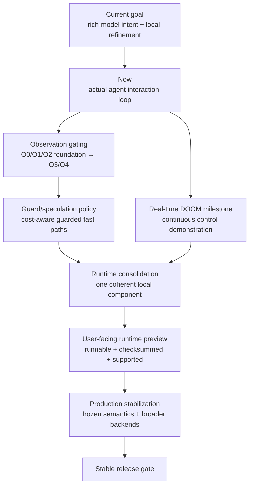

# Roadmap

This roadmap is ordered by research uncertainty, not by feature count.

Current priority (2026-09-13): follow [the updated goal](docs/CURRENT_GOAL.md).
Establish an evolution ledger, audit failure classes/regressions, and define
shared cross-domain evaluation before adding more local mechanisms. Use the
[convergence review](research/evolution/freeze_criteria.md) to end discovery;
the sections below remain a backlog, not automatic implementation instructions.
## Roadmap at a glance

This diagram is a reading/promotion map of the existing sections, not a claim that every item must execute serially or that a later box is already qualified.

## Now — actual agent interaction loop

The scoped O1/O2 studies and actual assistant use are summarized in the
[research handoff](docs/LOCAL_RESEARCH_HANDOFF.md). Local feedback in tens of
milliseconds has not yet produced a human-like end-to-end operating tempo.

- [ ] Persistent asynchronous execution and incremental observations.
- [ ] Bounded input holds, cancellation/release and stale-state handling.
- [ ] Guarded local progress that eliminates unnecessary agent/tool round trips.
- [ ] Same-model live measurements of task quality, completion latency and actual tokens.
- [ ] Comparable human operating-tempo measurements.

## Observation Gating — scoped foundation and remaining work

Goal: remove visual/model input that carries no new task-relevant information while keeping correctness as a hard gate.

- [x] Freeze O0: full screenshot after each logical step (A1 scoped baseline).
- [x] Add O1: exact unchanged-frame suppression (A1 scoped pass).
- [x] Add O2: exact changed-tile / spatial-delta feedback (A2 transport-only pass).
- [ ] Add O3: relevant-region gating.
- [ ] Add O4: local `VERIFY` before model escalation.
- [x] Measure local action-to-first-feedback latency; full agent latency remains open.
- [x] Measure image-observation elimination at equal correctness in A1's four-app suite.
- [ ] Stress tiny but semantically important changes so approximate hashes cannot silently hide them.

Active track: [`research/observation_gating/`](research/observation_gating/).

## Next — automatic speculation and guard policy

- [ ] Estimate guard cost vs `P(stale) × failure cost` per route.
- [ ] Automatically select pre-execution guard vs postcondition-only verification.
- [ ] Continue separating binding, precondition, route, observation-cache, and motor-calibration lifetimes.
- [ ] Run longer multi-app sessions with focus drift, window replacement, modal transitions, and geometry changes.

## Demonstration milestone — real-time DOOM

User direction (2026-09-13): once the live control foundation is usable, have
the assistant play DOOM in real time and develop a Product Hunt demonstration.
This extends the human-like operating-tempo objective; it does not replace
ordinary desktop task correctness or establish that capability by itself.

- [ ] Establish persistent observation/action delivery, bounded held inputs,
  cancellation/release and stale-observation handling before an extended run.
- [ ] Start with navigation and turning, then navigation under moving threats,
  then a short repeatable gameplay objective. The assistant chooses actions
  from current visual observations through Agent Interface.
- [ ] Keep the game progressing at ordinary wall-clock speed during reasoning.
  Report game speed, render rate, capture rate, observation age, decision rate,
  action duration and action-to-visible-effect latency separately.
- [ ] Compare interfaces with the same model, map/seed schedule, difficulty,
  resolution and action capabilities. Keep failed episodes and measure success,
  survival/progress, actual tokens and end-to-end time; human comparison needs
  an actual comparable human run.
- [ ] Record an uninterrupted real-time master video with synchronized input,
  observation and decision traces. A short Product Hunt edit should link to the
  full run and disclose model, local controller responsibilities and settings.
- [ ] Verify reproducible setup and usable distribution before publication.

Candidate instrumentation: [ViZDoom](https://github.com/Farama-Foundation/ViZDoom).
Its [mode documentation](https://vizdoom.farama.org/api/cpp/enums/) distinguishes
synchronous modes that wait for the agent from asynchronous modes that advance
without waiting. Use asynchronous ordinary-speed execution for the real-time
claim. A direct screen-buffer/action API experiment must be labeled separately
from an OS screen-capture and keyboard/mouse demonstration. Keep privileged
game state out of the visual controller; any scoring-only instrumentation is
separate. A [first ViZDoom/Freedoom basic-room integration](research/doom/README.md)
now exists, including assistant-operated completion and an async-clock probe.
The broader real-time gameplay demonstration remains unfinished.

## Runtime consolidation

Goal: turn promoted research semantics into one coherent component without freezing the architecture too early.

- [ ] Consolidate promoted primitives under `runtime/`.
- [ ] Provide a model/vendor-neutral local boundary.
- [ ] Add a thin CLI for setup, inspection, and demos.
- [ ] Keep deterministic fast loops local; do not fork a CLI process per action.
- [ ] Expose immediate/incremental feedback so the agent is not blocked on unnecessary waits.
- [ ] Preserve Universal Control as the fallback floor.

## User-facing runtime preview

A GitHub Release is cut only when a user can actually download and try it.

Required before the first runtime preview:

- [ ] runnable package or executable archive;
- [ ] checksum;
- [ ] minimal quickstart;
- [ ] supported OS/backend statement;
- [ ] smoke test / self-check;
- [ ] correctness gate across multiple real apps;
- [ ] recovery semantics and observation gating integrated;
- [ ] link from the release to the research evidence supporting the promoted behavior.

See [`release/README.md`](release/README.md).

## Later — production stabilization

- [ ] Freeze executable IR and error taxonomy.
- [ ] Port the frozen hot path to a systems implementation.
- [ ] Native backends beyond X11.
- [ ] Actual model-in-loop measurements: model calls, text tokens, image tokens, end-to-end latency.
- [ ] Broader app/toolkit suite and external reproduction.

## Stable release gate

A stable release requires substantially frozen protocol/execution semantics, explicit recovery behavior, cross-platform evidence, and a support envelope that is narrower than the evidence rather than broader than it.
