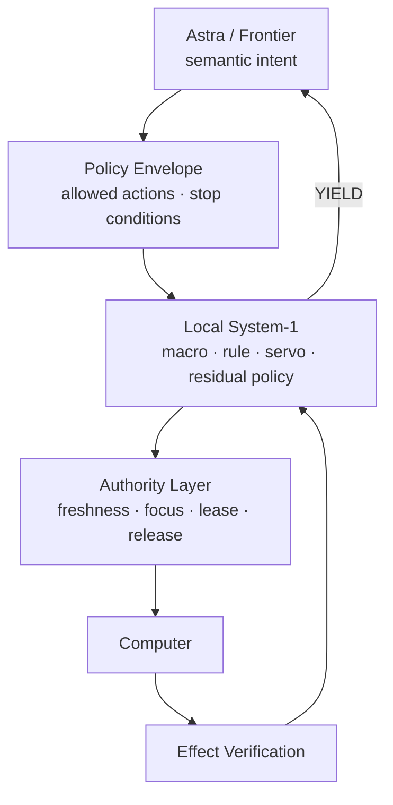

# Architecture Status

> Current research state. This separates demonstrated mechanisms from unresolved research.

## System overview



## Status matrix

| Component | Status | Notes |
|---|---|---|
| Rich model intent separation | Established | Frontier reasoning remains first-class |
| Authority separation | Demonstrated scoped | Prediction does not grant execution authority |
| Local repair | Demonstrated scoped | Local-first repair before semantic fallback |
| Macro / bounded procedure reuse | Demonstrated scoped | Reuse requires current validation |
| Symbol IR | Research | Token/frontier reduction still requires validation |
| Planner-gap controller | Research | Local useful work during frontier latency remains open |
| Learned local policy | Research | Only justified for demonstrated residual decisions |
| Product runtime | Not complete | Requires broader transfer and integration evidence |

## Safety invariants

```text
Prediction != Authority
Historical state != Current state
Confidence != Correctness
Program completion != Task success
Cached decision != Permission
```

## Current priority

The next major discriminator is not a larger model. It is whether a bounded local controller can safely provide useful work while a rich model is unavailable, while preserving:

- current evidence validation
- deterministic authority
- explicit UNKNOWN/YIELD escalation
- independent effect verification

## Documentation rule

Future architecture changes should include both:

1. textual explanation;
2. a diagram showing responsibility boundaries.

Diagrams must distinguish implemented mechanisms from research hypotheses.
