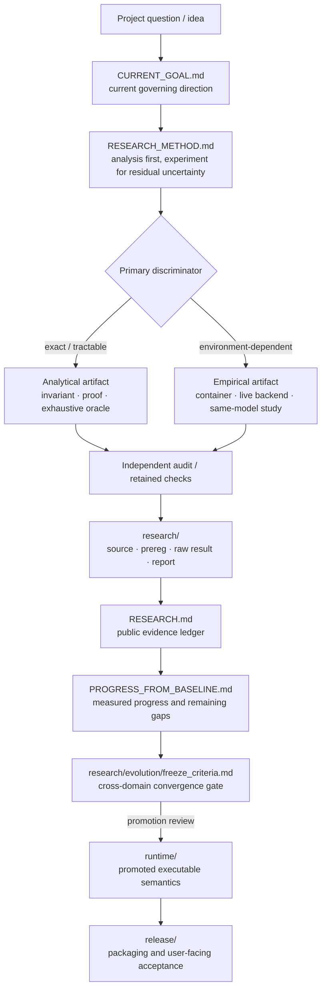

# Evidence map

This page is a navigation map for the public research record. It does not replace the underlying reports, change any scientific disposition, or summarize away scope limits.

## One-page evidence flow



The diagram shows document/evidence responsibility. It is not a claim that every research item must follow one serial workflow or that downstream gates have already passed.

## Which document answers which question?

| Question | Canonical place | What it is not |
|---|---|---|
| What are we trying to solve right now? | [`CURRENT_GOAL.md`](CURRENT_GOAL.md) | A full historical evidence ledger |
| Should this question be proved, enumerated, or measured? | [`RESEARCH_METHOD.md`](RESEARCH_METHOD.md) | Experimental evidence itself |
| What changed relative to the initial baseline? | [`PROGRESS_FROM_BASELINE.md`](PROGRESS_FROM_BASELINE.md) | A release claim |
| What happened most recently, including failures and handoffs? | [`LOCAL_RESEARCH_HANDOFF.md`](LOCAL_RESEARCH_HANDOFF.md) | The concise public entry point |
| What evidence and scoped dispositions have been retained? | [`../RESEARCH.md`](../RESEARCH.md) | A product-support statement |
| Where are the experiment sources and raw artifacts? | [`../research/README.md`](../research/README.md) and [`../research/`](../research/) | A promotion list |
| When is discovery/convergence strong enough to consider freezing? | [`../research/evolution/freeze_criteria.md`](../research/evolution/freeze_criteria.md) | Automatic promotion |
| What executable semantics are currently organized as runtime code? | [`../runtime/README.md`](../runtime/README.md) | Proof of general platform support |
| What must a user-facing distribution satisfy? | [`../release/README.md`](../release/README.md) | The research ledger |
| What should a new contributor read first? | [`../CONTRIBUTING.md`](../CONTRIBUTING.md) | A substitute for experiment-specific reports |

## Reader paths

### Public overview

```text
README.md
  -> docs/PROGRESS_FROM_BASELINE.md
  -> docs/EVIDENCE_MAP.md
  -> ROADMAP.md
```

### Validate a research claim

```text
RESEARCH.md
  -> linked report / PLAN / retained result
  -> raw or audited artifact under research/
  -> scope and uncertainty in that report
```

### Understand the current research direction

```text
docs/CURRENT_GOAL.md
  -> docs/RESEARCH_METHOD.md
  -> docs/LOCAL_RESEARCH_HANDOFF.md
```

### Evaluate runtime/release readiness

```text
docs/PROGRESS_FROM_BASELINE.md
  -> research/evolution/freeze_criteria.md
  -> runtime/README.md
  -> release/README.md
```

## Interpretation rules

- A directory name is navigation, not scientific status.
- A scoped PASS applies only to the stated assumptions, environment, and decision rule.
- A component result is not an integrated result unless a separate integration evaluation establishes that claim.
- Historical failures, stopped allocations, and superseded harnesses remain part of the record when they constrain interpretation.
- Runtime code and backend presence do not by themselves establish general platform support.
- A release claim must remain narrower than the evidence supporting it.

## Why the repository keeps long histories

Many retained paths are referenced by Issues, PRs, reports, hashes, audits, and successor experiments. Moving or rewriting completed evidence for cosmetic cleanup can damage provenance. The preferred cleanup strategy is therefore:

1. keep retained evidence paths stable;
2. add small canonical indexes and diagrams;
3. keep the newest/current state visible near the top;
4. collapse or link historical detail when the boundary is unambiguous;
5. avoid silently deleting negative or superseded evidence.
