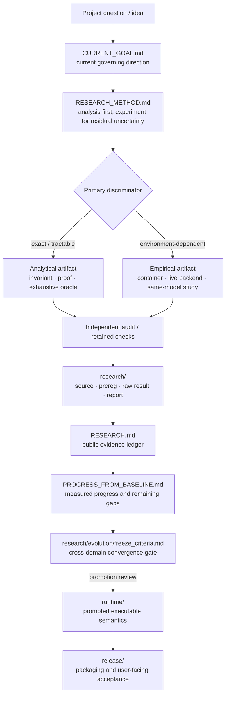

# Evidence map

This page is a navigation map for the public research record. It does not replace the underlying reports, change any scientific disposition, or summarize away scope limits.

## One-page evidence flow


```mermaid
flowchart TD
    U[Project question / idea]
    G[CURRENT_GOAL.md<br/>current governing direction]
    M[RESEARCH_METHOD.md<br/>analysis first, experiment for residual uncertainty]
    A{Primary discriminator}
    AN[Analytical artifact<br/>invariant · proof · exhaustive oracle]
    EX[Empirical artifact<br/>container · live backend · same-model study]
    AUD[Independent audit / retained checks]
    RAW[research/<br/>source · prereg · raw result · report]
    LED[RESEARCH.md<br/>public evidence ledger]
    PROG[PROGRESS_FROM_BASELINE.md<br/>measured progress and remaining gaps]
    FREEZE[research/evolution/freeze_criteria.md<br/>cross-domain convergence gate]
    RUN[runtime/<br/>promoted executable semantics]
    REL[release/<br/>packaging and user-facing acceptance]

    U --> G
    G --> M
    M --> A
    A -->|exact / tractable| AN
    A -->|environment-dependent| EX
    AN --> AUD
    EX --> AUD
    AUD --> RAW
    RAW --> LED
    LED --> PROG
    PROG --> FREEZE
    FREEZE -->|promotion review| RUN
    RUN --> REL
```

The diagram shows document/evidence responsibility. It is not a claim that every research item must follow one serial workflow or that downstream gates have already passed.

## Which document answers which question?

| Question | Canonical place | What it is not |
|---|---|---|
| What are we trying to solve right now? | [`CURRENT_GOAL.md`](CURRENT_GOAL.md) | A full historical evidence ledger |
| Should this question be proved, enumerated, or measured? | [`RESEARCH_METHOD.md`](RESEARCH_METHOD.md) | Experimental evidence itself |
| What changed relative to the initial baseline? | [`PROGRESS_FROM_BASELINE.md`](PROGRESS_FROM_BASELINE.md) | A release claim |
| What happened most recently, including failures and handoffs? | [`LOCAL_RESEARCH_HANDOFF.md`](LOCAL_RESEARCH_HANDOFF.md) | The concise public entry point |
| What evidence and scoped dispositions have been retained? | [`../RESEARCH.md`](../RESEARCH.md) | A product-support statement |
| Where are analytical proof/identifiability artifacts? | [`../research/analysis/README.md`](../research/analysis/README.md) | A substitute for empirical measurements when the claim is environment-dependent |
| Where are the experiment sources and raw artifacts? | [`../research/README.md`](../research/README.md) and [`../research/`](../research/) | A promotion list |
| When is discovery/convergence strong enough to consider freezing? | [`../research/evolution/freeze_criteria.md`](../research/evolution/freeze_criteria.md) | Automatic promotion |
| What executable semantics are currently organized as runtime code? | [`../runtime/README.md`](../runtime/README.md) | Proof of general platform support |
| What must a user-facing distribution satisfy? | [`../release/README.md`](../release/README.md) | The research ledger |
| What should a new contributor read first? | [`../CONTRIBUTING.md`](../CONTRIBUTING.md) | A substitute for experiment-specific reports |
| Where are recurring architecture/status terms indexed? | [`TERMINOLOGY.md`](TERMINOLOGY.md) | A replacement for the canonical source documents |

## Reader paths

### Public overview

```text
README.md
  -> docs/PROGRESS_FROM_BASELINE.md
  -> docs/EVIDENCE_MAP.md
  -> ROADMAP.md
```

### Validate a research claim

```text
RESEARCH.md
  -> linked report / PLAN / retained result
  -> raw or audited artifact under research/
  -> scope and uncertainty in that report
```

#### Package-specific review qualifications (checked 2026-10-02 UTC)

Read these dated qualifications alongside the retained reports. They preserve the original reported outcomes and distinguish the affected claims; later owner adjudication belongs in the linked PR/Issue history.

- **#6749 OrbStack successor ([#6760](https://github.com/Unjuno/agent-interface/pull/6760#issuecomment-5957180617)):** The [retained report](../research/analysis/prefix_stability_6689_successor_6749_orbstack_20261003/REPORT.md) records a finite-method PASS. Static review found five named rejected controls but only four distinct mutated records. The historical CI digest in `LOCAL_CI_CURRENT_MAIN.json` belongs to [the log at commit c86bda7](https://github.com/Unjuno/agent-interface/blob/c86bda787e1041749f5258d918ab3a0aefc70748/research/analysis/prefix_stability_6689_successor_6749_orbstack_20261003/execution/local_ci_latest_main.stdout.log), not the later bytes at that path. The later claimed 548-directory/five-test validation has no corresponding retained stdout in the reviewed package. This qualifies control coverage and validation custody; it is not an empirical FAIL verdict.
- **#6749 WSLc successor ([#6762](https://github.com/Unjuno/agent-interface/pull/6762#issuecomment-5957367370)):** The [retained report](../research/analysis/prefix_obligations_6749_t0_wslc_20261003/REPORT.md) records agreement over 8,640 rows, but review identified 228 STABLE_FAIL/TIMEOUT rows where candidate and auditor both omit `source_frontier:optional`. Whether TIMEOUT discharges waiting despite non-completion remains a contract-interpretation question against the written obligation rule; shared agreement does not resolve it. The auditor command receipt also contains a malformed raw digest. Keep the unqualified method-PASS claim pending that adjudication, without declaring a broader empirical failure. The [distinct WSLc and OrbStack fixtures](https://github.com/Unjuno/agent-interface/issues/6749#issuecomment-5957277642) are not same-fixture engine replications or pooled results.
- **#5694 event/time A02 ([#6771](https://github.com/Unjuno/agent-interface/pull/6771#issuecomment-5958219533)):** The [retained run record](../research/analysis/exogenous_opportunity_5694_event_vs_time_a02_20261003/execution/formal-01/RUN_RECORD.md) reports PASS, but the committed audit schema differs from the frozen auditor and published JSON bytes/hashes differ from the claimed original outputs. The [post-merge custody qualification](https://github.com/Unjuno/agent-interface/pull/6771#issuecomment-5958294549) remains unresolved at this check: finite event/time arithmetic consistency does not establish unchanged container outputs or independently evidenced invocation counts and timing. This locator makes the package discoverable despite its lack of a recognized analysis-index REPORT/STOP filename; it does not certify exact execution provenance. Preserve the published bytes while any recovered originals or transformation history are added separately.

### Understand the current research direction

```text
docs/CURRENT_GOAL.md
  -> docs/RESEARCH_METHOD.md
  -> docs/LOCAL_RESEARCH_HANDOFF.md
```

### Evaluate runtime/release readiness

```text
docs/PROGRESS_FROM_BASELINE.md
  -> research/evolution/freeze_criteria.md
  -> runtime/README.md
  -> release/README.md
```

## Interpretation rules

- A directory name is navigation, not scientific status.
- A scoped PASS applies only to the stated assumptions, environment, and decision rule.
- A component result is not an integrated result unless a separate integration evaluation establishes that claim.
- Historical failures, stopped allocations, and superseded harnesses remain part of the record when they constrain interpretation.
- Runtime code and backend presence do not by themselves establish general platform support.
- A release claim must remain narrower than the evidence supporting it.

## Why the repository keeps long histories

Many retained paths are referenced by Issues, PRs, reports, hashes, audits, and successor experiments. Moving or rewriting completed evidence for cosmetic cleanup can damage provenance. The preferred cleanup strategy is therefore:

1. keep retained evidence paths stable;
2. add small canonical indexes and diagrams;
3. keep the newest/current state visible near the top;
4. collapse or link historical detail when the boundary is unambiguous;
5. avoid silently deleting negative or superseded evidence.
