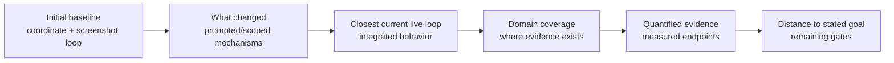

# Progress from the initial baseline

For the current public CLI, portable distribution, direct primary-use results
and remaining integration gaps, see the
[public transport handoff](PUBLIC_TRANSPORT_HANDOFF_2026-09-20.md), which also links
the earlier [2026-09-20 integration snapshot](INTEGRATION_STATUS_2026-09-20.md).
The dated historical narrative below retains its original evidence scope.

Status date: 2026-09-14. This is an evidence-based progress map, not a release
claim. The repository grew from an initial coordinate-and-screenshot research
baseline into a Linux/X11 control candidate with durable recovery, scoped local
execution and independent effect checks. It still does not deliver human-tempo
general computer use or an installable Agent Market product.
## How to read this progress map

This diagram mirrors the existing sections below. It is a reading guide, not a new performance claim or a statement that the evidence forms one causal sequence.

## Detailed recent progress narrative

The retained chronological narrative below is collapsed by default. The summary table and current live-loop sections remain visible immediately afterward.

<strong>Expand detailed recent progress narrative</strong>

The first fresh compiled-interface integration now passes its positive and
changed mechanics pair.  The positive Chromium case performs two fresh-evidence-
dependent actions with zero frontier-model resumptions and independently submits
`t991025`; useful feedback follows the actions in773.005ms and568.488ms.  The
changed case performs the first action, observes that Submit disappeared and
stops before target input.  Adaptive caller v2 preserves `unknown_state`, one
completed action and confirmed partial delivery instead of collapsing the result
to `failed`.  Two grounding calls report18,792 input tokens; raw frames and source
hashes audit Windows/WSL.  Retained v1-v3 failures and v4's composition defect
remain visible.  A matched baseline, repeated rate and cross-domain test remain
before efficiency or human-tempo claims.

The newest held-out target study keeps one planner model on the whole decision
path. A first formal OpenTTD attempt fails because its three free-form candidates
omit company finances despite `visually_unambiguous` confidence. A repaired pair
uses the model point as a coarse anchor, derives five nearby repeated toolbar
slots from the source image, gathers persistent hover receipts in bounded batches
and returns them to the same model. The negative association fault has zero
target input; stable independently opens finances in33.920s with9,296+10,178
reported input tokens. Windows/WSL reconstruct126 retained frames. This advances
active semantic grounding but adds6.400s of hover work and establishes no speed
or token reduction. Token accounting does not treat subagent context shifting as
an interface improvement.

The newest target-reference candidate replaces repeated point/frame declarations
with a session-local handle plus relative offset. Its first archive attempt
exposes a low-information patch alias and remains failed. A fresh same-session
OpenTTD run then revalidates a textured region across the window manager's actual
`[17,20]` X11 client move and derives/adopts the new point through existing
admission. The fixed preregistered geometry endpoint is false because the window
manager did not realize the requested `[16,0]` displacement, and there is no
independent semantic effect. This is design evidence for observed-binding
transforms, not promotion.

A preregistered Chromium follow-up supplies the missing independent effect. The
positive case follows observed client delta `[20,8]`, clicks the relocated Save
button using only a handle/offset, and independently receives exact `t991005`.
Input ack to useful frame is60.016ms and to semantic completion192.643ms. A
same-surface `about:blank` negative returns `MISSING`, admits no pointer input and
creates no submission. The matched pair passes2/2 over36 exact frames. This is
one scripted target and still does not measure model grounding or token savings.

The first preregistered model-facing ABBA screen then returns valid strict actions
4/4 with Luna-low. Both image-coordinate calls identify Save and both no-image
handle calls emit the exact typed relation. Its token promotion gate fails:
coordinate calls report12,583 input tokens each, while handle calls report11,332
and54,244, including42,240 cached tokens in the second identical handle call.
This exposes uncontrolled caller-context variance; by itself it establishes no
handle token reduction and did not qualify for fresh live A/B.

The corrected context path now uses one structured action envelope, a short
responder contract, zero project-document budget and an empty workspace. A fixed
screen passes4/4 with9,268 coordinate versus8,009 handle input tokens. In four
new live Chromium sessions over two seeds, coordinate and no-image handle arms
both independently submit2/2. Reported input is9,280 versus8,013 per call; all
62 frames replay exactly. The first live handle allocation safely failed2/2
because a model-facing friendly name did not equal the private random registry
ID. A unique short session alias repairs that fault, remains private-ID-backed,
and revalidates both at read-only query and after model wait before admission.
This is one repeated form with two cases/arm; handle also adds two durable calls,
so no general token, cost or causal latency claim follows.

The first round-trip repair now combines fresh capture and read-only alias checking
without granting input authority. In a preregistered seed991012 Chromium pair,
combined and separate paths both independently save1/1; admission revalidates and
release verifies2/2. Combined uses12 durable calls and14 exact frames versus14
calls and15 frames for separate observe/query. The handle check is bound to the
exact returned observation identity. Single-pair202.583/365.441ms values are
descriptive only; there are no model calls or cross-domain evidence yet.

Cross-domain scripted replication now passes on OpenTTD seed991004. The combined
operation resolves Road Construction on exact observation17, admission revalidates,
the first-segment condition sees160 target/0 guard changed pixels, and the second
segment runs. The independent engine passes owned target roads, ordered connections,
forbidden-row and surrounding-guard checks. All37 frames audit cross-OS. The
234.989ms combined boundary and3956.186ms local program are single-episode values;
development-known geometry and no model call prevent broader claims.

The next live model pair uses identical seed991013 prompts and two Luna-low calls.
Both return the exact alias action and report8,013 input tokens. Stable saves and
independently succeeds with14 durable calls, two fewer than prior separate-query
model-handle cases. In the other arm the surface changes to `about:blank` after
model return; fresh admission reports `MISSING`, admits zero target-click pointer
input, releases safely and creates no submission. The37-frame pair audits cross-OS.
One known form and constructed fault do not establish broad speed or compression.

The newest target-authorship candidate replaces that form's manually supplied
absolute box with a bounded region centered on the model point. Both fresh
seed991014 coordinate calls select `[270,243]`. Stable source/fresh patches match,
the private alias follows a `[20,8]` surface move, and a no-image handle action
independently saves `t991014`. A paired post-model page change makes the exact
patch differ; minting refuses before creating a handle, admits zero target pointer
input and stops safely. The independent cross-OS audit reconstructs35/35 frames
and recomputes both patch digests. This removes one human-authored geometry input
for one known button. The24x14 region size remains human-selected, so unknown-app
grounding, automatic region proposal and efficiency remain open. A post-hoc
contract review also separates the prompt's screenshot-absolute numeric basis
from the caller-assigned `window_content` transformation frame. Promotion is held
until frame authorship is explicit or independently derived.

The immediate repair now gives that transformation choice to the model under a
separate typed field. In two preregistered seed991015 sessions, Luna-low authors
the same source-observation pixel point and `surface_origin_translation` motion
model2/2. Stable follows the observed window-origin delta and independently saves;
the paired changed target refuses before handle creation and input. All36 frames
audit cross-OS. Stable decision-to-independent-return is8.343s, including7.446s
of parent-observed model execution. This closes the prior contract ambiguity for
one known button, while fixed region size, new domains and repeated timing remain.

That cross-domain test has now run and exposes semantic grounding as the next
bottleneck. In two fresh OpenTTD cases, the model gets point-space and motion
semantics right2/2 but identifies the known Road Construction icon0/2. The
runtime faithfully mints and moves the selected wrong regions. Stable tracks the
actual `[21,28]` surface delta, then a local target/guard condition halts before
the remaining road steps; independent task success stays false and surrounding
state is preserved. The paired target-change case cannot test refusal because
the correct toolbar click leaves the unrelated model patch unchanged. The62-frame
cross-OS audit passes. The direct full-frame failure is retained, and the next
comparison will add bounded hover-label evidence rather than tuning the answer.

That hover candidate has now completed two preregistered studies. Luna-low
selects the correct Road Construction candidate3/3 from exact delayed tooltip
evidence. The first attempt retains a transient-identity failure: a hovered
24x14 source patch changes when hover clears, so the interface safely stops with
zero target clicks. The corrected pair first restores the exact pre-hover patch.
Its rehover negative again stops before target input, while stable tracks an
actual `[21,28]` surface move, resolves `[841,79]`, completes the guarded L and
passes all independent engine checks. The corrected81 frames audit on Windows
and WSL. Reported input is9,935--9,936 versus9,296 for the failed direct stable
baseline, and active hover takes about3.6s. Accuracy and recovery improve at
extra cost; human tempo, automatic discovery, and held-out transfer remain open.

Latest delta: bounded drag-effect memory now transfers correct actuation to one
changed seed991004 L geometry. Two distinct drags complete all five target tiles
with zero surrounding changes or repeated completed-segment input. The planner
uses12 turns and204,114 input tokens, however, and does not declare completion
before the bound. The independent score succeeds after211.632 seconds to the
second-drag feedback; controller-verified hard success and semantic completion
timing remain absent. Reliable human-tempo task completion remains open.

Newer local-continuation evidence derives target/guard boxes from the admitted
pointer path instead of transcribing them manually. Frozen calibration is3/3.
On fresh seed991004, a nominal wrong-row control aliases to the positive because
of tile snapping and is retained as a failed experimental design; local and
independent engine results agree. A separate completed-segment repeat is stopped
before continuation and independently remains incomplete. The106 fresh exact
frames audit cross-OS. This is development-known path transfer, not held-out
visual geometry; feedback still arrives about2.5 seconds after the drag.

The first held-out resolution transfer reveals that coordinates also need an
explicit frame. Two preregistered global translations fail because centered
toolbar chrome and window-relative map content move differently. Frame-specific
transforms then classify positive/repeat pairs4/4 at1280x720 and a predicted
1152x720 replication, agreeing with the independent engine score. All265 frames,
including both failures, replay exactly cross-OS. This is resolution transfer on
one save/path; it does not establish unseen-task grounding or faster feedback.

That transform now executes inside the candidate interface. One fresh1152x720
pair sends only original1024 coordinates plus frame identity; runtime binding
resolution covers clicks, drags and condition boxes, and engine outcomes agree
2/2 over69 frames. A post-admission geometry fault then returns
`needs_decision` with zero pointer admissions in105.333ms. This closes a scoped
resize/move race before input, while frame identity remains task-declared.

Latest negative follow-up: a pixel-only persistent-effect receipt separates
selected archived new and repeated effects, but its preregistered prompt form
reverses the desired model outcome. Exact-prompt Astra recognizes progression
2/2; receipt Astra remains uncertain2/2 and adds156 input tokens per call. The
form is rejected without live input. The next candidate separates an
agent-authored visual postcondition from action admission and evaluates it as a
local barrier inside an already bounded program.

That in-program prototype now has a fresh X11 negative result. Its unmet branch
stops later input, but the nominal branch accepts a12px partial Inkscape move
against a24px requested move because163 pixels changed in the single ROI. The
later Save step starts, so this condition fails the correctness gate and remains
advisory only. A continuation barrier needs target-relative visual structure.

A displacement-specific follow-up now passes one fresh scripted X11 target and
partial pair. It admits a later Save after two24px anchor samples and stops before
Save after two20px samples;18 exact frames, saved SVG and releases audit on
Windows/WSL. This advances local task-relative continuation for moved objects.

One fixed-context authorship probe now passes Luna-low2/2 and Astra-medium2/2.
Every strict model-authored patch accepts retained24px samples and rejects20px
samples. The prompt fixes most contract fields and performs no live input, so a
fresh live transfer remains required before integrating this moved-object path.

That unchanged first Luna condition now passes two opposite-order fresh X11
target/partial pairs:24px admits Save2/2 and20px stops before Save2/2. All38
frames reconstruct exactly and all four terminals release input. Earlier path,
focus, packaging and line-ending-sensitive preregistration failures remain
retained. Promote only as a same-task moved-object local postcondition candidate;
pointer paths remain scripted and the model call stays outside the episode.

A separate placement target/guard operator exposes two archived false stops when
sampling begins before the visual effect settles. Runtime validation now requires
bounded settle immediately before the condition. With unchanged boxes and
thresholds, six engine-diagnosed OpenTTD archive cases classify6/6. One fresh
scripted Inkscape allocation then admits Save only for the target case and stops
both partial and guard cases;28 exact frames and all releases audit cross-OS.
The first fresh OpenTTD pair retains a driver failure caused by a missing toolbar
opener. Adding that one click and repeating in opposite order produces two
corrected pairs: target admits the second segment and independently completes the
L2/2; wrong-row stops before the second segment2/2. All119 corrected frames audit
cross-OS. Human-authored boxes, one seed and about2.5s from first drag to local
condition prevent a general or human-tempo claim.

## What changed

| Stage | Initial state | Current evidence | Status |
| --- | --- | --- | --- |
| Observation | Repeated full screenshots around individual actions | Exact unchanged-frame suppression, exact tile transport, changed-region and compact planner views | Proven in scoped fixtures; general visual/token policy remains experimental |
| Evidence withholding | Missing pixels could be confused with empty or absent content | Actual region pixels withheld with explicit policy UNKNOWN; full 4/4 exact versus redacted 4/4 UNKNOWN; stale policy-bound mutation refused before input | Scoped Chromium geometry, adjacent-action, hidden-target, policy-change and authorized whole-replacement gates pass; bypass remains |
| Input | Coordinates and short scripted keyboard/pointer actions | Absolute intent deadlines, focus/surface binding, explicit screen-chrome/window-content transforms, held input, cancellation/expiry, verified release and tail suppression | Strong scoped Linux/X11 evidence; frame selection is still task-declared |
| Execution | One action followed by another model boundary | Bounded multi-step programs, phased submit, passive followups and local continuation | Working in selected desktop/game tasks; semantic replans still need the model |
| Freshness | Screenshot age was mostly implicit | Observation identity/age, stale refusal, route and binding guards, re-observation after interruption | Mechanism exists; model delay can still age a frame by seconds |
| Recovery | Transport uncertainty risked repeated work | Durable journal, request IDs, read-only outcome recovery and lost-query reconciliation without resend | Live input and saved-effect recovery demonstrated |
| Completion | Program completion could be mistaken for task success | Program terminal, application effect and independent task score are separate states; UNKNOWN is preserved | Demonstrated on Calc, Chromium, Inkscape and game fixtures |
| Model evidence | Full durable records were passed to the planner | Strict typed compact view retains action/effect authority and retry rules | Fixed 16-call check passed; first live action passed; adversarial adoption gate remains |
| Benchmarking | Four small desktop fixtures | Domain matrix spans desktop apps, DOOM, Mindustry, OpenTTD and Luanti | Useful breadth; no formal benchmark suite or aggregate score yet |

The initial repository snapshot dates to 2026-09-12. Iteration volume is not a
progress metric; the claims above depend on retained runs, source hashes,
negative controls and independent audits.

## Closest current live loop

The first process-scoped timing envelope now covers one fresh Calc task. It saves
and independently verifies 480/192 in three Luna-low turns. Initial observation
detection to semantic completion is 23.976 seconds; wrapper-observed model wait
totals 21.334 seconds, while proposal-to-useful-feedback takes 1.105 and 0.873
seconds. Missing provider/runtime/OS endpoints remain explicit. The initial
per-event-fsync recorder proved too costly and was replaced by a buffered candidate;
An OpenTTD envelope now follows it. A fixed adaptive route uses two Luna-low and
six Astra-medium calls to build the guarded road in111.853 seconds, including
91.781 seconds of model wait and126,420 reported input tokens. Batched hover
contact sheets preserve three delayed tooltips in one model-visible image. Two
fresh adaptive tasks independently pass, although the first exposed a packaging
failure after scoring. Two preregistered matched blocks now give fixed Astra2/2,
adaptive1/2 and fixed Luna0/2. Astra completes in98.351 and94.929 seconds with7
turns each. The second adaptive run falsely declares visible completion before
the independent score fails. This rejects adaptive-route promotion but two
episodes cannot promote Astra. New tasks, fuller order balancing and a human
comparison remain. A fresh v3 negative control then turns independent score=false
into a persisted typed failure with zero model/input calls and driver exit0. A
third fixed-Astra episode passes in92.377 seconds with6 calls, taking the same-task
record to3/3. A preregistered fourth episode pre-opens Road Construction before
the timed observation and passes in89.272 seconds with6 calls,97,696 input
tokens,24 exact frames and20 durable calls. It handles the first changed initial
UI state, but the same task geometry remains. The removed toolbar-discovery
boundary is replaced by targeting confirmation, so turns and durable calls do
not fall and the3.105-second descriptive difference is not a speedup. The next
preregistered allocation changes the save, map contract and visible target:
seed991002 moves target tiles from678..680 to465..467. Fixed Astra independently
passes in89.097 seconds, but uses7 turns,114,177 input tokens,32 frames and24
durable calls. Those are+1 turn,+16,448 tokens,+4 frames and+4 calls versus the
prior closed-toolbar geometry. A shorter sampled model wait hides the added
interface work in total time, so the wall-time difference is not a speedup.

The newest Chromium episode is the clearest small end-to-end sample. A fresh
screenshot and a 621-byte strict compact UNKNOWN record drove one real model
decision. The resulting program saved the exact requested value, survived two
deliberately abandoned saved-effect query connections through read-only recovery,
and reached independent evaluation in 9.706 seconds from the first runtime
capture. The model runner consumed 6.542 seconds; the caller handoff consumed
230 ms. This is one sample, not a latency distribution or human comparison.

Earlier actual-use samples were slower: the current-runtime known Mindustry bend
task took 84.967 seconds to its final input terminal and 117.358 seconds to
independent evaluation, with 18–23 second gaps between programs. The corrected
OpenTTD visual placement took 43.42 seconds to its last terminal. These numbers
include model/tool/host gaps and show why local millisecond execution alone does
not yet produce ordinary human interaction tempo.

The present bottleneck is the semantic boundary. Local admissions, cancellation,
recovery reads and feedback production commonly operate in milliseconds to
hundreds of milliseconds, while model decisions in recent measured samples take
seconds. The architecture now has enough correctness structure to reduce the
number and size of those boundaries; it has not yet shown that reduction across
unseen, long-running tasks.

## Domain coverage

Each domain exposes a different weakness. There is no single king benchmark and
the rows must not be averaged into one difficulty score.

| Domain | What has actually been shown | Main missing proof |
| --- | --- | --- |
| Desktop apps | Small Calc, Chromium, Inkscape and XTerm tasks; dialogs, focus loss, interruption, saving and independent effect checks | Unknown applications, richer window/scroll/drag workflows and repeated held-out tasks |
| DOOM | Shared held-key/cancel/expiry readiness and later directional-input repair/assistant gameplay evidence | Stable continuous useful-feedback loop, reaction distribution and public real-time demo |
| Mindustry | Actual assistant construction of eight directed conveyors on a known route; 112-tile guard and 49-copper post-control delivery; shared caller scripted replay and cancellation | Fresh route planning, multi-object control, event-driven recovery and much shorter decision gaps |
| OpenTTD | Fixed Astra passes3/3 canonical closed-toolbar,1/1 pre-opened and1/1 seed991002 shifted straight geometry; adaptive1/2 and fixed Luna0/2; bounded effect memory passes2/2 on seed991003; one seed991004 L run independently completes at the12-turn bound without controller verification; a same-seed scripted target/guard condition admits/stops the second L segment4/4; boxes can now be derived from a known path, with one aliased negative retained and one repeat correctly suppressed | Efficient semantic completion on changed L geometry, held-out path-derived conditions, multiple held-out geometries, fewer/slimmer model boundaries, fuller order balancing, matched human control, scroll/window complexity and long-horizon planning |
| Luanti | Current-engine launch, deterministic tiny pad/pose and read-only node/pose feasibility | Normal navigation, camera-mode contract, inventory, interaction and successful construction |

DOOM remains valuable for continuous motor pressure. Mindustry and OpenTTD are
already catching errors that an FPS benchmark would miss: long planner gaps,
overlong placement drags, local side effects and resource-flow completion.
Luanti remains a feasibility candidate rather than demonstrated agent control.

## Quantified evidence so far

- Sparse reactive control reached 8/8 development-screen successes in each of
  XTerm, Chromium, Calc and Inkscape.
- Exact unchanged-frame suppression preserved 96/96 tasks per strategy and cut
  same-trace image count by 17.15%, with zero measured false suppressions.
- Exact tile transport preserved 32/32 tasks per strategy and cut serialized
  bytes by 70.73% across 553 exactly reconstructed frames. This is transport
  reduction, not a token or latency claim.
- The strict compact planner experiment preserved the expected decision in 8/8
  full and 8/8 compact calls. Reported input fell from 80,564 to 77,880 tokens,
  a 3.33% reduction across the fixed calls. The first fresh live compact-driven
  form action then succeeded with one model call.
- A same-image delayed-effect comparison exposed a compression limit. Retaining
  prior execution used 9,759 input tokens/call and produced wait/check 4/4;
  omitting it used 9,485 but represented a different state and produced
  submit-once 4/4. Those 274 tokens are necessary semantics in this case.
- One fresh live follow-up used that evidence to choose wait/check while the
  delayed effect progressed. Model computation took 6.494 seconds, leaving zero
  additional sleep; one read-only checkpoint then verified the exact value with
  no post-UNKNOWN input. This is overlap evidence from one authored task.
- Two fresh same-seed partial-terminal cases expired before versus after Return.
  Strict evidence drove submit-once for the 3/6 prefix and wait/check for 4/6;
  only the former admitted new input and both independently succeeded. The new
  submission needed ten effect polls, so event-driven readiness remains missing.
- A fixed follow-up replaced those ten caller queries with one bounded verifier
  query. Both fresh tasks succeeded; post-UNKNOWN detection fell from 5,060.458
  to 4,897.769 ms. The worker still made 97 filesystem samples, so this proves
  round-trip reduction rather than event-driven readiness or compute savings.
- A new live model follow-up retained submit-once versus wait/check at the partial
  Return boundary and used one bounded query after each decision. The fresh-submit
  route fell from ten to one post-decision queries and 17 to 8 total durable calls.
  Different model times prevent attributing the end-to-end latency change.
- Lost-response recovery has been exercised for input outcomes and saved-effect
  queries. The current form episode recovered two queries by identity with zero
  resend and admitted no input after VERIFIED.
- Actual pixel redaction now preserves explicit uncertainty in one fresh frame:
  full input reads the exact value 4/4 and redacted input returns policy UNKNOWN
  4/4. Rendering is 38.757 ms median, while metadata adds 112 input tokens/call;
  this improves evidence semantics rather than compression.
- A six-episode action follow-up completes an adjacent visible Save task 2/2 in
  full, unmarked-redaction and explicit-redaction conditions. All effects verify,
  all independent scores pass, secret disclosure and actions into the hidden
  region are zero. The unmarked control also passes, so explicit metadata has no
  demonstrated advantage on this simple task; unsafe/refinement/bypass cases remain.
- When the task instead requires editing the hidden field, the full condition
  completes and independently verifies, while both redacted conditions stop with
  zero post-observation input and zero private-value disclosure. This is one
  sample per condition.
- Two fresh same-prompt policy-race sessions both produce an actual mutation
  proposal. The stable policy admits and verifies it; tightening the policy after
  model return creates a version mismatch and rejects it with zero input. Both
  calls use 9,359 input tokens and 23 frames replay exactly. This closes one stale
  unsafe-proposal case, but the already presented full image means it is not a
  retroactive confidentiality claim.
- One fresh authorized-refinement sequence keeps the redacted pixels unchanged.
  The no-authority call stops; a new observation and version permits only exact
  whole replacement and Save, which verifies independently without disclosing
  the old value. Stale replay and eleven altered-authority controls refuse.
- A bound presentation bundle accepts that current redacted artifact and refuses
  13 crop/history/raw/OCR/UI-tree/clipboard and identity variants before model
  delivery. Eight shape controls keep append, partial selection and caller steps
  outside the whole-replacement capability. These are offline boundary controls.

## Distance to the stated goal

| Goal gate | Current assessment |
| --- | --- |
| Trustworthy low-level Linux/X11 control | Substantial scoped evidence; still a research candidate |
| Continuous live model operation | Partial; works in bounded episodes, but seconds-long semantic gaps dominate |
| Human-like speed and iteration | Not demonstrated |
| Broad task judgment | Not demonstrated; successful tasks are small and often known during development |
| Token-efficient operation | Small measured planner-input reduction; large image transport reduction has not become an equivalent model-token reduction |
| Cross-platform Windows/macOS | Outside the current architecture-discovery scope and untested |
| Easy installation and agent-agnostic API | Design intent only; no runnable distribution |
| Product Hunt / Agent Market demonstration | Research material exists; public demo and product packaging are not ready |

The adversarial boundary rejects nine wrong or missing request/contract cases
before model delivery. Corrected delayed and partial-terminal experiments now
show that prior execution and the completed prefix change wait-versus-submit
decisions in three fresh states. Actual redacted-observation geometry,
readability, adjacent action, hidden-target refusal and one post-model policy
transition, authorized whole replacement, and declared presentation/plan bypass
controls now pass scoped gates. The first OpenTTD initial-state variation passes
without reducing model boundaries; the first new geometry passes while requiring
more boundaries and tokens. A five-tile L objective now changes the structure to
two connected directional segments and passes model-free fixture/negative gates.
Its first preregistered model allocation exposed a driver identity-contract bug
before pointer input and is retained without retry, so it provides no task
success or latency evidence. A separately preregistered corrected allocation
runs eight actions, but its ninth-turn visual verification is false: the B-to-C
leg is correct while A-to-B is absent and four surrounding tiles are changed.
The 148.339-second path uses 146,736 input tokens and does not reach semantic
completion. A posthoc visual-only action-region crop then leaves both full and
composite Astra judgments at `uncertain`, while adding 526 input tokens. The crop
is rejected. The full image supports uncertainty when explicitly asked. A fresh
semantic-checkpoint allocation then prevents the second mutation and false
verify, but uses 11 turns/182,284 input tokens before a safe uncertain stop; the
task remains incomplete. A zero-model Ctrl+2 probe makes trees transparent while
preserving every scored road/owner field and save bytes. Typed access to that
view method is the next recovery candidate, followed by multiple geometries
under the same recovery semantics. Human baselines and
model-boundary timestamps must then be collected on identical task allocations.
Only after those pass should the runtime/API be frozen and packaged.

Later allocations turn the tree view toggle into a one-way pre-action method,
repair the bounded-limit finish path, reject a sign-view transform after a
matched2/2-versus2/2 diagnostic, and expose persistent application effects to
the planner. The first effect-sheet episode succeeds in7 turns, while its
unchanged replication safely stops after occlusion instead of repeating a
completed drag. Bounded effect memory then preserves the original before/after,
latest inspection and action difference across that boundary. Its first two
fresh live episodes both independently complete the L in9 turns with no repeated
completed-segment drag. They still require34 durable calls,44 exact frames,
more than151k input tokens and153 to161 seconds. The next allocation changes L
geometry while preserving the same memory and scoring semantics. These results
improve changed-objective correctness and recovery; they do not establish
human-tempo operation, token efficiency or broad reliability.

Primary evidence: [research index](../RESEARCH.md), [current architecture](architecture.md),
[domain feasibility](../research/benchmark_discovery/README.md),
[Mindustry current-runtime self-use](../research/benchmark_discovery/MINDUSTRY_BEND_V2_SELF_USE.md),
[OpenTTD guarded placement](../research/openttd_task/GUARDED_PLACEMENT.md),
[compact fixed comparison](../research/live_control/COMPACT_PLANNER_EVIDENCE.md), and
[compact live form](../research/live_control/COMPACT_LIVE_FORM.md), and
[delayed-effect decision evidence](../research/live_control/DELAYED_EFFECT_DECISION.md), and
[model-driven delayed-effect live use](../research/live_control/DELAYED_EFFECT_LIVE.md), and
[partial-terminal live decisions](../research/live_control/PARTIAL_TERMINAL_LIVE.md), and
[bounded effect wait](../research/live_control/EFFECT_WAIT.md), and
[live partial-terminal wait](../research/live_control/PARTIAL_TERMINAL_WAIT.md).
Latest observation boundary: [actual pixel redaction](../research/live_control/REDACTED_OBSERVATION.md).
Latest live integration: seed248 again yields model submit_once for3/6 before
Return and wait_and_check for4/6 after Return. Only the former admits one new
submission; both use one bounded effect query and independently save t000248.
Before-Return post-decision queries fall10->1 and total durable calls17->8 versus
the prior live route. Model runners7.053/5.356s and inputs9823/9822 mean the
admission-to-VERIFIED times14.139/6.834s are not a causal latency comparison.
Planner v4 adds explicit v6 provenance, about20 tokens, and rejects five unknown
revision/binding controls. The first integration refusal is retained; exact
frames and full evidence audit cross-OS. See PARTIAL_TERMINAL_WAIT.md.

Latest round-trip candidate: a same-seed fresh Chromium A/B compares 500ms caller
polling with one6000/50ms verifier wait. Both independently save t000246. The
post-UNKNOWN path changes from10 durable calls/5060.458ms to1/4897.769ms; total
calls15->6. It retains10 exact frames per episode and passes14 invalid controls
plus cross-OS audit. The verifier still makes97 filesystem samples and holds the
single-writer exchange; no event-subscription, CPU/IO, token or model benefit is
claimed. See research/live_control/EFFECT_WAIT.md.

Latest partial-terminal evidence: two fresh Chromium sessions with the same seed,
goal and page expire at3/6 before Return versus4/6 after Return. Luna-low chooses
submit_once versus wait_and_check; only the former gets one fresh-admitted input
program, and both independently save t000245. Model runners8.143/6.126s,
input9803 each, expired admission-to-VERIFIED15.423/7.602s. The first path needs
ten post-decision queries; the second needs one and admits zero new input. Exact
frames, raw model events, effects and calibration failures audit cross-OS. See
research/live_control/PARTIAL_TERMINAL_LIVE.md. Authored absent-title expiry and
explicit boundary prompt; no broad reliability or human-tempo claim.

Latest evidence compression result: exact verified OpenTTD tooltip crops plus
receipt/point bindings replace a repeated source frame and five full toolbar
strips. In a preregistered fixed Luna-low ABBA, full and compact presentations
both pass2/2 at receipt5 `[485,51]`; reported input falls from10,170 to8,274,
or18.64%. Windows/WSL reconstruct the same RGB pixels and all four model records.
This is the first scoped measured token reduction for active semantic evidence,
not an end-to-end dynamic or cross-domain result. See
[compact hover evidence](../research/live_control/OPENTTD_COMPACT_EVIDENCE_ABBA_V1.md).

The compact receipt path now transfers through one actual window-position
change. After a `[21,28]` X11 surface move, the interface derives toolbar row68
and30 slots from the fresh screen in154.287ms. Luna-low selects the moved finance
point `[506,79]` through compact evidence; exact rehover, released input and the
translated independent title oracle pass. The live path takes29.639s from first
decision to evaluation, including6.199s of persistent hover, and uses
9,294+8,277 input tokens. Fifty frames audit cross-OS. This removes one fixed
screen-position assumption but is not resize/reflow, unknown-app or human-tempo
evidence. See
[translated compact live evidence](../research/live_control/OPENTTD_TRANSLATED_COMPACT_LIVE_V1.md).

Anchor-first acquisition now distinguishes a valid finance tooltip from the
retained confidently-wrong anchor2/2 each in a fixed ABBA. One fresh translated
live task accepts the normalized `[506,79]` receipt, rehovers and independently
opens finances. Initial persistent-hover time falls from6,198.997 to1,283.273ms,
calls16->14 and frames50->39. Whole decision-to-evaluation is25.964s versus the
prior29.639s sequential run, so only the deterministic hover reduction is
attributed to the change. The bounded expansion path is coded but lacks fresh
live recovery evidence. See
[anchor-first evidence](../research/live_control/OPENTTD_ANCHOR_FIRST_EVIDENCE_V1.md).

The previously untested expansion branch now recovers one preregistered injected
wrong anchor. After the actual `[21,28]` surface move, archived `[436,51]`
normalizes to wrong slot `[456,79]`. Luna-low rejects its one receipt for target
use, four neighbours are acquired, and Luna selects `[506,79]` from the complete
five-receipt set. Only the final selected operation emits button-down; exact
rehover, release and the translated independent finance oracle pass. Eighteen
durable calls,50 frames and8,107+8,280 input tokens audit on Windows/WSL. The
24.956s decision-to-evaluation time is descriptive because the injected route
omits the earlier candidate-model call. See
[wrong-anchor recovery](../research/live_control/OPENTTD_WRONG_ANCHOR_RECOVERY_V2.md).

Active semantic evidence now transfers from OpenTTD to a different GUI layout:
Mindustry's lower-right4x4 build palette. The first formal run retains a real
failure where a verified314x100 receipt exceeded the OpenTTD sheet's fixed62px
row before any target click. A size-aware shared builder preserves the prior
OpenTTD pixels and adapts that row to104px. The next fixed allocation normalizes
Luna-low `[1004,578]` to fresh screen-derived `[1007,577]`, binds one click-free
Conveyor receipt, and admits the only button-down for selection. Runtime useful
image is466.619ms after acceptance, caller reply909.187ms, semantic selection
20.771s and independent visual selection23.538s from decision start. Inputs are
9,300+8,115 across two calls; six exchanges/15 frames audit Windows/WSL. This is
selection-only fixed-layout evidence, not placement or human tempo. See
[Mindustry anchor transfer](../research/benchmark_discovery/MINDUSTRY_ANCHOR_FIRST_SELECT_V2.md).

Mindustry now has one changed-geometry placement with palette and world meaning
kept in separate receipts. Four preregistered pre-placement failures preserve the
actual contract-learning path: redundant candidate fields, two unsupported
`oneOf` schemas and one missing property type. V5 uses endpoint-compatible flat
typed objects and refuses coarse palette points beyond48px instead of snapping
unrelated world coordinates. Seven animated preview frames keep one stable change
mask; Luna-low binds `[368,392]` and admits exactly selection plus placement.
Independent engine state verifies one north-facing Conveyor, copper -1, a clean
112-tile guard and paused idle completion. Four calls/34,967 input tokens,14
socket exchanges,33 exact frames and53.463s total audit on Windows/WSL. Runtime
preview and placement images arrive in457.934ms and270.075ms; sequential model
time remains the dominant gap. See
[single-tile placement](../research/benchmark_discovery/MINDUSTRY_SINGLE_TILE_LIVE_V5.md).

The next failure-boundary candidate checks output-schema compatibility against
the actual endpoint before GUI authority. Two retained invalid schemas are
refused before a completed turn, while three corrected schemas complete with a
combined23,674 reported input tokens. Reusing the same recorded compatibility
identity performs no endpoint call. Windows/WSL audits verify zero GUI artifacts
and all usage/cache records. The server revision is unavailable and no live
runner is gated yet, so this is retained preflight evidence rather than a token,
latency or reliability improvement. See
[schema preflight](../research/live_control/SCHEMA_PREFLIGHT_V1.md).

The remaining world-receipt `oneOf` is now independently refused in3,625.993ms
with no completed turn or usage. The production three-schema gate reuses pinned
cache with zero fresh calls. Mindustry v6 puts this gate before its historical
GUI continuation; an actual-cache ordering test observes0 continuation calls
after refusal and1 after acceptance. This establishes the code boundary, while
the live three-condition task and its latency/correctness evidence remain open.

That live block now runs once without retry. Positive independently succeeds;
viewport-excluded and unreadable conditions both stop without a world placement
and preserve the scored state. The formal result is still false because the
first negative is labelled `ambiguous` instead of the predeclared no-match
reasons. Across11 calls, input is96,731 tokens;70 exact frames and28 exchanges
audit cross-OS. This adds live authority evidence and exposes reason-taxonomy
precision as a separate failure. See
[Mindustry matched branches](../research/benchmark_discovery/MINDUSTRY_SINGLE_TILE_MATCHED_V1.md).

The next shared authority contract removes OpenTTD's forced receipt selection.
One verified receipt yields `TARGET_REFERENCE_ONLY`; every coordinate-free
negative yields `NO_TARGET_AUTHORITY` while preserving its diagnostic. Archived
OpenTTD/Mindustry evidence and four invalid controls pass. The new flat schema's
fresh endpoint check uses 7,916 input tokens and audits cross-OS. No fresh GUI
selection has used it yet. See
[target authority contract](../research/live_control/EVIDENCE_TARGET_CONTRACT_V2.md).

Fresh OpenTTD now exercises that contract. A retained v1 context regression
omits the target noun and accepts the wrong anchor without clicking. V2 restores
the noun at both boundaries: Company Finances selects receipt5 and independently
opens, while Airport absent from the same five receipts returns
`NO_TARGET_AUTHORITY` with zero target buttons. The pair uses 32,992 input tokens,
30 durable calls and 93 frames; Windows/WSL audits pass. See
[OpenTTD authority pair](../research/live_control/OPENTTD_EVIDENCE_AUTHORITY_PAIR_V2.md).

Receipt-bound target input now has a fresh local post-model revalidation in
Mindustry. The unchanged condition revalidates palette and world pixels and
independently places one Conveyor. Palette change blocks selection; world
change permits the already checked selection but blocks placement; focus change
blocks target input and restores focus. The block totals 12 calls, 115,443
input tokens, 44 exchanges and 75 exact frames. It is formally false because
the focus control returned `focus_or_surface_changed` rather than the
preregistered unavailable-evidence diagnostic, even though it safely returned
no authority and admitted no target button. Windows/WSL independent audits
pass. See [Mindustry receipt revalidation](../research/benchmark_discovery/MINDUSTRY_RECEIPT_REVALIDATION_V1.md).

The follow-up executes the two missing live refusal controls through the same
receipt checked-click path. A real null X11 pointer binding yields
`current_evidence_unavailable`; a real Mindustry surface resize yields
`surface_size_changed`. Both admit zero target buttons and restore the original
state. Four calls use 34,806 input tokens, with 20 exchanges and 15 frames.
Independent Windows/WSL audits pass while retaining two setup failures and the
earlier fault-control failures. See
[receipt revalidation follow-up](../research/benchmark_discovery/MINDUSTRY_RECEIPT_REVALIDATION_FOLLOWUP_V3.md).

Adaptive acquisition accounting now has one offline shared callable path.
Cold anchor success, full three-call expansion, injected expansion, no-match,
exhaustion, stale/association refusal, warm reuse and invalidate/repair all use
the same state machine. Attempt-before-call journaling, failed-call usage,
field-level missingness, duplicate IDs, omitted stages and comparison classes
audit across 15 Windows/WSL scenarios. Retained full-cold accounting is 17,386
input tokens for two calls and 25,675 for three; the historical injected
subpath remains separately labelled at 16,387. Reuse numbers are test-double
mechanics, not measured savings. See
[adaptive acquisition caller](../research/live_control/ADAPTIVE_ACQUISITION_CALLER_V1.md).

The first Issue #56 mechanics boundary now executes a planner-shaped bounded
state graph locally. Its positive Calc-shaped path observes, requests Save,
observes a confirmation state, chooses Confirm from that fresh evidence, then
observes and completes. It records two dependent observe/action transitions,
two separate admissions/releases and zero frontier-model resumptions. Unknown,
ambiguous, stale, changed-association, no-progress, failed/unavailable effect,
cancellation, budget, uncertain delivery and release controls prevent later
input. Fifteen offline scenarios, including cold/warm #53 caller integration,
audit on Windows and WSL. No GUI, model, token or latency result exists yet. See
[compiled GUI interface v1](../research/live_control/COMPILED_GUI_INTERFACE_V1.md).

