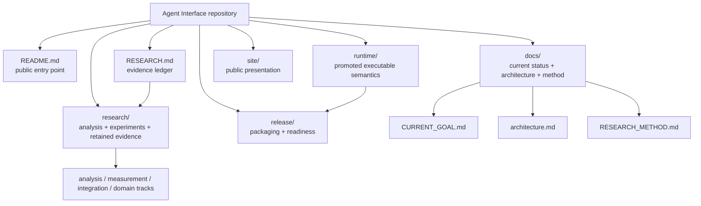

# Documentation

This directory is the public documentation map for Agent Interface. It organizes the existing project record; the linked research reports and retained artifacts remain the evidence source.

## Start here

| Question | Canonical document |
|---|---|
| What is the project trying to do? | [Project README](../README.md) and [principles](principles.md) |
| What is the current research objective? | [CURRENT_GOAL.md](CURRENT_GOAL.md) |
| What architecture is currently promoted? | [architecture.md](architecture.md) |
| What has been measured so far? | [PROGRESS_FROM_BASELINE.md](PROGRESS_FROM_BASELINE.md) |
| What is the detailed evidence ledger? | [RESEARCH.md](../RESEARCH.md) |
| What are the latest failures, handoffs, and next steps? | [LOCAL_RESEARCH_HANDOFF.md](LOCAL_RESEARCH_HANDOFF.md) |
| What remains before a public release? | [ROADMAP.md](../ROADMAP.md) and the [release contract](../release/README.md) |
| What can currently be run? | [runtime/README.md](../runtime/README.md) |
| How should a question be split between analysis and experiment? | [RESEARCH_METHOD.md](RESEARCH_METHOD.md) |
| How do current goal, evidence, runtime, and release documents relate? | [EVIDENCE_MAP.md](EVIDENCE_MAP.md) |
| What do recurring terms like GHD, authority lease, HOLD, and PROMOTED mean here? | [TERMINOLOGY.md](TERMINOLOGY.md) |


## Repository structure



The arrows show the intended reading/promotion direction, not code dependencies.

## Documentation layers

## Living history documents

`CURRENT_GOAL.md` and `LOCAL_RESEARCH_HANDOFF.md` are living documents with retained history. Their newest governing/current material stays visible at the top; older direction and legacy document bodies are preserved under expandable sections. Use the visible top sections for current status and expand history only when tracing provenance.
### Current status

- [CURRENT_GOAL.md](CURRENT_GOAL.md) — current governing invariant and active research direction.
- [PROGRESS_FROM_BASELINE.md](PROGRESS_FROM_BASELINE.md) — evidence-backed progress, measured bottlenecks, and remaining gates.
- [LOCAL_RESEARCH_HANDOFF.md](LOCAL_RESEARCH_HANDOFF.md) — detailed running handoff across experiments and failures.
- [SEMANTIC_EVIDENCE_STATUS.md](SEMANTIC_EVIDENCE_STATUS.md) — scoped semantic-evidence status.

### Design and architecture

- [principles.md](principles.md) — project thesis and component principles.
- [architecture.md](architecture.md) — current promoted architecture.
- [CANDIDATE_ARCHITECTURE_REVIEW.md](CANDIDATE_ARCHITECTURE_REVIEW.md) — architecture review material.
- [design-theses.md](design-theses.md) — design theses retained for reference.
- [control-codec.md](control-codec.md) — control-codec design notes.

### Research and evidence

- [RESEARCH_METHOD.md](RESEARCH_METHOD.md) — analytical-first decision flow: prove/model exact semantics first, measure only the empirical residual.
- [EVIDENCE_MAP.md](EVIDENCE_MAP.md) — public map from current goal through retained evidence, convergence, runtime, and release.
- [TERMINOLOGY.md](TERMINOLOGY.md) — non-normative term index pointing to canonical definitions.
- [../RESEARCH.md](../RESEARCH.md) — top-level evidence ledger and claims index.
- [../research/README.md](../research/README.md) — map of the research workspace.
- [../research/analysis/README.md](../research/analysis/README.md) — analytical proofs, exact derivations, and identifiability studies.
- [../research/](../research/) — analyses, experiment sources, reports, raw summaries, audits, and retained negative results.

### Runtime and release

- [../runtime/README.md](../runtime/README.md) — current runnable construction preview and runtime entry points.
- [../release/README.md](../release/README.md) — public release contract and readiness boundary.
- [product-hunt.md](product-hunt.md) — launch/presentation notes; not a research-status source.

### Coordination records

- [orchestration/](orchestration/) — retained coordination/launch records. These are operational history, not the canonical statement of current project status.

## Suggested reading order

```text
README.md
  -> docs/CURRENT_GOAL.md
  -> docs/architecture.md
  -> docs/PROGRESS_FROM_BASELINE.md
  -> RESEARCH.md
  -> individual research reports / raw evidence
```

For current claims, prefer the canonical documents above over inferring status from directory names or historical experiment filenames.
