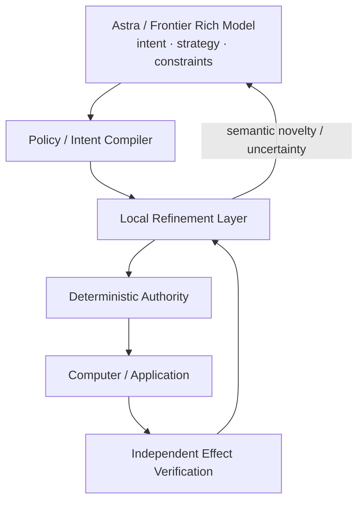

# Agent Interface Research Map

> Purpose: provide a high-level map of research areas and prevent scoped experiments from being mistaken for completion of the overall program.

## Core architecture

## Research areas

| Area | Purpose | Current status |
|---|---|---|
| Rich-model intent preservation | Keep semantic planning with frontier models | Established design principle |
| Deterministic authority | Separate prediction from execution permission | Strong scoped evidence |
| Local repair and reuse | Avoid unnecessary frontier/model calls | Demonstrated in scoped experiments |
| Macro / rule execution | Reuse bounded procedures safely | Demonstrated in scoped experiments |
| Planner-gap local controller | Maintain/progress while Astra reasons | Active research |
| Symbol IR | Compact reusable semantic representation | Active research |
| Learned residual policy | Use learning only where simpler methods fail | Active research |
| General computer-use transfer | Validate across domains | Open research |

## Important interpretation rules

- A component PASS is not an integrated architecture PASS.
- A closed experiment is not a closed research direction.
- Faster execution is not sufficient without correctness and authority validation.
- UNKNOWN/YIELD is a required outcome, not a failure mode to eliminate.

## Evidence categories

- **Demonstrated, scoped:** directly measured under declared conditions.
- **Research:** hypothesis with incomplete validation.
- **Unknown:** requires future experiment.

This document is a navigation map, not a claim of completion.
