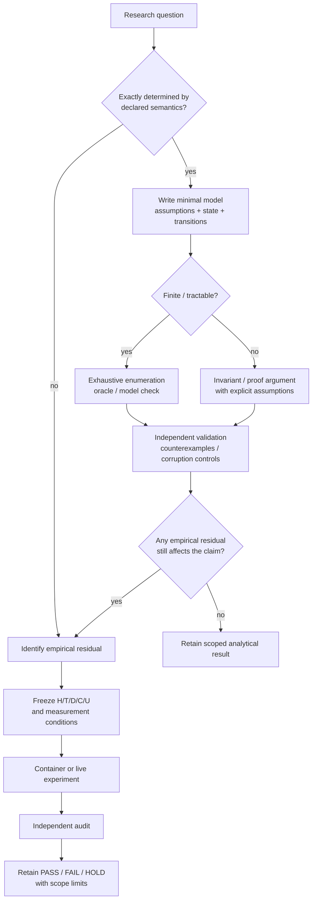

# Research method

This page describes how Agent Interface should choose between analytical reasoning and empirical experiments. It is a workflow guide, not an evidence source and not a new scientific claim.

## Principle

Use the cheapest method that can actually decide the question.

- If a property follows from an explicit contract, finite state machine, invariant, type relation, or exhaustive finite case set, establish it analytically first.
- If the result depends on operating-system behavior, GUI/application behavior, timing, hardware, model output, tokens, or an unknown distribution, measure it empirically.
- For mixed questions, prove the safety/semantic part analytically and experiment only on the residual empirical part.
- Never promote an analytical result beyond its assumptions, and never use repeated experiments as a substitute for a proof when the exact state space is already known and tractable.

## Decision flow

## Method by question type

| Question type | Preferred first method | What still needs experiment |
|---|---|---|
| Contract/type validity | Static reasoning, invariant audit, exhaustive valid/invalid cases | Only behavior outside the modeled contract |
| Finite state-machine safety | Independent oracle, exhaustive or generated state-space comparison | Real backend transfer if the runtime differs from the model |
| Ordering / ABA / lease / generation semantics | Transition-system reasoning plus adversarial sequence enumeration | Scheduler/backend timing only when timing is part of the claim |
| Serialization / codec exactness | Round-trip property, exact byte comparison, exhaustive bounded cases where feasible | Throughput/latency on target hosts |
| Algorithmic correctness | Proof or reference-oracle equivalence, then focused tests | Distribution-dependent performance |
| OS / GUI / application behavior | Small construction test followed by frozen live measurement | Required; these properties are environment-dependent |
| Latency / throughput / tail behavior | Controlled measurement with named clock/endpoints | Required; do not infer from code structure alone |
| Model accuracy / tokens / planner behavior | Same-model controlled experiment with actual usage accounting | Required |
| Integrated end-to-end capability | Compose proven invariants, then matched cross-domain live evaluation | Required before integrated/product claims |

## Analytical artifact checklist

An analytical result should record enough information to be falsifiable and reproducible:

1. **Claim** — exactly what property is being established.
2. **Assumptions** — the model boundary, allowed inputs, timing assumptions, and excluded behavior.
3. **State/contract** — the minimal objects and transitions needed for the claim.
4. **Argument** — proof, invariant derivation, exhaustive enumeration, or independent oracle comparison.
5. **Counterexamples** — cases that would falsify the claim or show an assumption is too strong.
6. **Residual empirical questions** — anything still dependent on a real backend, application, model, clock, or workload.

Keep these artifacts beside the relevant research directory rather than creating a new root-level namespace.

## Relation to H/T/D/C/U

H/T/D/C/U still applies when the primary method is analytical.

- **H — Hypothesis:** falsifiable property under explicit assumptions.
- **T — Minimum test:** the smallest proof check, exhaustive enumeration, oracle comparison, or experiment that can discriminate the claim.
- **D — Decision:** exact PASS / FAIL / HOLD / UNCERTAIN rule.
- **C — Competing explanation:** alternate model, missing state variable, hidden assumption, or empirical effect that could explain the result.
- **U — Uncertainty:** model incompleteness, unmodeled scheduler/backend behavior, measurement error, and transfer limits.

An analytical PASS is scoped to the stated model. A component proof is not an integrated runtime PASS.

## Research sequence

## Repository placement

- General methodology and public explanation: `docs/`.
- Primarily analytical proof/derivation/identifiability evidence: use `research/analysis/` when it is reusable across domains or stands on its own.
- Scoped quantitative/formal measurement: keep it under `research/measurement/`, `research/integration/`, or the existing domain directory.
- Safe-overlap / phase-scheduling / serialized-actuator concurrency studies: use `research/concurrency/` when concurrency itself is the primary research question.
- Domain-coupled analysis may remain beside the domain experiment when separating it would obscure assumptions or provenance.
- Promoted executable semantics: `runtime/` only after the relevant promotion gate.
- Release/package evidence: `release/`.

Do not move completed evidence merely to make the tree look cleaner; stable paths are part of provenance.
