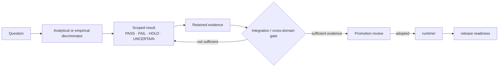

# Terminology index

This page is a navigation aid for recurring Agent Interface terms. It does **not** create new normative definitions. When wording here is shorter than the linked source, the linked source is authoritative.

## Core architecture terms

| Term | Reading cue | Canonical source |
|---|---|---|
| **Rich-model intent / local refinement** | Keep semantic/strategic authorship with the rich model; localize only bounded high-frequency continuation, verification, and invalidation. | [Principles](principles.md#governing-intent-principle--preserve-rich-model-intent-localize-refinement), [Architecture](architecture.md#rich-model-intent-and-local-refinement) |
| **Universal control** | Generic keyboard/pointer/text/focus/observation control remains the fallback floor when optimized methods are unavailable. | [Architecture](architecture.md#universal-control-is-the-floor) |
| **Semantic method** | Long-lived task meaning or reusable operation; it can remain valid when a faster execution route becomes stale. | [Architecture](architecture.md#semantic-method-and-optimized-route-are-different-objects) |
| **Optimized route** | A faster execution path whose dependencies may become stale independently of the semantic method. | [Architecture](architecture.md#semantic-method-and-optimized-route-are-different-objects) |
| **Guarded Hierarchical Deoptimization (GHD)** | Invalidate the narrowest stale optimization and fall back instead of discarding all higher-level knowledge. | [Architecture](architecture.md#guarded-hierarchical-deoptimization-ghd) |
| **Observation gating** | Escalate observation only when task-relevant new information justifies it. | [Architecture](architecture.md#observation-architecture) |
| **Input delivery semantics** | OS event emission, application consumption, observable change, and semantic completion are distinct boundaries. | [Architecture](architecture.md#input-delivery-semantics) |
| **Coordinate frame / binding** | Pointer or region meaning depends on the frame and target binding under which it was authored. | [Architecture](architecture.md#coordinate-frames-and-binding-resolution) |
| **Scoped target reference / handle** | A bounded reference to a target that still requires fresh revalidation before action. | [Architecture](architecture.md#scoped-target-references) |
| **YIELD** | Stop local continuation and return control when evidence is stale, ambiguous, novel, or outside the authorized envelope. | [Current goal](CURRENT_GOAL.md), [Principles](principles.md#governing-intent-principle--preserve-rich-model-intent-localize-refinement) |

## Runtime safety terms

| Term | Reading cue | Canonical source |
|---|---|---|
| **Freshness** | Observation sequence and binding revision must still match the current runtime state before admission. | [Runtime core v1](../runtime/core_v1/README.md) |
| **Authority lease** | Input authority is finite and expires; cached/predicted/historical evidence does not extend it. | [Runtime core v1](../runtime/core_v1/README.md), [Current goal](CURRENT_GOAL.md) |
| **Fail-closed admission** | Missing/unsupported/stale capability or state refuses the action rather than guessing authority. | [Runtime core v1](../runtime/core_v1/README.md) |
| **`release_all` / verified release** | Terminal execution must leave tracked input empty; release is an explicit correctness boundary. | [Runtime core v1](../runtime/core_v1/README.md) |

## Research and evidence terms

| Term | Reading cue | Canonical source |
|---|---|---|
| **H/T/D/C/U** | Hypothesis, minimum discriminator, decision rule, competing explanation, uncertainty. The discriminator may be analytical or empirical. | [Research method](RESEARCH_METHOD.md), [Contributing](../CONTRIBUTING.md) |
| **Analytical result** | A result established under explicit model assumptions using an invariant, proof, exhaustive enumeration, or oracle comparison. It does not automatically transfer to real backends. | [Research method](RESEARCH_METHOD.md) |
| **Empirical residual** | The part of a claim that still depends on a real OS/backend/application/model/timing distribution after analytical reduction. | [Research method](RESEARCH_METHOD.md) |
| **Evidence ledger** | The retained public record of scoped results and their limits. | [RESEARCH.md](../RESEARCH.md), [Evidence map](EVIDENCE_MAP.md) |
| **Scoped PASS** | A decision that passed its stated gate under its stated assumptions/scope; not automatically an integrated or product claim. | [Evidence map](EVIDENCE_MAP.md), [Freeze criteria](../research/evolution/freeze_criteria.md#ledger-and-chart-interpretation) |
| **HOLD** | A retained state that is not equivalent to failure; evidence or prerequisites are insufficient for promotion. | [Freeze criteria](../research/evolution/freeze_criteria.md#ledger-and-chart-interpretation) |
| **PROMOTED** | A separate adoption/promotion decision; a functional PASS does not imply promotion. | [Freeze criteria](../research/evolution/freeze_criteria.md#candidate-promotion-is-a-separate-decision) |
| **Research Freeze Candidate** | A candidate revision considered only after the declared cross-domain/convergence review conditions are met. It triggers review, not automatic promotion. | [Freeze criteria](../research/evolution/freeze_criteria.md#review-contract) |
| **Protocol Freeze** | A later phase distinct from Research Freeze, after consolidation and semantic stabilization. | [Freeze criteria](../research/evolution/freeze_criteria.md#review-contract) |

## Status flow

The arrows show evidence/status relationships, not an automatic state machine. In particular, `PASS != PROMOTED`, and `HOLD != FAIL`.

## Where to resolve ambiguity

1. For project intent: use [`CURRENT_GOAL.md`](CURRENT_GOAL.md) and [`principles.md`](principles.md).
2. For runtime semantics: use [`architecture.md`](architecture.md) and [`runtime/core_v1/README.md`](../runtime/core_v1/README.md).
3. For research method: use [`RESEARCH_METHOD.md`](RESEARCH_METHOD.md).
4. For the status of a particular result: use its retained report plus [`RESEARCH.md`](../RESEARCH.md).
5. For promotion/freeze language: use [`research/evolution/freeze_criteria.md`](../research/evolution/freeze_criteria.md).
