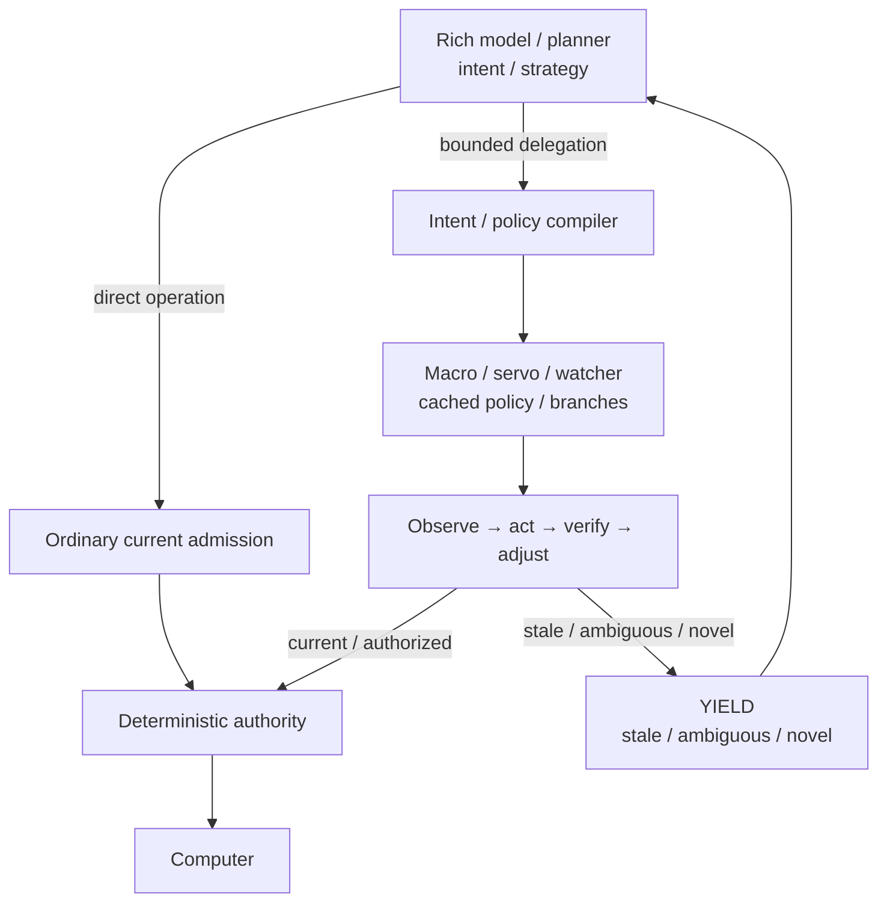
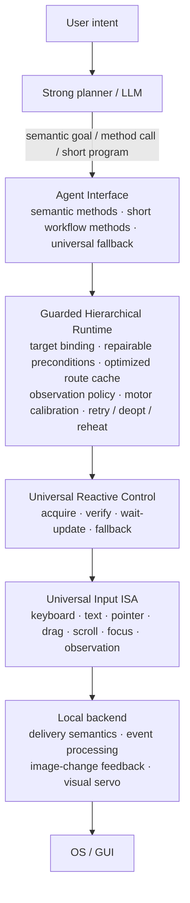
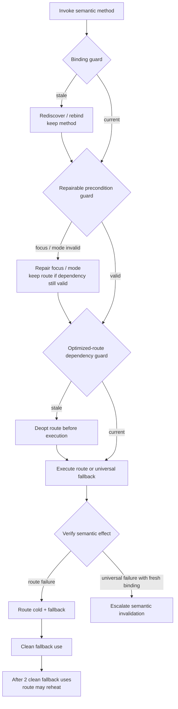
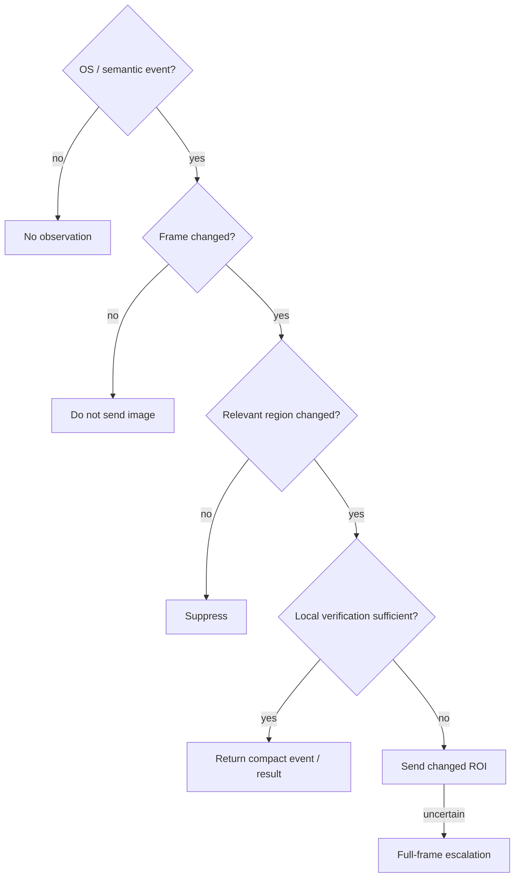
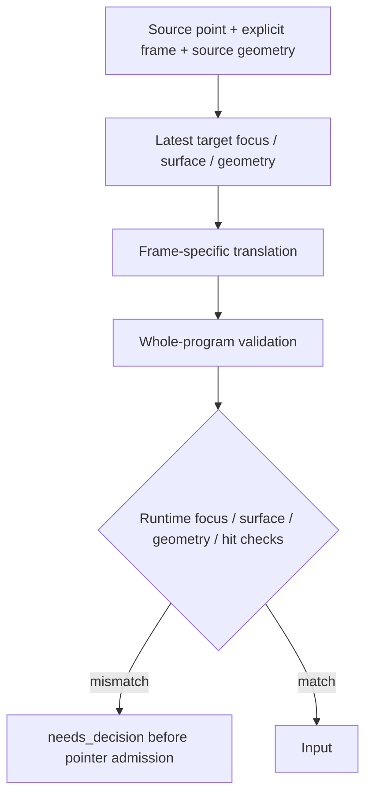
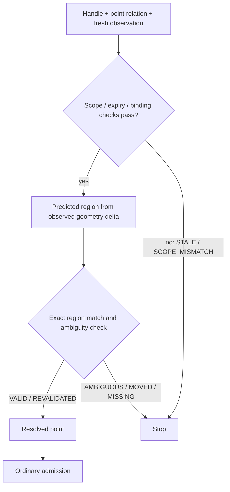

# Architecture

> **Document role:** current promoted architecture description, not a stable ABI or a product-support guarantee. Use [`CURRENT_GOAL.md`](CURRENT_GOAL.md) for active direction and [`EVIDENCE_MAP.md`](EVIDENCE_MAP.md) for the evidence-to-runtime promotion path.

## First-principles objective

Agent Interface minimizes total agent-computer control cost subject to a hard correctness constraint.

The target cost is not just mouse latency. It includes:

- model boundaries,
- model-visible serialization,
- image/observation bandwidth,
- local execution overhead,
- retries and recovery,
- relearning after environment changes.

## Rich-model intent and local refinement

The architecture is not a pipeline in which every rich-model action must pass through a weaker local model. The rich model may act directly whenever semantic novelty or uncertainty makes that appropriate.

The preferred optimization boundary is:



The local side exists to **continue and refine a rich-model-authored intent at higher cadence**, especially while the rich model is unavailable. It is not an independent semantic agent by default.

A lightweight learned component, when present, should normally solve only a residual problem such as cache validity, bounded branch choice, or local correction among already-authorized alternatives. It must not become a compulsory semantic bottleneck between the rich model and the computer.

Consequences:

- direct rich-model control is preserved as a first-class route and experimental baseline;
- local mechanisms inherit a bounded intent/envelope and must expose explicit invalidation and YIELD;
- deterministic macro/servo execution wins when it is sufficient;
- policy caches and speculative futures cache decisions or preparation, never permission;
- historical/predicted evidence may guide preparation but fresh current evidence governs admission;
- component-level mechanism evidence must not be promoted to an integrated architecture claim without a separate end-to-end comparison.

## Current stack



## Universal control is the floor

An unknown application must be controllable without an app-specific API. App methods are optimizers over universal control, not replacements for it.

The system should therefore always preserve a generic fallback route based on keyboard, pointer, text, focus, observation, and reactive verification.

## Semantic method and optimized route are different objects

A semantic method can remain valid while its fastest execution route becomes stale.

Example:

```text
SAVE_DOCUMENT
  semantic meaning      long-lived
  target binding        medium-lived
  focus precondition    repairable
  shortcut route        potentially stale
  visual anchor         potentially stale
  observation policy    potentially stale
```

Invalidating all layers together creates unnecessary relearning.

## Guarded Hierarchical Deoptimization (GHD)

The current candidate lifecycle:



This is analogous to guarded speculation and deoptimization in JIT systems: retain semantic knowledge, invalidate the narrowest stale optimization.

## Observation architecture

The next research layer is Observation Gating.

The intended escalation path is:



The key distinction is between *screen changed* and *agent-relevant information changed*.

## Input delivery semantics

Sending an OS event is not equivalent to the application consuming it or completing its semantic effect. The X11 experiments therefore treat input delivery, observable state change, and semantic verification as distinct boundaries.

Backend-specific pacing/barrier values must remain backend policy rather than leaking into semantic methods.

## Coordinate frames and binding resolution

An absolute screen point is incomplete when a program can move between window
geometries. Application chrome and window content may follow different
transforms. A pointer intent should therefore declare the coordinate frame and
the source binding on which its points were authored.

The current research candidate resolves the complete program against the latest
stable target binding before validation:



Resolution itself grants no authority. Frame identity is still task-declared in
the current evidence; observed-region identity, internal scrolling, scaling and
automatic fallback remain research problems.

## Scoped target references

A target handle is an observational reference with a shorter lifetime than the
task meaning. The current private candidate binds an exact textured region to a
session, focus, surface, source geometry, coordinate frame, observation sequence,
expiry and a small set of permitted transformations. Later actions carry the
runtime handle and a point offset. Revalidation derives geometry from the fresh
observed binding and returns an explicit status before ordinary input admission:



The first live result shows why requested window movement cannot define the
transform: a requested `[16,0]` move became observed client delta `[17,20]`.
The runtime revalidated that actual delta correctly, while the preregistered
fixed-delta endpoint failed. A subsequent Chromium pair uses only observed delta:
the relocated handle independently submits the required form value, while a
same-surface navigation removes the target and fails closed before pointer input.
Handles grant no input authority and are not yet a promoted interface feature.

## Implementation strategy

The current implementation language for experiments is Python because algorithmic semantics are still changing rapidly. A lower-level systems implementation is intentionally deferred until the algorithms, error semantics, and protocol boundaries are substantially frozen.

The research code should therefore optimize for falsifiability and iteration speed now, not premature ABI stability.
