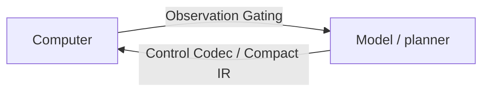

# Design Theses and Idea Ledger

This file records durable system ideas without replacing the repository's current evidence ledgers. Promotion still depends on retained experiment reports under `research/` and current architecture/goal documents.

## Status vocabulary

- **Promoted** — supported by current retained evidence and reflected in architecture.
- **Active** — being tested; not yet a general claim.
- **Proposed** — design hypothesis worth testing.
- **Deferred** — blocked on a dependency or measurement boundary.

## Thesis map

```mermaid
flowchart TD
    I[Interface efficiency]
    L[Local control / invalidation]
    C[Concurrency / authority]
    E[Evidence discipline]

    I --> IB[Interface bottleneck]
    I --> UF[Universal fallback]
    I --> CC[Compact control → validated semantics]
    I --> OG[Observation gating ↔ Control Codec]

    L --> HF[Deterministic high-frequency loops local]
    L --> LL[Layered lifetimes / narrow invalidation]
    L --> VI[Scoped renewable visual invalidation]

    C --> PE[Pending effects are dependencies]
    C --> PA[Physical authority bounded / observable]

    E --> BI[Benchmark integrity]
    E --> BT[Bytes are not tokens]
```

This map groups the existing durable theses for navigation. It does not assign promotion status, scientific priority, or override current goal/architecture documents.

## Durable theses

### Interface bottleneck

For a sufficiently capable planner, computer-control cost can be dominated by interface mechanics: repeated model boundaries, redundant observations, verbose serialization, input-delivery waits, recovery, and relearning. Clean tests hold model/task/environment/correctness fixed and change the interface.

### Universal fallback before specialization

Unknown applications must remain operable through generic observation and input. Application-specific methods are optimizers, not prerequisites.

### Compact control resolves to validated semantics

Model-boundary compression must resolve to the same validated semantic program. Compact syntax, dictionaries, methods, workflows, or aliases cannot bypass capability checks, stale-state guards, leases, held-input discipline, terminal release, or verification.

The retained portable-runtime work under `research/runtime_portability_v0/` is authoritative for the current C1 contract. `docs/control-codec.md` and `research/control_codec/` describe the broader C0–C5 research ladder.

### Observation gating and Control Codec are complementary

Both are interface optimizations and must be evaluated at equal correctness.

### Keep deterministic high-frequency loops local

Input delivery, update detection, local verification, release, bounded recovery, and fine motor correction should not cross a model boundary when semantic reasoning is unnecessary.

### Layered lifetimes and narrow invalidation

Semantic meaning, bindings, action preconditions, optimized routes, observation caches, and motor calibration fail at different rates. Invalidate the narrowest stale layer rather than relearning everything.

### Pending effects are dependencies, not global pauses

Independent work may continue only when complete canonical read/write footprints show no conflict with unresolved effects. Missing acknowledgement is not evidence of no effect; bounded read-only status reconciliation is preferable where the application supports it.

### Physical authority must be bounded and observable

Owner deadlines bound worst-case authority. Fresh observable guards may terminate earlier. Release/publication ordering should minimize unnecessary held-input occupancy without changing the acquired evidence.

### Visual invalidation should be scoped but renewable

Whole-frame change can overreact to nuisance motion. Scoped ROI invalidation is cheaper but permanent ROI validity is unsafe; bounded identity revalidation is required as targets drift or rendering changes.

### Benchmark integrity is part of system design

Retain first outcomes, distinguish development from formal allocations, separate proxies from measured provider usage, and preserve counterexamples. Do not tune on hidden outcomes and then present the tuned result as preregistered evidence.

### Bytes are not tokens

Serialization bytes, characters, pixels, and image bytes are proxies. Provider-token claims require matched model/task/environment/correctness with exact API usage accounting.

## Current interpretation

This ledger is intentionally conservative. Older design-track claims are not allowed to overwrite newer retained evidence. Current goal/architecture documents remain the operational source of truth; this file records cross-cutting theses that survive branch reconciliation.
