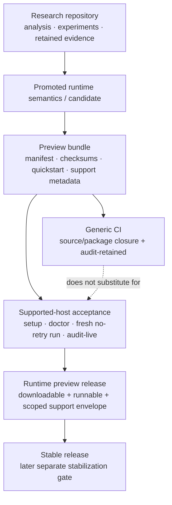

# User-facing releases

GitHub Releases are intended for artifacts a user can actually download and try.

The repository itself remains research-first. Historical `v0.0.1-research.*` prereleases are archival research snapshots and are not the target release format going forward.

## Release path



This diagram restates the existing release boundary: repository/CI evidence can prepare a candidate, but the intended supported host must satisfy its own acceptance gate before publication.

## Current Research Preview RC

The release lane is `release/research-preview-20260917-rc1`, introduced in
[Issue #515](https://github.com/Unjuno/agent-interface/issues/515). Its
[RC1 freeze](preview_bundle_v1/RC1_FREEZE.json) and
[Issue #606](https://github.com/Unjuno/agent-interface/issues/606) define the
release-only convergence and explicit-allowlist gate. Packaging implementation
lives under `release/preview_bundle_v1/`.
### Release workspace map

| Path | Role |
|---|---|
| [`preview_bundle_v1/`](preview_bundle_v1/) | Current Research Preview bundle builder, quickstart, support metadata, release notes, and supported-host acceptance. |
| [`runtime_preview_v1/`](runtime_preview_v1/) | Runtime-preview candidate verification/checksum utilities and support metadata examples. |
| [`preview_readiness_v1/`](preview_readiness_v1/) | Retained preview-readiness result and audit artifacts. |
| [`first_run_smoke_v1/`](first_run_smoke_v1/) | First-run smoke/preflight experiment and retained results. |
| [`offline_dependency_closure_v1/`](offline_dependency_closure_v1/) | Offline dependency-closure check and retained result. |
| [`golden_artifact_closure_v1/`](golden_artifact_closure_v1/) | Golden-artifact closure check and retained result. |

These directories are release-engineering evidence and tooling. The parent release gate below remains the user-facing acceptance boundary.


Build from a clean RC checkout:

```bash
python3 release/preview_bundle_v1/test_build_preview.py -v
python3 release/preview_bundle_v1/build_preview.py --root . --out artifacts-local/research-preview
```

The [builder](preview_bundle_v1/build_preview.py) packages an explicit selection
of tracked runtime/release sources, Golden Desktop support files and retained
audit evidence, as defined by `select_release_paths` and the manifest's
`selection_policy`. It verifies the exact selected closure, rather than archiving
the whole RC tree. Required retained files remain mandatory: an earlier reduced
offline research bundle omitted files required by `audit-retained`.

The builder emits `MANIFEST.json`, `SHA256SUMS`, `VERSION`, `QUICKSTART.md`,
`SUPPORT.md`, and `RELEASE_NOTES.md`, and runs the static first-run preflight
both before and after archive extraction.

Packaging CI also installs the pinned runtime Python requirements and reruns `audit-retained` from the checkout and extracted archive. This is a source/package-closure check only; a generic Linux runner is not a substitute for supported-host WSLg acceptance.

## Runtime preview gate

A user-facing preview should include:

- a runnable package or executable archive;
- checksums;
- a minimal quickstart;
- supported operating systems/backends;
- known limitations;
- a small smoke test or self-check;
- a link to the benchmark evidence supporting the promoted runtime behavior.

The release should not require reading the research tree to discover how to start it.

For RC1, final publication acceptance additionally requires the intended WSLg host to pass setup, `doctor`, `audit-retained`, one fresh no-retry golden run, and `audit-live`. Those supported-host gates must not be inferred from generic CI.

## Release tracks

- **Research repository:** analyses, experiments, and retained evidence on `main`.
- **Runtime preview releases:** downloadable, runnable distributions for users.
- **Stable releases:** only after execution semantics, recovery behavior, installation, and cross-app correctness are substantially frozen.

## Principle

A release is not just a tagged research snapshot. It is a usable artifact with an explicit support envelope.
