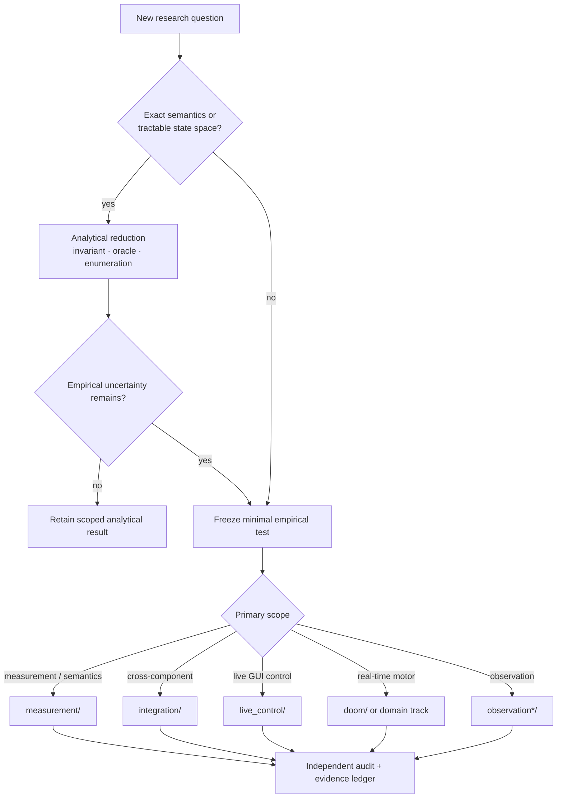

# Research workspace

This directory is the experimental workspace and retained evidence record for Agent Interface. Directories represent experiments, mechanisms, fixtures, audits, or historical work; they are **not product versions** and their names alone do not imply promotion.

For claims and scientific disposition, start with the top-level [research index](../RESEARCH.md).

## Start here

| Need | Entry point |
|---|---|
| Evidence ledger and claims taxonomy | [../RESEARCH.md](../RESEARCH.md) |
| Current research objective | [../docs/CURRENT_GOAL.md](../docs/CURRENT_GOAL.md) |
| Latest detailed handoff | [../docs/LOCAL_RESEARCH_HANDOFF.md](../docs/LOCAL_RESEARCH_HANDOFF.md) |
| Progress and remaining gates | [../docs/PROGRESS_FROM_BASELINE.md](../docs/PROGRESS_FROM_BASELINE.md) |
| Current Linux research caller | [live_control/CURRENT_CLIENT.md](live_control/CURRENT_CLIENT.md) |
| Research convergence/freeze criteria | [evolution/freeze_criteria.md](evolution/freeze_criteria.md) |
| Revisit history | [REVISIT_LEDGER.md](REVISIT_LEDGER.md) |
| Analysis vs experiment decision flow | [../docs/RESEARCH_METHOD.md](../docs/RESEARCH_METHOD.md) |


## Research routing



Prefer the narrowest existing namespace. The diagram is a placement guide; retained historical paths are not reorganized retroactively.

## Workspace map

The top level is intentionally evidence-preserving. The categories below are navigation aids; they do not change the status of any experiment.

For new work, prefer the narrowest existing category below rather than adding another top-level research namespace. Existing direct experiment paths are retained for provenance; see [`../CONTRIBUTING.md`](../CONTRIBUTING.md) for placement guidance.

### Live control and integration

- [`live_control/`](live_control/) — shared/live GUI-control mechanisms and integration studies.
- [`doom/`](doom/) — real-time/continuous-control studies and MAP01 evidence.
- [`integration/`](integration/) — integration-focused experiments.
- [`measurement/`](measurement/) — scoped measurement and composition studies.
- [`cross_domain/`](cross_domain/) — cross-domain transfer work.

### Fast local decision / System-1 research

- [`system1/`](system1/) — bounded fast-path representation and decision experiments.
- [`local_system1/`](local_system1/) — local decision-kernel, latency, typed-evidence, and frontier-gap mechanics.

### Observation, grounding, and visual state

- [`observation/`](observation/) — observation mechanisms.
- [`observation_gating/`](observation_gating/) — unchanged/relevant observation gating.
- [`observation_tiles/`](observation_tiles/) — exact changed-region/tile transport.
- [`visual_tracking/`](visual_tracking/) — visual tracking experiments.
- `observation_*`, `grounding_*`, and `visual_*` directories — scoped successors and focused mechanisms.

### Runtime, input, and text delivery

- `runtime_*` directories — backend/native/runtime experiments.
- [`container_control/`](container_control/) — containerized control work.
- [`control_codec/`](control_codec/) — control-codec experiments.
- `text_*` directories — text delivery, keymap, XKB, observation binding, and related robustness studies.

### Application and domain studies

- [`real_apps_v1/`](real_apps_v1/), [`real_apps_v2/`](real_apps_v2/), [`real_apps_v3/`](real_apps_v3/) — early real-application control studies.
- `openttd_*` directories — OpenTTD task/oracle and transfer studies.
- `libreoffice_*` and `writer_uno_*` directories — office/document-control studies.

### Reliability, concurrency, ownership, and commit semantics

- `receiver_*`, `external_effect_*`, `outbox_*`, `staged_*`, and `exact_runtime_*` directories — effect/commit/recovery semantics.
- `git_*` directories — Git/reference concurrency and atomicity experiments.
- [`coordination/`](coordination/) and [`orchestration/`](orchestration/) — retained coordination/orchestration evidence.

### Evaluation and research governance

- [`benchmark_discovery/`](benchmark_discovery/) — benchmark/coverage discovery.
- [`evolution/`](evolution/) — convergence, freeze criteria, evolution ledger, and evaluation contracts.
- [`conditional_optimization/`](conditional_optimization/) and [`optimization_revisits/`](optimization_revisits/) — conditional reuse and revisit work.
- [`retention/`](retention/) — retained-evidence utilities/records where applicable.
- [REVISIT_LEDGER.md](REVISIT_LEDGER.md) — explicit revisit ledger.

### Presentation and miscellaneous scoped work

- [`launch/`](launch/) — public-evidence/launch presentation experiments.
- [`experiments/`](experiments/) — small scoped experiments without a narrower established category.

### Historical archival namespaces

Both [`archive/`](archive/) and [`archives/`](archives/) are retained historical namespaces. They are not merged or renamed here because existing evidence links and provenance may depend on exact paths. Use [../RESEARCH.md](../RESEARCH.md) and the experiment's own report to determine scientific status.

## Environment

Research-only Python dependencies live here:

```bash
python -m pip install -r research/requirements.txt
```

Some harnesses inject real GUI input. Use an isolated X session or disposable container with disposable application state.

## Evidence policy

A research directory should keep its benchmark/source, preregistration where applicable, raw result, audit, environment, and negative results close enough that a claim can be traced back to the experiment.

A directory existing here does **not** mean its mechanism is promoted. Negative results, stopped allocations, superseded harnesses, and scoped passes are intentionally retained.
