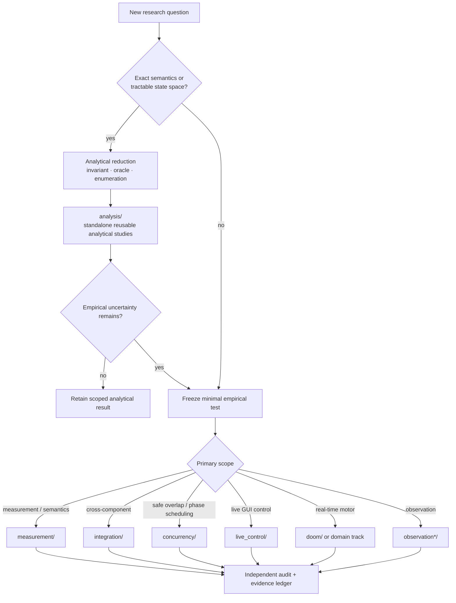

# Research workspace

This directory is the research workspace and retained evidence record for Agent Interface. Directories represent analyses, experiments, mechanisms, fixtures, audits, or historical work; they are **not product versions** and their names alone do not imply promotion.

For claims and scientific disposition, start with the top-level [research index](../RESEARCH.md).

## Start here

| Need | Entry point |
|---|---|
| Evidence ledger and claims taxonomy | [../RESEARCH.md](../RESEARCH.md) |
| Current research objective | [../docs/CURRENT_GOAL.md](../docs/CURRENT_GOAL.md) |
| Latest detailed handoff | [../docs/LOCAL_RESEARCH_HANDOFF.md](../docs/LOCAL_RESEARCH_HANDOFF.md) |
| Progress and remaining gates | [../docs/PROGRESS_FROM_BASELINE.md](../docs/PROGRESS_FROM_BASELINE.md) |
| Current Linux research caller | [live_control/CURRENT_CLIENT.md](live_control/CURRENT_CLIENT.md) |
| Research convergence/freeze criteria | [evolution/freeze_criteria.md](evolution/freeze_criteria.md) |
| Revisit history | [REVISIT_LEDGER.md](REVISIT_LEDGER.md) |
| Analysis vs experiment decision flow | [../docs/RESEARCH_METHOD.md](../docs/RESEARCH_METHOD.md) |
| Public evidence/document relationship map | [../docs/EVIDENCE_MAP.md](../docs/EVIDENCE_MAP.md) |
| Retained direct-root experiment namespaces | [ROOT_NAMESPACE_MAP.md](ROOT_NAMESPACE_MAP.md) |


## Research routing



Prefer the narrowest existing namespace. The diagram is a placement guide; retained historical paths are not reorganized retroactively.

## Analytical studies

- [`analysis/`](analysis/) — proofs, exact derivations, exhaustive state-space checks, break-even/identifiability analysis, and the empirical residuals they expose.

Use analytical work to eliminate questions that are already decidable from explicit assumptions; do not treat it as measurement of a real backend/model unless the retained evidence actually contains those endpoints.

## Workspace map

The top level is intentionally evidence-preserving. The categories below are navigation aids; they do not change the status of any experiment.

For new work, prefer the narrowest existing category below rather than adding another top-level research namespace. Existing direct experiment paths are retained for provenance; see [`ROOT_NAMESPACE_MAP.md`](ROOT_NAMESPACE_MAP.md) for the retained root-path index and [`../CONTRIBUTING.md`](../CONTRIBUTING.md) for placement guidance.

### Live control and integration

- [`live_control/`](live_control/) — shared/live GUI-control mechanisms and integration studies.
- [`doom/`](doom/) — real-time/continuous-control studies and MAP01 evidence.
- [`integration/`](integration/) — integration-focused experiments.
- [`measurement/`](measurement/) — scoped measurement and composition studies.
- [`cross_domain/`](cross_domain/) — cross-domain transfer work.

### Fast local decision / System-1 research

- [`system1/`](system1/) — bounded fast-path representation and decision experiments.
- [`local_system1/`](local_system1/) — local decision-kernel, latency, typed-evidence, and frontier-gap mechanics.
- [`needle_lora_3441_pilot_04d_corrected_base_v1/`](needle_lora_3441_pilot_04d_corrected_base_v1/) — Issue #4471 one-shot GPU formal run stopped after training during result serialization; no metrics or predictions were persisted.

### Observation, grounding, and visual state

- [`observation/`](observation/) — observation mechanisms.
- [`observation_gating/`](observation_gating/) — unchanged/relevant observation gating.
- [`observation_tiles/`](observation_tiles/) — exact changed-region/tile transport.
- [`visual_tracking/`](visual_tracking/) — visual tracking experiments.
- `observation_*`, `grounding_*`, and `visual_*` directories — scoped successors and focused mechanisms.

### Runtime, input, and text delivery

- `runtime_*` directories — backend/native/runtime experiments.
- [`container_control/`](container_control/) — containerized control work.
- [`control_codec/`](control_codec/) — control-codec experiments.
- [`x11_text_german_layout_3668_v2/`](x11_text_german_layout_3668_v2/) — Issue #3741 German XKB text-delivery evidence; retained audit FAIL and missing de-01 raw row are detailed in RECOVERY_REVIEW.md.
- `text_*` directories — text delivery, keymap, XKB, observation binding, and related robustness studies.
- [`issue_3784_explicit_x11_receiver_v1/`](issue_3784_explicit_x11_receiver_v1/) — explicit X11 receiver formal allocation and retained STOP/audit evidence; consult RESULT.md for scope.
- [`issue_3784_focused_receiver_v1/`](issue_3784_focused_receiver_v1/) — Issue #3794 frozen focused-receiver German XKB formula-delivery allocation; formal-01 and independent audit PASS within the documented scope.
- [`issue_3784_explicit_x11_receiver_v2/`](issue_3784_explicit_x11_receiver_v2/) — corrected receiver-oracle successor; consult RESULT.md for the formal-02 baseline-parser STOP and audit scope.
- [`issue_3784_explicit_x11_receiver_v3/`](issue_3784_explicit_x11_receiver_v3/) — construction-gated German XKB receiver experiment; consult RESULT.md for the formal-03 scoped delivery result.

### Application and domain studies

- [`real_apps_v1/`](real_apps_v1/), [`real_apps_v2/`](real_apps_v2/), [`real_apps_v3/`](real_apps_v3/) — early real-application control studies.
- `openttd_*` directories — OpenTTD task/oracle and transfer studies.
- `libreoffice_*` and `writer_uno_*` directories — office/document-control studies.

### Reliability, concurrency, ownership, and commit semantics

- [`experiments/issue_3840_newline_frame_v2/`](experiments/issue_3840_newline_frame_v2/) — Issue #3840 Docker Desktop/Linux amd64 terminal-LF replication; scoped false-success observation, row-level cross-check, and explicit audit-provenance HOLD are recorded in RESULT.md.
- [`concurrency/`](concurrency/) — phase-level overlap, shared-resource conflicts, and serialized-actuator concurrency studies.
- [`event_delivery/`](event_delivery/) — retained event-delivery, gap, ACK, and notification-boundary studies.
- `receiver_*`, `external_effect_*`, `outbox_*`, `staged_*`, and `exact_runtime_*` directories — effect/commit/recovery semantics.
- `git_*` directories — Git/reference concurrency and atomicity experiments.
- [`coordination/`](coordination/) and [`orchestration/`](orchestration/) — retained coordination/orchestration evidence.

### Evaluation and research governance

- [`benchmark_discovery/`](benchmark_discovery/) — benchmark/coverage discovery.
- [`evolution/`](evolution/) — convergence, freeze criteria, evolution ledger, and evaluation contracts.
- [`conditional_optimization/`](conditional_optimization/) and [`optimization_revisits/`](optimization_revisits/) — conditional reuse and revisit work.
- [`retention/`](retention/) — retained-evidence utilities/records where applicable.
- [REVISIT_LEDGER.md](REVISIT_LEDGER.md) — explicit revisit ledger.

### Presentation and miscellaneous scoped work

- [`gtk/`](gtk/) — GTK formal receipt contract preflights; construction checks do not establish live matrix acceptance.
- [`results/`](results/) — retained native-handle result bundles; consult each bundle's report for scope and status.
- [`audits/`](audits/) — independent audit/review records retained separately from primary experiment artifacts; follow each record's source and allocation references.

- [`launch/`](launch/) — public-evidence/launch presentation experiments.
- [`experiments/`](experiments/) — small scoped experiments without a narrower established category.

### Historical archival namespaces

Both [`archive/`](archive/) and [`archives/`](archives/) are retained historical namespaces. They are not merged or renamed here because existing evidence links and provenance may depend on exact paths. Use [../RESEARCH.md](../RESEARCH.md) and the experiment's own report to determine scientific status.

## Workspace index maintenance

Top-level research directories must remain reachable from either this README or [`ROOT_NAMESPACE_MAP.md`](ROOT_NAMESPACE_MAP.md). Check locally with:

```bash
python research/check_workspace_index.py
```

The check validates navigation only; it does not infer scientific status or require moving historical evidence.

## Environment

Research-only Python dependencies live here:

```bash
python -m pip install -r research/requirements.txt
```

Some harnesses inject real GUI input. Use an isolated X session or disposable container with disposable application state.

## Evidence policy

A research directory should keep its benchmark/source, preregistration where applicable, raw result, audit, environment, and negative results close enough that a claim can be traced back to the experiment.

A directory existing here does **not** mean its mechanism is promoted. Negative results, stopped allocations, superseded harnesses, and scoped passes are intentionally retained.


### Recent direct-root evidence

- [`cli_fault_residue_3711_revalidation_v1/`](cli_fault_residue_3711_revalidation_v1/) — Issue #3711 report-temp fault revalidation protocol; see its linked PR/evidence for current matrix status.
- [`needle_lora_3441_online_stream_v1/`](needle_lora_3441_online_stream_v1/) — Issue #3769 streamed online LoRA successor; scoped host-CPU metrics and limits are in its report.
- [`needle_online_lora_skill_stream_v1/`](needle_online_lora_skill_stream_v1/) — Issue #3911 fresh-process online LoRA/AdamW snapshot-resume experiment; state equivalence passed but strict logit and update-latency gates failed. Formal traces and auditor correction are retained.
- [`needle_role_graph_3780_compact_v1/`](needle_role_graph_3780_compact_v1/) — Issue #3780 compact receipt-gated role-adapter graph evidence; scoped synthetic PASS plus provenance warning.
- [`needle_lora_3441_rank4_online_multiseed_v1/`](needle_lora_3441_rank4_online_multiseed_v1/) — Issue #3790 frozen CPU rank-capacity study; its single formal attempt stopped before held-out metrics, documented in `STOP_RUN.json`.
- [`needle_lora_3441_rank4_online_multiseed_gpu_v1/`](needle_lora_3441_rank4_online_multiseed_gpu_v1/) — Issues #3807/#3819 rank-capacity GPU raw result; final rank-4 online accuracy FAIL is preserved, with the missing learning-curve HOLD noted in #3822.
- [`needle_lora_3441_pilot_04d_multiskill_400base/`](needle_lora_3441_pilot_04d_multiskill_400base/) — retained direct-root Needle multi-skill pilot evidence; use its own report for exact scientific disposition and scope.
