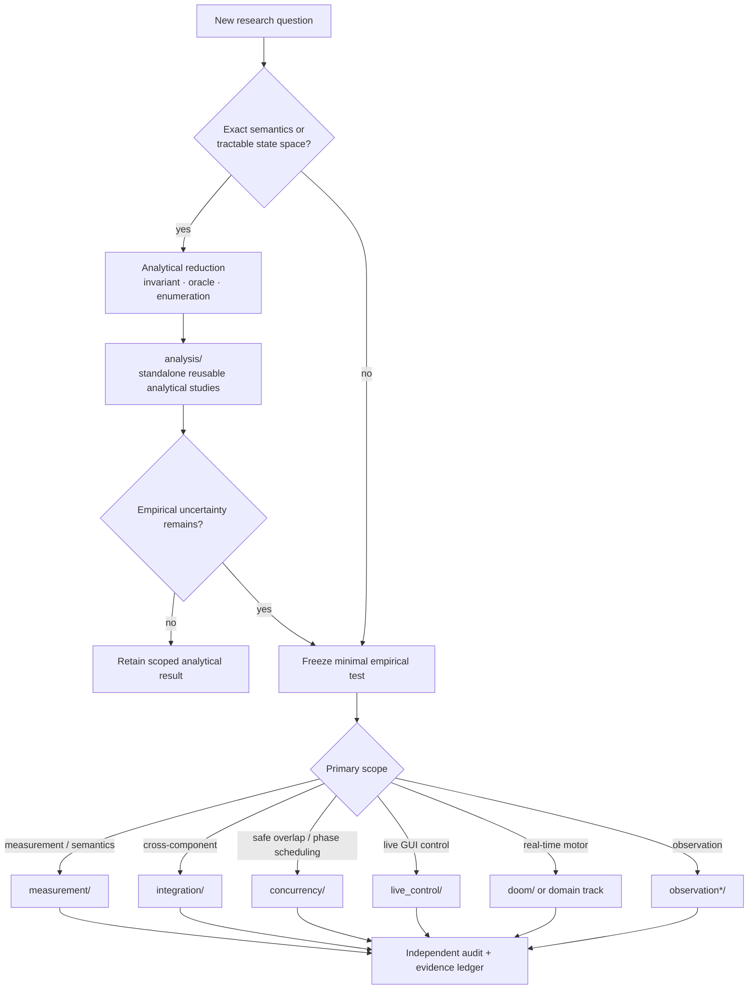

# Research workspace

This directory is the research workspace and retained evidence record for Agent Interface. Directories represent analyses, experiments, mechanisms, fixtures, audits, or historical work; they are **not product versions** and their names alone do not imply promotion.

For claims and scientific disposition, start with the top-level [research index](../RESEARCH.md).

## Start here

- Issue #7411 T0 A01: [user-worthwhile route-benefit estimator](analysis/user_worthwhile_benefit_7411_t0_a01_20261004/REPORT.md) — synthetic estimates recovered planted medians within 1 s, but the frozen auditor missed preregistered row/mutation validation; disposition HOLD, with first result preserved and no retry.

- Issue #7459: [OrbStack COW artifact-workspace T0](measurement/cow_artifact_workspace_7459_t0_20261004/RESULT.md) — Docker-managed COW retained the synthetic artifact edits, but the independent whole-layer audit detected un-attributed OrbStack CA-file mutations; disposition HOLD, no GUI or host-APFS claim.

- Issue #7383: [freshness-gated observation hedging T0](analysis/observation_hedging_7383_t0_20261004/REPORT.md) — the frozen synthetic independent-heavy-tail case passed its method gate, but correlated/shared-queue controls erase the latency gain; no real capture or critical-path benefit is established.

- Issue #5424 T4: [severity-ranking inversion with hard-catastrophe control](analysis/action_class_error_budget_5424_t4_v1/REPORT.md) — 128 synthetic continuation rows independently reconstructed; hard gate prevented the two scripted catastrophic primary effects while correlated fallback risk remained. Method-scoped only.

- Issue #6723 successor to #5370 T7: [composed bounded priority-inheritance experiment](analysis/priority_inheritance_5370_t7_composition_20261002_01/REPORT.md) — 36 rows independently audited; synthetic method-scoped result only, with historical T6 STOP preserved.

- Issue #6710 successor to #6650: [independent controller-law replay](analysis/persistence_gated_throttle_6650_control_replay_20261002_01/REPORT.md) — allocation 01 freeze-key STOP preserved; allocation 02 OrbStack audit exactly reconstructed 36 policy runs and rejected all 9 mutations. Original #6650 `FAIL_HYPOTHESIS` remains unchanged; synthetic audit conformance only.
- Issue #6581 path-width constrained GUI T0b: [`analysis/path_width_continuous_gui_6581_t0b_v1/REPORT.md`](analysis/path_width_continuous_gui_6581_t0b_v1/REPORT.md) — six synthetic scenarios independently audited `PASS_METHOD_SCOPED`; no ordinary-GUI or human/agent path claim.
- Issue #6617 revision-timed cutover T0: [`analysis/revision_timed_cutover_6617_t0_v1/REPORT.md`](analysis/revision_timed_cutover_6617_t0_v1/REPORT.md) — WSLc `PASS_METHOD_SCOPED` on 30 logical-time traces; no speech, GUI, human, or measured-latency claim.
- Issue #6604 disturbance-timescale T0: [isolated OrbStack Docker method result](analysis/disturbance_timescale_6604_t0_v1/REPORT.md) — 14 rows independently audited; synthetic method scope only, with the predecessor shared-engine HOLD retained separately.

- Issue #6533 frame-qualified collateral T0: [`analysis/frame_qualified_collateral_6533_t0_20261002/REPORT.md`](analysis/frame_qualified_collateral_6533_t0_20261002/REPORT.md) — OrbStack synthetic method pass; 44/44 independently reconstructed, aggregate checker-byte reduction with a small-fixture regression; no real GUI/product claim.

- Issue #6509 claim-scoped partial-verdict T0: [`analysis/claim_scoped_partial_verdict_6509_t0_20261002/REPORT.md`](analysis/claim_scoped_partial_verdict_6509_t0_20261002/REPORT.md) — 45 rows independently audited in OrbStack; method-scoped only, with no real persistence, GUI, safety or performance claim.
- Issue #6403 control-opportunity attribution T0: [`analysis/control_opportunity_attribution_6403_t0_v1/REPORT.md`](analysis/control_opportunity_attribution_6403_t0_v1/REPORT.md) — synthetic method pass; human responsibility attribution remains untested.
- Issue #6133 T1c worker-aging measurement-gate successor: [`analysis/worker_aging_6133_t1c_20261002/REPORT.md`](analysis/worker_aging_6133_t1c_20261002/REPORT.md) — WSLc synthetic method pass, 600 rows independently reconstructed; no real worker-aging or restart-safety claim.
- Issue #6501 scope-typed singleflight: [T0b WSLc method-scoped report](analysis/scope_typed_singleflight_6501_t0b_20261002/REPORT.md) and immutable [predecessor T0 STOP](analysis/scope_typed_singleflight_6501_t0_20261002/REPORT.md); no runtime or Docker-migration claim.

| Need | Entry point |
|---|---|
| Evidence ledger and claims taxonomy | [../RESEARCH.md](../RESEARCH.md) |
| Current research objective | [../docs/CURRENT_GOAL.md](../docs/CURRENT_GOAL.md) |
| Latest detailed handoff | [../docs/LOCAL_RESEARCH_HANDOFF.md](../docs/LOCAL_RESEARCH_HANDOFF.md) |
| Progress and remaining gates | [../docs/PROGRESS_FROM_BASELINE.md](../docs/PROGRESS_FROM_BASELINE.md) |
| Current Linux research caller | [live_control/CURRENT_CLIENT.md](live_control/CURRENT_CLIENT.md) |
| Historical local-GPU triage snapshot (not current resource authorization) | [gpu/RECOVERY_STATUS.md](gpu/RECOVERY_STATUS.md) |
| Research convergence/freeze criteria | [evolution/freeze_criteria.md](evolution/freeze_criteria.md) |
| Issue #6422 denial-aware approval-request A01 | [Preservation qualification](analysis/denial_aware_request_6422_t0_20261002_v1/PRESERVATION_QUALIFICATION.md) — partial 14-case synthetic method evidence; missing deferral-authority and one-use/budget coverage, not full T0 or a T1 basis. |
| Issue #6380 counterexample-driven contract elicitation T0 | [analysis/constraint_elicitation_6380_t0_v1/REPORT.md](analysis/constraint_elicitation_6380_t0_v1/REPORT.md) — retained method-construction failure; no human or runtime claim. |
| Issue #59 global-owner event/head invariance T0 | [analysis/map01_global_owner_invariance_59_t0_20261001/REPORT.md](analysis/map01_global_owner_invariance_59_t0_20261001/REPORT.md) |
| Issue #5970 × #5348 causal-cut recovery reachability T0 | [analysis/blackstart_causal_cut_5970_t0_20261001/REPORT.md](analysis/blackstart_causal_cut_5970_t0_20261001/REPORT.md) |
| Issue #5970 retained reconnect-trace applicability T1 | [analysis/blackstart_causal_cut_5970_t1_20261001/REPORT.md](analysis/blackstart_causal_cut_5970_t1_20261001/REPORT.md) |
| Issue #5970 prospective X11 event-provenance T2 | [analysis/blackstart_prospective_trace_5970_t2_20261001/REPORT.md](analysis/blackstart_prospective_trace_5970_t2_20261001/REPORT.md) |
| Issue #5970 source-bound prospective provenance T3 | [analysis/blackstart_source_bound_5970_t3_20261001/REPORT.md](analysis/blackstart_source_bound_5970_t3_20261001/REPORT.md) |
| Issue #5970 X RECORD delivery-boundary successor T4 | [analysis/blackstart_xrecord_5970_t4_20261001/REPORT.md](analysis/blackstart_xrecord_5970_t4_20261001/REPORT.md) |
| Issue #6086 hazard-shaped discretionary capture T0 | [analysis/hazard_discretionary_capture_6086_t0_20261002/REPORT.md](analysis/hazard_discretionary_capture_6086_t0_20261002/REPORT.md) |
| Issue #5970 X window-tree target diagnostic T5 | [analysis/blackstart_xevent_target_5970_t5_20261002/REPORT.md](analysis/blackstart_xevent_target_5970_t5_20261002/REPORT.md) |
| Issue #5970 all-window observer successor T6 | [analysis/blackstart_allwindow_trace_5970_t6_20261002/REPORT.md](analysis/blackstart_allwindow_trace_5970_t6_20261002/REPORT.md) |
| Issue #5970 pre-input target liveness T7 | [analysis/blackstart_record_target_liveness_5970_t7_20261002/REPORT.md](analysis/blackstart_record_target_liveness_5970_t7_20261002/REPORT.md) |
| Issue #5970 ancestor observer startup STOP T8 | [analysis/blackstart_record_target_ancestor_5970_t8_20261002/REPORT.md](analysis/blackstart_record_target_ancestor_5970_t8_20261002/REPORT.md) |
| Issue #5970 immediate-parent observer T9 | [analysis/blackstart_tk_parent_window_5970_t9_20261002/REPORT.md](analysis/blackstart_tk_parent_window_5970_t9_20261002/REPORT.md) |
| Issue #5970 parent-only stream diagnostic T10 | [analysis/blackstart_tk_parent_only_5970_t10_20261002/REPORT.md](analysis/blackstart_tk_parent_only_5970_t10_20261002/REPORT.md) |
| Issue #5970 non-modifier control T11 | [analysis/blackstart_nonmodifier_trace_5970_t11_20261002/REPORT.md](analysis/blackstart_nonmodifier_trace_5970_t11_20261002/REPORT.md) |
| Issue #5970 no-input X event baseline T12 | [analysis/blackstart_x11_noinput_baseline_5970_t12_20261002/REPORT.md](analysis/blackstart_x11_noinput_baseline_5970_t12_20261002/REPORT.md) |
| Issue #6147 safe-probe T0 allocation 02 | [STOP report](analysis/safe_probe_identifiability_6147_t0_20261002_a02/STOP.md) — candidate runtime STOP; not evaluated |
| Issue #6147 safe-probe T0 allocation 03 | [qualified report](analysis/safe_probe_identifiability_6147_t0_20261003_a03/REPORT.md) — 9 layers independently matched, but unsafe-probe mutation gate was not exercised; no method PASS claimed |
| Issue #6147 safe-probe T0 allocation 04 | [method-scoped report](analysis/safe_probe_identifiability_6147_t0_20261003_a04/REPORT.md) — post-probe stale-action denied, one-step convergence, 7 mutation rejects; exact p→q convergence deferred |
| Issue #6147 safe-probe T0 allocation 05 | [method-scoped report](analysis/safe_probe_identifiability_6147_t0_20261003_a05/REPORT.md) — exact p→q convergence to safe terminal state without initial identity claim; 6 mutation rejects |
| Issue #6413 evaluation-cue T0 | [WSLc report](analysis/evaluation_cue_reactivity_6413_t0_wslc_20261003/REPORT.md) — static synthetic construction passed independent audit; no model-behavior or evaluation-awareness claim |
| Issue #6074 interval-robustness finite-method T0 | [analysis/interval_robustness_6074_t0_20261002/REPORT.md](analysis/interval_robustness_6074_t0_20261002/REPORT.md) |
| Issue #6045 opportunity-conditioned age T0 container method result | [analysis/opportunity_conditioned_actuated_info_6045_t0_20261002/REPORT.md](analysis/opportunity_conditioned_actuated_info_6045_t0_20261002/REPORT.md) |
| Issue #6351 cross-role meaning drift synthetic T0 | [analysis/cross_role_meaning_drift_6351_t0_v1/REPORT.md](analysis/cross_role_meaning_drift_6351_t0_v1/REPORT.md) |
| Issue #6373 context-preserving delegation synthetic T0 | [analysis/context_preserving_delegation_6373_t0_v1/REPORT.md](analysis/context_preserving_delegation_6373_t0_v1/REPORT.md) |
| Issue #6435 deadline/slack measurement-method T0 | [analysis/deadline_slack_equivalence_6435_t0_v1/REPORT.md](analysis/deadline_slack_equivalence_6435_t0_v1/REPORT.md) |
| Issue #6437 constraint-response normalization successor T0 | [analysis/constraint_response_normalization_6437_t0_v1/REPORT.md](analysis/constraint_response_normalization_6437_t0_v1/REPORT.md) |
| Issue #6038 label/control ambiguity T0 (synthetic method only; formal-01 STOP retained) | [analysis/label_control_ambiguity_6038_t0_v1/REPORT.md](analysis/label_control_ambiguity_6038_t0_v1/REPORT.md) |
| Issue #6422 authorized conditional-deferral boundary A02 | [analysis/denial_aware_deferral_authority_6422_a02_20261002_v1/REPORT.md](analysis/denial_aware_deferral_authority_6422_a02_20261002_v1/REPORT.md) |
| Issue #6315 original finite-trace T0 (auditor-v1 HOLD retained; WSLc successor separate) | [analysis/temporal_coalescing_6315_t0_v1/REPORT.md](analysis/temporal_coalescing_6315_t0_v1/REPORT.md) |
| Revisit history | [REVISIT_LEDGER.md](REVISIT_LEDGER.md) |
| Analysis vs experiment decision flow | [../docs/RESEARCH_METHOD.md](../docs/RESEARCH_METHOD.md) |
| Public evidence/document relationship map | [../docs/EVIDENCE_MAP.md](../docs/EVIDENCE_MAP.md) |
| Retained direct-root experiment namespaces | [ROOT_NAMESPACE_MAP.md](ROOT_NAMESPACE_MAP.md) |


## Research routing


```mermaid
flowchart TD
    Q[New research question] --> M{Exact semantics or<br/>tractable state space?}
    M -->|yes| A[Analytical reduction<br/>invariant · oracle · enumeration]
    A --> ANA[analysis/<br/>standalone reusable analytical studies]
    ANA --> U{Empirical uncertainty remains?}
    U -->|no| R[Retain scoped analytical result]
    U -->|yes| E[Freeze minimal empirical test]
    M -->|no| E
    E --> C{Primary scope}
    C -->|measurement / semantics| MEAS[measurement/]
    C -->|cross-component| INT[integration/]
    C -->|safe overlap / phase scheduling| CONC[concurrency/]
    C -->|live GUI control| LIVE[live_control/]
    C -->|real-time motor| DOOM[doom/ or domain track]
    C -->|observation| OBS[observation*/]
    MEAS --> AUD[Independent audit + evidence ledger]
    INT --> AUD
    CONC --> AUD
    LIVE --> AUD
    DOOM --> AUD
    OBS --> AUD
```

Prefer the narrowest existing namespace. The diagram is a placement guide; retained historical paths are not reorganized retroactively.

## Analytical studies

- [`analysis/action_bound_residual_6619_t0_v1/REPORT.md`](analysis/action_bound_residual_6619_t0_v1/REPORT.md) — Issue #6619 WSLc T0 retained as audit-control STOP; no scientific PASS or live-control claim.
- [Cyclic grounding #4431 / Draft PR #4443 published-byte archive](analysis/cyclic_justification_grounding_delivery_t6g2_v1/ARCHIVAL_QUALIFICATION.md) — nine exact published files (25,174 bytes); reported `PASS_LOCAL_CYCLIC_GROUNDING_CONTRACT` remains separate from `HOLD_REMOTE_RAW_DELIVERY`; full raw/audit/control/process bundle absent, no independent reproduction or runtime promotion.

- [`analysis/preference_uncertainty_5749_t0_v1/REPORT.md`](analysis/preference_uncertainty_5749_t0_v1/REPORT.md) — Issue #5749 T0 method-only PASS: safe preference-query boundary, choice-version binding, neutral construction, framing-sensitivity hold; no human or runtime claim.

- [`analysis/route_assignment_exposure_5760_t0_v1/REPORT.md`](analysis/route_assignment_exposure_5760_t0_v1/REPORT.md) — Issue #5760 T0 method-scoped PASS: constructed selection reversal detected, null control matched, six mutations rejected; not empirical or causal evidence.

- [`analysis/adaptive_screen_5739_t0_v1/REPORT.md`](analysis/adaptive_screen_5739_t0_v1/REPORT.md) — Issue #5739 claim-boundary successor: read-only audit-v2 PASS after preserving the audit-v1 report-serialization STOP; synthetic-only.

- [`analysis/obligation_conservation_5817_t0_v1/REPORT.md`](analysis/obligation_conservation_5817_t0_v1/REPORT.md) — Issue #5817 cross-task obligation conservation T0: finite synthetic Docker PASS with independent prefix audit; allocation-01 gate STOP preserved, no live effect/durability claim.
- [`analysis/source_constraint_preservation_5951_t0_20261001/RESULT.md`](analysis/source_constraint_preservation_5951_t0_20261001/RESULT.md) — Issue #5951 finite host-only source-clause METHOD construction; auditor-v1 FAIL and UNKNOWN-baseline review failure retained, corrected independent audit and stronger baseline successor pass; no natural-language, live, container, or runtime claim.

- [`analysis/`](analysis/) — proofs, exact derivations, exhaustive state-space checks, break-even/identifiability analysis, and the empirical residuals they expose.
- [`analysis/backward_evidence_slice_5329_t0_v1/README.md`](analysis/backward_evidence_slice_5329_t0_v1/README.md) — Issue #5329 Formal01 auditor STOP preserved unchanged; distinct Formal02 passes the finite backward-slice method gate with explicit scope limits.
- [`security/`](security/) — Issue #5692 X11 UI-redress evidence and other security research; formal-01 STOP is recorded in [the result file](security/ui_redress_5692_x11_a02_20261001/FORMAL-01-STOP.md).

Use analytical work to eliminate questions that are already decidable from explicit assumptions; do not treat it as measurement of a real backend/model unless the retained evidence actually contains those endpoints.

- [`analysis/typed_resumption_packet_5404_t0_v1/REPORT.md`](analysis/typed_resumption_packet_5404_t0_v1/REPORT.md) — Issue #5404 OrbStack T0: 50 interruption/recovery scenarios, scoped deterministic PASS; no live interruption or runtime claim.
- [`analysis/active_automata_learning_5385_t0_v1/REPORT.md`](analysis/active_automata_learning_5385_t0_v1/REPORT.md) — Issue #5385 OrbStack T0: four-state bounded active learner PASS against 2,801 finite words; no live-interface or unbounded-equivalence claim.
- [`analysis/action_class_error_budget_5424_t2_v1/REPORT.md`](analysis/action_class_error_budget_5424_t2_v1/REPORT.md) — Issue #5424 OrbStack T2: fixed-corpus typed burn-rate budget reduced post-signal primary severe exposures, with correlated-fallback completion tradeoff and preserved audit-v1 FAIL.
- [`analysis/adaptive_privacy_filter_5420_t1_v1/REPORT.md`](analysis/adaptive_privacy_filter_5420_t1_v1/REPORT.md) — Issue #5420 OrbStack T1: adaptive ε filter enforces the declared bound for two synthetic randomized-response channels; no GUI privacy or DP claim.
- [`analysis/privacy_conditional_kernel_5420_t0_20261004/REPORT.md`](analysis/privacy_conditional_kernel_5420_t0_20261004/REPORT.md) — Issue #5420 successor T0: exact conditional-kernel gate rejects the shared-pad pair and accepts fresh-pad/constant controls; method-scoped only, not a product or general DP claim.

## Workspace map

The top level is intentionally evidence-preserving. The categories below are navigation aids; they do not change the status of any experiment.

For new work, prefer the narrowest existing category below rather than adding another top-level research namespace. Existing direct experiment paths are retained for provenance; see [`ROOT_NAMESPACE_MAP.md`](ROOT_NAMESPACE_MAP.md) for the retained root-path index and [`../CONTRIBUTING.md`](../CONTRIBUTING.md) for placement guidance.

### Live control and integration

- [`live_control/`](live_control/) — shared/live GUI-control mechanisms and integration studies.
- [`doom/`](doom/) — real-time/continuous-control studies and MAP01 evidence.
- [`integration/`](integration/) — integration-focused experiments.
- [Tk first-character #5260 construction record](integration/tk_firstchar_5260_a01_20261002/PREREG.md) — construction-only Docker/Xvfb runner/auditor checks; proposed 96-trial allocation remains HOLD_NOT_AUTHORIZED.
- [Tk validation-lifecycle #4367 / Draft PR #4375 metadata archive](integration/tk_validation_lifecycle_v9m3_v1/ARCHIVAL_QUALIFICATION.md) — three exact published metadata files; pre-allocation publication STOP/HOLD remains, source/raw absent, no construction or formal result independently established.
- [X11 transition coalescing #4422 / Draft PR #4438 metadata archive](integration/x11_transition_coalescing_c4d7_v1/ARCHIVAL_QUALIFICATION.md) — three exact STOP metadata files; formal remains 0/12 cases and 0/38 captures, and no blocked source payload or construction result is independently recovered.
- [Writer selection scope #4425 / Draft PR #4446 archival qualification](integration/writer_selection_scope_w4m8_v1/ARCHIVAL_QUALIFICATION.md) — seven exact published metadata/report files; the complete 401-file raw corpus remains unavailable, so the owner-reported scoped PASS is not independently reproduced.
- [Router membership #4430 / Draft PR #4452 archival qualification](integration/router_membership_q5m8_v1/ARCHIVAL_QUALIFICATION.md) — three exact published STOP metadata files; the complete 457-file source/raw/audit capsule remains uncommitted, with no scientific rerun or independent reproduction.
- [`public_mcp_stale_effect_2907_allocation04_v1/`](integration/public_mcp_stale_effect_2907_allocation04_v1/REPORT.md) — Issue #2907 source-frozen local Docker stale-refusal/effect result and corrected read-only audit; remains a scoped component result, not the full multi-app integration gate.
- [`public_mcp_controller_lineage_2907_construction01_v1/`](integration/public_mcp_controller_lineage_2907_construction01_v1/REPORT.md) — local Docker construction boundary: same caller-owned X11 runtime session across three apps; stale observation refused and neutral input released; not MCP-session fusion or the full #2907 integration gate.
- [`public_mcp_binding_review_2907_construction01_v1/`](integration/public_mcp_binding_review_2907_construction01_v1/REPORT.md) — local Docker public-MCP Calc modal review/rebind; old binding refused with zero emissions, new binding neutral Escape/release; scoped construction only, not observation freshness or full #2907 integration.
- [`public_mcp_replacement_review_2907_construction01_v1/`](integration/public_mcp_replacement_review_2907_construction01_v1/REPORT.md) — public MCP Chromium root replacement boundary: a new process/window was refused by the original transient-family review, with target/revision preserved; HOLD retained because old launcher liveness was not recorded.
- [`measurement/`](measurement/) — scoped measurement and composition studies.
- [#4389 / Draft PR #4410 archival qualification](measurement/key_state_piggyback_q4s8_v1/ARCHIVAL_QUALIFICATION.md) — 18 exact source/freeze/audit blobs; historical same-connection contract PASS and full-cost HOLD are preserved, but the 261-file raw capsule is missing and the reported allocation is not independently re-audited here.
- [#3880 / Draft PR #4440 K2M6 archival qualification](measurement/clock_ipc_asymmetry_k2m6_v1/ARCHIVAL_QUALIFICATION.md) — six exact historical report/proof/verification/publication blobs; the owner-reported local PASS and raw-publication HOLD remain, with the 321-file ZIP absent and #3880's separate OrbStack gate still unresolved.
- [`cross_domain/`](cross_domain/) — cross-domain transfer work.

### Fast local decision / System-1 research

- [`system1/`](system1/) — bounded fast-path representation and decision experiments.
- [`needle_role_graph_3775_v1/`](needle_role_graph_3775_v1/) — Issue #3778 original role-graph allocation retained as `STOP_RESULT_CAPTURE_TRUNCATED`; see [recovery review](needle_role_graph_3775_v1/RECOVERY_REVIEW.md). Distinct compact successor #3780 is documented separately.
- [`local_system1/`](local_system1/) — local decision-kernel, latency, typed-evidence, and frontier-gap mechanics.
- [`needle_lora_3441_pilot_04d_corrected_base_v1/`](needle_lora_3441_pilot_04d_corrected_base_v1/) — Issue #4471 one-shot GPU formal run stopped after training during result serialization; no metrics or predictions were persisted.
- [`needle_lora_3441_pilot_04e_result_schema_v1/`](needle_lora_3441_pilot_04e_result_schema_v1/) — Issue #4471 fresh-seed result-schema successor; scoped one-seed synthetic routing PASS with host-only CUDA limits, not recovery of the earlier STOP.
- [`needle_lora_3441_pilot_04f_seed_replication_v1/`](needle_lora_3441_pilot_04f_seed_replication_v1/) — Issue #4492 one-seed fresh replication PASS within the same synthetic task family; no population-reliability or runtime claim.

### Observation, grounding, and visual state

- [`observation/`](observation/) — observation mechanisms.
- [`observation_gating/`](observation_gating/) — unchanged/relevant observation gating.
- [`observation_tiles/`](observation_tiles/) — exact changed-region/tile transport.
- [`visual_tracking/`](visual_tracking/) — visual tracking experiments.
- `observation_*`, `grounding_*`, and `visual_*` directories — scoped successors and focused mechanisms.

### Runtime, input, and text delivery

- `runtime_*` directories — backend/native/runtime experiments.
- [`native-suite-wslc-a03/`](native-suite-wslc-a03/) — Issue #3352 WSLc A03 stopped after two harness errors because the test image lacks Git; retained setup-failure evidence, not a product failure.
- [`container_control/`](container_control/) — containerized control work.
- [`control_codec/`](control_codec/) — control-codec experiments.
- [`x11_text_german_layout_3668_v2/`](x11_text_german_layout_3668_v2/) — Issue #3741 German XKB text-delivery evidence; retained audit FAIL and missing de-01 raw row are detailed in RECOVERY_REVIEW.md.
- `text_*` directories — text delivery, keymap, XKB, observation binding, and related robustness studies.
- [`issue_3784_explicit_x11_receiver_v1/`](issue_3784_explicit_x11_receiver_v1/) — explicit X11 receiver formal allocation and retained STOP/audit evidence; consult RESULT.md for scope.
- [`issue_3784_focused_receiver_v1/`](issue_3784_focused_receiver_v1/) — Issue #3794 frozen focused-receiver German XKB formula-delivery allocation; formal-01 and independent audit PASS within the documented scope.
- [`issue_3794_receiver_control_construction_v1/`](issue_3794_receiver_control_construction_v1/) — retained Issue #3794 construction-only pilots and audit/corruption evidence; these do not constitute a formal allocation or upgrade predecessor STOPs.
- [`issue_3784_explicit_x11_receiver_v2/`](issue_3784_explicit_x11_receiver_v2/) — corrected receiver-oracle successor; consult RESULT.md for the formal-02 baseline-parser STOP and audit scope.
- [`issue_3784_explicit_x11_receiver_v3/`](issue_3784_explicit_x11_receiver_v3/) — construction-gated German XKB receiver experiment; consult RESULT.md for the formal-03 scoped delivery result.

### Application and domain studies

- [`real_apps_v1/`](real_apps_v1/), [`real_apps_v2/`](real_apps_v2/), [`real_apps_v3/`](real_apps_v3/) — early real-application control studies.
- `openttd_*` directories — OpenTTD task/oracle and transfer studies.
- `libreoffice_*` and `writer_uno_*` directories — office/document-control studies.

### Reliability, concurrency, ownership, and commit semantics

- [`experiments/issue_3840_newline_frame_v2/`](experiments/issue_3840_newline_frame_v2/) — Issue #3840 Docker Desktop/Linux amd64 terminal-LF replication; scoped false-success observation, row-level cross-check, and explicit audit-provenance HOLD are recorded in RESULT.md.
- [`concurrency/`](concurrency/) — phase-level overlap, shared-resource conflicts, and serialized-actuator concurrency studies.
- [`event_delivery/`](event_delivery/) — retained event-delivery, gap, ACK, and notification-boundary studies.
- `receiver_*`, `external_effect_*`, `outbox_*`, `staged_*`, and `exact_runtime_*` directories — effect/commit/recovery semantics.
- `git_*` directories — Git/reference concurrency and atomicity experiments.
- [`coordination/`](coordination/) and [`orchestration/`](orchestration/) — retained coordination/orchestration evidence.
- [Issue #5346 T1](coordination/stigmergy_5346_t1_successor/REPORT.md) — one-shot stigmergy successor stopped after post-run review found the crash lease released at duration 2 instead of frozen TTL 3; do not interpret its apparent policy metrics.
- [Issue #5346 T2](coordination/stigmergy_5346_t2_successor/REPORT.md) — expanded TTL-boundary successor; scoped synthetic tradeoff only, not a live multi-agent/interface validation.

### Evaluation and research governance

- [Verifier registry #5273 / Draft PR #5436 host-construction archive](verification/verifier_registry_5273_t0_v6/ARCHIVAL_QUALIFICATION.md) — twelve exact published files; reported 21 host tests/eight synthetic cases, README test-count discrepancy and post-freeze reruns preserved; formal STOP, zero container invocations, no runtime promotion.
- [Status-cache snapshot #4403 / Draft PR #4406 metadata archive](verification/status_data_version_v3h8_v1/ARCHIVAL_QUALIFICATION.md) — three exact published metadata files; pre-allocation publication STOP/HOLD remains, source/raw absent, no construction or formal result independently established.
- [`verification/postcondition_evidence_ablation_v1/ARCHIVAL_QUALIFICATION.md`](verification/postcondition_evidence_ablation_v1/ARCHIVAL_QUALIFICATION.md) — Issue #3951 / Draft PR #3960: exact three-file provenance/STOP archive; original source/raw remain incomplete, allocation consumed, no independent reproduction or runtime promotion.
- [`benchmark_discovery/`](benchmark_discovery/) — benchmark/coverage discovery.
- [`verification/ontology_gap_5275_t1_v1/REPORT.md`](verification/ontology_gap_5275_t1_v1/REPORT.md) — Issue #5275 T1 lexical novelty boundary probe; scoped synthetic result with training/evaluation overlap disclosed, no semantic-generalization claim.
- [`verification/ontology_gap_5275_t2_v1/REPORT.md`](verification/ontology_gap_5275_t2_v1/REPORT.md) — Issue #5275 T2 held-out surface successor: FAIL, lexical-only abstains on all supported held-out cases and known-vocabulary dilution hides two semantic OOD cases.
- [`evolution/`](evolution/) — convergence, freeze criteria, evolution ledger, and evaluation contracts.
- [`conditional_optimization/`](conditional_optimization/) and [`optimization_revisits/`](optimization_revisits/) — conditional reuse and revisit work.
- [`retention/`](retention/) — retained-evidence utilities/records where applicable.
- [REVISIT_LEDGER.md](REVISIT_LEDGER.md) — explicit revisit ledger.

### Presentation and miscellaneous scoped work

- [`gtk/`](gtk/) — GTK formal receipt contract preflights; construction checks do not establish live matrix acceptance.
- [`results/`](results/) — retained native-handle result bundles; consult each bundle's report for scope and status.
- [`audits/`](audits/) — independent audit/review records retained separately from primary experiment artifacts; follow each record's source and allocation references.

- [`launch/`](launch/) — public-evidence/launch presentation experiments.
- [`experiments/`](experiments/) — small scoped experiments without a narrower established category.
- [#4988 original Qwen abstention-balance STOP package](experiments/qwen05b_abstention_balance_4780_v1/RECOVERY_STATUS.md) — original branch package preserved without overwriting the merged STOP/capture corrections; formal fit count 0.
- [#5014 Qwen abstention-balance v2 resource HOLD](experiments/qwen05b_abstention_balance_4780_v2/RECOVERY_STATUS.md) — exact frozen package and `HOLD_RESOURCE_OWNERSHIP` preserved; formal fit count 0 and current-main refreeze/explicit arbitration required.

### Historical archival namespaces

Both [`archive/`](archive/) and [`archives/`](archives/) are retained historical namespaces. They are not merged or renamed here because existing evidence links and provenance may depend on exact paths. Use [../RESEARCH.md](../RESEARCH.md) and the experiment's own report to determine scientific status.

## Workspace index maintenance

Top-level research directories must remain reachable from either this README or [`ROOT_NAMESPACE_MAP.md`](ROOT_NAMESPACE_MAP.md). Check locally with:

```bash
python research/check_workspace_index.py
```

The check validates navigation only; it does not infer scientific status or require moving historical evidence.

## Environment

Research-only Python dependencies live here:

```bash
python -m pip install -r research/requirements.txt
```

Some harnesses inject real GUI input. Use an isolated X session or disposable container with disposable application state.

## Evidence policy

A research directory should keep its benchmark/source, preregistration where applicable, raw result, audit, environment, and negative results close enough that a claim can be traced back to the experiment.

A directory existing here does **not** mean its mechanism is promoted. Negative results, stopped allocations, superseded harnesses, and scoped passes are intentionally retained.


### Recent direct-root evidence
- [`kernel_receipt_time_5215_20260928/`](kernel_receipt_time_5215_20260928/) — Issue #5215 frozen construction probe and independent audit for lease-expiry and causal timestamp receipt boundaries; scoped contract evidence only.
- [`route_occupancy_5674_construction_v1/`](route_occupancy_5674_construction_v1/) — Issue #5674 finite synthetic Markov construction; empirical route/task hypothesis remains untested.
- [`trace_reduction_5666_construction_v1/`](trace_reduction_5666_construction_v1/) — Issue #5666 host-only synthetic construction check; no independent replay, model, GUI, or authority result.

- [`cli_fault_residue_3711_revalidation_v1/`](cli_fault_residue_3711_revalidation_v1/) — Issue #3711 report-temp fault revalidation protocol; see its linked PR/evidence for current matrix status.
- [`needle_lora_3441_online_stream_v1/`](needle_lora_3441_online_stream_v1/) — Issue #3769 streamed online LoRA successor; scoped host-CPU metrics and limits are in its report.
- [`needle_online_lora_skill_stream_v1/`](needle_online_lora_skill_stream_v1/) — Issue #3911 fresh-process online LoRA/AdamW snapshot-resume experiment; state equivalence passed but strict logit and update-latency gates failed. Formal traces and auditor correction are retained.
- [`needle_role_graph_3780_compact_v1/`](needle_role_graph_3780_compact_v1/) — Issue #3780 compact receipt-gated role-adapter graph evidence; scoped synthetic PASS plus provenance warning.
- [`needle_role_graph_3775_v1/`](needle_role_graph_3775_v1/RECOVERY_REVIEW.md) — Issue #3778 original role-graph allocation retained as `STOP_RESULT_CAPTURE_TRUNCATED`; distinct compact successor #3780 is documented separately.
- [`needle_lora_3441_rank4_online_multiseed_v1/`](needle_lora_3441_rank4_online_multiseed_v1/) — Issue #3790 frozen CPU rank-capacity study; its single formal attempt stopped before held-out metrics, documented in `STOP_RUN.json`.
- [`needle_lora_3441_rank4_online_multiseed_gpu_v1/`](needle_lora_3441_rank4_online_multiseed_gpu_v1/) — Issues #3807/#3819 rank-capacity GPU raw result; final rank-4 online accuracy FAIL is preserved, with the missing learning-curve HOLD noted in #3822.
- [`needle_lora_3441_pilot_04d_multiskill_400base/`](needle_lora_3441_pilot_04d_multiskill_400base/) — retained direct-root Needle multi-skill pilot evidence; use its own report for exact scientific disposition and scope.

### Issue #5236 X11 keymap STOP evidence

- [`x11_midprogram_keymap_5236_formal02_20260930/`](x11_midprogram_keymap_5236_formal02_20260930/) — Formal02 STOP: child import path prevented the hypothesis test.
- [`x11_midprogram_keymap_5236_formal03_20260930/`](x11_midprogram_keymap_5236_formal03_20260930/) — Formal03 STOP: missing Tk runtime library prevented fixture startup.
- [`x11_midprogram_keymap_5236_formal04_20260930/`](x11_midprogram_keymap_5236_formal04_20260930/) — Formal04 STOP: focused root did not receive fixture key input/effects.
- [`x11_midprogram_keymap_5236_formal05_20260930/`](x11_midprogram_keymap_5236_formal05_20260930/) — Formal05 STOP: click/input reached fixture but completed effects were missing; see immutable STOP record.
- [`x11_midprogram_keymap_5236_formal06_20261001/`](x11_midprogram_keymap_5236_formal06_20261001/) — Formal06 `STOP_PROTOCOL_DEVIATION`: raw predates freeze; auditor mismatch is diagnostic only. See `RESULT_DISPOSITION.md`.
- [`x11_midprogram_keymap_5236_formal07_20261001/`](x11_midprogram_keymap_5236_formal07_20261001/) — Formal07 `STOP_PROVENANCE_OR_RUNNER`: one corruption control was a no-op and escaped; raw/audit retained, auditor scientific PASS is not promoted.
- [`x11_midprogram_keymap_docker_diagnostic_20260930/`](x11_midprogram_keymap_docker_diagnostic_20260930/) — Nonformal Docker focus-versus-click diagnostic; not evidence for the formal hypothesis.

- [`aoi_43_t0/`](aoi_43_t0/) — #43 retained toy construction; [accounting-defect/HOLD correction](aoi_43_t0/README.md): identical queue policies and incomparable drop counters; no demonstrated critical-retention benefit.

- [`doom/map01_cuda_hud_5752_preflight_stop_20261001/REPORT.md`](doom/map01_cuda_hud_5752_preflight_stop_20261001/REPORT.md) — Issue #5752 allocation-01 pre-candidate record; its authoritative STOP reason and timestamp are reconciled in [CORRECTION.md](doom/map01_cuda_hud_5752_preflight_stop_20261001/CORRECTION.md). CUDA hypothesis remains untested.- [Issue #6156 escrowed optional-resource budget T0](analysis/escrow_optional_budget_6156_t0_20261002/REPORT.md) — Docker PASS_METHOD_SCOPED over 9,988 reachable states / 27,748 transitions; balanced coordination benefit and skew/crash stranded-right cost retained; no runtime claim.
