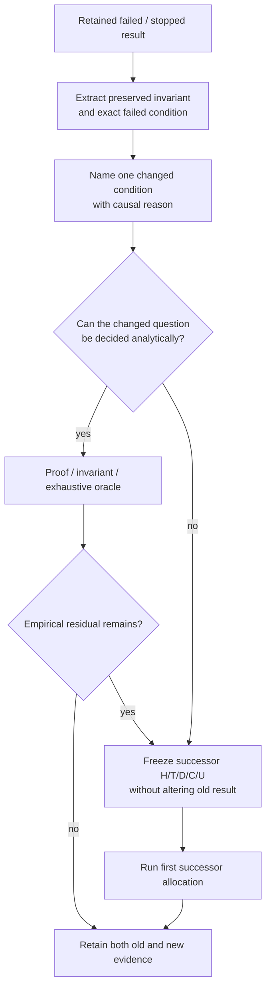

# Research revisit ledger

An unsuccessful allocation rejects a claim under its recorded conditions. It
does not permanently reject the underlying mechanism. Revisit an idea only when
the new run changes a named condition, preserves the safety lesson from the old
failure and defines an independent comparison before execution.

## Revisit decision flow

A revisit should consume analytical structure first when the changed condition is an exact contract, invariant, or tractable finite-state question. Only the remaining environment/model/timing uncertainty needs a fresh allocation. See [`../docs/RESEARCH_METHOD.md`](../docs/RESEARCH_METHOD.md).
Each revisit records:

1. the retained failed artifact and exact failed condition;
2. the invariant learned from that failure;
3. one changed condition with a causal reason;
4. a frozen acceptance rule and resource allocation;
5. the first result, including refusal or another failure;
6. whether the result changes the shared interface or remains domain-specific.

## Revisit ledger

| Mechanism | Retained failed condition | Preserved invariant | Revisit condition | Status |
|---|---|---|---|---|
| Early running-action validity | The first v34 live probe initialized WAD readers after capture, making the source 926.873 ms old against a 500 ms lease. | Expired evidence admits no input; incomplete cleanup evidence remains unknown. | Initialize readers before the measured capture while keeping the same freshness rule. | Revisited successfully in the separately frozen v2 probe; visible ammo change cancelled and released. |
| Absolute health floor for renewable cover | A planner-authored absolute floor permitted an excessively large loss envelope and exposed no useful soft transition. | Local evidence may preserve existing bounded authority but never create it; hard/unknown/expired evidence cancels. | Split critical minimum from a bounded maximum loss and evaluate the effective maximum of both floors. | Revisited in v30; soft exposure occurred, with no causal performance claim. |
| Fixed compact evidence row | The OpenTTD-sized fixed row rejected a verified 314x100 Mindustry panel before decision or click. | A presentation-size mismatch fails closed before semantic choice. | Adapt row height from verified panel geometry while preserving prior OpenTTD pixels exactly. | Revisited in compact sheet v2 and transferred to one Mindustry selection. |
| Generic anchor recovery prompt | A target-noun-free OpenTTD prompt accepted the wrong receipt before expansion; zero button input followed. | Citation of a receipt does not grant target authority, and absence permits a coordinate-free stop. | Carry the exact condition target through both acquisition boundaries. | Revisited in the positive/no-match v2 pair. |
| Endpoint output schemas | Several locally valid schemas were refused by the actual response-format endpoint. | Local JSON Schema validation is not endpoint compatibility. | Run a no-GUI, no-input endpoint preflight keyed by exact schema/model/runner identity before a live allocation. | Promoted into the shared preflight gate; schema-v6 preflight remains frozen and unrun. |
| Pre-artifact typed cancellation | The first frozen run requested cancel47.529ms after capture and71.637ms before artifact readiness, but Executor v10 treated the backend's `executor_v3.Cancelled` as a generic exception and emitted `failed`; terminal release128.856ms also missed125ms. | Matching cancel, a `cancelled` terminal and serialized exact timing remain required even when physical release is independently empty. | Reuse the established v3 exception identities in a new attesting Executor version; serialize the decision receipt before terminal validation. | Revisited in v2: decision36.248ms and cancel60.373ms passed; correct cancelled terminal, but terminal release131.094ms missed125ms. Failure retained without retry. |
| Early physical-release receipt | V2's independent owner verified empty input63.484ms after capture, but the only guard-consumable proof was the terminal release at131.094ms after artifact publication. | Physical input authority and program lifecycle closure must both remain explicit; an early release cannot imply terminal completion or new authority. | Bind the owner interruption to the exact lease/identifier and expose verified empty release while the artifact and terminal remain pending. | Revisited successfully once: physical release57.660ms, publication66.980ms, terminal133.698ms; pending/no-authority state and later closure both verified. |
| General release subscription | Executor v12 started its watcher only after explicit cancel, so autonomous pointer focus/surface/expiry release could remain terminal-only. | Owner-verified release carries no new authority; normal completion must not fabricate an interruption event; terminal closure remains mandatory. | Start one watcher at accepted lease creation and publish any recorded owner interruption with the same lease token before terminal. | Transferred once to actual Inkscape Button1 focus fault: release1.961ms, publication2.095ms, terminal2.634ms, no tail or explicit cancel. |
| Early-release client wait comparison | First same-stream run descriptively returned early release2.672ms vs terminal113.116ms, but both-read server registration was checked only in memory; its receipts/timestamps were not serialized and frozen audit crashed. | A runner boolean or client start clock cannot independently prove server-side precondition ordering. | Persist exact server request receipts before focus and bind the expected early/terminal request IDs in a new frozen audit. | V1 remains retained failed. Distinct v2 ran once: exact receipts precede fault; early22.369ms vs terminal102.693ms (80.324ms advantage),2-vs-1 exchanges;12 files/259,118 bytes retained and audited. |
| Planner work during release-to-terminal gap | Early release reduced one client's wait, but no planner used the interval and early state grants no authority. | Speculative preparation must stay action-scoped, immutable, no-authority, terminal-reconciled and freshly revalidated before Executor admission. | Prepare and fingerprint one candidate after verified release; require exact terminal, fresh action validity and a later Executor acceptance. Compare against terminal-first preparation on one stream. | Seed209 ran once: same exact visual candidate, early useful-ready136.273ms vs terminal-first164.592ms (28.319ms advantage); no candidate input;12 files/266,171 bytes retained/audited. |
| Executed release-prepared candidate | V1 fault click already selected target and strict overlay scorer failed. V2 fixed both, but restored-focus snapshot had null coherent binding; visual-only submit accepted then refused before input, while observation-only wait missed terminal for3s. | Fault must be neutral; overlay identity tolerant; admission also requires coherent input binding; wait must resolve observation or terminal. | Await bounded coherent focus/surface/geometry before submit and race first observation against terminal; retain safe early rejection. | V1 retained failed18 files/503,386 bytes. V2 retained failed14 files/326,224 bytes; zero pointer input and empty release; both audit cross-platform. |
| Coherent pointer readiness and first action boundary | V2 visual target was current while pointer binding crossed WM activation; accepted program then refused safely, but client waited3s for observation instead of consuming terminal. | Pointer admission readiness composes visual state with coherent binding; first useful action boundary can be feedback or terminal. | Require before/after/published binding equality across bounded passive captures; resolve observation-or-terminal in event order. | Revisited in V3 seed206: readiness,2 pointer admissions,2 observations, completed2-step terminal and empty release succeeded. The allocation still failed later report construction, retained separately. |
| First feedback versus first useful feedback | V3 execution completed, but accepted.steps count was misread as program content; first exact frame was still unselected and only second frame showed handles. | Bind immutable program by canonical SHA/count. Score observations in order; retain first feedback separately from first semantic success and stop on terminal. | Version runner/audit, persist every score and both clocks; never reconstruct missing live score time posthoc. | V3 retained failed without retry; mechanics clean but report/live score clock missing;18 files/496,823 bytes audited cross-platform. |
| First-useful-feedback v4 allocation | V3 raw images reveal useful selection only on its second feedback, but live score clock was lost. | Preserve each score and distinguish first available feedback from first observation satisfying the semantic predicate. | Canonical program hash/count, ordered scoring until semantic success or terminal, live clocks for both boundaries. | Revisited successfully in seed205. First feedback capture+89.364ms was false; useful capture+162.540ms and score completion+279.520ms. Terminal preceded recognition by37.876ms.18 files/540,548 bytes retained/audited. |
| Semantic recognition after exact-frame availability | V4 path scoring consumed38–45ms per observation and recognized completion37.876ms after the execution terminal. | A fast semantic result remains no-authority and must reconcile to the exact durable observation; first feedback stays distinct from first useful feedback. | Score the already reconstructed RGB frame with bounded vectorized ROI operations, then require exact-frame digest reconciliation to the PNG. Compare against the old path scorer on the retained false/true pair. | Offline comparison passed once: path median34.696ms vs frame2.320ms across64 samples/mode; exact semantics and artifact reconciliation pass.3 files/197,729 bytes retained/audited. Live integration remains untested. |
| Pre-artifact semantic feedback delivery | Offline exact-frame scoring is fast, but v4 only exposed observations after PNG publication and then rescored their paths. | Provisional semantics grant no authority; action scoping, first-false retention, terminal fallback and exact durable reconciliation remain mandatory. | Emit the exact-frame probe before PNG preparation through a versioned action-scoped cursor; reconcile after publication and retain ordinary observation/terminal. | V5 passed once: useful probe2.623ms, client+224.724ms,≈28.858ms before PNG ready and68.647ms before completed empty-release terminal.18 files/577,889 bytes retained/audited. Cross-seed; matched control still required. |
| Matched live semantic delivery | V4/v5 used different seeds; capture timing differed enough to forbid causal attribution despite reversed recognition/terminal ordering. V1 then applied candidate first-feedback≤200ms to the slower path baseline; all four baseline arms missed only that bound. | Compare client-visible semantic readiness under the same task, candidate, program, exchange count, correctness and release requirements. A baseline health bound must detect pathological runs without requiring candidate latency. | Eight fresh same-seed sessions in balanced P/F/F/P/F/P/P/F order; path client waits PNG then scores, frame client consumes reconciled pre-artifact design. V2 separates path≤260/frame≤200 first-feedback bounds while retaining aggregate≥25ms. | V1 remains failed. V2 passed once: path median287.757ms vs frame238.038ms,49.718ms reduction/0.8272 ratio; all8 correct/released/reconciled.99 files/3,130,105 bytes retained/audited. One Inkscape predicate only. |
| Cross-domain semantic-probe delivery | Chromium v1 completed the task and every consumed probe reconciled, but the frozen checker required four backend reconciliations to equal three probes consumed before the client stopped at success. | A client may stop at first useful feedback; every generated result must reconcile and every consumed result must be covered, without requiring equal collection sizes. | Separate those two coverage checks, preserve all operations/thresholds, and use a fresh seed. | V1 remains formally failed. V2 passed once: blank reject42.098ms, useful submission feedback286.471ms,24.767ms before PNG and156.657ms before terminal; independent token/release pass. One Chromium predicate only. |
| Target-relative semantic geometry | V1 moved Chromium `[21,28]`, but the executor retained the last observed pre-move binding and refused at step0 before pointer input, probe or submission. | External geometry change never refreshes input authority implicitly; coherent current binding must precede pointer admission. | Add exactly one passive post-move observation, preserve the relative predicate, translated program, resize fault and thresholds, and use a fresh seed. | V1 retained safe failure. V2 passed: relative crop followed `[21,28]`, fixed control failed, useful feedback275.781ms; later -120px resize refused before crop hashing.33 files/857,946 bytes audited. |
| Resize repair for semantic regions | A target-relative contract safely refused after same-surface resize; directly accepting stale pixels would violate current geometry. | Resize invalidates the old contract. Local repair requires a fresh coherent observation and a verified current target-handle resolution; neither grants input authority. | Derive the semantic region from the verified Save handle plus a frozen relation, resize, revalidate exact handle pixels and regenerate the contract without model use. | Seed212 passed once: handle0.091ms, repair0.145ms, capture→ready110.866ms, frontier resumes0; independent task/release pass.31 files/751,360 bytes audited. Relation remains fixture-calibrated. |
| Matched local repair versus model reacquisition | V1 stopped on capacity. V2 returned the correct point after8,262.886ms but its3,000ms source freshness expired, so handle resolution safely refused. | Capacity and stale evidence grant no authority. A model response never refreshes its source observation; incomplete arms never enter metrics. | Preserve the model-visible patch, take one passive current exact observation after response and require a source/current no-authority patch receipt before contract/input. | V3 passed4/4: local median109.966ms/9,351 input vs model8,115.268ms/18,702; differences8,005.302ms/9,351 tokens. Shared caller v3 now covers unchanged/local plus missing/ambiguous/changed fallback and post-model refusal offline; natural live caller evidence remains. |
| Shared-caller semantic repair live integration | V1 local repair completed with zero fallback calls, then final revalidation required the completion crop before Submit and safely stopped. Model case never started. | Current target resolution and pre-action semantic state are separate; a postcondition must not be required before its action. False must remain distinguishable from unavailable evidence. | Require current exact/translated binding, a materialized observed crop and `expected_crop_missing` before Submit; preserve handle resolution, admission and independent post-action scoring. | V1 retained failed:0 Submit, empty output/release;40 files/742,028 bytes audited. V2 passed both seed217 cases once: resize local0 repair calls; hover local missing→one model→current patch; exact task/release.100 files/1,792,829 bytes audited. |
| Visual history and action crops | Prior full-frame/effect-memory and action-region zoom experiments retained pixels but did not join the crop to accepted action, independently scored effect and recovery history in one contract. | Archived visual evidence grants no current semantic or input authority; failures and recovery routes must remain distinguishable. | Bind exact source/target bytes, admitted program/release, reconciled effect/independent output and recovery trace; fail closed on retrieval mismatch before comparing presentation conditions. | Two42x18 crops were retrospectively derived from frozen adaptive-repair v2 local/model cases. Ten tests and retained audit pass; no new model call or memory benefit claim. Next freeze action-crop/full-frame/no-prior-memory arms. |
| Full-frame visual history under changed target conditions | Full screenshot history was an unmeasured control and could distract grounding; an old target crop might also pull input toward a visually matching decoy. | Current pixels and task meaning outrank archived appearance; prior memory grants no authority and wrong targets must be independently scored. | Hold model/prompt/current frame/scorer fixed; compare no memory, prior full frame and action crop on shifted, duplicate and restyled-trap pages, then actually admit each point after fresh observation. | First allocation: all arms3/3,0 wrong/no-effect. Crop28,188 vs full31,791 input (-11.33%) but no-memory28,035 and perfect. Trap crop rejects old appearance. Eligible only as conditional full-history replacement; original audit field failure retained, v2 raw audit passes. |
| Bounded OpenTTD drag difference sheet | Frozen v9 A→B/B→C screenshots retained road transitions; Chromium crop had equal target correctness with fewer tokens than full history. | Current exact pixels and independently scored engine effect outrank old crop; a cost-text/pointer/highlight difference must not be read as failed road construction, and the output grants no input authority. | Two-context archived same-current Luna-low transfer compared no-memory, two full action frames and one before/after/difference sheet with engine-checked observed effects, preregistered7 calls and zero retry. | First run: no-memory/full2/2, crop1/2; A→B falsely contradicted and crop labelled misleading. Input18,736/23,748/19,424. DO_NOT_TRANSFER_CROP. Revisit only with independently current-insufficient state and a newly frozen occlusion-cleared or landmark-preserving crop; no default promotion. |

New entries stay `candidate` until the old artifact, changed condition and
acceptance rule are all concrete. A successful revisit earns only the claim
tested by that allocation; it does not erase the earlier failure.
