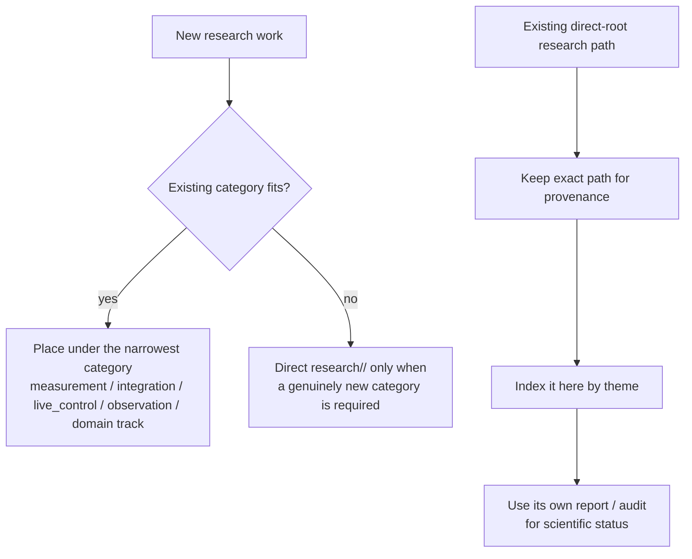

# Research root namespace map

This page organizes retained research directories that live directly under `research/`. It is a navigation aid only: no directory is moved, renamed, promoted, rejected, or reclassified scientifically.

## Placement rule

New work should normally use a category directory. Existing direct-root paths remain stable because Issues, PRs, hashes, reports, and audits may depend on their exact names.

## Preferred categories for new work

| Research scope | Preferred location |
|---|---|
| Analytical proof / exact derivation / identifiability | [`analysis/`](analysis/) |
| Offline audit and provenance review bundles | [`audits/`](audits/) |
| Scoped quantitative/formal semantics | [`measurement/`](measurement/) |
| Cross-component composition | [`integration/`](integration/) |
| Safe overlap / phase scheduling / concurrency | [`concurrency/`](concurrency/) |
| Live desktop control and caller integration | [`live_control/`](live_control/) |
| Continuous / real-time DOOM control | [`doom/`](doom/) |
| Observation/temporal representation | [`observation/`](observation/) |
| Observation gating / exact delta transport | [`observation_gating/`](observation_gating/), [`observation_tiles/`](observation_tiles/) |
| Fast bounded local decision research | [`system1/`](system1/), [`local_system1/`](local_system1/), [`needle_lora_3441_pilot_03_router/`](needle_lora_3441_pilot_03_router/) |
| Cross-domain transfer | [`cross_domain/`](cross_domain/) |
| Coordination semantics | [`coordination/`](coordination/) |
| Evaluation/convergence governance | [`benchmark_discovery/`](benchmark_discovery/), [`evolution/`](evolution/) |
| Conditional optimization/revisits | [`conditional_optimization/`](conditional_optimization/), [`optimization_revisits/`](optimization_revisits/) |
| Public presentation experiments | [`launch/`](launch/) |
| Small uncategorized experiments | [`experiments/`](experiments/) |

## Retained direct-root research families

- [`session_handoff/`](session_handoff/)
- [`gtk_fresh_post_effect_2673/`](gtk_fresh_post_effect_2673/)
- [`results/`](results/) — retained native-handle result bundles; each bundle's report defines its scope and status.
- [`audits/`](audits/) — retained independent audit/review bundles; use the referenced source snapshot and allocation to interpret each result.

- [`x11/`](x11/)

The directories below predate or sit outside the newer category structure. Their placement is historical; read each experiment's own report/result for its exact disposition.

### Effect, admission, and delivery semantics

- [`golden_report_independent_scorer_2246_v1/`](golden_report_independent_scorer_2246_v1/)
- [`exact_runtime_staged_admission_v1/`](exact_runtime_staged_admission_v1/)
- [`external_effect_outbox_v1/`](external_effect_outbox_v1/)
- [`outbox_semantic_revalidation_v1/`](outbox_semantic_revalidation_v1/)
- [`receiver_concurrent_conflict_v1/`](receiver_concurrent_conflict_v1/)
- [`receiver_concurrent_identical_v1/`](receiver_concurrent_identical_v1/)
- [`receiver_outcome_replay_v1/`](receiver_outcome_replay_v1/)
- [`staged_dependency_acquisition_v1/`](staged_dependency_acquisition_v1/)

### Dependency, identity, and semantic contracts

- [`context_effect_commit_discovery_v1/`](context_effect_commit_discovery_v1/)
- [`noncooperative_indistinguishability_v1/`](noncooperative_indistinguishability_v1/)
- [`typed_dependency_trace_v1/`](typed_dependency_trace_v1/)
- [`grounding_commit_guard_v1/`](grounding_commit_guard_v1/)
- [`identity_rendering_discovery_v1/`](identity_rendering_discovery_v1/)
- [`scoped_predicate_envelope_v1/`](scoped_predicate_envelope_v1/)

### Git/reference coordination experiments

- [`git_dependency_completeness_v1/`](git_dependency_completeness_v1/)
- [`git_multiref_atomic_v1/`](git_multiref_atomic_v1/)
- [`git_noncoop_realapp_v1/`](git_noncoop_realapp_v1/)
- [`git_ref_cas_realapp_v1/`](git_ref_cas_realapp_v1/)

### Observation and visual-state experiments

- [`observation_addressing_v1/`](observation_addressing_v1/)
- [`visual_invalidation_discovery_v1/`](visual_invalidation_discovery_v1/)

### Coordination and handoff semantics

- [`session_handoff/`](session_handoff/) — authority-safe advisory handoff capsule contracts.

### Causality and temporal policy experiments

- [`causality/`](causality/)

### OpenTTD support paths

- [`openttd_oracle/`](openttd_oracle/)
- [`openttd_task/`](openttd_task/)

### LibreOffice / Writer experiments

- [`libreoffice_privsep_commit_owner_v1/`](libreoffice_privsep_commit_owner_v1/)
- [`libreoffice_save_conflict_v1/`](libreoffice_save_conflict_v1/)
- [`libreoffice_save_guard_v1/`](libreoffice_save_guard_v1/)
- [`libreoffice_staged_publish_v1/`](libreoffice_staged_publish_v1/)
- [`writer_uno_compare_replace_v1/`](writer_uno_compare_replace_v1/)
- [`writer_uno_durable_recovery_v1/`](writer_uno_durable_recovery_v1/)
- [`writer_uno_post_guard_race_v1/`](writer_uno_post_guard_race_v1/)
- [`writer_uno_prefix_recovery_v1/`](writer_uno_prefix_recovery_v1/)
- [`writer_uno_serialization_negative_v1/`](writer_uno_serialization_negative_v1/)
- [`writer_uno_x11_binding_v1/`](writer_uno_x11_binding_v1/)

### Runtime/backend research predecessors

- [`runtime_backend_x11_v0/`](runtime_backend_x11_v0/)
- [`runtime_native_core_v0/`](runtime_native_core_v0/)
- [`runtime_native_x11_v0/`](runtime_native_x11_v0/)
- [`runtime_native_x11_pacing_cost_v1/`](runtime_native_x11_pacing_cost_v1/)
- [`runtime_native_x11_text_pacing_v1/`](runtime_native_x11_text_pacing_v1/)
- [`runtime_native_x11_text_robustness_v1/`](runtime_native_x11_text_robustness_v1/)
- [`runtime_native_x11_xorg_transfer_v1/`](runtime_native_x11_xorg_transfer_v1/)
- [`runtime_office_writer_x11_pacing_v1/`](runtime_office_writer_x11_pacing_v1/)
- [`runtime_office_x11_text_pacing_v1/`](runtime_office_x11_text_pacing_v1/)
- [`runtime_office_x11_v0/`](runtime_office_x11_v0/)
- [`runtime_portability_v0/`](runtime_portability_v0/)
- [`runtime_x11_unicode_clipboard_v1/`](runtime_x11_unicode_clipboard_v1/)

These are research predecessors. Current promoted executable organization lives under [`../runtime/`](../runtime/).

### Text delivery / XKB experiments

- [`text_delivery_capability_v1/`](text_delivery_capability_v1/)
- [`text_observation_binding_v1/`](text_observation_binding_v1/)
- [`text_observed_prefix_resume_v1/`](text_observed_prefix_resume_v1/)
- [`text_payload_preflight_v1/`](text_payload_preflight_v1/)
- [`text_payload_xkb_altgr_v2/`](text_payload_xkb_altgr_v2/)
- [`text_payload_xkb_layout_v1/`](text_payload_xkb_layout_v1/)
- [`text_payload_xkb_native_map_v1/`](text_payload_xkb_native_map_v1/)
- [`text_payload_xkb_native_roundtrip_v1/`](text_payload_xkb_native_roundtrip_v1/)
- [`text_payload_xkb_xdummy_v1/`](text_payload_xkb_xdummy_v1/)
- [`text_payload_xkb_xdummy_v2/`](text_payload_xkb_xdummy_v2/)
- [`text_post_preflight_keymap_race_v1/`](text_post_preflight_keymap_race_v1/)
- [`text_route_keymap_freshness_v1/`](text_route_keymap_freshness_v1/)
- [`text_x11_server_grab_keymap_v1/`](text_x11_server_grab_keymap_v1/)

## Interpretation

- This file describes **where things are**, not whether their ideas are correct.
- Do not infer promotion from a directory name or from its location at the `research/` root.
- Do not move completed evidence solely to make the tree prettier; stable paths are part of the audit trail.
- If an old mechanism is revisited, create a successor in the appropriate current category and link back to the retained source rather than rewriting the old directory.

## Cross-engine JSONL framing replication

- [`experiments/issue_3840_newline_frame_v2/`](experiments/issue_3840_newline_frame_v2/) — Issue #3840 Docker Desktop/Linux amd64 replication of the terminal-LF strict-prefix result; `RESULT.md` separates the corroborated row-level observation from the unresolved audit-provenance HOLD.

## Navigation check

The canonical top-level workspace check is [`check_workspace_index.py`](check_workspace_index.py), documented in [`README.md`](README.md). It verifies that this retained namespace map and the current workspace map together cover every top-level research directory.

### Guard calibration support preflight

- [`guard_calibration_support_2509_v1/`](guard_calibration_support_2509_v1/) — synthetic ledger/readiness gate for successor Issue #2509; this path is construction-only and not a formal route result.

### Fresh GTK effect receipt precheck

- [`gtk_fresh_post_effect_2673/`](gtk_fresh_post_effect_2673/) — additive precheck boundary for independent fresh post-effect drawable receipts; execution result is recorded in Issue #2673 and must not be inferred from this path alone.

### GTK research namespace

- [`gtk/`](gtk/) — retained GTK/X11 fixture and adapter research paths; consult each child report for scope and disposition.

### Recent additive namespaces

- [`audits/`](audits/) — retained audit-only evidence bundles; currently includes the scoped #3688 exact raw-byte-binding audit and its independent revalidation.
- [`chromium/`](chromium/) — retained Chromium live-control, identity, and recovery experiments; consult each child report for scope and disposition.
- [`cli_fault_residue_3711_revalidation_v1/`](cli_fault_residue_3711_revalidation_v1/) — retained Issue #3711 CLI fault-residue revalidation; consult its report for exact scope and disposition.
- [`issue_3733_german_xkb_text_orbstack_v3/`](issue_3733_german_xkb_text_orbstack_v3/) — retained Issue #3733 German XKB formula-delivery experiment and immutable formal/audit evidence; consult its preregistration and result disposition before making claims.
- [`issue_3784_explicit_x11_receiver_v1/`](issue_3784_explicit_x11_receiver_v1/) — Issue #3784 explicit InputOnly receiver experiment; formal-01 stopped at its receiver-control oracle, so German formula delivery remains untested.
- [`issue_3784_focused_receiver_v1/`](issue_3784_focused_receiver_v1/) — Issue #3794 corrected KeyRelease oracle and formal German XKB formula-delivery experiment; formal-01 and independent artifact audit passed for the exact pinned X11/Xvfb scope.
- [`issue_3784_explicit_x11_receiver_v2/`](issue_3784_explicit_x11_receiver_v2/) — Issue #3791 corrected-receiver successor; formal-02 stopped at the baseline layout parser, so candidate delivery remains untested.
- [`issue_3784_explicit_x11_receiver_v3/`](issue_3784_explicit_x11_receiver_v3/) — Issue #3796 construction-gated receiver successor; formal-03 passed the exact German formula-delivery gate, with scope limits in RESULT.md.
- [`needle_lora_3441_online_stream_v1/`](needle_lora_3441_online_stream_v1/) — retained Issue #3441 online-stream needle LoRA experiment; consult its report for exact scope and disposition.
- [`verification/`](verification/)
- [`needle_lora_3441_rank4_online_lr_half_multiseed_v1/`](needle_lora_3441_rank4_online_lr_half_multiseed_v1/) — retained Issue #3826 fixed half-learning-rate rank-4 five-seed online LoRA result; consult FREEZE, AUDIT, and REPORT for exact scope and disposition.
- [`issue_3349_event_replay_contract_v1/`](issue_3349_event_replay_contract_v1/) — retained Issue #3349 replay-contract evidence.
- [`issue_3676_audit_hardening_v1/`](issue_3676_audit_hardening_v1/) — retained Issue #3676 audit-hardening evidence.
- [`issue_3691_manifest_root_v1/`](issue_3691_manifest_root_v1/) — retained Issue #3691 manifest-root reproduction record.
- [`needle_lora_3441_pilot_04_multiskill/`](needle_lora_3441_pilot_04_multiskill/) — retained Issue #3701 synthetic two-skill adapter-interference pilot.
- [`docker_ipc_schema_bridge_2818_v1/`](docker_ipc_schema_bridge_2818_v1/)
- [`semantic_checkpoint_contract_2661_v1/`](semantic_checkpoint_contract_2661_v1/)

### Needle / System-1 adapter research

- [`needle_lora_3441_pilot_02/`](needle_lora_3441_pilot_02/) — retained global-adapter forgetting result.
- [`needle_lora_3441_pilot_04_multiskill/`](needle_lora_3441_pilot_04_multiskill/) — retained Issue #3701 synthetic two-skill adapter-interference pilot; consult its README and FREEZE for evidence scope.

### Recent direct-root evidence

- [`cli_fault_residue_3711_revalidation_v1/`](cli_fault_residue_3711_revalidation_v1/) — retained Issue #3711 report-temp fault revalidation.
- [`needle_lora_3441_online_stream_v1/`](needle_lora_3441_online_stream_v1/) — retained Issue #3769 streamed online role-adapter experiment.
- [`needle_lora_3441_rank4_online_multiseed_gpu_v1/`](needle_lora_3441_rank4_online_multiseed_gpu_v1/) — retained Issue #3807 five-seed GPU rank-4 online LoRA failure; see the report for scope and limits.
- [`needle_role_graph_3780_compact_v1/`](needle_role_graph_3780_compact_v1/) — retained Issue #3780 role-adapter graph result and audits.
- [`needle_lora_3441_rank4_online_multiseed_v1/`](needle_lora_3441_rank4_online_multiseed_v1/) — Issue #3790 CPU rank-capacity preregistration and immutable one-shot runner STOP evidence.
- [`needle_lora_3441_rank4_online_lr_half_multiseed_v1/`](needle_lora_3441_rank4_online_lr_half_multiseed_v1/) — Issue #3826 fixed half-learning-rate rank-4 online LoRA successor; consult its frozen report/audit for scope and disposition.
- [`needle_lora_3441_rank4_curve_audit_v1/`](needle_lora_3441_rank4_curve_audit_v1/) — Issue #3875 successor's CPU-only independent audit of the immutable #3851 learning-curve result; no training/CUDA, see its scoped report and predecessor STOP.
- [`needle_lora_3441_rank4_minibatch_seed_v1/`](needle_lora_3441_rank4_minibatch_seed_v1/) — Issue #3851 sampler-stream comparison formal STOP; no training comparison/result was produced, see retained stderr and REPORT.md.
- [`needle_lora_3441_rank4_online_multiseed_gpu_v1/`](needle_lora_3441_rank4_online_multiseed_gpu_v1/) — Issues #3807/#3819 GPU rank-capacity failure evidence; #3822 separately records the learning-curve HOLD.
