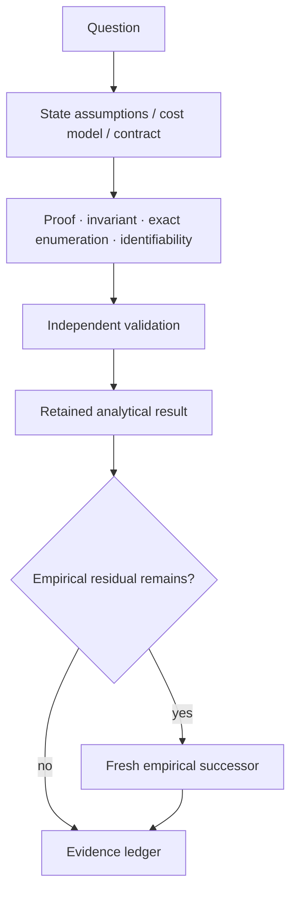

# Analytical research

This directory contains retained analytical studies: proofs, exact finite-state or exhaustive results, break-even derivations, and identifiability analyses.

Analytical results remain scoped to their stated assumptions. When a claim depends on a real OS, application, model, scheduler, latency distribution, or workload, that residual still requires empirical measurement.

See [`../../docs/RESEARCH_METHOD.md`](../../docs/RESEARCH_METHOD.md) for the analysis-versus-experiment decision flow.

## Analysis lifecycle



## Analysis families

```mermaid
flowchart TD
    A[research/analysis]
    A --> COST[Decision / cost frontier]
    A --> REUSE[Reuse / lifetime contracts]
    A --> CONC[Concurrency / serializability]
    A --> OBS[Observation / temporal contracts]
    A --> IDENT[Identifiability / retained-evidence audit]

    COST --> G[guard break-even]
    COST --> S[scheduler feasibility + RUN/WAIT]
    COST --> D[typed decision lattice]
    COST --> M[multi-cursor reposition]

    REUSE --> R[dependency-version reuse]
    REUSE --> L[layered lifetimes]
    REUSE --> DAG[partial DAG recomputation]
    REUSE --> H[fresh target-handle retention]

    CONC --> RW[optimistic read/write commit]
    CONC --> FP[phase-overlap resource footprints]
    CONC --> DYN[dynamic footprint binding]
    CONC --> XT[XTerm footprint transfer]

    OBS --> RC[relevance completeness]
    OBS --> TM[temporal monitor semantics]

    IDENT --> GC[guard calibration]
    IDENT --> EC[evidence-compute calibration]
    IDENT --> TS[temporal cost]
    IDENT --> TB[retained temporal break-even]
    IDENT --> MA[multi-app transition audit]
```



These families are navigation aids, not scientific rankings. Each study's own report remains authoritative, including retained FAIL/HOLD outcomes.

## Indexed analyses

| Family | Study | Retained result | Residual empirical or successor question |
|---|---|---|---|
| Decision / cost | [`guard_policy_break_even_r0_v1/`](guard_policy_break_even_r0_v1/) | Exact one-step selector for pre-guard versus postcondition-only under one commensurate recoverable-route cost model. | Measure real stale probabilities and guard/yield/failure costs in one declared population. |
| Decision / cost | [`evidence_dependent_compute_scheduler_dominance_r0_v1/`](evidence_dependent_compute_scheduler_dominance_r0_v1/) | Stale dependencies or missed hard deadlines make RUN infeasible; current metadata alone cannot universally choose RUN versus WAIT in the feasible region. | Measure invalidation likelihood, utility, contention, partial value, and production scheduler behavior. |
| Decision / cost | [`evidence_compute_run_wait_break_even_r1_v1/`](evidence_compute_run_wait_break_even_r1_v1/) | After the hard feasibility gate, the one-horizon RUN/WAIT threshold depends on invalidation probability and the declared stable-wait versus obsolete-compute losses. | Calibrate those inputs for one concrete job class; correlated invalidation, preemption, partial reuse, and contention remain open. |
| Decision / cost | [`evidence_compute_decision_lattice_r2_v1/`](evidence_compute_decision_lattice_r2_v1/) | Semantic reuse validity, temporal feasibility, and expected-cost selection compose as ordered gates without softer optimization overriding hard invalidation/deadline gates. | Calibrate parameters, rebuild economics, multi-job/resource scheduling, and partial/preemptive work. |
| Decision / cost | [`multicursor_parking_reposition_r0_v1/`](multicursor_parking_reposition_r0_v1/) | Under a serialized physical-pointer endpoint-cost model, logical parked cursors alone do not reduce physical reposition distance; a distinct cheap relocation primitive can. | Measure real relocation cost, hover/path equivalence, semantic re-grounding savings, and live correctness. |
| Reuse / lifetime | [`evidence_dependent_compute_reuse_r0_v1/`](evidence_dependent_compute_reuse_r0_v1/) | For deterministic pure jobs with complete declared dependencies and non-reused semantic version identities, exact dependency-version equality is sufficient for reuse and necessary for universal safety across arbitrary jobs. | Defend against incomplete declarations, ABA/version reuse, nondeterminism, clocks/external state, side effects, and measure performance. |
| Reuse / lifetime | [`layered_lifetime_admission_r0_v1/`](layered_lifetime_admission_r0_v1/) | Admission matches the oracle when reusable tokens bind every declared independently changing lifetime identity; global or route-only epochs lose narrowness or completeness in the frozen model. | Measure natural invalidation rates, runtime overhead, task correctness, model boundaries, and production ABI. |
| Reuse / lifetime | [`evidence_compute_partial_dag_reuse_r3_v1/`](evidence_compute_partial_dag_reuse_r3_v1/) | For pure compute DAGs under the declared assumptions, the minimal universally safe recomputation set is exactly the forward-reachable compute descendants of changed evidence. | Instrument one real pipeline as a declared DAG and measure partial versus whole-pipeline invalidation without hidden dependencies. |
| Reuse / lifetime | [`multicursor_target_handle_regrounding_r0_v1/`](multicursor_target_handle_regrounding_r0_v1/) | Multiple fresh semantic target handles reduce re-grounding only for non-consecutive same-epoch revisits when retention capacity is sufficient. | Measure grounding cost, validation/cache-management cost, model boundaries/tokens, geometry/currentness behavior, and live GUI correctness. |
| Concurrency / serializability | [`optimistic_concurrent_readwrite_commit_r0_v1/`](optimistic_concurrent_readwrite_commit_r0_v1/) | With complete read/write sets, current versions, linearized final validation/effect, and no separate commutativity certificate, parallel admission is safe only without stale-read, cross read/write, or write/write hazards. | Bind the criterion to real typed receipts, measure natural conflicts/overhead, and retain a shared-global negative control. |
| Concurrency / serializability | [`phase_overlap_resource_footprint_a2_v1/`](phase_overlap_resource_footprint_a2_v1/) | Fresh source-exact successor retains zero mismatch for complete declared footprints and fail-closed serialization for UNKNOWN; surface-only and omitted-dependency controls are unsafe. | Determine whether real applications expose complete/static enough resource footprints and transfer to real overlap cases. |
| Concurrency / serializability | [`phase_overlap_resource_footprint_r0_v2/`](phase_overlap_resource_footprint_r0_v2/) | After repairing only source materialization from the retained failed predecessor, the deterministic footprint serializability contract passes its bounded model and corruption controls. | Test hidden/dynamic resources and real application overlap; no timing or runtime-promotion claim follows. |
| Concurrency / serializability | [`phase_overlap_dynamic_footprint_binding_r1_v1/`](phase_overlap_dynamic_footprint_binding_r1_v1/) | A runtime-resolved narrow footprint can recover concurrency relative to a static superset in the frozen model only when the selector state that chose the footprint remains a declared read/currentness dependency. | Test aliasing, hidden globals, external mutation, multi-resource data-dependent access, and revalidation cost in real systems. |
| Concurrency / serializability | [`xterm_resource_footprint_transfer_v2/`](xterm_resource_footprint_transfer_v2/) | `HOLD_ENVIRONMENT`: the planned exact-Git materialization stopped before any scientific invocation because the disposable container could not resolve GitHub; the resource-footprint hypothesis was not decided. | A successor may change only source transport while preserving frozen scientific sources/gates. |
| Concurrency / serializability | [`xterm_resource_footprint_transfer_v3/`](xterm_resource_footprint_transfer_v3/) | `PASS_RESOURCE_FOOTPRINT_XTERM_TRANSFER_SCOPED`: exact frozen sources were materialized and the footprint classifier distinguishes the retained independent XTerm pair from the shared-file conflict, while UNKNOWN serializes. | Footprints are still manually declared; automatic/conservative dependency acquisition and broader live transfer remain open. |
| Observation / temporal contract | [`observation_relevance_completeness_v1/`](observation_relevance_completeness_v1/) | Currentness of a relevance declaration does not imply completeness; nontrivial suppression outside the declared set needs trusted completeness provenance or a by-construction guarantee. | Establish completeness provenance/accuracy in real relevance generation and then measure GUI/model/token effects. |
| Observation / temporal contract | [`temporal_contract_monitor_compilation_r0_v1/`](temporal_contract_monitor_compilation_r0_v1/) | Retained `FAIL_INTEGRITY_ORACLE_SAME_TIMESTAMP_P_TRANSITION`: the first allocation exposes a correlated oracle defect for same-timestamp predicate transitions; the semantic theorem is not decided. | A fresh successor may change only the reference semantics to preserve same-timestamp Boolean transitions in arrival order. |
| Identifiability / audit | [`guard_policy_calibration_identifiability_r1_v1/`](guard_policy_calibration_identifiability_r1_v1/) | Existing retained route families do not identify all guard-selector parameters in one same-population commensurate cost model. | Measure stale incidence and reject/recovery/failure costs on one explicitly recoverable route. |
| Identifiability / audit | [`evidence_compute_calibration_identifiability_r3_v1/`](evidence_compute_calibration_identifiability_r3_v1/) | Seven retained evidence families provide zero fully calibratable same-population job class for the compute decision lattice; cross-family substitution is invalid. | Prospectively measure invalidation probability, WAIT/RUN losses, reuse rate, version cost, and job identity in one declared population. |
| Identifiability / audit | [`temporal_sample_cost_identifiability_v1/`](temporal_sample_cost_identifiability_v1/) | Source sample-count reduction alone does not identify token, wall-time, or monetary break-even; measured `F/Q/H` endpoints are required. | Run fresh matched provider/model measurements with presentation/session/cache identity. |
| Identifiability / audit | [`temporal_break_even_retained_identifiability_v1/`](temporal_break_even_retained_identifiability_v1/) | Existing retained temporal evidence contains zero admissible fully matched rows for the required empirical break-even estimate. | Run a source-matched allocation retaining `F_m`, `Q_m`, `H_m`, identity, and correctness endpoints. |
| Identifiability / audit | [`multi_app_transition_retained_audit_r0_v1/`](multi_app_transition_retained_audit_r0_v1/) | Retained evidence covers focus drift, modal, geometry drift, and window replacement across components/apps, but no single session integrates all four under one contract. | Run a finite multi-app integrated allocation preserving one caller/controller identity across the transition families. |
## Interpretation

- A mathematical or exhaustive PASS is not a live-backend PASS.
- A proof of non-identifiability prevents unmatched evidence from being turned into a causal estimate.
- A closed-form threshold is meaningful only under its declared variables, assumptions, and cost/utility model.
- Real latency, tokens, model behavior, application behavior, and cross-domain transfer stay empirical unless explicitly included in the model.

## Placement rule

Use `research/analysis/<name>/` for reusable, primarily analytical studies whose main result is a proof, exact derivation, exhaustive state-space result, or identifiability result.

When analysis is tightly coupled to one domain/runtime experiment, keep it in that domain directory rather than moving completed evidence solely for path normalization.

## Index maintenance

The index is intentionally checked separately from the scientific artifacts:

```bash
python research/analysis/check_index.py
```

The checker requires every child directory with a retained `REPORT.md` to be linked from this README and rejects links to missing child directories. PLAN-only/in-progress directories do not block the index until a report exists.
