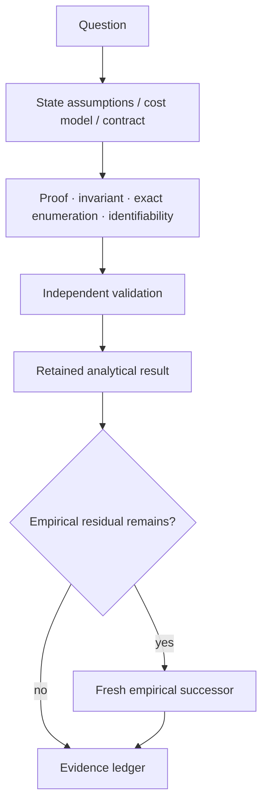

# Analytical research

This directory contains retained analytical studies: proofs, exact finite-state or exhaustive results, break-even derivations, and identifiability analyses.

Analytical results remain scoped to their stated assumptions. When a claim depends on a real OS, application, model, scheduler, latency distribution, or workload, that residual still requires empirical measurement.

See [`../../docs/RESEARCH_METHOD.md`](../../docs/RESEARCH_METHOD.md) for the analysis-versus-experiment decision flow.

## Analysis lifecycle

## Current analyses

| Study | Scoped analytical conclusion | Residual empirical question |
|---|---|---|
| [`guard_policy_break_even_r0_v1/`](guard_policy_break_even_r0_v1/) | Exact one-step selector for pre-guard versus postcondition-only under one commensurate recoverable-route cost model. | Real stale probabilities, guard/failure costs, and environment-specific safety/performance still need measurement. |
| [`multicursor_parking_reposition_r0_v1/`](multicursor_parking_reposition_r0_v1/) | Under a serialized physical-pointer endpoint-cost model, logical parked cursor aliases alone do not reduce physical reposition distance; a distinct cheap relocation primitive is what can create gain. | Real backend relocation cost, hover/path equivalence, semantic re-grounding savings, and live correctness remain empirical. |
| [`temporal_sample_cost_identifiability_v1/`](temporal_sample_cost_identifiability_v1/) | Source sample-count reduction alone does not identify token, wall-time, or monetary break-even; exact measured `F/Q/H` endpoints are required. | Fresh matched provider/model measurements with presentation/session/cache identity. |
| [`temporal_break_even_retained_identifiability_v1/`](temporal_break_even_retained_identifiability_v1/) | Existing retained temporal evidence contains zero admissible fully matched rows for the required empirical break-even estimate. | A new source-matched allocation retaining the required `F_m`, `Q_m`, `H_m`, identity, and correctness endpoints. |
| [`evidence_dependent_compute_reuse_r0_v1/`](evidence_dependent_compute_reuse_r0_v1/) | For deterministic pure jobs with complete declared dependencies and non-reused semantic version identities, exact dependency-version equality is sufficient for reuse and is necessary for universal safety across arbitrary jobs. | Real scheduling policy, ABA/version reuse defenses, incomplete declarations, nondeterminism, clocks/external state, side effects, and performance remain outside the theorem. |

## Interpretation

- A mathematical or exhaustive PASS is not a live-backend PASS.
- A proof of non-identifiability prevents unmatched evidence from being turned into a causal estimate.
- A closed-form threshold is meaningful only under its declared variables, assumptions, and cost/utility model.
- Real latency, tokens, model behavior, application behavior, and cross-domain transfer stay empirical unless explicitly included in the model.

## Placement rule

Use `research/analysis/<name>/` for reusable, primarily analytical studies whose main result is a proof, exact derivation, exhaustive state-space result, or identifiability result.

When analysis is tightly coupled to one domain/runtime experiment, keep it in that domain directory rather than moving completed evidence solely for path normalization.
