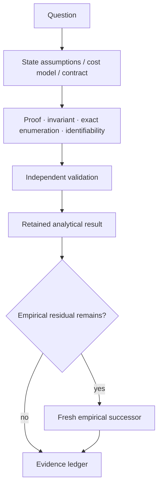
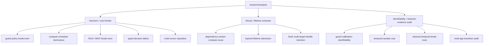

# Analytical research

This directory contains retained analytical studies: proofs, exact finite-state or exhaustive results, break-even derivations, and identifiability analyses.

Analytical results remain scoped to their stated assumptions. When a claim depends on a real OS, application, model, scheduler, latency distribution, or workload, that residual still requires empirical measurement.

See [`../../docs/RESEARCH_METHOD.md`](../../docs/RESEARCH_METHOD.md) for the analysis-versus-experiment decision flow.

## Analysis lifecycle



## Analysis families



These families are navigation aids, not scientific rankings. Each study's own report remains authoritative.

## Indexed analyses

| Family | Study | Scoped analytical conclusion | Residual empirical question |
|---|---|---|---|
| Decision / cost | [`guard_policy_break_even_r0_v1/`](guard_policy_break_even_r0_v1/) | Exact one-step selector for pre-guard versus postcondition-only under one commensurate recoverable-route cost model. | Real stale probabilities, guard/failure costs, and environment-specific safety/performance. |
| Decision / cost | [`evidence_dependent_compute_scheduler_dominance_r0_v1/`](evidence_dependent_compute_scheduler_dominance_r0_v1/) | Stale dependencies or missed hard deadlines make RUN infeasible; current metadata alone cannot universally choose RUN versus WAIT in the remaining feasible region. | Invalidation likelihood, utility, contention, partial value, and production scheduler performance. |
| Decision / cost | [`evidence_compute_run_wait_break_even_r1_v1/`](evidence_compute_run_wait_break_even_r1_v1/) | After the hard feasibility gate, the exact one-horizon RUN/WAIT threshold is determined by invalidation probability and the declared stable-wait versus obsolete-compute losses; the study does not estimate those inputs. | Same-job-class calibration of the probability/cost inputs plus richer scheduling conditions such as correlation, preemption, partial reuse, and contention. |
| Decision / cost | [`evidence_compute_decision_lattice_r2_v1/`](evidence_compute_decision_lattice_r2_v1/) | Semantic reuse validity, temporal feasibility, and the RUN/WAIT expected-cost selector compose as ordered gates without allowing a softer optimization layer to override a hard invalidation/deadline gate. | Parameter calibration, rebuild economics, multiple jobs/resources, partial/preemptive work, and production scheduling performance. |
| Decision / cost | [`multicursor_parking_reposition_r0_v1/`](multicursor_parking_reposition_r0_v1/) | Under a serialized physical-pointer endpoint-cost model, logical parked cursors alone do not reduce physical reposition distance; a distinct cheap relocation primitive can. | Real backend relocation cost, hover/path equivalence, semantic re-grounding savings, and live correctness. |
| Reuse / lifetime | [`evidence_dependent_compute_reuse_r0_v1/`](evidence_dependent_compute_reuse_r0_v1/) | For deterministic pure jobs with complete declared dependencies and non-reused semantic version identities, exact dependency-version equality is sufficient for reuse and necessary for universal safety across arbitrary jobs. | Real scheduling policy, ABA/version reuse defenses, incomplete declarations, nondeterminism, clocks/external state, side effects, and performance. |
| Reuse / lifetime | [`layered_lifetime_admission_r0_v1/`](layered_lifetime_admission_r0_v1/) | Admission matches the oracle when reusable tokens are bound to every declared independently changing lifetime identity; global or route-only epochs lose narrowness or completeness in the frozen model. | Natural invalidation rates, runtime overhead, task correctness, model boundaries, and production ABI. |
| Reuse / lifetime | [`multicursor_target_handle_regrounding_r0_v1/`](multicursor_target_handle_regrounding_r0_v1/) | Multiple fresh semantic target handles reduce re-grounding only for non-consecutive same-epoch revisits when retention capacity is sufficient; freshness-generation changes invalidate old handles. | Actual grounding cost, validation/cache-management cost, model boundaries/tokens, geometry/currentness behavior, and live GUI correctness. |
| Identifiability / audit | [`guard_policy_calibration_identifiability_r1_v1/`](guard_policy_calibration_identifiability_r1_v1/) | Existing retained route families do not identify all parameters required by the guard break-even selector in one same-population commensurate cost model. | Same-population measurement of stale incidence and reject/recovery/failure costs on one explicitly recoverable route. |
| Identifiability / audit | [`temporal_sample_cost_identifiability_v1/`](temporal_sample_cost_identifiability_v1/) | Source sample-count reduction alone does not identify token, wall-time, or monetary break-even; exact measured `F/Q/H` endpoints are required. | Fresh matched provider/model measurements with presentation/session/cache identity. |
| Identifiability / audit | [`temporal_break_even_retained_identifiability_v1/`](temporal_break_even_retained_identifiability_v1/) | Existing retained temporal evidence contains zero admissible fully matched rows for the required empirical break-even estimate. | New source-matched allocation retaining `F_m`, `Q_m`, `H_m`, identity, and correctness endpoints. |
| Identifiability / audit | [`multi_app_transition_retained_audit_r0_v1/`](multi_app_transition_retained_audit_r0_v1/) | Retained evidence covers focus drift, modal, geometry drift, and window replacement across components/apps, but no single session integrates all four under one contract. | Finite multi-app integrated allocation preserving one caller/controller identity across the transition families. |
## Interpretation

- A mathematical or exhaustive PASS is not a live-backend PASS.
- A proof of non-identifiability prevents unmatched evidence from being turned into a causal estimate.
- A closed-form threshold is meaningful only under its declared variables, assumptions, and cost/utility model.
- Real latency, tokens, model behavior, application behavior, and cross-domain transfer stay empirical unless explicitly included in the model.

## Placement rule

Use `research/analysis/<name>/` for reusable, primarily analytical studies whose main result is a proof, exact derivation, exhaustive state-space result, or identifiability result.

When analysis is tightly coupled to one domain/runtime experiment, keep it in that domain directory rather than moving completed evidence solely for path normalization.

## Index maintenance

The index is intentionally checked separately from the scientific artifacts:

```bash
python research/analysis/check_index.py
```

The checker requires every child directory with a retained `REPORT.md` to be linked from this README and rejects links to missing child directories. PLAN-only/in-progress directories do not block the index until a report exists.
