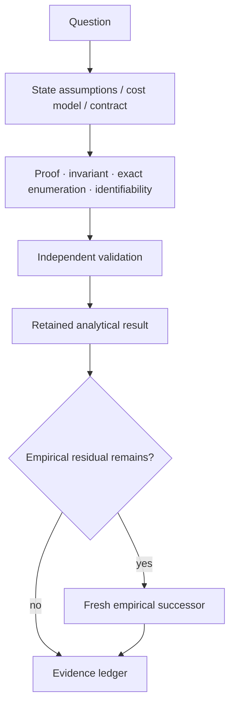

# Analytical research

This directory contains retained analytical studies: proofs, exact finite-state or exhaustive results, break-even derivations, and identifiability analyses.

Analytical results remain scoped to their stated assumptions. When a claim depends on a real OS, application, model, scheduler, latency distribution, or workload, that residual still requires empirical measurement.

See [`../../docs/RESEARCH_METHOD.md`](../../docs/RESEARCH_METHOD.md) for the analysis-versus-experiment decision flow.

## Analysis lifecycle



## Analysis families

```mermaid
flowchart TD
    A[research/analysis]
    A --> COST[Decision / cost frontier]
    A --> REUSE[Reuse / lifetime contracts]
    A --> CONC[Concurrency / serializability]
    A --> OBS[Observation / temporal contracts]
    A --> REPLAY[Replay / provenance]
    A --> IDENT[Identifiability / retained-evidence audit]

    COST --> G[guard break-even]
    COST --> S[scheduler feasibility + RUN/WAIT]
    COST --> D[typed decision lattice]
    COST --> M[multi-cursor reposition]

    REUSE --> R[dependency-version reuse]
    REUSE --> L[layered lifetimes]
    REUSE --> DAG[partial DAG recomputation]
    REUSE --> H[fresh target-handle retention]
    REUSE --> RA[register-state dynamic identity]

    CONC --> RW[optimistic read/write commit]
    CONC --> FP[phase-overlap resource footprints]
    CONC --> DYN[dynamic footprint binding]
    CONC --> XT[XTerm footprint transfer]
    CONC --> BR[typed dynamic branch read-set]
    CONC --> AR[typed alias resolution]
    CONC --> QD[typed query dependency]
    CONC --> QA[query-version writer atomicity]
    CONC --> PL[consistency product lattice]
    CONC --> ML[mediated typed dependency ledger]
    CONC --> XA[retained optimistic-X11 successor audit]

    OBS --> RC[relevance completeness]
    OBS --> TM[temporal monitor semantics]
    OBS --> TMA[temporal monitor accounting successor]
    OBS --> TMC[temporal monitor A3]

    REPLAY --> DR[deterministic boundary replay]
    REPLAY --> ES[event-sourced projection / checkpoint]

    IDENT --> GC[guard calibration]
    IDENT --> EC[evidence-compute calibration]
    IDENT --> TS[temporal cost]
    IDENT --> TB[retained temporal break-even]
    IDENT --> MA[multi-app transition audit]
```



These family nodes are representative navigation aids, not an exhaustive taxonomy or scientific ranking. The generated directory index below is the completeness surface; each study's own report remains authoritative, including retained FAIL/HOLD outcomes.

## Curated analytical result guide

The table below summarizes major analytical chains and representative retained outcomes. It is intentionally explanatory rather than the completeness mechanism; the generated directory index below is exhaustive.

<details>
<summary><strong>Expand curated analytical results and failures</strong></summary>

| Family | Study | Retained result | Residual empirical or successor question |
|---|---|---|---|
| Decision / cost | [`guard_policy_break_even_r0_v1/`](guard_policy_break_even_r0_v1/) | Exact one-step selector for pre-guard versus postcondition-only under one commensurate recoverable-route cost model. | Measure real stale probabilities and guard/yield/failure costs in one declared population. |
| Decision / cost | [`evidence_dependent_compute_scheduler_dominance_r0_v1/`](evidence_dependent_compute_scheduler_dominance_r0_v1/) | Stale dependencies or missed hard deadlines make RUN infeasible; current metadata alone cannot universally choose RUN versus WAIT in the feasible region. | Measure invalidation likelihood, utility, contention, partial value, and production scheduler behavior. |
| Decision / cost | [`evidence_compute_run_wait_break_even_r1_v1/`](evidence_compute_run_wait_break_even_r1_v1/) | After the hard feasibility gate, the one-horizon RUN/WAIT threshold depends on invalidation probability and the declared stable-wait versus obsolete-compute losses. | Calibrate those inputs for one concrete job class; correlated invalidation, preemption, partial reuse, and contention remain open. |
| Decision / cost | [`evidence_compute_decision_lattice_r2_v1/`](evidence_compute_decision_lattice_r2_v1/) | Semantic reuse validity, temporal feasibility, and expected-cost selection compose as ordered gates without softer optimization overriding hard invalidation/deadline gates. | Calibrate parameters, rebuild economics, multi-job/resource scheduling, and partial/preemptive work. |
| Decision / cost | [`multicursor_parking_reposition_r0_v1/`](multicursor_parking_reposition_r0_v1/) | Under a serialized physical-pointer endpoint-cost model, logical parked cursors alone do not reduce physical reposition distance; a distinct cheap relocation primitive can. | Measure real relocation cost, hover/path equivalence, semantic re-grounding savings, and live correctness. |
| Reuse / lifetime | [`evidence_dependent_compute_reuse_r0_v1/`](evidence_dependent_compute_reuse_r0_v1/) | For deterministic pure jobs with complete declared dependencies and non-reused semantic version identities, exact dependency-version equality is sufficient for reuse and necessary for universal safety across arbitrary jobs. | Defend against incomplete declarations, ABA/version reuse, nondeterminism, clocks/external state, side effects, and measure performance. |
| Reuse / lifetime | [`layered_lifetime_admission_r0_v1/`](layered_lifetime_admission_r0_v1/) | Admission matches the oracle when reusable tokens bind every declared independently changing lifetime identity; global or route-only epochs lose narrowness or completeness in the frozen model. | Measure natural invalidation rates, runtime overhead, task correctness, model boundaries, and production ABI. |
| Reuse / lifetime | [`evidence_compute_partial_dag_reuse_r3_v1/`](evidence_compute_partial_dag_reuse_r3_v1/) | For pure compute DAGs under the declared assumptions, the minimal universally safe recomputation set is exactly the forward-reachable compute descendants of changed evidence. | Instrument one real pipeline as a declared DAG and measure partial versus whole-pipeline invalidation without hidden dependencies. |
| Reuse / lifetime | [`multicursor_target_handle_regrounding_r0_v1/`](multicursor_target_handle_regrounding_r0_v1/) | Multiple fresh semantic target handles reduce re-grounding only for non-consecutive same-epoch revisits when retention capacity is sufficient. | Measure grounding cost, validation/cache-management cost, model boundaries/tokens, geometry/currentness behavior, and live GUI correctness. |
| Reuse / lifetime | [`register_automaton_dynamic_identity_r0_v1/`](register_automaton_dynamic_identity_r0_v1/) | `PASS_REGISTER_AUTOMATON_IDENTITY_SCOPED`: exact generation-scoped target validity requires retaining both dynamic identity dimensions (or an equivalent typed tuple); a literal no-register FSM needs `|G|*|T|+1` states in the frozen equality model. | Test richer relations such as version order/aliasing and then transfer the representation to real GUI/API identity without claiming total memory or latency savings. |
| Concurrency / serializability | [`optimistic_concurrent_readwrite_commit_r0_v1/`](optimistic_concurrent_readwrite_commit_r0_v1/) | With complete read/write sets, current versions, linearized final validation/effect, and no separate commutativity certificate, parallel admission is safe only without stale-read, cross read/write, or write/write hazards. | Bind the criterion to real typed receipts, measure natural conflicts/overhead, and retain a shared-global negative control. |
| Concurrency / serializability | [`phase_overlap_resource_footprint_r0_v1/`](phase_overlap_resource_footprint_r0_v1/) | Retained `FAIL_SOURCE_MATERIALIZATION`: the first frozen invocation stopped before enumeration because the executed local analyzer did not match the frozen Git source identity; no scientific rows were produced. | Preserve as an integrity failure; the scientific question proceeds only through a fresh successor with corrected source materialization. |
| Concurrency / serializability | [`phase_overlap_resource_footprint_a2_v1/`](phase_overlap_resource_footprint_a2_v1/) | Fresh source-exact successor retains zero mismatch for complete declared footprints and fail-closed serialization for UNKNOWN; surface-only and omitted-dependency controls are unsafe. | Determine whether real applications expose complete/static enough resource footprints and transfer to real overlap cases. |
| Concurrency / serializability | [`phase_overlap_resource_footprint_r0_v2/`](phase_overlap_resource_footprint_r0_v2/) | After repairing only source materialization from the retained failed predecessor, the deterministic footprint serializability contract passes its bounded model and corruption controls. | Test hidden/dynamic resources and real application overlap; no timing or runtime-promotion claim follows. |
| Concurrency / serializability | [`phase_overlap_dynamic_footprint_binding_r1_v1/`](phase_overlap_dynamic_footprint_binding_r1_v1/) | A runtime-resolved narrow footprint can recover concurrency relative to a static superset in the frozen model only when the selector state that chose the footprint remains a declared read/currentness dependency. | Test aliasing, hidden globals, external mutation, multi-resource data-dependent access, and revalidation cost in real systems. |
| Concurrency / serializability | [`xterm_resource_footprint_transfer_v1/`](xterm_resource_footprint_transfer_v1/) | Retained `FAIL_INTEGRITY`: the first frozen execution detected a local Git-blob mismatch; later local candidate outputs are invalid and are not scientific evidence. | Preserve the integrity failure; only a fresh successor may change materialization/execution plumbing. |
| Concurrency / serializability | [`xterm_resource_footprint_transfer_v2/`](xterm_resource_footprint_transfer_v2/) | `HOLD_ENVIRONMENT`: the planned exact-Git materialization stopped before any scientific invocation because the disposable container could not resolve GitHub; the resource-footprint hypothesis was not decided. | A successor may change only source transport while preserving frozen scientific sources/gates. |
| Concurrency / serializability | [`xterm_resource_footprint_transfer_v3/`](xterm_resource_footprint_transfer_v3/) | `PASS_RESOURCE_FOOTPRINT_XTERM_TRANSFER_SCOPED`: exact frozen sources were materialized and the footprint classifier distinguishes the retained independent XTerm pair from the shared-file conflict, while UNKNOWN serializes. | Footprints are still manually declared; automatic/conservative dependency acquisition and broader live transfer remain open. |
| Concurrency / serializability | [`typed_dynamic_branch_readset_v1/`](typed_dynamic_branch_readset_v1/) | Path-specific typed tracing of the control predicate plus executed branch resource reaches zero unsafe acceptances and zero false invalidations in the frozen branch model; omitting the predicate is structurally unsafe. | Extend to alias resolution, collection/query phantom handling, writer-maintenance atomicity, and automatic tracing in real runtimes. |
| Concurrency / serializability | [`typed_resolve_dependency_v1/`](typed_resolve_dependency_v1/) | Exact alias-resolution tracking requires both the alias mapping version and the selected concrete object version; either alone permits stale acceptance, while tracking all possible targets is safe but over-invalidating. | Extend to membership/query phantoms, multi-hop resolution/cycles, and atomic maintenance of query/membership versions. |
| Concurrency / serializability | [`typed_query_dependency_v1/`](typed_query_dependency_v1/) | Query/membership version plus current-member value/version reads are required in the frozen collection model; member-only misses insertion/removal phantoms and query-only misses member-value mutation. | Writer-side atomic maintenance of membership and query version, then real trace collection without hidden reads. |
| Concurrency / serializability | [`query_version_writer_atomicity_v1/`](query_version_writer_atomicity_v1/) | Reader-side query receipts are trustworthy only when membership mutation and query-version publication share an atomic boundary; membership-first/no-version are unsafe and version-first is conservative. | Integrate the completed READ → RESOLVE → QUERY → writer-atomicity ladder into one bounded real execution substrate. |
| Concurrency / serializability | [`interaction_consistency_product_lattice_r0_v1/`](interaction_consistency_product_lattice_r0_v1/) | Surface separation, read-set validity, actuator independence, hidden/global conflict freedom, and tail commutativity form structured dimensions; surface-only and readset-only predicates are incomparable, so one monotone scalar safety level is unjustified in the frozen model. | Real-backend transfer, automatic dependency completeness, natural hazard rates, and production contract implementation. |
| Concurrency / serializability | [`mediated_typed_dependency_ledger_v1/`](mediated_typed_dependency_ledger_v1/) | `PASS_MEDIATED_TYPED_DEPENDENCY_LEDGER_SCOPED`: one AF_UNIX owner/mediator composes the retained READ, RESOLVE, QUERY and writer-atomicity primitives into typed receipts with zero ledger mismatch, unsafe validation acceptance, or false invalidation across the frozen scientific cases. | Arbitrary-code bypass prevention, automatic GUI dependency discovery, production ABI adoption, performance, and cross-platform transfer remain separate. |
| Concurrency / serializability | [`optimistic_readwrite_x11_retained_audit_a3_v1/`](optimistic_readwrite_x11_retained_audit_a3_v1/) | `PASS_RETAINED_OPTIMISTIC_X11_AUDIT_A3_SCOPED`: a source-frozen successor audit independently validates the exact retained #1750 raw rows while preserving the parent `FAIL_INTEGRITY_AUDIT_GATE_COUNT` and the #1795 workflow stop unchanged. | Cite only as retained parent raw validated by successor audit; XTEST routing, app semantics, dependency completeness, speed/tokens, and production scheduling remain open. |
| Observation / temporal contract | [`observation_relevance_completeness_v1/`](observation_relevance_completeness_v1/) | Currentness of a relevance declaration does not imply completeness; nontrivial suppression outside the declared set needs trusted completeness provenance or a by-construction guarantee. | Establish completeness provenance/accuracy in real relevance generation and then measure GUI/model/token effects. |
| Observation / temporal contract | [`temporal_contract_monitor_compilation_r0_v1/`](temporal_contract_monitor_compilation_r0_v1/) | Retained `FAIL_INTEGRITY_ORACLE_SAME_TIMESTAMP_P_TRANSITION`: the first allocation exposes a correlated oracle defect for same-timestamp predicate transitions; the semantic theorem is not decided. | A fresh successor may change only the reference semantics to preserve same-timestamp Boolean transitions in arrival order. |
| Observation / temporal contract | [`temporal_contract_monitor_compilation_a2_v1/`](temporal_contract_monitor_compilation_a2_v1/) | Retained `FAIL_INTEGRITY_PARENT_PREFIX_ACCOUNTING`: candidate/reference mismatches are zero after the oracle repair, but the consumed allocation used a failure-truncated parent prefix count as a corpus gate. | A3 may change only the accounting gate to the independently derived complete prefix count while preserving the A2 semantics/generator. |
| Observation / temporal contract | [`temporal_contract_monitor_compilation_a3_v1/`](temporal_contract_monitor_compilation_a3_v1/) | `PASS_TEMPORAL_CONTRACT_MONITOR_COMPILATION_A3_SCOPED`: with the accounting gate corrected, four representative one-shot temporal contracts compile to constant-memory deterministic monitors with zero primary/independent mismatch over the full frozen corpus. | Transfer one monitor family to a private live event stream with explicit clock/evidence provenance and no authority escalation. |
| Replay / provenance | [`deterministic_replay_boundary_r0_v1/`](deterministic_replay_boundary_r0_v1/) | In the frozen deterministic reducer model, initial-state identity plus a complete strictly ordered typed record of every external boundary event is sufficient for exact replay/fork replay; omitting order or named event classes creates non-identifiability. | Identify and capture every real nondeterministic/external boundary, then replay retained execution without reinvoking the external dependency. |
| Replay / provenance | [`event_sourced_projection_r0_v1/`](event_sourced_projection_r0_v1/) | For the frozen deterministic reducer, full fold, exactly-once incremental projection, and a trusted checkpoint bound to exact prefix identity/state produce equivalent state; weaker index-only/orderless/missing-event schemes have retained divergent witnesses. | Transfer checkpoint+suffix replay to a retained real event ledger while separately proving external-boundary completeness/authenticity assumptions. |
| Identifiability / audit | [`guard_policy_calibration_identifiability_r1_v1/`](guard_policy_calibration_identifiability_r1_v1/) | Existing retained route families do not identify all guard-selector parameters in one same-population commensurate cost model. | Measure stale incidence and reject/recovery/failure costs on one explicitly recoverable route. |
| Identifiability / audit | [`evidence_compute_calibration_identifiability_r3_v1/`](evidence_compute_calibration_identifiability_r3_v1/) | Seven retained evidence families provide zero fully calibratable same-population job class for the compute decision lattice; cross-family substitution is invalid. | Prospectively measure invalidation probability, WAIT/RUN losses, reuse rate, version cost, and job identity in one declared population. |
| Identifiability / audit | [`temporal_sample_cost_identifiability_v1/`](temporal_sample_cost_identifiability_v1/) | Source sample-count reduction alone does not identify token, wall-time, or monetary break-even; measured `F/Q/H` endpoints are required. | Run fresh matched provider/model measurements with presentation/session/cache identity. |
| Identifiability / audit | [`temporal_break_even_retained_identifiability_v1/`](temporal_break_even_retained_identifiability_v1/) | Existing retained temporal evidence contains zero admissible fully matched rows for the required empirical break-even estimate. | Run a source-matched allocation retaining `F_m`, `Q_m`, `H_m`, identity, and correctness endpoints. |
| Identifiability / audit | [`multi_app_transition_retained_audit_r0_v1/`](multi_app_transition_retained_audit_r0_v1/) | Retained evidence covers focus drift, modal, geometry drift, and window replacement across components/apps, but no single session integrates all four under one contract. | Run a finite multi-app integrated allocation preserving one caller/controller identity across the transition families. |

</details>
## Complete retained result directory index

This compact list is generated from child directories that contain `REPORT.md` or `FORMAL_FAILURE.md`. It is the completeness surface used by the index checker.

<!-- BEGIN GENERATED ANALYSIS RESULT INDEX -->

<details>
<summary><strong>Expand all 87 retained result/failure directories</strong></summary>

- [`action_conditioned_routing_successor_1934_r2/`](action_conditioned_routing_successor_1934_r2/)
- [`anytime_fidelity_typed_admission_r0_v1/`](anytime_fidelity_typed_admission_r0_v1/)
- [`attention_budgeting_successor_1940_v1/`](attention_budgeting_successor_1940_v1/)
- [`attention_provenance_successor_1936_v1/`](attention_provenance_successor_1936_v1/)
- [`belief_auto_recommit_semantic_boundary_r3_v1/`](belief_auto_recommit_semantic_boundary_r3_v1/)
- [`belief_recommit_epoch_aba_r2_v1/`](belief_recommit_epoch_aba_r2_v1/)
- [`belief_repair_decision_lattice_r4_v1/`](belief_repair_decision_lattice_r4_v1/)
- [`bounded_skew_context_join_successor_1218_v1/`](bounded_skew_context_join_successor_1218_v1/)
- [`caller_two_tier_stage_dominance_v1/`](caller_two_tier_stage_dominance_v1/)
- [`capability_snapshot_currentness_fallback_r0_v1/`](capability_snapshot_currentness_fallback_r0_v1/)
- [`causal_temporal_attention_successor_1941_v1/`](causal_temporal_attention_successor_1941_v1/)
- [`causal_temporal_history_2026_v1/`](causal_temporal_history_2026_v1/)
- [`censored_useful_effect_membership_successor_1838_v1/`](censored_useful_effect_membership_successor_1838_v1/)
- [`deterministic_replay_boundary_r0_v1/`](deterministic_replay_boundary_r0_v1/)
- [`event_sourced_projection_r0_v1/`](event_sourced_projection_r0_v1/)
- [`evidence_compute_calibration_identifiability_r3_v1/`](evidence_compute_calibration_identifiability_r3_v1/)
- [`evidence_compute_decision_lattice_r2_v1/`](evidence_compute_decision_lattice_r2_v1/)
- [`evidence_compute_partial_dag_reuse_r3_v1/`](evidence_compute_partial_dag_reuse_r3_v1/)
- [`evidence_compute_run_wait_break_even_r1_v1/`](evidence_compute_run_wait_break_even_r1_v1/)
- [`evidence_compute_x11_png_calibration_uncertainty_r7_v1/`](evidence_compute_x11_png_calibration_uncertainty_r7_v1/)
- [`evidence_dependent_compute_reuse_r0_v1/`](evidence_dependent_compute_reuse_r0_v1/)
- [`evidence_dependent_compute_scheduler_dominance_r0_v1/`](evidence_dependent_compute_scheduler_dominance_r0_v1/)
- [`guard_policy_break_even_r0_v1/`](guard_policy_break_even_r0_v1/)
- [`guard_policy_calibration_identifiability_r1_v1/`](guard_policy_calibration_identifiability_r1_v1/)
- [`independent_effect_evidence_successor_1295_v1/`](independent_effect_evidence_successor_1295_v1/)
- [`interaction_consistency_product_lattice_r0_v1/`](interaction_consistency_product_lattice_r0_v1/)
- [`justification_bound_action_safe_r1_v1/`](justification_bound_action_safe_r1_v1/)
- [`justification_graph_invalidation_r0_v1/`](justification_graph_invalidation_r0_v1/)
- [`justification_graph_truth_maintenance_r0_v1/`](justification_graph_truth_maintenance_r0_v1/)
- [`layered_lifetime_admission_r0_v1/`](layered_lifetime_admission_r0_v1/)
- [`live_two_tier_applicability_v1/`](live_two_tier_applicability_v1/)
- [`map01_task_effect_cross_record_ledger_a2_v1/`](map01_task_effect_cross_record_ledger_a2_v1/)
- [`map01_useful_occupied_control_identifiability_v1/`](map01_useful_occupied_control_identifiability_v1/)
- [`map01_v12_plan_step_lineage_r0_v1/`](map01_v12_plan_step_lineage_r0_v1/)
- [`mediated_typed_dependency_ledger_v1/`](mediated_typed_dependency_ledger_v1/)
- [`multi_actuator_state_domain_independence_r0_v1/`](multi_actuator_state_domain_independence_r0_v1/)
- [`multi_app_transition_retained_audit_r0_v1/`](multi_app_transition_retained_audit_r0_v1/)
- [`multicursor_parking_reposition_r0_v1/`](multicursor_parking_reposition_r0_v1/)
- [`multicursor_target_handle_regrounding_r0_v1/`](multicursor_target_handle_regrounding_r0_v1/)
- [`observation_manipulate_dynamic_certificate_v1/`](observation_manipulate_dynamic_certificate_v1/)
- [`observation_manipulate_support_union_v1/`](observation_manipulate_support_union_v1/)
- [`observation_relevance_completeness_v1/`](observation_relevance_completeness_v1/)
- [`observation_reveal_support_closure_v1/`](observation_reveal_support_closure_v1/)
- [`optimistic_concurrent_readwrite_commit_r0_v1/`](optimistic_concurrent_readwrite_commit_r0_v1/)
- [`optimistic_readwrite_x11_retained_audit_a3_v1/`](optimistic_readwrite_x11_retained_audit_a3_v1/)
- [`phase_overlap_dynamic_footprint_binding_r1_v1/`](phase_overlap_dynamic_footprint_binding_r1_v1/)
- [`phase_overlap_resource_footprint_a2_v1/`](phase_overlap_resource_footprint_a2_v1/)
- [`phase_overlap_resource_footprint_r0_v1/`](phase_overlap_resource_footprint_r0_v1/)
- [`phase_overlap_resource_footprint_r0_v2/`](phase_overlap_resource_footprint_r0_v2/)
- [`probabilistic_automaton_censor_bounds_r1_v1/`](probabilistic_automaton_censor_bounds_r1_v1/)
- [`probabilistic_automaton_censoring_identifiability_r0_v1/`](probabilistic_automaton_censoring_identifiability_r0_v1/)
- [`probabilistic_automaton_dwell_censor_r2_v1/`](probabilistic_automaton_dwell_censor_r2_v1/)
- [`probabilistic_automaton_retained_calibration_r3_v1/`](probabilistic_automaton_retained_calibration_r3_v1/)
- [`query_version_writer_atomicity_v1/`](query_version_writer_atomicity_v1/)
- [`real_source_adapter_admission_v1/`](real_source_adapter_admission_v1/)
- [`real_source_role_adapter_registry_v1/`](real_source_role_adapter_registry_v1/)
- [`register_automaton_dynamic_identity_r0_v1/`](register_automaton_dynamic_identity_r0_v1/)
- [`reusable_receipt_session_binding_v1/`](reusable_receipt_session_binding_v1/)
- [`reusable_receipt_session_binding_v2/`](reusable_receipt_session_binding_v2/)
- [`role_bound_ledger_lifetime_v1/`](role_bound_ledger_lifetime_v1/)
- [`safe_probe_cost_optimal_tree_r1_v1/`](safe_probe_cost_optimal_tree_r1_v1/)
- [`safe_probe_identification_successor_1716_v1/`](safe_probe_identification_successor_1716_v1/)
- [`safe_probe_minimax_r0_v1/`](safe_probe_minimax_r0_v1/)
- [`safety_plane_data_cutset_r0_v1/`](safety_plane_data_cutset_r0_v1/)
- [`safety_watchdog_claim_sink_cutset_r1_a2_v1/`](safety_watchdog_claim_sink_cutset_r1_a2_v1/)
- [`safety_watchdog_claim_sink_cutset_r1_v1/`](safety_watchdog_claim_sink_cutset_r1_v1/)
- [`semantic_delta_successor_2000_v1/`](semantic_delta_successor_2000_v1/)
- [`semantic_selection_identity_successor_341_v1/`](semantic_selection_identity_successor_341_v1/)
- [`serialized_attention_duplicate_label_successor_1968_v1/`](serialized_attention_duplicate_label_successor_1968_v1/)
- [`support_closed_crop_successor_1820_v1/`](support_closed_crop_successor_1820_v1/)
- [`temporal_break_even_retained_identifiability_v1/`](temporal_break_even_retained_identifiability_v1/)
- [`temporal_contract_monitor_compilation_a2_v1/`](temporal_contract_monitor_compilation_a2_v1/)
- [`temporal_contract_monitor_compilation_a3_v1/`](temporal_contract_monitor_compilation_a3_v1/)
- [`temporal_contract_monitor_compilation_r0_v1/`](temporal_contract_monitor_compilation_r0_v1/)
- [`temporal_observation_transfer_2013_v1/`](temporal_observation_transfer_2013_v1/)
- [`temporal_ring_disambiguation_2045_v1/`](temporal_ring_disambiguation_2045_v1/)
- [`temporal_sample_cost_identifiability_v1/`](temporal_sample_cost_identifiability_v1/)
- [`transactional_belief_action_safe_r0_v1/`](transactional_belief_action_safe_r0_v1/)
- [`transactional_belief_action_safe_r1_batched_v1/`](transactional_belief_action_safe_r1_batched_v1/)
- [`two_tier_dependency_commit_gate_v1/`](two_tier_dependency_commit_gate_v1/)
- [`typed_dynamic_branch_readset_v1/`](typed_dynamic_branch_readset_v1/)
- [`typed_query_dependency_v1/`](typed_query_dependency_v1/)
- [`typed_resolve_dependency_v1/`](typed_resolve_dependency_v1/)
- [`visual_cue_coordinate_map_successor_2043_v1/`](visual_cue_coordinate_map_successor_2043_v1/)
- [`xterm_resource_footprint_transfer_v1/`](xterm_resource_footprint_transfer_v1/)
- [`xterm_resource_footprint_transfer_v2/`](xterm_resource_footprint_transfer_v2/)
- [`xterm_resource_footprint_transfer_v3/`](xterm_resource_footprint_transfer_v3/)

</details>

<!-- END GENERATED ANALYSIS RESULT INDEX -->

## Interpretation

- A mathematical or exhaustive PASS is not a live-backend PASS.
- A proof of non-identifiability prevents unmatched evidence from being turned into a causal estimate.
- A closed-form threshold is meaningful only under its declared variables, assumptions, and cost/utility model.
- Real latency, tokens, model behavior, application behavior, and cross-domain transfer stay empirical unless explicitly included in the model.

## Placement rule

Use `research/analysis/<name>/` for reusable, primarily analytical studies whose main result is a proof, exact derivation, exhaustive state-space result, or identifiability result.

When analysis is tightly coupled to one domain/runtime experiment, keep it in that domain directory rather than moving completed evidence solely for path normalization.

## Index maintenance

The index is intentionally checked separately from the scientific artifacts:

```bash
python research/analysis/check_index.py          # check
python research/analysis/check_index.py --write  # refresh generated directory list
```

The checker compares the generated block against every child directory with a retained `REPORT.md` or `FORMAL_FAILURE.md`. PLAN-only/in-progress directories do not enter the generated index until a retained result/failure artifact exists. The curated table above may remain selective because completeness is enforced by the generated block.
