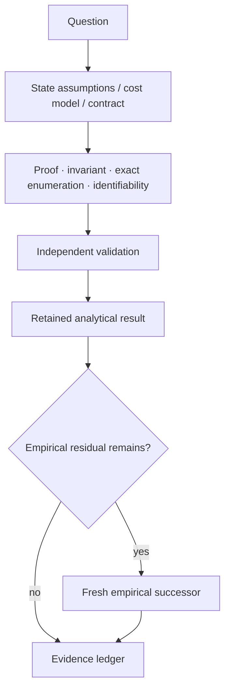

# Analytical research

- [Issue #8576 T0 A01 grounded optional resume suggestions](resume_plan_suggestions_8576_t0_a01_20261008/REPORT.md) — `PASS_METHOD_SCOPED`: 12 finite cases independently reconstructed, 6/6 output mutations rejected; WSLc CPU method evidence only, no human-benefit claim.

- [Issue #8488 PSI-triggered work-shedding T0 A01](psi_work_shedding_8488_t0_a01_20261008/REPORT.md) — `HOLD_DEADLINE_SEMANTICS_MISMATCH`: strict-bound raw recheck gives fixed 4 / queue 3 / free-memory 4 / PSI 1 primary misses, so the zero-miss gate fails. The original `NO_RESIDUAL` reading is withdrawn; no runtime/container claim.

- [Issue #8553 T0 A01 counterexample-guided recovery refinement](counterexample_guided_recovery_refinement_8553_t0_a01_20261008/REPORT.md) — `PASS_METHOD_SCOPED`: 5/5 finite cases independently reconstructed; safe separator refined with `p_color` (one predicate vs fixed-fine's three); planted optimistic false recovery returned `UNKNOWN`; 5/5 mutations rejected. Hand-authored CPU-only model; no GUI/runtime/product claim.

- [Issue #5309 A08 effect-witness preservation](dual_control_5309_witness_a08_20261007/REPORT.md) — `PASS_WITNESS_BOUNDARY_SCOPED`: isolated candidate/oracle mounts; 56 rows independently reconstructed. A04–A07 STOP/method-failure lineage remains preserved; synthetic-only, no GUI/runtime/product claim.

- [Issue #5309 A13 pre-freeze execution STOP](dual_control_5309_precapture_control_a13_20261007/PRE_FREEZE_STOP.md) — candidate ran once before source freeze; environment and auditor were not run. Invalid as preregistration; retained output is custody evidence only, not a scientific result.

- [Issue #8502 T0 A03 corrected paired-cutpoint successor](measurement_invariance_8502_t0_a03_20261008/RESULT.md) — `PASS_METHOD_SCOPED`: fresh five-case seed set independently reconstructed with zero errors; 6/6 mutations rejected. This is synthetic method evidence only; A01 `FAIL_METHOD` and A02 `FAIL_AUDIT_ONLY` remain unchanged, with no human-workload comparability claim.

- [Issue #8502 T0 A02 audit-only result](measurement_invariance_8502_t0_a02_20261008/RESULT.md) — `FAIL_AUDIT_ONLY`: saved-data reconstruction emitted the five fixture labels and rejected six controls, but A02's own README source digest was frozen incorrectly; do not promote its diagnostic map.

- [Issue #8502 T0 A01 result](measurement_invariance_8502_t0_a01_20261008/RESULT.md) — `FAIL_METHOD`: candidate output emitted the five planned labels, but the frozen independent auditor miscomputed the between-group threshold difference for F02. No `METHOD_PASS_SCOPED` or human-workload conclusion.

- [Issue #5826 A02 WSLc container-transfer replication](ascertainment_5826_wslc_transfer_a02_20261008/REPORT.md) — `PASS_WSLc_TRANSFER_SCOPED`: exact A01 source/input hashes reproduced in WSLc; candidate 18 opportunities/72 rows; audit 9/12, F02/F04/F08 all-channel misses; two-list estimates 7.5/7.0; 5/5 mutations rejected. Legacy HOST/HOLD text labels retained and explained; synthetic-only, no enforcement or live safety claim.

- [Issue #8470 compositional gain margin T0 A01](coupled_visual_control_6195_t0_a01_20261008/REPORT.md) — `PASS_METHOD_SCOPED`: 8/8 exact-rational rows independently reconstructed; 3/3 gain mutations rejected; synthetic CPU method evidence only, no GUI/runtime claim.

- [Issue #8466 source-time expiry across negative-evidence handoff T0 A01](negative_handoff_expiry_5865_t0_a01_20261008/REPORT.md) — `PASS_METHOD_SCOPED`: 10 finite logical-time cases reconstructed; sliding TTL accepted the expired C02 receipt, while absolute source-time expiry rejected it; 6/6 mutations rejected. No live cache, clock, task, GUI, or safety claim.

- [Issue #8473 scoped infeasibility feedback T0 A01](scoped_nogood_gui_plan_8473_t0_a01_20261008/STOP.md) — stopped before candidate/auditor because main advanced after freeze; 0/0 formal invocations, no scientific result. A02 is separately frozen on the updated main.

- [Issue #8473 scoped infeasibility feedback T0 A02](scoped_nogood_gui_plan_8473_t0_a02_20261008/REPORT.md) — `PASS_METHOD_SCOPED`: 21 runs independently reconstructed, 5/5 mutations rejected; scoped no-goods reduced one duplicate feasibility query in each recovery case while preserving alternatives across generation change and expiry. Synthetic symbolic fixture only.

- [Issue #5959 deadline-constrained clarification timing T0 A01](clarification_timing_5959_t0_a01_20261008/REPORT.md) — `PASS_METHOD_SCOPED`: 15 finite requests / 45 policy rows independently reconstructed; hard bypass, stale/late/nonresponse/authority gates passed. Authored interruption-cost scores only; no human or runtime claim.

- [Issue #7650 T0 A01/A02 machine-gate audit chain](crosslingual_visual_injection_7650_t0_a01_20261008/REPORT.md) — Preserve A01's recorded `PASS_MACHINE_GATE_SCOPED` as history; review found it insufficient for row-to-UID binding, which read-only A02 passes with 7/7 metadata controls on the exact raw. Full Issue T0 remains HOLD: no bilingual semantic adjudication or pixel review.

- [Issue #6600 practice-order discriminator T0 A01](faded_demonstration_practice_order_6600_t0_a01_20261008/REPORT.md) — `PASS_METHOD_SCOPED`: fixed-dose blocked/mixed six-task ledgers independently reconstructed; 6/6 mutations rejected. Host-only stdlib method evidence; no participants or learning claim.

- [Issue #8434 disturbance-order correlation T0 A01](disturbance_order_8434_t0_a01_20261008/REPORT.md) — `PASS_METHOD_SCOPED`: held-out route ranking reverses across equal-marginal clustered/block versus alternating schedules; 96 source-bound cases independently reconstructed. Authored finite method fixture only, host-only after container content-store STOP; no real-interface inference.

- [Successor #7452 A02 equal-denominator context × event-order comparison](ordered_context_event_coverage_7452_a02_20261008/REPORT.md) — `PASS_METHOD_SCOPED`: independent audit matches mixed and exhaustive suites on the same 64 obligations; mixed 32 rows/4 episodes versus exhaustive 128 rows/64 episodes; 4/4 hostile inputs rejected. Synthetic CPU-only evidence; A01's unequal-scope result remains unchanged.
- [Successor #7452 A01 reset-faithful context × event-order coverage](ordered_context_event_coverage_7452_a01_20261008/REPORT.md) — `PASS_METHOD_SCOPED`: independent reconstruction validated 4 mixed reset-bounded episodes/32 rows against 128 exhaustive episodes/256 rows; all seeded mutants detected only with the combined suite; host CPU-only, synthetic method evidence.

- [Issue #7059 verdict-free redundancy ledger T0 A02](verdict_free_7059_t0_a02_20261007/REPORT.md) — `PASS_METHOD_SCOPED`: one candidate and one separate auditor container invocation; 10/10 synthetic case-arm rows reconstructed and 6/6 integrity mutations rejected. A01 `STOP_EXECUTION_COUNT_MISMATCH` remains unchanged. No model or human behavior claim.

- [Issue #6501 T01 Windows native ReadFile cancellation comparison](../concurrency/windows_native_cancel_6501_01a0ff58_t01/REPORT.md) — Three one-shot Windows native cells characterize normal read completion, asyncio wrapper cancellation, and `CancelSynchronousIo`; the v1 saved-data audit's two false accepts and the v2 nine-control rejection are both retained. No replay, arbitrary-I/O, runtime, effect, or performance claim.

- [Issue #7817 provenance-checked defeasible obligations T0 A01](provenance_defeasible_obligations_7817_a01_20261005/REPORT.md) — `PASS_METHOD_SCOPED`: ten finite obligation contexts and five hostile mutations independently audited; advisory-only synthetic semantics.

- [Issue #7367 A02 frozen workload binding](issue7367_audit_binding_a02_20261005/REPORT.md) — `PASS_RETAINED_BYTES_SCOPED`: legacy auditor accepted a self-consistent post-freeze workload mutation; read-only successor binds workload bytes to PRE-RUN; 3/3 controls pass. A01 unchanged, candidate not rerun.
- [Issue #7367 A01 completeness-boundary counterexample](issue7367_context_liveness_completeness_a01_20261005/README.md) — independent raw audit 7/7: a caller-asserted `graph_complete=true` misses an undeclared consumer; unknown scope correctly keeps all records. Synthetic contract counterexample only.
- [Issue #7367 closed-workflow contract A01](issue7367_closed_workflow_contract_a01_20261005/README.md) — independent raw audit 12/12: a closed manifest-backed workflow/interpreter keeps declared reads and fails closed on dynamic/changed/undeclared paths. Scoped to workflows where every read and transition is mediated; no model or production-runtime claim.


- [Issue #7802 machine-crash recovery T0](machine_crash_recovery_7802_t0_20261005/REPORT.md) — `PASS_METHOD_SCOPED_T0_ONLY`: 31 process/machine crash images independently reconstructed; three machine-only states, 4/4 mutations rejected. Synthetic persistence model only; no host power-loss or T1 claim.

- [Issue #8112 boundary-jitter TTC comparison A06](looming_yield_5905_boundary_jitter_a06_20261005/REPORT.md) — OrbStack candidate/auditor each ran once; raw reconstruction and mutation controls passed, but TTC did not strictly beat either simple cue at false-YIELD budgets 0–6 (`NO_INCREMENTAL_VALUE`). Synthetic-only; A01–A05 first outcomes preserved.
- [Issue #8135 cross-episode counterparty T0 A02](persistent_counterparty_8135_t0_a02_20261005/REPORT.md) — `METHOD_PASS_SCOPED`: persistent learner changed later variants conditional on public history while frequency-matched sham remained history-independent; 64 authorized effects, zero unauthorized effects, 5/5 mutations rejected. A01 auditor-schema failure preserved; no real-service adaptation claim.
- [Issue #8135 T0 A01 auditor-schema failure](persistent_counterparty_8135_t0_a01_20261005/FORMAL_FAILURE.md) — candidate 1/1 exit 0, auditor 1/1 exit 1 (`episode_field_set`); no audit JSON, retries 0; not a scientific result and not rerun.
- [Issue #8049 repeated-cohort IPCW uncertainty A03](ipcw_repeated_uncertainty_7993_a02_20261005/successor_a03_seed8049021/REPORT.md) — `PASS_METHOD_SCOPED`: 20,000 synthetic cohorts / 8,000,000 units independently reconstructed; HT mean 0.250325, design SD error 0.111%, bootstrap coverage 0.94935, 4/4 mutations rejected. A02 container-CLI STOP and A01 coverage failure are preserved; no production calibration or safety claim.
- [Issue #8049 A02 pre-container STOP](ipcw_repeated_uncertainty_7993_a02_20261005/STOP.md) — Docker rejected invalid bare `rw` mount syntax before candidate/auditor execution; distinct fresh-seed A03 follows.
- [Issue #7924 WSLc private-session portability smoke](wslc_private_session_portability_20261005/STOP.md) — `STOP_SESSION_STORAGE_NOT_FOUND`: one named `system session enter` invocation rejected the proposed fresh storage path before any container invocation; no retry, default-session operation, Docker use, or scientific/runtime inference.

- [Issue #8088 specification-diverse challenge T0 A01](spec_diversity_8088_t0_a01_20261005/REPORT.md) — `HOLD_BASELINE_ORACLE_COVERAGE`: C06 “All restores visibility” was not observed; candidate and auditor shared a predicate gap. One-shot outputs preserved, no rerun.
- [Issue #8088 specification-diverse challenge T0 A02](spec_diversity_8088_t0_a02_20261005/REPORT.md) — `HOLD_C02_LIST_IDENTITY_COVERAGE`: cross-list preservation escaped the flattened C02 predicate; raw and one-shot counts retained, no rerun.
- [Issue #8088 specification-diverse challenge T0 A03](spec_diversity_8088_t0_a03_20261005/REPORT.md) — `NO_INCREMENTAL_VALUE_SCOPED`: 8 baselines, 6/6 single-clause controls, independent audit 14/14; A01/A02 oracle-coverage HOLDs preserved. Synthetic packet only.
- [Issue #8080 blocked vs interleaved practice T0 A01](blocked_interleaved_practice_8080_t0_a01_20261005/REPORT.md) — `METHOD_PASS_SCOPED` for equal synthetic exposure, reversible effects, held-out exclusion, and scorer controls; no human-learning or transfer claim.
- [Issue #8084 T0 A03 diagnostic-reliability screen](confusion_adaptive_practice_8084_t0_a03_20261005/README.md) — `STOP_AUDIT_INPUT_HANDOFF_PATH_ERROR`: fixture 6,000 rows; candidate exit 0, single auditor exit 1 because a host relative-path copy missed the auditor input mount; accepted audit 0/6,000; no scientific inference. Exact candidate output and failed logs retained, not rerun.
- [Issue #8084 confusion-adaptive practice T0 A02](confusion_adaptive_practice_8084_t0_a02_20261005/REPORT.md) — `METHOD_PASS_SCOPED` on six synthetic matrices / 12 schedules; equal exposure, pre-outcome heterogeneity gate, exact neutral fallback, held-out isolation, and independent scorer controls. A01 pre-formal mount-isolation STOP preserved; no human-learning claim.
- [Issue #8084 T0 A01 pre-formal STOP](confusion_adaptive_practice_8084_t0_a01_20261005/STOP.md) — no candidate/auditor calls; package-wide candidate mount would expose auditor-only held-out/scorer fixture. A02 is separately frozen.

- [Issue #8072 controlled-feedback T0 A02](controlled_feedback_8072_a02_20261005/REPORT.md) — `PASS_METHOD_SCOPED` on 100 paired synthetic seeds; controlled median optimism 0.117 vs 0.438 and mean fresh utility 0.818 vs 0.500. Separate raw-only audit reconstructed all rows and rejected four mutations. A01 audit defect preserved; no real evaluation, human, GUI, privacy, or product claim.
- [Issue #8057 internal vs environmental memory T0](memory_locus_8057_t0_20261005/README.md) — `PASS_METHOD_SCOPED`: independent process audit reconstructs all 96 four-arm task rows; 13/13 tests normal and `-O`; stale/missing/collateral mutations rejected. Authored costs show only a finite crossover illustration; no GUI, model, token, or real-user claim.
- [Issue #8068 imperfect-repair T0/T1](imperfect_repair_8068_t0_20261005/README.md) — T0 `METHOD_PASS_SCOPED` (WSLc 7/7 normal and `-O`); T1 `HOLD_NO_IDENTIFIABLE_REPAIR_HISTORY`. The authored seven-cycle fixture rejects frozen split, exposure, fault-label, censoring, recurrence and effect-receipt mutations; targeted retained-trace audit found no eligible observed repeated-recovery cohort.

- [Issue #5905 A05 all-frame regression-TTC screen](looming_yield_5905_image_only_t0_2_a05_20261005/REPORT.md) — unregistered host-only exploratory result; independent raw audit 13/13, 18/18 local tests. OLS TTC improved over secant (6/6 vs 5/6) but not pixel/area baselines (both 6/6): `EXPLORATORY_NO_INCREMENTAL_VALUE`. OrbStack nested-OCI preflight STOP; no formal/container or live-control claim.

- [Issue #5905 A04 exploratory cue screen](looming_yield_5905_image_only_t0_2_a04_20261005/README.md) — unregistered host-side pilot: simple pixel/area frontiers reached 6/6 while secant-TTC reached 2/6 at zero false YIELD on six distinguishable controls; no formal result or independent audit.
- [Issue #5905 image-only cue A02](looming_yield_5905_image_only_t0_2_a02_20261005/README.md) — `STOP_MAIN_ADVANCED_AFTER_FREEZE`; candidate/auditor 0/0, with an additional preregistration comparator-gate/identifiability flaw preserved.
- [Issue #5905 image-only cue A03](looming_yield_5905_image_only_t0_2_a03_20261005/README.md) — `STOP_CONSTRUCTION_GATE_REJECTS_ALL_RASTER_CIRCLES`; raster circularity gate rejects every authored disk, and the proposed auditor reuses candidate code; formal candidate/auditor 0/0.

- [Issue #7986 action-conditioned incorrect-belief exposure T0 A01](incorrect_belief_exposure_7986_t0_a01_20261005/REPORT.md) — `PASS_METHOD_SCOPED` over eight authored intervals; old-correct age 10 yielded zero exposure, fresh-misbound age 1 yielded five ticks; truth stayed audit-only. No live/safety claim.

- Issue #7944 successor T0 A01: [bounded offline bandwidth inheritance](bandwidth_inheritance_7944_t0_a01_20261005/REPORT.md) — PASS_METHOD_SCOPED/H_PASS_SCOPED for the authored finite one-CPU model; OrbStack image-content access was unavailable, so host-only stdlib execution was used; no full-CBS, runtime, or scheduler claim.

- [Issue #7748 duplicate-job-ID boundary A02](processor_demand_witness_7748_duplicate_id_a02_20261005/REPORT.md) — `PASS_DUPLICATE_ID_BOUNDARY_SCOPED`; three synthetic traces, candidate/auditor each once with zero errors. A01 auditor exit-mismatch STOP preserved separately; no scheduler/runtime claim.
- [Issue #7748 duplicate-job-ID boundary A01](processor_demand_witness_7748_duplicate_id_a01_20261005/REPORT.md) — `STOP_AUDITOR_EXIT_MISMATCH`; auditor wrote scoped PASS JSON but exited 1, retries 0. Separate A02 corrects CLI exit mapping; A01 is not rerun.
- [Issue #8061 successor to #7748 — unknown job-class boundary](processor_demand_witness_7748_class_enum_a01_20261005/REPORT.md) — `PASS_CLASS_BOUNDARY_SCOPED` on seven rows; unknown/malformed labels HOLD before control-only demand. OrbStack OCI preflight STOP; host-only stdlib run, no scheduler/runtime claim.

- [Issue #7678 manipulation-sensitivity successor T0 A02](preference_manipulation_7678_t0_a02_20261005/REPORT.md) — PASS_METHOD_SCOPED: 7,774 candidate/oracle rows; exhaustive null under the declared set utility (0 safe-beneficial deviations in both partitions); A01 HOLD preserved.

- [Issue #7831 deadline-spacing successor T0 A02](deadline_spacing_7831_t0_a02_20261005/REPORT.md) — `PASS_METHOD_SCOPED`: 128 trace/config rows and 512 policy rows matched an exhaustive integer-tick oracle; synthetic model only, A01 HOLD preserved.

- [Issue #7865 history-conditioned compensation eligibility T0 A02](history_conditioned_compensation_7865_t0_a02_20261005/REPORT.md) — PASS_METHOD_SCOPED: 28 exact oracle rows; disjoint external update preserved; A01 FAIL_HARNESS retained; finite synthetic model only.

- [Issue #7778 demand-guarded slack reclamation T0](slack_reclamation_7778_t0_20261005/REPORT.md) — zero-overhead T0: 9 traces / 27 rows, PASS_METHOD_SCOPED/H_PASS_SCOPED; separate [T0b dispatch sensitivity](slack_reclamation_7778_dispatch_sensitivity_t0_20261005/REPORT.md): 18 traces / 108 rows, PASS_METHOD_SCOPED/H_PASS_SCOPED. Priority-only completed more optional work than guarded slack over the full overhead-0 matrix, so no scheduler promotion follows.

- [Issue #7161 event-centric object memory T0 — corrective audit v2](event_memory_7161_t0_20261005/AUDIT_V2_RUN.md) — raw-derived re-audit passed 5/5 and rejected 8/8 mutations; original v1 auditor's limitations are preserved explicitly.

- [Issue #7162 attempted run — WITHDRAWN as duplicate/protocol mismatch](event_memory_7162_t0_20261005/WITHDRAWAL.md) — retained as noncanonical failure evidence; the canonical T0 remains authoritative and forbids UNKNOWN_EFFECT recall.

- [Issue #7387 synthetic serial-cue method gate — A01 STOP](serial_cue_interference_7387_t0_20261004/RUN.md) — WSLc candidate exited before producing rows because the runner pre-created `/out`, contrary to the frozen candidate's directory contract; auditor 0/1, no hypothesis result, no retry.
- [Issue #7387 A02 method result](serial_cue_interference_7387_t0_20261004_a02/REPORT.md) — WSLc candidate and raw-only auditor each ran once; 144 trials, 288 presentations, 16 isolated controls and 1,280 image files (five distinct pixel payloads) independently reconstructed; `PASS_METHOD_SCOPED`; model hypothesis remains untested.
- [Issue #7470 A02](inference_disturbance_coupling_7470_t0_a02_20261004/README.md) — harness diagnostic over 24 arbitrary pairings; does not meet the later circular-shift design clarification. A01 prelaunch STOP preserved.
- [Issue #7470 A03](inference_disturbance_coupling_7470_t0_a03_20261004/README.md) — four intact-sequence phase rotations detect planted sensitivity, but omit the explicit period-to-period seam transition required by the clarified design.
- [Issue #7470 A04](inference_disturbance_coupling_7470_t0_a04_20261004/README.md) — eight trajectories include the seam, but the frozen centered-correlation formula has an extra 1/n normalization; not an Issue-level PASS.
- [Issue #7470 A05](inference_disturbance_coupling_7470_t0_a05_20261004/README.md) — standard Pearson fixture, four intact circular shifts, and two periods with explicit seam; 8/8 reconstructed and 3/3 mutations rejected; finite method-scoped pass only.
- [PR #7371 post-outcome invocation custody](owner_keyup_timestamp_order_5156_t5_review_20261004/post_outcome_invocation/README.md) — unregistered second candidate-script invocation discovered after T4; explicit protocol deviation, raw output retained, and no further candidate invocation authorized. Read alongside T4's one-shot `RUN.json`.
- [Issue #7383 freshness-gated observation hedging T0](observation_hedging_7383_t0_20261004/REPORT.md) — synthetic independent-heavy-tail p95 improved 86.52% under the frozen threshold/work/deadline gates; correlated and shared-queue controls showed no gain. Independent audit passed 1,000 rows and rejected four mutations. Host CPU only; real capture critical-path evidence remains absent.
- [`circuit_rejection_cost_5375_a02_20261004/REPORT.md`](circuit_rejection_cost_5375_a02_20261004/REPORT.md) — #5375 A02 WSLc one-tick finite result; 10 raw rows independently reconstructed, 4/4 mutation controls rejected, PASS_METHOD_SCOPED; A01 construction failure and auditor STOP preserved separately. No empirical production-cost, live-resilience, GUI/model, or product claim.
- [`circuit_rejection_cost_5375_a01_20261004/REPORT.md`](circuit_rejection_cost_5375_a01_20261004/REPORT.md) — #5375 A01 exact 480-row record rescued; candidate violates frozen capacity on row 1 and the one auditor invocation STOPped on a read-only output destination. No rerun or hypothesis result.

- [Retained analytical source rescue — #6857/#6862/#6884](../recovery/analytical_source_rescue_20261004/README.md) — Exact original packets/history preserved; cancellation auditor v1 six false accepts and separately versioned v2 correction, LF/CRLF serialization-only evidence, and all historical temporal-contract HOLDs remain distinct. Archival integration is not original content-quorum/application approval, scientific/runtime adoption or a replay.

- [Archived S05-WSLC image-gate preparation](looming_visual_assumption_gate_5905_s05_wslc_20261003/ARCHIVAL_QUALIFICATION.md) — #6808/#5905 frozen source and 24 images preserved; no published formal result. Distinct from the cancelled native S05 and executed S06; archival checks do not authorize a run.

- [Issue #6061 archived T0 preparation](intermittent_control_6061_t0_20261003/README.md) — Original construction raw and freezes preserved; formal candidate/auditor 0/0. Offline construction replay/mutations are not a formal result or runtime clearance.

- [`semantic_receipt_runtime_boundary_5442_t4/RESCUE_QUALIFICATION_20261003.md`](semantic_receipt_runtime_boundary_5442_t4/RESCUE_QUALIFICATION_20261003.md) — #5442 T4 host-only mechanical-boundary archive; package raw-audit tests 2/2, six source/artifact checksums, frozen-kernel tests 18/18. No containerized simulator, application effect, or semantic-success claim.

- [`planner_hysteresis_5352_effect_qualified_t0_20261003/CONSTRUCTION_REPORT.md`](planner_hysteresis_5352_effect_qualified_t0_20261003/CONSTRUCTION_REPORT.md) — #5352 T15 finite synthetic discriminator construction contract 5/5 and current repository index tests 17/17; preformal HOLD, formal WSLc candidate/auditor 0/0; no efficacy claim.

- [`exogenous_phase_6803_derived_capture_a05_20261003_3cbf/REPORT.md`](exogenous_phase_6803_derived_capture_a05_20261003_3cbf/REPORT.md) — #6969 successor: source-derived closed-interval acquisition passes 147-row independent finite audit and 10/10 corruption controls; four onset-only original-source probes confirm snapshot-label insensitivity. Private OrbStack containers; modeled effects only, live transfer HOLD; pre-stage socket STOP preserved.
- [`RESCUE_STATUS_6035_20261003.md`](RESCUE_STATUS_6035_20261003.md) — Issue #6035 A01/A02 frozen synthetic crossover protocols and terminal pre-candidate STOP records rescued from closed branches; zero formal invocations and no model/interface claim.
- [`fault_exposure_6539_t0_20261002/RESCUE_STATUS.md`](fault_exposure_6539_t0_20261002/RESCUE_STATUS.md) — Issue #6539 frozen package rescued from PR #6697; paired-twin identifiability check retained, formal allocation still unassigned, and launch remains HOLD because the frozen CLI receipt path has a static `seeds` binding defect.
- [`native_wsl2_migration_6389_t0_20261002/STOP.md`](native_wsl2_migration_6389_t0_20261002/STOP.md) — #6389 retrospective custody of #6434: original runtime-parity/contention STOP, formal measurement/auditor 0/0/0; later v2 preparation and #6618 repair remain separate, no host release or migration result.

- [`conditional_parallax_6079_layer_identity_a01_20261003/FORMAL_FAILURE.md`](conditional_parallax_6079_layer_identity_a01_20261003/FORMAL_FAILURE.md) — #6838 A01: eight candidate rows retained, original auditor stopped with recursion failure; supplemental A03 raw-only audit later reconciled, without erasing this execution HOLD.
- [`conditional_parallax_6079_layer_identity_a02_audit_20261003/FORMAL_FAILURE.md`](conditional_parallax_6079_layer_identity_a02_audit_20261003/FORMAL_FAILURE.md) — #6841 A02 audit-only attempt: HOLD at the mutation-control gate because one layer relabel was a no-op; no output or retry.
- [`conditional_parallax_6079_layer_identity_a03_controls_20261003/REPORT.md`](conditional_parallax_6079_layer_identity_a03_controls_20261003/REPORT.md) — #6843 A03 supplemental raw-only audit: 8/8 rows and truth labels reconciled; five actual mutations rejected; finite synthetic 2-D scope only.

- [`observation_intervention_6526_a03_deadline_audit_only_20261003/REPORT.md`](observation_intervention_6526_a03_deadline_audit_only_20261003/REPORT.md) — #6526 post-hoc audit-only successor finds all A02 deadline snapshots late and one post-deadline effect seen only by a 12.428 ms late sample; current disposition `HOLD_AUDIT_TIMING`, no candidate rerun or H classification.
- [`observation_intervention_6526_a02_orbstack_20261003/REPORT.md`](observation_intervention_6526_a02_orbstack_20261003/REPORT.md) — Historical first-auditor A02 output `H_FAIL_SCOPED` is preserved; subsequent audit-only #6526 A03 review supersedes its scientific interpretation as `HOLD_AUDIT_TIMING` because deadline sampling was unbounded.
- [`observation_intervention_6526_a01_orbstack_20261003/FORMAL_FAILURE.md`](observation_intervention_6526_a01_orbstack_20261003/FORMAL_FAILURE.md) — Issue #6526 A01 OrbStack formal allocation: 180 trials completed, but the independent auditor stopped on the frozen exact 90 ms action-origin gate; no hypothesis statistics or conclusion. Raw evidence and prospective freeze retained; successor must use a fresh allocation.

- [`adoption_conditioned_recourse_6358_host_a02_20261003/REPORT.md`](adoption_conditioned_recourse_6358_host_a02_20261003/REPORT.md) — #6358 Mac-host T0 A02: shared/high-adoption recipient-specific routing resolved 4/4 versus 2/4 for generic, witness, public-stagger, and wording-placebo arms; independent audit passed 56/56 synthetic ledgers. No human, GUI, production, or causal claim; both earlier pre-candidate STOPs remain preserved.

- [`model_api_canary_wslc_replay_6001_t0_20261003/REPORT.md`](model_api_canary_wslc_replay_6001_t0_20261003/REPORT.md) — #6001 exact PR #6104 frozen source rerun in WSLc; raw byte-identical, auditor PASS_METHOD_SCOPED, tests 9/9; runtime reproducibility only, earlier STOPs unchanged.
- [`backpressure_route_expansion_5372_a01_20261003/`](backpressure_route_expansion_5372_a01_20261003/) — Issue #5372 A01 WSLc route-expansion queue fixture: independent audit passed; local-cost improvement reduced horizon completions 5→3, reservation arm restored 5; synthetic method scope only.
- [#5372 telemetry-cap comparison](backpressure_5372_telemetry_cap_20261003_api/REPORT.md) — `SUBSUMED_BY_AUTHORITATIVE_CAP_SCOPED`; preserve the simpler atomic cap for the finite single-owner homogeneous-job model, with raw/audit and HOLD limits retained.

- [`wslc_control_plane_6669_t1_20261003/REPORT.md`](wslc_control_plane_6669_t1_20261003/REPORT.md) — Issue #6669 isolated WSLc 3.0.1.0 control-plane T1: bounded 640 MiB synthetic pressure with cgroup, PSI and control-operation evidence; SIGTERM-aware candidate stopped cleanly and raw auditor/mutation checks passed. Container memory-cap enforcement remains unproven.

- [`model_interface_crossover_6035_t0_a03_20261002/REPORT.md`](model_interface_crossover_6035_t0_a03_20261002/REPORT.md) — #6035 synthetic model-by-interface T0 A03: 64/64 assignments audited; planted crossover detected, safety/contract gates dominated; method-scoped only.
- [`issue59_wslc_ollama_store_mount_t0_20261003/REPORT.md`](issue59_wslc_ollama_store_mount_t0_20261003/REPORT.md) - #59 read-only Ollama store mount A01 STOP before launch: no candidate/auditor container (0/0) while #5085 allocation and shared WSLc bridge state remain unreconciled; WSL-host synthetic auditor contract suite 5/5, not container evidence.
- [`issue59_wsl_cuda_model_route_smoke_20261003/REPORT.md`](issue59_wsl_cuda_model_route_smoke_20261003/REPORT.md) — #59 exploratory local WSL GPU/model-route smoke: CUDA offload to RTX 3080 PASS, exact-response contract FAIL; no formal allocation or game/task-effect claim, and the full temporary log is not retained.
- [`portfolio_multiplicity_5890_intake_a02_20261003/REPORT.md`](portfolio_multiplicity_5890_intake_a02_20261003/REPORT.md) — #5890 fresh 25-row host-CPU successor: 16 screened-out ideas stayed outside the statistical family, all five started outcomes were retained, and the independent audit rejected 5/5 corruptions (`PASS_METHOD_SCOPED`); no FDR/error-rate claim.


- [`temporal_effect_identity_6530_orbstack_a01_20261002/REPORT.md`](temporal_effect_identity_6530_orbstack_a01_20261002/REPORT.md) — Issue #6530's frozen eight-case temporal identity fixture passed its scoped method gate in a digest-pinned OrbStack Docker candidate/auditor pair; no GUI, account, or real calendar event was used. Its earlier WSLc pre-start STOP remains unchanged.
- [`trusted_confirmation_5836_t0_v1/RECOVERY_NOTE.md`](trusted_confirmation_5836_t0_v1/RECOVERY_NOTE.md) — Issue #5836 T0 source and pre-candidate resource STOP; formal candidate/auditor 0/0, scientific outcome NOT_EVALUATED.

- [`wslc_control_plane_survivability_6669_t0_20261002/REPORT.md`](wslc_control_plane_survivability_6669_t0_20261002/REPORT.md) — Issue #6669 source/runtime applicability audit: `HOLD_APPLICABILITY_UNRESOLVED`; no WSLc pressure or survival claim.
- [`observable_quiescence_6664_t0_v1/REPORT.md`](observable_quiescence_6664_t0_v1/REPORT.md) — Issue #6664 finite handoff protocol T0: 1,191 schedules independently audited; accounted quiescence had 0 false certificates (128 horizon certificates, all other cases UNKNOWN); epoch-only and fixed-delay comparators had 3,445 and 2,254 false certificates. No GUI/backend safety claim.
- [`path_width_continuous_gui_6581_t0b_v1/REPORT.md`](path_width_continuous_gui_6581_t0b_v1/REPORT.md) — Issue #6581 synthetic path-width GUI fixture; six scenarios independently audited `PASS_METHOD_SCOPED`; no ordinary-GUI or human/agent transfer claim.
- [`spatial_block_position_6590_t1_geometry_design_v2/REPORT.md`](spatial_block_position_6590_t1_geometry_design_v2/REPORT.md) — #6590 preformal geometry screen: 80×60 remains below the four-block floor; 112×84 provides 19/16/20/16 eligible unique centers and passes an independent finite audit. No image/model/container run; formal T1 still held on OrbStack API readiness.

- [`spatial_block_position_6590_t1_geometry_feasibility_v1/REPORT.md`](spatial_block_position_6590_t1_geometry_feasibility_v1/REPORT.md) — #6590 OrbStack replication independently reconstructed the fixed-grid no-near-duplicate geometry; 6/6/3/3 eligible sites fail the eight-site block floor, so visual-model T1 remains unrun (`HOLD_GEOMETRY_NOT_IDENTIFIABLE`).

- [`revision_timed_cutover_6617_t0_v1/REPORT.md`](revision_timed_cutover_6617_t0_v1/REPORT.md) — Issue #6617 WSLc synthetic T0: 30 event traces independently audited; one stable scripted case saved 3 logical ticks; no speech, GUI, human, or real-latency result.
- [`disturbance_timescale_6604_t0_v1/REPORT.md`](disturbance_timescale_6604_t0_v1/REPORT.md) — Issue #6604 isolated OrbStack Docker successor: 14 synthetic rows independently audited `PASS_METHOD_SCOPED`; pooled score hides a planted slow-stratum local win; no real route/controller claim.

- [`frame_qualified_collateral_6533_t0_20261002/REPORT.md`](frame_qualified_collateral_6533_t0_20261002/REPORT.md) — Issue #6533 T0: 44/44 synthetic rows independently reconstructed; qualified-frame matched the full-state oracle, with a 79.1% aggregate accounted-byte reduction but a 2.13× regression at the smallest size. Method-scoped only; no GUI/product safety or performance claim.

- [`claim_scoped_partial_verdict_6509_t0_20261002/REPORT.md`](claim_scoped_partial_verdict_6509_t0_20261002/REPORT.md) — Issue #6509: 45-row OrbStack candidate and independent audit passed the finite claim-ladder method gate; unsafe scalar comparator had 11 partial ALLOWs; logical early-reject advantage is simulation-only.
- [`same_cohort_negative_control_5841_t2_v1/REPORT.md`](same_cohort_negative_control_5841_t2_v1/REPORT.md) — #5841 T2 fixture-derived truth-label audit: 56/56 rows reconstructed; all five label-corruption controls rejected; synthetic T1 evidence only.
- [`affordance_regression_envelope_6519_t0_20261002/formal_02_20261002/REPORT.md`](affordance_regression_envelope_6519_t0_20261002/formal_02_20261002/REPORT.md) — Issue #6519 T0b: native WSLc construction and independent audit passed `METHOD_PASS_SCOPED` on 72 synthetic rows; predecessor allocation 01 launch STOP retained separately; no model/GUI benefit claim.
- [`retired_intention_cue_6556_t0_v1/`](retired_intention_cue_6556_t0_v1/) — Issue #6556: finite post-retirement cue lineage challenge; compare ordinary durable event-instance routing against generation/retirement fencing, preserve unresolved obligations, and return UNKNOWN when lineage is absent. Synthetic only.
- [`observation_injection_transform_6575_t0_v1/`](observation_injection_transform_6575_t0_v1/) — Issue #6575 allocation 01 retained STOP: six sham-crop provenance mismatches between frozen candidate and auditor oracle; no scientific disposition or susceptibility/model claim.
- [`extreme_tail_eligibility_6576_construction_v1/orbstack_pilot_a02_20261002/RUN_RECORD.md`](extreme_tail_eligibility_6576_construction_v1/orbstack_pilot_a02_20261002/RUN_RECORD.md) — Issue #6576 dedicated OrbStack Docker single-case pilot: candidate and independent raw-only audit passed 4,000/4,000 stationary synthetic rows, with nominal 1% inside exact held-out intervals. Formal six-case T0 and all real release/safety claims remain unestablished.
- [`extreme_tail_eligibility_6576_construction_v1/timer_quantization_a01_20261002/RUN_RECORD.md`](extreme_tail_eligibility_6576_construction_v1/timer_quantization_a01_20261002/RUN_RECORD.md) — #6576 fresh OrbStack Docker timer-quantization probe: independent audit verified a q=1.0 synthetic arm passed `ELIGIBLE_REFERENCE` with only six distinct q90-exceedance values; finite gate-contract counterexample only, not EVT calibration or real timing evidence.
- [`extreme_tail_eligibility_6576_construction_v1/timer_quantization_a02_20261002/RUN_RECORD.md`](extreme_tail_eligibility_6576_construction_v1/timer_quantization_a02_20261002/RUN_RECORD.md) — #6576 fresh-seed OrbStack Docker support-rule test: a 20-distinct-value cutoff held 30/30 eligible q=1.0 fixtures, added 0/21 holds to continuous controls, and held 7/24 intermediate q=0.25 fixtures; synthetic method scope only.
- [`extreme_tail_eligibility_6576_construction_v1/timer_quantization_a03_20261002/RUN_RECORD.md`](extreme_tail_eligibility_6576_construction_v1/timer_quantization_a03_20261002/RUN_RECORD.md) — #6576 fresh-seed OrbStack Docker cutoff sweep: cutoff 8 was the smallest tested threshold meeting synthetic q=1.0 detection and continuous/q=0.25 false-hold criteria; q=0.5 baseline eligibility was sparse, and no production cutoff is validated.
- [`extreme_tail_eligibility_6576_construction_v1/orbstack_cran_parity_a03_20261002/RUN_RECORD.md`](extreme_tail_eligibility_6576_construction_v1/orbstack_cran_parity_a03_20261002/RUN_RECORD.md) — #6576 TailID/R parity A03: one-shot R harness stopped before data evaluation; Python-only six-row artifact retained; no parity result or retry.
- [`extreme_tail_eligibility_6576_construction_v1/orbstack_cran_parity_a04_20261002/RUN_RECORD.md`](extreme_tail_eligibility_6576_construction_v1/orbstack_cran_parity_a04_20261002/RUN_RECORD.md) — #6576 A04: both candidate arms completed, but the one-shot auditor crashed; descriptive post-hoc data retained separately from formal audit evidence.
- [`extreme_tail_eligibility_6576_construction_v1/orbstack_cran_parity_a05_20261002/RUN_RECORD.md`](extreme_tail_eligibility_6576_construction_v1/orbstack_cran_parity_a05_20261002/RUN_RECORD.md) — #6576 A05: isolated OrbStack CRAN/R versus Python TailID comparison; indices and threshold matched on six synthetic cases, but one base GPD fit exceeded frozen MLE/CI tolerances (`FAIL_PARITY_NUMERICAL_MLE`). No formal T0, physical release or safety claim.
- [`extreme_tail_eligibility_6576_construction_v1/orbstack_optimizer_sensitivity_a06_20261002/RUN_RECORD.md`](extreme_tail_eligibility_6576_construction_v1/orbstack_optimizer_sensitivity_a06_20261002/RUN_RECORD.md) — #6576 A06 fresh-seed optimizer-sensitivity candidate STOP: both one-shot arms failed on output UID permissions; no scientific result, auditor not invoked.
- [`extreme_tail_eligibility_6576_construction_v1/orbstack_optimizer_sensitivity_a07_20261002/RUN_RECORD.md`](extreme_tail_eligibility_6576_construction_v1/orbstack_optimizer_sensitivity_a07_20261002/RUN_RECORD.md) — #6576 A07 fresh-seed R/Python candidates succeeded, but the one-shot auditor incorrectly rejected retained failed starts; no formal scientific conclusion.
- [`extreme_tail_eligibility_6576_construction_v1/orbstack_optimizer_sensitivity_a08_20261002/RUN_RECORD.md`](extreme_tail_eligibility_6576_construction_v1/orbstack_optimizer_sensitivity_a08_20261002/RUN_RECORD.md) — #6576 A08 passed independent audit: alternate converged R fits were optimizer-sensitive on 4/6 synthetic fixtures; default R/Python parity passed 6/6. Method-scoped only; formal T0 and physical/safety claims remain unestablished.
- [`model_ambiguity_lifetime_6580_t0_v1/formal_01_20261002/REPORT.md`](model_ambiguity_lifetime_6580_t0_v1/formal_01_20261002/REPORT.md) — Issue #6580 allocation 01 passed independent audit for finite FULL/ZERO/EVENT history sets and move-order information labels (12 rows, 56 histories); no continuation-policy or real-interface model-lifetime claim.
- [`model_ambiguity_lifetime_6580_t0b_v1/REPORT.md`](model_ambiguity_lifetime_6580_t0b_v1/REPORT.md) — Issue #6580 decision-level T0b passed its 48-row finite table with explicit safe-continuation witnesses; public nature-first theta branches are not exhaustive, and T1 remains HOLD.
- [`model_ambiguity_lifetime_6580_t0c_v1/formal_01_20261002/REPORT.md`](model_ambiguity_lifetime_6580_t0c_v1/formal_01_20261002/REPORT.md) — T0c passed an exhaustive 66-branch finite audit (48 scenario keys; WSLc CPU container); T1 remains HOLD and no real-interface claim is made.

- [`denial_aware_request_6422_t0_20261002_v1/`](denial_aware_request_6422_t0_20261002_v1/PRESERVATION_QUALIFICATION.md) — Issue #6422 A01: retained 14-case authored policy result only; missing deferral-principal and single-use/budget coverage means partial T0, not full completion or T1 basis.
- [`denial_deferral_budget_6422_a03_20261002_v1/`](denial_deferral_budget_6422_a03_20261002_v1/REPORT.md) — Issue #6422 A03: same deferral receipt replay blocked under a new request ID; nine synthetic cases and five corruptions independently audited; method-scoped only.
- [`control_opportunity_attribution_6403_t0_v1/`](control_opportunity_attribution_6403_t0_v1/REPORT.md) — Issue #6403 six-trace synthetic control-opportunity method passed independent reconstruction and six mutation checks; no human attribution/blame claim.
- [`deadline_slack_equivalence_6435_t0_v1/`](deadline_slack_equivalence_6435_t0_v1/REPORT.md) — Issue #6435 no-model T0 method passed: 32/32 ledger rows independently reconstructed, six slack/card pairs classified, seeded reversal/null detected; no model-behavior claim.
- [`constraint_response_normalization_6437_t0_v1/`](constraint_response_normalization_6437_t0_v1/REPORT.md) — Successor to Issue #6380: typed answer normalization passed 32/32 synthetic rows and rejected seven corruptions; method-scoped only.
- [`context_preserving_delegation_6373_t0_v1/`](context_preserving_delegation_6373_t0_v1/REPORT.md) — Issue #6373 synthetic 8×4 policy comparison; RESTORE_PLUS_DIFF beat SUMMARY_ONLY on stipulated next-context proxy while preserving effects/external state/artifacts/unknowns; blind restore-only had four destructive controls. Not GUI/human evidence.
- [`cross_role_meaning_drift_6351_t0_v1/`](cross_role_meaning_drift_6351_t0_v1/REPORT.md) — Issue #6351 synthetic T0; flattened status falsely completed an unresolved-child case and contradictory receipts; direct typed queries and projections were equivalent, so no projection increment was demonstrated. Invalid first audits and corrected independent audit preserved.
- [`infra_speed_fairness_6347_t0_v1/`](infra_speed_fairness_6347_t0_v1/REPORT.md) — Issue #6347 synthetic FRFS/FIFO/bounded-window comparison; finite winner/status rows independently audited, with a separately frozen boundary-observability successor required before phase-jitter or strategic-timing claims.
- [`infra_speed_fairness_6347_boundary_successor_v1/`](infra_speed_fairness_6347_boundary_successor_v1/REPORT.md) — Issue #6347 boundary-focused successor: independently audited 16-row OrbStack trace exposes the 4→6 tick collection/winner discontinuity; synthetic only.
- [`prefix_responsive_counterparty_6327_t0_v1/`](prefix_responsive_counterparty_6327_t0_v1/REPORT.md) — Issue #6327 T0 method check: 64/64 synthetic rows independently reconstructed; equal variant marginals, prefix-only reactive selector, exogenous replay provenance, and effect-boundary outcome distinctions verified. No model/site susceptibility claim.

This directory contains retained analytical studies: proofs, exact finite-state or exhaustive results, break-even derivations, and identifiability analyses.

- [Issue #6461 / successor to #6179 T0b pre-formal STOP](semantic_challenge_lane_6179_t0b_20261002/PRESERVATION_QUALIFICATION.md) — Candidate/auditor 0/0: main advanced before formal start. A later separate diagnostic reported a 1 GiB memory ceiling; it does not reopen this allocation or change #6179’s HOLD.

Analytical results remain scoped to their stated assumptions. When a claim depends on a real OS, application, model, scheduler, latency distribution, or workload, that residual still requires empirical measurement.

See [`../../docs/RESEARCH_METHOD.md`](../../docs/RESEARCH_METHOD.md) for the analysis-versus-experiment decision flow.

## Analysis lifecycle


```mermaid
flowchart TD
    Q[Question] --> M[State assumptions / cost model / contract]
    M --> A[Proof · invariant · exact enumeration · identifiability]
    A --> V[Independent validation]
    V --> R[Retained analytical result]
    R --> E{Empirical residual remains?}
    E -->|no| L[Evidence ledger]
    E -->|yes| X[Fresh empirical successor]
    X --> L
```

## Analysis families

Issue #6315 retains both the original finite-trace T0 audit-v1 HOLD and the distinct WSLc portability successor; see each report for its exact scope and lineage.

Issue #5370 T7 successor #6723: [composed bounded priority-inheritance report](priority_inheritance_5370_t7_composition_20261002_01/REPORT.md). Its isolated synthetic method result and explicit limits are retained; historical T6 STOP remains unchanged.

- [Issue #6081 error-carry T0](error_carry_6081_t0_20261001/REPORT.md) — `STOP_METHOD_INVALID_BASELINE`; 672 rows reconstructed, but the 8-way dot-product baseline is not Euclidean-nearest. Frozen outputs are preserved; no PASS or application-transfer claim.

Issue #6331 wake-fenced lease T0: [`wake_fence_6331_t0_v1/`](wake_fence_6331_t0_v1/). A finite synthetic Docker run against the exact current `Lease` source found relative-clock LIVE vs suspend-inclusive EXPIRED after a long modelled gap; the wake-fence arm blocked stale generation and returned UNKNOWN on missing wake evidence. Two post-freeze main-advance STOPs and the scoped runtime limits are retained. No actual host sleep or physical input.


```mermaid
flowchart TD
    A[research/analysis]
    A --> COST[Decision / cost frontier]
    A --> REUSE[Reuse / lifetime contracts]
    A --> CONC[Concurrency / serializability]
    A --> OBS[Observation / temporal contracts]
    A --> REPLAY[Replay / provenance]
    A --> IDENT[Identifiability / retained-evidence audit]

    COST --> G[guard break-even]
    COST --> S[scheduler feasibility + RUN/WAIT]
    COST --> D[typed decision lattice]
    COST --> M[multi-cursor reposition]

    REUSE --> R[dependency-version reuse]
    REUSE --> L[layered lifetimes]
    REUSE --> DAG[partial DAG recomputation]
    REUSE --> H[fresh target-handle retention]
    REUSE --> RA[register-state dynamic identity]

    CONC --> RW[optimistic read/write commit]
    CONC --> FP[phase-overlap resource footprints]
    CONC --> DYN[dynamic footprint binding]
    CONC --> XT[XTerm footprint transfer]
    CONC --> BR[typed dynamic branch read-set]
    CONC --> AR[typed alias resolution]
    CONC --> QD[typed query dependency]
    CONC --> QA[query-version writer atomicity]
    CONC --> PL[consistency product lattice]
    CONC --> ML[mediated typed dependency ledger]
    CONC --> XA[retained optimistic-X11 successor audit]

    OBS --> RC[relevance completeness]
    OBS --> TM[temporal monitor semantics]
    OBS --> TMA[temporal monitor accounting successor]
    OBS --> TMC[temporal monitor A3]

    REPLAY --> DR[deterministic boundary replay]
    REPLAY --> ES[event-sourced projection / checkpoint]

    IDENT --> GC[guard calibration]
    IDENT --> EC[evidence-compute calibration]
    IDENT --> TS[temporal cost]
    IDENT --> TB[retained temporal break-even]
    IDENT --> MA[multi-app transition audit]
```

These family nodes are representative navigation aids, not an exhaustive taxonomy or scientific ranking. The generated directory index below is the completeness surface; each study's own report remains authoritative, including retained FAIL/HOLD outcomes.

## Curated analytical result guide

The table below summarizes major analytical chains and representative retained outcomes. It is intentionally explanatory rather than the completeness mechanism; the generated directory index below is exhaustive.

<details>
<summary><strong>Expand curated analytical results and failures</strong></summary>

| Family | Study | Retained result | Residual empirical or successor question |
|---|---|---|---|
| Recovery / coordination | [`obligation_conservation_5817_t0_v1/`](obligation_conservation_5817_t0_v1/) | Issue #5817 finite T0 `PASS_METHOD_SCOPED`: 11 histories / 14 obligation IDs; transfer and timeout preserve unresolved work, dependent/unknown tasks HOLD, independent read-only work proceeds; allocation-01 gate STOP retained. | Validate complete effect/footprint sources and crash-durable ledger semantics in an authorized live fixture before any runtime claim. |
| Verification / evidence | [`dependency_aware_verifier_quorum_5314_v1/`](dependency_aware_verifier_quorum_5314_v1/) | Exact finite comparison shows raw counting admits more false decisions than domain-deduplicated admission under complete synthetic dependency labels, with substantial abstention; labels are not empirically attestable here. | Validate dependency provenance, overlapping domains, and outage/cost behavior in an authorized held-out successor. |
| Decision / cost | [`guard_policy_break_even_r0_v1/`](guard_policy_break_even_r0_v1/) | Exact one-step selector for pre-guard versus postcondition-only under one commensurate recoverable-route cost model. | Measure real stale probabilities and guard/yield/failure costs in one declared population. |
| Decision / cost | [`evidence_dependent_compute_scheduler_dominance_r0_v1/`](evidence_dependent_compute_scheduler_dominance_r0_v1/) | Stale dependencies or missed hard deadlines make RUN infeasible; current metadata alone cannot universally choose RUN versus WAIT in the feasible region. | Measure invalidation likelihood, utility, contention, partial value, and production scheduler behavior. |
| Decision / cost | [`evidence_compute_run_wait_break_even_r1_v1/`](evidence_compute_run_wait_break_even_r1_v1/) | After the hard feasibility gate, the one-horizon RUN/WAIT threshold depends on invalidation probability and the declared stable-wait versus obsolete-compute losses. | Calibrate those inputs for one concrete job class; correlated invalidation, preemption, partial reuse, and contention remain open. |
| Decision / cost | [`evidence_compute_decision_lattice_r2_v1/`](evidence_compute_decision_lattice_r2_v1/) | Semantic reuse validity, temporal feasibility, and expected-cost selection compose as ordered gates without softer optimization overriding hard invalidation/deadline gates. | Calibrate parameters, rebuild economics, multi-job/resource scheduling, and partial/preemptive work. |
| Queueing / fairness | [`service_debt_deadline_6613_a01/`](service_debt_deadline_6613_a01/) | OrbStack finite-trace A01 independently replayed 288 rows but `FAIL_HYPOTHESIS`: service-debt did not reduce worst wait vs FIFO/shortest; on-time floors held. Synthetic only. | Compare alternative service-fair policies only under a new, prospectively frozen successor; no GUI or human-fairness claim. |
| Queueing / fairness | [`service_fairness_6613_edf_a01_20261003/`](service_fairness_6613_edf_a01_20261003/) | Fresh EDF successor independently replayed 360 rows and rejected 5/5 raw mutations, but `FAIL_HYPOTHESIS`: EDF on-time completion was below FIFO and shortest-service in the primary stratum. Synthetic only. | No retry or EDF tuning; a materially different, preregistered hypothesis is required. |
| Decision / cost | [`multicursor_parking_reposition_r0_v1/`](multicursor_parking_reposition_r0_v1/) | Under a serialized physical-pointer endpoint-cost model, logical parked cursors alone do not reduce physical reposition distance; a distinct cheap relocation primitive can. | Measure real relocation cost, hover/path equivalence, semantic re-grounding savings, and live correctness. |
| Reuse / lifetime | [`evidence_dependent_compute_reuse_r0_v1/`](evidence_dependent_compute_reuse_r0_v1/) | For deterministic pure jobs with complete declared dependencies and non-reused semantic version identities, exact dependency-version equality is sufficient for reuse and necessary for universal safety across arbitrary jobs. | Defend against incomplete declarations, ABA/version reuse, nondeterminism, clocks/external state, side effects, and measure performance. |
| Reuse / lifetime | [`layered_lifetime_admission_r0_v1/`](layered_lifetime_admission_r0_v1/) | Admission matches the oracle when reusable tokens bind every declared independently changing lifetime identity; global or route-only epochs lose narrowness or completeness in the frozen model. | Measure natural invalidation rates, runtime overhead, task correctness, model boundaries, and production ABI. |
| Reuse / lifetime | [`evidence_compute_partial_dag_reuse_r3_v1/`](evidence_compute_partial_dag_reuse_r3_v1/) | For pure compute DAGs under the declared assumptions, the minimal universally safe recomputation set is exactly the forward-reachable compute descendants of changed evidence. | Instrument one real pipeline as a declared DAG and measure partial versus whole-pipeline invalidation without hidden dependencies. |
| Reuse / lifetime | [`multicursor_target_handle_regrounding_r0_v1/`](multicursor_target_handle_regrounding_r0_v1/) | Multiple fresh semantic target handles reduce re-grounding only for non-consecutive same-epoch revisits when retention capacity is sufficient. | Measure grounding cost, validation/cache-management cost, model boundaries/tokens, geometry/currentness behavior, and live GUI correctness. |
| Reuse / lifetime | [`register_automaton_dynamic_identity_r0_v1/`](register_automaton_dynamic_identity_r0_v1/) | `PASS_REGISTER_AUTOMATON_IDENTITY_SCOPED`: exact generation-scoped target validity requires retaining both dynamic identity dimensions (or an equivalent typed tuple); a literal no-register FSM needs `|G|*|T|+1` states in the frozen equality model. | Test richer relations such as version order/aliasing and then transfer the representation to real GUI/API identity without claiming total memory or latency savings. |
| Responsibility transfer | [`adjustable_autonomy_handoff_5324_t0_v1/`](adjustable_autonomy_handoff_5324_t0_v1/) | `PASS_HANDOFF_BOUNDARIES_SCOPED` under the frozen finite-model rule: two-/three-phase policies had 0 duplicate-owner ticks, but more modeled no-owner ticks than ACK-only (26 vs 12), exposing a safety/liveness trade-off rather than one policy winner. | Real actor acceptance/quiescence, fallback latency, human attention, backend authority and task effects remain unmeasured. |
| Concurrency / serializability | [`optimistic_concurrent_readwrite_commit_r0_v1/`](optimistic_concurrent_readwrite_commit_r0_v1/) | With complete read/write sets, current versions, linearized final validation/effect, and no separate commutativity certificate, parallel admission is safe only without stale-read, cross read/write, or write/write hazards. | Bind the criterion to real typed receipts, measure natural conflicts/overhead, and retain a shared-global negative control. |
| Concurrency / serializability | [`phase_overlap_resource_footprint_r0_v1/`](phase_overlap_resource_footprint_r0_v1/) | Retained `FAIL_SOURCE_MATERIALIZATION`: the first frozen invocation stopped before enumeration because the executed local analyzer did not match the frozen Git source identity; no scientific rows were produced. | Preserve as an integrity failure; the scientific question proceeds only through a fresh successor with corrected source materialization. |
| Concurrency / serializability | [`phase_overlap_resource_footprint_a2_v1/`](phase_overlap_resource_footprint_a2_v1/) | Fresh source-exact successor retains zero mismatch for complete declared footprints and fail-closed serialization for UNKNOWN; surface-only and omitted-dependency controls are unsafe. | Determine whether real applications expose complete/static enough resource footprints and transfer to real overlap cases. |
| Concurrency / serializability | [`phase_overlap_resource_footprint_r0_v2/`](phase_overlap_resource_footprint_r0_v2/) | After repairing only source materialization from the retained failed predecessor, the deterministic footprint serializability contract passes its bounded model and corruption controls. | Test hidden/dynamic resources and real application overlap; no timing or runtime-promotion claim follows. |
| Concurrency / serializability | [`phase_overlap_dynamic_footprint_binding_r1_v1/`](phase_overlap_dynamic_footprint_binding_r1_v1/) | A runtime-resolved narrow footprint can recover concurrency relative to a static superset in the frozen model only when the selector state that chose the footprint remains a declared read/currentness dependency. | Test aliasing, hidden globals, external mutation, multi-resource data-dependent access, and revalidation cost in real systems. |
| Concurrency / serializability | [`xterm_resource_footprint_transfer_v1/`](xterm_resource_footprint_transfer_v1/) | Retained `FAIL_INTEGRITY`: the first frozen execution detected a local Git-blob mismatch; later local candidate outputs are invalid and are not scientific evidence. | Preserve the integrity failure; only a fresh successor may change materialization/execution plumbing. |
| Concurrency / serializability | [`xterm_resource_footprint_transfer_v2/`](xterm_resource_footprint_transfer_v2/) | `HOLD_ENVIRONMENT`: the planned exact-Git materialization stopped before any scientific invocation because the disposable container could not resolve GitHub; the resource-footprint hypothesis was not decided. | A successor may change only source transport while preserving frozen scientific sources/gates. |
| Concurrency / serializability | [`xterm_resource_footprint_transfer_v3/`](xterm_resource_footprint_transfer_v3/) | `PASS_RESOURCE_FOOTPRINT_XTERM_TRANSFER_SCOPED`: exact frozen sources were materialized and the footprint classifier distinguishes the retained independent XTerm pair from the shared-file conflict, while UNKNOWN serializes. | Footprints are still manually declared; automatic/conservative dependency acquisition and broader live transfer remain open. |
| Concurrency / serializability | [`typed_dynamic_branch_readset_v1/`](typed_dynamic_branch_readset_v1/) | Path-specific typed tracing of the control predicate plus executed branch resource reaches zero unsafe acceptances and zero false invalidations in the frozen branch model; omitting the predicate is structurally unsafe. | Extend to alias resolution, collection/query phantom handling, writer-maintenance atomicity, and automatic tracing in real runtimes. |
| Concurrency / serializability | [`typed_resolve_dependency_v1/`](typed_resolve_dependency_v1/) | Exact alias-resolution tracking requires both the alias mapping version and the selected concrete object version; either alone permits stale acceptance, while tracking all possible targets is safe but over-invalidating. | Extend to membership/query phantoms, multi-hop resolution/cycles, and atomic maintenance of query/membership versions. |
| Concurrency / serializability | [`typed_query_dependency_v1/`](typed_query_dependency_v1/) | Query/membership version plus current-member value/version reads are required in the frozen collection model; member-only misses insertion/removal phantoms and query-only misses member-value mutation. | Writer-side atomic maintenance of membership and query version, then real trace collection without hidden reads. |
| Concurrency / serializability | [`query_version_writer_atomicity_v1/`](query_version_writer_atomicity_v1/) | Reader-side query receipts are trustworthy only when membership mutation and query-version publication share an atomic boundary; membership-first/no-version are unsafe and version-first is conservative. | Integrate the completed READ → RESOLVE → QUERY → writer-atomicity ladder into one bounded real execution substrate. |
| Concurrency / serializability | [`interaction_consistency_product_lattice_r0_v1/`](interaction_consistency_product_lattice_r0_v1/) | Surface separation, read-set validity, actuator independence, hidden/global conflict freedom, and tail commutativity form structured dimensions; surface-only and readset-only predicates are incomparable, so one monotone scalar safety level is unjustified in the frozen model. | Real-backend transfer, automatic dependency completeness, natural hazard rates, and production contract implementation. |
| Concurrency / serializability | [`mediated_typed_dependency_ledger_v1/`](mediated_typed_dependency_ledger_v1/) | `PASS_MEDIATED_TYPED_DEPENDENCY_LEDGER_SCOPED`: one AF_UNIX owner/mediator composes the retained READ, RESOLVE, QUERY and writer-atomicity primitives into typed receipts with zero ledger mismatch, unsafe validation acceptance, or false invalidation across the frozen scientific cases. | Arbitrary-code bypass prevention, automatic GUI dependency discovery, production ABI adoption, performance, and cross-platform transfer remain separate. |
| Concurrency / serializability | [`optimistic_readwrite_x11_retained_audit_a3_v1/`](optimistic_readwrite_x11_retained_audit_a3_v1/) | `PASS_RETAINED_OPTIMISTIC_X11_AUDIT_A3_SCOPED`: a source-frozen successor audit independently validates the exact retained #1750 raw rows while preserving the parent `FAIL_INTEGRITY_AUDIT_GATE_COUNT` and the #1795 workflow stop unchanged. | Cite only as retained parent raw validated by successor audit; XTEST routing, app semantics, dependency completeness, speed/tokens, and production scheduling remain open. |
| Observation / temporal contract | [`observation_relevance_completeness_v1/`](observation_relevance_completeness_v1/) | Currentness of a relevance declaration does not imply completeness; nontrivial suppression outside the declared set needs trusted completeness provenance or a by-construction guarantee. | Establish completeness provenance/accuracy in real relevance generation and then measure GUI/model/token effects. |
| Observation / temporal contract | [`mixed_criticality_temporal_feasibility_5557_t15_transport_v1/`](mixed_criticality_temporal_feasibility_5557_t15_transport_v1/) | T15-03 `PASS_TEMPORAL_SERVICE_CONTRACT_SCOPED`: the finite four-tick model exposes four capacity-2 traces that are aggregate-feasible but temporally UNSAT, while preserving the LO minimum on the declared capacity-3 controls. | Replace hand-authored arrivals/service with a measured workload, establish observation utility/freshness and production scheduler behavior; no general schedulability or product-benefit claim. |
| Observation / temporal contract | [`temporal_contract_monitor_compilation_r0_v1/`](temporal_contract_monitor_compilation_r0_v1/) | Retained `FAIL_INTEGRITY_ORACLE_SAME_TIMESTAMP_P_TRANSITION`: the first allocation exposes a correlated oracle defect for same-timestamp predicate transitions; the semantic theorem is not decided. | A fresh successor may change only the reference semantics to preserve same-timestamp Boolean transitions in arrival order. |
| Observation / temporal contract | [`temporal_contract_monitor_compilation_a2_v1/`](temporal_contract_monitor_compilation_a2_v1/) | Retained `FAIL_INTEGRITY_PARENT_PREFIX_ACCOUNTING`: candidate/reference mismatches are zero after the oracle repair, but the consumed allocation used a failure-truncated parent prefix count as a corpus gate. | A3 may change only the accounting gate to the independently derived complete prefix count while preserving the A2 semantics/generator. |
| Observation / temporal contract | [`temporal_contract_monitor_compilation_a3_v1/`](temporal_contract_monitor_compilation_a3_v1/) | `PASS_TEMPORAL_CONTRACT_MONITOR_COMPILATION_A3_SCOPED`: with the accounting gate corrected, four representative one-shot temporal contracts compile to constant-memory deterministic monitors with zero primary/independent mismatch over the full frozen corpus. | Transfer one monitor family to a private live event stream with explicit clock/evidence provenance and no authority escalation. |
| Replay / provenance | [`deterministic_replay_boundary_r0_v1/`](deterministic_replay_boundary_r0_v1/) | In the frozen deterministic reducer model, initial-state identity plus a complete strictly ordered typed record of every external boundary event is sufficient for exact replay/fork replay; omitting order or named event classes creates non-identifiability. | Identify and capture every real nondeterministic/external boundary, then replay retained execution without reinvoking the external dependency. |
| Replay / provenance | [`event_sourced_projection_r0_v1/`](event_sourced_projection_r0_v1/) | For the frozen deterministic reducer, full fold, exactly-once incremental projection, and a trusted checkpoint bound to exact prefix identity/state produce equivalent state; weaker index-only/orderless/missing-event schemes have retained divergent witnesses. | Transfer checkpoint+suffix replay to a retained real event ledger while separately proving external-boundary completeness/authenticity assumptions. |
| Identifiability / audit | [`guard_policy_calibration_identifiability_r1_v1/`](guard_policy_calibration_identifiability_r1_v1/) | Existing retained route families do not identify all guard-selector parameters in one same-population commensurate cost model. | Measure stale incidence and reject/recovery/failure costs on one explicitly recoverable route. |
| Identifiability / audit | [`evidence_compute_calibration_identifiability_r3_v1/`](evidence_compute_calibration_identifiability_r3_v1/) | Seven retained evidence families provide zero fully calibratable same-population job class for the compute decision lattice; cross-family substitution is invalid. | Prospectively measure invalidation probability, WAIT/RUN losses, reuse rate, version cost, and job identity in one declared population. |
| Identifiability / audit | [`temporal_sample_cost_identifiability_v1/`](temporal_sample_cost_identifiability_v1/) | Source sample-count reduction alone does not identify token, wall-time, or monetary break-even; measured `F/Q/H` endpoints are required. | Run fresh matched provider/model measurements with presentation/session/cache identity. |
| Identifiability / audit | [`temporal_break_even_retained_identifiability_v1/`](temporal_break_even_retained_identifiability_v1/) | Existing retained temporal evidence contains zero admissible fully matched rows for the required empirical break-even estimate. | Run a source-matched allocation retaining `F_m`, `Q_m`, `H_m`, identity, and correctness endpoints. |
| Identifiability / audit | [`multi_app_transition_retained_audit_r0_v1/`](multi_app_transition_retained_audit_r0_v1/) | Retained evidence covers focus drift, modal, geometry drift, and window replacement across components/apps, but no single session integrates all four under one contract. | Run a finite multi-app integrated allocation preserving one caller/controller identity across the transition families. |

| Locale / semantic invariance | [`locale_semantic_invariance_5919_t0_20261001/`](locale_semantic_invariance_5919_t0_20261001/) | Two benign synthetic locale pairs pass; five injected faults are rejected and an ambiguous pair is UNKNOWN. H_PASS_SCOPED only; visual proxy is fixture metadata. | Evaluate locale-conditioned semantic effects on independently adjudicated real or high-fidelity traces before generalizing. |
| Audit / provenance | [`locale_semantic_invariance_5919_audit_review_20261001_01/`](locale_semantic_invariance_5919_audit_review_20261001_01/) | Post-merge raw-only audit confirms the eight T0 outcomes and rejects three actual corrupted copies plus duplicate/missing/extra rows; no candidate rerun. Original visual proxy remains fixture metadata. | Obtain independently adjudicated high-fidelity locale traces before extending the method claim. |
| Route selection / topology | [`route_selector_5911_t0_20261001_02/`](route_selector_5911_t0_20261001_02/) | Five finite synthetic cases and an independent enumerator pass the explicit minimum-cost route/tie contract; scope is method-only. | Test selector semantics on real source traces before making any live routing or causal claim. |

| Audit / provenance | [`native_wsl2_migration_6389_audit_repair_v1_20261002/`](native_wsl2_migration_6389_audit_repair_v1_20261002/) | Seven host-only synthetic tests verify the frozen nested-field contract and reject Boolean-as-integer raw values; not a migration experiment or performance/memory claim. | Obtain shared-lane release before a fresh WSL candidate run and independent formal audit. |

</details>

## Historical source and construction archives

- [Recovery-rate T0 source and reported host failure: #5776 / source PR #5788](recovery_rate_5776_t0_v1/ARCHIVAL_QUALIFICATION.md) — five exact source/plan files; reported host FAIL_METHOD and Docker STOP retained. No committed raw/result bundle or new replay; distinct from merged #5792/#5859 allocations. Owner #5776 and source Draft #5788 remain open.
- [Predictive safety-filter T0 host evidence and withdrawn container rung: #5317 / source PR #5336](predictive_safety_filter_5317_v1/ARCHIVAL_QUALIFICATION.md) — six exact files including the 35-cell host raw; reported scoped host PASS and later STOP/HOLD withdrawal retained, with zero container invocations. Distinct from merged T3 #5505; no new replay or runtime-safety claim. Owner #5317 and source Draft #5336 remain open.
- [Issue #4956 audit-hardening HOLD source](predicate_order_drift_audit_integrity_4733_v4/RECOVERY_STATUS.md) — source/protocol archive only; the unchanged baseline was rejected by an over-strict exact-float gate, before mutation/audit results. Successor #4959 is distinct and does not change the recorded HOLD.
- [Issue #5008 lifecycle allocation-01 STOP](needle_role_skill_lifecycle_4916_v2/RECOVERY_STATUS.md) — exact three-file recovery of the freeze-identity STOP, 11,464/12,288 construction parity failure, and no formal timing run; distinct from #5023/#5053 successors.

## Cancellation-order retained audit repair

- [singleflight_cancel_order_6501_boundary_20261003/repair_v2/README.md](singleflight_cancel_order_6501_boundary_20261003/repair_v2/README.md) — #6501 finite cancellation/delivery boundary: unchanged192 assignments/384 decisions,48 strict-clock wrong admissions,48 conservative wrong refusals,0 explicit-order discrepancies; frozen v1 audit accepted six typed/schema corruptions, separately retained v2 audit rejects all14 effective controls. Original source/raw/first results preserved; no formal replay or runtime promotion.

## Complete retained result directory index

This compact list is generated from child directories that contain `REPORT.md` or `FORMAL_FAILURE.md`, or `STOP.md`. It is the completeness surface used by the index checker.

<!-- BEGIN GENERATED ANALYSIS RESULT INDEX -->

<details>
<summary><strong>Expand all retained result/failure directories</strong></summary>

- [`resume_plan_suggestions_8576_t0_a01_20261008/`](resume_plan_suggestions_8576_t0_a01_20261008/)

</details>

<!-- END GENERATED ANALYSIS RESULT INDEX -->

- [Issue #7794 comparator semantics diagnostic A04](carbon_window_7794_comparator_a04_20261005/REPORT.md) — `PASS_DIAGNOSTIC_SCOPED`: independent audit reconstructed all 10 rows; nine A02 fixtures agreed and the fixed two-job discriminator separated global lexicographic from serial ASAP. Native macOS fallback; no emissions/operational claim.


- [PR #7371 post-outcome invocation custody](owner_keyup_timestamp_order_5156_t5_review_20261004/post_outcome_invocation/README.md) — unregistered second candidate-script invocation discovered after T4; explicit protocol deviation, raw output retained, and no further candidate invocation authorized. Read alongside T4's one-shot `RUN.json`.

- [`map01_owner_cross_head_59_t0_20261001/`](map01_owner_cross_head_59_t0_20261001/PRESERVATION_QUALIFICATION.md) — Preserved historical cross-head selector FAIL; synthetic rank placeholders, unchanged live-03 invalidation, no new runtime or allocation claim.

- [`map01_owner_cross_event_59_t0_20261001/`](map01_owner_cross_event_59_t0_20261001/PRESERVATION_QUALIFICATION.md) — Preserved synthetic cross-event source-composition FAIL; real push anchor plus synthetic dispatch row, no observed duplicate live run.

## Interpretation

- [Issue #5318 / PR #5952 original T0 auditor STOP](semantic_serializability_5318_t0_v1/ARCHIVAL_QUALIFICATION.md) — nine exact original files; parent auditor mismatch remains STOP, no scientific comparison accepted.

- A mathematical or exhaustive PASS is not a live-backend PASS.
- A proof of non-identifiability prevents unmatched evidence from being turned into a causal estimate.
- A closed-form threshold is meaningful only under its declared variables, assumptions, and cost/utility model.
- Real latency, tokens, model behavior, application behavior, and cross-domain transfer stay empirical unless explicitly included in the model.

- [Issue #5957 / PR #5967 T1 STOP and post-STOP controls](semantic_serializability_5318_audit_t1_v1/ARCHIVAL_QUALIFICATION.md) — three exact published head files plus distinct attempted-source ancestor history; T1 Docker STOP and later host-only controls remain separate.

## Placement rule

Use `research/analysis/<name>/` for reusable, primarily analytical studies whose main result is a proof, exact derivation, exhaustive state-space result, or identifiability result.

When analysis is tightly coupled to one domain/runtime experiment, keep it in that domain directory rather than moving completed evidence solely for path normalization.

## Index maintenance

The index is intentionally checked separately from the scientific artifacts:

```bash
python research/analysis/check_index.py          # check
python research/analysis/check_index.py --write  # refresh generated directory list
```

The checker compares the generated block against every child directory with a retained `REPORT.md` or `FORMAL_FAILURE.md`. PLAN-only/in-progress directories do not enter the generated index until a retained result/failure artifact exists. The curated table above may remain selective because completeness is enforced by the generated block.

## Retained construction archives

- [Issue #8022 T0 protocol audit A01](recording_salience_8022_protocol_audit_a01_20261005/RESULT.md) — document-only `HOLD_NO_AUDITABLE_PROTOCOL`; the Issue lacked inspectable consent, capture-parity, task/scoring, and analysis artifacts. No participant study or human outcome was run or inferred, and no study authorization follows.


- [Issue #6808 / PR #6821 S03 pre-invocation STOP](looming_visual_assumption_gate_5905_s03_wslc_20261003/STOP.md) — 35 exact original files preserved; main advanced after freeze, construction/candidate/auditor/container/retry counts all zero; no scientific result or S03 rerun.

- [Issue #5346 / PR #5365 T0 chronology STOP](stigmergic_coordination_5346_t0_v1/ARCHIVAL_QUALIFICATION.md) — 11 exact original files (86,873 bytes), including the host raw; pre-formal model/audit STOP and stale plan-hash field preserved, container invocations zero, no rerun or scientific promotion.
- [Issue #5325 / PR #5377 capability-chain construction archive](attenuated_capability_5325_t0_v1/ARCHIVAL_QUALIFICATION.md) — eight exact published files (36,073 bytes); 55-row host construction only, withdrawn CPU request, formal runner/auditor 0/0, intake-main mismatch retained; later toy T0/T1 records remain separate, with no security-efficacy claim.
- [Issue #5360 / PR #5408 T1 opacity construction history](opacity_action_relevance_5360_t1_v1/ARCHIVAL_QUALIFICATION.md) — 23 exact original files; eight historical host-attempt records including failed/repeated output; latest 32-row toy matrix; deferred/withdrawn formal request, container invocations zero, source/audit gaps retained, no rerun or scientific promotion.
- [Issue #5385 T1 preformal STOP archive](active_lifecycle_refinement_5385_t1_v1/ARCHIVAL_QUALIFICATION.md) — 13 exact branch-tip files plus an archival qualification; source-commit placeholder and conflicting STOP/freeze invocation metadata retained, formal candidate/auditor/container 0/0/0, no hypothesis result or rerun.
- [Issue #5518 T0 provenance and novelty STOP archive](ioco_adapter_conformance_5518_t0/ARCHIVAL_QUALIFICATION.md) — 19 exact original files; raw's source commit points to different auditor bytes, and broad H overlaps prior T0–T7. Historical fixture labels and errata remain unchanged; no candidate rerun or novelty/PASS claim.
- [Issue #5537 T7 mutation-audit STOP](gluing_approx_irreversible_5537_t7_v1/ARCHIVAL_QUALIFICATION.md) — exact 135-row raw/audit/STOP files; base oracle errors 0 but only 5/6 controls rejected because one mutation was a no-op. Runner/freeze absent from this packet; no scientific PASS or rerun.
- [`history_receipt_provenance_6616_a02_20261003/RUN_RECORD.md`](history_receipt_provenance_6616_a02_20261003/RUN_RECORD.md) — #6616 successor A02: OrbStack candidate/auditor reconstructed five synthetic lifecycle states, but allocation-level disposition is HOLD because the fixture embeds A01's ID; A01 transfer STOP preserved separately.
- [`version_defined_intervention_6691_a02_20261003/REPORT.md`](version_defined_intervention_6691_a02_20261003/REPORT.md) — #6691 successor A02: independent OrbStack audit reconstructed the retained synthetic version-mixture contrast (`PASS_AUDIT_ONLY_SCOPED`); A01 auditor-launch STOP remains unchanged.

- [Issue #6808 / PR #6816 S02 session-isolation STOP](looming_visual_assumption_gate_5905_s02_wslc_20261003/STOP.md) — 34 exact original files (271,291 bytes); historical host construction only, formal candidate/auditor/retries 0/0/0, retrospective qualification, no scientific result or rerun.

## Incomplete preregistration custody

- [Original primary-stdio UTF-8 identity counterexample](stdio_utf8_57_20261003_45e9/README.md) — five historical Windows echo cases; published hex distinguishes three inputs that share saved JSON, separate from later decoder repairs.

- [Issue #6655 / PR #6694 preregistration custody](incidental_state_legacy_6655_prereg_archive_226b426/README.md) — Eight exact published preregistration blobs; host outputs, process receipts and claimed report/results remain unrecovered. Consumed 1/1/0 host allocation and source-hash mismatches retained; no scientific promotion or rerun.
- [Issue #8084 T0 A04 diagnostic-reliability fresh allocation](confusion_adaptive_practice_8084_t0_a04_20261005/README.md) — `HOLD_METHOD_GATE`: candidate/auditor each ran once, 6,000 base rows independently reconstructed with no errors, but the duplicate-row auditor mutation survived. Provisional counts show low-dispersion false activation 169/500 at n=20; not accepted/calibrated. Fresh A05 corrects cardinality checking with disjoint seeds.
- [Issue #8084 T0 A05 diagnostic-reliability independent revalidation](confusion_adaptive_practice_8084_t0_a05_20261005/README.md) — `METHOD_PASS_SCOPED`; separate diagnostic screen `DOES_NOT_SUPPORT_CURRENT_GATE_AS_RELIABLE_AT_N_GE_20`: low-dispersion false activation 376/1,000 at n=20 vs ≤0.05 criterion (47/1,000 at n=100). Independent reconstruction of 12,000 rows; all five mutations rejected. Synthetic only, no human/GUI inference.
- [Issue #8084 T0 A06 fixed-gate frontier successor](confusion_adaptive_practice_8084_t0_a06_20261005/STOP.md) — `STOP_AUDITOR_NOT_STARTED_LAUNCHER_UNAVAILABLE`; generator and candidate each ran once, but frozen one-shot auditor launch could not start because `py` was unavailable. No retry or scientific inference.
- [Issue #8084 T0 A07 fresh-seed threshold successor](confusion_adaptive_practice_8084_t0_a07_20261005/STOP.md) — `STOP_FREEZE_COMMIT_FAILED_GENERATOR_RAN_UNFROZEN`; one generator ran after freeze commit failed, but no candidate/auditor or scientific inference; raw output retained and not reused.
- [Issue #8084 T0 A08 fixed-gate frontier fresh-seed screen](confusion_adaptive_practice_8084_t0_a08_20261005/REPORT.md) — `METHOD_PASS_SCOPED`; 80,000 fresh synthetic rows independently reconstructed, all five mutation controls rejected, and two frozen span/peak gates met the Wilson criteria for every authored profile at n=20 and n=100. No human/GUI inference.
- [Issue #8084 T0 A09 overdispersion robustness screen](confusion_adaptive_practice_8084_t0_a09_20261005/REPORT.md) — `METHOD_PASS_SCOPED`; independent audit passed 80,000 fresh Beta-binomial stress rows and all five mutations, but none of the unchanged gates met both sensitivity/specificity bounds across authored profiles. Synthetic only.
- [Issue #8084 T0 A10 finite overdispersion frontier](confusion_adaptive_practice_8084_t0_a10_20261005/REPORT.md) — `METHOD_PASS_SCOPED`; independent audit of 160,000 rows and five mutations; no gate qualifies at finite κ=20/40/80/160, while fixed-rate reference arm qualifies span .40/peak .80. Synthetic-only frontier, no human/GUI claim.

# Issue #57 — native existing-runtime B01–B03 construction archive

- [B01–B03 retained construction evidence](../integration/native_existing_runtime_57_20261003_01a0ff52_b01/REPORT.md) — two first setup failures preserved; B03 observed capture plus verified empty input release but no input-down, model turn, or task. Construction only, not current-main or task qualification. All 221 manifest entries independently hash-checked during rescue; no archived producer replay.

- [D01 retained native held-input cancellation](../integration/native_held_release_57_20261003_01a0ff52_d01/REPORT.md) — 58 unchanged archival files retain one virtual-display Shift_L down/cancel/release condition, cancelled terminal and original cleanup exit codes. No physical-hardware, current-main task, or efficiency qualification; no producer replay.

# Issue #57 — primary caller release-shape E01 evidence archive

- [E01 source and private-candidate packets](../integration/primary_release_shape_57_E01_20261003_01a0ff59/README.md) — first 48-cell caller failure and distinct inert candidate result retained separately; no native or production claim, no replay. PR #7071 remains the separate integration/review path.

# Issue #57 — Firecrawl compiled release-boundary evidence

- [T01/I01 preserved remote-browser archive](../integration/firecrawl_compiled_release_57_20261003_2f23/README.md) — T01 finite provider-reported app effect only; I01's add effect is retained separately from zero completed transitions and missing release telemetry. I01 disposition remains `HOLD_RELEASE_TELEMETRY` / `UNVERIFIED`; never replay the action from the completion counter. Historical tasks were not rerun during rescue.

