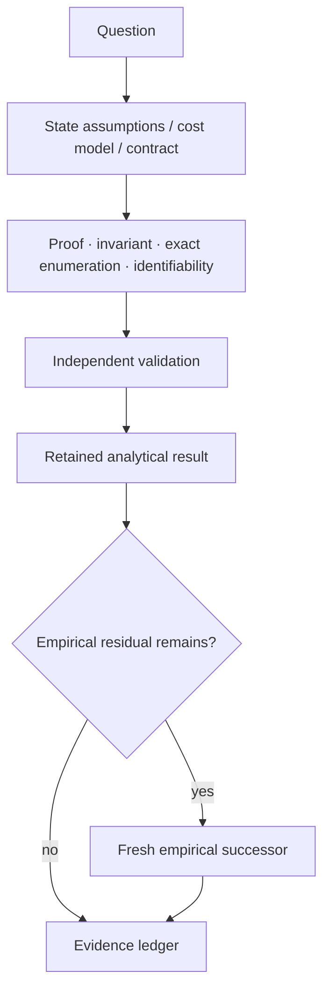

# Analytical research

This directory contains retained analytical studies: proofs, exact finite-state or exhaustive results, break-even derivations, and identifiability analyses.

Analytical results remain scoped to their stated assumptions. When a claim depends on a real OS, application, model, scheduler, latency distribution, or workload, that residual still requires empirical measurement.

See [`../../docs/RESEARCH_METHOD.md`](../../docs/RESEARCH_METHOD.md) for the analysis-versus-experiment decision flow.

## Analysis lifecycle


```mermaid
flowchart TD
    Q[Question] --> M[State assumptions / cost model / contract]
    M --> A[Proof · invariant · exact enumeration · identifiability]
    A --> V[Independent validation]
    V --> R[Retained analytical result]
    R --> E{Empirical residual remains?}
    E -->|no| L[Evidence ledger]
    E -->|yes| X[Fresh empirical successor]
    X --> L
```

## Analysis families


```mermaid
flowchart TD
    A[research/analysis]
    A --> COST[Decision / cost frontier]
    A --> REUSE[Reuse / lifetime contracts]
    A --> CONC[Concurrency / serializability]
    A --> OBS[Observation / temporal contracts]
    A --> REPLAY[Replay / provenance]
    A --> IDENT[Identifiability / retained-evidence audit]

    COST --> G[guard break-even]
    COST --> S[scheduler feasibility + RUN/WAIT]
    COST --> D[typed decision lattice]
    COST --> M[multi-cursor reposition]

    REUSE --> R[dependency-version reuse]
    REUSE --> L[layered lifetimes]
    REUSE --> DAG[partial DAG recomputation]
    REUSE --> H[fresh target-handle retention]
    REUSE --> RA[register-state dynamic identity]

    CONC --> RW[optimistic read/write commit]
    CONC --> FP[phase-overlap resource footprints]
    CONC --> DYN[dynamic footprint binding]
    CONC --> XT[XTerm footprint transfer]
    CONC --> BR[typed dynamic branch read-set]
    CONC --> AR[typed alias resolution]
    CONC --> QD[typed query dependency]
    CONC --> QA[query-version writer atomicity]
    CONC --> PL[consistency product lattice]
    CONC --> ML[mediated typed dependency ledger]
    CONC --> XA[retained optimistic-X11 successor audit]

    OBS --> RC[relevance completeness]
    OBS --> TM[temporal monitor semantics]
    OBS --> TMA[temporal monitor accounting successor]
    OBS --> TMC[temporal monitor A3]

    REPLAY --> DR[deterministic boundary replay]
    REPLAY --> ES[event-sourced projection / checkpoint]

    IDENT --> GC[guard calibration]
    IDENT --> EC[evidence-compute calibration]
    IDENT --> TS[temporal cost]
    IDENT --> TB[retained temporal break-even]
    IDENT --> MA[multi-app transition audit]
```

These family nodes are representative navigation aids, not an exhaustive taxonomy or scientific ranking. The generated directory index below is the completeness surface; each study's own report remains authoritative, including retained FAIL/HOLD outcomes.

## Curated analytical result guide

The table below summarizes major analytical chains and representative retained outcomes. It is intentionally explanatory rather than the completeness mechanism; the generated directory index below is exhaustive.

<details>
<summary><strong>Expand curated analytical results and failures</strong></summary>

| Family | Study | Retained result | Residual empirical or successor question |
|---|---|---|---|
| Recovery / coordination | [`obligation_conservation_5817_t0_v1/`](obligation_conservation_5817_t0_v1/) | Issue #5817 finite T0 `PASS_METHOD_SCOPED`: 11 histories / 14 obligation IDs; transfer and timeout preserve unresolved work, dependent/unknown tasks HOLD, independent read-only work proceeds; allocation-01 gate STOP retained. | Validate complete effect/footprint sources and crash-durable ledger semantics in an authorized live fixture before any runtime claim. |
| Verification / evidence | [`dependency_aware_verifier_quorum_5314_v1/`](dependency_aware_verifier_quorum_5314_v1/) | Exact finite comparison shows raw counting admits more false decisions than domain-deduplicated admission under complete synthetic dependency labels, with substantial abstention; labels are not empirically attestable here. | Validate dependency provenance, overlapping domains, and outage/cost behavior in an authorized held-out successor. |
| Decision / cost | [`guard_policy_break_even_r0_v1/`](guard_policy_break_even_r0_v1/) | Exact one-step selector for pre-guard versus postcondition-only under one commensurate recoverable-route cost model. | Measure real stale probabilities and guard/yield/failure costs in one declared population. |
| Decision / cost | [`evidence_dependent_compute_scheduler_dominance_r0_v1/`](evidence_dependent_compute_scheduler_dominance_r0_v1/) | Stale dependencies or missed hard deadlines make RUN infeasible; current metadata alone cannot universally choose RUN versus WAIT in the feasible region. | Measure invalidation likelihood, utility, contention, partial value, and production scheduler behavior. |
| Decision / cost | [`evidence_compute_run_wait_break_even_r1_v1/`](evidence_compute_run_wait_break_even_r1_v1/) | After the hard feasibility gate, the one-horizon RUN/WAIT threshold depends on invalidation probability and the declared stable-wait versus obsolete-compute losses. | Calibrate those inputs for one concrete job class; correlated invalidation, preemption, partial reuse, and contention remain open. |
| Decision / cost | [`evidence_compute_decision_lattice_r2_v1/`](evidence_compute_decision_lattice_r2_v1/) | Semantic reuse validity, temporal feasibility, and expected-cost selection compose as ordered gates without softer optimization overriding hard invalidation/deadline gates. | Calibrate parameters, rebuild economics, multi-job/resource scheduling, and partial/preemptive work. |
| Decision / cost | [`multicursor_parking_reposition_r0_v1/`](multicursor_parking_reposition_r0_v1/) | Under a serialized physical-pointer endpoint-cost model, logical parked cursors alone do not reduce physical reposition distance; a distinct cheap relocation primitive can. | Measure real relocation cost, hover/path equivalence, semantic re-grounding savings, and live correctness. |
| Reuse / lifetime | [`evidence_dependent_compute_reuse_r0_v1/`](evidence_dependent_compute_reuse_r0_v1/) | For deterministic pure jobs with complete declared dependencies and non-reused semantic version identities, exact dependency-version equality is sufficient for reuse and necessary for universal safety across arbitrary jobs. | Defend against incomplete declarations, ABA/version reuse, nondeterminism, clocks/external state, side effects, and measure performance. |
| Reuse / lifetime | [`layered_lifetime_admission_r0_v1/`](layered_lifetime_admission_r0_v1/) | Admission matches the oracle when reusable tokens bind every declared independently changing lifetime identity; global or route-only epochs lose narrowness or completeness in the frozen model. | Measure natural invalidation rates, runtime overhead, task correctness, model boundaries, and production ABI. |
| Reuse / lifetime | [`evidence_compute_partial_dag_reuse_r3_v1/`](evidence_compute_partial_dag_reuse_r3_v1/) | For pure compute DAGs under the declared assumptions, the minimal universally safe recomputation set is exactly the forward-reachable compute descendants of changed evidence. | Instrument one real pipeline as a declared DAG and measure partial versus whole-pipeline invalidation without hidden dependencies. |
| Reuse / lifetime | [`multicursor_target_handle_regrounding_r0_v1/`](multicursor_target_handle_regrounding_r0_v1/) | Multiple fresh semantic target handles reduce re-grounding only for non-consecutive same-epoch revisits when retention capacity is sufficient. | Measure grounding cost, validation/cache-management cost, model boundaries/tokens, geometry/currentness behavior, and live GUI correctness. |
| Reuse / lifetime | [`register_automaton_dynamic_identity_r0_v1/`](register_automaton_dynamic_identity_r0_v1/) | `PASS_REGISTER_AUTOMATON_IDENTITY_SCOPED`: exact generation-scoped target validity requires retaining both dynamic identity dimensions (or an equivalent typed tuple); a literal no-register FSM needs `|G|*|T|+1` states in the frozen equality model. | Test richer relations such as version order/aliasing and then transfer the representation to real GUI/API identity without claiming total memory or latency savings. |
| Responsibility transfer | [`adjustable_autonomy_handoff_5324_t0_v1/`](adjustable_autonomy_handoff_5324_t0_v1/) | `PASS_HANDOFF_BOUNDARIES_SCOPED` under the frozen finite-model rule: two-/three-phase policies had 0 duplicate-owner ticks, but more modeled no-owner ticks than ACK-only (26 vs 12), exposing a safety/liveness trade-off rather than one policy winner. | Real actor acceptance/quiescence, fallback latency, human attention, backend authority and task effects remain unmeasured. |
| Concurrency / serializability | [`optimistic_concurrent_readwrite_commit_r0_v1/`](optimistic_concurrent_readwrite_commit_r0_v1/) | With complete read/write sets, current versions, linearized final validation/effect, and no separate commutativity certificate, parallel admission is safe only without stale-read, cross read/write, or write/write hazards. | Bind the criterion to real typed receipts, measure natural conflicts/overhead, and retain a shared-global negative control. |
| Concurrency / serializability | [`phase_overlap_resource_footprint_r0_v1/`](phase_overlap_resource_footprint_r0_v1/) | Retained `FAIL_SOURCE_MATERIALIZATION`: the first frozen invocation stopped before enumeration because the executed local analyzer did not match the frozen Git source identity; no scientific rows were produced. | Preserve as an integrity failure; the scientific question proceeds only through a fresh successor with corrected source materialization. |
| Concurrency / serializability | [`phase_overlap_resource_footprint_a2_v1/`](phase_overlap_resource_footprint_a2_v1/) | Fresh source-exact successor retains zero mismatch for complete declared footprints and fail-closed serialization for UNKNOWN; surface-only and omitted-dependency controls are unsafe. | Determine whether real applications expose complete/static enough resource footprints and transfer to real overlap cases. |
| Concurrency / serializability | [`phase_overlap_resource_footprint_r0_v2/`](phase_overlap_resource_footprint_r0_v2/) | After repairing only source materialization from the retained failed predecessor, the deterministic footprint serializability contract passes its bounded model and corruption controls. | Test hidden/dynamic resources and real application overlap; no timing or runtime-promotion claim follows. |
| Concurrency / serializability | [`phase_overlap_dynamic_footprint_binding_r1_v1/`](phase_overlap_dynamic_footprint_binding_r1_v1/) | A runtime-resolved narrow footprint can recover concurrency relative to a static superset in the frozen model only when the selector state that chose the footprint remains a declared read/currentness dependency. | Test aliasing, hidden globals, external mutation, multi-resource data-dependent access, and revalidation cost in real systems. |
| Concurrency / serializability | [`xterm_resource_footprint_transfer_v1/`](xterm_resource_footprint_transfer_v1/) | Retained `FAIL_INTEGRITY`: the first frozen execution detected a local Git-blob mismatch; later local candidate outputs are invalid and are not scientific evidence. | Preserve the integrity failure; only a fresh successor may change materialization/execution plumbing. |
| Concurrency / serializability | [`xterm_resource_footprint_transfer_v2/`](xterm_resource_footprint_transfer_v2/) | `HOLD_ENVIRONMENT`: the planned exact-Git materialization stopped before any scientific invocation because the disposable container could not resolve GitHub; the resource-footprint hypothesis was not decided. | A successor may change only source transport while preserving frozen scientific sources/gates. |
| Concurrency / serializability | [`xterm_resource_footprint_transfer_v3/`](xterm_resource_footprint_transfer_v3/) | `PASS_RESOURCE_FOOTPRINT_XTERM_TRANSFER_SCOPED`: exact frozen sources were materialized and the footprint classifier distinguishes the retained independent XTerm pair from the shared-file conflict, while UNKNOWN serializes. | Footprints are still manually declared; automatic/conservative dependency acquisition and broader live transfer remain open. |
| Concurrency / serializability | [`typed_dynamic_branch_readset_v1/`](typed_dynamic_branch_readset_v1/) | Path-specific typed tracing of the control predicate plus executed branch resource reaches zero unsafe acceptances and zero false invalidations in the frozen branch model; omitting the predicate is structurally unsafe. | Extend to alias resolution, collection/query phantom handling, writer-maintenance atomicity, and automatic tracing in real runtimes. |
| Concurrency / serializability | [`typed_resolve_dependency_v1/`](typed_resolve_dependency_v1/) | Exact alias-resolution tracking requires both the alias mapping version and the selected concrete object version; either alone permits stale acceptance, while tracking all possible targets is safe but over-invalidating. | Extend to membership/query phantoms, multi-hop resolution/cycles, and atomic maintenance of query/membership versions. |
| Concurrency / serializability | [`typed_query_dependency_v1/`](typed_query_dependency_v1/) | Query/membership version plus current-member value/version reads are required in the frozen collection model; member-only misses insertion/removal phantoms and query-only misses member-value mutation. | Writer-side atomic maintenance of membership and query version, then real trace collection without hidden reads. |
| Concurrency / serializability | [`query_version_writer_atomicity_v1/`](query_version_writer_atomicity_v1/) | Reader-side query receipts are trustworthy only when membership mutation and query-version publication share an atomic boundary; membership-first/no-version are unsafe and version-first is conservative. | Integrate the completed READ → RESOLVE → QUERY → writer-atomicity ladder into one bounded real execution substrate. |
| Concurrency / serializability | [`interaction_consistency_product_lattice_r0_v1/`](interaction_consistency_product_lattice_r0_v1/) | Surface separation, read-set validity, actuator independence, hidden/global conflict freedom, and tail commutativity form structured dimensions; surface-only and readset-only predicates are incomparable, so one monotone scalar safety level is unjustified in the frozen model. | Real-backend transfer, automatic dependency completeness, natural hazard rates, and production contract implementation. |
| Concurrency / serializability | [`mediated_typed_dependency_ledger_v1/`](mediated_typed_dependency_ledger_v1/) | `PASS_MEDIATED_TYPED_DEPENDENCY_LEDGER_SCOPED`: one AF_UNIX owner/mediator composes the retained READ, RESOLVE, QUERY and writer-atomicity primitives into typed receipts with zero ledger mismatch, unsafe validation acceptance, or false invalidation across the frozen scientific cases. | Arbitrary-code bypass prevention, automatic GUI dependency discovery, production ABI adoption, performance, and cross-platform transfer remain separate. |
| Concurrency / serializability | [`optimistic_readwrite_x11_retained_audit_a3_v1/`](optimistic_readwrite_x11_retained_audit_a3_v1/) | `PASS_RETAINED_OPTIMISTIC_X11_AUDIT_A3_SCOPED`: a source-frozen successor audit independently validates the exact retained #1750 raw rows while preserving the parent `FAIL_INTEGRITY_AUDIT_GATE_COUNT` and the #1795 workflow stop unchanged. | Cite only as retained parent raw validated by successor audit; XTEST routing, app semantics, dependency completeness, speed/tokens, and production scheduling remain open. |
| Observation / temporal contract | [`observation_relevance_completeness_v1/`](observation_relevance_completeness_v1/) | Currentness of a relevance declaration does not imply completeness; nontrivial suppression outside the declared set needs trusted completeness provenance or a by-construction guarantee. | Establish completeness provenance/accuracy in real relevance generation and then measure GUI/model/token effects. |
| Observation / temporal contract | [`mixed_criticality_temporal_feasibility_5557_t15_transport_v1/`](mixed_criticality_temporal_feasibility_5557_t15_transport_v1/) | T15-03 `PASS_TEMPORAL_SERVICE_CONTRACT_SCOPED`: the finite four-tick model exposes four capacity-2 traces that are aggregate-feasible but temporally UNSAT, while preserving the LO minimum on the declared capacity-3 controls. | Replace hand-authored arrivals/service with a measured workload, establish observation utility/freshness and production scheduler behavior; no general schedulability or product-benefit claim. |
| Observation / temporal contract | [`temporal_contract_monitor_compilation_r0_v1/`](temporal_contract_monitor_compilation_r0_v1/) | Retained `FAIL_INTEGRITY_ORACLE_SAME_TIMESTAMP_P_TRANSITION`: the first allocation exposes a correlated oracle defect for same-timestamp predicate transitions; the semantic theorem is not decided. | A fresh successor may change only the reference semantics to preserve same-timestamp Boolean transitions in arrival order. |
| Observation / temporal contract | [`temporal_contract_monitor_compilation_a2_v1/`](temporal_contract_monitor_compilation_a2_v1/) | Retained `FAIL_INTEGRITY_PARENT_PREFIX_ACCOUNTING`: candidate/reference mismatches are zero after the oracle repair, but the consumed allocation used a failure-truncated parent prefix count as a corpus gate. | A3 may change only the accounting gate to the independently derived complete prefix count while preserving the A2 semantics/generator. |
| Observation / temporal contract | [`temporal_contract_monitor_compilation_a3_v1/`](temporal_contract_monitor_compilation_a3_v1/) | `PASS_TEMPORAL_CONTRACT_MONITOR_COMPILATION_A3_SCOPED`: with the accounting gate corrected, four representative one-shot temporal contracts compile to constant-memory deterministic monitors with zero primary/independent mismatch over the full frozen corpus. | Transfer one monitor family to a private live event stream with explicit clock/evidence provenance and no authority escalation. |
| Replay / provenance | [`deterministic_replay_boundary_r0_v1/`](deterministic_replay_boundary_r0_v1/) | In the frozen deterministic reducer model, initial-state identity plus a complete strictly ordered typed record of every external boundary event is sufficient for exact replay/fork replay; omitting order or named event classes creates non-identifiability. | Identify and capture every real nondeterministic/external boundary, then replay retained execution without reinvoking the external dependency. |
| Replay / provenance | [`event_sourced_projection_r0_v1/`](event_sourced_projection_r0_v1/) | For the frozen deterministic reducer, full fold, exactly-once incremental projection, and a trusted checkpoint bound to exact prefix identity/state produce equivalent state; weaker index-only/orderless/missing-event schemes have retained divergent witnesses. | Transfer checkpoint+suffix replay to a retained real event ledger while separately proving external-boundary completeness/authenticity assumptions. |
| Identifiability / audit | [`guard_policy_calibration_identifiability_r1_v1/`](guard_policy_calibration_identifiability_r1_v1/) | Existing retained route families do not identify all guard-selector parameters in one same-population commensurate cost model. | Measure stale incidence and reject/recovery/failure costs on one explicitly recoverable route. |
| Identifiability / audit | [`evidence_compute_calibration_identifiability_r3_v1/`](evidence_compute_calibration_identifiability_r3_v1/) | Seven retained evidence families provide zero fully calibratable same-population job class for the compute decision lattice; cross-family substitution is invalid. | Prospectively measure invalidation probability, WAIT/RUN losses, reuse rate, version cost, and job identity in one declared population. |
| Identifiability / audit | [`temporal_sample_cost_identifiability_v1/`](temporal_sample_cost_identifiability_v1/) | Source sample-count reduction alone does not identify token, wall-time, or monetary break-even; measured `F/Q/H` endpoints are required. | Run fresh matched provider/model measurements with presentation/session/cache identity. |
| Identifiability / audit | [`temporal_break_even_retained_identifiability_v1/`](temporal_break_even_retained_identifiability_v1/) | Existing retained temporal evidence contains zero admissible fully matched rows for the required empirical break-even estimate. | Run a source-matched allocation retaining `F_m`, `Q_m`, `H_m`, identity, and correctness endpoints. |
| Identifiability / audit | [`multi_app_transition_retained_audit_r0_v1/`](multi_app_transition_retained_audit_r0_v1/) | Retained evidence covers focus drift, modal, geometry drift, and window replacement across components/apps, but no single session integrates all four under one contract. | Run a finite multi-app integrated allocation preserving one caller/controller identity across the transition families. |

| Locale / semantic invariance | [`locale_semantic_invariance_5919_t0_20261001/`](locale_semantic_invariance_5919_t0_20261001/) | Two benign synthetic locale pairs pass; five injected faults are rejected and an ambiguous pair is UNKNOWN. H_PASS_SCOPED only; visual proxy is fixture metadata. | Evaluate locale-conditioned semantic effects on independently adjudicated real or high-fidelity traces before generalizing. |
| Audit / provenance | [`locale_semantic_invariance_5919_audit_review_20261001_01/`](locale_semantic_invariance_5919_audit_review_20261001_01/) | Post-merge raw-only audit confirms the eight T0 outcomes and rejects three actual corrupted copies plus duplicate/missing/extra rows; no candidate rerun. Original visual proxy remains fixture metadata. | Obtain independently adjudicated high-fidelity locale traces before extending the method claim. |
| Route selection / topology | [`route_selector_5911_t0_20261001_02/`](route_selector_5911_t0_20261001_02/) | Five finite synthetic cases and an independent enumerator pass the explicit minimum-cost route/tie contract; scope is method-only. | Test selector semantics on real source traces before making any live routing or causal claim. |

</details>

## Historical source and construction archives

- [Recovery-rate T0 source and reported host failure: #5776 / source PR #5788](recovery_rate_5776_t0_v1/ARCHIVAL_QUALIFICATION.md) — five exact source/plan files; reported host FAIL_METHOD and Docker STOP retained. No committed raw/result bundle or new replay; distinct from merged #5792/#5859 allocations. Owner #5776 and source Draft #5788 remain open.
- [Predictive safety-filter T0 host evidence and withdrawn container rung: #5317 / source PR #5336](predictive_safety_filter_5317_v1/ARCHIVAL_QUALIFICATION.md) — six exact files including the 35-cell host raw; reported scoped host PASS and later STOP/HOLD withdrawal retained, with zero container invocations. Distinct from merged T3 #5505; no new replay or runtime-safety claim. Owner #5317 and source Draft #5336 remain open.

## Complete retained result directory index

This compact list is generated from child directories that contain `REPORT.md` or `FORMAL_FAILURE.md`. It is the completeness surface used by the index checker.

<!-- BEGIN GENERATED ANALYSIS RESULT INDEX -->

<details>
<summary><strong>Expand all retained result/failure directories</strong></summary>

- [`action_class_error_budget_5424_t2_v1/`](action_class_error_budget_5424_t2_v1/)
- [`action_class_error_budget_5424_t3_v1/`](action_class_error_budget_5424_t3_v1/)
- [`action_conditioned_routing_repair_successor_2059_r2_v1/`](action_conditioned_routing_repair_successor_2059_r2_v1/)
- [`action_conditioned_routing_repair_successor_2059_v1/`](action_conditioned_routing_repair_successor_2059_v1/)
- [`action_conditioned_routing_successor_1934_r2/`](action_conditioned_routing_successor_1934_r2/)
- [`action_conditioned_routing_successor_1934_v1/`](action_conditioned_routing_successor_1934_v1/)
- [`active_automata_learning_5385_t0_v1/`](active_automata_learning_5385_t0_v1/)
- [`adaptive_privacy_filter_5420_t1_v1/`](adaptive_privacy_filter_5420_t1_v1/)
- [`adaptive_screen_5739_t0_v1/`](adaptive_screen_5739_t0_v1/)
- [`affine_clock_delivery_c6t9_t7k3_v1/`](affine_clock_delivery_c6t9_t7k3_v1/)
- [`affine_receipt_5508_t12/`](affine_receipt_5508_t12/)
- [`affine_receipt_5508_t13/`](affine_receipt_5508_t13/)
- [`affine_receipt_5508_t14/`](affine_receipt_5508_t14/)
- [`affine_receipt_5508_t15/`](affine_receipt_5508_t15/)
- [`alert_actionability_5435_t4/`](alert_actionability_5435_t4/)
- [`altgr_preflight_contract_successor_2171_v1/`](altgr_preflight_contract_successor_2171_v1/)
- [`anytime_fidelity_typed_admission_r0_v1/`](anytime_fidelity_typed_admission_r0_v1/)
- [`anytime_t5/`](anytime_t5/)
- [`aoii_observation_freshness_43_t0_v1/`](aoii_observation_freshness_43_t0_v1/)
- [`arena_v1_cv_grounding_rescue_4695_v1/`](arena_v1_cv_grounding_rescue_4695_v1/)
- [`arena_v1_cv_grounding_rescue_4695_v2/`](arena_v1_cv_grounding_rescue_4695_v2/)
- [`assay_sensitivity_5850_t0_v1/`](assay_sensitivity_5850_t0_v1/)
- [`assistive_cue_noninterference_5800_t0_v1/`](assistive_cue_noninterference_5800_t0_v1/)
- [`attention_budgeting_successor_1940_v1/`](attention_budgeting_successor_1940_v1/)
- [`attention_cue_provenance_diagnostic_2755_v1/`](attention_cue_provenance_diagnostic_2755_v1/)
- [`attention_provenance_successor_1936_v1/`](attention_provenance_successor_1936_v1/)
- [`attention_provenance_value_repair_successor_2039_v1/`](attention_provenance_value_repair_successor_2039_v1/)
- [`auditor_completion_5895_t0_20261001_01/`](auditor_completion_5895_t0_20261001_01/)
- [`auditor_completion_5895_t6_20261001_8d0c7f53_amd64/`](auditor_completion_5895_t6_20261001_8d0c7f53_amd64/)
- [`belief_auto_recommit_semantic_boundary_r3_v1/`](belief_auto_recommit_semantic_boundary_r3_v1/)
- [`belief_recommit_epoch_aba_r2_v1/`](belief_recommit_epoch_aba_r2_v1/)
- [`belief_repair_decision_lattice_r4_v1/`](belief_repair_decision_lattice_r4_v1/)
- [`belief_stream_scheduling_6097_t0_20261001/`](belief_stream_scheduling_6097_t0_20261001/)
- [`blackstart_allwindow_trace_5970_t6_20261002/`](blackstart_allwindow_trace_5970_t6_20261002/)
- [`blackstart_causal_cut_5970_t0_20261001/`](blackstart_causal_cut_5970_t0_20261001/)
- [`blackstart_causal_cut_5970_t1_20261001/`](blackstart_causal_cut_5970_t1_20261001/)
- [`blackstart_nonmodifier_trace_5970_t11_20261002/`](blackstart_nonmodifier_trace_5970_t11_20261002/)
- [`blackstart_prospective_trace_5970_t2_20261001/`](blackstart_prospective_trace_5970_t2_20261001/)
- [`blackstart_record_target_ancestor_5970_t8_20261002/`](blackstart_record_target_ancestor_5970_t8_20261002/)
- [`blackstart_record_target_liveness_5970_t7_20261002/`](blackstart_record_target_liveness_5970_t7_20261002/)
- [`blackstart_source_bound_5970_t3_20261001/`](blackstart_source_bound_5970_t3_20261001/)
- [`blackstart_tk_parent_only_5970_t10_20261002/`](blackstart_tk_parent_only_5970_t10_20261002/)
- [`blackstart_tk_parent_window_5970_t9_20261002/`](blackstart_tk_parent_window_5970_t9_20261002/)
- [`blackstart_x11_noinput_baseline_5970_t12_20261002/`](blackstart_x11_noinput_baseline_5970_t12_20261002/)
- [`blackstart_xevent_target_5970_t5_20261002/`](blackstart_xevent_target_5970_t5_20261002/)
- [`blackstart_xrecord_5970_t4_20261001/`](blackstart_xrecord_5970_t4_20261001/)
- [`boundary_margin_5707_policy_pair_v1/`](boundary_margin_5707_policy_pair_v1/)
- [`boundary_margin_5707_t0_v1/`](boundary_margin_5707_t0_v1/)
- [`boundary_margin_5707_typed_v1/`](boundary_margin_5707_typed_v1/)
- [`bounded_skew_context_join_successor_1218_v1/`](bounded_skew_context_join_successor_1218_v1/)
- [`bounded_voi_scheduler_4263_v1/`](bounded_voi_scheduler_4263_v1/)
- [`breakdown_t7/`](breakdown_t7/)
- [`cache_epoch_completeness_2928_v1/`](cache_epoch_completeness_2928_v1/)
- [`cache_epoch_monitor_execution_2928_v1/`](cache_epoch_monitor_execution_2928_v1/)
- [`cache_partial_effect_replay_boundary_2928_v1/`](cache_partial_effect_replay_boundary_2928_v1/)
- [`cache_session_binding_caller_2928_v1/`](cache_session_binding_caller_2928_v1/)
- [`caller_two_tier_stage_dominance_v1/`](caller_two_tier_stage_dominance_v1/)
- [`capability_snapshot_currentness_fallback_r0_v1/`](capability_snapshot_currentness_fallback_r0_v1/)
- [`causal_attribution_5323_t0_v1/`](causal_attribution_5323_t0_v1/)
- [`causal_critical_path_elasticity_5851_t0_v1/`](causal_critical_path_elasticity_5851_t0_v1/)
- [`causal_temporal_attention_successor_1941_v1/`](causal_temporal_attention_successor_1941_v1/)
- [`causal_temporal_history_2026_v1/`](causal_temporal_history_2026_v1/)
- [`cegis_grammar_gap_4294_v1/`](cegis_grammar_gap_4294_v1/)
- [`cegis_skill_4262_v1/`](cegis_skill_4262_v1/)
- [`censored_useful_effect_integrity_2514_v1/`](censored_useful_effect_integrity_2514_v1/)
- [`censored_useful_effect_membership_successor_1838_v1/`](censored_useful_effect_membership_successor_1838_v1/)
- [`change_cue_contrast_1931_v1/`](change_cue_contrast_1931_v1/)
- [`claim_ladder_6113_t0_20261002/`](claim_ladder_6113_t0_20261002/)
- [`cli_v1_lineage_direct_tests_2428_v1/`](cli_v1_lineage_direct_tests_2428_v1/)
- [`competence_location_map_3446_v1/`](competence_location_map_3446_v1/)
- [`complementarity_marginal_evidence_5869_t0_v1/`](complementarity_marginal_evidence_5869_t0_v1/)
- [`composition_heldout_fixture_2068_v1/`](composition_heldout_fixture_2068_v1/)
- [`conditional_deadline_certificate_6059_t0_20261001/`](conditional_deadline_certificate_6059_t0_20261001/)
- [`conditional_route_rescue_5598_t0_20261001/`](conditional_route_rescue_5598_t0_20261001/)
- [`conflict_aware_evidence_ledger_5305_t0/`](conflict_aware_evidence_ledger_5305_t0/)
- [`conformal_verifier_risk_contract_5315_v1/`](conformal_verifier_risk_contract_5315_v1/)
- [`consent_scoped_preparation_5793_t0_v1/`](consent_scoped_preparation_5793_t0_v1/)
- [`constrained_interaction_testing_5330_t0_v1/`](constrained_interaction_testing_5330_t0_v1/)
- [`cost_predicate_order_4258_v1/`](cost_predicate_order_4258_v1/)
- [`danger_context_triage_5764_t0_v1/`](danger_context_triage_5764_t0_v1/)
- [`deadline_identity_5265_dot/`](deadline_identity_5265_dot/)
- [`decision_opportunity_audit_5986_t0_20261002/`](decision_opportunity_audit_5986_t0_20261002/)
- [`decision_sufficiency_5329_v1/`](decision_sufficiency_5329_v1/)
- [`dependency_aware_verifier_quorum_5314_v1/`](dependency_aware_verifier_quorum_5314_v1/)
- [`desktop_lifecycle_rebind_3190_host_preflight_v1/`](desktop_lifecycle_rebind_3190_host_preflight_v1/)
- [`deterministic_replay_boundary_r0_v1/`](deterministic_replay_boundary_r0_v1/)
- [`disturbance_response_5771_t1_v3/`](disturbance_response_5771_t1_v3/)
- [`effect_path_antiwindup_5791_eligibility_v1/`](effect_path_antiwindup_5791_eligibility_v1/)
- [`effect_path_antiwindup_5791_resume_boundary_v1/`](effect_path_antiwindup_5791_resume_boundary_v1/)
- [`effect_path_antiwindup_5791_t0_v1/`](effect_path_antiwindup_5791_t0_v1/)
- [`effect_path_antiwindup_5791_t0_v2/`](effect_path_antiwindup_5791_t0_v2/)
- [`effect_time_contract_authorization_successor_532_v1/`](effect_time_contract_authorization_successor_532_v1/)
- [`endogenous_demand_rebound_5702_t0_v1/`](endogenous_demand_rebound_5702_t0_v1/)
- [`entrypoint_argv_preflight_5156_v2_20261001/`](entrypoint_argv_preflight_5156_v2_20261001/)
- [`epistemic_commit_5441_t4/`](epistemic_commit_5441_t4/)
- [`escrow_optional_budget_6156_t0_20261002/`](escrow_optional_budget_6156_t0_20261002/)
- [`event_sourced_projection_r0_v1/`](event_sourced_projection_r0_v1/)
- [`evidence_compute_calibration_identifiability_r3_v1/`](evidence_compute_calibration_identifiability_r3_v1/)
- [`evidence_compute_decision_lattice_r2_v1/`](evidence_compute_decision_lattice_r2_v1/)
- [`evidence_compute_partial_dag_reuse_r3_v1/`](evidence_compute_partial_dag_reuse_r3_v1/)
- [`evidence_compute_run_wait_break_even_r1_v1/`](evidence_compute_run_wait_break_even_r1_v1/)
- [`evidence_compute_x11_png_calibration_uncertainty_r7_v1/`](evidence_compute_x11_png_calibration_uncertainty_r7_v1/)
- [`evidence_dependent_compute_reuse_r0_v1/`](evidence_dependent_compute_reuse_r0_v1/)
- [`evidence_dependent_compute_scheduler_dominance_r0_v1/`](evidence_dependent_compute_scheduler_dominance_r0_v1/)
- [`exception_envelope_6021_t0_20261002/`](exception_envelope_6021_t0_20261002/)
- [`exogenous_opportunity_5694_t0_20261001/`](exogenous_opportunity_5694_t0_20261001/)
- [`explanation_dependence_5916_t0_v1/`](explanation_dependence_5916_t0_v1/)
- [`feasible_attribution_6100_t0_20261001/`](feasible_attribution_6100_t0_20261001/)
- [`focused_observation_request_successor_1935_v1/`](focused_observation_request_successor_1935_v1/)
- [`full_golden_ipc_2813_v4/`](full_golden_ipc_2813_v4/)
- [`full_golden_ipc_2813_v5/`](full_golden_ipc_2813_v5/)
- [`generation_bound_container_revalidation_2166_v1/`](generation_bound_container_revalidation_2166_v1/)
- [`generation_bound_evidence_2047_v1/`](generation_bound_evidence_2047_v1/)
- [`gluing_approx_irreversible_5537_t10_v1/`](gluing_approx_irreversible_5537_t10_v1/)
- [`gluing_approx_irreversible_5537_t9_v1/`](gluing_approx_irreversible_5537_t9_v1/)
- [`gluing_numeric_schema_5537_t12_v1/`](gluing_numeric_schema_5537_t12_v1/)
- [`gluing_parity_cycle_5537_t4_v1/`](gluing_parity_cycle_5537_t4_v1/)
- [`gpu_grounding_template_diversity_2912_issue4567_successor02/`](gpu_grounding_template_diversity_2912_issue4567_successor02/)
- [`gpu_grounding_template_diversity_2912_v1/`](gpu_grounding_template_diversity_2912_v1/)
- [`gpu_grounding_template_diversity_2912_v2/`](gpu_grounding_template_diversity_2912_v2/)
- [`gpu_grounding_template_diversity_4561_cpu_gate_v1/`](gpu_grounding_template_diversity_4561_cpu_gate_v1/)
- [`gpu_supervisor_compose_4972_cuda_v1/`](gpu_supervisor_compose_4972_cuda_v1/)
- [`guard_induced_proposal_risk_6143_t0_20261002/`](guard_induced_proposal_risk_6143_t0_20261002/)
- [`guard_policy_break_even_r0_v1/`](guard_policy_break_even_r0_v1/)
- [`guard_policy_calibration_identifiability_r1_v1/`](guard_policy_calibration_identifiability_r1_v1/)
- [`guard_stale_cost_2494_v1/`](guard_stale_cost_2494_v1/)
- [`hard_boundary_equivalence_6109_t0_20261001/`](hard_boundary_equivalence_6109_t0_20261001/)
- [`hazard_discretionary_capture_6086_t0_v1/`](hazard_discretionary_capture_6086_t0_v1/)
- [`hedged_evidence_start_4277_v1/`](hedged_evidence_start_4277_v1/)
- [`hidden_cause_sensitivity_5440_t2/`](hidden_cause_sensitivity_5440_t2/)
- [`iconfluence_5547_t0_v1/`](iconfluence_5547_t0_v1/)
- [`incremental_focus_fold_z7r2_v1/`](incremental_focus_fold_z7r2_v1/)
- [`independent_effect_evidence_successor_1295_v1/`](independent_effect_evidence_successor_1295_v1/)
- [`integrated_decision_scope_57_t0_v1/`](integrated_decision_scope_57_t0_v1/)
- [`interaction_consistency_product_lattice_r0_v1/`](interaction_consistency_product_lattice_r0_v1/)
- [`interface_mutation_adequacy_5541_t0_20261001_v1/`](interface_mutation_adequacy_5541_t0_20261001_v1/)
- [`interrupt_stack_resume_contract_v1/`](interrupt_stack_resume_contract_v1/)
- [`interval_robustness_6074_t0_20261002/`](interval_robustness_6074_t0_20261002/)
- [`ioco_5518_t7_tick_bound/`](ioco_5518_t7_tick_bound/)
- [`issue3152_broker_path_confinement_20260927_v1/`](issue3152_broker_path_confinement_20260927_v1/)
- [`issue5541_mutation_t5_20260930/`](issue5541_mutation_t5_20260930/)
- [`issue5760_assignment_exposure_t0_20261001/`](issue5760_assignment_exposure_t0_20261001/)
- [`issue_3655_committed_evidence_audit_v1/`](issue_3655_committed_evidence_audit_v1/)
- [`issue_5504_cegar_t0_v1/`](issue_5504_cegar_t0_v1/)
- [`justification_bound_action_safe_r1_v1/`](justification_bound_action_safe_r1_v1/)
- [`justification_graph_invalidation_r0_v1/`](justification_graph_invalidation_r0_v1/)
- [`justification_graph_truth_maintenance_r0_v1/`](justification_graph_truth_maintenance_r0_v1/)
- [`kernel_receipt_time_5215_audit_successor_20260929/`](kernel_receipt_time_5215_audit_successor_20260929/)
- [`layered_lifetime_admission_r0_v1/`](layered_lifetime_admission_r0_v1/)
- [`live_two_tier_applicability_v1/`](live_two_tier_applicability_v1/)
- [`local_relevance_gating_preflight_2188_v1/`](local_relevance_gating_preflight_2188_v1/)
- [`locale_semantic_invariance_5919_audit_review_20261001_01/`](locale_semantic_invariance_5919_audit_review_20261001_01/)
- [`locale_semantic_invariance_5919_t0_20261001/`](locale_semantic_invariance_5919_t0_20261001/)
- [`looming_yield_5905_audit_recovery_s4/`](looming_yield_5905_audit_recovery_s4/)
- [`looming_yield_5905_t0_20261001_01/`](looming_yield_5905_t0_20261001_01/)
- [`looming_yield_5905_visual_identifiability_v3/`](looming_yield_5905_visual_identifiability_v3/)
- [`map01_crossdomain_time_coverage_59_audit_successor_6169_20261002/`](map01_crossdomain_time_coverage_59_audit_successor_6169_20261002/)
- [`map01_global_owner_invariance_59_t0_20261001/`](map01_global_owner_invariance_59_t0_20261001/)
- [`map01_matched_causal_task_effect_r4_v1/`](map01_matched_causal_task_effect_r4_v1/)
- [`map01_matched_recovery_entry_gate_1866_r5/`](map01_matched_recovery_entry_gate_1866_r5/)
- [`map01_owner_history_59_t1_20261001_01/`](map01_owner_history_59_t1_20261001_01/)
- [`map01_rejected_action_cover_continuation_59_t0_20261001/`](map01_rejected_action_cover_continuation_59_t0_20261001/)
- [`map01_task_effect_cross_record_ledger_a2_v1/`](map01_task_effect_cross_record_ledger_a2_v1/)
- [`map01_useful_occupied_control_identifiability_v1/`](map01_useful_occupied_control_identifiability_v1/)
- [`map01_v12_plan_step_lineage_r0_v1/`](map01_v12_plan_step_lineage_r0_v1/)
- [`map01_v13_source_provenance_audit_59_t1_20261001/`](map01_v13_source_provenance_audit_59_t1_20261001/)
- [`max_permissive_supervisor_5550_successor04_20261001/`](max_permissive_supervisor_5550_successor04_20261001/)
- [`max_permissive_supervisor_5550_t0_20261001/`](max_permissive_supervisor_5550_t0_20261001/)
- [`max_permissive_supervisor_5550_t1_observability_20261001/`](max_permissive_supervisor_5550_t1_observability_20261001/)
- [`mediated_typed_dependency_ledger_v1/`](mediated_typed_dependency_ledger_v1/)
- [`method_selection_fairness_6243_t0_successor02_v1/`](method_selection_fairness_6243_t0_successor02_v1/)
- [`missing_outcome_bounds_5590_docker_t1_20261001/`](missing_outcome_bounds_5590_docker_t1_20261001/)
- [`missing_outcome_bounds_5590_docker_t2_20261001/`](missing_outcome_bounds_5590_docker_t2_20261001/)
- [`mission_survival_5962_t0_20261001/`](mission_survival_5962_t0_20261001/)
- [`mission_survival_5962_t1_eligibility_20261001_02/`](mission_survival_5962_t1_eligibility_20261001_02/)
- [`mixed_criticality_temporal_feasibility_5557_t15_transport_v1/`](mixed_criticality_temporal_feasibility_5557_t15_transport_v1/)
- [`modal_call_return_6102_t0_20261001/`](modal_call_return_6102_t0_20261001/)
- [`model_api_canary_detection_6001_t0_20261001/`](model_api_canary_detection_6001_t0_20261001/)
- [`model_api_canary_interference_6001_t0_20261001/`](model_api_canary_interference_6001_t0_20261001/)
- [`multi_actuator_state_domain_independence_r0_v1/`](multi_actuator_state_domain_independence_r0_v1/)
- [`multi_app_transition_retained_audit_r0_v1/`](multi_app_transition_retained_audit_r0_v1/)
- [`multi_principal_effect_auth_5805_t0_v1/`](multi_principal_effect_auth_5805_t0_v1/)
- [`multicursor_parking_reposition_r0_v1/`](multicursor_parking_reposition_r0_v1/)
- [`multicursor_target_handle_regrounding_r0_v1/`](multicursor_target_handle_regrounding_r0_v1/)
- [`needle_role_skill_lifecycle_4916_first_rung_v2/`](needle_role_skill_lifecycle_4916_first_rung_v2/)
- [`needle_role_skill_lifecycle_4916_parity_diag_v1/`](needle_role_skill_lifecycle_4916_parity_diag_v1/)
- [`needle_role_skill_lifecycle_4916_v2/`](needle_role_skill_lifecycle_4916_v2/)
- [`needle_role_skill_lifecycle_5133_v2/`](needle_role_skill_lifecycle_5133_v2/)
- [`obligation_capacity_6121_t0_successor02_20261002/`](obligation_capacity_6121_t0_successor02_20261002/)
- [`obligation_conservation_5817_t0_v1/`](obligation_conservation_5817_t0_v1/)
- [`observation_bisimulation_branch_readiness_5516_t12/`](observation_bisimulation_branch_readiness_5516_t12/)
- [`observation_manipulate_dynamic_certificate_v1/`](observation_manipulate_dynamic_certificate_v1/)
- [`observation_manipulate_support_union_v1/`](observation_manipulate_support_union_v1/)
- [`observation_o4_x11_verify_schema_readiness_v1/`](observation_o4_x11_verify_schema_readiness_v1/)
- [`observation_relevance_completeness_v1/`](observation_relevance_completeness_v1/)
- [`observation_reveal_support_closure_v1/`](observation_reveal_support_closure_v1/)
- [`occupancy_gate_frontier_1592_v1/`](occupancy_gate_frontier_1592_v1/)
- [`opacity_action_relevance_5360_t1_v1/`](opacity_action_relevance_5360_t1_v1/)
- [`opportunity_conditioned_actuated_info_6045_t0_20261002/`](opportunity_conditioned_actuated_info_6045_t0_20261002/)
- [`optimistic_concurrent_readwrite_commit_r0_v1/`](optimistic_concurrent_readwrite_commit_r0_v1/)
- [`optimistic_readwrite_x11_retained_audit_a3_v1/`](optimistic_readwrite_x11_retained_audit_a3_v1/)
- [`oracle_bracket_5766_t0_v1/`](oracle_bracket_5766_t0_v1/)
- [`owner_keyup_invocation_race_5156_t1_20261001/`](owner_keyup_invocation_race_5156_t1_20261001/)
- [`owner_keyup_invocation_race_5156_t2_20261001/`](owner_keyup_invocation_race_5156_t2_20261001/)
- [`owner_keyup_serializer_5156_t0_20261001_v1/`](owner_keyup_serializer_5156_t0_20261001_v1/)
- [`paired_route_estimator_57_t0_v1/`](paired_route_estimator_57_t0_v1/)
- [`partial_order_replay_4889_v1/`](partial_order_replay_4889_v1/)
- [`pending_outcome_route_learning_6129_t0_20261002/`](pending_outcome_route_learning_6129_t0_20261002/)
- [`phase_overlap_dynamic_footprint_binding_r1_v1/`](phase_overlap_dynamic_footprint_binding_r1_v1/)
- [`phase_overlap_resource_footprint_a2_v1/`](phase_overlap_resource_footprint_a2_v1/)
- [`phase_overlap_resource_footprint_r0_v1/`](phase_overlap_resource_footprint_r0_v1/)
- [`phase_overlap_resource_footprint_r0_v2/`](phase_overlap_resource_footprint_r0_v2/)
- [`planner_hysteresis_5352_t10_20261001/`](planner_hysteresis_5352_t10_20261001/)
- [`portfolio_multiplicity_5890_t0_v2_20261001/`](portfolio_multiplicity_5890_t0_v2_20261001/)
- [`predicate_cache_persist_4217_v1/`](predicate_cache_persist_4217_v1/)
- [`predicate_dependency_cache_4217_v1/`](predicate_dependency_cache_4217_v1/)
- [`predicate_dependency_completeness_4217_v1/`](predicate_dependency_completeness_4217_v1/)
- [`predicate_order_audit_typehash_successor_r4_v1/`](predicate_order_audit_typehash_successor_r4_v1/)
- [`predicate_order_audit_typehash_successor_r5_v1/`](predicate_order_audit_typehash_successor_r5_v1/)
- [`predicate_order_drift_audit_integrity_4733_successor_v1/`](predicate_order_drift_audit_integrity_4733_successor_v1/)
- [`predicate_order_drift_audit_integrity_4733_v1/`](predicate_order_drift_audit_integrity_4733_v1/)
- [`predicate_readset_audit_revalidation_4766_v1/`](predicate_readset_audit_revalidation_4766_v1/)
- [`predicate_readset_runtime_proxy_4233_v1/`](predicate_readset_runtime_proxy_4233_v1/)
- [`predicate_specialist_switch_4284_v1/`](predicate_specialist_switch_4284_v1/)
- [`predictive_safety_filter_5317_t3_v1/`](predictive_safety_filter_5317_t3_v1/)
- [`preference_explicit_choice_6274_t0_20261002/`](preference_explicit_choice_6274_t0_20261002/)
- [`preference_uncertainty_5749_t0_v1/`](preference_uncertainty_5749_t0_v1/)
- [`primary_refusal_terminality_59_spine07_20261001/`](primary_refusal_terminality_59_spine07_20261001/)
- [`primary_refusal_terminality_59_t0_20261001/`](primary_refusal_terminality_59_t0_20261001/)
- [`probabilistic_automaton_censor_bounds_r1_v1/`](probabilistic_automaton_censor_bounds_r1_v1/)
- [`probabilistic_automaton_censoring_identifiability_r0_v1/`](probabilistic_automaton_censoring_identifiability_r0_v1/)
- [`probabilistic_automaton_dwell_censor_r2_v1/`](probabilistic_automaton_dwell_censor_r2_v1/)
- [`probabilistic_automaton_retained_calibration_r3_v1/`](probabilistic_automaton_retained_calibration_r3_v1/)
- [`quality_diversity_5908_t1_20261002/`](quality_diversity_5908_t1_20261002/)
- [`query_version_writer_atomicity_v1/`](query_version_writer_atomicity_v1/)
- [`quiescent_reclamation_5361_t0_20261001/`](quiescent_reclamation_5361_t0_20261001/)
- [`r133_domain_coverage_transfer_v1/`](r133_domain_coverage_transfer_v1/)
- [`real_option_5428_t1/`](real_option_5428_t1/)
- [`real_source_adapter_admission_v1/`](real_source_adapter_admission_v1/)
- [`real_source_role_adapter_registry_v1/`](real_source_role_adapter_registry_v1/)
- [`recovery_sentinel_5776_contrast_t0_20261001/`](recovery_sentinel_5776_contrast_t0_20261001/)
- [`recovery_sentinel_5776_probe_schedule_20261001_01/`](recovery_sentinel_5776_probe_schedule_20261001_01/)
- [`recovery_sentinel_5776_t0_integrity_audit_v1/`](recovery_sentinel_5776_t0_integrity_audit_v1/)
- [`recovery_sentinel_5776_t0_v1/`](recovery_sentinel_5776_t0_v1/)
- [`recovery_sentinel_5776_t0_v2/`](recovery_sentinel_5776_t0_v2/)
- [`register_automaton_dynamic_identity_r0_v1/`](register_automaton_dynamic_identity_r0_v1/)
- [`relational_noninterference_5811_t0_v1/`](relational_noninterference_5811_t0_v1/)
- [`rent_compile_5870_t0_v1/`](rent_compile_5870_t0_v1/)
- [`research_failure_detector_5531_t4/`](research_failure_detector_5531_t4/)
- [`research_failure_detector_5531_t5/`](research_failure_detector_5531_t5/)
- [`resident_gtk_incremental_3518_v1/`](resident_gtk_incremental_3518_v1/)
- [`resident_gtk_incremental_3518_v2/`](resident_gtk_incremental_3518_v2/)
- [`resident_reactive_gtk_evidence_complete_3508_v1/`](resident_reactive_gtk_evidence_complete_3508_v1/)
- [`resident_reactive_gui_predicate_2055_v1/`](resident_reactive_gui_predicate_2055_v1/)
- [`resident_reactive_rung0_successor_2025_r3_v1/`](resident_reactive_rung0_successor_2025_r3_v1/)
- [`resident_reactive_rung0_successor_2025_v1/`](resident_reactive_rung0_successor_2025_v1/)
- [`resident_reactive_rung0_successor_2110_r1_v1/`](resident_reactive_rung0_successor_2110_r1_v1/)
- [`response_capacity_5771_successor_v1/`](response_capacity_5771_successor_v1/)
- [`reusable_receipt_session_binding_v1/`](reusable_receipt_session_binding_v1/)
- [`reusable_receipt_session_binding_v2/`](reusable_receipt_session_binding_v2/)
- [`robust_recourse_5862_t0_v1/`](robust_recourse_5862_t0_v1/)
- [`role_bound_ledger_lifetime_v1/`](role_bound_ledger_lifetime_v1/)
- [`route_assignment_exposure_5760_t0_v1/`](route_assignment_exposure_5760_t0_v1/)
- [`route_selector_5911_t0_20261001_02/`](route_selector_5911_t0_20261001_02/)
- [`route_switching_costs_6009_t0_20261001/`](route_switching_costs_6009_t0_20261001/)
- [`safe_probe_cost_optimal_tree_r1_v1/`](safe_probe_cost_optimal_tree_r1_v1/)
- [`safe_probe_identification_successor_1716_v1/`](safe_probe_identification_successor_1716_v1/)
- [`safe_probe_minimax_r0_v1/`](safe_probe_minimax_r0_v1/)
- [`safety_backpressure_5372_t1_successor_20261001/`](safety_backpressure_5372_t1_successor_20261001/)
- [`safety_constrained_portfolios_5797_t0_v1/`](safety_constrained_portfolios_5797_t0_v1/)
- [`safety_plane_data_cutset_r0_v1/`](safety_plane_data_cutset_r0_v1/)
- [`safety_watchdog_claim_sink_cutset_r1_a2_v1/`](safety_watchdog_claim_sink_cutset_r1_a2_v1/)
- [`safety_watchdog_claim_sink_cutset_r1_v1/`](safety_watchdog_claim_sink_cutset_r1_v1/)
- [`saga_prefix_comparison_16_t4_v1/`](saga_prefix_comparison_16_t4_v1/)
- [`same_cohort_negative_control_5841_t0_v1/`](same_cohort_negative_control_5841_t0_v1/)
- [`same_cohort_negative_control_5841_t1_v1/`](same_cohort_negative_control_5841_t1_v1/)
- [`same_image_reacquisition_6118_t0_20261002/`](same_image_reacquisition_6118_t0_20261002/)
- [`selection_aware_shadow_audit_5681_t0_v1/`](selection_aware_shadow_audit_5681_t0_v1/)
- [`selection_aware_shadow_audit_5681_t1_v1/`](selection_aware_shadow_audit_5681_t1_v1/)
- [`selection_aware_verifier_5917_t1_v1/`](selection_aware_verifier_5917_t1_v1/)
- [`self_stabilizing_restart_5704_t0_20261001/`](self_stabilizing_restart_5704_t0_20261001/)
- [`semantic_delta_successor_2000_v1/`](semantic_delta_successor_2000_v1/)
- [`semantic_mvcc_readset_4257_v1/`](semantic_mvcc_readset_4257_v1/)
- [`semantic_predicate_fabric_4215_v1/`](semantic_predicate_fabric_4215_v1/)
- [`semantic_receipt_dependency_cuts_5442_t3/`](semantic_receipt_dependency_cuts_5442_t3/)
- [`semantic_selection_identity_successor_341_v1/`](semantic_selection_identity_successor_341_v1/)
- [`semantic_truth_cycle_4259_v1/`](semantic_truth_cycle_4259_v1/)
- [`semantic_truth_maintenance_4259_v1/`](semantic_truth_maintenance_4259_v1/)
- [`serialized_attention_duplicate_label_successor_1968_v1/`](serialized_attention_duplicate_label_successor_1968_v1/)
- [`serialized_attention_successor_1968_v1/`](serialized_attention_successor_1968_v1/)
- [`siphon_5410_t0/`](siphon_5410_t0/)
- [`skill_applicability_6262_gpu_t0_v1/`](skill_applicability_6262_gpu_t0_v1/)
- [`skill_router_adapter_selection_3446_v1/`](skill_router_adapter_selection_3446_v1/)
- [`source_bound_gui_frame_preflight_2193_v1/`](source_bound_gui_frame_preflight_2193_v1/)
- [`source_window_type_boundary_4782_v1/`](source_window_type_boundary_4782_v1/)
- [`specialist_regeneration_4295_controls_20261001_01/`](specialist_regeneration_4295_controls_20261001_01/)
- [`specialist_regeneration_4295_formal_20261001_01/`](specialist_regeneration_4295_formal_20261001_01/)
- [`sqlite_schema_readset_reprepare_v1/`](sqlite_schema_readset_reprepare_v1/)
- [`stagewise_perturbation_6053_t0_20261002/`](stagewise_perturbation_6053_t0_20261002/)
- [`stop_evidence_4678_audit_v1/`](stop_evidence_4678_audit_v1/)
- [`stop_evidence_4678_revalidation_v2/`](stop_evidence_4678_revalidation_v2/)
- [`stpa_feedback_constraint_5327_t0_v1/`](stpa_feedback_constraint_5327_t0_v1/)
- [`sunk_cost_artifact_value_6138_t0b_20261002/`](sunk_cost_artifact_value_6138_t0b_20261002/)
- [`sunk_cost_forward_equivalence_6138_t0_20261002/`](sunk_cost_forward_equivalence_6138_t0_20261002/)
- [`support_closed_crop_successor_1820_v1/`](support_closed_crop_successor_1820_v1/)
- [`target_belief_audit_4150_v1/`](target_belief_audit_4150_v1/)
- [`task_ownership_horizon_4152_reopen_review_v1/`](task_ownership_horizon_4152_reopen_review_v1/)
- [`temporal_break_even_retained_identifiability_v1/`](temporal_break_even_retained_identifiability_v1/)
- [`temporal_contract_monitor_compilation_a2_v1/`](temporal_contract_monitor_compilation_a2_v1/)
- [`temporal_contract_monitor_compilation_a3_v1/`](temporal_contract_monitor_compilation_a3_v1/)
- [`temporal_contract_monitor_compilation_r0_v1/`](temporal_contract_monitor_compilation_r0_v1/)
- [`temporal_observation_transfer_2013_v1/`](temporal_observation_transfer_2013_v1/)
- [`temporal_predictivity_6071_t0_20261002/`](temporal_predictivity_6071_t0_20261002/)
- [`temporal_query_specificity_2050_v1/`](temporal_query_specificity_2050_v1/)
- [`temporal_ring_disambiguation_2045_v1/`](temporal_ring_disambiguation_2045_v1/)
- [`temporal_ring_provenance_repair_successor_2053_v1/`](temporal_ring_provenance_repair_successor_2053_v1/)
- [`temporal_sample_cost_identifiability_v1/`](temporal_sample_cost_identifiability_v1/)
- [`tiny_predicate_specialist_4218_v1/`](tiny_predicate_specialist_4218_v1/)
- [`tiny_visual_equivariant_2564_v1/`](tiny_visual_equivariant_2564_v1/)
- [`tiny_visual_extent_init_sensitivity_4817_v1/`](tiny_visual_extent_init_sensitivity_4817_v1/)
- [`tiny_visual_extent_readout_4817_cuda_v2/`](tiny_visual_extent_readout_4817_cuda_v2/)
- [`tiny_visual_extent_readout_4817_cuda_v3/`](tiny_visual_extent_readout_4817_cuda_v3/)
- [`tiny_visual_extent_readout_4817_v1/`](tiny_visual_extent_readout_4817_v1/)
- [`tiny_visual_extent_readout_4817_v2/`](tiny_visual_extent_readout_4817_v2/)
- [`tiny_visual_target_position_2564_v1/`](tiny_visual_target_position_2564_v1/)
- [`trace_enforcer_buffer_overflow_5413_t0/`](trace_enforcer_buffer_overflow_5413_t0/)
- [`transactional_belief_action_safe_a2_v1/`](transactional_belief_action_safe_a2_v1/)
- [`transactional_belief_action_safe_r0_v1/`](transactional_belief_action_safe_r0_v1/)
- [`transactional_belief_action_safe_r1_batched_v1/`](transactional_belief_action_safe_r1_batched_v1/)
- [`trust_coverage_5339_t1/`](trust_coverage_5339_t1/)
- [`two_tier_dependency_commit_gate_v1/`](two_tier_dependency_commit_gate_v1/)
- [`typed_dynamic_branch_readset_v1/`](typed_dynamic_branch_readset_v1/)
- [`typed_effect_outcome_successor_464_v1/`](typed_effect_outcome_successor_464_v1/)
- [`typed_failure_mode_diagnosis_4155_v1/`](typed_failure_mode_diagnosis_4155_v1/)
- [`typed_mode_generalization_4155_v1/`](typed_mode_generalization_4155_v1/)
- [`typed_negative_outcome_contract_v1/`](typed_negative_outcome_contract_v1/)
- [`typed_query_dependency_v1/`](typed_query_dependency_v1/)
- [`typed_readout_corpus_eol_audit_4871_v1/`](typed_readout_corpus_eol_audit_4871_v1/)
- [`typed_resolve_dependency_v1/`](typed_resolve_dependency_v1/)
- [`typed_resumption_packet_5404_t0_v1/`](typed_resumption_packet_5404_t0_v1/)
- [`unicode_target_binding_5993_t0_v1/`](unicode_target_binding_5993_t0_v1/)
- [`verifier_cascade_capacity_5375_t0a2_20261002/`](verifier_cascade_capacity_5375_t0a2_20261002/)
- [`verifier_exposure_5941_t0_20261001/`](verifier_exposure_5941_t0_20261001/)
- [`verifier_exposure_5941_t0_v2_20261001/`](verifier_exposure_5941_t0_v2_20261001/)
- [`verifier_metastability_5375_t0_20261001_a1/`](verifier_metastability_5375_t0_20261001_a1/)
- [`versioned_predicate_specialist_switch_4284_reconciled_4603_v1/`](versioned_predicate_specialist_switch_4284_reconciled_4603_v1/)
- [`visual_cue_coordinate_map_successor_2043_v1/`](visual_cue_coordinate_map_successor_2043_v1/)
- [`visual_edge_aux_570_r8_v1/`](visual_edge_aux_570_r8_v1/)
- [`visual_encoding_570_gpu_local_successor_v1/`](visual_encoding_570_gpu_local_successor_v1/)
- [`voi_exact_boundary_5411_dot_v1/`](voi_exact_boundary_5411_dot_v1/)
- [`voi_option_5306_t1/`](voi_option_5306_t1/)
- [`x11_adaptation_multiseed_2459_v1/`](x11_adaptation_multiseed_2459_v1/)
- [`x11_augmentation_fail_2394_v1/`](x11_augmentation_fail_2394_v1/)
- [`x11_composed_ood_gate_2419_v1/`](x11_composed_ood_gate_2419_v1/)
- [`x11_container_transfer_1635_v1/`](x11_container_transfer_1635_v1/)
- [`x11_fresh_adaptation_hold_2471_v1/`](x11_fresh_adaptation_hold_2471_v1/)
- [`x11_fresh_family_hold_2404_v1/`](x11_fresh_family_hold_2404_v1/)
- [`x11_fresh_reproducibility_2479_v1/`](x11_fresh_reproducibility_2479_v1/)
- [`x11_identity_readiness_2723_v1/`](x11_identity_readiness_2723_v1/)
- [`x11_keymap_5236_audit_gate_v1/`](x11_keymap_5236_audit_gate_v1/)
- [`x11_mixed_composed_audit_2425_v1/`](x11_mixed_composed_audit_2425_v1/)
- [`x11_native_handle_xid_reuse_3551_v1/`](x11_native_handle_xid_reuse_3551_v1/)
- [`x11_ood_gate_2409_v1/`](x11_ood_gate_2409_v1/)
- [`x11_ood_integrity_2413_v1/`](x11_ood_integrity_2413_v1/)
- [`x11_ood_sweep_stop_2429_v1/`](x11_ood_sweep_stop_2429_v1/)
- [`x11_shift_adaptation_2399_v1/`](x11_shift_adaptation_2399_v1/)
- [`x11_shift_gate_hold_2388_v1/`](x11_shift_gate_hold_2388_v1/)
- [`xterm_resource_footprint_transfer_v1/`](xterm_resource_footprint_transfer_v1/)
- [`xterm_resource_footprint_transfer_v2/`](xterm_resource_footprint_transfer_v2/)
- [`xterm_resource_footprint_transfer_v3/`](xterm_resource_footprint_transfer_v3/)

</details>

<!-- END GENERATED ANALYSIS RESULT INDEX -->

## Interpretation

- A mathematical or exhaustive PASS is not a live-backend PASS.
- A proof of non-identifiability prevents unmatched evidence from being turned into a causal estimate.
- A closed-form threshold is meaningful only under its declared variables, assumptions, and cost/utility model.
- Real latency, tokens, model behavior, application behavior, and cross-domain transfer stay empirical unless explicitly included in the model.

## Placement rule

Use `research/analysis/<name>/` for reusable, primarily analytical studies whose main result is a proof, exact derivation, exhaustive state-space result, or identifiability result.

When analysis is tightly coupled to one domain/runtime experiment, keep it in that domain directory rather than moving completed evidence solely for path normalization.

## Index maintenance

The index is intentionally checked separately from the scientific artifacts:

```bash
python research/analysis/check_index.py          # check
python research/analysis/check_index.py --write  # refresh generated directory list
```

The checker compares the generated block against every child directory with a retained `REPORT.md` or `FORMAL_FAILURE.md`. PLAN-only/in-progress directories do not enter the generated index until a retained result/failure artifact exists. The curated table above may remain selective because completeness is enforced by the generated block.

## Retained construction archives

- [Issue #5346 / PR #5365 T0 chronology STOP](stigmergic_coordination_5346_t0_v1/ARCHIVAL_QUALIFICATION.md) — 11 exact original files (86,873 bytes), including the host raw; pre-formal model/audit STOP and stale plan-hash field preserved, container invocations zero, no rerun or scientific promotion.
- [Issue #5325 / PR #5377 capability-chain construction archive](attenuated_capability_5325_t0_v1/ARCHIVAL_QUALIFICATION.md) — eight exact published files (36,073 bytes); 55-row host construction only, withdrawn CPU request, formal runner/auditor 0/0, intake-main mismatch retained; later toy T0/T1 records remain separate, with no security-efficacy claim.
- [Issue #5360 / PR #5408 T1 opacity construction history](opacity_action_relevance_5360_t1_v1/ARCHIVAL_QUALIFICATION.md) — 23 exact original files; eight historical host-attempt records including failed/repeated output; latest 32-row toy matrix; deferred/withdrawn formal request, container invocations zero, source/audit gaps retained, no rerun or scientific promotion.
