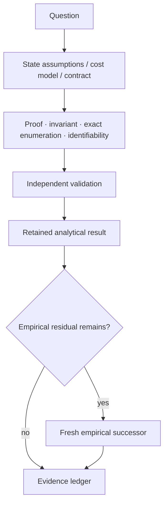

# Analytical research

- [Issue #7865 history-conditioned compensation eligibility T0 A02](history_conditioned_compensation_7865_t0_a02_20261005/REPORT.md) — PASS_METHOD_SCOPED: 28 exact oracle rows; disjoint external update preserved; A01 FAIL_HARNESS retained; finite synthetic model only.

- [Issue #7778 demand-guarded slack reclamation T0](slack_reclamation_7778_t0_20261005/REPORT.md) — zero-overhead T0: 9 traces / 27 rows, PASS_METHOD_SCOPED/H_PASS_SCOPED; separate [T0b dispatch sensitivity](slack_reclamation_7778_dispatch_sensitivity_t0_20261005/REPORT.md): 18 traces / 108 rows, PASS_METHOD_SCOPED/H_PASS_SCOPED. Priority-only completed more optional work than guarded slack over the full overhead-0 matrix, so no scheduler promotion follows.

- [Issue #7161 event-centric object memory T0 — corrective audit v2](event_memory_7161_t0_20261005/AUDIT_V2_RUN.md) — raw-derived re-audit passed 5/5 and rejected 8/8 mutations; original v1 auditor's limitations are preserved explicitly.

- [Issue #7387 synthetic serial-cue method gate — A01 STOP](serial_cue_interference_7387_t0_20261004/RUN.md) — WSLc candidate exited before producing rows because the runner pre-created `/out`, contrary to the frozen candidate's directory contract; auditor 0/1, no hypothesis result, no retry.
- [Issue #7387 A02 method result](serial_cue_interference_7387_t0_20261004_a02/REPORT.md) — WSLc candidate and raw-only auditor each ran once; 144 trials, 288 presentations, 16 isolated controls and 1,280 image files (five distinct pixel payloads) independently reconstructed; `PASS_METHOD_SCOPED`; model hypothesis remains untested.
- [Issue #7470 A02](inference_disturbance_coupling_7470_t0_a02_20261004/README.md) — harness diagnostic over 24 arbitrary pairings; does not meet the later circular-shift design clarification. A01 prelaunch STOP preserved.
- [Issue #7470 A03](inference_disturbance_coupling_7470_t0_a03_20261004/README.md) — four intact-sequence phase rotations detect planted sensitivity, but omit the explicit period-to-period seam transition required by the clarified design.
- [Issue #7470 A04](inference_disturbance_coupling_7470_t0_a04_20261004/README.md) — eight trajectories include the seam, but the frozen centered-correlation formula has an extra 1/n normalization; not an Issue-level PASS.
- [Issue #7470 A05](inference_disturbance_coupling_7470_t0_a05_20261004/README.md) — standard Pearson fixture, four intact circular shifts, and two periods with explicit seam; 8/8 reconstructed and 3/3 mutations rejected; finite method-scoped pass only.
- [PR #7371 post-outcome invocation custody](owner_keyup_timestamp_order_5156_t5_review_20261004/post_outcome_invocation/README.md) — unregistered second candidate-script invocation discovered after T4; explicit protocol deviation, raw output retained, and no further candidate invocation authorized. Read alongside T4's one-shot `RUN.json`.
- [Issue #7383 freshness-gated observation hedging T0](observation_hedging_7383_t0_20261004/REPORT.md) — synthetic independent-heavy-tail p95 improved 86.52% under the frozen threshold/work/deadline gates; correlated and shared-queue controls showed no gain. Independent audit passed 1,000 rows and rejected four mutations. Host CPU only; real capture critical-path evidence remains absent.
- [`circuit_rejection_cost_5375_a02_20261004/REPORT.md`](circuit_rejection_cost_5375_a02_20261004/REPORT.md) — #5375 A02 WSLc one-tick finite result; 10 raw rows independently reconstructed, 4/4 mutation controls rejected, PASS_METHOD_SCOPED; A01 construction failure and auditor STOP preserved separately. No empirical production-cost, live-resilience, GUI/model, or product claim.
- [`circuit_rejection_cost_5375_a01_20261004/REPORT.md`](circuit_rejection_cost_5375_a01_20261004/REPORT.md) — #5375 A01 exact 480-row record rescued; candidate violates frozen capacity on row 1 and the one auditor invocation STOPped on a read-only output destination. No rerun or hypothesis result.

- [Retained analytical source rescue — #6857/#6862/#6884](../recovery/analytical_source_rescue_20261004/README.md) — Exact original packets/history preserved; cancellation auditor v1 six false accepts and separately versioned v2 correction, LF/CRLF serialization-only evidence, and all historical temporal-contract HOLDs remain distinct. Archival integration is not original content-quorum/application approval, scientific/runtime adoption or a replay.

- [Archived S05-WSLC image-gate preparation](looming_visual_assumption_gate_5905_s05_wslc_20261003/ARCHIVAL_QUALIFICATION.md) — #6808/#5905 frozen source and 24 images preserved; no published formal result. Distinct from the cancelled native S05 and executed S06; archival checks do not authorize a run.

- [Issue #6061 archived T0 preparation](intermittent_control_6061_t0_20261003/README.md) — Original construction raw and freezes preserved; formal candidate/auditor 0/0. Offline construction replay/mutations are not a formal result or runtime clearance.

- [`semantic_receipt_runtime_boundary_5442_t4/RESCUE_QUALIFICATION_20261003.md`](semantic_receipt_runtime_boundary_5442_t4/RESCUE_QUALIFICATION_20261003.md) — #5442 T4 host-only mechanical-boundary archive; package raw-audit tests 2/2, six source/artifact checksums, frozen-kernel tests 18/18. No containerized simulator, application effect, or semantic-success claim.

- [`planner_hysteresis_5352_effect_qualified_t0_20261003/CONSTRUCTION_REPORT.md`](planner_hysteresis_5352_effect_qualified_t0_20261003/CONSTRUCTION_REPORT.md) — #5352 T15 finite synthetic discriminator construction contract 5/5 and current repository index tests 17/17; preformal HOLD, formal WSLc candidate/auditor 0/0; no efficacy claim.

- [`exogenous_phase_6803_derived_capture_a05_20261003_3cbf/REPORT.md`](exogenous_phase_6803_derived_capture_a05_20261003_3cbf/REPORT.md) — #6969 successor: source-derived closed-interval acquisition passes 147-row independent finite audit and 10/10 corruption controls; four onset-only original-source probes confirm snapshot-label insensitivity. Private OrbStack containers; modeled effects only, live transfer HOLD; pre-stage socket STOP preserved.
- [`RESCUE_STATUS_6035_20261003.md`](RESCUE_STATUS_6035_20261003.md) — Issue #6035 A01/A02 frozen synthetic crossover protocols and terminal pre-candidate STOP records rescued from closed branches; zero formal invocations and no model/interface claim.
- [`fault_exposure_6539_t0_20261002/RESCUE_STATUS.md`](fault_exposure_6539_t0_20261002/RESCUE_STATUS.md) — Issue #6539 frozen package rescued from PR #6697; paired-twin identifiability check retained, formal allocation still unassigned, and launch remains HOLD because the frozen CLI receipt path has a static `seeds` binding defect.
- [`native_wsl2_migration_6389_t0_20261002/STOP.md`](native_wsl2_migration_6389_t0_20261002/STOP.md) — #6389 retrospective custody of #6434: original runtime-parity/contention STOP, formal measurement/auditor 0/0/0; later v2 preparation and #6618 repair remain separate, no host release or migration result.

- [`conditional_parallax_6079_layer_identity_a01_20261003/FORMAL_FAILURE.md`](conditional_parallax_6079_layer_identity_a01_20261003/FORMAL_FAILURE.md) — #6838 A01: eight candidate rows retained, original auditor stopped with recursion failure; supplemental A03 raw-only audit later reconciled, without erasing this execution HOLD.
- [`conditional_parallax_6079_layer_identity_a02_audit_20261003/FORMAL_FAILURE.md`](conditional_parallax_6079_layer_identity_a02_audit_20261003/FORMAL_FAILURE.md) — #6841 A02 audit-only attempt: HOLD at the mutation-control gate because one layer relabel was a no-op; no output or retry.
- [`conditional_parallax_6079_layer_identity_a03_controls_20261003/REPORT.md`](conditional_parallax_6079_layer_identity_a03_controls_20261003/REPORT.md) — #6843 A03 supplemental raw-only audit: 8/8 rows and truth labels reconciled; five actual mutations rejected; finite synthetic 2-D scope only.

- [`observation_intervention_6526_a03_deadline_audit_only_20261003/REPORT.md`](observation_intervention_6526_a03_deadline_audit_only_20261003/REPORT.md) — #6526 post-hoc audit-only successor finds all A02 deadline snapshots late and one post-deadline effect seen only by a 12.428 ms late sample; current disposition `HOLD_AUDIT_TIMING`, no candidate rerun or H classification.
- [`observation_intervention_6526_a02_orbstack_20261003/REPORT.md`](observation_intervention_6526_a02_orbstack_20261003/REPORT.md) — Historical first-auditor A02 output `H_FAIL_SCOPED` is preserved; subsequent audit-only #6526 A03 review supersedes its scientific interpretation as `HOLD_AUDIT_TIMING` because deadline sampling was unbounded.
- [`observation_intervention_6526_a01_orbstack_20261003/FORMAL_FAILURE.md`](observation_intervention_6526_a01_orbstack_20261003/FORMAL_FAILURE.md) — Issue #6526 A01 OrbStack formal allocation: 180 trials completed, but the independent auditor stopped on the frozen exact 90 ms action-origin gate; no hypothesis statistics or conclusion. Raw evidence and prospective freeze retained; successor must use a fresh allocation.

- [`adoption_conditioned_recourse_6358_host_a02_20261003/REPORT.md`](adoption_conditioned_recourse_6358_host_a02_20261003/REPORT.md) — #6358 Mac-host T0 A02: shared/high-adoption recipient-specific routing resolved 4/4 versus 2/4 for generic, witness, public-stagger, and wording-placebo arms; independent audit passed 56/56 synthetic ledgers. No human, GUI, production, or causal claim; both earlier pre-candidate STOPs remain preserved.

- [`model_api_canary_wslc_replay_6001_t0_20261003/REPORT.md`](model_api_canary_wslc_replay_6001_t0_20261003/REPORT.md) — #6001 exact PR #6104 frozen source rerun in WSLc; raw byte-identical, auditor PASS_METHOD_SCOPED, tests 9/9; runtime reproducibility only, earlier STOPs unchanged.
- [`backpressure_route_expansion_5372_a01_20261003/`](backpressure_route_expansion_5372_a01_20261003/) — Issue #5372 A01 WSLc route-expansion queue fixture: independent audit passed; local-cost improvement reduced horizon completions 5→3, reservation arm restored 5; synthetic method scope only.

- [`wslc_control_plane_6669_t1_20261003/REPORT.md`](wslc_control_plane_6669_t1_20261003/REPORT.md) — Issue #6669 isolated WSLc 3.0.1.0 control-plane T1: bounded 640 MiB synthetic pressure with cgroup, PSI and control-operation evidence; SIGTERM-aware candidate stopped cleanly and raw auditor/mutation checks passed. Container memory-cap enforcement remains unproven.

- [`model_interface_crossover_6035_t0_a03_20261002/REPORT.md`](model_interface_crossover_6035_t0_a03_20261002/REPORT.md) — #6035 synthetic model-by-interface T0 A03: 64/64 assignments audited; planted crossover detected, safety/contract gates dominated; method-scoped only.
- [`issue59_wslc_ollama_store_mount_t0_20261003/REPORT.md`](issue59_wslc_ollama_store_mount_t0_20261003/REPORT.md) - #59 read-only Ollama store mount A01 STOP before launch: no candidate/auditor container (0/0) while #5085 allocation and shared WSLc bridge state remain unreconciled; WSL-host synthetic auditor contract suite 5/5, not container evidence.
- [`issue59_wsl_cuda_model_route_smoke_20261003/REPORT.md`](issue59_wsl_cuda_model_route_smoke_20261003/REPORT.md) — #59 exploratory local WSL GPU/model-route smoke: CUDA offload to RTX 3080 PASS, exact-response contract FAIL; no formal allocation or game/task-effect claim, and the full temporary log is not retained.
- [`portfolio_multiplicity_5890_intake_a02_20261003/REPORT.md`](portfolio_multiplicity_5890_intake_a02_20261003/REPORT.md) — #5890 fresh 25-row host-CPU successor: 16 screened-out ideas stayed outside the statistical family, all five started outcomes were retained, and the independent audit rejected 5/5 corruptions (`PASS_METHOD_SCOPED`); no FDR/error-rate claim.


- [`temporal_effect_identity_6530_orbstack_a01_20261002/REPORT.md`](temporal_effect_identity_6530_orbstack_a01_20261002/REPORT.md) — Issue #6530's frozen eight-case temporal identity fixture passed its scoped method gate in a digest-pinned OrbStack Docker candidate/auditor pair; no GUI, account, or real calendar event was used. Its earlier WSLc pre-start STOP remains unchanged.
- [`trusted_confirmation_5836_t0_v1/RECOVERY_NOTE.md`](trusted_confirmation_5836_t0_v1/RECOVERY_NOTE.md) — Issue #5836 T0 source and pre-candidate resource STOP; formal candidate/auditor 0/0, scientific outcome NOT_EVALUATED.

- [`wslc_control_plane_survivability_6669_t0_20261002/REPORT.md`](wslc_control_plane_survivability_6669_t0_20261002/REPORT.md) — Issue #6669 source/runtime applicability audit: `HOLD_APPLICABILITY_UNRESOLVED`; no WSLc pressure or survival claim.
- [`observable_quiescence_6664_t0_v1/REPORT.md`](observable_quiescence_6664_t0_v1/REPORT.md) — Issue #6664 finite handoff protocol T0: 1,191 schedules independently audited; accounted quiescence had 0 false certificates (128 horizon certificates, all other cases UNKNOWN); epoch-only and fixed-delay comparators had 3,445 and 2,254 false certificates. No GUI/backend safety claim.
- [`path_width_continuous_gui_6581_t0b_v1/REPORT.md`](path_width_continuous_gui_6581_t0b_v1/REPORT.md) — Issue #6581 synthetic path-width GUI fixture; six scenarios independently audited `PASS_METHOD_SCOPED`; no ordinary-GUI or human/agent transfer claim.
- [`spatial_block_position_6590_t1_geometry_design_v2/REPORT.md`](spatial_block_position_6590_t1_geometry_design_v2/REPORT.md) — #6590 preformal geometry screen: 80×60 remains below the four-block floor; 112×84 provides 19/16/20/16 eligible unique centers and passes an independent finite audit. No image/model/container run; formal T1 still held on OrbStack API readiness.

- [`spatial_block_position_6590_t1_geometry_feasibility_v1/REPORT.md`](spatial_block_position_6590_t1_geometry_feasibility_v1/REPORT.md) — #6590 OrbStack replication independently reconstructed the fixed-grid no-near-duplicate geometry; 6/6/3/3 eligible sites fail the eight-site block floor, so visual-model T1 remains unrun (`HOLD_GEOMETRY_NOT_IDENTIFIABLE`).

- [`revision_timed_cutover_6617_t0_v1/REPORT.md`](revision_timed_cutover_6617_t0_v1/REPORT.md) — Issue #6617 WSLc synthetic T0: 30 event traces independently audited; one stable scripted case saved 3 logical ticks; no speech, GUI, human, or real-latency result.
- [`disturbance_timescale_6604_t0_v1/REPORT.md`](disturbance_timescale_6604_t0_v1/REPORT.md) — Issue #6604 isolated OrbStack Docker successor: 14 synthetic rows independently audited `PASS_METHOD_SCOPED`; pooled score hides a planted slow-stratum local win; no real route/controller claim.

- [`frame_qualified_collateral_6533_t0_20261002/REPORT.md`](frame_qualified_collateral_6533_t0_20261002/REPORT.md) — Issue #6533 T0: 44/44 synthetic rows independently reconstructed; qualified-frame matched the full-state oracle, with a 79.1% aggregate accounted-byte reduction but a 2.13× regression at the smallest size. Method-scoped only; no GUI/product safety or performance claim.

- [`claim_scoped_partial_verdict_6509_t0_20261002/REPORT.md`](claim_scoped_partial_verdict_6509_t0_20261002/REPORT.md) — Issue #6509: 45-row OrbStack candidate and independent audit passed the finite claim-ladder method gate; unsafe scalar comparator had 11 partial ALLOWs; logical early-reject advantage is simulation-only.
- [`same_cohort_negative_control_5841_t2_v1/REPORT.md`](same_cohort_negative_control_5841_t2_v1/REPORT.md) — #5841 T2 fixture-derived truth-label audit: 56/56 rows reconstructed; all five label-corruption controls rejected; synthetic T1 evidence only.
- [`affordance_regression_envelope_6519_t0_20261002/formal_02_20261002/REPORT.md`](affordance_regression_envelope_6519_t0_20261002/formal_02_20261002/REPORT.md) — Issue #6519 T0b: native WSLc construction and independent audit passed `METHOD_PASS_SCOPED` on 72 synthetic rows; predecessor allocation 01 launch STOP retained separately; no model/GUI benefit claim.
- [`retired_intention_cue_6556_t0_v1/`](retired_intention_cue_6556_t0_v1/) — Issue #6556: finite post-retirement cue lineage challenge; compare ordinary durable event-instance routing against generation/retirement fencing, preserve unresolved obligations, and return UNKNOWN when lineage is absent. Synthetic only.
- [`observation_injection_transform_6575_t0_v1/`](observation_injection_transform_6575_t0_v1/) — Issue #6575 allocation 01 retained STOP: six sham-crop provenance mismatches between frozen candidate and auditor oracle; no scientific disposition or susceptibility/model claim.
- [`extreme_tail_eligibility_6576_construction_v1/orbstack_pilot_a02_20261002/RUN_RECORD.md`](extreme_tail_eligibility_6576_construction_v1/orbstack_pilot_a02_20261002/RUN_RECORD.md) — Issue #6576 dedicated OrbStack Docker single-case pilot: candidate and independent raw-only audit passed 4,000/4,000 stationary synthetic rows, with nominal 1% inside exact held-out intervals. Formal six-case T0 and all real release/safety claims remain unestablished.
- [`extreme_tail_eligibility_6576_construction_v1/timer_quantization_a01_20261002/RUN_RECORD.md`](extreme_tail_eligibility_6576_construction_v1/timer_quantization_a01_20261002/RUN_RECORD.md) — #6576 fresh OrbStack Docker timer-quantization probe: independent audit verified a q=1.0 synthetic arm passed `ELIGIBLE_REFERENCE` with only six distinct q90-exceedance values; finite gate-contract counterexample only, not EVT calibration or real timing evidence.
- [`extreme_tail_eligibility_6576_construction_v1/timer_quantization_a02_20261002/RUN_RECORD.md`](extreme_tail_eligibility_6576_construction_v1/timer_quantization_a02_20261002/RUN_RECORD.md) — #6576 fresh-seed OrbStack Docker support-rule test: a 20-distinct-value cutoff held 30/30 eligible q=1.0 fixtures, added 0/21 holds to continuous controls, and held 7/24 intermediate q=0.25 fixtures; synthetic method scope only.
- [`extreme_tail_eligibility_6576_construction_v1/timer_quantization_a03_20261002/RUN_RECORD.md`](extreme_tail_eligibility_6576_construction_v1/timer_quantization_a03_20261002/RUN_RECORD.md) — #6576 fresh-seed OrbStack Docker cutoff sweep: cutoff 8 was the smallest tested threshold meeting synthetic q=1.0 detection and continuous/q=0.25 false-hold criteria; q=0.5 baseline eligibility was sparse, and no production cutoff is validated.
- [`extreme_tail_eligibility_6576_construction_v1/orbstack_cran_parity_a03_20261002/RUN_RECORD.md`](extreme_tail_eligibility_6576_construction_v1/orbstack_cran_parity_a03_20261002/RUN_RECORD.md) — #6576 TailID/R parity A03: one-shot R harness stopped before data evaluation; Python-only six-row artifact retained; no parity result or retry.
- [`extreme_tail_eligibility_6576_construction_v1/orbstack_cran_parity_a04_20261002/RUN_RECORD.md`](extreme_tail_eligibility_6576_construction_v1/orbstack_cran_parity_a04_20261002/RUN_RECORD.md) — #6576 A04: both candidate arms completed, but the one-shot auditor crashed; descriptive post-hoc data retained separately from formal audit evidence.
- [`extreme_tail_eligibility_6576_construction_v1/orbstack_cran_parity_a05_20261002/RUN_RECORD.md`](extreme_tail_eligibility_6576_construction_v1/orbstack_cran_parity_a05_20261002/RUN_RECORD.md) — #6576 A05: isolated OrbStack CRAN/R versus Python TailID comparison; indices and threshold matched on six synthetic cases, but one base GPD fit exceeded frozen MLE/CI tolerances (`FAIL_PARITY_NUMERICAL_MLE`). No formal T0, physical release or safety claim.
- [`extreme_tail_eligibility_6576_construction_v1/orbstack_optimizer_sensitivity_a06_20261002/RUN_RECORD.md`](extreme_tail_eligibility_6576_construction_v1/orbstack_optimizer_sensitivity_a06_20261002/RUN_RECORD.md) — #6576 A06 fresh-seed optimizer-sensitivity candidate STOP: both one-shot arms failed on output UID permissions; no scientific result, auditor not invoked.
- [`extreme_tail_eligibility_6576_construction_v1/orbstack_optimizer_sensitivity_a07_20261002/RUN_RECORD.md`](extreme_tail_eligibility_6576_construction_v1/orbstack_optimizer_sensitivity_a07_20261002/RUN_RECORD.md) — #6576 A07 fresh-seed R/Python candidates succeeded, but the one-shot auditor incorrectly rejected retained failed starts; no formal scientific conclusion.
- [`extreme_tail_eligibility_6576_construction_v1/orbstack_optimizer_sensitivity_a08_20261002/RUN_RECORD.md`](extreme_tail_eligibility_6576_construction_v1/orbstack_optimizer_sensitivity_a08_20261002/RUN_RECORD.md) — #6576 A08 passed independent audit: alternate converged R fits were optimizer-sensitive on 4/6 synthetic fixtures; default R/Python parity passed 6/6. Method-scoped only; formal T0 and physical/safety claims remain unestablished.
- [`model_ambiguity_lifetime_6580_t0_v1/formal_01_20261002/REPORT.md`](model_ambiguity_lifetime_6580_t0_v1/formal_01_20261002/REPORT.md) — Issue #6580 allocation 01 passed independent audit for finite FULL/ZERO/EVENT history sets and move-order information labels (12 rows, 56 histories); no continuation-policy or real-interface model-lifetime claim.
- [`model_ambiguity_lifetime_6580_t0b_v1/REPORT.md`](model_ambiguity_lifetime_6580_t0b_v1/REPORT.md) — Issue #6580 decision-level T0b passed its 48-row finite table with explicit safe-continuation witnesses; public nature-first theta branches are not exhaustive, and T1 remains HOLD.
- [`model_ambiguity_lifetime_6580_t0c_v1/formal_01_20261002/REPORT.md`](model_ambiguity_lifetime_6580_t0c_v1/formal_01_20261002/REPORT.md) — T0c passed an exhaustive 66-branch finite audit (48 scenario keys; WSLc CPU container); T1 remains HOLD and no real-interface claim is made.

- [`denial_aware_request_6422_t0_20261002_v1/`](denial_aware_request_6422_t0_20261002_v1/PRESERVATION_QUALIFICATION.md) — Issue #6422 A01: retained 14-case authored policy result only; missing deferral-principal and single-use/budget coverage means partial T0, not full completion or T1 basis.
- [`denial_deferral_budget_6422_a03_20261002_v1/`](denial_deferral_budget_6422_a03_20261002_v1/REPORT.md) — Issue #6422 A03: same deferral receipt replay blocked under a new request ID; nine synthetic cases and five corruptions independently audited; method-scoped only.
- [`control_opportunity_attribution_6403_t0_v1/`](control_opportunity_attribution_6403_t0_v1/REPORT.md) — Issue #6403 six-trace synthetic control-opportunity method passed independent reconstruction and six mutation checks; no human attribution/blame claim.
- [`deadline_slack_equivalence_6435_t0_v1/`](deadline_slack_equivalence_6435_t0_v1/REPORT.md) — Issue #6435 no-model T0 method passed: 32/32 ledger rows independently reconstructed, six slack/card pairs classified, seeded reversal/null detected; no model-behavior claim.
- [`constraint_response_normalization_6437_t0_v1/`](constraint_response_normalization_6437_t0_v1/REPORT.md) — Successor to Issue #6380: typed answer normalization passed 32/32 synthetic rows and rejected seven corruptions; method-scoped only.
- [`context_preserving_delegation_6373_t0_v1/`](context_preserving_delegation_6373_t0_v1/REPORT.md) — Issue #6373 synthetic 8×4 policy comparison; RESTORE_PLUS_DIFF beat SUMMARY_ONLY on stipulated next-context proxy while preserving effects/external state/artifacts/unknowns; blind restore-only had four destructive controls. Not GUI/human evidence.
- [`cross_role_meaning_drift_6351_t0_v1/`](cross_role_meaning_drift_6351_t0_v1/REPORT.md) — Issue #6351 synthetic T0; flattened status falsely completed an unresolved-child case and contradictory receipts; direct typed queries and projections were equivalent, so no projection increment was demonstrated. Invalid first audits and corrected independent audit preserved.
- [`infra_speed_fairness_6347_t0_v1/`](infra_speed_fairness_6347_t0_v1/REPORT.md) — Issue #6347 synthetic FRFS/FIFO/bounded-window comparison; finite winner/status rows independently audited, with a separately frozen boundary-observability successor required before phase-jitter or strategic-timing claims.
- [`infra_speed_fairness_6347_boundary_successor_v1/`](infra_speed_fairness_6347_boundary_successor_v1/REPORT.md) — Issue #6347 boundary-focused successor: independently audited 16-row OrbStack trace exposes the 4→6 tick collection/winner discontinuity; synthetic only.
- [`prefix_responsive_counterparty_6327_t0_v1/`](prefix_responsive_counterparty_6327_t0_v1/REPORT.md) — Issue #6327 T0 method check: 64/64 synthetic rows independently reconstructed; equal variant marginals, prefix-only reactive selector, exogenous replay provenance, and effect-boundary outcome distinctions verified. No model/site susceptibility claim.

This directory contains retained analytical studies: proofs, exact finite-state or exhaustive results, break-even derivations, and identifiability analyses.

- [Issue #6461 / successor to #6179 T0b pre-formal STOP](semantic_challenge_lane_6179_t0b_20261002/PRESERVATION_QUALIFICATION.md) — Candidate/auditor 0/0: main advanced before formal start. A later separate diagnostic reported a 1 GiB memory ceiling; it does not reopen this allocation or change #6179’s HOLD.

Analytical results remain scoped to their stated assumptions. When a claim depends on a real OS, application, model, scheduler, latency distribution, or workload, that residual still requires empirical measurement.

See [`../../docs/RESEARCH_METHOD.md`](../../docs/RESEARCH_METHOD.md) for the analysis-versus-experiment decision flow.

## Analysis lifecycle


```mermaid
flowchart TD
    Q[Question] --> M[State assumptions / cost model / contract]
    M --> A[Proof · invariant · exact enumeration · identifiability]
    A --> V[Independent validation]
    V --> R[Retained analytical result]
    R --> E{Empirical residual remains?}
    E -->|no| L[Evidence ledger]
    E -->|yes| X[Fresh empirical successor]
    X --> L
```

## Analysis families

Issue #6315 retains both the original finite-trace T0 audit-v1 HOLD and the distinct WSLc portability successor; see each report for its exact scope and lineage.

Issue #5370 T7 successor #6723: [composed bounded priority-inheritance report](priority_inheritance_5370_t7_composition_20261002_01/REPORT.md). Its isolated synthetic method result and explicit limits are retained; historical T6 STOP remains unchanged.

- [Issue #6081 error-carry T0](error_carry_6081_t0_20261001/REPORT.md) — `STOP_METHOD_INVALID_BASELINE`; 672 rows reconstructed, but the 8-way dot-product baseline is not Euclidean-nearest. Frozen outputs are preserved; no PASS or application-transfer claim.

Issue #6331 wake-fenced lease T0: [`wake_fence_6331_t0_v1/`](wake_fence_6331_t0_v1/). A finite synthetic Docker run against the exact current `Lease` source found relative-clock LIVE vs suspend-inclusive EXPIRED after a long modelled gap; the wake-fence arm blocked stale generation and returned UNKNOWN on missing wake evidence. Two post-freeze main-advance STOPs and the scoped runtime limits are retained. No actual host sleep or physical input.


```mermaid
flowchart TD
    A[research/analysis]
    A --> COST[Decision / cost frontier]
    A --> REUSE[Reuse / lifetime contracts]
    A --> CONC[Concurrency / serializability]
    A --> OBS[Observation / temporal contracts]
    A --> REPLAY[Replay / provenance]
    A --> IDENT[Identifiability / retained-evidence audit]

    COST --> G[guard break-even]
    COST --> S[scheduler feasibility + RUN/WAIT]
    COST --> D[typed decision lattice]
    COST --> M[multi-cursor reposition]

    REUSE --> R[dependency-version reuse]
    REUSE --> L[layered lifetimes]
    REUSE --> DAG[partial DAG recomputation]
    REUSE --> H[fresh target-handle retention]
    REUSE --> RA[register-state dynamic identity]

    CONC --> RW[optimistic read/write commit]
    CONC --> FP[phase-overlap resource footprints]
    CONC --> DYN[dynamic footprint binding]
    CONC --> XT[XTerm footprint transfer]
    CONC --> BR[typed dynamic branch read-set]
    CONC --> AR[typed alias resolution]
    CONC --> QD[typed query dependency]
    CONC --> QA[query-version writer atomicity]
    CONC --> PL[consistency product lattice]
    CONC --> ML[mediated typed dependency ledger]
    CONC --> XA[retained optimistic-X11 successor audit]

    OBS --> RC[relevance completeness]
    OBS --> TM[temporal monitor semantics]
    OBS --> TMA[temporal monitor accounting successor]
    OBS --> TMC[temporal monitor A3]

    REPLAY --> DR[deterministic boundary replay]
    REPLAY --> ES[event-sourced projection / checkpoint]

    IDENT --> GC[guard calibration]
    IDENT --> EC[evidence-compute calibration]
    IDENT --> TS[temporal cost]
    IDENT --> TB[retained temporal break-even]
    IDENT --> MA[multi-app transition audit]
```

These family nodes are representative navigation aids, not an exhaustive taxonomy or scientific ranking. The generated directory index below is the completeness surface; each study's own report remains authoritative, including retained FAIL/HOLD outcomes.

## Curated analytical result guide

The table below summarizes major analytical chains and representative retained outcomes. It is intentionally explanatory rather than the completeness mechanism; the generated directory index below is exhaustive.

<details>
<summary><strong>Expand curated analytical results and failures</strong></summary>

| Family | Study | Retained result | Residual empirical or successor question |
|---|---|---|---|
| Recovery / coordination | [`obligation_conservation_5817_t0_v1/`](obligation_conservation_5817_t0_v1/) | Issue #5817 finite T0 `PASS_METHOD_SCOPED`: 11 histories / 14 obligation IDs; transfer and timeout preserve unresolved work, dependent/unknown tasks HOLD, independent read-only work proceeds; allocation-01 gate STOP retained. | Validate complete effect/footprint sources and crash-durable ledger semantics in an authorized live fixture before any runtime claim. |
| Verification / evidence | [`dependency_aware_verifier_quorum_5314_v1/`](dependency_aware_verifier_quorum_5314_v1/) | Exact finite comparison shows raw counting admits more false decisions than domain-deduplicated admission under complete synthetic dependency labels, with substantial abstention; labels are not empirically attestable here. | Validate dependency provenance, overlapping domains, and outage/cost behavior in an authorized held-out successor. |
| Decision / cost | [`guard_policy_break_even_r0_v1/`](guard_policy_break_even_r0_v1/) | Exact one-step selector for pre-guard versus postcondition-only under one commensurate recoverable-route cost model. | Measure real stale probabilities and guard/yield/failure costs in one declared population. |
| Decision / cost | [`evidence_dependent_compute_scheduler_dominance_r0_v1/`](evidence_dependent_compute_scheduler_dominance_r0_v1/) | Stale dependencies or missed hard deadlines make RUN infeasible; current metadata alone cannot universally choose RUN versus WAIT in the feasible region. | Measure invalidation likelihood, utility, contention, partial value, and production scheduler behavior. |
| Decision / cost | [`evidence_compute_run_wait_break_even_r1_v1/`](evidence_compute_run_wait_break_even_r1_v1/) | After the hard feasibility gate, the one-horizon RUN/WAIT threshold depends on invalidation probability and the declared stable-wait versus obsolete-compute losses. | Calibrate those inputs for one concrete job class; correlated invalidation, preemption, partial reuse, and contention remain open. |
| Decision / cost | [`evidence_compute_decision_lattice_r2_v1/`](evidence_compute_decision_lattice_r2_v1/) | Semantic reuse validity, temporal feasibility, and expected-cost selection compose as ordered gates without softer optimization overriding hard invalidation/deadline gates. | Calibrate parameters, rebuild economics, multi-job/resource scheduling, and partial/preemptive work. |
| Queueing / fairness | [`service_debt_deadline_6613_a01/`](service_debt_deadline_6613_a01/) | OrbStack finite-trace A01 independently replayed 288 rows but `FAIL_HYPOTHESIS`: service-debt did not reduce worst wait vs FIFO/shortest; on-time floors held. Synthetic only. | Compare alternative service-fair policies only under a new, prospectively frozen successor; no GUI or human-fairness claim. |
| Queueing / fairness | [`service_fairness_6613_edf_a01_20261003/`](service_fairness_6613_edf_a01_20261003/) | Fresh EDF successor independently replayed 360 rows and rejected 5/5 raw mutations, but `FAIL_HYPOTHESIS`: EDF on-time completion was below FIFO and shortest-service in the primary stratum. Synthetic only. | No retry or EDF tuning; a materially different, preregistered hypothesis is required. |
| Decision / cost | [`multicursor_parking_reposition_r0_v1/`](multicursor_parking_reposition_r0_v1/) | Under a serialized physical-pointer endpoint-cost model, logical parked cursors alone do not reduce physical reposition distance; a distinct cheap relocation primitive can. | Measure real relocation cost, hover/path equivalence, semantic re-grounding savings, and live correctness. |
| Reuse / lifetime | [`evidence_dependent_compute_reuse_r0_v1/`](evidence_dependent_compute_reuse_r0_v1/) | For deterministic pure jobs with complete declared dependencies and non-reused semantic version identities, exact dependency-version equality is sufficient for reuse and necessary for universal safety across arbitrary jobs. | Defend against incomplete declarations, ABA/version reuse, nondeterminism, clocks/external state, side effects, and measure performance. |
| Reuse / lifetime | [`layered_lifetime_admission_r0_v1/`](layered_lifetime_admission_r0_v1/) | Admission matches the oracle when reusable tokens bind every declared independently changing lifetime identity; global or route-only epochs lose narrowness or completeness in the frozen model. | Measure natural invalidation rates, runtime overhead, task correctness, model boundaries, and production ABI. |
| Reuse / lifetime | [`evidence_compute_partial_dag_reuse_r3_v1/`](evidence_compute_partial_dag_reuse_r3_v1/) | For pure compute DAGs under the declared assumptions, the minimal universally safe recomputation set is exactly the forward-reachable compute descendants of changed evidence. | Instrument one real pipeline as a declared DAG and measure partial versus whole-pipeline invalidation without hidden dependencies. |
| Reuse / lifetime | [`multicursor_target_handle_regrounding_r0_v1/`](multicursor_target_handle_regrounding_r0_v1/) | Multiple fresh semantic target handles reduce re-grounding only for non-consecutive same-epoch revisits when retention capacity is sufficient. | Measure grounding cost, validation/cache-management cost, model boundaries/tokens, geometry/currentness behavior, and live GUI correctness. |
| Reuse / lifetime | [`register_automaton_dynamic_identity_r0_v1/`](register_automaton_dynamic_identity_r0_v1/) | `PASS_REGISTER_AUTOMATON_IDENTITY_SCOPED`: exact generation-scoped target validity requires retaining both dynamic identity dimensions (or an equivalent typed tuple); a literal no-register FSM needs `|G|*|T|+1` states in the frozen equality model. | Test richer relations such as version order/aliasing and then transfer the representation to real GUI/API identity without claiming total memory or latency savings. |
| Responsibility transfer | [`adjustable_autonomy_handoff_5324_t0_v1/`](adjustable_autonomy_handoff_5324_t0_v1/) | `PASS_HANDOFF_BOUNDARIES_SCOPED` under the frozen finite-model rule: two-/three-phase policies had 0 duplicate-owner ticks, but more modeled no-owner ticks than ACK-only (26 vs 12), exposing a safety/liveness trade-off rather than one policy winner. | Real actor acceptance/quiescence, fallback latency, human attention, backend authority and task effects remain unmeasured. |
| Concurrency / serializability | [`optimistic_concurrent_readwrite_commit_r0_v1/`](optimistic_concurrent_readwrite_commit_r0_v1/) | With complete read/write sets, current versions, linearized final validation/effect, and no separate commutativity certificate, parallel admission is safe only without stale-read, cross read/write, or write/write hazards. | Bind the criterion to real typed receipts, measure natural conflicts/overhead, and retain a shared-global negative control. |
| Concurrency / serializability | [`phase_overlap_resource_footprint_r0_v1/`](phase_overlap_resource_footprint_r0_v1/) | Retained `FAIL_SOURCE_MATERIALIZATION`: the first frozen invocation stopped before enumeration because the executed local analyzer did not match the frozen Git source identity; no scientific rows were produced. | Preserve as an integrity failure; the scientific question proceeds only through a fresh successor with corrected source materialization. |
| Concurrency / serializability | [`phase_overlap_resource_footprint_a2_v1/`](phase_overlap_resource_footprint_a2_v1/) | Fresh source-exact successor retains zero mismatch for complete declared footprints and fail-closed serialization for UNKNOWN; surface-only and omitted-dependency controls are unsafe. | Determine whether real applications expose complete/static enough resource footprints and transfer to real overlap cases. |
| Concurrency / serializability | [`phase_overlap_resource_footprint_r0_v2/`](phase_overlap_resource_footprint_r0_v2/) | After repairing only source materialization from the retained failed predecessor, the deterministic footprint serializability contract passes its bounded model and corruption controls. | Test hidden/dynamic resources and real application overlap; no timing or runtime-promotion claim follows. |
| Concurrency / serializability | [`phase_overlap_dynamic_footprint_binding_r1_v1/`](phase_overlap_dynamic_footprint_binding_r1_v1/) | A runtime-resolved narrow footprint can recover concurrency relative to a static superset in the frozen model only when the selector state that chose the footprint remains a declared read/currentness dependency. | Test aliasing, hidden globals, external mutation, multi-resource data-dependent access, and revalidation cost in real systems. |
| Concurrency / serializability | [`xterm_resource_footprint_transfer_v1/`](xterm_resource_footprint_transfer_v1/) | Retained `FAIL_INTEGRITY`: the first frozen execution detected a local Git-blob mismatch; later local candidate outputs are invalid and are not scientific evidence. | Preserve the integrity failure; only a fresh successor may change materialization/execution plumbing. |
| Concurrency / serializability | [`xterm_resource_footprint_transfer_v2/`](xterm_resource_footprint_transfer_v2/) | `HOLD_ENVIRONMENT`: the planned exact-Git materialization stopped before any scientific invocation because the disposable container could not resolve GitHub; the resource-footprint hypothesis was not decided. | A successor may change only source transport while preserving frozen scientific sources/gates. |
| Concurrency / serializability | [`xterm_resource_footprint_transfer_v3/`](xterm_resource_footprint_transfer_v3/) | `PASS_RESOURCE_FOOTPRINT_XTERM_TRANSFER_SCOPED`: exact frozen sources were materialized and the footprint classifier distinguishes the retained independent XTerm pair from the shared-file conflict, while UNKNOWN serializes. | Footprints are still manually declared; automatic/conservative dependency acquisition and broader live transfer remain open. |
| Concurrency / serializability | [`typed_dynamic_branch_readset_v1/`](typed_dynamic_branch_readset_v1/) | Path-specific typed tracing of the control predicate plus executed branch resource reaches zero unsafe acceptances and zero false invalidations in the frozen branch model; omitting the predicate is structurally unsafe. | Extend to alias resolution, collection/query phantom handling, writer-maintenance atomicity, and automatic tracing in real runtimes. |
| Concurrency / serializability | [`typed_resolve_dependency_v1/`](typed_resolve_dependency_v1/) | Exact alias-resolution tracking requires both the alias mapping version and the selected concrete object version; either alone permits stale acceptance, while tracking all possible targets is safe but over-invalidating. | Extend to membership/query phantoms, multi-hop resolution/cycles, and atomic maintenance of query/membership versions. |
| Concurrency / serializability | [`typed_query_dependency_v1/`](typed_query_dependency_v1/) | Query/membership version plus current-member value/version reads are required in the frozen collection model; member-only misses insertion/removal phantoms and query-only misses member-value mutation. | Writer-side atomic maintenance of membership and query version, then real trace collection without hidden reads. |
| Concurrency / serializability | [`query_version_writer_atomicity_v1/`](query_version_writer_atomicity_v1/) | Reader-side query receipts are trustworthy only when membership mutation and query-version publication share an atomic boundary; membership-first/no-version are unsafe and version-first is conservative. | Integrate the completed READ → RESOLVE → QUERY → writer-atomicity ladder into one bounded real execution substrate. |
| Concurrency / serializability | [`interaction_consistency_product_lattice_r0_v1/`](interaction_consistency_product_lattice_r0_v1/) | Surface separation, read-set validity, actuator independence, hidden/global conflict freedom, and tail commutativity form structured dimensions; surface-only and readset-only predicates are incomparable, so one monotone scalar safety level is unjustified in the frozen model. | Real-backend transfer, automatic dependency completeness, natural hazard rates, and production contract implementation. |
| Concurrency / serializability | [`mediated_typed_dependency_ledger_v1/`](mediated_typed_dependency_ledger_v1/) | `PASS_MEDIATED_TYPED_DEPENDENCY_LEDGER_SCOPED`: one AF_UNIX owner/mediator composes the retained READ, RESOLVE, QUERY and writer-atomicity primitives into typed receipts with zero ledger mismatch, unsafe validation acceptance, or false invalidation across the frozen scientific cases. | Arbitrary-code bypass prevention, automatic GUI dependency discovery, production ABI adoption, performance, and cross-platform transfer remain separate. |
| Concurrency / serializability | [`optimistic_readwrite_x11_retained_audit_a3_v1/`](optimistic_readwrite_x11_retained_audit_a3_v1/) | `PASS_RETAINED_OPTIMISTIC_X11_AUDIT_A3_SCOPED`: a source-frozen successor audit independently validates the exact retained #1750 raw rows while preserving the parent `FAIL_INTEGRITY_AUDIT_GATE_COUNT` and the #1795 workflow stop unchanged. | Cite only as retained parent raw validated by successor audit; XTEST routing, app semantics, dependency completeness, speed/tokens, and production scheduling remain open. |
| Observation / temporal contract | [`observation_relevance_completeness_v1/`](observation_relevance_completeness_v1/) | Currentness of a relevance declaration does not imply completeness; nontrivial suppression outside the declared set needs trusted completeness provenance or a by-construction guarantee. | Establish completeness provenance/accuracy in real relevance generation and then measure GUI/model/token effects. |
| Observation / temporal contract | [`mixed_criticality_temporal_feasibility_5557_t15_transport_v1/`](mixed_criticality_temporal_feasibility_5557_t15_transport_v1/) | T15-03 `PASS_TEMPORAL_SERVICE_CONTRACT_SCOPED`: the finite four-tick model exposes four capacity-2 traces that are aggregate-feasible but temporally UNSAT, while preserving the LO minimum on the declared capacity-3 controls. | Replace hand-authored arrivals/service with a measured workload, establish observation utility/freshness and production scheduler behavior; no general schedulability or product-benefit claim. |
| Observation / temporal contract | [`temporal_contract_monitor_compilation_r0_v1/`](temporal_contract_monitor_compilation_r0_v1/) | Retained `FAIL_INTEGRITY_ORACLE_SAME_TIMESTAMP_P_TRANSITION`: the first allocation exposes a correlated oracle defect for same-timestamp predicate transitions; the semantic theorem is not decided. | A fresh successor may change only the reference semantics to preserve same-timestamp Boolean transitions in arrival order. |
| Observation / temporal contract | [`temporal_contract_monitor_compilation_a2_v1/`](temporal_contract_monitor_compilation_a2_v1/) | Retained `FAIL_INTEGRITY_PARENT_PREFIX_ACCOUNTING`: candidate/reference mismatches are zero after the oracle repair, but the consumed allocation used a failure-truncated parent prefix count as a corpus gate. | A3 may change only the accounting gate to the independently derived complete prefix count while preserving the A2 semantics/generator. |
| Observation / temporal contract | [`temporal_contract_monitor_compilation_a3_v1/`](temporal_contract_monitor_compilation_a3_v1/) | `PASS_TEMPORAL_CONTRACT_MONITOR_COMPILATION_A3_SCOPED`: with the accounting gate corrected, four representative one-shot temporal contracts compile to constant-memory deterministic monitors with zero primary/independent mismatch over the full frozen corpus. | Transfer one monitor family to a private live event stream with explicit clock/evidence provenance and no authority escalation. |
| Replay / provenance | [`deterministic_replay_boundary_r0_v1/`](deterministic_replay_boundary_r0_v1/) | In the frozen deterministic reducer model, initial-state identity plus a complete strictly ordered typed record of every external boundary event is sufficient for exact replay/fork replay; omitting order or named event classes creates non-identifiability. | Identify and capture every real nondeterministic/external boundary, then replay retained execution without reinvoking the external dependency. |
| Replay / provenance | [`event_sourced_projection_r0_v1/`](event_sourced_projection_r0_v1/) | For the frozen deterministic reducer, full fold, exactly-once incremental projection, and a trusted checkpoint bound to exact prefix identity/state produce equivalent state; weaker index-only/orderless/missing-event schemes have retained divergent witnesses. | Transfer checkpoint+suffix replay to a retained real event ledger while separately proving external-boundary completeness/authenticity assumptions. |
| Identifiability / audit | [`guard_policy_calibration_identifiability_r1_v1/`](guard_policy_calibration_identifiability_r1_v1/) | Existing retained route families do not identify all guard-selector parameters in one same-population commensurate cost model. | Measure stale incidence and reject/recovery/failure costs on one explicitly recoverable route. |
| Identifiability / audit | [`evidence_compute_calibration_identifiability_r3_v1/`](evidence_compute_calibration_identifiability_r3_v1/) | Seven retained evidence families provide zero fully calibratable same-population job class for the compute decision lattice; cross-family substitution is invalid. | Prospectively measure invalidation probability, WAIT/RUN losses, reuse rate, version cost, and job identity in one declared population. |
| Identifiability / audit | [`temporal_sample_cost_identifiability_v1/`](temporal_sample_cost_identifiability_v1/) | Source sample-count reduction alone does not identify token, wall-time, or monetary break-even; measured `F/Q/H` endpoints are required. | Run fresh matched provider/model measurements with presentation/session/cache identity. |
| Identifiability / audit | [`temporal_break_even_retained_identifiability_v1/`](temporal_break_even_retained_identifiability_v1/) | Existing retained temporal evidence contains zero admissible fully matched rows for the required empirical break-even estimate. | Run a source-matched allocation retaining `F_m`, `Q_m`, `H_m`, identity, and correctness endpoints. |
| Identifiability / audit | [`multi_app_transition_retained_audit_r0_v1/`](multi_app_transition_retained_audit_r0_v1/) | Retained evidence covers focus drift, modal, geometry drift, and window replacement across components/apps, but no single session integrates all four under one contract. | Run a finite multi-app integrated allocation preserving one caller/controller identity across the transition families. |

| Locale / semantic invariance | [`locale_semantic_invariance_5919_t0_20261001/`](locale_semantic_invariance_5919_t0_20261001/) | Two benign synthetic locale pairs pass; five injected faults are rejected and an ambiguous pair is UNKNOWN. H_PASS_SCOPED only; visual proxy is fixture metadata. | Evaluate locale-conditioned semantic effects on independently adjudicated real or high-fidelity traces before generalizing. |
| Audit / provenance | [`locale_semantic_invariance_5919_audit_review_20261001_01/`](locale_semantic_invariance_5919_audit_review_20261001_01/) | Post-merge raw-only audit confirms the eight T0 outcomes and rejects three actual corrupted copies plus duplicate/missing/extra rows; no candidate rerun. Original visual proxy remains fixture metadata. | Obtain independently adjudicated high-fidelity locale traces before extending the method claim. |
| Route selection / topology | [`route_selector_5911_t0_20261001_02/`](route_selector_5911_t0_20261001_02/) | Five finite synthetic cases and an independent enumerator pass the explicit minimum-cost route/tie contract; scope is method-only. | Test selector semantics on real source traces before making any live routing or causal claim. |

| Audit / provenance | [`native_wsl2_migration_6389_audit_repair_v1_20261002/`](native_wsl2_migration_6389_audit_repair_v1_20261002/) | Seven host-only synthetic tests verify the frozen nested-field contract and reject Boolean-as-integer raw values; not a migration experiment or performance/memory claim. | Obtain shared-lane release before a fresh WSL candidate run and independent formal audit. |

</details>

## Historical source and construction archives

- [Recovery-rate T0 source and reported host failure: #5776 / source PR #5788](recovery_rate_5776_t0_v1/ARCHIVAL_QUALIFICATION.md) — five exact source/plan files; reported host FAIL_METHOD and Docker STOP retained. No committed raw/result bundle or new replay; distinct from merged #5792/#5859 allocations. Owner #5776 and source Draft #5788 remain open.
- [Predictive safety-filter T0 host evidence and withdrawn container rung: #5317 / source PR #5336](predictive_safety_filter_5317_v1/ARCHIVAL_QUALIFICATION.md) — six exact files including the 35-cell host raw; reported scoped host PASS and later STOP/HOLD withdrawal retained, with zero container invocations. Distinct from merged T3 #5505; no new replay or runtime-safety claim. Owner #5317 and source Draft #5336 remain open.
- [Issue #4956 audit-hardening HOLD source](predicate_order_drift_audit_integrity_4733_v4/RECOVERY_STATUS.md) — source/protocol archive only; the unchanged baseline was rejected by an over-strict exact-float gate, before mutation/audit results. Successor #4959 is distinct and does not change the recorded HOLD.
- [Issue #5008 lifecycle allocation-01 STOP](needle_role_skill_lifecycle_4916_v2/RECOVERY_STATUS.md) — exact three-file recovery of the freeze-identity STOP, 11,464/12,288 construction parity failure, and no formal timing run; distinct from #5023/#5053 successors.

## Cancellation-order retained audit repair

- [singleflight_cancel_order_6501_boundary_20261003/repair_v2/README.md](singleflight_cancel_order_6501_boundary_20261003/repair_v2/README.md) — #6501 finite cancellation/delivery boundary: unchanged192 assignments/384 decisions,48 strict-clock wrong admissions,48 conservative wrong refusals,0 explicit-order discrepancies; frozen v1 audit accepted six typed/schema corruptions, separately retained v2 audit rejects all14 effective controls. Original source/raw/first results preserved; no formal replay or runtime promotion.

## Complete retained result directory index

This compact list is generated from child directories that contain `REPORT.md` or `FORMAL_FAILURE.md`, or `STOP.md`. It is the completeness surface used by the index checker.

<!-- BEGIN GENERATED ANALYSIS RESULT INDEX -->

<details>
<summary><strong>Expand all retained result/failure directories</strong></summary>

- [`5352_unknown_recovery_audit_v1/`](5352_unknown_recovery_audit_v1/)
- [`accessibility_configuration_effects_5922_t0_v1/`](accessibility_configuration_effects_5922_t0_v1/)
- [`action_bound_residual_6619_t0_v1/`](action_bound_residual_6619_t0_v1/)
- [`action_class_error_budget_5424_t2_v1/`](action_class_error_budget_5424_t2_v1/)
- [`action_class_error_budget_5424_t3_v1/`](action_class_error_budget_5424_t3_v1/)
- [`action_class_error_budget_5424_t4_v1/`](action_class_error_budget_5424_t4_v1/)
- [`action_conditioned_routing_repair_successor_2059_r2_v1/`](action_conditioned_routing_repair_successor_2059_r2_v1/)
- [`action_conditioned_routing_repair_successor_2059_v1/`](action_conditioned_routing_repair_successor_2059_v1/)
- [`action_conditioned_routing_successor_1934_r2/`](action_conditioned_routing_successor_1934_r2/)
- [`action_conditioned_routing_successor_1934_v1/`](action_conditioned_routing_successor_1934_v1/)
- [`active_automata_learning_5385_t0_v1/`](active_automata_learning_5385_t0_v1/)
- [`adaptive_privacy_filter_5420_t1_v1/`](adaptive_privacy_filter_5420_t1_v1/)
- [`adaptive_screen_5722_t0_v1/`](adaptive_screen_5722_t0_v1/)
- [`adaptive_screen_5739_t0_v1/`](adaptive_screen_5739_t0_v1/)
- [`adoption_conditioned_recourse_6358_host_a02_20261003/`](adoption_conditioned_recourse_6358_host_a02_20261003/)
- [`adoption_curve_6615_t0_v1/`](adoption_curve_6615_t0_v1/)
- [`adoption_curve_6615_t0_v2/`](adoption_curve_6615_t0_v2/)
- [`adoption_curve_6615_t0_v3/`](adoption_curve_6615_t0_v3/)
- [`affine_clock_delivery_c6t9_t7k3_v1/`](affine_clock_delivery_c6t9_t7k3_v1/)
- [`affine_receipt_5508_t12/`](affine_receipt_5508_t12/)
- [`affine_receipt_5508_t13/`](affine_receipt_5508_t13/)
- [`affine_receipt_5508_t14/`](affine_receipt_5508_t14/)
- [`affine_receipt_5508_t15/`](affine_receipt_5508_t15/)
- [`alert_actionability_5435_t4/`](alert_actionability_5435_t4/)
- [`altgr_preflight_contract_successor_2171_v1/`](altgr_preflight_contract_successor_2171_v1/)
- [`amendment_effect_6219_publication_recovery_20261003/`](amendment_effect_6219_publication_recovery_20261003/)
- [`answer_surface_audit_6173_factored_axes_t0_20261002/`](answer_surface_audit_6173_factored_axes_t0_20261002/)
- [`anytime_fidelity_typed_admission_r0_v1/`](anytime_fidelity_typed_admission_r0_v1/)
- [`anytime_t5/`](anytime_t5/)
- [`aoii_observation_freshness_43_t0_v1/`](aoii_observation_freshness_43_t0_v1/)
- [`approval_sequence_assay_6405_t0_20261002/`](approval_sequence_assay_6405_t0_20261002/)
- [`approval_sequence_discrimination_6405_t0_v1/`](approval_sequence_discrimination_6405_t0_v1/)
- [`arena_v1_cv_grounding_rescue_4695_v1/`](arena_v1_cv_grounding_rescue_4695_v1/)
- [`arena_v1_cv_grounding_rescue_4695_v2/`](arena_v1_cv_grounding_rescue_4695_v2/)
- [`artifact_changeability_6610_6624_t0_20261002/`](artifact_changeability_6610_6624_t0_20261002/)
- [`artifact_viability_cutsets_6468_t0_20261002/`](artifact_viability_cutsets_6468_t0_20261002/)
- [`artifact_viability_cutsets_6468_t0b_20261002/`](artifact_viability_cutsets_6468_t0b_20261002/)
- [`assay_sensitivity_5850_t0_v1/`](assay_sensitivity_5850_t0_v1/)
- [`assistive_cue_noninterference_5800_t0_v1/`](assistive_cue_noninterference_5800_t0_v1/)
- [`attention_budgeting_successor_1940_v1/`](attention_budgeting_successor_1940_v1/)
- [`attention_cue_provenance_diagnostic_2755_v1/`](attention_cue_provenance_diagnostic_2755_v1/)
- [`attention_provenance_successor_1936_v1/`](attention_provenance_successor_1936_v1/)
- [`attention_provenance_value_repair_successor_2039_v1/`](attention_provenance_value_repair_successor_2039_v1/)
- [`auditor_completion_5895_t0_20261001_01/`](auditor_completion_5895_t0_20261001_01/)
- [`auditor_completion_5895_t4_20261001_8d0c7f53/`](auditor_completion_5895_t4_20261001_8d0c7f53/)
- [`auditor_completion_5895_t6_20261001_8d0c7f53_amd64/`](auditor_completion_5895_t6_20261001_8d0c7f53_amd64/)
- [`backpressure_route_expansion_5372_a01_20261003/`](backpressure_route_expansion_5372_a01_20261003/)
- [`backward_observable_guards_6256_comparator_t2_20261002/`](backward_observable_guards_6256_comparator_t2_20261002/)
- [`backward_observable_guards_6256_stale_generation_t1_20261002/`](backward_observable_guards_6256_stale_generation_t1_20261002/)
- [`backward_observable_guards_6256_t0_20261002/`](backward_observable_guards_6256_t0_20261002/)
- [`backward_observable_guards_6256_t2_false_stop_t5_20261002/`](backward_observable_guards_6256_t2_false_stop_t5_20261002/)
- [`belief_auto_recommit_semantic_boundary_r3_v1/`](belief_auto_recommit_semantic_boundary_r3_v1/)
- [`belief_external_drift_5368_t0_20261003/`](belief_external_drift_5368_t0_20261003/)
- [`belief_external_drift_wslc_portability_20261003/`](belief_external_drift_wslc_portability_20261003/)
- [`belief_recommit_epoch_aba_r2_v1/`](belief_recommit_epoch_aba_r2_v1/)
- [`belief_repair_decision_lattice_r4_v1/`](belief_repair_decision_lattice_r4_v1/)
- [`belief_stream_scheduling_6097_t0_20261001/`](belief_stream_scheduling_6097_t0_20261001/)
- [`benefit_threshold_7411_t0_20261005/`](benefit_threshold_7411_t0_20261005/)
- [`benign_error_recovery_scope_6469_t0_20261002_v1/`](benign_error_recovery_scope_6469_t0_20261002_v1/)
- [`blackstart_allwindow_trace_5970_t6_20261002/`](blackstart_allwindow_trace_5970_t6_20261002/)
- [`blackstart_causal_cut_5970_t0_20261001/`](blackstart_causal_cut_5970_t0_20261001/)
- [`blackstart_causal_cut_5970_t1_20261001/`](blackstart_causal_cut_5970_t1_20261001/)
- [`blackstart_nonmodifier_trace_5970_t11_20261002/`](blackstart_nonmodifier_trace_5970_t11_20261002/)
- [`blackstart_prospective_trace_5970_t2_20261001/`](blackstart_prospective_trace_5970_t2_20261001/)
- [`blackstart_record_target_ancestor_5970_t8_20261002/`](blackstart_record_target_ancestor_5970_t8_20261002/)
- [`blackstart_record_target_liveness_5970_t7_20261002/`](blackstart_record_target_liveness_5970_t7_20261002/)
- [`blackstart_source_bound_5970_t3_20261001/`](blackstart_source_bound_5970_t3_20261001/)
- [`blackstart_tk_parent_only_5970_t10_20261002/`](blackstart_tk_parent_only_5970_t10_20261002/)
- [`blackstart_tk_parent_window_5970_t9_20261002/`](blackstart_tk_parent_window_5970_t9_20261002/)
- [`blackstart_x11_noinput_baseline_5970_t12_20261002/`](blackstart_x11_noinput_baseline_5970_t12_20261002/)
- [`blackstart_xevent_target_5970_t5_20261002/`](blackstart_xevent_target_5970_t5_20261002/)
- [`blackstart_xrecord_5970_t4_20261001/`](blackstart_xrecord_5970_t4_20261001/)
- [`blackwell_observation_dominance_6678_t0_v1/`](blackwell_observation_dominance_6678_t0_v1/)
- [`blackwell_observation_dominance_6678_t1_browser_20261003/`](blackwell_observation_dominance_6678_t1_browser_20261003/)
- [`blackwell_observation_dominance_6678_t1_orbstack_a02_20261003/`](blackwell_observation_dominance_6678_t1_orbstack_a02_20261003/)
- [`blackwell_observation_dominance_6678_t1_orbstack_a03_20261003/`](blackwell_observation_dominance_6678_t1_orbstack_a03_20261003/)
- [`boundary_margin_5707_policy_pair_v1/`](boundary_margin_5707_policy_pair_v1/)
- [`boundary_margin_5707_t0_v1/`](boundary_margin_5707_t0_v1/)
- [`boundary_margin_5707_typed_v1/`](boundary_margin_5707_typed_v1/)
- [`bounded_path_class_switching_6586_t0_20261002/`](bounded_path_class_switching_6586_t0_20261002/)
- [`bounded_skew_context_join_successor_1218_v1/`](bounded_skew_context_join_successor_1218_v1/)
- [`bounded_voi_scheduler_4263_v1/`](bounded_voi_scheduler_4263_v1/)
- [`braess_route_verifier_5855_horizon_ledger_a02_20261004/`](braess_route_verifier_5855_horizon_ledger_a02_20261004/)
- [`breakdown_t7/`](breakdown_t7/)
- [`cache_epoch_completeness_2928_v1/`](cache_epoch_completeness_2928_v1/)
- [`cache_epoch_monitor_execution_2928_v1/`](cache_epoch_monitor_execution_2928_v1/)
- [`cache_partial_effect_replay_boundary_2928_v1/`](cache_partial_effect_replay_boundary_2928_v1/)
- [`cache_session_binding_caller_2928_v1/`](cache_session_binding_caller_2928_v1/)
- [`caller_custody_union_20261004/`](caller_custody_union_20261004/)
- [`caller_two_tier_stage_dominance_v1/`](caller_two_tier_stage_dominance_v1/)
- [`capability_snapshot_currentness_fallback_r0_v1/`](capability_snapshot_currentness_fallback_r0_v1/)
- [`causal_attribution_5323_t0_v1/`](causal_attribution_5323_t0_v1/)
- [`causal_critical_path_elasticity_5851_t0_v1/`](causal_critical_path_elasticity_5851_t0_v1/)
- [`causal_cut_5348_t1/`](causal_cut_5348_t1/)
- [`causal_elasticity_5851_branch_intervention_successor_20261001/`](causal_elasticity_5851_branch_intervention_successor_20261001/)
- [`causal_temporal_attention_successor_1941_v1/`](causal_temporal_attention_successor_1941_v1/)
- [`causal_temporal_history_2026_v1/`](causal_temporal_history_2026_v1/)
- [`cegis_grammar_gap_4294_v1/`](cegis_grammar_gap_4294_v1/)
- [`cegis_skill_4262_v1/`](cegis_skill_4262_v1/)
- [`censored_useful_effect_integrity_2514_v1/`](censored_useful_effect_integrity_2514_v1/)
- [`censored_useful_effect_membership_successor_1838_v1/`](censored_useful_effect_membership_successor_1838_v1/)
- [`cex_qualified_guard_refinement_6645_t0_v1/`](cex_qualified_guard_refinement_6645_t0_v1/)
- [`change_cue_contrast_1931_v1/`](change_cue_contrast_1931_v1/)
- [`checkpoint_delivery_6089_20261003_01a0ff59/`](checkpoint_delivery_6089_20261003_01a0ff59/)
- [`circuit_rejection_cost_5375_a01_20261004/`](circuit_rejection_cost_5375_a01_20261004/)
- [`circuit_rejection_cost_5375_a02_20261004/`](circuit_rejection_cost_5375_a02_20261004/)
- [`claim_disk_recovery_6509_01a0ff58/`](claim_disk_recovery_6509_01a0ff58/)
- [`claim_generation_types_6509_01a0ff58/`](claim_generation_types_6509_01a0ff58/)
- [`claim_ladder_6113_t0_20261002/`](claim_ladder_6113_t0_20261002/)
- [`claim_postdominator_6553_t0_20261002/`](claim_postdominator_6553_t0_20261002/)
- [`claim_scoped_clip_trace_6536_t0_20261002/`](claim_scoped_clip_trace_6536_t0_20261002/)
- [`claim_scoped_partial_verdict_6509_t0_20261002/`](claim_scoped_partial_verdict_6509_t0_20261002/)
- [`cli_v1_lineage_direct_tests_2428_v1/`](cli_v1_lineage_direct_tests_2428_v1/)
- [`client_energy_per_effect_7728_t0_20261005/`](client_energy_per_effect_7728_t0_20261005/)
- [`clipboard_formats_36_t0_01a0ff51/`](clipboard_formats_36_t0_01a0ff51/)
- [`clipboard_formats_36_x11_transfer_01a0ff51/`](clipboard_formats_36_x11_transfer_01a0ff51/)
- [`competence_location_map_3446_v1/`](competence_location_map_3446_v1/)
- [`complementarity_marginal_evidence_5869_t0_v1/`](complementarity_marginal_evidence_5869_t0_v1/)
- [`composition_heldout_fixture_2068_v1/`](composition_heldout_fixture_2068_v1/)
- [`conditional_deadline_certificate_6059_t0_20261001/`](conditional_deadline_certificate_6059_t0_20261001/)
- [`conditional_parallax_6079_foreground_control_a01_20261003/`](conditional_parallax_6079_foreground_control_a01_20261003/)
- [`conditional_parallax_6079_integrity_adjudication_a01_20261003/`](conditional_parallax_6079_integrity_adjudication_a01_20261003/)
- [`conditional_parallax_6079_layer_identity_a01_20261003/`](conditional_parallax_6079_layer_identity_a01_20261003/)
- [`conditional_parallax_6079_layer_identity_a02_audit_20261003/`](conditional_parallax_6079_layer_identity_a02_audit_20261003/)
- [`conditional_parallax_6079_layer_identity_a03_controls_20261003/`](conditional_parallax_6079_layer_identity_a03_controls_20261003/)
- [`conditional_parallax_6079_t0_v1_20261003/`](conditional_parallax_6079_t0_v1_20261003/)
- [`conditional_route_rescue_5598_t0_20261001/`](conditional_route_rescue_5598_t0_20261001/)
- [`conflict_aware_evidence_ledger_5305_t0/`](conflict_aware_evidence_ledger_5305_t0/)
- [`conformal_verifier_risk_contract_5315_v1/`](conformal_verifier_risk_contract_5315_v1/)
- [`consent_scoped_preparation_5793_t0_v1/`](consent_scoped_preparation_5793_t0_v1/)
- [`constrained_interaction_testing_5330_t0_supplemental_raw_20260930/`](constrained_interaction_testing_5330_t0_supplemental_raw_20260930/)
- [`constrained_interaction_testing_5330_t0_v1/`](constrained_interaction_testing_5330_t0_v1/)
- [`constrained_sequence_coverage_6206_t0_v1/`](constrained_sequence_coverage_6206_t0_v1/)
- [`constraint_elicitation_6380_t0_v1/`](constraint_elicitation_6380_t0_v1/)
- [`constraint_response_normalization_6437_t0_v1/`](constraint_response_normalization_6437_t0_v1/)
- [`context_preserving_delegation_6373_t0_v1/`](context_preserving_delegation_6373_t0_v1/)
- [`context_success_history_calibration_6241_t0_20261002/`](context_success_history_calibration_6241_t0_20261002/)
- [`control_opportunity_attribution_6403_t0_v1/`](control_opportunity_attribution_6403_t0_v1/)
- [`cost_predicate_order_4258_v1/`](cost_predicate_order_4258_v1/)
- [`counterexample_guard_coverage_gate_6645_t1_v1/`](counterexample_guard_coverage_gate_6645_t1_v1/)
- [`counterexample_guard_coverage_gate_6645_t1b_revalidation_20261003/`](counterexample_guard_coverage_gate_6645_t1b_revalidation_20261003/)
- [`counterexample_guard_coverage_gate_6645_t1b_v1/`](counterexample_guard_coverage_gate_6645_t1b_v1/)
- [`counterexample_guard_refinement_6645_t0_orbstack_20261003/`](counterexample_guard_refinement_6645_t0_orbstack_20261003/)
- [`counterexample_guard_refinement_6645_t0b_orbstack_20261003/`](counterexample_guard_refinement_6645_t0b_orbstack_20261003/)
- [`counterexample_guard_refinement_6645_t0c_orbstack_20261003/`](counterexample_guard_refinement_6645_t0c_orbstack_20261003/)
- [`cross_handoff_pending_correction_6284_t0_20261002/`](cross_handoff_pending_correction_6284_t0_20261002/)
- [`cross_role_meaning_drift_6351_t0_v1/`](cross_role_meaning_drift_6351_t0_v1/)
- [`crossed_verdict_repeatability_6222_t0_20261001_01/`](crossed_verdict_repeatability_6222_t0_20261001_01/)
- [`crossed_verdict_repeatability_6222_t1_eligibility_20261002_01/`](crossed_verdict_repeatability_6222_t1_eligibility_20261002_01/)
- [`cue_triggered_intention_7162_t0_20261004/`](cue_triggered_intention_7162_t0_20261004/)
- [`cutoff_local_guard_audit_6451_t0_v1/`](cutoff_local_guard_audit_6451_t0_v1/)
- [`cutoff_local_guard_audit_6451_t0b_orbstack_20261003/`](cutoff_local_guard_audit_6451_t0b_orbstack_20261003/)
- [`danger_context_triage_5764_t0_v1/`](danger_context_triage_5764_t0_v1/)
- [`deadline_identity_5265_dot/`](deadline_identity_5265_dot/)
- [`deadline_slack_equivalence_6417_t0_20261002/`](deadline_slack_equivalence_6417_t0_20261002/)
- [`deadline_slack_equivalence_6435_t0_v1/`](deadline_slack_equivalence_6435_t0_v1/)
- [`decision_opportunity_audit_5986_t0_20261002/`](decision_opportunity_audit_5986_t0_20261002/)
- [`decision_opportunity_feedback_5986_b7q1_v1/`](decision_opportunity_feedback_5986_b7q1_v1/)
- [`decision_reversal_6003_container_repro_a01_20261003/`](decision_reversal_6003_container_repro_a01_20261003/)
- [`decision_reversal_6003_container_repro_a02_20261003/`](decision_reversal_6003_container_repro_a02_20261003/)
- [`decision_reversal_6003_t0_v1/`](decision_reversal_6003_t0_v1/)
- [`decision_sufficiency_5329_v1/`](decision_sufficiency_5329_v1/)
- [`delay_gain_stability_6195_t0_host_20261001_01/`](delay_gain_stability_6195_t0_host_20261001_01/)
- [`delayed_gui_effect_attribution_7487_t0_20261004/`](delayed_gui_effect_attribution_7487_t0_20261004/)
- [`denial_aware_deferral_authority_6422_a02_20261002_v1/`](denial_aware_deferral_authority_6422_a02_20261002_v1/)
- [`denial_aware_request_6422_t0_20261002_v1/`](denial_aware_request_6422_t0_20261002_v1/)
- [`denial_aware_request_policy_6422_t0_v1/`](denial_aware_request_policy_6422_t0_v1/)
- [`denial_deferral_budget_6422_a03_20261002_v1/`](denial_deferral_budget_6422_a03_20261002_v1/)
- [`dependency_aware_verifier_quorum_5314_v1/`](dependency_aware_verifier_quorum_5314_v1/)
- [`desktop_lifecycle_rebind_3190_host_preflight_v1/`](desktop_lifecycle_rebind_3190_host_preflight_v1/)
- [`deterministic_replay_boundary_r0_v1/`](deterministic_replay_boundary_r0_v1/)
- [`disturbance_response_5771_t1_v3/`](disturbance_response_5771_t1_v3/)
- [`disturbance_timescale_6604_t0_v1/`](disturbance_timescale_6604_t0_v1/)
- [`disturbance_timescale_6604_t1_eligibility_20261002/`](disturbance_timescale_6604_t1_eligibility_20261002/)
- [`effect_interference_5366_t2_v1/`](effect_interference_5366_t2_v1/)
- [`effect_interference_5366_t3_v1/`](effect_interference_5366_t3_v1/)
- [`effect_overlap_6278_filter_control_t0_v3/`](effect_overlap_6278_filter_control_t0_v3/)
- [`effect_overlap_6278_portfolio_t0_v2/`](effect_overlap_6278_portfolio_t0_v2/)
- [`effect_path_antiwindup_5791_eligibility_v1/`](effect_path_antiwindup_5791_eligibility_v1/)
- [`effect_path_antiwindup_5791_resume_boundary_v1/`](effect_path_antiwindup_5791_resume_boundary_v1/)
- [`effect_path_antiwindup_5791_t0_v1/`](effect_path_antiwindup_5791_t0_v1/)
- [`effect_path_antiwindup_5791_t0_v2/`](effect_path_antiwindup_5791_t0_v2/)
- [`effect_safe_egraph_7462_t0_20261004/`](effect_safe_egraph_7462_t0_20261004/)
- [`effect_terminal_feedback_6301_t0_20261002/`](effect_terminal_feedback_6301_t0_20261002/)
- [`effect_terminal_feedback_6301_t0_successor_20261002/`](effect_terminal_feedback_6301_t0_successor_20261002/)
- [`effect_time_contract_authorization_successor_532_v1/`](effect_time_contract_authorization_successor_532_v1/)
- [`endogenous_demand_rebound_5702_t0_v1/`](endogenous_demand_rebound_5702_t0_v1/)
- [`entrypoint_argv_preflight_5156_v2_20261001/`](entrypoint_argv_preflight_5156_v2_20261001/)
- [`epistemic_commit_5441_t4/`](epistemic_commit_5441_t4/)
- [`error_carry_6081_s04_20261003/`](error_carry_6081_s04_20261003/)
- [`error_carry_6081_successor_orbstack_20261002/`](error_carry_6081_successor_orbstack_20261002/)
- [`error_carry_6081_t0_20261001/`](error_carry_6081_t0_20261001/)
- [`escrow_optional_budget_6156_t0_20261002/`](escrow_optional_budget_6156_t0_20261002/)
- [`evaluation_cue_reactivity_6413_t0_wslc_20261003/`](evaluation_cue_reactivity_6413_t0_wslc_20261003/)
- [`event_memory_7161_t0_20261005/`](event_memory_7161_t0_20261005/)
- [`event_sourced_projection_r0_v1/`](event_sourced_projection_r0_v1/)
- [`evidence_compute_calibration_identifiability_r3_v1/`](evidence_compute_calibration_identifiability_r3_v1/)
- [`evidence_compute_decision_lattice_r2_v1/`](evidence_compute_decision_lattice_r2_v1/)
- [`evidence_compute_partial_dag_reuse_r3_v1/`](evidence_compute_partial_dag_reuse_r3_v1/)
- [`evidence_compute_run_wait_break_even_r1_v1/`](evidence_compute_run_wait_break_even_r1_v1/)
- [`evidence_compute_x11_png_calibration_uncertainty_r7_v1/`](evidence_compute_x11_png_calibration_uncertainty_r7_v1/)
- [`evidence_dependent_compute_reuse_r0_v1/`](evidence_dependent_compute_reuse_r0_v1/)
- [`evidence_dependent_compute_scheduler_dominance_r0_v1/`](evidence_dependent_compute_scheduler_dominance_r0_v1/)
- [`exception_envelope_6021_t0_20261002/`](exception_envelope_6021_t0_20261002/)
- [`exception_preserving_skill_7418_t0_20261004/`](exception_preserving_skill_7418_t0_20261004/)
- [`exogenous_opportunity_5694_first_failed_boundary_a03_20261002/`](exogenous_opportunity_5694_first_failed_boundary_a03_20261002/)
- [`exogenous_opportunity_5694_matched_phase_a04_20261002/`](exogenous_opportunity_5694_matched_phase_a04_20261002/)
- [`exogenous_opportunity_5694_t0_20261001/`](exogenous_opportunity_5694_t0_20261001/)
- [`exogenous_phase_6803_derived_capture_a05_20261003_3cbf/`](exogenous_phase_6803_derived_capture_a05_20261003_3cbf/)
- [`explanation_dependence_5916_t0_v1/`](explanation_dependence_5916_t0_v1/)
- [`exposed_success_audit_6367_t0_20261002/`](exposed_success_audit_6367_t0_20261002/)
- [`faded_demonstration_6600_t0_orbstack_20261002/`](faded_demonstration_6600_t0_orbstack_20261002/)
- [`failure_detector_5531_async_bound_t6_v1/`](failure_detector_5531_async_bound_t6_v1/)
- [`feasibility_estimability_7379_t0b_20261004/`](feasibility_estimability_7379_t0b_20261004/)
- [`feasible_attribution_6100_t0_20261001/`](feasible_attribution_6100_t0_20261001/)
- [`feedback_necessity_5927_epistemic_controls_t0_20261002/`](feedback_necessity_5927_epistemic_controls_t0_20261002/)
- [`feedback_necessity_5927_orbstack_t0_v1/`](feedback_necessity_5927_orbstack_t0_v1/)
- [`focused_observation_request_container_successor_2046_v1/`](focused_observation_request_container_successor_2046_v1/)
- [`focused_observation_request_successor_1935_v1/`](focused_observation_request_successor_1935_v1/)
- [`frame_qualified_collateral_6533_t0_20261002/`](frame_qualified_collateral_6533_t0_20261002/)
- [`full_golden_ipc_2813_v4/`](full_golden_ipc_2813_v4/)
- [`full_golden_ipc_2813_v5/`](full_golden_ipc_2813_v5/)
- [`generation_bound_container_revalidation_2166_v1/`](generation_bound_container_revalidation_2166_v1/)
- [`generation_bound_evidence_2047_v1/`](generation_bound_evidence_2047_v1/)
- [`gluing_approx_irreversible_5537_t10_v1/`](gluing_approx_irreversible_5537_t10_v1/)
- [`gluing_approx_irreversible_5537_t9_v1/`](gluing_approx_irreversible_5537_t9_v1/)
- [`gluing_numeric_schema_5537_t12_v1/`](gluing_numeric_schema_5537_t12_v1/)
- [`gluing_numeric_tolerance_5537_t11_v1/`](gluing_numeric_tolerance_5537_t11_v1/)
- [`gluing_parity_cycle_5537_t4_v1/`](gluing_parity_cycle_5537_t4_v1/)
- [`gpu_grounding_template_diversity_2912_issue4567_successor02/`](gpu_grounding_template_diversity_2912_issue4567_successor02/)
- [`gpu_grounding_template_diversity_2912_v1/`](gpu_grounding_template_diversity_2912_v1/)
- [`gpu_grounding_template_diversity_2912_v2/`](gpu_grounding_template_diversity_2912_v2/)
- [`gpu_grounding_template_diversity_4561_cpu_gate_v1/`](gpu_grounding_template_diversity_4561_cpu_gate_v1/)
- [`gpu_photometric_2912_v2/`](gpu_photometric_2912_v2/)
- [`gpu_photometric_2912_v3/`](gpu_photometric_2912_v3/)
- [`gpu_six_worker_memory_sharing_4972_a08_20261002/`](gpu_six_worker_memory_sharing_4972_a08_20261002/)
- [`gpu_six_worker_memory_sharing_4972_wslc_a10_20261002/`](gpu_six_worker_memory_sharing_4972_wslc_a10_20261002/)
- [`gpu_supervisor_compose_4972_cuda_v1/`](gpu_supervisor_compose_4972_cuda_v1/)
- [`gpu_supervisor_transfer_breakeven_4972_a03_20261001/`](gpu_supervisor_transfer_breakeven_4972_a03_20261001/)
- [`gpu_supervisor_transfer_breakeven_4972_a07_20261002/`](gpu_supervisor_transfer_breakeven_4972_a07_20261002/)
- [`gpu_supervisor_transfer_breakeven_4972_a12_20261002/`](gpu_supervisor_transfer_breakeven_4972_a12_20261002/)
- [`guard_induced_proposal_risk_6143_t0_20261002/`](guard_induced_proposal_risk_6143_t0_20261002/)
- [`guard_policy_break_even_r0_v1/`](guard_policy_break_even_r0_v1/)
- [`guard_policy_calibration_identifiability_r1_v1/`](guard_policy_calibration_identifiability_r1_v1/)
- [`guard_proposal_risk_6143_t0_20261002/`](guard_proposal_risk_6143_t0_20261002/)
- [`guard_stale_cost_2494_v1/`](guard_stale_cost_2494_v1/)
- [`hard_boundary_equivalence_6109_t0_20261001/`](hard_boundary_equivalence_6109_t0_20261001/)
- [`hazard_checkpoint_7466_adaptive_cost_a02_20261004/`](hazard_checkpoint_7466_adaptive_cost_a02_20261004/)
- [`hazard_checkpoint_7466_feedback_gate_a03_20261004/`](hazard_checkpoint_7466_feedback_gate_a03_20261004/)
- [`hazard_checkpoint_7466_t0_20261004/`](hazard_checkpoint_7466_t0_20261004/)
- [`hazard_discretionary_capture_6086_t0_20261002/`](hazard_discretionary_capture_6086_t0_20261002/)
- [`hazard_discretionary_capture_6086_t0_v1/`](hazard_discretionary_capture_6086_t0_v1/)
- [`hedged_evidence_start_4277_v1/`](hedged_evidence_start_4277_v1/)
- [`hidden_cause_sensitivity_5440_t2/`](hidden_cause_sensitivity_5440_t2/)
- [`history_conditioned_compensation_7865_t0_a02_20261005/`](history_conditioned_compensation_7865_t0_a02_20261005/)
- [`history_conditioned_reliance_6616_t0_a03_orbstack_20261003/`](history_conditioned_reliance_6616_t0_a03_orbstack_20261003/)
- [`human_autonomy_envelope_6383_t0_20261002/`](human_autonomy_envelope_6383_t0_20261002/)
- [`human_return_oracle_blindness_6492_t0_a01_20261003/`](human_return_oracle_blindness_6492_t0_a01_20261003/)
- [`human_return_resumption_6492_t0_20261002/`](human_return_resumption_6492_t0_20261002/)
- [`human_return_to_own_work_6492_t0_20261002_v1/`](human_return_to_own_work_6492_t0_20261002_v1/)
- [`iconfluence_5547_t0_v1/`](iconfluence_5547_t0_v1/)
- [`image_jacobian_adaptation_7765_t0_20261005/`](image_jacobian_adaptation_7765_t0_20261005/)
- [`image_jacobian_adaptation_7765_t0b_20261005/`](image_jacobian_adaptation_7765_t0b_20261005/)
- [`image_jacobian_adaptation_7765_t0b_cal_a02_20261005/`](image_jacobian_adaptation_7765_t0b_cal_a02_20261005/)
- [`ime_commit_effect_6523_t0_v1/`](ime_commit_effect_6523_t0_v1/)
- [`incidental_state_legacy_6655_t0_20261002/`](incidental_state_legacy_6655_t0_20261002/)
- [`incremental_focus_fold_z7r2_v1/`](incremental_focus_fold_z7r2_v1/)
- [`independent_effect_evidence_successor_1295_v1/`](independent_effect_evidence_successor_1295_v1/)
- [`inference_disturbance_coupling_7470_t0_a02_20261004/`](inference_disturbance_coupling_7470_t0_a02_20261004/)
- [`inference_disturbance_coupling_7470_t0_a03_20261004/`](inference_disturbance_coupling_7470_t0_a03_20261004/)
- [`inference_disturbance_coupling_7470_t0_a04_20261004/`](inference_disturbance_coupling_7470_t0_a04_20261004/)
- [`inference_disturbance_coupling_7470_t0_a05_20261004/`](inference_disturbance_coupling_7470_t0_a05_20261004/)
- [`infra_speed_fairness_6347_boundary_successor_v1/`](infra_speed_fairness_6347_boundary_successor_v1/)
- [`infra_speed_fairness_6347_t0_v1/`](infra_speed_fairness_6347_t0_v1/)
- [`integrated_decision_scope_57_t0_v1/`](integrated_decision_scope_57_t0_v1/)
- [`interaction_consistency_product_lattice_r0_v1/`](interaction_consistency_product_lattice_r0_v1/)
- [`interface_mutation_adequacy_5541_t0_20261001_v1/`](interface_mutation_adequacy_5541_t0_20261001_v1/)
- [`interrupt_stack_resume_contract_v1/`](interrupt_stack_resume_contract_v1/)
- [`interval_robustness_6074_t0_20261002/`](interval_robustness_6074_t0_20261002/)
- [`invariant_confluence_prefix_5547_v1/`](invariant_confluence_prefix_5547_v1/)
- [`ioco_5518_t7_tick_bound/`](ioco_5518_t7_tick_bound/)
- [`issue3152_broker_path_confinement_20260927_v1/`](issue3152_broker_path_confinement_20260927_v1/)
- [`issue5541_mutation_t5_20260930/`](issue5541_mutation_t5_20260930/)
- [`issue5730_gate_cleanup_fail_20261001/`](issue5730_gate_cleanup_fail_20261001/)
- [`issue5760_assignment_exposure_t0_20261001/`](issue5760_assignment_exposure_t0_20261001/)
- [`issue59_launch_gate_correction_t1_20261001/`](issue59_launch_gate_correction_t1_20261001/)
- [`issue59_wsl_cuda_model_route_smoke_20261003/`](issue59_wsl_cuda_model_route_smoke_20261003/)
- [`issue59_wslc_ollama_store_mount_t0_20261003/`](issue59_wslc_ollama_store_mount_t0_20261003/)
- [`issue_3655_committed_evidence_audit_v1/`](issue_3655_committed_evidence_audit_v1/)
- [`issue_5504_cegar_t0_v1/`](issue_5504_cegar_t0_v1/)
- [`issue_7042_x11_input_recovery_scope_t0_20261004/`](issue_7042_x11_input_recovery_scope_t0_20261004/)
- [`joint_authority_5805_t0_exploratory/`](joint_authority_5805_t0_exploratory/)
- [`justification_bound_action_safe_r1_v1/`](justification_bound_action_safe_r1_v1/)
- [`justification_graph_invalidation_r0_v1/`](justification_graph_invalidation_r0_v1/)
- [`justification_graph_truth_maintenance_r0_v1/`](justification_graph_truth_maintenance_r0_v1/)
- [`kernel_receipt_capture_5225_integrity_v1/`](kernel_receipt_capture_5225_integrity_v1/)
- [`kernel_receipt_time_5215_audit_successor_20260929/`](kernel_receipt_time_5215_audit_successor_20260929/)
- [`label_control_ambiguity_6038_t0_v1/`](label_control_ambiguity_6038_t0_v1/)
- [`latency_coverage_7709_t0_20261005/`](latency_coverage_7709_t0_20261005/)
- [`latency_regime_coverage_7709_t0_20261005/`](latency_regime_coverage_7709_t0_20261005/)
- [`latency_regime_coverage_7709_t1_feasibility_20261005/`](latency_regime_coverage_7709_t1_feasibility_20261005/)
- [`latency_source_manifest_coverage_7707_a01_20261005/`](latency_source_manifest_coverage_7707_a01_20261005/)
- [`layered_lifetime_admission_r0_v1/`](layered_lifetime_admission_r0_v1/)
- [`live_two_tier_applicability_v1/`](live_two_tier_applicability_v1/)
- [`local_relevance_gating_preflight_2188_v1/`](local_relevance_gating_preflight_2188_v1/)
- [`locale_semantic_invariance_5919_audit_review_20261001_01/`](locale_semantic_invariance_5919_audit_review_20261001_01/)
- [`locale_semantic_invariance_5919_t0_20261001/`](locale_semantic_invariance_5919_t0_20261001/)
- [`logical_time_symmetry_7327_fixed_overhead_t3_20261004/`](logical_time_symmetry_7327_fixed_overhead_t3_20261004/)
- [`logical_time_symmetry_7327_fixed_overhead_t4_20261004/`](logical_time_symmetry_7327_fixed_overhead_t4_20261004/)
- [`logical_time_symmetry_7327_fixed_overhead_t5_audit_20261004/`](logical_time_symmetry_7327_fixed_overhead_t5_audit_20261004/)
- [`logical_time_symmetry_7327_unit_t1_20261004/`](logical_time_symmetry_7327_unit_t1_20261004/)
- [`logical_time_symmetry_7327_unit_t2_20261004/`](logical_time_symmetry_7327_unit_t2_20261004/)
- [`looming_visual_assumption_gate_5905_s02_wslc_20261003/`](looming_visual_assumption_gate_5905_s02_wslc_20261003/)
- [`looming_visual_assumption_gate_5905_s03_wslc_20261003/`](looming_visual_assumption_gate_5905_s03_wslc_20261003/)
- [`looming_visual_assumption_gate_5905_s04_orbstack_contrast_20261003/`](looming_visual_assumption_gate_5905_s04_orbstack_contrast_20261003/)
- [`looming_visual_assumption_gate_5905_s06_orbstack_contrast_20261003/`](looming_visual_assumption_gate_5905_s06_orbstack_contrast_20261003/)
- [`looming_yield_5905_audit_recovery_s4/`](looming_yield_5905_audit_recovery_s4/)
- [`looming_yield_5905_t0_20261001_01/`](looming_yield_5905_t0_20261001_01/)
- [`looming_yield_5905_visual_identifiability_v3/`](looming_yield_5905_visual_identifiability_v3/)
- [`map01_crossdomain_time_coverage_59_audit_successor_6169_20261002/`](map01_crossdomain_time_coverage_59_audit_successor_6169_20261002/)
- [`map01_delay_gain_t1_trace_eligibility_6195_20261001_01/`](map01_delay_gain_t1_trace_eligibility_6195_20261001_01/)
- [`map01_global_owner_invariance_59_t0_20261001/`](map01_global_owner_invariance_59_t0_20261001/)
- [`map01_matched_causal_task_effect_r4_v1/`](map01_matched_causal_task_effect_r4_v1/)
- [`map01_matched_recovery_entry_gate_1866_r5/`](map01_matched_recovery_entry_gate_1866_r5/)
- [`map01_owner_cross_event_59_t0_20261001/`](map01_owner_cross_event_59_t0_20261001/)
- [`map01_owner_cross_head_59_t0_20261001/`](map01_owner_cross_head_59_t0_20261001/)
- [`map01_owner_history_59_t1_20261001_01/`](map01_owner_history_59_t1_20261001_01/)
- [`map01_owner_pagination_integrity_59_t1_20261001/`](map01_owner_pagination_integrity_59_t1_20261001/)
- [`map01_rejected_action_cover_continuation_59_t0_20261001/`](map01_rejected_action_cover_continuation_59_t0_20261001/)
- [`map01_task_effect_cross_record_ledger_a2_v1/`](map01_task_effect_cross_record_ledger_a2_v1/)
- [`map01_useful_occupied_control_identifiability_v1/`](map01_useful_occupied_control_identifiability_v1/)
- [`map01_v12_plan_step_lineage_r0_v1/`](map01_v12_plan_step_lineage_r0_v1/)
- [`map01_v13_source_provenance_audit_59_t0_20261001/`](map01_v13_source_provenance_audit_59_t0_20261001/)
- [`map01_v13_source_provenance_audit_59_t1_20261001/`](map01_v13_source_provenance_audit_59_t1_20261001/)
- [`matched_boundary_spectrum_6640_baseline_audit_6668_20261002/`](matched_boundary_spectrum_6640_baseline_audit_6668_20261002/)
- [`matched_boundary_spectrum_6640_t1_20261002/`](matched_boundary_spectrum_6640_t1_20261002/)
- [`max_permissive_supervisor_5550_successor04_20261001/`](max_permissive_supervisor_5550_successor04_20261001/)
- [`max_permissive_supervisor_5550_t0_20261001/`](max_permissive_supervisor_5550_t0_20261001/)
- [`max_permissive_supervisor_5550_t1_observability_20261001/`](max_permissive_supervisor_5550_t1_observability_20261001/)
- [`mediated_typed_dependency_ledger_v1/`](mediated_typed_dependency_ledger_v1/)
- [`method_selection_fairness_6243_t0_successor02_v1/`](method_selection_fairness_6243_t0_successor02_v1/)
- [`method_selection_fairness_6243_t0_v1/`](method_selection_fairness_6243_t0_v1/)
- [`missing_outcome_bounds_5590_docker_t1_20261001/`](missing_outcome_bounds_5590_docker_t1_20261001/)
- [`missing_outcome_bounds_5590_docker_t2_20261001/`](missing_outcome_bounds_5590_docker_t2_20261001/)
- [`missing_outcome_bounds_5590_t0_20261001/`](missing_outcome_bounds_5590_t0_20261001/)
- [`mission_survival_5962_t0_20261001/`](mission_survival_5962_t0_20261001/)
- [`mission_survival_5962_t1_eligibility_20261001_02/`](mission_survival_5962_t1_eligibility_20261001_02/)
- [`mixed_criticality_temporal_feasibility_5557_t15_transport_v1/`](mixed_criticality_temporal_feasibility_5557_t15_transport_v1/)
- [`modal_call_return_6102_t0_20261001/`](modal_call_return_6102_t0_20261001/)
- [`model_ambiguity_lifetime_6580_t0_v1/`](model_ambiguity_lifetime_6580_t0_v1/)
- [`model_ambiguity_lifetime_6580_t0b_v1/`](model_ambiguity_lifetime_6580_t0b_v1/)
- [`model_ambiguity_lifetime_6580_t0c_v1/`](model_ambiguity_lifetime_6580_t0c_v1/)
- [`model_api_canary_6001_t0_a02_20261001/`](model_api_canary_6001_t0_a02_20261001/)
- [`model_api_canary_detection_6001_t0_20261001/`](model_api_canary_detection_6001_t0_20261001/)
- [`model_api_canary_interference_6001_t0_20261001/`](model_api_canary_interference_6001_t0_20261001/)
- [`model_api_canary_wslc_replay_6001_t0_20261003/`](model_api_canary_wslc_replay_6001_t0_20261003/)
- [`model_interface_crossover_6035_t0_a03_20261002/`](model_interface_crossover_6035_t0_a03_20261002/)
- [`model_localization_2031_gemma3gpu_t1_v1/`](model_localization_2031_gemma3gpu_t1_v1/)
- [`mount_admission_6067_c01_20261003_3cbf/`](mount_admission_6067_c01_20261003_3cbf/)
- [`multi_actuator_state_domain_independence_r0_v1/`](multi_actuator_state_domain_independence_r0_v1/)
- [`multi_app_transition_retained_audit_r0_v1/`](multi_app_transition_retained_audit_r0_v1/)
- [`multi_principal_effect_auth_5805_t0_v1/`](multi_principal_effect_auth_5805_t0_v1/)
- [`multicursor_parking_reposition_r0_v1/`](multicursor_parking_reposition_r0_v1/)
- [`multicursor_target_handle_regrounding_r0_v1/`](multicursor_target_handle_regrounding_r0_v1/)
- [`multifidelity_control_variate_6155_t0f_integrity_stop_20261003/`](multifidelity_control_variate_6155_t0f_integrity_stop_20261003/)
- [`multifidelity_route_contrast_6155_t0_v1/`](multifidelity_route_contrast_6155_t0_v1/)
- [`multistate_stop_recovery_5593_t0_20261002_01/`](multistate_stop_recovery_5593_t0_20261002_01/)
- [`multistate_stop_recovery_5593_t1_20261002_02/`](multistate_stop_recovery_5593_t1_20261002_02/)
- [`native_wsl2_migration_6389_audit_repair_v1_20261002/`](native_wsl2_migration_6389_audit_repair_v1_20261002/)
- [`native_wsl2_migration_6389_t0_20261002/`](native_wsl2_migration_6389_t0_20261002/)
- [`needle_role_conflict_probe_6354_a02/`](needle_role_conflict_probe_6354_a02/)
- [`needle_role_conflict_probe_6354_a02_wslc_validation_20261002/`](needle_role_conflict_probe_6354_a02_wslc_validation_20261002/)
- [`needle_role_skill_lifecycle_4916_first_rung_v2/`](needle_role_skill_lifecycle_4916_first_rung_v2/)
- [`needle_role_skill_lifecycle_4916_parity_diag_v1/`](needle_role_skill_lifecycle_4916_parity_diag_v1/)
- [`needle_role_skill_lifecycle_4916_v2/`](needle_role_skill_lifecycle_4916_v2/)
- [`needle_role_skill_lifecycle_5133_v2/`](needle_role_skill_lifecycle_5133_v2/)
- [`network_adoption_shared_verifier_7741_t0_20261005/`](network_adoption_shared_verifier_7741_t0_20261005/)
- [`network_adoption_shared_verifier_7741_t0b_20261005/`](network_adoption_shared_verifier_7741_t0b_20261005/)
- [`network_adoption_shared_verifier_7741_t0c_20261005/`](network_adoption_shared_verifier_7741_t0c_20261005/)
- [`notification_sampling_reactivity_6657_t0_20261002/`](notification_sampling_reactivity_6657_t0_20261002/)
- [`object_bound_context_capsules_7160_t0_20261004/`](object_bound_context_capsules_7160_t0_20261004/)
- [`obligation_capacity_6121_t0_20261002/`](obligation_capacity_6121_t0_20261002/)
- [`obligation_capacity_6121_t0_successor02_20261002/`](obligation_capacity_6121_t0_successor02_20261002/)
- [`obligation_conservation_5817_t0_v1/`](obligation_conservation_5817_t0_v1/)
- [`observable_predictive_tests_6258_t0_host_20261002/`](observable_predictive_tests_6258_t0_host_20261002/)
- [`observable_quiescence_6664_t0_v1/`](observable_quiescence_6664_t0_v1/)
- [`observation_bisimulation_branch_readiness_5516_t12/`](observation_bisimulation_branch_readiness_5516_t12/)
- [`observation_hedging_7383_t0_20261004/`](observation_hedging_7383_t0_20261004/)
- [`observation_intervention_6526_a01_orbstack_20261003/`](observation_intervention_6526_a01_orbstack_20261003/)
- [`observation_intervention_6526_a02_orbstack_20261003/`](observation_intervention_6526_a02_orbstack_20261003/)
- [`observation_intervention_6526_a03_deadline_audit_only_20261003/`](observation_intervention_6526_a03_deadline_audit_only_20261003/)
- [`observation_intervention_6526_t0_20261002/`](observation_intervention_6526_t0_20261002/)
- [`observation_loss_robust_tube_6089_t0b_20261002/`](observation_loss_robust_tube_6089_t0b_20261002/)
- [`observation_manipulate_dynamic_certificate_v1/`](observation_manipulate_dynamic_certificate_v1/)
- [`observation_manipulate_support_union_v1/`](observation_manipulate_support_union_v1/)
- [`observation_o4_x11_verify_schema_readiness_v1/`](observation_o4_x11_verify_schema_readiness_v1/)
- [`observation_relevance_completeness_v1/`](observation_relevance_completeness_v1/)
- [`observation_reveal_support_closure_v1/`](observation_reveal_support_closure_v1/)
- [`occupancy_gate_frontier_1592_v1/`](occupancy_gate_frontier_1592_v1/)
- [`opacity_action_relevance_5360_t1_v1/`](opacity_action_relevance_5360_t1_v1/)
- [`opportunity_conditioned_actuated_info_6045_t0_20261002/`](opportunity_conditioned_actuated_info_6045_t0_20261002/)
- [`optimistic_concurrent_readwrite_commit_r0_v1/`](optimistic_concurrent_readwrite_commit_r0_v1/)
- [`optimistic_readwrite_x11_retained_audit_a3_v1/`](optimistic_readwrite_x11_retained_audit_a3_v1/)
- [`oracle_boundary_swaps_6230_t0_20261002/`](oracle_boundary_swaps_6230_t0_20261002/)
- [`oracle_boundary_swaps_6230_t0s2_20261002/`](oracle_boundary_swaps_6230_t0s2_20261002/)
- [`oracle_bracket_5766_t0_v1/`](oracle_bracket_5766_t0_v1/)
- [`ordered_context_history_7452_t0_20261004/`](ordered_context_history_7452_t0_20261004/)
- [`origin_effect_binding_6500_t0_20261002/`](origin_effect_binding_6500_t0_20261002/)
- [`owner_keyup_a18_boundary_audit_5156_20261003/`](owner_keyup_a18_boundary_audit_5156_20261003/)
- [`owner_keyup_completion_sentinel_terminality_5156_20261003/`](owner_keyup_completion_sentinel_terminality_5156_20261003/)
- [`owner_keyup_invocation_race_5156_t1_20261001/`](owner_keyup_invocation_race_5156_t1_20261001/)
- [`owner_keyup_invocation_race_5156_t2_20261001/`](owner_keyup_invocation_race_5156_t2_20261001/)
- [`owner_keyup_serializer_5156_t0_20261001_v1/`](owner_keyup_serializer_5156_t0_20261001_v1/)
- [`owner_keyup_timestamp_order_5156_t1_20261004/`](owner_keyup_timestamp_order_5156_t1_20261004/)
- [`owner_keyup_timestamp_order_5156_t2_20261004/`](owner_keyup_timestamp_order_5156_t2_20261004/)
- [`owner_keyup_timestamp_order_5156_t3_20261004/`](owner_keyup_timestamp_order_5156_t3_20261004/)
- [`owner_keyup_timestamp_order_5156_t4_20261004/`](owner_keyup_timestamp_order_5156_t4_20261004/)
- [`paired_route_estimator_57_t0_v1/`](paired_route_estimator_57_t0_v1/)
- [`partial_order_audit_6505_orbstack_a01_20261003/`](partial_order_audit_6505_orbstack_a01_20261003/)
- [`partial_order_audit_6505_orbstack_a02_20261003/`](partial_order_audit_6505_orbstack_a02_20261003/)
- [`partial_order_replay_4889_v1/`](partial_order_replay_4889_v1/)
- [`path_class_switch_6586_t0_20261002/`](path_class_switch_6586_t0_20261002/)
- [`path_width_continuous_gui_6581_t0b_v1/`](path_width_continuous_gui_6581_t0b_v1/)
- [`pending_outcome_route_learning_6129_t0_20261002/`](pending_outcome_route_learning_6129_t0_20261002/)
- [`persistence_gated_throttle_6650_control_replay_20261002_01/`](persistence_gated_throttle_6650_control_replay_20261002_01/)
- [`persistence_gated_throttle_6650_t0_v1/`](persistence_gated_throttle_6650_t0_v1/)
- [`phase_diversified_capture_6067_t0_20261002/`](phase_diversified_capture_6067_t0_20261002/)
- [`phase_overlap_dynamic_footprint_binding_r1_v1/`](phase_overlap_dynamic_footprint_binding_r1_v1/)
- [`phase_overlap_resource_footprint_a2_v1/`](phase_overlap_resource_footprint_a2_v1/)
- [`phase_overlap_resource_footprint_r0_v1/`](phase_overlap_resource_footprint_r0_v1/)
- [`phase_overlap_resource_footprint_r0_v2/`](phase_overlap_resource_footprint_r0_v2/)
- [`planner_blind_credential_entry_6515_t0_v1/`](planner_blind_credential_entry_6515_t0_v1/)
- [`planner_hysteresis_5352_t10_20261001/`](planner_hysteresis_5352_t10_20261001/)
- [`portfolio_multiplicity_5890_intake_a02_20261003/`](portfolio_multiplicity_5890_intake_a02_20261003/)
- [`portfolio_multiplicity_5890_t0_v2_20261001/`](portfolio_multiplicity_5890_t0_v2_20261001/)
- [`post_success_collateral_5593_t0_20261002/`](post_success_collateral_5593_t0_20261002/)
- [`pre_failure_route_diversification_6225_t0_v1/`](pre_failure_route_diversification_6225_t0_v1/)
- [`predicate_cache_persist_4217_v1/`](predicate_cache_persist_4217_v1/)
- [`predicate_dependency_cache_4217_v1/`](predicate_dependency_cache_4217_v1/)
- [`predicate_dependency_completeness_4217_v1/`](predicate_dependency_completeness_4217_v1/)
- [`predicate_order_audit_typehash_successor_r4_v1/`](predicate_order_audit_typehash_successor_r4_v1/)
- [`predicate_order_audit_typehash_successor_r5_v1/`](predicate_order_audit_typehash_successor_r5_v1/)
- [`predicate_order_drift_audit_integrity_4733_successor_v1/`](predicate_order_drift_audit_integrity_4733_successor_v1/)
- [`predicate_order_drift_audit_integrity_4733_v1/`](predicate_order_drift_audit_integrity_4733_v1/)
- [`predicate_readset_audit_revalidation_4766_v1/`](predicate_readset_audit_revalidation_4766_v1/)
- [`predicate_readset_runtime_proxy_4233_v1/`](predicate_readset_runtime_proxy_4233_v1/)
- [`predicate_specialist_switch_4284_v1/`](predicate_specialist_switch_4284_v1/)
- [`predictive_safety_filter_5317_t3_v1/`](predictive_safety_filter_5317_t3_v1/)
- [`preference_explicit_choice_6274_t0_20261002/`](preference_explicit_choice_6274_t0_20261002/)
- [`preference_input_methods_7705_t0_20261005/`](preference_input_methods_7705_t0_20261005/)
- [`preference_uncertainty_5749_t0_v1/`](preference_uncertainty_5749_t0_v1/)
- [`prefix_obligations_6749_t0_wslc_20261003/`](prefix_obligations_6749_t0_wslc_20261003/)
- [`prefix_responsive_counterparty_6327_t0_v1/`](prefix_responsive_counterparty_6327_t0_v1/)
- [`prefix_stability_6689_local_allocation01_20261002/`](prefix_stability_6689_local_allocation01_20261002/)
- [`prefix_stability_6689_ordered_prefixes_a04_20261003/`](prefix_stability_6689_ordered_prefixes_a04_20261003/)
- [`prefix_stability_6689_successor_6749_orbstack_20261003/`](prefix_stability_6689_successor_6749_orbstack_20261003/)
- [`prefix_stability_6689_t0_20261002/`](prefix_stability_6689_t0_20261002/)
- [`preview_constraint_parity_6565_t0_20261002/`](preview_constraint_parity_6565_t0_20261002/)
- [`primary_refusal_terminality_59_spine07_20261001/`](primary_refusal_terminality_59_spine07_20261001/)
- [`primary_refusal_terminality_59_spine07_v2_20261001/`](primary_refusal_terminality_59_spine07_v2_20261001/)
- [`primary_refusal_terminality_59_t0_20261001/`](primary_refusal_terminality_59_t0_20261001/)
- [`priority_inheritance_5370_t7_composition_20261002_01/`](priority_inheritance_5370_t7_composition_20261002_01/)
- [`priority_inheritance_nested_5370_t6_20261001/`](priority_inheritance_nested_5370_t6_20261001/)
- [`privacy_conditional_kernel_5420_t0_20261004/`](privacy_conditional_kernel_5420_t0_20261004/)
- [`privacy_discovery_6549_t0_v1/`](privacy_discovery_6549_t0_v1/)
- [`private_witness_boundary_6498_t0_20261002_v1/`](private_witness_boundary_6498_t0_20261002_v1/)
- [`probabilistic_automaton_censor_bounds_r1_v1/`](probabilistic_automaton_censor_bounds_r1_v1/)
- [`probabilistic_automaton_censoring_identifiability_r0_v1/`](probabilistic_automaton_censoring_identifiability_r0_v1/)
- [`probabilistic_automaton_dwell_censor_r2_v1/`](probabilistic_automaton_dwell_censor_r2_v1/)
- [`probabilistic_automaton_retained_calibration_r3_v1/`](probabilistic_automaton_retained_calibration_r3_v1/)
- [`processor_demand_witness_7748_t0_20261005/`](processor_demand_witness_7748_t0_20261005/)
- [`provenance_memory_authority_7167_t0_20261004/`](provenance_memory_authority_7167_t0_20261004/)
- [`quality_diversity_5908_t1_20261002/`](quality_diversity_5908_t1_20261002/)
- [`query_version_writer_atomicity_v1/`](query_version_writer_atomicity_v1/)
- [`quiescent_epoch_binding_5361_t1/`](quiescent_epoch_binding_5361_t1/)
- [`quiescent_reclamation_5361_t0_20261001/`](quiescent_reclamation_5361_t0_20261001/)
- [`quiet_frontier_6310_t0_20261002/`](quiet_frontier_6310_t0_20261002/)
- [`quiet_supervision_vigilance_6503_t0_20261002/`](quiet_supervision_vigilance_6503_t0_20261002/)
- [`r133_domain_coverage_transfer_v1/`](r133_domain_coverage_transfer_v1/)
- [`reactance_safe_stop_6342_t0_20261003/`](reactance_safe_stop_6342_t0_20261003/)
- [`real_option_5428_t1/`](real_option_5428_t1/)
- [`real_option_wait_cost_monotonicity_5428_t0_20261003/`](real_option_wait_cost_monotonicity_5428_t0_20261003/)
- [`real_source_adapter_admission_v1/`](real_source_adapter_admission_v1/)
- [`real_source_role_adapter_registry_v1/`](real_source_role_adapter_registry_v1/)
- [`receiver_synthesis_6112_t0_20261002/`](receiver_synthesis_6112_t0_20261002/)
- [`recovery_absolute_outcome_6216_t0_v1/`](recovery_absolute_outcome_6216_t0_v1/)
- [`recovery_presnapshot_5960_t0_20261002_01/`](recovery_presnapshot_5960_t0_20261002_01/)
- [`recovery_sentinel_5776_contrast_t0_20261001/`](recovery_sentinel_5776_contrast_t0_20261001/)
- [`recovery_sentinel_5776_probe_intervention_t1_20261001/`](recovery_sentinel_5776_probe_intervention_t1_20261001/)
- [`recovery_sentinel_5776_probe_schedule_20261001_01/`](recovery_sentinel_5776_probe_schedule_20261001_01/)
- [`recovery_sentinel_5776_t0_integrity_audit_v1/`](recovery_sentinel_5776_t0_integrity_audit_v1/)
- [`recovery_sentinel_5776_t0_v1/`](recovery_sentinel_5776_t0_v1/)
- [`recovery_sentinel_5776_t0_v2/`](recovery_sentinel_5776_t0_v2/)
- [`register_automaton_dynamic_identity_r0_v1/`](register_automaton_dynamic_identity_r0_v1/)
- [`relational_coordinate_bounds_6684_t0_20261002/`](relational_coordinate_bounds_6684_t0_20261002/)
- [`relational_noninterference_5811_t0_v1/`](relational_noninterference_5811_t0_v1/)
- [`rent_compile_5870_t0_v1/`](rent_compile_5870_t0_v1/)
- [`representation_contrast_6624_t0_v1/`](representation_contrast_6624_t0_v1/)
- [`research_failure_detector_5531_t4/`](research_failure_detector_5531_t4/)
- [`research_failure_detector_5531_t5/`](research_failure_detector_5531_t5/)
- [`resident_gtk_incremental_3518_v1/`](resident_gtk_incremental_3518_v1/)
- [`resident_gtk_incremental_3518_v2/`](resident_gtk_incremental_3518_v2/)
- [`resident_reactive_gtk_evidence_complete_3508_v1/`](resident_reactive_gtk_evidence_complete_3508_v1/)
- [`resident_reactive_gui_predicate_2055_v1/`](resident_reactive_gui_predicate_2055_v1/)
- [`resident_reactive_rung0_successor_2025_r3_v1/`](resident_reactive_rung0_successor_2025_r3_v1/)
- [`resident_reactive_rung0_successor_2025_v1/`](resident_reactive_rung0_successor_2025_v1/)
- [`resident_reactive_rung0_successor_2110_r1_v1/`](resident_reactive_rung0_successor_2110_r1_v1/)
- [`residual_dependence_6096_t0_20261001/`](residual_dependence_6096_t0_20261001/)
- [`response_capacity_5771_successor_v1/`](response_capacity_5771_successor_v1/)
- [`retained_row_adjudication_5229_v1/`](retained_row_adjudication_5229_v1/)
- [`reusable_receipt_session_binding_v1/`](reusable_receipt_session_binding_v1/)
- [`reusable_receipt_session_binding_v2/`](reusable_receipt_session_binding_v2/)
- [`reversibility_deadline_frontier_6695_a01_20261003_01a0ff52/`](reversibility_deadline_frontier_6695_a01_20261003_01a0ff52/)
- [`reversibility_horizon_6695_t0_20261002/`](reversibility_horizon_6695_t0_20261002/)
- [`revision_timed_cutover_6617_t0_v1/`](revision_timed_cutover_6617_t0_v1/)
- [`revision_timed_speech_effect_cutover_6617_t0_20261004/`](revision_timed_speech_effect_cutover_6617_t0_20261004/)
- [`robust_reachable_tube_6089_t0_20261001/`](robust_reachable_tube_6089_t0_20261001/)
- [`robust_recourse_5862_t0_v1/`](robust_recourse_5862_t0_v1/)
- [`role_bound_ledger_lifetime_v1/`](role_bound_ledger_lifetime_v1/)
- [`route_assignment_exposure_5760_t0_v1/`](route_assignment_exposure_5760_t0_v1/)
- [`route_blind_adjudication_7436_t0_a01/`](route_blind_adjudication_7436_t0_a01/)
- [`route_blind_adjudication_7436_t0_a02_20261004/`](route_blind_adjudication_7436_t0_a02_20261004/)
- [`route_selector_5911_t0_20261001_02/`](route_selector_5911_t0_20261001_02/)
- [`route_selector_label_consistency_5911_t0/`](route_selector_label_consistency_5911_t0/)
- [`route_switching_costs_6009_t0_20261001/`](route_switching_costs_6009_t0_20261001/)
- [`safe_discriminating_observation_6680_t0_20261002/`](safe_discriminating_observation_6680_t0_20261002/)
- [`safe_probe_cost_optimal_tree_r1_v1/`](safe_probe_cost_optimal_tree_r1_v1/)
- [`safe_probe_identifiability_6147_t0_20261002_a02/`](safe_probe_identifiability_6147_t0_20261002_a02/)
- [`safe_probe_identifiability_6147_t0_20261003_a03/`](safe_probe_identifiability_6147_t0_20261003_a03/)
- [`safe_probe_identifiability_6147_t0_20261003_a04/`](safe_probe_identifiability_6147_t0_20261003_a04/)
- [`safe_probe_identifiability_6147_t0_20261003_a05/`](safe_probe_identifiability_6147_t0_20261003_a05/)
- [`safe_probe_identifiability_6147_t1_orbstack_20261003/`](safe_probe_identifiability_6147_t1_orbstack_20261003/)
- [`safe_probe_identifiability_6147_t2_orbstack_20261003/`](safe_probe_identifiability_6147_t2_orbstack_20261003/)
- [`safe_probe_identification_successor_1716_v1/`](safe_probe_identification_successor_1716_v1/)
- [`safe_probe_minimax_r0_v1/`](safe_probe_minimax_r0_v1/)
- [`safety_backpressure_5372_t1_successor_20261001/`](safety_backpressure_5372_t1_successor_20261001/)
- [`safety_constrained_portfolios_5797_t0_v1/`](safety_constrained_portfolios_5797_t0_v1/)
- [`safety_plane_data_cutset_r0_v1/`](safety_plane_data_cutset_r0_v1/)
- [`safety_watchdog_claim_sink_cutset_r1_a2_v1/`](safety_watchdog_claim_sink_cutset_r1_a2_v1/)
- [`safety_watchdog_claim_sink_cutset_r1_v1/`](safety_watchdog_claim_sink_cutset_r1_v1/)
- [`saga_prefix_comparison_16_t4_v1/`](saga_prefix_comparison_16_t4_v1/)
- [`same_cohort_negative_control_5841_t0_v1/`](same_cohort_negative_control_5841_t0_v1/)
- [`same_cohort_negative_control_5841_t1_v1/`](same_cohort_negative_control_5841_t1_v1/)
- [`same_cohort_negative_control_5841_t2_v1/`](same_cohort_negative_control_5841_t2_v1/)
- [`same_image_reacquisition_6118_t0_20261002/`](same_image_reacquisition_6118_t0_20261002/)
- [`scent_guided_hierarchy_5756_t0_v1/`](scent_guided_hierarchy_5756_t0_v1/)
- [`schema_equivalence_6210_t0_20261002/`](schema_equivalence_6210_t0_20261002/)
- [`scope_typed_singleflight_6501_t0_20261002/`](scope_typed_singleflight_6501_t0_20261002/)
- [`scope_typed_singleflight_6501_t0b_20261002/`](scope_typed_singleflight_6501_t0b_20261002/)
- [`selection_aware_shadow_audit_5681_t0_v1/`](selection_aware_shadow_audit_5681_t0_v1/)
- [`selection_aware_shadow_audit_5681_t1_v1/`](selection_aware_shadow_audit_5681_t1_v1/)
- [`selection_aware_verifier_5917_t1_v1/`](selection_aware_verifier_5917_t1_v1/)
- [`self_stabilizing_restart_5704_t0_20261001/`](self_stabilizing_restart_5704_t0_20261001/)
- [`semantic_challenge_lane_6179_t0c_20261002/`](semantic_challenge_lane_6179_t0c_20261002/)
- [`semantic_delta_successor_2000_v1/`](semantic_delta_successor_2000_v1/)
- [`semantic_mvcc_readset_4257_v1/`](semantic_mvcc_readset_4257_v1/)
- [`semantic_predicate_fabric_4215_v1/`](semantic_predicate_fabric_4215_v1/)
- [`semantic_receipt_container_replay_5442_t7/`](semantic_receipt_container_replay_5442_t7/)
- [`semantic_receipt_dependency_cuts_5442_t3/`](semantic_receipt_dependency_cuts_5442_t3/)
- [`semantic_receipt_runtime_boundary_5442_t4/`](semantic_receipt_runtime_boundary_5442_t4/)
- [`semantic_receipt_target_binding_5442_t8/`](semantic_receipt_target_binding_5442_t8/)
- [`semantic_selection_identity_successor_341_v1/`](semantic_selection_identity_successor_341_v1/)
- [`semantic_serializability_5318_audit_t3_20261002/`](semantic_serializability_5318_audit_t3_20261002/)
- [`semantic_truth_cycle_4259_v1/`](semantic_truth_cycle_4259_v1/)
- [`semantic_truth_maintenance_4259_v1/`](semantic_truth_maintenance_4259_v1/)
- [`serial_cue_interference_7387_t0_20261004_a02/`](serial_cue_interference_7387_t0_20261004_a02/)
- [`serial_cue_interference_7387_t0_a02_position_audit_20261004/`](serial_cue_interference_7387_t0_a02_position_audit_20261004/)
- [`serialized_attention_duplicate_label_successor_1968_v1/`](serialized_attention_duplicate_label_successor_1968_v1/)
- [`serialized_attention_successor_1968_v1/`](serialized_attention_successor_1968_v1/)
- [`service_debt_deadline_6613_a01/`](service_debt_deadline_6613_a01/)
- [`service_fairness_6613_edf_a01_20261003/`](service_fairness_6613_edf_a01_20261003/)
- [`service_fairness_6613_t0_20261002/`](service_fairness_6613_t0_20261002/)
- [`shared_prerequisite_falsification_6003_a01_wslc_20261003/`](shared_prerequisite_falsification_6003_a01_wslc_20261003/)
- [`shared_referent_6558_t0_orbstack_20261002/`](shared_referent_6558_t0_orbstack_20261002/)
- [`singleflight_cancel_order_6501_boundary_20261003/`](singleflight_cancel_order_6501_boundary_20261003/)
- [`singleflight_raw_types_6501_01a0ff35/`](singleflight_raw_types_6501_01a0ff35/)
- [`siphon_5410_t0/`](siphon_5410_t0/)
- [`skill_applicability_6262_gpu_t0_v1/`](skill_applicability_6262_gpu_t0_v1/)
- [`skill_applicability_6262_wslc_t0b_v1/`](skill_applicability_6262_wslc_t0b_v1/)
- [`skill_registry_topk_starvation_751_t0_20261002/`](skill_registry_topk_starvation_751_t0_20261002/)
- [`skill_router_adapter_selection_3446_v1/`](skill_router_adapter_selection_3446_v1/)
- [`slack_reclamation_7778_dispatch_sensitivity_t0_20261005/`](slack_reclamation_7778_dispatch_sensitivity_t0_20261005/)
- [`slack_reclamation_7778_t0_20261005/`](slack_reclamation_7778_t0_20261005/)
- [`soft_revisit_bias_5756_t0_orbstack_a03_20261003/`](soft_revisit_bias_5756_t0_orbstack_a03_20261003/)
- [`soft_revisit_bias_5756_t0_wslc_20261002/`](soft_revisit_bias_5756_t0_wslc_20261002/)
- [`soft_revisit_bias_6442_supplemental_audit_v1/`](soft_revisit_bias_6442_supplemental_audit_v1/)
- [`source_bound_conflict_cores_7501_provenance_a02_20261005/`](source_bound_conflict_cores_7501_provenance_a02_20261005/)
- [`source_bound_conflict_cores_7501_scaling_a01_20261005/`](source_bound_conflict_cores_7501_scaling_a01_20261005/)
- [`source_bound_conflict_cores_7501_t0_20261004/`](source_bound_conflict_cores_7501_t0_20261004/)
- [`source_bound_gui_frame_preflight_2193_v1/`](source_bound_gui_frame_preflight_2193_v1/)
- [`source_window_type_boundary_4782_v1/`](source_window_type_boundary_4782_v1/)
- [`spatial_block_position_6590_t0_20261002/`](spatial_block_position_6590_t0_20261002/)
- [`spatial_block_position_6590_t1_geometry_design_v2/`](spatial_block_position_6590_t1_geometry_design_v2/)
- [`spatial_block_position_6590_t1_geometry_feasibility_v1/`](spatial_block_position_6590_t1_geometry_feasibility_v1/)
- [`spatial_block_position_6590_t1_orbstack_v2/`](spatial_block_position_6590_t1_orbstack_v2/)
- [`specialist_regeneration_4295_controls_20261001_01/`](specialist_regeneration_4295_controls_20261001_01/)
- [`specialist_regeneration_4295_formal_20261001_01/`](specialist_regeneration_4295_formal_20261001_01/)
- [`spoken_instruction_contract_preservation_6471_t0_20261002/`](spoken_instruction_contract_preservation_6471_t0_20261002/)
- [`sqlite_schema_readset_reprepare_v1/`](sqlite_schema_readset_reprepare_v1/)
- [`stagewise_perturbation_6053_t0_20261002/`](stagewise_perturbation_6053_t0_20261002/)
- [`stop_evidence_4678_audit_v1/`](stop_evidence_4678_audit_v1/)
- [`stop_evidence_4678_revalidation_v2/`](stop_evidence_4678_revalidation_v2/)
- [`stpa_feedback_constraint_5327_t0_v1/`](stpa_feedback_constraint_5327_t0_v1/)
- [`sunk_cost_artifact_value_6138_t0b_20261002/`](sunk_cost_artifact_value_6138_t0b_20261002/)
- [`sunk_cost_forward_equivalence_6138_t0_20261002/`](sunk_cost_forward_equivalence_6138_t0_20261002/)
- [`support_closed_crop_successor_1820_v1/`](support_closed_crop_successor_1820_v1/)
- [`symmetry_reduction_6251_t0_host_20261002/`](symmetry_reduction_6251_t0_host_20261002/)
- [`tail_risk_12_construction_v1/`](tail_risk_12_construction_v1/)
- [`target_belief_audit_4150_v1/`](target_belief_audit_4150_v1/)
- [`task_memory_retrieval_7166_t0_host_a03_20261004/`](task_memory_retrieval_7166_t0_host_a03_20261004/)
- [`task_memory_retrieval_7166_t0_host_a04_20261004/`](task_memory_retrieval_7166_t0_host_a04_20261004/)
- [`task_memory_retrieval_7166_t0_host_a05_20261004/`](task_memory_retrieval_7166_t0_host_a05_20261004/)
- [`task_ownership_horizon_4152_reopen_review_v1/`](task_ownership_horizon_4152_reopen_review_v1/)
- [`temporal_break_even_retained_identifiability_v1/`](temporal_break_even_retained_identifiability_v1/)
- [`temporal_coalescing_6315_t0_v1/`](temporal_coalescing_6315_t0_v1/)
- [`temporal_coalescing_6315_wslc_successor_20261002/`](temporal_coalescing_6315_wslc_successor_20261002/)
- [`temporal_contract_monitor_compilation_a2_v1/`](temporal_contract_monitor_compilation_a2_v1/)
- [`temporal_contract_monitor_compilation_a3_v1/`](temporal_contract_monitor_compilation_a3_v1/)
- [`temporal_contract_monitor_compilation_r0_v1/`](temporal_contract_monitor_compilation_r0_v1/)
- [`temporal_effect_identity_6530_orbstack_a01_20261002/`](temporal_effect_identity_6530_orbstack_a01_20261002/)
- [`temporal_observation_transfer_2013_v1/`](temporal_observation_transfer_2013_v1/)
- [`temporal_predictivity_6071_t0_20261002/`](temporal_predictivity_6071_t0_20261002/)
- [`temporal_preservation_5887_t0_v1/`](temporal_preservation_5887_t0_v1/)
- [`temporal_query_specificity_2050_v1/`](temporal_query_specificity_2050_v1/)
- [`temporal_ring_disambiguation_2045_v1/`](temporal_ring_disambiguation_2045_v1/)
- [`temporal_ring_provenance_repair_successor_2053_v1/`](temporal_ring_provenance_repair_successor_2053_v1/)
- [`temporal_sample_cost_identifiability_v1/`](temporal_sample_cost_identifiability_v1/)
- [`threshold_persistent_topology_6183_t0_20261003/`](threshold_persistent_topology_6183_t0_20261003/)
- [`timing_receipt_6532_t0_20261002/`](timing_receipt_6532_t0_20261002/)
- [`tiny_predicate_specialist_4218_v1/`](tiny_predicate_specialist_4218_v1/)
- [`tiny_visual_equivariant_2564_v1/`](tiny_visual_equivariant_2564_v1/)
- [`tiny_visual_equivariant_diagnosis_2564_v1/`](tiny_visual_equivariant_diagnosis_2564_v1/)
- [`tiny_visual_extent_init_sensitivity_4817_v1/`](tiny_visual_extent_init_sensitivity_4817_v1/)
- [`tiny_visual_extent_readout_4817_cuda_v2/`](tiny_visual_extent_readout_4817_cuda_v2/)
- [`tiny_visual_extent_readout_4817_cuda_v3/`](tiny_visual_extent_readout_4817_cuda_v3/)
- [`tiny_visual_extent_readout_4817_v1/`](tiny_visual_extent_readout_4817_v1/)
- [`tiny_visual_extent_readout_4817_v2/`](tiny_visual_extent_readout_4817_v2/)
- [`tiny_visual_target_position_2564_v1/`](tiny_visual_target_position_2564_v1/)
- [`trace_enforcer_buffer_overflow_5413_t0/`](trace_enforcer_buffer_overflow_5413_t0/)
- [`transactional_belief_action_safe_a2_v1/`](transactional_belief_action_safe_a2_v1/)
- [`transactional_belief_action_safe_r0_v1/`](transactional_belief_action_safe_r0_v1/)
- [`transactional_belief_action_safe_r1_batched_v1/`](transactional_belief_action_safe_r1_batched_v1/)
- [`trust_coverage_5339_t1/`](trust_coverage_5339_t1/)
- [`two_tier_dependency_commit_gate_v1/`](two_tier_dependency_commit_gate_v1/)
- [`typed_dynamic_branch_readset_v1/`](typed_dynamic_branch_readset_v1/)
- [`typed_effect_outcome_successor_464_v1/`](typed_effect_outcome_successor_464_v1/)
- [`typed_failure_mode_diagnosis_4155_v1/`](typed_failure_mode_diagnosis_4155_v1/)
- [`typed_mode_generalization_4155_v1/`](typed_mode_generalization_4155_v1/)
- [`typed_negative_outcome_contract_v1/`](typed_negative_outcome_contract_v1/)
- [`typed_quantity_effect_6524_t0_20261002_v1/`](typed_quantity_effect_6524_t0_20261002_v1/)
- [`typed_query_dependency_v1/`](typed_query_dependency_v1/)
- [`typed_readout_corpus_eol_audit_4871_v1/`](typed_readout_corpus_eol_audit_4871_v1/)
- [`typed_resolve_dependency_v1/`](typed_resolve_dependency_v1/)
- [`typed_resumption_packet_5404_t0_v1/`](typed_resumption_packet_5404_t0_v1/)
- [`unicode_target_binding_5993_t0_v1/`](unicode_target_binding_5993_t0_v1/)
- [`unseen_failure_mode_yield_5665_t1_v1/`](unseen_failure_mode_yield_5665_t1_v1/)
- [`user_relative_benefit_6593_t0_v1/`](user_relative_benefit_6593_t0_v1/)
- [`vector_constraint_approachability_7808_a01_20261005/`](vector_constraint_approachability_7808_a01_20261005/)
- [`verification_ir_alias_boundary_5504_a01_20261003/`](verification_ir_alias_boundary_5504_a01_20261003/)
- [`verifier_cascade_capacity_5375_t0a2_20261002/`](verifier_cascade_capacity_5375_t0a2_20261002/)
- [`verifier_exposure_5941_t0_20261001/`](verifier_exposure_5941_t0_20261001/)
- [`verifier_exposure_5941_t0_v2_20261001/`](verifier_exposure_5941_t0_v2_20261001/)
- [`verifier_metastability_5375_t0_20261001_a1/`](verifier_metastability_5375_t0_20261001_a1/)
- [`version_crossing_artifact_survival_6611_t0_20261004/`](version_crossing_artifact_survival_6611_t0_20261004/)
- [`version_crossing_artifact_survival_6611_t0_v1/`](version_crossing_artifact_survival_6611_t0_v1/)
- [`version_defined_intervention_6691_a02_20261003/`](version_defined_intervention_6691_a02_20261003/)
- [`version_defined_intervention_6691_t0_20261002/`](version_defined_intervention_6691_t0_20261002/)
- [`versioned_predicate_specialist_switch_4284_reconciled_4603_v1/`](versioned_predicate_specialist_switch_4284_reconciled_4603_v1/)
- [`view_updateability_5368_t0/`](view_updateability_5368_t0/)
- [`visual_cue_coordinate_map_successor_2043_v1/`](visual_cue_coordinate_map_successor_2043_v1/)
- [`visual_edge_aux_570_r8_v1/`](visual_edge_aux_570_r8_v1/)
- [`visual_encoding_570_gpu_diagnostic_v3/`](visual_encoding_570_gpu_diagnostic_v3/)
- [`visual_encoding_570_gpu_local_successor_v1/`](visual_encoding_570_gpu_local_successor_v1/)
- [`voi_exact_boundary_5411_dot_v1/`](voi_exact_boundary_5411_dot_v1/)
- [`voi_option_5306_t1/`](voi_option_5306_t1/)
- [`wake_fence_6331_t0_v1/`](wake_fence_6331_t0_v1/)
- [`worker_aging_6133_t1c_20261002/`](worker_aging_6133_t1c_20261002/)
- [`wslc_control_plane_6669_t1_20261003/`](wslc_control_plane_6669_t1_20261003/)
- [`wslc_control_plane_survivability_6669_t0_20261002/`](wslc_control_plane_survivability_6669_t0_20261002/)
- [`wslc_receipt_audit_v2_3352_01a10197/`](wslc_receipt_audit_v2_3352_01a10197/)
- [`wslc_receipt_schema_5309_t8_20261003/`](wslc_receipt_schema_5309_t8_20261003/)
- [`x11_adaptation_multiseed_2459_v1/`](x11_adaptation_multiseed_2459_v1/)
- [`x11_augmentation_fail_2394_v1/`](x11_augmentation_fail_2394_v1/)
- [`x11_backend_process_restart_2437_v3/`](x11_backend_process_restart_2437_v3/)
- [`x11_backend_process_restart_2437_v4/`](x11_backend_process_restart_2437_v4/)
- [`x11_composed_ood_gate_2419_v1/`](x11_composed_ood_gate_2419_v1/)
- [`x11_container_transfer_1635_v1/`](x11_container_transfer_1635_v1/)
- [`x11_fresh_adaptation_hold_2471_v1/`](x11_fresh_adaptation_hold_2471_v1/)
- [`x11_fresh_family_hold_2404_v1/`](x11_fresh_family_hold_2404_v1/)
- [`x11_fresh_reproducibility_2479_v1/`](x11_fresh_reproducibility_2479_v1/)
- [`x11_identity_readiness_2723_v1/`](x11_identity_readiness_2723_v1/)
- [`x11_keymap_5236_audit_gate_v1/`](x11_keymap_5236_audit_gate_v1/)
- [`x11_mixed_composed_audit_2425_v1/`](x11_mixed_composed_audit_2425_v1/)
- [`x11_native_handle_xid_reuse_3551_v1/`](x11_native_handle_xid_reuse_3551_v1/)
- [`x11_ood_gate_2409_v1/`](x11_ood_gate_2409_v1/)
- [`x11_ood_integrity_2413_v1/`](x11_ood_integrity_2413_v1/)
- [`x11_ood_sweep_stop_2429_v1/`](x11_ood_sweep_stop_2429_v1/)
- [`x11_shift_adaptation_2399_v1/`](x11_shift_adaptation_2399_v1/)
- [`x11_shift_gate_hold_2388_v1/`](x11_shift_gate_hold_2388_v1/)
- [`xterm_resource_footprint_transfer_v1/`](xterm_resource_footprint_transfer_v1/)
- [`xterm_resource_footprint_transfer_v2/`](xterm_resource_footprint_transfer_v2/)
- [`xterm_resource_footprint_transfer_v3/`](xterm_resource_footprint_transfer_v3/)

</details>

<!-- END GENERATED ANALYSIS RESULT INDEX -->

- [PR #7371 post-outcome invocation custody](owner_keyup_timestamp_order_5156_t5_review_20261004/post_outcome_invocation/README.md) — unregistered second candidate-script invocation discovered after T4; explicit protocol deviation, raw output retained, and no further candidate invocation authorized. Read alongside T4's one-shot `RUN.json`.

- [`map01_owner_cross_head_59_t0_20261001/`](map01_owner_cross_head_59_t0_20261001/PRESERVATION_QUALIFICATION.md) — Preserved historical cross-head selector FAIL; synthetic rank placeholders, unchanged live-03 invalidation, no new runtime or allocation claim.

- [`map01_owner_cross_event_59_t0_20261001/`](map01_owner_cross_event_59_t0_20261001/PRESERVATION_QUALIFICATION.md) — Preserved synthetic cross-event source-composition FAIL; real push anchor plus synthetic dispatch row, no observed duplicate live run.

## Interpretation

- [Issue #5318 / PR #5952 original T0 auditor STOP](semantic_serializability_5318_t0_v1/ARCHIVAL_QUALIFICATION.md) — nine exact original files; parent auditor mismatch remains STOP, no scientific comparison accepted.

- A mathematical or exhaustive PASS is not a live-backend PASS.
- A proof of non-identifiability prevents unmatched evidence from being turned into a causal estimate.
- A closed-form threshold is meaningful only under its declared variables, assumptions, and cost/utility model.
- Real latency, tokens, model behavior, application behavior, and cross-domain transfer stay empirical unless explicitly included in the model.

- [Issue #5957 / PR #5967 T1 STOP and post-STOP controls](semantic_serializability_5318_audit_t1_v1/ARCHIVAL_QUALIFICATION.md) — three exact published head files plus distinct attempted-source ancestor history; T1 Docker STOP and later host-only controls remain separate.

## Placement rule

Use `research/analysis/<name>/` for reusable, primarily analytical studies whose main result is a proof, exact derivation, exhaustive state-space result, or identifiability result.

When analysis is tightly coupled to one domain/runtime experiment, keep it in that domain directory rather than moving completed evidence solely for path normalization.

## Index maintenance

The index is intentionally checked separately from the scientific artifacts:

```bash
python research/analysis/check_index.py          # check
python research/analysis/check_index.py --write  # refresh generated directory list
```

The checker compares the generated block against every child directory with a retained `REPORT.md` or `FORMAL_FAILURE.md`. PLAN-only/in-progress directories do not enter the generated index until a retained result/failure artifact exists. The curated table above may remain selective because completeness is enforced by the generated block.

## Retained construction archives

- [Issue #6808 / PR #6821 S03 pre-invocation STOP](looming_visual_assumption_gate_5905_s03_wslc_20261003/STOP.md) — 35 exact original files preserved; main advanced after freeze, construction/candidate/auditor/container/retry counts all zero; no scientific result or S03 rerun.

- [Issue #5346 / PR #5365 T0 chronology STOP](stigmergic_coordination_5346_t0_v1/ARCHIVAL_QUALIFICATION.md) — 11 exact original files (86,873 bytes), including the host raw; pre-formal model/audit STOP and stale plan-hash field preserved, container invocations zero, no rerun or scientific promotion.
- [Issue #5325 / PR #5377 capability-chain construction archive](attenuated_capability_5325_t0_v1/ARCHIVAL_QUALIFICATION.md) — eight exact published files (36,073 bytes); 55-row host construction only, withdrawn CPU request, formal runner/auditor 0/0, intake-main mismatch retained; later toy T0/T1 records remain separate, with no security-efficacy claim.
- [Issue #5360 / PR #5408 T1 opacity construction history](opacity_action_relevance_5360_t1_v1/ARCHIVAL_QUALIFICATION.md) — 23 exact original files; eight historical host-attempt records including failed/repeated output; latest 32-row toy matrix; deferred/withdrawn formal request, container invocations zero, source/audit gaps retained, no rerun or scientific promotion.
- [Issue #5385 T1 preformal STOP archive](active_lifecycle_refinement_5385_t1_v1/ARCHIVAL_QUALIFICATION.md) — 13 exact branch-tip files plus an archival qualification; source-commit placeholder and conflicting STOP/freeze invocation metadata retained, formal candidate/auditor/container 0/0/0, no hypothesis result or rerun.
- [Issue #5518 T0 provenance and novelty STOP archive](ioco_adapter_conformance_5518_t0/ARCHIVAL_QUALIFICATION.md) — 19 exact original files; raw's source commit points to different auditor bytes, and broad H overlaps prior T0–T7. Historical fixture labels and errata remain unchanged; no candidate rerun or novelty/PASS claim.
- [Issue #5537 T7 mutation-audit STOP](gluing_approx_irreversible_5537_t7_v1/ARCHIVAL_QUALIFICATION.md) — exact 135-row raw/audit/STOP files; base oracle errors 0 but only 5/6 controls rejected because one mutation was a no-op. Runner/freeze absent from this packet; no scientific PASS or rerun.
- [`history_receipt_provenance_6616_a02_20261003/RUN_RECORD.md`](history_receipt_provenance_6616_a02_20261003/RUN_RECORD.md) — #6616 successor A02: OrbStack candidate/auditor reconstructed five synthetic lifecycle states, but allocation-level disposition is HOLD because the fixture embeds A01's ID; A01 transfer STOP preserved separately.
- [`version_defined_intervention_6691_a02_20261003/REPORT.md`](version_defined_intervention_6691_a02_20261003/REPORT.md) — #6691 successor A02: independent OrbStack audit reconstructed the retained synthetic version-mixture contrast (`PASS_AUDIT_ONLY_SCOPED`); A01 auditor-launch STOP remains unchanged.

- [Issue #6808 / PR #6816 S02 session-isolation STOP](looming_visual_assumption_gate_5905_s02_wslc_20261003/STOP.md) — 34 exact original files (271,291 bytes); historical host construction only, formal candidate/auditor/retries 0/0/0, retrospective qualification, no scientific result or rerun.

## Incomplete preregistration custody

- [Original primary-stdio UTF-8 identity counterexample](stdio_utf8_57_20261003_45e9/README.md) — five historical Windows echo cases; published hex distinguishes three inputs that share saved JSON, separate from later decoder repairs.

- [Issue #6655 / PR #6694 preregistration custody](incidental_state_legacy_6655_prereg_archive_226b426/README.md) — Eight exact published preregistration blobs; host outputs, process receipts and claimed report/results remain unrecovered. Consumed 1/1/0 host allocation and source-hash mismatches retained; no scientific promotion or rerun.
