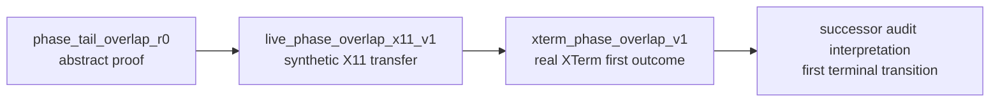
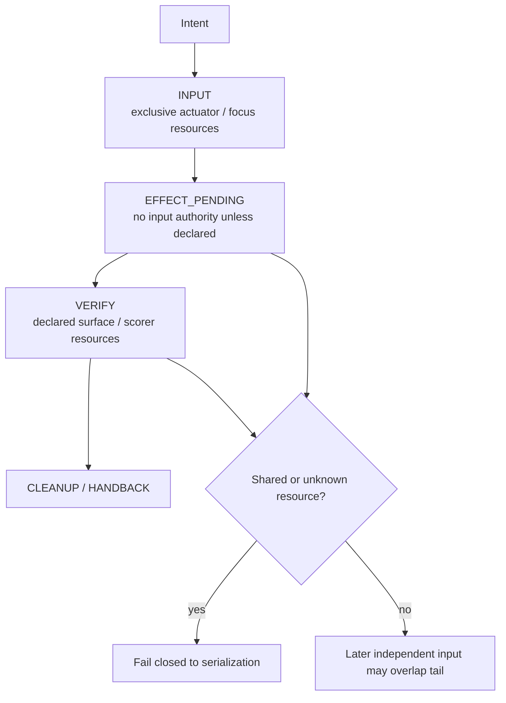

# Concurrency research

This directory contains retained studies of safe overlap and concurrency when the physical input actuator remains serialized.

The central question is not whether two inputs can be emitted simultaneously. It is whether a later intent may begin its input phase while an earlier intent is still waiting for an effect or verification tail, without sharing hidden resources or violating dependency order.

## Track lineage

The arrows show research lineage only. They do not rewrite the retained decisions: the XTerm v1 audit remains FAIL and must not be relabeled.

## Indexed studies

| Study | Retained disposition | What it establishes | What remains open |
|---|---|---|---|
| [`phase_tail_overlap_r0/`](phase_tail_overlap_r0/) | `PASS_PHASE_LEVEL_OVERLAP_SCOPED` | Under the frozen deterministic model, one serialized input actuator does not require whole-intent serialization when effect/verification tails are independent; longest-tail-first is optimal for the stated objective. | Real GUI applicability, unknown/shared resources, models/tokens, and production scheduling. |
| [`live_phase_overlap_x11_v1/`](live_phase_overlap_x11_v1/) | `PASS_LIVE_PHASE_OVERLAP_X11_SCOPED` | Transfers the phase-overlap shape to two X11 surfaces while showing a shared global resource can make overlap incorrect even with serialized input. | Real productivity applications, broader resource declaration, cross-platform transfer, and production runtime integration. |
| [`xterm_phase_overlap_v1/`](xterm_phase_overlap_v1/) | `FAIL_REAL_XTERM_PHASE_OVERLAP` | Retains a mechanically favorable XTerm first outcome but the frozen audit fails because it selects a later `done_already` diagnostic instead of the first terminal transition. | A no-rerun successor audit over the exact retained raw bytes; broader claims remain out of scope. |
| [`singleflight_socket_scope_6501_20261003_01a0ff53/`](singleflight_socket_scope_6501_20261003_01a0ff53/posthoc-v2/RUN_REPORT.md) | Original scoped PASS qualified; `PASS_POSTHOC_WIRE_BINDING_SCOPED` | Preserves the 24-trial/56-waiter native socket contrast (full-scope11/independent14 reads, four predicate-only wrong-scope refusals). Additive retained-data audit closes six v1 numeric-wire false accepts and rejects all14 controls; original source/raw/outcome are unchanged. | Live source/currentness, natural demand, cancellation, GUI T1, latency, arbitrary forgery resistance and runtime authority. |
| [#3992 three-batch checkpoint freeze / #4028](online_checkpoint_publication_3911_batches_v2/ARCHIVAL_QUALIFICATION.md) | `HOLD_PUBLICATION_INCOMPLETE` | Exact pre-execution freeze and qualified historical three-by-42 result/status record; raw/source/audit corpus remains unavailable from the source head. | Exact-byte recovery and committed readback under #3992/#4028; no rerun or substitution from the distinct nine-by-14 allocation. |
| [#6501 actual asyncio cancellation](singleflight_asyncio_cancel_6501_20261003_01a0ff52/repair_v3/) | `PASS_RETAINED_TRACE_V3_SCOPED`; V1/V2 audit coverage qualified | 48 actual event-loop conditions / 120 outcomes retain the shielding/ownership contrast. V3 adds the requested-waiter detach-before-gate join, rejects16 exact gate-only contradictions and retains25 prior refusals; original and V2 bytes remain unchanged, with no candidate rerun. | Renewed content review/application; trustworthy event emission, dynamic joins, TaskGroups, semantic equivalence, actual verifier/GUI/task-effect and measured efficiency; no runtime broker adoption. |
| [`singleflight_thread_exit_6501_01a0ff35/`](singleflight_thread_exit_6501_01a0ff35/) | `PASS_THREAD_LIFETIME_SCOPED` | Eight native executor/asyncio barrier rows distinguish wrapper cancellation from callable completion; Future-bound CLOSING prevents one early-rejoin overlap. | Arbitrary blocked I/O, scheduling, generation/clock trust, task effect and performance. |

## Concurrency boundary

Retained hot-drain ownership audit correction: [audit-v2](hot_drain_cancel_17_20261003_01a0ff52/audit-v2/README.md). The historical v1 PASS has demonstrated negative-FD and additional-open detection gaps; v2 preserves the original15 rows/75 closure witnesses and corrects only finite copied ownership records. Original RED and publication/whitespace failures remain. Neither original PASS nor this saved-data repair grants production, new native allocation, latency, GUI/task or private-original authenticity claims. Fresh scoped rescue checks are [recorded separately](../../runtime/results/hot_drain_rescue_3115/README.md).

This is a navigation model derived from the retained studies, not a new runtime contract. The exact resource declarations and scientific decision remain owned by each child report.

## Interpretation

- A single physical keyboard/pointer can still permit concurrency in non-actuator phases.
- Surface identity alone is not proof of independence; shared clipboard, focus, global state, verifier state, or dependency edges may force serialization.
- Unknown resources should fail closed to serialization rather than assume safe overlap.
- A favorable wall-time comparison does not override an audit failure or correctness violation.
- Phase-overlap evidence is separate from true multi-actuator concurrency.

## Read next

- [FD lifetime and late cleanup](fd_lifetime_6501_20261003_01a0ff52/REPORT.md): six retained Linux pipe rows distinguish unsafe integer-only closure from shared one-time ownership; harness release is cleanup, not cancellation success.

- Owned Linux pipe read cancellation evidence: [`owned_pipe_cancel_6501_20261003_01a0ff52/REPORT.md`](owned_pipe_cancel_6501_20261003_01a0ff52/REPORT.md) distinguishes wrapper cancellation, caller descriptor close and actual owned callable/resource completion in six frozen conditions; this is scoped construction, with no production/runtime or GUI claim.

- Current research method: [`../../docs/RESEARCH_METHOD.md`](../../docs/RESEARCH_METHOD.md)
- [Native Mac read completion and reader-close boundary](macos_read_cancel_6501_20261003_01a0ff52_93c2/REPORT.md) — eight saved native rows; wrapper cancellation is not native completion, no general portability or physical-release claim.
- Evidence ledger: [`../../RESEARCH.md`](../../RESEARCH.md)
- Integration studies: [`../integration/`](../integration/)
- Measurement/concurrency handback studies: [`../measurement/`](../measurement/)
- Research workspace map: [`../README.md`](../README.md)
- [Expired predicate retry and deadline-first qualification](predicate_retry_deadline_17_20261003_b64b/REPORT.md): retained finite counterexample and fresh-match tradeoff; private comparator only, no production adoption or hard-deadline claim.
- [Shared-result custody and retained delivery-to-return audit repair](singleflight_result_custody_6501_01a0ff35/REPORT.md) — original finite Windows characterization and later causal-join correction; not runtime adoption or native-effect proof.
