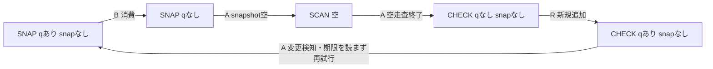

# キュー変更による期限確認の回避：有限モデルと保存検査

既存の7003で使った非採用の比較コードでは、`wait_notification` の全件不一致後、キューの同一性が変わると期限を確認する前に再試行する。この配置は、期限切れでも消費者A・消費者B・読取側Rが進み続ける循環を許す。容量1、純粋な判定、変更されない通知という有限の範囲で、モデルの全到達状態と全遷移を独立検査した。判定は **PASS_SCOPED_EXISTENTIAL_RETRY_COUNTEREXAMPLE**。本番で起きた遅延や、全スケジュールでの発生を報告するものではない。

## 固定した問いと判定

- H: 条件ロック外で判定する比較コードのキュー変更再試行は、期限切れ・全件不一致でも終わらない公平な実行を許す。
- T: 一つの到達グラフ列挙、別実装の保存データ検査一つ、実メソッドをASTから取り出した9条件の構築確認、11種の保存コピー改変と4種のJSON拒否確認。
- D: 全グラフとソース対応が一致し、比較コードにA/B/R全員が進む閉路があり、元コードと期限先行案にはAが進む非終端閉路がない場合に、上記の限定した反例をPASSとする。

割当 `17-PREDICATE-RETRY-DEADLINE-A01-20261003-b64b`。先行[claim](https://github.com/Unjuno/agent-interface/issues/17#issuecomment-5968478359)、実行前[freeze](https://github.com/Unjuno/agent-interface/issues/17#issuecomment-5968711865)。28入力・130526Bを11:25:28.587733UTCに固定し、コミット `b0c82e6278bce243412ce43c2042ff13f4787de3` を公開して全文読戻し後に実行した。FREEZEのSHA256は `d31514ba974e2a14946f79317c9801385ef9387d2a32fe1601d14297320c5d83`。

## ソースと抽象化

基準ソースは60d7734の `research/live_control/codex_app_server_client_v2.py`、6194B、SHA256 `6032c0dd1d7441977afca790d08d1f1012e8f18171691249456fcfe90097617e`。実行前に実際のmain1089e144を取得し、クライアントと6文書が同じバイトであることを確認した。比較対象のoutsideは7003の6822B・SHA256 `c05855b2c1129a67789f236d194fa5ae5e1929e72f7bd5a7acb936ffdd766569`。期限先行案は6989B・SHA256 `d938d6a630b1dd930ee1c092f7feae3f69085e5d30f094a70a56bec24548ba3a`。変更は同一性再確認より前に期限を確認する3行のみ。他のメソッドとシグネチャのASTは一致する。

| 記号 | 意味・型 | 単位・固定範囲 |
| --- | --- | --- |
| A/B/R | 不一致消費者、一致消費者、新通知の読取側 | 識別子、単位なし |
| pc | AのSNAP/SCAN/CHECK/DONE | 列挙型、単位なし |
| q/snap | キューとスナップショットの比較対象 | null/整数0・1、同一性トークン |
| expired/closed | 期限切れ・接続終了 | bool、true/false固定 |
| queue_capacity | キュー内通知数上限 | 個数1 |
| identity handles | 比較に関係する同一性 | 最大2、個数 |
| mocked clock | 合成した単調時刻 | float、秒、0/0.25/0.5/2 |
| timeout | 合成した期限までの幅 | 整数1、秒 |
| diagnostic cap | 構築確認で止める再試行回数 | 個数8 |

Aは常にFalse、Bは常にTrue、Rは空のキューへ同じ内容の新しいJSON辞書を追加する。辞書は途中で変更せず、取り除いた辞書を再投入しない。具体的な新規同一性は再利用せず、比較に関係するsnapshotとqueueの等値パターンだけを正規化する。判定に使わないPythonローカル変数に古い参照が残ることはあるため、あらゆる実行でPythonの生存オブジェクトが2個以下とは主張しない。

SNAPとCHECKはそれぞれ条件ロック内の一つの操作で、SCANはその間の有限な不一致走査。元コードでは、この有限走査から期限判定までを同じ条件ロック内の原子的操作に畳む。DONEは吸収状態でq/snapは不活性な記録として残る。BとRの各操作も条件ロック内で行う。Pythonの[Condition仕様](https://docs.python.org/3.12/library/threading.html#condition-objects)と[monotonic仕様](https://docs.python.org/3.12/library/time.html#time.monotonic)を参照したが、このモデルは実際のOS待ち時間を測っていない。

## 最初のモデル結果

| ポリシー | 到達状態 | 遷移 | Aが進む非終端閉路 | A/B/R全員が進む閉路 |
| --- | ---: | ---: | --- | --- |
| 元コードbaseline | 4 | 4 | なし | なし |
| 非採用比較outside | 16 | 28 | あり | あり |
| 単純な期限先行deadline_first | 17 | 24 | なし | なし |

列挙器はTarjan成分分解と閉路探索を使う。別に書かれた検査器はソースを実行せず、全到達集合・全遷移を表から再構成し、役割ビットを持つ閉路BFSで確認する。検査器のSHA256は `475df75dbe848bf87a679a921657a2c2f756340011857dabf56983e6a7a72795`。子ヘルパーは実装と静的確認を担当した。同じ研究者側のローカル補助であり、合議に必要な非著者票ではない。

保存された最初のoutside閉路は状態0に戻る5遷移である。先にBが通知を消費し、Aが空のsnapshotを取り、空走査を終え、Rが新しい辞書を入れる。CHECKでキューが変わっているため、Aは期限を読まずにSNAPへ戻る。この閉路のSCANは空なので、判定関数を呼んだ閉路と混同しない。

これは存在する実行の証拠である。各役割が毎周進むので、Aを一度も実行しない単なる飢餓を使っていない。発生確率、全スケジュールでの必然性、実スレッドの公平性や実時間での上限を証明しない。

保存された同じグラフには、不一致判定を毎周呼ぶ別の閉路もある。実行後の静的な辺の読取りで、到達する前置0→1と閉路1→3→7→12→15→1を選んだ。Aが通知xを不一致と判定し、Bがxを消費、Rが別のyを追加、Aが変更を検知して再試行し、yを次のsnapshotにする。各周にAの不一致判定1回とB/R各1回があり、具体的な辞書は新しくても同一性の正規形は戻る。原本のグラフと最初の閉路を書き換えたり、列挙を再実行したりしていない。

容量1と辞書の不変性は環境条件であり、本番読取側に容量制限を追加したという意味ではない。Bの消費は、途中で他者が割り込まない一つの選択可能な有限呼出しをまとめた操作で、Bの全割込み方は列挙していない。公平性は役割全員の進行というSPECの条件であり、個々の有効な遷移が必ず選ばれる強い公平性ではない。CHECKの前にB/Rが働くため、タイムアウトへの機会が繰り返し選ばれない実行が残る。

## 実メソッドでの構築確認と期限先行案の制約

Homebrew Python3.14.5で、3ソースから `wait_notification` だけをAST抽出し、合成時計と条件ロックで9条件を確認した。コンストラクター、実スレッド、ネイティブ相手プロセスは呼ばない。churnでは、Aが取り出した不一致通知を、同じ実メソッドを使うBが消費し、Rが新しい通知を入れる。この確認は上の空snapshot閉路とは別の、実際に不一致判定を呼ぶ経路である。

| 条件 | 元コード | outside | 期限先行案 |
| --- | --- | --- | --- |
| 不一致・キュー不変 | TimeoutError | TimeoutError | TimeoutError |
| 不一致・再取得前にキュー変更 | TimeoutError | 8周後に確認器がDiagnosticCutoff | TimeoutError |
| 新しい一致通知が期限前に到着、再取得は期限後 | この間隙の構築対象外 | MATCH、キュー空 | TimeoutError、一致通知が残る |
| 初めから一致通知、期限後のロック取得 | MATCH | この補助条件では未実行 | この補助条件では未実行 |

outside churnはA判定8回・B消費8回・R追加8回、条件ロック取得成功16回の後、17回目の確認器制限で停止した。期限時計を読むAの処理は初期値作成のみで、その後の8回の時計読取はBの初期化による。8周の観察から無限実行を推測するのではなく、無限に繰り返せるという根拠は有限モデルの閉路に置く。

新着一致条件の時計はA初期0秒、B初期0.25秒、R到着0.5秒、A再取得2秒、期限1秒。outsideは一致通知を返す一方、期限先行案は通知を残してタイムアウトする。これはoutsideとの一致優先意味の保存が失敗する例であり、元コードの初期一致優先という別の補助確認も残した。期限先行案の本番採用には、どの通知・取消し・期限を優先するかの契約が必要である。

最初のV1確認では、共通時計でB初期化が2秒だった後にR到着を0.5秒と記録していた。9結果自体とバイトを残し、期限前到着の解釈を **STOP_SYNTHETIC_CLOCK_ORDER** とした。V2では時計観測だけを修正し、モデル実行前に9条件を確認し直した。モデル・判定条件・3比較ソースは変更していない。V1は `first-source-controls-v1/` に残る。

## 実行・誤り検出・資源

モデルは11:27:06.719199–11:27:08.129747UTC、保存検査は11:27:08.165491–11:27:09.660249UTCにそれぞれ一度だけ実行し、終了コード0・stderr0。これは外側の実行記録であり、待ち時間性能のベンチマーク値ではない。MODELのSHA256は `22e1c128f4bff8b17aed8080b6161cbf73a4fac00fd5abc55e01764426a14597`。モデルをもう一度動かして公開結果を作っていない。

11の保存コピー変更（遷移欠落・重複・bool同一性・閉路役割・公平性・判定・到着時刻・共通時計・一致キュー・取得回数・ソースpin）を検査器が拒否した。重複JSONキー、NaN、Infinityへの数値オーバーフロー、壊れたJSONも拒否した。これは保存データ整合性の限定した確認であり、原本の真正性やあらゆる改変への耐性ではない。

自分のゲスト `research-6695-docker-01a0ff52` / `01M3ZNQT3203YNF70YT80E0A00` の専用Dockerを使った。固定イメージ `python@sha256:dddfd7e07f9d15aeeca61529320492139d21cac7f0070c00609243e51e4e0016`、実測Python3.12.15・Linux7.0.5-OrbStack・arm64。各実行の内部cgroupはCPU25000/100000、メモリ134217728B、PID32。network none、root/source読取専用、UID65534、cap drop ALL、30秒の外側停止限界、出力2MiB未満。runtime記録とDocker実際の終端状態を保存した。

環境確認・モデル・保存検査の3コンテナはexit0かつ非実行中で、専用エンジン実行中コンテナ0を確認し、自分のゲストを停止した。他ゲストには操作していない。終端確認の最初の外側JSON読取が `record.id` を `id` と読んでKeyErrorになったため、エラーと全コマンドストリームを残した。保存済みJSONの解釈だけ直しており、モデル・検査・停止コマンドを再実行していない。

## 適用範囲

この成果は有限回復契約に必要な再試行の反例と、単純修正の意味変更を保存する研究資料である。7003の既存4ネイティブ構築結果と原本は変更せず、そのCondition保持による因果観察を取り消すものでもない。outside comparatorの全呼出し期限や意味同値性を証明する資料として7003を使えないことを、さらに具体化する。

本番クライアントの修正・ランタイム採用・実ゲーム・モデル・GUI・物理キー解放・入力取消し・有用タスク効果・全経路の回復上限・トークンや資源削減は示していない。Issue17/59/57、r134の統合ゲート、FINAL-v5全体は未完了。公平な有限モデルを現実のOSで測定した証拠と扱わない。

公開物はPythonを `.py.txt` とした不活性な資料、JSON/原ストリーム/損失のないデータ保存のみ。新しい非著者2票、実際の当時mainとの全予定tree・raw ordered parents・依存適用性を非著者が確認し、別の唯一の送信者が最新の規則・権限・所有・取消しを確認してexpected-oldの前進main更新を行う必要がある。子ヘルパー・過去の7003/6953票を移さない。現在は適用ID・main送信者とも未設定。共通48時間起点とglobalNは不明のままで延長していない。

公開結果コミットの最初の空白検査は、Git pushの原stderrにある末尾空白4行を拒否した。原ストリームと診断を削らずbase64表現で保存し、別の公開用インデックスで再確認する。科学結果を再実行せず、空白検査も弱めない。対応は publication-byte-mapping.json に明示した。
