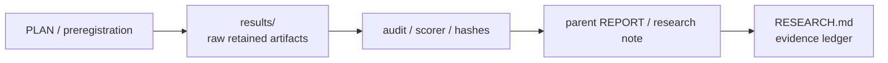

# Retained live-control results

This directory contains committed live-control result artifacts, raw traces, audits, and retained failure/success allocations referenced by reports under [`../`](../).

Directory presence is **not** a promotion signal. Scientific interpretation belongs to the corresponding report/plan/audit and the top-level [`../../../RESEARCH.md`](../../../RESEARCH.md).

## How to read this directory

This is a provenance/navigation diagram, not a guarantee that every historical allocation contains every artifact type.

## Naming and interpretation

- Result directories generally identify a retained allocation, fixture, comparison, or development run; exact naming conventions vary across historical work.
- Standalone `*-audit.json` and similar files are retained audit outputs tied to the corresponding source/report; they do not replace the report's scope statement.
- `PASS`, `FAIL`, `HOLD`, `STOP`, construction-only, and superseded outcomes can all be retained here.
- A later repaired successor does not rewrite or delete the earlier retained failure.
- Do not infer current project status from the newest-looking directory name; use [`../../../docs/CURRENT_GOAL.md`](../../../docs/CURRENT_GOAL.md) and [`../../../docs/LOCAL_RESEARCH_HANDOFF.md`](../../../docs/LOCAL_RESEARCH_HANDOFF.md).

## Notable retained composition failure

- [Admission-baseline accepted-event sink failure A02](admission-baseline-sink-composition-a02-20261004/README.md) — the one-shot fake-sink experiment reproduced a STOP with an unstarted worker, retained active slot/backend lease, and `close()` join exception. Its setup STOP, first auditor failure, raw, and corrected saved-data audit are preserved; no live task or recovery claim follows, and the consumed candidate must not be rerun.

## Recovered #59 wheel and cleanup evidence

- [Cleanup carrier review](cleanup-carrier-review-e0cc-20261005/README.md) — preserves the exact-parent cleanup mutation results and publication provenance. It records a surviving mutation before strengthening the receipt-membership assertion; synthetic/local scope only.
- [Wheel cleanup on the #7974 successor](wheel-successor-regression-e0cc-20261005/README.md) — preserves RED/GREEN and combined successor results, including prior failure and bounded synthetic scope.
- [Earlier wheel cleanup validation](wheel-cleanup-regression-20261005-01a0ff52/validation.json) — preserves the original validation receipt separately from its later successor composition.

These are historical experimental records. They do not promote runtime behavior or establish physical input, live application effects, or broad performance claims.

## Fresh runs

Do not overwrite committed retained result directories. Fresh local experiments should write to a new allocation path or ignored local artifact location according to the experiment's own instructions, then retain only the intended evidence through the normal research workflow.

## Related navigation

- Parent track: [`../README.md`](../README.md)
- Research workspace: [`../../README.md`](../../README.md)
- Evidence map: [`../../../docs/EVIDENCE_MAP.md`](../../../docs/EVIDENCE_MAP.md)
- Research method: [`../../../docs/RESEARCH_METHOD.md`](../../../docs/RESEARCH_METHOD.md)
- Evidence ledger: [`../../../RESEARCH.md`](../../../RESEARCH.md)
