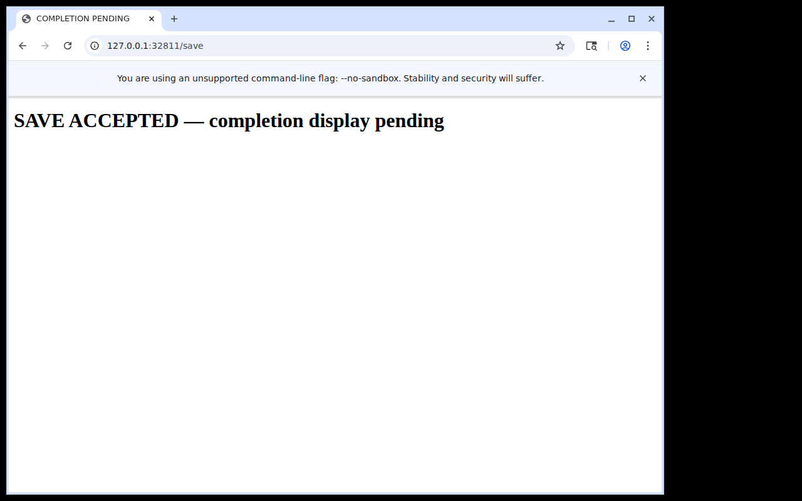
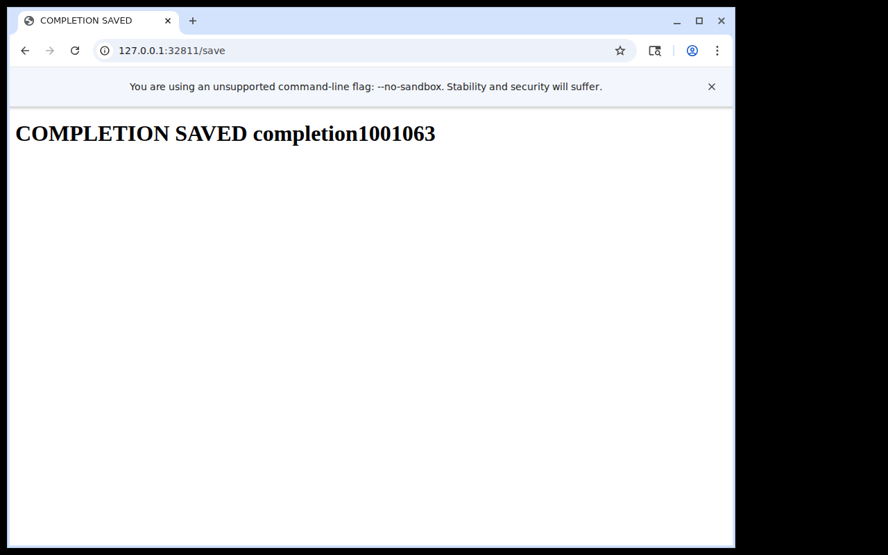

# One explicit observation after incomplete Save feedback

**PASS_COMPLETION_OBSERVATION_SCOPED**, in one authored delayed-acknowledgement
case. Mechanical audit independently passes; visible cue interpretation is an
explicit primary declaration from the original images. No generic semantic
detector, automatic retry, sensor, or wait-default change is introduced.

This is a fresh integration-boundary allocation, seed 1001063, using the built
public runtime at source `0ea5f4a757775ee6a783ca12bc30000423cc41bf` on WSL 3.0.1.0,
Ubuntu 24.04.4, Python 3.12.3, Node 24.13.1, Chromium 145.0.7632.6 and a private
X11 display. The original comparison04 and production-spine cases are untouched.
The new fixture's completion label is authored to appear 1500ms after loading
the Save response. This delay is an exposure condition, not a recommended wait.

## Frozen question and executed outcome

The preregistered hypothesis asks whether completed neutral input can return a
pending image, while one explicit fresh same-session observation provides the
task-bound completion cue without replay. The frozen budget allows only one
Save and at most one follow-up observation; an absent fresh cue remains HOLD,
an unexpected refusal/error is STOP, and no case retry is allowed.
`case/PLAN.json` in the archive pins the built runtime, caller, fixture, source
dependencies and stopping rules before the fixture started.

The primary used the public relay through the shipped sequential caller:

1. Observed the new browser and navigated to the declared task.
2. Visually grounded the field and Save button, then issued one Save program.
3. Reviewed its completed, neutral-release receipt and original **pending** image;
   explicitly withheld the visible-completion claim.
4. Issued one `interface_observe` through `primary.observe()` on the same live
   session, with no text, click or navigation replay.
5. Reviewed the new original image showing **COMPLETION SAVED completion1001063**,
   then closed the public session and host.





The independent append-only history contains exactly one POST to `/save`, with
`value=completion1001063`. The explicit observation has `input_dispatched=false`
and no side-effect authority; its distinct observation ID and later capture
bracket establish new acquisition. Different pixels are not required by that
contract. Both input programs and public close verify empty keys/buttons.
Host exit and fixture keeper are 0. Owned child cleanup is `[0,1,1]`; terminal
cleanup does not mean every child exited successfully.

Accounting: **7 public calls, 2 input programs, 108 program emissions, 4 original
images, 1 additional observation, 800ms of requested fixed program delays**.
No historical result lookup, image fallback preview, repeated Save or allocation
retry was used. [Actual per-response usage](usage-projection.json) is retained
for the five outer calls from first observation/connection setup through host
close: input **614,948**, cached input **603,520** (subset), uncached input
**11,428**, output **1,170**, reasoning output **73** (subset), total **616,118**.
Cache-write input is zero; no repeated response ID or missing chronological
call association was found. Requested configuration is `gpt-6.1-sol / medium`,
not an attestation of the provider's internal revision. These five outer calls
are distinct from seven public MCP calls. The explicit boundaries are in
[usage-selection.json](usage-selection.json). Whole-context usage is not an
isolated charge for this task and excludes prior construction. Dollars are
unavailable, not zero. The projection uses the shared read-only scanner from
PR #5925 and excludes private conversation text.

## Timing and limits

[metrics.json](metrics.json) retains each image's capture bracket and host
send/reply/presentation/review intervals. Save request to image callback completion
was **504.2523ms**; the explicit follow-up observation was **88.6975ms**. The
initial connection/observe interval was **1642.2810ms**, also retained. These
numbers include transport/presentation and requested program waits, and exclude
between-call deliberation. For example Save request to its primary review was
8486.5958ms, while fresh-observation request to its review was 13205.9919ms.
Review annotations are not exact model perception/inference timestamps.

No browser redraw acknowledgement or independently timestamped first visible
completion event was instrumented. The single pending and subsequent complete
captures therefore do not establish first-useful-feedback latency, semantic
completion latency, human tempo, causal speedup, a universal polling budget or
all-in efficiency. The authored case qualifies the existing continuation path
and its explicit completion-claim boundary. Issues #57/#59 remain open.

## Retention and reproducible read-only audit

`raw.tar.gz` retains 65 original files: frozen source/build, private-session
readiness/allocation, requests/replies, original PNGs, reviews/acknowledgements,
host events, independent submission, finish and cleanup. Archive SHA-256:
`31c7dfb13ef5a0853f96c26f671a8da21aa56fe81cd05abd82872c9272c0c1ad`.
The audit validates the archive/member manifest, frozen hashes, exact-once value,
complete request schedule, image/review binding and review-before-next-request,
same-session fresh no-input acquisition, terminal host and neutral release.
It does not execute archived code or infer image semantics from a declaration.

```sh
python3 runtime/results/completion-feedback-01/audit.py
python3 -O runtime/results/completion-feedback-01/audit.py
python3 -m unittest discover -s runtime/results/completion-feedback-01 -p test_audit.py
python3 -O -m unittest discover -s runtime/results/completion-feedback-01 -p test_audit.py
```

Two test methods include the original package and seven corruption controls:
duplicate submission, wrong value, replayed input, changed PNG, changed frozen
caller, missing fresh-image review and missing finish. All pass normally and
with `-O`. The first archive-only test failed because its loader only read
unpacked directories; adding manifest-checked archive reading repaired that
packaging defect without rerunning or modifying the original allocation.
