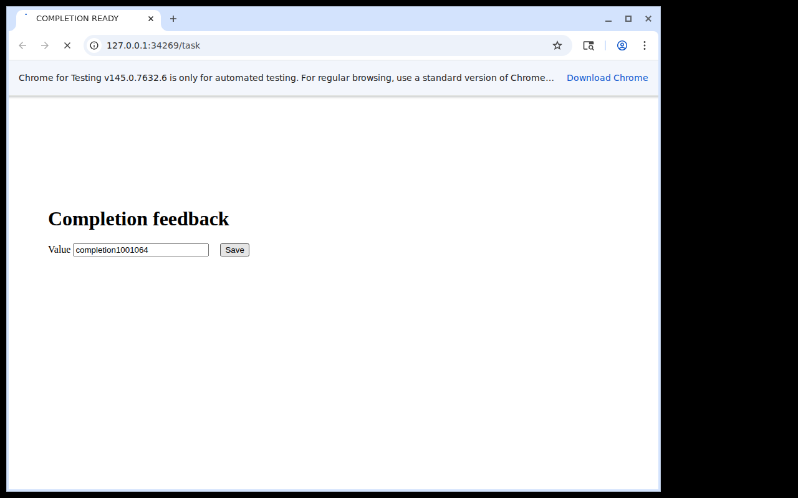
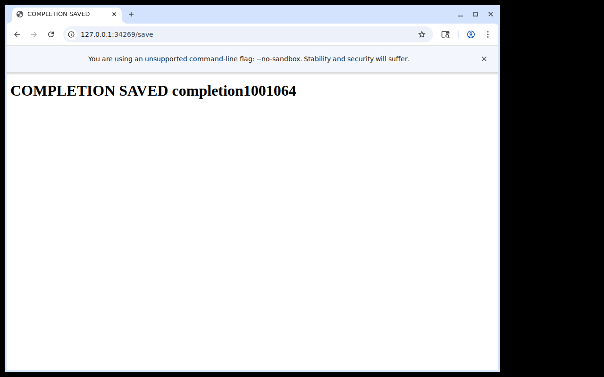

# Primary batch registration integration

**PASS_PRIMARY_BATCH_USE_SCOPED** for the optional sequential primary helper.
The existing server batch operation is now exposed as
`primary.mintMany(sourceSequence, references)`. Complete syntax is validated and
copied before sending. Partial registration, missing references or mismatched
source/alias inventory returns the original evidence and stops later ordinary
calls, including another batch attempt. Explicit close remains available.

This does not make registration atomic: earlier successful registrations remain
after a failure and the failed alias may be uncertain. No action queue, rollback,
sensor, automatic renewal, retry or input replay is added. Fresh visual guards
and ordinary admission are still required for each later input.

## Fresh primary use

The one-shot allocation froze source
`35c640b3b357c61e6c1cb7c838a5e147a3c07c4a`, caller/fixture/build/dependency hashes
and decision gates before starting. Seed 1001064, private WSL 3.0.1.0 / Ubuntu
24.04.4 / X11 / Chromium 145.0.7632.6. Python 3.12.3 and Node 24.13.1. The browser
was set up at its declared task URL; this is not a paired acquisition-cost run.

The primary reviewed the original form, registered field and Save-hover aliases
from sequence 1 in **one** public request, read their ordered offsets and finite
lifetimes, entered the declared value and moved to Save. After reviewing the
hovered image at sequence 10, it explicitly minted a unique click alias before
the single Save click. The Save image still showed the entered form and loading
indicator, so the primary withheld completion and made the one allowed extra
observation. That image showed `COMPLETION SAVED completion1001064`.





Independent append-only history contains exactly one POST `/save` with
`value=completion1001064`. The batch sent no input. All three input programs and
public close verified empty keys/buttons. Host and fixture keeper exited 0;
owned child cleanup is `[0,1,1]`, retained without calling every exit successful.
No unexpected refusal, allocation retry, historical lookup or extra preview.

Recorded accounting: **8 public calls, 3 programs, 45 program emissions, 5
original response images, 400ms requested program waits, 2 initial references
in 1 registration request, 1 explicit hover remint and 1 extra observation**.
The authored completion-label delay is 1500ms; it is an exposure condition,
not a wait recommendation. The partial-registration STOP is construction-test
evidence, not a live failure-injection result.

## Validation and retention

The new 18 Node tests initially failed for the missing helper and missing
partial-result STOP. All 104 host tests now pass. Shared native checks pass
345 protocol and 156 harness tests; complete logs are in `local-ci/`.
CI explicitly runs the new helper tests. Frozen experiment inputs and the
original source remain unchanged when later evidence is added.

`raw.tar.gz` retains **132 original files**, including source/build, initial
batch, original guarded requests/replies/guard captures, presented images,
reviews and acknowledgements, independent history, host events and cleanup.
Archive SHA-256:
`a47658c3cae31641789aa1bad308a80e27c041da4d5f161c7fc6b9e15e125d7d`.

The separate raw-only audit checks archive/member and frozen-source hashes,
exact-once value, complete eight-call schedule, same-source complete batch,
ordered aliases/offsets/lifetimes, explicit hover-source remint, fresh VALID
guards, no-input continuation, original image/review binding, review ordering
and neutral release. It never runs archived code or infers semantics from a
review declaration. The primary personally reviewed the original PNGs.

One test method accepts the original and rejects eight mutations: duplicate
submission, wrong value, missing batch alias, wrong batch source, old click
source, input replay, changed frozen primary helper and missing final review.
Normal and optimized audits/tests pass. The initial audit incorrectly assumed
one PNG per guarded call; selecting the exact returned artifact repaired that
auditor assumption without modifying or rerunning the allocation.

```sh
python3 runtime/results/primary-batch-01/audit.py
python3 -O runtime/results/primary-batch-01/audit.py
python3 -m unittest discover -s runtime/results/primary-batch-01 -p test_audit.py
python3 -O -m unittest discover -s runtime/results/primary-batch-01 -p test_audit.py
```

This is an integration/usability result for a known authored case, not a matched
single-mint comparison. One actual request registering two references does not
establish latency or model-token savings. Explicit execution-window usage is
retained separately; it excludes construction and is whole-context, not an
isolated task charge. Dollars remain unavailable. First useful feedback,
semantic completion latency, causal benefit, human tempo and broad GUI reliability
remain unproven. Prior frozen allocations and STOP/HOLD results are untouched.

The [execution-window usage projection](usage-projection.json) covers first
observe/connection setup through host close: eight outer responses, requested
`gpt-6.1-sol / medium`, input **1,414,016**, cached input **1,399,040** (subset),
uncached input **14,976**, output **1,636**, reasoning output **78** (subset),
total **1,415,652**. Cache-write input is zero. No duplicate response ID or
missing chronological call association was found. The [explicit call-ID
selection](usage-selection.json) and source-record hashes are retained without
private conversation text. Chronological association is not provider-attested
per-tool attribution; requested model metadata is not an internal model revision.
This whole-context total excludes cold construction and is not comparable to
the prior different-route case as an efficiency estimate.
