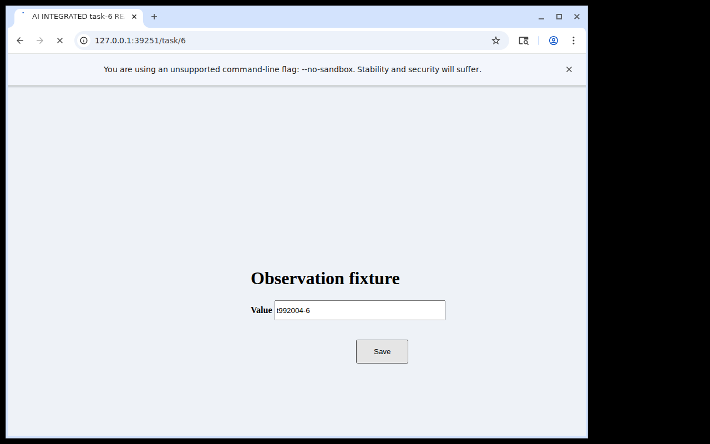

# Direct task 6 visual erratum and remaining observation boundary

This is a read-only correction to the interpretation of retained comparison04
evidence, not a new task allocation or a change to the original outcome.

## Correction

The original README's “/submit/6 URL” description, the same phrase in
[the #2789 update](https://github.com/Unjuno/agent-interface/issues/2789#issuecomment-5912227989),
and the reason in archived `current/direct/host/review-19.json` are incorrect
about the displayed address. The exact direct task 6 Save image shows
`127.0.0.1:39251/task/6`, the entered value `t992004-6`, and the form's Save
button. It does not show the final `AI INTEGRATED SAVED` acknowledgement.
The image below is an unchanged copy of the original PNG, not a new capture.

The independent append-only submission history still contains exactly one correct
submission for task 6. Both routes retain their six exact-once submission records.
Thus `PASS_PUBLIC_SIX_TASK_CORRECTNESS_SCOPED` and the visual-completion limitation
remain supported; `HOLD_INTEGRATION_INCOMPLETE` is unchanged. The URL correction
does not turn a successful independently scored submission into a failed task.
Nor does a saved-effect record prove that its acknowledgement was rendered or seen.

The original archive, review reason, metrics, verifier and prior STOP records remain
unchanged. This addendum supersedes only the incorrect displayed-URL description.

## Exact provenance

Reviewed main snapshot: `6bb7cc0e4a6cee98d70ad1d3b024f2a84a46367b`.
Original allocation source: `7477466a9c11442a7af307fc5bc20e1ee5dd9863`.

- Archive Git blob: `e988bc8b0262fe6340d3c7b1cd7321b950da7d68`
- Archive SHA-256: `811e63849956658bdbb0fecc1a7237308dd93c71d96644050b1581bc243c4dd2`
- Archive size: 5,321,120 bytes; 1,051 regular-file members; 10,553,488 unpacked bytes
- All member lengths and SHA-256 values match the original manifest
- Save request/reply: `current/direct/host/request-19.json` / `reply-19.json`
- Save call ID: `ad8d4e2bf5a44440abcb5681082c8591`
- Save reply SHA-256: `e833903bc250c04feac449d994aca30b8ed22b3ee8457d0ab682606fa74a3b58`
- Native PNG: `current/direct/server/ad8d4e2bf5a44440abcb5681082c8591/images/9e6c4f96438b4014b42643088020c68e.png`
- PNG SHA-256: `0023463ae6bb2d8e0f7374d8a575137cb75a976f3a46166b9c66461f925bb3f6`; 29,839 bytes

The returned image block, retained native PNG and review's image digest agree.
The host records presentation of reply 19. Request 20 is `interface_results`
for that same call, with `operation_invoked=false`, the same capture timestamp
and byte-identical PNG. Its image was not presented by a host callback. Request 21
is `interface_close` with verified release. The complete direct request inventory
is 1–21; no fresh observation follows task 6 Save.

The retained fixture `received_ns` is 859096079120 and the Save capture's
`capture_started_ns` is 859174961552. Their arithmetic difference is
78.882432 ms. The fixture uses `time.perf_counter_ns` while the native backend
uses `time.monotonic_ns`; this correction does not establish their common-clock
binding or infer chronology/latency from that subtraction. Neither a response-write
acknowledgement nor a redraw acknowledgement is retained at this boundary, and
no browser/rendering cause or eventual visible-acknowledgement time is established.

[Mechanical audit details](task6-visual-audit.json) bind these records. The audit
used only archive, hash, JSON and Base64 parsing; no archived code was executed.
The displayed URL and absent SAVED text were independently visually reviewed.
This is an independent agent review, not external human peer review.

## Smallest prospective observation plan

The historical session is already closed. Its missing fresh frame cannot be
reconstructed by rereading `interface_results` or by relabeling a future run.
Current public `interface_observe` explicitly captures once without input and
does not itself certify redraw or task completion.

For the integration owner's next separately authorized live allocation:

1. Freeze the current source/archive, fixture/task identity, same-session target,
   capture region, completion cue, observation budget and stopping rule before
   input. Preserve comparison01's construction STOP, comparison02's restart STOP
   and comparison03's caller STOP.
2. When a completed/released Save image lacks the required acknowledgement,
   withhold the visual-completion claim. Permit at most one explicit fresh
   `interface_observe` on that same still-live direct session. Do not repeat Save,
   text, clicks or navigation; do not substitute historical result retrieval.
3. Retain the new call/capture identity, original PNG, host delivery callback,
   primary cue declaration, before/after independent submission count and release/
   close evidence. A new capture can be byte-identical to the old frame, so capture
   identity and acquisition records, not image inequality, establish a new observation.
4. If the fresh image shows the frozen task-bound completion cue and the independent
   submission remains exact once, report scoped completion-observation evidence.
   If the cue remains absent/ambiguous, retain `HOLD_VISUAL_COMPLETION_UNCONFIRMED`;
   if the session or evidence is missing, retain STOP. Do not keep observing until
   PASS, raise the wait automatically, or infer a successful later frame.

This plan has not been executed here and is not an authorization to run it.
It does not repeat the already-consumed Calc 50/250 ms comparison under #3700,
justify a wait default, or establish causal speed, model perception, tokens/cost,
human tempo, broad GUI reliability or overall integration acceptance.
