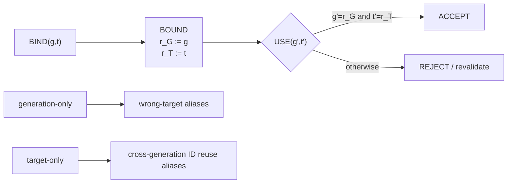

# Register automaton dynamic identity R0 — retained result

Issue: #1826 (successor to #1712; related target-handle boundary #45)
Task: `REGISTER-AUTOMATON-DYNAMIC-IDENTITY-R0-20260919-001`
Publication branch: `research/register-automaton-dynamic-identity-1826`
Frozen base: `c5f15e7c254d36a1f8ab29b364b6430a6925eb36`

## Decision

`PASS_REGISTER_AUTOMATON_IDENTITY_SCOPED`

This is an analytical finite-model result. It establishes an exact representation boundary for generation-scoped target identity; it does **not** establish automatic interface learning, GUI transfer, latency/token savings, total memory compression, or production runtime correctness.

## Result at a glance

The exact frozen behavior requires retaining both identity dimensions. Across all 2,238,016 formal bound/query cases:

| policy | mismatch | unsafe accepts | false rejects |
|---|---:|---:|---:|
| `TWO_REGISTER` | 0 | 0 | 0 |
| `GENERATION_ONLY` | 184,960 | 184,960 | 0 |
| `TARGET_ONLY` | 184,960 | 184,960 | 0 |
| `CONTROL_ONLY_ACCEPT` | 2,219,520 | 2,219,520 | 0 |

Independent renaming-equivariance check: 2,916/2,916 preserved, mismatch 0.

## Analytical result

For nonempty finite generation set `G` and target set `T`, every bound prefix `BIND(g,t)` is distinguishable from every other by suffix `USE(g,t)`. The unbound prefix is also distinguishable from each bound prefix. Therefore a deterministic literal no-register FSM requires at least

`|G|*|T| + 1`

distinct residual states. The direct literal construction reaches that bound, so it is tight.

A typed register construction needs only two control states (`UNBOUND`, `BOUND`) plus the dynamic values `r_G,r_T`. It is exact for arbitrary identifiers because its transition guard depends on equality relations rather than literal names. The full proof, induction and unit/type check are in `PROOF.md`.

Important precision: this is symbolic control-graph compression/domain-parametric reuse, **not** total memory-bit compression. The registers still store the dynamic identifiers.

## Why both registers matter

Two minimal counterexamples are enough:

1. Generation-only: bind `(g,t)`, then query `(g,u)` with `u != t`. The reduced policy accepts the wrong target.
2. Target-only: bind `(g,t)`, then query `(h,t)` with `h != g`. The reduced policy accepts target-ID reuse across generations.

Thus session/generation scope and target identity are orthogonal evidence dimensions in this equality-sensitive core.

## Formal execution

Source-first freeze was committed before the only retained formal invocation. Remote GitHub blob SHA readback matched the locally computed Git blob SHA for all four frozen source files.

- Python: 3.13.5
- kernel: Linux 6.18.44 x86_64
- formal cases: 2,238,016
- formal invocation: 1
- reruns: 0
- post-freeze tuning: 0
- formal wall time: 9.97 s
- formal max RSS: 92,840 KiB
- audit wall time: 9.56 s
- audit max RSS: 93,220 KiB

Timing conditions are retained metadata only; they are not a benchmark claim.

The formal row stream digest is:

`80bd94c245baaadb41c2723ccb752021e97ec202defb93e1eef319742c970583`

## Independent audit

The auditor does not import candidate policy functions. It independently reconstructs the oracle, policies, lower-bound witness counts, row digest and renaming check.

- audit errors: 0
- summary-count corruption detected: yes
- stream-digest corruption detected: yes
- lower-bound corruption detected: yes
- audit decision: PASS

The exact pretty-printed full outputs were 50,514 bytes (`RESULT.json`) and 50,327 bytes (`AUDIT.json`). The repository retains compact semantic summaries plus SHA-256 commitments and an exact reconstruction command rather than duplicating the complete 256-domain witness arrays. Expected full-output hashes are in `OUTPUT_HASHES.sha256`.

## Design consequence for #1712

Register-style state is justified when current action validity depends on dynamic identity that cannot be safely collapsed into finite control. For generation-scoped targets, the minimal exact symbolic contract must retain both the generation and target value (or an equivalent typed tuple). A literal FSM can implement the same semantics only by enumerating all bound pairs.

This supports a narrow design rule:

> Separate stable control mode from dynamic identity data; do not encode unbounded/session-varying IDs as permanent control states, and do not drop an identity dimension that participates in the validity predicate.

It does **not** choose a learning algorithm for discovering register automata. The next meaningful successor, if pursued, should test a richer relation (for example order/version monotonicity or alias-resolution) rather than repeating equality-only identity.

## H/T/D/C/U result

**H — PASS within the frozen model.** The literal lower bound is tight; two typed registers are sufficient; one-dimensional projections are unsafe.

**T — completed.** Direct proof, one source-frozen 2,238,016-case formal, exhaustive 3x3 renaming check, independent full recomputation and three corruption controls.

**D — PASS.** Two-register mismatch0; all reduced controls have unsafe accepts; equivariance mismatch0; lower-bound reconstruction agrees; audit errors0; corruption controls3/3.

**C — retained.** Equivalent typed tuple storage is semantically the same retained data. Richer predicates may require order/register extensions or other state models.

**U — material.** Equality-only finite semantics; no natural frequency distribution or empirical GUI/backend evidence. Sampling uncertainty is absent because the frozen finite model is exhaustively enumerated, but model-form uncertainty remains: real interfaces may require relations not represented here. No combined statistical `u_c` is meaningful for this deterministic theorem; the dominant uncertainty is specification adequacy, not random measurement error.

## ERROR CHECK

- no prior result or closed issue was modified or relabeled;
- no shared runtime/workflow/history path changed;
- dedicated branch and additive namespace only;
- source was frozen and remote blob-verified before formal;
- retained formal invocation count is 1; reruns0; post-freeze tuning0;
- independent audit passed with all corruption controls;
- claim is scoped to the stated equality-sensitive model.
