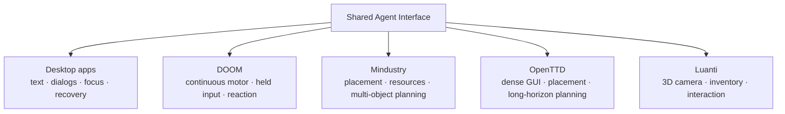

# Benchmark discovery

> **Directory role:** benchmark/domain discovery and coverage evidence. This area identifies capability axes, feasibility, scoring gaps, and candidate task domains; it is not a difficulty ranking or a formal benchmark suite.

## Navigate

| Need | Read |
|---|---|
| Current project objective | [../../docs/CURRENT_GOAL.md](../../docs/CURRENT_GOAL.md) |
| Evidence ledger | [../../RESEARCH.md](../../RESEARCH.md) |
| Public evidence map | [../../docs/EVIDENCE_MAP.md](../../docs/EVIDENCE_MAP.md) |
| Domain coverage matrix | [Domain Coverage Matrix](#domain-coverage-matrix) |
| Executed feasibility study | [Executed study and feasibility comparison](#executed-study-and-feasibility-comparison) |
| Initial-state / failure findings | [Initial-state and failure findings](#initial-state-and-failure-findings) |
| Task pilots / adoption gates | [Task pilots and adoption gates](#task-pilots-and-adoption-gates) |
| Evidence / reproduction | [Evidence and reproduction](#evidence-and-reproduction) |

## Coverage map

These domains expose different failure classes. They must not be averaged into a single difficulty score or treated as substitutes for one another.

## Recent linked evidence

[Live changed-target refusal](LIVE_MENU_MUTATION.md): actual pixel/focus mutations produce zero input admissions; first transport failure retained and strict intent types corrected.

[Live bounded menu intent](LIVE_MENU_INTENT.md): new observation plus local target check permits one click after model delay; fresh-capture-to-click358ms, fixture-specific scope.

[Live model freshness boundary](LIVE_FOCUS_BOUNDARY.md): real model call ages observation from116ms to12.6s; configured stale veto sends observe-only, exposing a potential no-progress loop.

[Equal-policy focus model pair](FOCUS_MODEL_PAIR_V2.md): six explicit-rule checks pass with3–10% fewer input tokens; synthetic freshness, no live speed claim.

[Actual focus model pair](FOCUS_MODEL_PAIR.md): input reduced, but decision acceptance failed; four outputs retained with rubric/confounding limitations.

[Assistant focus recovery](MINDUSTRY_FOCUS_SELF_USE.md): actual Alt+Tab restores game focus, then a fresh pointer action succeeds; recovery overhead remains72 seconds.

[Socket focus interruption](MINDUSTRY_SOCKET_FOCUS.md): same-action stopped/terminal recovery verified in actual Mindustry; first evaluation timeout retained, corrected fixture run passes.

[New runtime actual construction](MINDUSTRY_BEND_V2_SELF_USE.md): assistant builds eight directional targets, independently delivers49 copper; four programs/18-frame audit pass. Known task;85-second episode does not establish human tempo.

[Anchor-first Conveyor selection](MINDUSTRY_ANCHOR_FIRST_SELECT_V2.md): one
verified click-free Mindustry palette receipt lets Luna-low bind and select
Conveyor. Hover reply is909.187ms; selection oracle completes23.538s after the
decision start with9,300+8,115 input tokens. The first fixed-row presentation
failure is retained; evidence-size-aware v2 passes15-frame Windows/WSL audit.
Selection-only fixed layout; no placement or human-tempo claim.

[New runtime cancellation in Mindustry](MINDUSTRY_RUNTIME_CANCEL.md): actual GUI scripted interruption releases input, suppresses tail and supports fresh observation; game task correctly remains unsatisfied.

[Bent-route actual self-use](MINDUSTRY_BEND_SELF_USE.md): the assistant built all eight directional targets; independent post-control delivery46 copper, exact18-frame audit and112-tile guard pass. Known task, older runtime, no speed claim.

[Bent-route calibration](MINDUSTRY_BEND.md): eight direction-specific targets deliver 33 copper in the complete engine-authored case; wrong-turn and empty cases fail. This prepares a changed-geometry pilot, not agent construction success.

## Domain Coverage Matrix and Linux feasibility — 2026-09-13

[Mindustry actual construction](MINDUSTRY_BUILD_SELF_USE.md): one assistant visual
episode builds six conveyors through shared pointer input, preserves the 112-tile
guard and delivers 48 copper during a separate post-control window. Wrong block
selection and accidental plan cancellation required recovery. Known task only;
145 seconds to final input terminal does not establish human-like tempo.

[Mindustry flow-score calibration](MINDUSTRY_FLOW.md): six engine-authored GUI
states distinguish complete, missing, reversed, partial, extra and empty routes.
The extra route delivers 31 copper yet fails the 112-tile guard. These are scoring
controls, not agent construction success or formal benchmark adoption.

[Mindustry readiness self-use](MINDUSTRY_READINESS.md): the assistant resumed,
observed unit spawn, moved right and paused using the unchanged OpenTTD backend.
The initial save has no live player unit; save equality is not input readiness.
Twelve exact frames and final independent samples support movement, not gameplay
or resource-flow success. End-to-end tempo remains far from demonstrated parity.

[Mindustry pinned-save follow-up](MINDUSTRY_RESET.md): four fresh GUI reloads of
one archived save match all 75,000 measured tile rows and initial core copper.
Reload screenshots also match. Player/input readiness, resource-flow scoring,
and resumed trajectories remain unverified; this is not benchmark adoption.

Follow-up: [OpenTTD oracle calibration](../openttd_oracle/README.md) now tests
actual empty/partial/complete/extra-placement states on two seeds. This is a
separate narrow scoring study; the discovery results below remain unchanged.

Later task evidence: [one OpenTTD visual self-use episode](../openttd_task/SELF_USE.md)
passed the small independent road contract with the shared pointer candidate.
This adds toolbar/placement coverage, without formal adoption or a speed claim.

[Guarded placement follow-up](../openttd_task/GUARDED_PLACEMENT.md) now distinguishes
an overlong-drag replay (old score passes, surrounding-state score fails) from a
corrected visual episode. This strengthens local placement scoring, not adoption.

[Desktop pointer transfer](../live_control/DESKTOP_POINTER.md) now covers one
Inkscape visual select/drag/save episode through the same candidate. Four scripted
trials expose inaccurate object displacement despite successful pointer programs;
dense path sampling alone did not meet the declared precision check.

**Decision: keep DOOM as one orthogonal stress domain. Shortlist OpenTTD and
Mindustry for the next task-level pilots; retain Luanti as the 3D candidate.**
None of these three is adopted as a formal benchmark yet. No result here is a
shared-runtime success, assistant gameplay success, or qualifying freeze revision;
the later self-use episode is separately linked above.

The initial OpenTTD placement and Mindustry readiness/construction pilots have now run.
The next domain work is fresh route geometry and event-driven recovery, with
independent placement and delivery scoring. The score measurement validation
follow-up is documented in [MINDUSTRY_WINDOW_VALIDATION.md](MINDUSTRY_WINDOW_VALIDATION.md).
This ordering follows coverage gaps, not a ranking of game difficulty.
Mindustry remains the priority real-time planning candidate. Linux/X11 is the
scope; Windows/macOS compatibility is not a selection criterion in this phase.

## Domain Coverage Matrix

Requirements below describe the domain, **not demonstrated agent capability**.
An empty/weak axis must remain visible instead of being compensated by a high
DOOM score. Do not average these domains into a single difficulty leaderboard.

| Domain | Distinct capability axes | Existing evidence | Shared-interface gap to expose |
|---|---|---|---|
| Desktop apps | ordinary text/document use, dialogs, navigation, focus and recovery | four-app keyboard readiness/stress; historical assistant tasks | broaden pointer, drag, scroll, overlapping windows and semantic completion |
| DOOM | fast continuous motor/reaction, held input, first-person visual feedback | shared key-input readiness and small actual assistant tasks | deadline/feedback latency, critical events, held-input release; not a proxy for planning or dense GUI |
| Mindustry | real-time planning, pointer targeting, placement, multi-object control, resources and dynamic recovery | pinned reset, player-readiness self-use, six flow controls and one shared-pointer six-conveyor build delivering 48 copper | fresh routes, multi-object planning and long-running plans interrupted by events |
| OpenTTD | dense toolbar/window/menu GUI, map navigation, placement/drag/scroll, long-horizon planning | feasibility, calibrated oracle, saved reset, one shared-pointer visual road-task success | fresh/repeated GUI tasks and task-relevant feedback; local surrounding-placement scoring exists, long-horizon planning remains untested |
| Luanti | 3D navigation, camera control, inventory, object interaction and construction | current engine + tiny world/oracle feasibility only | relative camera vs absolute pointer, inventory mode transitions, object binding |

The pinned shared runtime currently admits keyboard programs; the historical
desktop driver has pointer routines, but that is not shared-runtime coverage.
Do not add an app-specific engine action API to hide a missing shared input axis.
Setup and independent scoring may use engine APIs; the future controller sees
the declared interface observations and sends ordinary interface inputs only.

## Executed study and feasibility comparison

Twenty launch attempts across seven discovery cohorts are archived, including
failed setup attempts. Each candidate's final smoke consists of **two fresh
HOME/XDG, Xvfb, window-manager and game-process launches**, with an eight-second
post-window warmup and a five-second resource sample. A mapped window is not a
readiness barrier: process liveness, logs, source PNGs and oracle output were
also inspected. No agent input was issued. All owned processes were reaped.

| Criterion | Mindustry v160.2 | OpenTTD 13.4 + OpenGFX 7.1 | Luanti 5.17.0 PPA |
|---|---|---|---|
| Installation/reproduction | official 87.02 MB JAR + 46.54 MB Java package, plus existing graphics libraries | 9.26 MB primary game/data/graphics packages, plus shared libraries | 8.78 MB PPA package + libraries + authored tiny game |
| Fixed scenario/seed | same bundled Fork map produced **10,817 differing tiles / 75,000** across fresh starts; map name alone fails initial-state gate | seed 991001, 64×64; recorded height/owner/road fields identical in both initial traces | authored 17×17 pad, fixed pose/inventory; baseline/sample pose and empty targets match in both runs; full world determinism untested |
| X11/Xvfb | actual game scene rendered twice; Mesa llvmpipe | actual game scene rendered twice | actual pad scene rendered twice, current Luanti (not only old Minetest) |
| Independent scoring | read-only core inventory + tile records exported; orientation field is null and must be repaired for placement scoring | read-only GameScript exports terrain/ownership/roads; target-owned-road negative check works | read-only node count and player pose exported; no-action count correctly remains zero |
| Reset/restart | fresh process/data starts work; initial tile state differs; fixed save/custom map still needed | fresh seeded starts work; SIGTERM did not finish in 10 s, SIGKILL required in both final attempts | fresh tiny world starts and clean SIGTERM shutdown work twice; saved-world restore not yet tested |
| CPU/GPU overhead | high software-rendering CPU and native memory; frame cap configured to 30, actual FPS not recorded | low process CPU in this small map smoke | moderate software-rendering CPU at configured 30 FPS; actual FPS not recorded |
| Task clarity | conveyor/resource flow + repair is clear, but needs controlled small map and functional-flow oracle | short placement/window pilot is clear; later transport network goal needs connectivity/delivery oracle | construction target is clear; current gravity-zero fixture is only a camera/world smoke, not navigation |

Sizes are compressed primary downloads in decimal MB, **not total installed
footprint or complete clean-machine dependency cost**. The shared dependency
pool was downloaded into the user's Linux home and extracted without modifying
system packages. Existing Mesa/Xvfb and Python dependencies were reused.
Installation involved dependency/path repair, so no clean-install wall-time
comparison is claimed. Exact package/JAR hashes are in per-cohort manifests.

### Resource measurements and limits

| Final smoke | Main-process CPU, two runs | Sampled maximum main-process RSS, two runs |
|---|---|---|
| OpenTTD with read-only GameScript | 1.80%, 1.80% | 197.01, 197.70 MiB |
| Mindustry Fork map with oracle and 30 FPS setting | 729.74%, 717.52% | 912.64, 914.68 MiB |
| Luanti tiny pad, gravity zero, 30 FPS setting | 187.20%, 207.55% | 202.99, 216.95 MiB |

**100% means one logical CPU**, not the whole machine. Host CPU: i7-1250U,
12 logical CPUs visible to WSL2, about 7.6 GiB guest memory. Software rendering
was requested through `LIBGL_ALWAYS_SOFTWARE=1`; Mindustry logs identify Mesa
25.2.8 llvmpipe. Hardware GPU use, frame cadence and input latency were not
measured. RSS includes native allocations, not just the Java heap; it is not
whole-system memory or a lifetime peak. Xvfb/WM samples are also archived.

These are five-second, different-workload discovery samples with setup/oracle
overhead, background host activity and some concurrent downloads. They are not
controlled performance rankings or architecture speedup measurements. In
particular, the 250×300 Mindustry map is much larger than Luanti's pad; use a
smaller fixed map, fixed presentation workload and recorded game/FPS clocks
before a task-level comparison. Do not increase deadlines to conceal overload.

## Initial-state and failure findings

- Mindustry's two initial tile arrays differ at 10,817 positions. Floor and
  team fields match; 10,491 overlay fields and 385 block fields differ (some
  positions differ in both). The cause of all differences is not established
  by this probe. A fixed bundled map file is insufficient evidence of a fixed
  loaded world. The oracle currently records null for tile rotation, so it
  cannot yet validate oriented conveyors. Core presence and initial copper
  (200) agree. Full RNG/entity/timer equivalence remains untested.
- OpenTTD's 4,096 recorded initial height/ownership/road entries match exactly;
  digest `2aadaf4a05041649fe9261a60f06b477944d6b623e089a63ba4f6dc1a9dd8ca2`.
  This is a partial-state fingerprint, not proof of complete deterministic
  trajectories. The no-action target-road count is zero in both runs.
- Luanti's baseline and sampled position is `(0, 2, 4)`, with zero target
  blocks. Final oracle files exist after clean shutdown. Gravity was disabled
  and the camera aimed at the pad in the final smoke. Ordinary navigation,
  physics, inventory interaction and successful construction remain untested.
- OpenTTD's first two attempts failed because extracted language data was not
  found. Old Minetest 5.6.1's two attempts aborted on missing fonts despite a
  transient mapped window. These are installation failures, not cheap CPU
  successes or evidence about Luanti 5.17.0.
- The first Mindustry mod cohort failed because a Java setting received a JS
  Double instead of an Integer. Its window remained live, but no map/oracle
  success is claimed. An OpenTTD script cohort also failed to select the
  GameScript because its unquoted configuration name contained a space.
- Extracted Java configuration caused ancillary HTTPS initialization errors
  during Mindustry startup checks. Local gameplay still loaded, but a clean
  offline package/environment must precede formal evaluation; no network or
  startup-health claim is made. Audio-device warnings are retained in logs.
- The earlier Luanti scene showed sky; it was retained. Camera/zero-gravity
  fixture changes and moving the world from `/mnt/c` to native Linux `/tmp`
  produced the final pad view. These simultaneous changes cannot isolate a
  storage-performance or camera-causality effect.

All three oracle routes are **feasible prototypes**, not validated task scorers:
no positive, near-miss, wrong-owner, wrong-rotation or adversarial scoring
controls have been run. Two restarts do not establish a reliability rate.
Saved-state restore, repeated crash recovery, long sessions and leakage checks
remain formal-adoption gates. No new core failure taxonomy class or evolution
promotion is inferred from these fixture/setup failures.

## Task pilots and adoption gates

| Candidate | Small next task | Independent success definition | Prerequisites before adoption |
|---|---|---|---|
| OpenTTD | fixed small scenario: use toolbar/menu, place a prescribed road/station segment, pan/zoom and recover from a wrong tool/window | expected tile ownership and infrastructure, no forbidden demolition; later connected route and delivered cargo | frozen save/config, positive/negative oracle controls, reset/load test, shared pointer/drag/scroll path, fixed zoom/UI scale and deadline |
| Mindustry | fixed compact map: connect drill → conveyor → core, then repair one scheduled break; later control two units | sustained delivered-resource delta and required orientation/connectivity; no unintended deletions; timed recovery from external disturbance | replace uncontrolled loaded map, fingerprint full relevant initial state, repair rotation oracle, cap/measure renderer and game clocks, reset save; shared pointer/held-button ownership |
| Luanti | bounded world: navigate to marker, open inventory, place three specified nodes and interact with one object | node types/coordinates/orientation and inventory delta; position/interaction event checked independently | restore normal physics, visible target markers, input-mode/camera contract, positive/negative controls, world-copy/restart validation and game/mod hashes |

Declare hidden/fresh variations before evaluation (map layout, target positions,
window displacement, resource bottleneck or recovery event). Separate setup APIs
from the controller and prohibit engine mutations during controller execution
except preregistered environmental disturbances. A timer or successful input
program is never task success. Preserve deadlines, focus binding, cancel/expiry,
release ownership and observation freshness across every new pointer action.

Architecture experiments should name the missing axis, compare one pinned
baseline/candidate, and preserve previously passing domains. The next shared
input discussion is pointer position/button/drag/wheel plus mode/context binding;
this study proposes no new protocol or implementation. DOOM stays in regression
coverage. Dense GUI and planning weaknesses cannot be traded for DOOM improvement.
Critical-event/image-presentation issues remain open across domains, including
the [previous source-PNG/presentation discrepancy](../doom/FEEDBACK_PILOT.md).

## Evidence and reproduction

- [Plans and amendments](plan.json), [Luanti addition](plan_v2.json),
  [map/pad probe](plan_v3.json), [OpenTTD oracle probe](plan_v4.json).
- Final selected cohorts: [OpenTTD](results/linux-feasibility-07/openttd/results.json),
  [Mindustry](results/linux-feasibility-05/mindustry/results.json),
  [Luanti](results/linux-feasibility-04/luanti/results.json).
- [Mindustry changed-geometry single-tile placement](MINDUSTRY_SINGLE_TILE_LIVE_V5.md)
  keeps palette and world evidence separate. Four retained contract failures lead
  to a flat typed candidate/receipt path. V5 independently verifies one new
  north-facing Conveyor, one-copper cost, no collateral guard mutation and paused
  idle completion across33 exact frames. This is one positive fixed-screen case;
  live abstention, reliability and human-tempo remain unproven.
- [Audit summary](audit-summary.json) derives metrics, checks source/plan/image
  hashes, confirms recorded cleanup and verifies partial reset/oracle findings.
- [Reproduction notes](REPRODUCE.md) explain user-local assets and historical
  harness versions. Earlier cohorts are retained, not pooled as agent trials.

## Official sources used for feasibility design

- [Mindustry v160.2 release](https://github.com/Anuken/Mindustry/releases/tag/v160.2)
  supplies the desktop JAR. [Server documentation](https://mindustrygame.github.io/wiki/servers/)
  describes headless operation, but this study used the actual desktop client.
- [Mindustry Control source](https://github.com/Anuken/Mindustry/blob/v160.2/core/src/mindustry/core/Control.java)
  and [Map source](https://github.com/Anuken/Mindustry/blob/v160.2/core/src/mindustry/maps/Map.java)
  informed setup. [Build event API](https://mindustrygame.github.io/docs/mindustry/game/EventType.BlockBuildEndEvent.html)
  is a possible later scoring signal; event-based task scoring was not tested.
- [OpenTTD dedicated server guide](https://wiki.openttd.org/en/Manual/Dedicated%20server)
  documents save loading. [GSTile](https://docs.openttd.org/gs-api/classGSTile)
  and [GSCompany](https://docs.openttd.org/gs-api/classGSCompany) provide candidate
  independent queries; online docs can be newer than the tested 13.4 package.
  The actual read-only script was executed against that pinned package.
- [Luanti downloads](https://www.luanti.org/en/downloads/) links the Ubuntu PPA.
  Its current package was fetched separately from the old Ubuntu base package.
  [Lua API](https://docs.luanti.org/for-creators/api/),
  [world format](https://github.com/luanti-org/luanti/blob/master/doc/world_format.md)
  and [mod storage](https://docs.luanti.org/for-creators/api/classes/modstorage/)
  support a world-specific fixture/oracle design. The probe used Lua world files,
  not an implemented mod-storage benchmark service.

The first schema-gated [Mindustry three-condition live block](MINDUSTRY_SINGLE_TILE_MATCHED_V1.md)
runs positive, viewport-excluded and unreadable-receipt sessions with Luna-low.
Positive independently succeeds; both negatives carry no executable point past
their stop and admit no placement button. The formal block remains false because
the viewport-excluded case returns `ambiguous` instead of the preregistered
`no_candidate/no_match`. Eleven calls use96,731 input tokens and all70 exact
frames audit Windows/WSL. Retain partial branch evidence; do not retry for a
preferred reason label.

The next [Mindustry receipt revalidation block](MINDUSTRY_RECEIPT_REVALIDATION_V1.md)
adds a fresh local post-model pixel check before receipt-bound target input.
The unchanged condition selects and places one Conveyor; changed palette,
changed world and changed focus all refuse the affected target input. Across
four conditions it records 12 calls, 115,443 input tokens, 44 exchanges and 75
exact frames with no retry or subagent. The formal block remains false because
the focus fault returns the specific `focus_or_surface_changed` diagnostic
instead of preregistered `current_evidence_unavailable`; authority still refuses
with a null point and zero target buttons. Issue #55 remains open for a truly
unavailable binding and live resize evidence.

The [v3 follow-up](MINDUSTRY_RECEIPT_REVALIDATION_FOLLOWUP_V3.md) supplies those
remaining live controls. An actual null X11 pointer binding and an actual
Mindustry surface resize both refuse the receipt target before button-down and
restore the prior state. Four calls use 34,806 input tokens across 20 exchanges
and 15 exact frames. Windows/WSL audits pass. Two setup failures and three
fault-control feasibility revisions are retained rather than overwritten.

