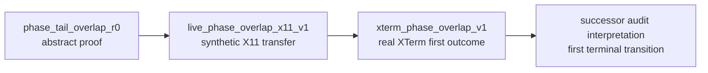
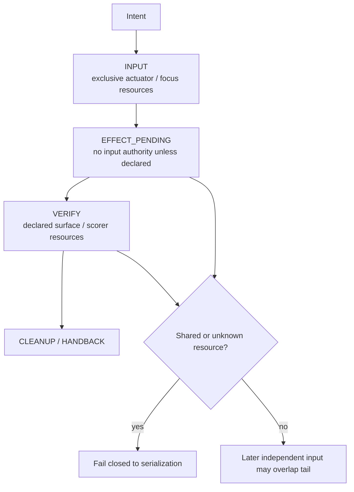

# Concurrency research

This directory contains retained studies of safe overlap and concurrency when the physical input actuator remains serialized.

The central question is not whether two inputs can be emitted simultaneously. It is whether a later intent may begin its input phase while an earlier intent is still waiting for an effect or verification tail, without sharing hidden resources or violating dependency order.

## Track lineage

The arrows show research lineage only. They do not rewrite the retained decisions: the XTerm v1 audit remains FAIL and must not be relabeled.

## Indexed studies

| Study | Retained disposition | What it establishes | What remains open |
|---|---|---|---|
| [`phase_tail_overlap_r0/`](phase_tail_overlap_r0/) | `PASS_PHASE_LEVEL_OVERLAP_SCOPED` | Under the frozen deterministic model, one serialized input actuator does not require whole-intent serialization when effect/verification tails are independent; longest-tail-first is optimal for the stated objective. | Real GUI applicability, unknown/shared resources, models/tokens, and production scheduling. |
| [`live_phase_overlap_x11_v1/`](live_phase_overlap_x11_v1/) | `PASS_LIVE_PHASE_OVERLAP_X11_SCOPED` | Transfers the phase-overlap shape to two X11 surfaces while showing a shared global resource can make overlap incorrect even with serialized input. | Real productivity applications, broader resource declaration, cross-platform transfer, and production runtime integration. |
| [`xterm_phase_overlap_v1/`](xterm_phase_overlap_v1/) | `FAIL_REAL_XTERM_PHASE_OVERLAP` | Retains a mechanically favorable XTerm first outcome but the frozen audit fails because it selects a later `done_already` diagnostic instead of the first terminal transition. | A no-rerun successor audit over the exact retained raw bytes; broader claims remain out of scope. |

## Concurrency boundary

This is a navigation model derived from the retained studies, not a new runtime contract. The exact resource declarations and scientific decision remain owned by each child report.

## Interpretation

- A single physical keyboard/pointer can still permit concurrency in non-actuator phases.
- Surface identity alone is not proof of independence; shared clipboard, focus, global state, verifier state, or dependency edges may force serialization.
- Unknown resources should fail closed to serialization rather than assume safe overlap.
- A favorable wall-time comparison does not override an audit failure or correctness violation.
- Phase-overlap evidence is separate from true multi-actuator concurrency.

## Read next

- Current research method: [`../../docs/RESEARCH_METHOD.md`](../../docs/RESEARCH_METHOD.md)
- Evidence ledger: [`../../RESEARCH.md`](../../RESEARCH.md)
- Integration studies: [`../integration/`](../integration/)
- Measurement/concurrency handback studies: [`../measurement/`](../measurement/)
- Research workspace map: [`../README.md`](../README.md)
