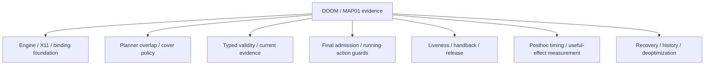

# First DOOM-engine transfer: visual input through X11

> **Directory role:** retained DOOM/MAP01 continuous-control research. Chronological development claims remain preserved below, while current project status lives in the canonical status documents.

## Navigate

| Need | Read |
|---|---|
| Current project objective | [../../docs/CURRENT_GOAL.md](../../docs/CURRENT_GOAL.md) |
| Latest cross-project handoff | [../../docs/LOCAL_RESEARCH_HANDOFF.md](../../docs/LOCAL_RESEARCH_HANDOFF.md) |
| Project evidence ledger | [../../RESEARCH.md](../../RESEARCH.md) |
| Retained raw result artifacts | [results/README.md](results/README.md) |
| Shared-runtime transfer | [Shared runtime transfer](#shared-runtime-transfer) |
| Reproduction notes | [Reproduce](#reproduce) |

## Track map



| Theme | Representative entry points |
|---|---|
| Initial engine/X11 integration | [`MAP01_LIVE_CONTROL_V1.md`](MAP01_LIVE_CONTROL_V1.md), [`SHARED_RUNTIME.md`](SHARED_RUNTIME.md) |
| Planner overlap and cover | [`MAP01_COVER_POLICY_V1.md`](MAP01_COVER_POLICY_V1.md), [`MAP01_COVER_RENEWAL_V1.md`](MAP01_COVER_RENEWAL_V1.md) |
| Typed validity/current evidence | [`MAP01_TYPED_COVER_VALIDITY_V29.md`](MAP01_TYPED_COVER_VALIDITY_V29.md), [`MAP01_ACTION_VALIDITY_SIGNALS_V1.md`](MAP01_ACTION_VALIDITY_SIGNALS_V1.md) |
| Admission and running actions | [`MAP01_FINAL_ADMISSION_V32.md`](MAP01_FINAL_ADMISSION_V32.md), [`MAP01_RUNNING_ACTION_CANCEL_LIVE_V2.md`](MAP01_RUNNING_ACTION_CANCEL_LIVE_V2.md) |
| Liveness and handback | [`MAP01_V39_COAST_LIVENESS_LIVE_V1.md`](MAP01_V39_COAST_LIVENESS_LIVE_V1.md), [`MAP01_V38_INTEGRATED_LIVE_V1.md`](MAP01_V38_INTEGRATED_LIVE_V1.md) |
| Timing/effect measurement | [`MAP01_V38_V39_CONTROL_TEMPO_POSTHOC_V1.md`](MAP01_V38_V39_CONTROL_TEMPO_POSTHOC_V1.md), [`MAP01_HELD_INPUT_OCCUPANCY_POSTHOC_V1.md`](MAP01_HELD_INPUT_OCCUPANCY_POSTHOC_V1.md) |
| Recovery/history/deoptimization | Directories and reports prefixed `map01_*history*`, `recovery_*`, and `map01_*deopt*` |

This is a thematic navigation map. It does not imply that the listed mechanisms form one validated end-to-end stack.


<details>
<summary><strong>Expand retained MAP01 / DOOM chronology</strong></summary>

Latest running-control evidence: [MAP01 running-action cancellation v2](MAP01_RUNNING_ACTION_CANCEL_LIVE_V2.md)
uses an existing held-input observation to detect real screen ammo48→47, request
the matching cancel in136.780ms from capture and verify empty release in138.694ms.
The first allocation's pre-input stale-source failure is retained. This is a
single controller-authored no-model safety probe, not gameplay or general speed.

Planned next DOOM gate (after the integrated efficiency report): run packaged
Freedoom `MAP01` as an ordinary continuously advancing map, with asynchronous
35-tic game time continuing through model waits.  The controller may use visible
screen/audio evidence and OS keyboard/mouse input only.  An isolated scorer will
distinguish actual map exit from death or timeout and retain game-tic, wall-time,
pause/menu, hold/release and video evidence.  This is planned work; no full-map
clear is currently claimed.  See
[`INTEGRATED_EFFICIENCY_PLAN_V1.md`](../live_control/INTEGRATED_EFFICIENCY_PLAN_V1.md).

## Continuously advancing MAP01 feasibility

The integrated efficiency comparison is complete, so three retained pre-formal
attempts now exercise the packaged Freedoom 2 `MAP01` directly as an ordinary
game map. The harness uses `ASYNC_SPECTATOR` at 35 tics/second; game time keeps
advancing during image inspection, reasoning and command dispatch. All gameplay
input crosses the shared X11 OS-input backend. No pause, save state, action
vector, automap, object label or sector label is available to the controller.

`map01-smoke-01` establishes that the unmodified map starts and advances at
34.980 tics/second. `map01-assistant-feasibility-01` retained an interface-label
failure before any input. `map01-assistant-feasibility-02` then admitted 15
screen-directed inputs on the default skill but died after long blind movement
and planner gaps. `map01-assistant-feasibility-03` explicitly fixed skill 1,
admitted a route through the first combat area, and died after 231.245 seconds
of continuously advancing wall time. The last run also retained two malformed
command rejections during live interface use. These are useful usability
failures, not gameplay successes.

The observed limit is decision cadence: local capture and input acknowledgement
are fast, while a stop-inspect-decide-submit loop leaves the player exposed for
tens of seconds. The next controller revision must overlap bounded defensive
input with fresh visual decisions and measure observation-to-input age. A full
map clear, human-speed operation and public-demo readiness remain unclaimed.

`map01-overlap-luna-01` implements that overlap with three actual Luna-low
visual decisions. During 26.764 seconds of model-call wall time, the executor
kept bounded movement/attack programs active. The player remained alive at 81%
health after 40.903 continuously advancing seconds and reached another room;
the run was then deliberately scored unfinished. This is evidence that model
inference and gameplay can overlap, not evidence of a map clear. Constant fire
during the cover policy exhausted the starting ammunition.

`map01-overlap-crop-luna-01` removes constant fire from the cover policy and
crops the stable black desktop surround before the model call. Its one Luna-low
decision used 8,366 input tokens versus 9,158 for each uncropped call, an 8.65%
reduction in this allocation. The model interval lies fully inside the accepted
cover-program interval, and the player remained alive when the run ended. Most
input cost is therefore outside the discarded black pixels; further compression
should reuse compiled task semantics and send compact visual change evidence.

[Normal MAP01 live-control development](MAP01_LIVE_CONTROL_V1.md) records the
subsequent temporal-sheet, explicit-binding, no-input `coast`, persistent Luna
session, hybrid-session and death-count scorer work. The current best measured
token mechanism reduces uncached input by 76.446% in an unmatched 12-turn
comparison, while increasing model wall time by 17.077%. No MAP01 exit is
claimed; coarse model-authored turn durations remain the dominant control
failure in the raw-duration controller. A first semantic-motor compiler capped
turns at 450 ms and reduced model-external time by 72.134% in an unmatched
20-turn allocation; it recorded one kill and no death but still did not exit
the map. See the linked report for the comparison limits.

[Visual-stagnation candidates](MAP01_STAGNATION_V1.md) retain a same-seed,
40-decision, three-arm test. Blind local recovery and structured planner advice
both failed to exit MAP01 and produced more repeated-view detections than the
unaltered controller. They are recorded as failed candidates. A clean-start
session revision also removes an implicit module-path dependency and surfaces
child startup errors directly. No full-map clear or general navigation gain is
claimed.

[Command-effect receipt feasibility](MAP01_EFFECT_RECEIPT_V1.md) reuses the
exact samples already captured during every semantic key hold. It adds no
executor steps and exposes a compact no-visible-effect signal to the planner.
The signal changed immediate choices, but did not improve MAP01 completion or
revisit count in a 40-decision matched pair. First visual feedback arrived in
about 47 ms; model-mediated recovery still took about 8.68 seconds. The next
candidate is a bounded, preplanned local contingency rather than another full
model round trip.

[Preplanned local contingency feasibility](MAP01_CONTINGENCY_V1.md) now takes
that next step in the continuously advancing normal game. A real failed `use`
command triggered a model-authored fallback locally in 95.33 ms, without a new
model call. Grouping only at contingency boundaries reduced program admissions
from 18 to 13 over 12 decisions; the sole admission above one primary bundle per
decision was the fallback that actually ran. Both allocations remained
unfinished with zero deaths and kills. Retain the mechanism, but do not infer
completion ability, false-branch reliability or a general speedup.

[The separately frozen Astra attempt](MAP01_ASTRA_ATTEMPT_V1.md), requested by
Issue #58, retains its first result without rerun. It reached later rooms and
killed one enemy, then died after 13 decisions and 149.911 seconds without a map
exit. The clock probe measured 35.015 tics/second, but fixed ten-second cover
expired before seven of 13 model calls returned. The complete visual timeline
is committed at labelled 2x playback. This is an honest failed hero attempt and
does not block the reproducible desktop Research Preview.

[Renewable cover](MAP01_COVER_RENEWAL_V1.md) fixes the concrete lifetime defect
without changing the failed frozen allocation. In a four-decision development
probe, two model calls outlived their first cover program and were renewed from
fresh sequence evidence. Release-to-readmit gaps were 20.71–21.44 ms; total
uncovered model time was 54.19 ms. Gameplay benefit remains unproven, and a
compact model-authored cover policy is still needed before another hero gate.

[Model-authored renewable cover](MAP01_COVER_POLICY_V1.md) adds that policy
handoff. Astra chose coast on clear views and authored a bounded strafe/fire/
strafe policy only after a visible enemy and ammunition appeared. Self-use found
that v19 exhausted the executor's 16-step cap at 9.64 seconds; v20 compiles only
complete cycles to exactly ten seconds and ends on coast. A corrected four-turn
live run renewed twice with 20.99–21.51 ms gaps. Corrected threat execution and
gameplay benefit remain open.

[Cover-policy contract v2](MAP01_COVER_CONTRACT_V2.md) retains a frozen
`coast pulse` 20-step rejection and an endpoint `oneOf` schema rejection. The
compatible v3 contract represents coast as an empty array and permits only
active cover actions as items. Its endpoint smoke passes, and all 168,421
permitted policies compile to exactly ten seconds within 16 steps and finish on
coast. Corrected threat exposure is still pending.

The assistant has now operated a ViZDoom basic scenario through OS keyboard
input and X11 screenshots, using the existing async executor and exact image
transport. This uses the bundled **Freedoom assets**, not original commercial
DOOM assets. It is a one-room integration test, not full-game competence or a
Product Hunt-ready demonstration.


</details>

## Shared runtime transfer

[Shared runtime report](SHARED_RUNTIME.md): revision 6 now uses the pinned common
input owner/focus/lease backend. Three scripted readiness cases pass, including
cancel and expiry during a hold, with ten exact image frames. Two failed
development cohorts are retained. This adds no game-success or speed claim.

## Actual operation and retained failures

| Run | Revision | Evidence |
|---|---|---|
| `development-01` | `session.py` | Window discovery timed out before task input. Expected mixed-case title did not match the observed uppercase title in the next run. |
| `development-02` | `session_v2.py` | Actual title selection and WM readiness added. Assistant's Right-key hold visibly changed the view. Clock/score getter stayed at cached values; those measurements are invalid. |
| `development-03` | `session_v3.py` | Spectator telemetry refreshed before/after the clock probe and after control. Assistant inspected images, rotated toward the monster, discovered Space did not fire, then fired with default Control. Finish screen appeared; post-control API reported episode finished and player alive. |
| `development-04` | `session_v4.py` | Explicit `Doom.Bindings` ini replaced ineffective command-line binding setup. Assistant inspected the initial screen, fired with Space and reached the finish screen; post-control API again reported finished/alive. |

Revision 4 records the legacy successful gameplay; use revision 7 for new common-runtime trials. Old ready-event binding claims and revision 2
clock/score values are retained as failed assumptions, not authoritative controls.
The generated ini is archived after engine shutdown in the revision 4 result.

## Real-time clock and observation boundary

Mode is `ASYNC_SPECTATOR`, configured at 35 tics/second, rendering a visible
640x480 window inside private Xvfb/Openbox. Controls use XTEST keys only. No
`make_action` or API action-vector control is used. The controller sees only
screenshots/public X11 metadata; enemy position, labels and depth buffers are
not read. Setup and independent engine diagnostics use the ViZDoom API.

`get_episode_time()` alone returned an unchanged cached value. Revisions 3/4
call `advance_action(1, True)` outside each end of a two-second idle interval to
refresh spectator telemetry. There are **no advance calls during that wait**.
Both observed 71 tics over approximately 2.028 seconds, consistent with the
configured rate. These refresh calls are explicit in the source and clock log;
do not describe the entire harness as API-free or equate game tics with display
frame rate or planner decision rate.

Post-control raw reward was 98 in both finished trials. It is not used as a
wall-time-normalized performance score: spectator update cadence affects the
observed bookkeeping, and the final episode-tic getter returned zero after
completion. The completion claim rests on the inspected finish screen plus
finished/alive state after refresh, not on reward or zero elapsed time.

Key release is checked by the inherited X11 backend after each submitted
program. Local input/image timestamps and all exact packets/PNGs are retained.
The assistant still takes seconds between commands. There is no human baseline,
token-metered comparison, continuous learned motor policy or general DOOM agent.
These small development trials are not a frozen gameplay efficacy cohort.

## Reproduce

The tested environment is Ubuntu/WSL, Python 3.12, Xvfb/Openbox, system Python
Xlib/Pillow/NumPy and a separate virtual environment with ViZDoom 1.3.0.

```sh
python3 -m venv --system-site-packages /path/to/doom-venv
/path/to/doom-venv/bin/pip install -r requirements.txt
/path/to/doom-venv/bin/python session_v4.py --out ../../results-local/doom-new --seed 890401
```

Use a new output path. After inspecting the initial image, send a bounded
program using its current observation sequence, for example:

```json
{"op":"submit","id":"look","expected_sequence":1,"steps":[{"op":"hold","keys":["Right"],"duration_ms":150},{"op":"decide"}]}
{"op":"poll"}
{"op":"finish"}
```

Revision 4 binds arrows to turning/forward/back and Space/Control to attack.
Space was verified in the recorded revision 4 run; other bindings require
broader fresh validation. Choose subsequent sequence IDs from actual responses.
`finish` stops execution before reading independent engine outcome and closes
the private session. No game binaries or WAD files are added to this repository;
installed assets/configuration are recorded by hash in `environment.json`.

```sh
python3 audit.py results/development-02
python3 audit.py results/development-03
python3 audit.py results/development-04
```

Next: fresh multi-seed gameplay attempts, accurate time-to-completion and action
boundary accounting, then a longer dynamic scenario and a faithful live video.
Do not publish this basic-room success as the final demonstration.

## Primary references consulted

- [ViZDoom Python installation](https://vizdoom.farama.org/introduction/python_quickstart/)
- [Modes and asynchronous clock semantics](https://vizdoom.farama.org/api/cpp/enums/)
- [FAQ: Freedoom assets and spectator key bindings](https://vizdoom.farama.org/faq/index.html)

These sources describe the platform; the local records establish what actually
worked in this environment.

## Actual shared self-use update

[Shared self-use report](SHARED_SELF_USE.md) records an unsuccessful assistant
episode: black output after the first planner gap, retained despite frame/cleanup
audits passing. A fresh 0/20-second scripted pair did not reproduce black output,
but showed no world-crop change after its short turn. Game response and rendering
freshness are unresolved; readiness does not prove useful feedback.

## Response diagnostic update

[Four response probes](RESPONSE_DIAGNOSTIC.md) establish successful OS-key shooting
through the shared backend in one scripted trial, while Right-key rotation stays
unresolved. Extra engine refresh and delta-button availability did not fix it.
The 43 frames and release/close records audit; no candidate is promoted.

## Corrected bindings and successful shared self-use

[Binding correction](BINDINGS_FIX.md) fixes the four arrow-key names. Fresh
left/right/forward/back cases pass, and the assistant completed a basic-room
task by visually aiming and firing with normal revision 7. Nine self-use frames
and cleanup audit. Planner/tool gaps still take about 20 seconds; human-tempo
performance and the earlier black-screen root cause remain unresolved.

## Clock round-trip experiment

[Observation-anchored deadlines](OBSERVATION_DEADLINE.md) completed another actual
assistant task with zero clock commands and eleven exact frames. The second
operation interval still took 22.347 seconds; no causal speed gain is claimed.
This is a client usage pattern on unchanged v7, not architecture promotion.

## Traced combined feedback

[Local receipt tracing](TRACED_CLIENT.md) adds an unchanged-runtime client and
returns images with action results. Actual self-use completed with eight exact
frames. Runtime acceptances were 12.384s apart; a separately measured10.444s
interval remains after the image tool returns. These are scoped diagnostics,
not a same-model speed improvement or pure inference measurement.

## Paired feedback pilot and corrected image diagnosis

[Feedback pilot](FEEDBACK_PILOT.md): four actual tasks in AB/BA order, three
completed and one aborted after expiry/recovery. All28 frames and delivery audit.
The perceived black recovery image is a normal saved PNG; an older failed PNG
also matches its published bytes and renders normally at original detail.
Investigate end-to-end image presentation before more timing claims.
