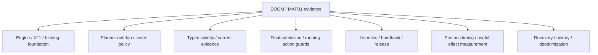

# First DOOM-engine transfer: visual input through X11

> **Directory role:** retained DOOM/MAP01 continuous-control research. Chronological development claims remain preserved below, while current project status lives in the canonical status documents.

## Navigate

| Need | Read |
|---|---|
| Current project objective | [../../docs/CURRENT_GOAL.md](../../docs/CURRENT_GOAL.md) |
| Latest cross-project handoff | [../../docs/LOCAL_RESEARCH_HANDOFF.md](../../docs/LOCAL_RESEARCH_HANDOFF.md) |
| Project evidence ledger | [../../RESEARCH.md](../../RESEARCH.md) |
| Retained raw result artifacts | [results/README.md](results/README.md) |
| Shared-runtime transfer | [Shared runtime transfer](#shared-runtime-transfer) |
| Reproduction notes | [Reproduce](#reproduce) |

## Track map


```mermaid
flowchart TD
    D[DOOM / MAP01 evidence]
    BASE[Engine / X11 / binding foundation]
    COVER[Planner overlap / cover policy]
    VALID[Typed validity / current evidence]
    ACTION[Final admission / running-action guards]
    LIVE[Liveness / handback / release]
    METRIC[Posthoc timing / useful-effect measurement]
    REC[Recovery / history / deoptimization]

    D --> BASE
    D --> COVER
    D --> VALID
    D --> ACTION
    D --> LIVE
    D --> METRIC
    D --> REC
```

| Theme | Representative entry points |
|---|---|
| V39 typed-observation raw retention boundary A01 (#8258) | [`typed_observation_retention_a01_20261007/README.md`](typed_observation_retention_a01_20261007/README.md) — preserved synthetic 2-row event-sink result with independent raw audit 5/5; historical freeze only (3/5 implementation sources still match current main), no live/game claim |
| V39 expiry-receipt auditor correction A02 (#8257) | [`map01_v39_expiry_pending_cleanup_audit_successor_a02_20261007/README.md`](map01_v39_expiry_pending_cleanup_audit_successor_a02_20261007/README.md) — reproduces three A01 auditor false accepts, then rejects ten mutations in normal/optimized Python (11 cases, 22 subprocesses); retained raw audit only, no candidate or live-control claim |
| App Server interrupt transport portability (#59) | [`v39_appserver_interrupt_macos_a01_20261008/README.md`](v39_appserver_interrupt_macos_a01_20261008/README.md) — one macOS arm64 / Codex 0.146.1 loopback-only replication of PR #8380 A06; scoped transport PASS with retained audit-v1 failure and v2 audit correction; no live/game/input claim |
| Windows redirected-pipe readiness construction T0 (#7446) | [`windows_pipe_polling_59_t0_20261004/REPORT.md`](windows_pipe_polling_59_t0_20261004/REPORT.md) — native Windows anonymous-pipe fix passed focused poller 13/13, v13 composition 4/4, and scorer adapter 5/5; broad discovery remained non-green and no live/game effect was tested |
| Windows pipe polling quantum comparison T1 (#7456) | [`windows_pipe_quantum_59_t1_20261004/REPORT.md`](windows_pipe_quantum_59_t1_20261004/REPORT.md) — independently audited 128 paired samples; 1 ms improved p95 by 4.902 ms but used 7.88% idle CPU against the <1% gate, so disposition is HOLD and no production quantum is selected |
| V16 full-main lifecycle audit correction (#7568 successor) | [`v16_fullmain_independent_audit_59_20261004/README_V2.md`](v16_fullmain_independent_audit_59_20261004/README_V2.md) — preserves V1 unchanged; V2 downgrades the missing terminal trace to HOLD and adds nested key-up/sync and post-release empty-sample checks. Retained-record audit only; no live or physical-input claim |
| V28 health-envelope counterfactual (#59) | [`v28_health_envelope_counterfactual_a01_20261005/README.md`](v28_health_envelope_counterfactual_a01_20261005/README.md) — independently audited current-V39 guard replay over five retained V28 spans and all 21 health-loss budgets; historical snapshots only, not live threat-control evidence |
| Current-main V39 paired guard replay over retained live threat trace (#59) | [`v39_current_main_paired_guard_replay_a01_20261005/README.md`](v39_current_main_paired_guard_replay_a01_20261005/README.md) — 52 exact retained health/ammo events replayed through current-main monitor; independent raw-event audit PASS, posthoc only, no current live integration or task-effect claim |
| v39 ammo-aware cover pair gate (#59) | [`v39_ammo_cover_pair_guard_59_a03_20261005/REPORT.md`](v39_ammo_cover_pair_guard_59_a03_20261005/REPORT.md) — ten-case paired-epoch construction PASS, audit 44/44; no current runtime integration or live behavior |
| V39 pre-acceptance stale-sequence recovery A02 (#59) | [`v39_preacceptance_stale_replan_a02_20261008/README.md`](v39_preacceptance_stale_replan_a02_20261008/README.md) — reproduces the exact source-pinned stale rejection, then tests a bounded fresh-observation planner-turn candidate with nine fail-closed controls; local normal/`-O` runs and independent artifact audit retained. Synthetic construction only; candidate is not a production fix and has no live recovery, task-effect, or MAP01 claim. |
| V39 initial cover-admission rejection evidence rescue (#7904) | [`v39_initial_admission_evidence_rescue_a01_20261008.md`](v39_initial_admission_evidence_rescue_a01_20261008.md) — preserves hard-invalidation and soft-observation stale-submit results byte-for-byte; package manifests pass, historical-source audits pass, but the current-main integration check remains HOLD |
| v39 typed observation epoch identity (#59) | [`v39_typed_epoch_alias_59_a01_20261005/REPORT.md`](v39_typed_epoch_alias_59_a01_20261005/REPORT.md) and [label correction](v39_typed_epoch_alias_59_a01_20261005/CORRECTION.md) — source accepted eight Boolean/float epoch aliases; offline boundary evidence only, no in-tree-reader or live-effect claim |
| V39 paired health/ammo A03 initial auditor mismatch (#7713; historical) | [`v39_ammo_cover_a03_initial_audit_failure_20261005/README.md`](v39_ammo_cover_a03_initial_audit_failure_20261005/README.md) — preserves the unique initial 25/26 AUDIT_FAILED receipt; subsequent 26/26 corrected only the auditor status label without rerunning the candidate; not a candidate failure or a new method result |
| v39 ammo-aware renewable-cover successor (#59) | [`v39_ammo_cover_guard_59_a02_20261005/REPORT.md`](v39_ammo_cover_guard_59_a02_20261005/REPORT.md) — dual-signal construction `PASS` (24/24 audit checks); no controller integration or live evidence; paired epoch enforcement remains a prerequisite |
| v39 ammo-aware renewable-cover boundary (#59) | [`v39_ammo_cover_guard_59_a01_20261005/REPORT.md`](v39_ammo_cover_guard_59_a01_20261005/REPORT.md) — synthetic current-source failure: zero ammo did not invalidate a notional fire-containing cover while the health guard remained valid; no live-game or input claim |
| v39 F02 pipe-EOF construction predecessor (#59) | [`v39_eof_59_f02_20261004_3cbf/RESCUE_20261004.md`](v39_eof_59_f02_20261004_3cbf/RESCUE_20261004.md) — preserves construction RED/GREEN and repeated-wait history; F03 formal result is separate, and production integration remains unproved |
| v39 F03 formal-run construction/custody history (#59) | [`v39_eof_formal_59_f03_20261004_3cbf/RESCUE_20261004.md`](v39_eof_formal_59_f03_20261004_3cbf/RESCUE_20261004.md) — preserves preflight, construction fixes, STOPs, and independent-review limits; formal result remains the separate #7373 record |
| v39 release-sink failure custody T0 (#59) | [`v39_release_sink_failure_59_7474_t0_20261004/README.md`](v39_release_sink_failure_59_7474_t0_20261004/README.md) — exact helper-method probe found retry suppression without unknown-delivery custody on both sink-failure modes; exploratory host-Python evidence only, not live executor or product behavior |
| MAP01 V39 event-emitter fault boundary A04 (#7805/#59) | [`map01_v39_event_emit_fault_boundary_a01_20261005/REPORT.md`](map01_v39_event_emit_fault_boundary_a01_20261005/REPORT.md) - current-main literal-sink injected faults reproduce partial append and retry-duplicate boundaries; scoped WSLc evidence only, not Executor integration or live control |
| Release-batch sink baseline position sweep (#7636) | [`release_sink_delivery_59_a01_20261004/RESCUE_CONTEXT.md`](release_sink_delivery_59_a01_20261004/RESCUE_CONTEXT.md) — six frozen fake-sink cases on old main; original audit's truncation false-pass is disclosed and a stricter raw-only audit is added; implementation follow-up remains in #7635 |
| Release-ledger sink-mutation A01 (#59, predecessor to #7929) | [`release_ledger_sink_mutation_59_a01_20261005/README.md`](release_ledger_sink_mutation_59_a01_20261005/README.md) — frozen #7635-parent mutation audit, with Windows and WSLc outputs; original scalar-before-callback repair remains superseded by the later current-main A02 |
| ExecutorV13 `release_all()` BaseException A01 (#7658; superseded, integrity caveat) | [`results/v13-release-all-baseexception-59-a01-20261005/README.md`](results/v13-release-all-baseexception-59-a01-20261005/README.md) — preserves the historical baseline/candidate bytes; candidate runtime delta was superseded by #7635; the original manifest mismatches all 8 current Git blobs, so treat the package as unverified provenance, not a validated result |
| Release-ledger sink-mutation current-main regression (#59, successor to #7669) | [`release_ledger_sink_mutation_59_a02_20261005/README.md`](release_ledger_sink_mutation_59_a02_20261005/README.md) — six complete-batch and six incomplete-cleanup mutation cases pass on the tested main snapshot; object-identity ledger binding remains unchanged; synthetic only |
| v39/V15 per-key keymap sampling A01 — superseded candidate (#59) | [`v39_perkey_server_sample_a01_20261005/README.md`](v39_perkey_server_sample_a01_20261005/README.md) — preserves the failed inter-key `query_keymap` instrumentation hypothesis and posthoc raw reconstruction; no real-X or physical-key claim; superseded by #7881/#7917 |
| V15 per-key owner-selection counterexample and release-batch compatibility (#59, rescued from #8079) | [`v15_perkey_import_59_e0cc_20261005/README.md`](v15_perkey_import_59_e0cc_20261005/README.md) preserves the original and post-repair A02 startup-selection FAILs; [`v15_releasebatch_legacy_owner_compat_a01_20261005/README.md`](v15_releasebatch_legacy_owner_compat_a01_20261005/README.md) records why selecting the archived owner alone is incompatible. Readback audits pass; startup/fake-X boundaries only, no live input or physical-release claim. |
| V15 per-key owner identity confirmatory replication (#8091, rescued from #8312) | [`v15_perkey_owner_identity_recheck_a01_20261005/README.md`](v15_perkey_owner_identity_recheck_a01_20261005/README.md) — repeats the three-route source-selection finding against the frozen #8065 head with 56 source snapshots; the retained package audit reports 22/22 checks (not an independent scientific replication). Preserves the initial missing-Pillow STOP. Startup boundary only: no session/owner construction, GUI, live input, physical release, task effect, threat response, recovery, or MAP01 claim. |
| V39/V15 static release import closure A03–A05 (#8096) | [A05 record](results/map01-v39-v15-release-closure-a05-current-main-20261005/README.md) preserves the 38-source static closure through `b5be1996`, unchanged across A03–A05 at their tested main tips. Qualification: latest checked main `349dd5f8` differs in 1/38 source blobs (`research/live_control/executor_v13.py`), so A05 is historical, not a current-main closure; A03 `SHA256SUMS` lists an absent `AUDIT.log`, while A04/A05 package checksums verify. Static provenance only; no runtime claim. |
| V39 terminal-release cleanup send-failure A02 (#59) | [`v39_terminal_release_errors_a02_20261005/README.md`](v39_terminal_release_errors_a02_20261005/README.md) — preserves the baseline RED and 24-test synthetic candidate/source audit, including its import/test closure; no real-X or live-input claim and no candidate runtime adoption |
| V39 terminal-release sampling formal STOP A01 (#59) | [`v39_terminal_release_sample_error_a01_20261005/README.md`](v39_terminal_release_sample_error_a01_20261005/README.md) — preserves `STOP_AUDIT_RAW_TRACE_MISSING`; the candidate exited 0 but the required output environment was omitted, so the auditor failed and no formal result is claimed |
| V39 bounded pending-observation A01 audit correction (#59) | [`v39_bounded_pending_backlog_a01_20261008/README.md`](v39_bounded_pending_backlog_a01_20261008/README.md) — preserves the absent historical 48-test log as unverified, adds a pinned current-main 12/12 deterministic regression replay and explicit `AUDIT_HOLD`; no replacement for missing historical bytes or live-control claim. |
| v39 remaining queue-budget construction (#7084) | [`results/v39-queue-budget-01a0ff2c/RESCUE_20261004.md`](results/v39-queue-budget-01a0ff2c/RESCUE_20261004.md) — deterministic source-bound tests and preserved first failure; no live, platform, or integration claim |
| Incomplete release telemetry sink failure (#59) | [`incomplete_release_sink_59_a01_20261004/REPORT.md`](incomplete_release_sink_59_a01_20261004/REPORT.md) — frozen pre-fix source snapshots lose residual position-1 custody; PR #7635 later added a separate source repair; no live or physical-release claim |
| Finite observation-loss YIELD guard | [`intermittent_observation_yield_59_t0_20261002/REPORT.md`](intermittent_observation_yield_59_t0_20261002/REPORT.md) — synthetic contract PASS only; live T1 remains held |
| Initial engine/X11 integration | [`MAP01_LIVE_CONTROL_V1.md`](MAP01_LIVE_CONTROL_V1.md), [`SHARED_RUNTIME.md`](SHARED_RUNTIME.md) |
| Planner overlap and cover | [`MAP01_COVER_POLICY_V1.md`](MAP01_COVER_POLICY_V1.md), [`MAP01_COVER_RENEWAL_V1.md`](MAP01_COVER_RENEWAL_V1.md) |
| Typed validity/current evidence | [`MAP01_TYPED_COVER_VALIDITY_V29.md`](MAP01_TYPED_COVER_VALIDITY_V29.md), [`MAP01_ACTION_VALIDITY_SIGNALS_V1.md`](MAP01_ACTION_VALIDITY_SIGNALS_V1.md) |
| Admission and running actions | [`MAP01_FINAL_ADMISSION_V32.md`](MAP01_FINAL_ADMISSION_V32.md), [`MAP01_RUNNING_ACTION_CANCEL_LIVE_V2.md`](MAP01_RUNNING_ACTION_CANCEL_LIVE_V2.md) |
| Source-only import-boundary audit | [`map01_r4_import_boundary_desktop_v1/README.md`](map01_r4_import_boundary_desktop_v1/README.md) |
| Local NCC source-only archive | [`local_ncc_consensus_v1/RECOVERY_STATUS.md`](local_ncc_consensus_v1/RECOVERY_STATUS.md): #4163, formal 0/10; exact-environment and FREEZE-provenance HOLD |
| #2476 in-trajectory observability construction archive | [`intrajectory_observability_2476_v1/construction_chain_r3_20260928/RECOVERY_STATUS.md`](intrajectory_observability_2476_v1/construction_chain_r3_20260928/RECOVERY_STATUS.md) (r3 immutable invocation STOP) and [`intrajectory_observability_2476_v1/construction_chain_r4_20260928/RECOVERY_STATUS.md`](intrajectory_observability_2476_v1/construction_chain_r4_20260928/RECOVERY_STATUS.md) (r4 technical construction PASS, allocation HOLD); neither is a formal game/matcher result |
| Liveness and handback | [`MAP01_V39_COAST_LIVENESS_LIVE_V1.md`](MAP01_V39_COAST_LIVENESS_LIVE_V1.md), [`MAP01_V38_INTEGRATED_LIVE_V1.md`](MAP01_V38_INTEGRATED_LIVE_V1.md) |
| Pre-input exception cleanup | [`MAP01_V39_EXCEPTION_CLEANUP_V1.md`](MAP01_V39_EXCEPTION_CLEANUP_V1.md) — bounded finish attempt, planner-close caller deadline, and reader-drain-gated terminal evidence; POSIX and synthetic timeout injections pass, no active-movement or live-runtime evidence |
| Timing/effect measurement | [`MAP01_V38_V39_CONTROL_TEMPO_POSTHOC_V1.md`](MAP01_V38_V39_CONTROL_TEMPO_POSTHOC_V1.md), [`MAP01_HELD_INPUT_OCCUPANCY_POSTHOC_V1.md`](MAP01_HELD_INPUT_OCCUPANCY_POSTHOC_V1.md) |
| #5752 allocation-04 GPU HUD STOP | [`map01_hud_cuda_5752_t1_v4/RECOVERY_NOTE.md`](map01_hud_cuda_5752_t1_v4/RECOVERY_NOTE.md) — pre-candidate disk-reserve STOP; 0/0/0 execution, `NOT_EVALUATED`; separate from A05's later parity/speed report |
| Full-trace held-input occupancy audit | [`v4/v5 H/T/D/C/U report and retained STOP history`](results/map01-held-input-occupancy-fulltrace-v4/README.md) — candidate v4 and independent raw-trace audit v5 pass; posthoc bounds only, including a censored cancel/ack race |
| Per-key occupancy schema boundary | [Repeated-key pulse T0](map01_repeated_key_pulse_occupancy_59_t0_20261001/RESULT.md) records the key-unique fail-closed boundary; [occurrence-ID successor T0](map01_occurrence_key_occupancy_59_t0_20261001/RESULT.md) passes finite repeated-key/overlap and fail-closed controls. Both are synthetic construction evidence only. |
| Input-owner occurrence instrumentation | [Issue #59 T2](map01_owner_occurrence_instrumentation_59_t2_20261002/RESULT.md) passes an isolated fake-Xlib construction: two repeat IDs, six full-bitmap witnesses, independent audit 9/9. No physical occupancy or live-control claim. |
| A02 per-key trace source attribution | [Issue #59 source audit A05](map01_v39_perkey_bridge_source_audit_a01_20261005/RESULT.md) attributes A02's inter-key queries to its historical fake V12 physical-edge fixture and confirms the current V39 V15 closure has no per-key keymap probe; source/raw audit only. |
| #7602 per-key adapter interval-order audits (A01/A02) | [A01](per_key_interval_order_audit_59_a01_20261004/REPORT.md) reproduces false acceptance of overlapping/reversed closed sampling intervals; [A02](per_key_interval_order_audit_59_a02_20261004/REPORT.md) verifies strict `down_end < up_start` across 100 synthetic pairs. Source/fixture audits only; no live-input or application-effect claim. |
| V39 application-consumption contradiction A01 (#7662; source projection) | [`v39_application_consumption_conflict_59_a01_20261005/RESULT.md`](v39_application_consumption_conflict_59_a01_20261005/RESULT.md) — frozen deterministic projector comparison: baseline accepted four explicit contradictions, candidate rejected all eight; 15 ordered and 85 incomplete interval pairs. Host Python after container-image STOP; no live application-consumption or task-effect claim |
| V39 saved-frame model interpretation STOP (#59 A01) | [Report and redacted CLI result](v39_frame_model_interpretation_59_a01_20261005/REPORT.md) — Codex CLI 0.146.1 rejected requested `gpt-6.1-sol` for the ChatGPT account before any inference response; visual comprehension remains unevaluated. |
| Astra retained failure diagnosis | [Post hoc video/runtime triage](MAP01_ASTRA_SYSTEM_FAILURE_TRIAGE_V1.md) distinguishes fixed-cover expiry, active fire/strafe cost, fresh but weak navigation responses, sampled threat visibility, unused contingencies, and the terminal death. It identifies the current health/ammo cover guard as the next mechanism to test; no causal or live-effect claim is made. |
| Astra camera-stabilized cue A01 | [`astra_camera_stabilized_cue_a01_20261005/README.md`](astra_camera_stabilized_cue_a01_20261005/README.md) — integer translation registration did not suppress the retained 22.7 s warm-pixel transition (186→186 at threshold 40); ten-frame offline diagnostic only, not threat classification or live control. |
| Astra guard-observation availability audit A01 | [`map01_astra_guard_observation_audit_a01_20261007/RESULT.md`](map01_astra_guard_observation_a01_20261007/RESULT.md) — retained-data-only `PASS_OBSERVABILITY_GAP_ONLY`: 852 events/530 observations/13 decisions; no runtime health/ammo samples or guard-invalidation outcomes were recorded. Fresh live threat exposure remains required. |
| V39 current-main source identity A02 | [`v39_current_main_source_identity_audit_a02_20261009/RESULT.md`](v39_current_main_source_identity_audit_a02_20261009/RESULT.md) — one read-only static audit at main `b4046798` found r139 controller identity stale (`51ceed1e…` current vs `4548ca30…` retained); V15 session hash matches. No live behavior/timing evidence; fresh threat exposure remains required. |
| OrbStack v13 scorer composition construction | [Issue #59 A01](map01_v13_scorer_composition_orbstack_a01_20261003/REPORT.md) — pinned-container synthetic composition tests 4/4 plus independent raw/hash audit; real MAP01 gate remains open. |
| A05 unknown-kind host result and container STOP snapshot | [Closed PR #7630's nine-file host package](scorer_feedback_attribution_59_t0_a05_host_stop_20261004_ab224/RESCUE_CONTEXT.md) — exact historical Python 3.14.5 result retained separately from current A05/A06; OrbStack could not list/pull an image, so this is not a container PASS or gameplay result. |
| V13 cancellation receipt × current ExecutorV12 composition | [Issue #59 A01](map01_v39_cancel_executor_v12_composition_a01_20261005/README.md) — fake-display scoped PASS after OrbStack failed before container startup; three runner STOPs preserved; no live-control or task-effect claim. |
| Sustained scorer overrun and command service | [Issue #59 construction A01](scorer_command_fairness_59_20261003_01a0ff52/README.md) — 12 retained starvation witnesses; first patch/audit FAIL preserved; v2 ordinary repair passes 18 service conditions and 32 existing tests. Proposed source copies only; no live/runtime adoption. |
| Historical V39 scorer-tail priority A01/A02 (PR #7738) | [A01 frozen result](v39_scorer_tail_command_priority_a01_20261005/README.md) and [A02 frozen result](v39_scorer_tail_command_priority_a02_20261005/README.md) — preserve starvation behavior in the exact historical adapter snapshot. A02's candidate classifier did not match `deadline_overrun`; the independent audit reconstructs the bounded failure. Current main has a separate regression-tested command-service repair, so this is historical evidence, not a current-main defect or live/game result. |
| Startup-failure stderr custody diagnostic | [Issue #59 T0](results/issue59_startup_stderr_custody_t0_20261004/REPORT.md) — OrbStack synthetic subprocess method PASS for bounded concurrent stderr capture and primary failure preservation; does not diagnose the retained controller STOP or establish live recovery. |
| V39 startup-custody experiment archive rescue (#6944) | [Current-main rescue record](results/v39-startup-rescue-6944-currentmain-20261008/README.md) — five immutable evidence packages retained; active controller/tests are not promoted, and the source PR conflicts with current main. |
| Recovery-arm useful-effect gate | [Paired-adjudicator synthetic counterexample](map01_r133_recovery_coast_t1_v1/useful_effect_audit_v2/REPORT.md) — scoped PASS with 0/3 recovery kill/exit pairs; survival sufficiency remains a study-design decision |
| Recovery useful-effect gate sensitivity | [T4 exhaustive abstract-input sweep](map01_r133_recovery_coast_t1_v1/useful_effect_sensitivity_v1/REPORT.md) — 2,916 comparator cases; coast-only events are all HOLD under a recovery-specific gate; synthetic sensitivity only |
| Recovery guard boundary | [Retained v39 continuation-guard window diagnostic](map01_continuation_guard_window_59_t2_20261001/REPORT.md) — counterfactual health-floor timing only; candidate and auditor reruns are disclosed |
| Intermittent control transfer | [Issue #6061 T0](intermittent_control_6061_t0_20261001/REPORT.md) — predictive chunks reduce captures vs fixed cadence on an idealized finite fixture, but stale tracking increases cost; not live-control evidence |
| Intermittent control identity switch | [Issue #6061 T1](map01_intermit_identity_switch_6061_t1_20261002/RESULT.md) — observable ID/epoch discontinuities stop the synthetic gate; silent switch is unidentifiable and held UNKNOWN; not live-control evidence |
| Artifact/terminal synchronization | [#3211 allocation-04 artifact audit](map01_terminal_sync_artifact_reaudit_3211_t1_20261002/REPORT.md) |
| A02 result integrity correction (#59) | [`map01_v39_xvfb_per_key_release_identity_a02_20261005/results/RESULT_CORRECTION.md`](map01_v39_xvfb_per_key_release_identity_a02_20261005/results/RESULT_CORRECTION.md) — 17/18 historical result hashes verify; `setup.log` is absent from both tree and transfer archive; original A02 STOP is unchanged |
| Retained-input analyzer owner-receipt ordering (#7402) | [A01/A02 WSLc records](results/map01-retained-time-analyzer-order-wslc-a01-20261004/FREEZE.md) and [rescue context](results/PR7402_RESCUE_CONTEXT_20261005.md) — A01 pre-container STOP retained; A02 six synthetic analyzer tests pass in pinned offline container, but the later JSON-false deadline mutation was not covered and remains a known analyzer boundary |
| Xvfb keymap witness construction | [`map01_owner_occurrence_xvfb_59_t3_20261002/README.md`](map01_owner_occurrence_xvfb_59_t3_20261002/README.md) — scoped virtual-server construction only; not physical occupancy |
| V39 per-key cancellation release Xvfb evidence (#7504) | [`../live_control/cancel_batch_key_release_xvfb_7504/README.md`](../live_control/cancel_batch_key_release_xvfb_7504/README.md) — one nonformal WSL/Xvfb test-window smoke plus three preserved STOP/failed-harness runs; exact historical candidate only, not integrated into current main and not game/MAP01 evidence |
| Keymap occupancy vs application delivery | [`map01_app_event_xvfb_59_t0_20261002/successor_02/REPORT.md`](map01_app_event_xvfb_59_t0_20261002/successor_02/REPORT.md) — Docker/Xvfb T0 scoped PASS; focus transfer kept the global key bit down while the new focus received no KeyPress; not live threat/MAP01 evidence |
| Held-key autorepeat after focus transfer | [`map01_x11_held_repeat_59_t1_20261002/REPORT.md`](map01_x11_held_repeat_59_t1_20261002/REPORT.md) — Docker/Xvfb T1 scoped PASS; after immediate T0 window, B received 14 autorepeat KeyPress events during the same still-held W interval; not semantic effect or live MAP01 evidence |
| Client callback effect after focus transfer | [`map01_x11_callback_effect_59_t2_20261002/REPORT.md`](map01_x11_callback_effect_59_t2_20261002/REPORT.md) — Docker/Xvfb T2 scoped PASS; minimal B callback counter advanced 0→15 on linked W KeyPress events; synthetic client state only, not useful task effect or MAP01 evidence |
| Corrected X11 event-window routing after A04 audit failure | [`map01_v39_x11_event_routing_a05_20261004/RUN_RESULT.md`](map01_v39_x11_event_routing_a05_20261004/RUN_RESULT.md) — fresh isolated OrbStack/Xvfb run uses Python-Xlib `event.window`; direct XTEST and InputOwner v10 each reach the focused client and increment its counter. Virtual minimal-client routing only, no game or useful task-effect claim. |
| Diagnostic trace writer | [#3211 synthetic writer-boundary reproduction](map01_terminal_sync_writer_repro_3211_t2_20261002/REPORT.md) |
| JSONL writer contract | [#3211 T3 standalone writer contract](map01_terminal_sync_writer_contract_3211_t3_20261002/REPORT.md) |
| Terminal wait boundary | [#3211 T4 synthetic wait-boundary discrimination](map01_terminal_sync_wait_boundary_3211_t4_20261002/REPORT.md) |
| Recovery/history/deoptimization | Directories and reports prefixed `map01_*history*`, `recovery_*`, and `map01_*deopt*` |

This is a thematic navigation map. It does not imply that the listed mechanisms form one validated end-to-end stack.


<details>
<summary><strong>Expand retained MAP01 / DOOM chronology</strong></summary>

Latest running-control evidence: [MAP01 running-action cancellation v2](MAP01_RUNNING_ACTION_CANCEL_LIVE_V2.md)
uses an existing held-input observation to detect real screen ammo48→47, request
the matching cancel in136.780ms from capture and verify empty release in138.694ms.
The first allocation's pre-input stale-source failure is retained. This is a
single controller-authored no-model safety probe, not gameplay or general speed.

Planned next DOOM gate (after the integrated efficiency report): run packaged
Freedoom `MAP01` as an ordinary continuously advancing map, with asynchronous
35-tic game time continuing through model waits.  The controller may use visible
screen/audio evidence and OS keyboard/mouse input only.  An isolated scorer will
distinguish actual map exit from death or timeout and retain game-tic, wall-time,
pause/menu, hold/release and video evidence.  This is planned work; no full-map
clear is currently claimed.  See
[`INTEGRATED_EFFICIENCY_PLAN_V1.md`](../live_control/INTEGRATED_EFFICIENCY_PLAN_V1.md).

## Continuously advancing MAP01 feasibility

The integrated efficiency comparison is complete, so three retained pre-formal
attempts now exercise the packaged Freedoom 2 `MAP01` directly as an ordinary
game map. The harness uses `ASYNC_SPECTATOR` at 35 tics/second; game time keeps
advancing during image inspection, reasoning and command dispatch. All gameplay
input crosses the shared X11 OS-input backend. No pause, save state, action
vector, automap, object label or sector label is available to the controller.

`map01-smoke-01` establishes that the unmodified map starts and advances at
34.980 tics/second. `map01-assistant-feasibility-01` retained an interface-label
failure before any input. `map01-assistant-feasibility-02` then admitted 15
screen-directed inputs on the default skill but died after long blind movement
and planner gaps. `map01-assistant-feasibility-03` explicitly fixed skill 1,
admitted a route through the first combat area, and died after 231.245 seconds
of continuously advancing wall time. The last run also retained two malformed
command rejections during live interface use. These are useful usability
failures, not gameplay successes.

The observed limit is decision cadence: local capture and input acknowledgement
are fast, while a stop-inspect-decide-submit loop leaves the player exposed for
tens of seconds. The next controller revision must overlap bounded defensive
input with fresh visual decisions and measure observation-to-input age. A full
map clear, human-speed operation and public-demo readiness remain unclaimed.

`map01-overlap-luna-01` implements that overlap with three actual Luna-low
visual decisions. During 26.764 seconds of model-call wall time, the executor
kept bounded movement/attack programs active. The player remained alive at 81%
health after 40.903 continuously advancing seconds and reached another room;
the run was then deliberately scored unfinished. This is evidence that model
inference and gameplay can overlap, not evidence of a map clear. Constant fire
during the cover policy exhausted the starting ammunition.

`map01-overlap-crop-luna-01` removes constant fire from the cover policy and
crops the stable black desktop surround before the model call. Its one Luna-low
decision used 8,366 input tokens versus 9,158 for each uncropped call, an 8.65%
reduction in this allocation. The model interval lies fully inside the accepted
cover-program interval, and the player remained alive when the run ended. Most
input cost is therefore outside the discarded black pixels; further compression
should reuse compiled task semantics and send compact visual change evidence.

[Normal MAP01 live-control development](MAP01_LIVE_CONTROL_V1.md) records the
subsequent temporal-sheet, explicit-binding, no-input `coast`, persistent Luna
session, hybrid-session and death-count scorer work. The current best measured
token mechanism reduces uncached input by 76.446% in an unmatched 12-turn
comparison, while increasing model wall time by 17.077%. No MAP01 exit is
claimed; coarse model-authored turn durations remain the dominant control
failure in the raw-duration controller. A first semantic-motor compiler capped
turns at 450 ms and reduced model-external time by 72.134% in an unmatched
20-turn allocation; it recorded one kill and no death but still did not exit
the map. See the linked report for the comparison limits.

[Visual-stagnation candidates](MAP01_STAGNATION_V1.md) retain a same-seed,
40-decision, three-arm test. Blind local recovery and structured planner advice
both failed to exit MAP01 and produced more repeated-view detections than the
unaltered controller. They are recorded as failed candidates. A clean-start
session revision also removes an implicit module-path dependency and surfaces
child startup errors directly. No full-map clear or general navigation gain is
claimed.

[Command-effect receipt feasibility](MAP01_EFFECT_RECEIPT_V1.md) reuses the
exact samples already captured during every semantic key hold. It adds no
executor steps and exposes a compact no-visible-effect signal to the planner.
The signal changed immediate choices, but did not improve MAP01 completion or
revisit count in a 40-decision matched pair. First visual feedback arrived in
about 47 ms; model-mediated recovery still took about 8.68 seconds. The next
candidate is a bounded, preplanned local contingency rather than another full
model round trip.

[Preplanned local contingency feasibility](MAP01_CONTINGENCY_V1.md) now takes
that next step in the continuously advancing normal game. A real failed `use`
command triggered a model-authored fallback locally in 95.33 ms, without a new
model call. Grouping only at contingency boundaries reduced program admissions
from 18 to 13 over 12 decisions; the sole admission above one primary bundle per
decision was the fallback that actually ran. Both allocations remained
unfinished with zero deaths and kills. Retain the mechanism, but do not infer
completion ability, false-branch reliability or a general speedup.

[The separately frozen Astra attempt](MAP01_ASTRA_ATTEMPT_V1.md), requested by
Issue #58, retains its first result without rerun. It reached later rooms and
killed one enemy, then died after 13 decisions and 149.911 seconds without a map
exit. The clock probe measured 35.015 tics/second, but fixed ten-second cover
expired before seven of 13 model calls returned. The complete visual timeline
is committed at labelled 2x playback. This is an honest failed hero attempt and
does not block the reproducible desktop Research Preview.

[Renewable cover](MAP01_COVER_RENEWAL_V1.md) fixes the concrete lifetime defect
without changing the failed frozen allocation. In a four-decision development
probe, two model calls outlived their first cover program and were renewed from
fresh sequence evidence. Release-to-readmit gaps were 20.71–21.44 ms; total
uncovered model time was 54.19 ms. Gameplay benefit remains unproven, and a
compact model-authored cover policy is still needed before another hero gate.

[Model-authored renewable cover](MAP01_COVER_POLICY_V1.md) adds that policy
handoff. Astra chose coast on clear views and authored a bounded strafe/fire/
strafe policy only after a visible enemy and ammunition appeared. Self-use found
that v19 exhausted the executor's 16-step cap at 9.64 seconds; v20 compiles only
complete cycles to exactly ten seconds and ends on coast. A corrected four-turn
live run renewed twice with 20.99–21.51 ms gaps. Corrected threat execution and
gameplay benefit remain open.

[Cover-policy contract v2](MAP01_COVER_CONTRACT_V2.md) retains a frozen
`coast pulse` 20-step rejection and an endpoint `oneOf` schema rejection. The
compatible v3 contract represents coast as an empty array and permits only
active cover actions as items. Its endpoint smoke passes, and all 168,421
permitted policies compile to exactly ten seconds within 16 steps and finish on
coast. Corrected threat exposure is still pending.

The assistant has now operated a ViZDoom basic scenario through OS keyboard
input and X11 screenshots, using the existing async executor and exact image
transport. This uses the bundled **Freedoom assets**, not original commercial
DOOM assets. It is a one-room integration test, not full-game competence or a
Product Hunt-ready demonstration.


</details>

## Shared runtime transfer

[Shared runtime report](SHARED_RUNTIME.md): revision 6 now uses the pinned common
input owner/focus/lease backend. Three scripted readiness cases pass, including
cancel and expiry during a hold, with ten exact image frames. Two failed
development cohorts are retained. This adds no game-success or speed claim.

## Actual operation and retained failures

| Run | Revision | Evidence |
|---|---|---|
| `development-01` | `session.py` | Window discovery timed out before task input. Expected mixed-case title did not match the observed uppercase title in the next run. |
| `development-02` | `session_v2.py` | Actual title selection and WM readiness added. Assistant's Right-key hold visibly changed the view. Clock/score getter stayed at cached values; those measurements are invalid. |
| `development-03` | `session_v3.py` | Spectator telemetry refreshed before/after the clock probe and after control. Assistant inspected images, rotated toward the monster, discovered Space did not fire, then fired with default Control. Finish screen appeared; post-control API reported episode finished and player alive. |
| `development-04` | `session_v4.py` | Explicit `Doom.Bindings` ini replaced ineffective command-line binding setup. Assistant inspected the initial screen, fired with Space and reached the finish screen; post-control API again reported finished/alive. |

Revision 4 records the legacy successful gameplay; use revision 7 for new common-runtime trials. Old ready-event binding claims and revision 2
clock/score values are retained as failed assumptions, not authoritative controls.
The generated ini is archived after engine shutdown in the revision 4 result.

## Real-time clock and observation boundary

Mode is `ASYNC_SPECTATOR`, configured at 35 tics/second, rendering a visible
640x480 window inside private Xvfb/Openbox. Controls use XTEST keys only. No
`make_action` or API action-vector control is used. The controller sees only
screenshots/public X11 metadata; enemy position, labels and depth buffers are
not read. Setup and independent engine diagnostics use the ViZDoom API.

`get_episode_time()` alone returned an unchanged cached value. Revisions 3/4
call `advance_action(1, True)` outside each end of a two-second idle interval to
refresh spectator telemetry. There are **no advance calls during that wait**.
Both observed 71 tics over approximately 2.028 seconds, consistent with the
configured rate. These refresh calls are explicit in the source and clock log;
do not describe the entire harness as API-free or equate game tics with display
frame rate or planner decision rate.

Post-control raw reward was 98 in both finished trials. It is not used as a
wall-time-normalized performance score: spectator update cadence affects the
observed bookkeeping, and the final episode-tic getter returned zero after
completion. The completion claim rests on the inspected finish screen plus
finished/alive state after refresh, not on reward or zero elapsed time.

Key release is checked by the inherited X11 backend after each submitted
program. Local input/image timestamps and all exact packets/PNGs are retained.
The assistant still takes seconds between commands. There is no human baseline,
token-metered comparison, continuous learned motor policy or general DOOM agent.
These small development trials are not a frozen gameplay efficacy cohort.

## Reproduce

The tested environment is Ubuntu/WSL, Python 3.12, Xvfb/Openbox, system Python
Xlib/Pillow/NumPy and a separate virtual environment with ViZDoom 1.3.0.

```sh
python3 -m venv --system-site-packages /path/to/doom-venv
/path/to/doom-venv/bin/pip install -r requirements.txt
/path/to/doom-venv/bin/python session_v4.py --out ../../results-local/doom-new --seed 890401
```

Use a new output path. After inspecting the initial image, send a bounded
program using its current observation sequence, for example:

```json
{"op":"submit","id":"look","expected_sequence":1,"steps":[{"op":"hold","keys":["Right"],"duration_ms":150},{"op":"decide"}]}
{"op":"poll"}
{"op":"finish"}
```

Revision 4 binds arrows to turning/forward/back and Space/Control to attack.
Space was verified in the recorded revision 4 run; other bindings require
broader fresh validation. Choose subsequent sequence IDs from actual responses.
`finish` stops execution before reading independent engine outcome and closes
the private session. No game binaries or WAD files are added to this repository;
installed assets/configuration are recorded by hash in `environment.json`.

```sh
python3 audit.py results/development-02
python3 audit.py results/development-03
python3 audit.py results/development-04
```

Next: fresh multi-seed gameplay attempts, accurate time-to-completion and action
boundary accounting, then a longer dynamic scenario and a faithful live video.
Do not publish this basic-room success as the final demonstration.

## Primary references consulted

- [ViZDoom Python installation](https://vizdoom.farama.org/introduction/python_quickstart/)
- [Modes and asynchronous clock semantics](https://vizdoom.farama.org/api/cpp/enums/)
- [FAQ: Freedoom assets and spectator key bindings](https://vizdoom.farama.org/faq/index.html)

These sources describe the platform; the local records establish what actually
worked in this environment.

## Actual shared self-use update

[Shared self-use report](SHARED_SELF_USE.md) records an unsuccessful assistant
episode: black output after the first planner gap, retained despite frame/cleanup
audits passing. A fresh 0/20-second scripted pair did not reproduce black output,
but showed no world-crop change after its short turn. Game response and rendering
freshness are unresolved; readiness does not prove useful feedback.

## Response diagnostic update

[Four response probes](RESPONSE_DIAGNOSTIC.md) establish successful OS-key shooting
through the shared backend in one scripted trial, while Right-key rotation stays
unresolved. Extra engine refresh and delta-button availability did not fix it.
The 43 frames and release/close records audit; no candidate is promoted.

## Corrected bindings and successful shared self-use

[Binding correction](BINDINGS_FIX.md) fixes the four arrow-key names. Fresh
left/right/forward/back cases pass, and the assistant completed a basic-room
task by visually aiming and firing with normal revision 7. Nine self-use frames
and cleanup audit. Planner/tool gaps still take about 20 seconds; human-tempo
performance and the earlier black-screen root cause remain unresolved.

## Clock round-trip experiment

[Observation-anchored deadlines](OBSERVATION_DEADLINE.md) completed another actual
assistant task with zero clock commands and eleven exact frames. The second
operation interval still took 22.347 seconds; no causal speed gain is claimed.
This is a client usage pattern on unchanged v7, not architecture promotion.

## Traced combined feedback

[Local receipt tracing](TRACED_CLIENT.md) adds an unchanged-runtime client and
returns images with action results. Actual self-use completed with eight exact
frames. Runtime acceptances were 12.384s apart; a separately measured10.444s
interval remains after the image tool returns. These are scoped diagnostics,
not a same-model speed improvement or pure inference measurement.

## Paired feedback pilot and corrected image diagnosis

[Feedback pilot](FEEDBACK_PILOT.md): four actual tasks in AB/BA order, three
completed and one aborted after expiry/recovery. All28 frames and delivery audit.
The perceived black recovery image is a normal saved PNG; an older failed PNG
also matches its published bytes and renders normally at original detail.
Investigate end-to-end image presentation before more timing claims.

## Repeated-key occupancy boundary (Issue #59)

Four separate synthetic/source-boundary allocations are retained in PR #6105:
the unchanged per-key ledger fails closed on repeated `W` occurrences; a
successor occurrence-key ledger represents separate synthetic intervals; and a
fake-Xlib exercise of the pinned #5630 `InputOwner` records one explicit-up
cycle without an occurrence ID or per-interval keymap sample (T0). T0's first
auditor returned `FAIL_AUDIT` because its oracle incorrectly required terminal
cleanup to retain a key name; its raw/audit records remain immutable. A
separate two-explicit-up successor then passed the corrected owner-boundary
audit: both repeated W admissions/releases lacked an occurrence ID, and only
terminal close sampled an empty keymap. Neither source-boundary test is live
input evidence. None of these results is a real X11, Docker, physical-key,
application-effect, or gameplay result. See [`owner occurrence-binding T0`](map01_owner_occurrence_binding_59_t0_20261001/RESULT.md)
and [`T1`](map01_owner_occurrence_binding_59_t1_20261002/RESULT.md).

- [v39 startup-fault ownership construction](v39_startup_cleanup_59_20261003_01a0ff52/README.md): exact caller retains a private session after missing-fixture rejection; ordinary fake-boundary evidence, no physical release/runtime repair claim.
- [#6944 startup-cleanup evidence lineage](v39_startup_composition_b04b_v2/README.md) and [diagnostic-hook repair evidence](v39_startup_diagnostics_b04b_v3/README.md): preserve exact historical journal/caller and diagnostic results; source-specific synthetic evidence only, not current-main or full runtime qualification.
- [Native Linux game construction: writable-CWD repair and getter-clock STOP](native_game_readiness_59_20261003_b64b/REPORT.md) — first exit139 preserved, repaired no-input STOP2; attack NOT_RUN, no useful-feedback/release/R134 claim.
- [Native pipe/scorer known terminal and causal-audit limits](scorer_native_input_effect_59_20261003_b64b/CAUSAL_AUDIT_LIMIT_NOTE.md) — original 16-row result preserved with seven known V2 causal-order omissions; no runtime adoption or complete-audit claim.
- [v39 v10 fake-Xlib keymap-witness source-compatibility probe](map01-v39-keymap-witness-fake-xlib-v1/README.md) — two repeated W occurrences pass through the exact v39 owner/wrapper call path with synthetic 32-byte keymap witnesses; 12 saved-result checks pass. Fake server only; no Xvfb, physical key, application, or task-effect evidence.
- [Historical v13 release-telemetry composition STOP](results/map01-v13-release-telemetry-composition-t0-20261004-01/RUN_RESULT.md) — the frozen WSLc run retained the Pillow import failure; component tests passed but the typed backend composition remained unverified. No retry or dependency install; not live-input or gameplay evidence.
- [C03 post-sample cancellation-cause boundary](results/map01-v39-cancel-release-cause-c03-20261004/README.md) — retained fake-Xlib schedule reproduced cancellation arriving after the cause sample but before key-up; independent audit 18/18. One forced schedule per case; no X server, physical input, game, or live-effect claim.
- [A06 paired-ammo invalidation to verified-release handoff](v39_ammo_cover_cancel_handoff_59_a06_20261005/README.md) — 42 synthetic regression tests pass across paired monitoring, planner interruption, cancellation receipts, source refresh, and action validity; no live release or task effect is claimed.
- [A07 current-head paired-cover integration validation](v39_ammo_cover_current_head_validation_59_a07_20261005/README.md) — 46 tests pass after typed/full-observation dispatch and strict pair-order updates; this remains synthetic integration evidence with no live allocation.
- [A08 post-rebase paired-cover validation](v39_ammo_cover_main_rebase_validation_59_a08_20261005/README.md) — 46 synthetic regression tests pass on PR head `acce7cb9` after rebasing onto `main` `3dbbda05`; no live allocation or task-effect result is claimed.
- [A09 same-epoch paired-signal consistency regression](v39_ammo_duplicate_consistency_59_a09_20261005/README.md) — reproduced a typed/full duplicate mismatch accepted before the fix; the fix compares both signal projections and all 47 focused tests pass. Synthetic evidence only.
- [A10 exact paired fire-binding regression](v39_ammo_exact_binding_contract_59_a10_20261005/README.md) — reproduced and rejected a nested `true`/`1` health/ammo binding alias; 48 focused synthetic tests pass. No live allocation.
- [A11 current fire-admission binding recheck](v39_ammo_current_binding_recheck_59_a11_20261005/README.md) — the fresh-snapshot controller boundary also rejects the nested `true`/`1` alias; pre-fix regression fails and 49 focused tests pass after the fix. Synthetic only.
- [A12 current-main paired-ammo regression rerun](v39_ammo_current_main_rebase_validation_59_a12_20261005/README.md) — 49 focused synthetic tests pass on the branch rebased onto current `main`; no live allocation or task effect is claimed.
- [C02 retained keymap-witness audit lineage](results/map01-v39-owner-keymap-witness-c02-20261004/LINEAGE_RESCUE_20261005.md) — fail-closed v2/v3 audit and retained-result temporal recheck pass locally; the candidate was not rerun and no physical-input or task-effect claim is made.
# Issue #59 retained v39 ammo-timeline posthoc package

[`v39_fire_cover_ammo_timeline_59_p01_20261005/REPORT.md`](v39_fire_cover_ammo_timeline_59_p01_20261005/REPORT.md) — three retained fire-cover model-wait windows, seven observed ammo decreases, no zero-ammo exposure; posthoc read-only reconstruction with independent audit 5/5. Not live or causal evidence.
- [Retained V39 ammo-timeline audit mutation evidence](v39_fire_cover_ammo_timeline_audit_a01_20261005/README.md) — rescued from closed PR #7737 as audit-integrity evidence: A02 rejects all six saved-result corruptions. It does not duplicate the separate repair in #7726 or upgrade the underlying observation.
| Astra decision-4 dense HUD replay (#59) | [`map01_astra_wait_hud_dense_replay_59_a01_20261005/README.md`](map01_astra_wait_hud_dense_replay_59_a01_20261005/README.md) — 60 encoded frames and independent pixel-delta audit bound the first health-HUD change to game 46.8–47.0 s during model wait; the final 94→87 change straddles the observed return boundary. Posthoc single-run evidence only; no causal or live-control claim. |

| Scorer endpoint readback type A03 (#7698 evidence rescue) | [`scorer_endpoint_read_type_7685_a03_20261005/README.md`](scorer_endpoint_read_type_7685_a03_20261005/README.md) — preserves the closed PR's original report, source/test snapshots and historical checksums; the fix and equivalent combined regression are already on main through #7685; stub-only, no live scorer/game claim.

## V15 per-key owner evidence (#8102)

- [Frozen-source reproduction correction](v15_perkey_owner_evidence_only_20261005_REPRODUCTION_CORRECTION.md) — verify the frozen candidate commit is present in the fetched PR history without requiring the mutable PR tip to equal that commit. No experiment rerun.

## A05 raw-bound health negative control (#8214)

- [Retained A05 audit and outputs](map01_v39_unauthored_coast_health_threshold_replay_a01_20261005/README.md) — the saved auditor binds source/monitor sequences 204/216 to raw health and capture-time evidence; 25 recorded checks over 45 observations in one posthoc trace. No live run or interruption-effect claim. [Preservation qualification](map01_v39_health_threshold_a05_8214_QUALIFICATION.md) distinguishes the original source/output hash label and the limits of the saved control record.

## V39 feedback-onset custody audit A01 (#8213)

- [Preserved five-file audit package](feedback_onset_audit_a01_20261005/README.md) — 634 retained events, 39 admissions, no per-key release measurement/transition or independently timestamped in-run task-effect event; one post-control score does not locate effect onset. [Original #7602 README](feedback_onset_a01_8213_SOURCE_README.md) preserves the pre-correction replay path. Construction STOP retained; no new audit or live run.

## Historical V39 release-telemetry rescue (#7378/#7385/#7395)

This is an evidence-only successor. The old PRs' source, test, and selector
edits are not copied: current-main versions of the overlapping paths differ,
and the old three-way merge conflicts in those paths. These archives remain
bound to their frozen historical sources and do not qualify current-main
runtime behavior.

- [First live-allocation STOP](map01-v39-per-key-release-live-t0-20261004/results/MAP01-V39-RELEASE-TELEMETRY-LIVE-59-T0-20261004-01/RUN_RESULT.md) — one candidate invocation exited before X11 session/input because of a malformed network-precondition expression; zero input actions/processes and no auditor invocation. This consumed allocation is not retried.
- [Split-step release telemetry construction](results/map01-v39-per-key-release-telemetry-port-v1/README.md) — the frozen regression first reproduced a missing earlier-key receipt; corrected host-side focused suites passed 18/18 backend, 11/11 retained adapter, and 8/8 owner-wrapper tests. No container, X11, live input, or application-effect run is claimed.
- [Cleanup-overlap construction and retained WSLc outcome](map01-v39-release-cleanup-overlap-v1/README.md) — execute-path host candidate passed 21/21 with owner-wrapper 8/8; saved-log audit 12/12 and mutation controls 5/5. The earlier lower-boundary WSLc outcome and swap/cgroup warning remain unchanged.
- [Malformed cleanup/bracket follow-up](map01-v39-release-cleanup-followup-v1/RESULT.md) — exact historical parents retain their expected REDs; current-parent candidate reported 26/26 backend and 8/8 owner tests, with saved-log audit 14/14. Construction-only; no live allocation or physical-release claim.

The historical saved-log auditors were rerun from this current-main checkout
without modifying their original outputs. The overlap auditor reports 11/12:
its execute-path assertion is tied to a test-name/assertion no longer present
in current main. Its separate five mutation tests pass. The follow-up auditor
reports 13/14: its three historical malformed-test names are absent from the
current-main test file. These are source-drift re-audit FAILs, not replacements
for the historical 12/12 and 14/14 records; no candidate or live allocation
was rerun. See
[`CURRENT_MAIN_REAUDIT.md`](results/map01-v39-per-key-release-telemetry-port-v1/CURRENT_MAIN_REAUDIT.md).

**H/T/D/C/U:** H — per-key release receipts must survive successful steps of
one program, while cleanup overlap or malformed timing/history cannot be
accepted as an ordinary verified release. T — preserve the first STOP and the
separately frozen synthetic RED/GREEN follow-ups without repeating the consumed
allocation. D — these are source-bound construction/audit results only. C —
fake owners and retained logs do not establish physical key state, application
consumption, or useful feedback; the historical WSLc run also records
unavailable swap isolation. U — current-main live V39 telemetry and task-effect
gates remain open; this archive makes no code promotion.

## PR #7414 recorder-boundary successor evidence

- [Rescued construction and malformed-auditor probes](results/map01-v39-recorder-boundary-probe-7414-20261004/README.md) — recorder-boundary regression is red on #7386 parent and green after repair; candidate/auditor suite 13/13. Separate malformed keymap-hex input probe changed from uncaught `ValueError` to explicit FAIL/HOLD. Source commit/blob/SHA provenance is pinned. Synthetic construction only; no live allocation or X11 action. Current-main successor #8309 preserves the combined #7386 → #7414 source/test stack; #7355 remains untouched.

## App Server interrupt cancellation portability (#59)

- [macOS 0.146.1 stream-cancel A01](v39_appserver_interrupt_stream_macos_a01_20261008/README.md) — interrupted turn completed promptly, but no provider-socket EOF/reset was observed before the held mock response release; unexpected featured-plugin metadata egress makes the overall environment disposition HOLD. One bounded run; no live/game/input claim.

## Synthetic fake-Xlib key-hold bounds (historical)

- [30-cycle construction record](results/map01-key-hold-bounds-construction-v1/README.md) — frozen fake-Xlib evidence reports 300/300 row checks and 11/11 aggregate checks, bounded to synthetic server-side intervals; no application, GUI, game, or task-effect claim. Source baseline is historical and stacked on #7440; see the archived scope and limitations.

## V39 HUD health-reader transfer and perturbation (#59)

- [Cross-run exact-frame transfer A01](astra_v39_hud_reader_transfer_a01_20261007/README.md) — current-main glyph reader matched 13/13 retained health labels and returned `unknown` for 13/13 blank-ROI controls. Offline reader-transfer evidence only.
- [Pixel perturbation robustness A01](astra_v39_hud_reader_robustness_a01_20261009/README.md) — 13/13 baseline matches; 0 wrong observed labels across 182 synthetic pixel perturbations, with 181/182 returning `unknown`. The initial auditor failures are preserved; corrected posthoc audit passes 5/5 mutation controls. No live capture or task-effect claim.
- [Bounded anchor search A01/A02](astra_v39_hud_anchor_search_a01_20261009/README.md) — A01 failed due to right-aligned blank-slot handling; A02's exact-center-first fallback recovered 104/104 synthetic translations with zero wrong observed labels and 13/13 blank controls unknown. Corrected audit passes 5/5 mutation controls. A03 narrowed fallback to eight axial offsets and retained those read/false-value gates with 5.60× single-run CPU p95 overhead (vs A02 16.37×); brightness, contrast, and JPEG perturbations remained unknown, and diagonal shifts were not tested. Offline-only; live control gates remain open.
