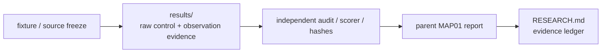

# Retained DOOM / MAP01 results

This directory contains committed DOOM/MAP01 result artifacts, raw traces, audits, videos/frames where retained, and failed or successful allocations referenced by reports under [`../`](../).

Result directories are evidence containers, not benchmark rankings or proof of current gameplay capability. Scientific interpretation belongs to the corresponding report/plan/audit and the top-level [`../../../RESEARCH.md`](../../../RESEARCH.md).

## Evidence flow

This is a reading guide only. Historical allocations differ in artifact shape, and not every result directory contains every node shown above.

## Interpretation rules

- Retained failures and stopped allocations stay visible when they constrain later design.
- A mechanism PASS does not imply MAP01 completion, human-tempo control, general speedup, or product readiness unless the report explicitly establishes that claim.
- Privileged engine state used for scoring is separate from visual-controller authority unless a specific experiment states otherwise.
- Later successors must preserve the original result rather than silently replacing it.
- Use the parent [`../README.md`](../README.md) and linked MAP01 reports to understand a directory's scope.

## Fresh runs

Never overwrite a committed retained allocation. Use a distinct allocation/result path and preserve first outcomes according to the experiment's frozen protocol.

## Related navigation

- Parent DOOM track: [`../README.md`](../README.md)
- Research workspace: [`../../README.md`](../../README.md)
- Current objective: [`../../../docs/CURRENT_GOAL.md`](../../../docs/CURRENT_GOAL.md)
- Evidence map: [`../../../docs/EVIDENCE_MAP.md`](../../../docs/EVIDENCE_MAP.md)
- Evidence ledger: [`../../../RESEARCH.md`](../../../RESEARCH.md)
