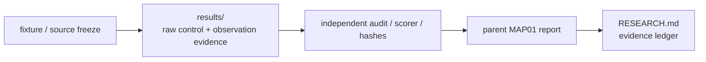

# Retained DOOM / MAP01 results

This directory contains committed DOOM/MAP01 result artifacts, raw traces, audits, videos/frames where retained, and failed or successful allocations referenced by reports under [`../`](../).

Result directories are evidence containers, not benchmark rankings or proof of current gameplay capability. Scientific interpretation belongs to the corresponding report/plan/audit and the top-level [`../../../RESEARCH.md`](../../../RESEARCH.md).

## Evidence flow

```mermaid
flowchart LR
    FIX[fixture / source freeze]
    RUN[results/<allocation>\nraw control + observation evidence]
    AUD[independent audit / scorer / hashes]
    REP[parent MAP01 report]
    LED[RESEARCH.md\nevidence ledger]

    FIX --> RUN
    RUN --> AUD
    AUD --> REP
    REP --> LED
```

This is a reading guide only. Historical allocations differ in artifact shape, and not every result directory contains every node shown above.

## Interpretation rules

- Retained failures and stopped allocations stay visible when they constrain later design.
- A mechanism PASS does not imply MAP01 completion, human-tempo control, general speedup, or product readiness unless the report explicitly establishes that claim.
- Privileged engine state used for scoring is separate from visual-controller authority unless a specific experiment states otherwise.
- Later successors must preserve the original result rather than silently replacing it.
- Use the parent [`../README.md`](../README.md) and linked MAP01 reports to understand a directory's scope.

## Fresh runs

Never overwrite a committed retained allocation. Use a distinct allocation/result path and preserve first outcomes according to the experiment's frozen protocol.

## Recent measurement evidence

- [Issue #59 current-main V13-to-V4 bridge A01](v13_v4_release_bridge_59_current_main_a01_20261004/README.md) — ordinary-up direct composition failure reproduced; adapted synthetic bridge tests pass 5/5 and saved-row audit 18 checks. Complements #7542 V12 cancellation-interval/Executor V13 fixture evidence but does not join both into runtime; native Windows only and not WSLc-qualified Issue evidence.
- [Pre-#7513 V13-to-V4 source snapshot](v13_v4_release_bridge_59_construction_v1/README.md) — preserved historical construction package; its run 02 source-preflight path error remains unqualified.
- [MAP01 measurement-integration live-03](map01_measurement_integration_live_03/README.md) — one GitHub-hosted no-model telemetry allocation; measurement and terminal-score audits pass, but the episode did not finish or exit MAP01. Triggered by an archival-tag push; not recovery-vs-coast efficacy and not the WSLc allocation.

## Related navigation

- Parent DOOM track: [`../README.md`](../README.md)
- Research workspace: [`../../README.md`](../../README.md)
- Current objective: [`../../../docs/CURRENT_GOAL.md`](../../../docs/CURRENT_GOAL.md)
- Evidence map: [`../../../docs/EVIDENCE_MAP.md`](../../../docs/EVIDENCE_MAP.md)
- Evidence ledger: [`../../../RESEARCH.md`](../../../RESEARCH.md)
