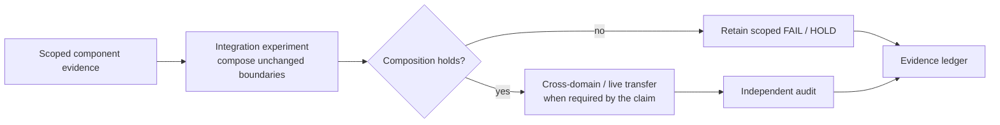

# Integration research

This directory contains experiments that compose previously isolated mechanisms across shared runtime, caller, recovery, effect, application, or domain boundaries.

Child directories are retained integration studies. Their existence does not imply that the composed mechanism is globally promoted or production-ready.

## Composition path

Integration work should make the composed boundary explicit: runtime + caller, authority + effect, platform + backend, or mechanism + application/domain. It should not silently upgrade isolated component evidence into an end-to-end claim.

## Typical composition scopes

| Scope | Examples of what is being joined |
|---|---|
| Runtime/caller | Admission, typed outcomes, recovery, caller-visible receipts. |
| Authority/effect | Input authority, publication, effect verification, outcome contracts. |
| Backend/platform | Platform-neutral semantics with native backend behavior. |
| Application/domain | The same mechanism transferred into another real application or task family. |
| Recovery/durability | Pending work, replay/idempotency, restart, durable outcome reconciliation. |

Child directory names are retained provenance, not a canonical architecture tree. Use each experiment's report for the exact composition and decision rule.

## Interpretation

- Use [`../../RESEARCH.md`](../../RESEARCH.md) for the evidence ledger and claims taxonomy.
- Use [`../../docs/CURRENT_GOAL.md`](../../docs/CURRENT_GOAL.md) for the current governing direction.
- Read each child experiment's own plan/report/audit for its exact scope and scientific disposition.
- Component evidence and integration evidence remain distinct; a component PASS is not an integrated PASS.

Historical and superseded integration paths remain in place when their exact names are part of the evidence chain.
