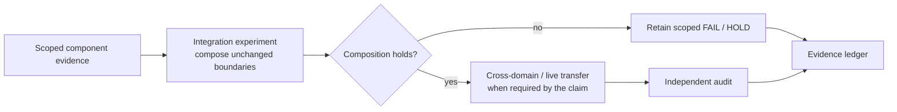

# Integration research

This directory contains experiments that compose previously isolated mechanisms across shared runtime, caller, recovery, effect, application, or domain boundaries.

Child directories are retained integration studies. Their existence does not imply that the composed mechanism is globally promoted or production-ready.

## Composition path

## Retained source-route reconstruction

- [Issue #57 TodoMVC source-event route](todomvc_event_route_57_20261003_01a0ff59/README.md) — the frozen eight-row source-level reconstruction records that input/blur and Tab without a `change` event created no item, while explicit `change` reached the original model/storage route. The first saved-data auditor failure and corrected V2 audit remain preserved. This does not establish actual SDK/browser event delivery or explain the earlier browser stop. [Rescue custody qualification](../../runtime/results/todomvc_route_rescue_b714/README.md); no historical allocation was replayed.

Retained [primary first-error author packet](current_primary_first_error_57_20261003_01a0ff53/REPORT.md) and [V2 review](review_current_primary_v2_57_20261003_45e9/README.md): original RED/GREEN, controlled decoder composition and first environment/export/audit failures remain unchanged. [Rescue verification](../../runtime/results/primary_v2_rescue_9720/README.md) separates public byte integrity and current two-case regression from historical producer replay or adoption authority.

Retained [primary V1 author packet](current_primary_57_20261003_01a0ff53/README.md) and [corrected review/disposition](review_current_primary_57_20261003_45e9/README.md): later OUTPUT masks the first backlog diagnosis in two historical cells; V1 adoption remains cancelled/HOLD. Author overlap and first preparation/audit errors are preserved. [Rescue checks](../../runtime/results/primary_review_rescue_9726/README.md) verify saved bytes only, not a successor adoption or experiment replay.

Retained C01 callback-custody profile and versioned audit correction: [compiled custody v4 cycles](compiled_custody_v4_cycles_C01_20261003_01a0ff35/README.md). Original v1 missed27 complete callback-schedule corruptions; v2 preserves all original timing/raw/results and rejects those copies. `CPU_SECONDS_UNRESOLVED` remains, and counter reads outside wall endpoints are not subtracted or converted. Fresh [saved-data rescue checks](../../runtime/results/compiled_custody_rescue_5775/README.md) are not a measurement replay, clock calibration, practical efficiency or adoption certificate.

```mermaid
flowchart LR
    C[Scoped component evidence]
    I[Integration experiment<br/>compose unchanged boundaries]
    F{Composition holds?}
    X[Cross-domain / live transfer<br/>when required by the claim]
    A[Independent audit]
    L[Evidence ledger]
    H[Retain scoped FAIL / HOLD]

    C --> I --> F
    F -->|no| H --> L
    F -->|yes| X --> A --> L
```

Integration work should make the composed boundary explicit: runtime + caller, authority + effect, platform + backend, or mechanism + application/domain. It should not silently upgrade isolated component evidence into an end-to-end claim.

## Typical composition scopes

| Scope | Examples of what is being joined |
|---|---|
| Runtime/caller | Admission, typed outcomes, recovery, caller-visible receipts. |
| Authority/effect | Input authority, publication, effect verification, outcome contracts. |
| Backend/platform | Platform-neutral semantics with native backend behavior. |
| Application/domain | The same mechanism transferred into another real application or task family. |
| Recovery/durability | Pending work, replay/idempotency, restart, durable outcome reconciliation. |

Child directory names are retained provenance, not a canonical architecture tree. Use each experiment's report for the exact composition and decision rule.

- [#3311 A01 saved click-to-text boundary audit](calc3311_click_text_boundary_20261004_01a0ff51/README.md) — frozen source hashes and saved FODS agree; the first key follows the click without a selected-cell acknowledgement. The saved effect failure is independently reproduced, but native key-to-cell routing and causal attribution remain unobserved. No GUI, input, model, or formal allocation was rerun.

- [Primary stdio busy-bound evidence rescue (#57)](primary_stdio_busy_rescue_20261003/README.md) — PR #6902's finite Windows/Node evidence and CI-selection records are preserved without integrating its unverified runtime/workflow changes; scope remains `PASS_PRIMARY_BUSY_BOUND_SCOPED`.

- [Tk first-character #5260 allocation proposal and construction record](tk_firstchar_5260_a01_20261002/PREREG.md) — 96-row GUI allocation is explicitly **HOLD_NOT_AUTHORIZED**; three construction-only probes are retained, with smoke-03 passing the scoped runner/auditor gate. No formal first-character trials were run.

- [Tk first-character #5260 A02 WSLc outcome](tk_firstchar_5260_a02_wslc_20261003/REPORT.md)
  — one 96-row disposable Tk allocation, descriptive65 exact/31 nonexact;
  frozen auditor PASS_AUDIT but stronger checker finds96 readiness-epoch
  mismatches: overall STOP. Original sources/raw/failed checker/images
  retained. Not a qualified scientific PASS/FAIL or production fix.

- [Tk readiness #5260 A03 no-input successor](tk_firstchar_5260_a03_wslc_20261003/REPORT.md)
  — four legacy apps wrote two readiness epochs, four corrected apps wrote
  one; independent construction custody passed, no key/click input and no
  first-character/public-client/migration-benefit qualification.

- [Tk first-character #5260 A04 immutable-ready successor](tk_firstchar_5260_a04_wslc_20261003/REPORT.md)
  — new48-row scoped method evidence:38 exact/10 nonexact saves, readiness
  custody48/48; all10 initialh receipts in decoy before target FocusIn.
  Not a public-client/default-wait/visual/performance/resource qualification.

- [Tk first-character #5260 A05 focus-ack construction](tk_firstchar_5260_a05_wslc_20261003/REPORT.md)
  — ten fresh apps, method audit passed but H_FAIL:ACK3/4 exact plus1busy
  refusal, immediate0/4 exact, wrong-target2/2 safe refusals. Private app
  oracle only; publication/read/admission visibility remains unresolved.

- [Tk receipt #5260 A06 publication/read boundary](tk_receipt_visibility_5260_a06_wslc_20261003/REPORT.md)
  — eight new no-input writers, artificial100ms publication/read delays;
  both produce oldstamp expiry4/4 while full trace distinguishes phases.
  Construction only, not A05 attribution, focus freshness or performance.

## Preserved older Draft publications

- [Writer selection scope #4425 / Draft PR #4446](writer_selection_scope_w4m8_v1/ARCHIVAL_QUALIFICATION.md) — seven exact published files retained; complete 401-file raw corpus missing, so this is not an independent reproduction or qualification of the reported PASS.
- [Router membership #4430 / Draft PR #4452](router_membership_q5m8_v1/ARCHIVAL_QUALIFICATION.md) — three exact STOP metadata files retained; complete 457-file capsule missing and the historical result is not independently reproduced here.

## Freeze-only records with unrecoverable source/raw

- [Text suffix recovery #4040](text_suffix_recovery_v1/ARCHIVAL_QUALIFICATION.md) — exact preformal freeze retained for provenance; Issue-reported 48-case PASS remains HOLD because sources, raw batches, audit receipts, and predecessor corpus are unavailable.
- [Live GUI dependency ledger #2317](live_gui_dependency_ledger_2317_v1/ARCHIVAL_QUALIFICATION.md) — exact four-file freeze/plan/environment record retained; Issue-reported 36-case PASS remains unverified because runner/auditor source and raw/audit evidence are absent.
- [Referenced-image retention budget #4064](referenced_image_retention_budget_v1/ARCHIVAL_QUALIFICATION.md), [text-consumption context #4061](text_consumption_context_9bd1_v1/ARCHIVAL_QUALIFICATION.md), [outcome-poll snapshot #4063](../verification/outcome_poll_snapshot_d19a_v1/ARCHIVAL_QUALIFICATION.md), [key-event reduction #4059](key_event_reduction_2107_v1/ARCHIVAL_QUALIFICATION.md), and [O2 cost attribution #4065](../measurement/o2_cost_attribution_v1/ARCHIVAL_QUALIFICATION.md) — exact freeze metadata only; see each qualification for reported disposition and missing source/raw gate. No result is independently reproduced or promoted.

## Interpretation

- Use [`../../RESEARCH.md`](../../RESEARCH.md) for the evidence ledger and claims taxonomy.
- Use [`../../docs/CURRENT_GOAL.md`](../../docs/CURRENT_GOAL.md) for the current governing direction.
- Read each child experiment's own plan/report/audit for its exact scope and scientific disposition.
- Component evidence and integration evidence remain distinct; a component PASS is not an integrated PASS.

Historical and superseded integration paths remain in place when their exact names are part of the evidence chain.

## Current local constructions

- [`public_mcp_geometry_review_2907_construction01_v1/REPORT.md`](public_mcp_geometry_review_2907_construction01_v1/REPORT.md) — three additive Docker constructions for same-root geometry review and stale-binding refusal. Construction03 passes the scoped mechanism audit; overall formal disposition remains HOLD (runner decision mismatch, no independent app-effect oracle, and no mixed-app controller acceptance).

- [`public_mcp_modal_effect_2907_construction01_v1/REPORT.md`](public_mcp_modal_effect_2907_construction01_v1/REPORT.md) — local public-MCP Calc modal-effect construction STOP at main-window readiness (zero MCP/input); preflight failures and successful STOP audit retained. No integrated or product PASS.
- [`issue_2907_active_xid_screen_contrast_20260928/REPORT.md`](issue_2907_active_xid_screen_contrast_20260928/REPORT.md) — Docker Desktop/Xvfb construction03 independently audits active-XID versus visible-pixel divergence and its EWMH positive control; scoped synthetic PASS only, not an integrated or product PASS.

- [`golden_v3_audit_input_binding_2198_v1/REPORT.md`](golden_v3_audit_input_binding_2198_v1/REPORT.md) — Docker Desktop audit of #2198's hardcoded checker: six inputs produce identical output; independent raw JSON finds seven absent required fields, one contradictory schema identity, and `usage` present. Checker input-binding FAIL; reconciliation remains HOLD.

- [`golden_v3_docker_slot_correction_2198_v1/RESOURCE_CORRECTION.md`](golden_v3_docker_slot_correction_2198_v1/RESOURCE_CORRECTION.md) — retrospective correction: the #2198 audit launched Docker containers during #5074's exclusive CPU-slot reservation; no further container run until explicit release.

- [`issue_2195_modal_selection_pilot_v1/REPORT.md`](issue_2195_modal_selection_pilot_v1/REPORT.md) - retained modal PNG, SVG fixture and six-case specification; one request timed out, zero model responses received or retained, `HOLD_PILOT_INFERENCE_TIMEOUT`.

## Retained runtime failure boundaries

- [WSLc memory-cap receipt audit — #3352/#6309](wslc_memory_enforcement_3352_t1_audit_20261002/REPORT.md) — independent WSLc audit confirms the exact local record of both 512M/128M trials retaining 384 MiB and exiting 0 (`PASS_INDEPENDENT_AUDIT_SCOPED`); PR #6309's published files differ from that original packet. Receipt evidence only: no effective cap, peak RSS, representative workload or migration-benefit proof; #3352 remains open.

- [Public MCP pre-worker executor rejection](mcp_executor_rejection_5375_dot_v1/REPORT.md), Issue #5539: `FAIL_PREWORKER_CAPACITY_RELEASE` in one deliberately injected lifecycle fault. A healthy executor and fresh server recover while the affected server remains busy with no invoked operation. Exact original source/receipts and warning are retained; no native/GUI action or production repair is included. [Lossless module-map restoration](mcp_executor_rejection_5375_dot_v1/PACKAGING.md).

## Retained construction and precheck archives

- [Tk validation-lifecycle #4367 / Draft PR #4375 metadata archive](tk_validation_lifecycle_v9m3_v1/ARCHIVAL_QUALIFICATION.md): three exact published metadata files, not executable source or independently established construction/formal results; STOP_PRE_ALLOCATION_PUBLICATION and HOLD_PENDING_PERMITTED_PUBLICATION remain, original Draft and owner Issue stay open.
- [X11 transition coalescing #4422 / Draft PR #4438 metadata archive](x11_transition_coalescing_c4d7_v1/ARCHIVAL_QUALIFICATION.md): three exact metadata files; STOP_PRE_ALLOCATION_PUBLICATION, formal 0/12 cases and 0/38 captures remain; no blocked runner/source, construction raw, or formal result is independently available, and the original Draft/branch/Issue stay open.
- [Broker timeout-start #5074 / PR #5113 preservation](broker_fake_child_timeout_start_5074_v5_20260928/ARCHIVE_QUALIFICATION_20261001.md): `STOP_PRECHECK_ONLY_NOT_FORMAL`; 29 exact historical source/construction files, no formal raw or audit. The self-release declaration and freeze/receipt mismatches are preserved with explicit qualifications; no lease or scientific PASS/FAIL is established.

- [Mindustry three-arm economics #5130 / PR #5136 preservation](mindustry_three_arm_economics_20260928/ARCHIVAL_QUALIFICATION.md): 44 exact historical source/synthetic-construction blobs; `PASS_CONSTRUCTION_ONLY`, sentinel identities and historical-only 86/86 host checks. Docker coordination violations remain disclosed; no live/model/formal economics result. Source PR remains Draft and owner #5130 stays open.

## Retained source with result-publication HOLD

- [Passive-reader pagination #3985 / Draft PR #4012](passive_reader_pagination_cost_v1/ARCHIVAL_QUALIFICATION.md): 15 exact source/summary blobs; `HOLD_FULL_RAW_PUBLICATION`, full original raw absent and repository-only audit incomplete. Continue the existing recovery owner; no consumed-allocation rerun or original-branch cleanup.
- [Inkscape ROI reanchor #4359](inkscape_roi_reanchor_d4p1_v1/RECOVERY_STATUS.md): exact frozen source capsule is recoverable; Issue #4359 reports the completed 30-case scoped PASS, but formal raw/result/audit/control bytes are absent from the branch and its Actions runs. This source-only preservation does not independently verify or integrate the reported formal result; keep the Issue and original branch open for exact-byte recovery.
- [Inkscape first-motion #4388](inkscape_first_motion_f2a6_v1/RECOVERY_STATUS.md): the ten-file preformal source is preserved; Issue #4388 reports the completed eight-case scoped result, but the formal raw archive was not verified after its 17-fragment publication attempt. This source-only preservation does not independently verify the reported result; retain the Issue and original branch for exact-byte recovery.

- [Retired primary stream source #6919 and independent reviews](../recovery/retired_primary_stream_source_20261004/README.md) — 649 exact archive files plus full source/review histories; failed constructions and V2 CONTENT_HOLD retained, current runtime unchanged, no adoption or transfer of #6979 application authority.

- [Retired primary review supplements #6919](../recovery/retired_primary_review_supplements_20261004/README.md) — 324 exact review files and two source histories; Windows output-pipe witnesses and the original accepted-transport FAIL retained, no old vote transfer or current runtime adoption.

- [Retired checkpoint and nominal-record reviews #6918 / #6923](../recovery/retired_record_review_custody_20261004/README.md) — 64 exact review files and two source histories; first reviewer failures and old preparation tuples retained, no current runtime adoption or historical vote transfer.
