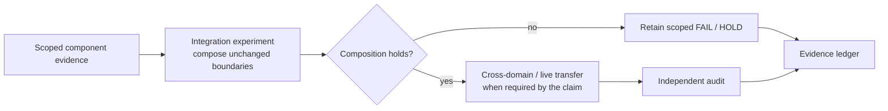

# Integration research

This directory contains experiments that compose previously isolated mechanisms across shared runtime, caller, recovery, effect, application, or domain boundaries.

Child directories are retained integration studies. Their existence does not imply that the composed mechanism is globally promoted or production-ready.

## Composition path

```mermaid
flowchart LR
    C[Scoped component evidence]
    I[Integration experiment<br/>compose unchanged boundaries]
    F{Composition holds?}
    X[Cross-domain / live transfer<br/>when required by the claim]
    A[Independent audit]
    L[Evidence ledger]
    H[Retain scoped FAIL / HOLD]

    C --> I --> F
    F -->|no| H --> L
    F -->|yes| X --> A --> L
```

Integration work should make the composed boundary explicit: runtime + caller, authority + effect, platform + backend, or mechanism + application/domain. It should not silently upgrade isolated component evidence into an end-to-end claim.

## Typical composition scopes

| Scope | Examples of what is being joined |
|---|---|
| Runtime/caller | Admission, typed outcomes, recovery, caller-visible receipts. |
| Authority/effect | Input authority, publication, effect verification, outcome contracts. |
| Backend/platform | Platform-neutral semantics with native backend behavior. |
| Application/domain | The same mechanism transferred into another real application or task family. |
| Recovery/durability | Pending work, replay/idempotency, restart, durable outcome reconciliation. |

Child directory names are retained provenance, not a canonical architecture tree. Use each experiment's report for the exact composition and decision rule.

## Interpretation

- Use [`../../RESEARCH.md`](../../RESEARCH.md) for the evidence ledger and claims taxonomy.
- Use [`../../docs/CURRENT_GOAL.md`](../../docs/CURRENT_GOAL.md) for the current governing direction.
- Read each child experiment's own plan/report/audit for its exact scope and scientific disposition.
- Component evidence and integration evidence remain distinct; a component PASS is not an integrated PASS.

Historical and superseded integration paths remain in place when their exact names are part of the evidence chain.

## Current local constructions

- [`public_mcp_geometry_review_2907_construction01_v1/REPORT.md`](public_mcp_geometry_review_2907_construction01_v1/REPORT.md) — three additive Docker constructions for same-root geometry review and stale-binding refusal. Construction03 passes the scoped mechanism audit; overall formal disposition remains HOLD (runner decision mismatch, no independent app-effect oracle, and no mixed-app controller acceptance).

- [`public_mcp_modal_effect_2907_construction01_v1/REPORT.md`](public_mcp_modal_effect_2907_construction01_v1/REPORT.md) — local public-MCP Calc modal-effect construction STOP at main-window readiness (zero MCP/input); preflight failures and successful STOP audit retained. No integrated or product PASS.
- [`issue_2907_active_xid_screen_contrast_20260928/REPORT.md`](issue_2907_active_xid_screen_contrast_20260928/REPORT.md) — Docker Desktop/Xvfb construction03 independently audits active-XID versus visible-pixel divergence and its EWMH positive control; scoped synthetic PASS only, not an integrated or product PASS.

- [`golden_v3_audit_input_binding_2198_v1/REPORT.md`](golden_v3_audit_input_binding_2198_v1/REPORT.md) — Docker Desktop audit of #2198's hardcoded checker: six inputs produce identical output; independent raw JSON finds seven absent required fields, one contradictory schema identity, and `usage` present. Checker input-binding FAIL; reconciliation remains HOLD.
