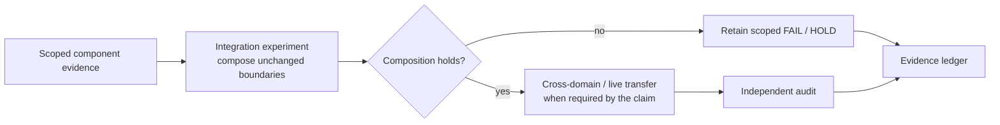

# Integration research

This directory contains experiments that compose previously isolated mechanisms across shared runtime, caller, recovery, effect, application, or domain boundaries.

Child directories are retained integration studies. Their existence does not imply that the composed mechanism is globally promoted or production-ready.

## Composition path

```mermaid
flowchart LR
    C[Scoped component evidence]
    I[Integration experiment<br/>compose unchanged boundaries]
    F{Composition holds?}
    X[Cross-domain / live transfer<br/>when required by the claim]
    A[Independent audit]
    L[Evidence ledger]
    H[Retain scoped FAIL / HOLD]

    C --> I --> F
    F -->|no| H --> L
    F -->|yes| X --> A --> L
```

Integration work should make the composed boundary explicit: runtime + caller, authority + effect, platform + backend, or mechanism + application/domain. It should not silently upgrade isolated component evidence into an end-to-end claim.

## Typical composition scopes

| Scope | Examples of what is being joined |
|---|---|
| Runtime/caller | Admission, typed outcomes, recovery, caller-visible receipts. |
| Authority/effect | Input authority, publication, effect verification, outcome contracts. |
| Backend/platform | Platform-neutral semantics with native backend behavior. |
| Application/domain | The same mechanism transferred into another real application or task family. |
| Recovery/durability | Pending work, replay/idempotency, restart, durable outcome reconciliation. |

Child directory names are retained provenance, not a canonical architecture tree. Use each experiment's report for the exact composition and decision rule.

## Interpretation

- Use [`../../RESEARCH.md`](../../RESEARCH.md) for the evidence ledger and claims taxonomy.
- Use [`../../docs/CURRENT_GOAL.md`](../../docs/CURRENT_GOAL.md) for the current governing direction.
- Read each child experiment's own plan/report/audit for its exact scope and scientific disposition.
- Component evidence and integration evidence remain distinct; a component PASS is not an integrated PASS.

Historical and superseded integration paths remain in place when their exact names are part of the evidence chain.

## Current local constructions

- [`public_mcp_geometry_review_2907_construction01_v1/REPORT.md`](public_mcp_geometry_review_2907_construction01_v1/REPORT.md) — three additive Docker constructions for same-root geometry review and stale-binding refusal. Construction03 passes the scoped mechanism audit; overall formal disposition remains HOLD (runner decision mismatch, no independent app-effect oracle, and no mixed-app controller acceptance).

- [`public_mcp_modal_effect_2907_construction01_v1/REPORT.md`](public_mcp_modal_effect_2907_construction01_v1/REPORT.md) — local public-MCP Calc modal-effect construction STOP at main-window readiness (zero MCP/input); preflight failures and successful STOP audit retained. No integrated or product PASS.
- [`issue_2907_active_xid_screen_contrast_20260928/REPORT.md`](issue_2907_active_xid_screen_contrast_20260928/REPORT.md) — Docker Desktop/Xvfb construction03 independently audits active-XID versus visible-pixel divergence and its EWMH positive control; scoped synthetic PASS only, not an integrated or product PASS.

- [`golden_v3_audit_input_binding_2198_v1/REPORT.md`](golden_v3_audit_input_binding_2198_v1/REPORT.md) — Docker Desktop audit of #2198's hardcoded checker: six inputs produce identical output; independent raw JSON finds seven absent required fields, one contradictory schema identity, and `usage` present. Checker input-binding FAIL; reconciliation remains HOLD.

- [`golden_v3_docker_slot_correction_2198_v1/RESOURCE_CORRECTION.md`](golden_v3_docker_slot_correction_2198_v1/RESOURCE_CORRECTION.md) — retrospective correction: the #2198 audit launched Docker containers during #5074's exclusive CPU-slot reservation; no further container run until explicit release.

- [`issue_2195_modal_selection_pilot_v1/REPORT.md`](issue_2195_modal_selection_pilot_v1/REPORT.md) - retained modal PNG, SVG fixture and six-case specification; one request timed out, zero model responses received or retained, `HOLD_PILOT_INFERENCE_TIMEOUT`.

## Retained runtime failure boundaries

- [Public MCP pre-worker executor rejection](mcp_executor_rejection_5375_dot_v1/REPORT.md), Issue #5539: `FAIL_PREWORKER_CAPACITY_RELEASE` in one deliberately injected lifecycle fault. A healthy executor and fresh server recover while the affected server remains busy with no invoked operation. Exact original source/receipts and warning are retained; no native/GUI action or production repair is included. [Lossless module-map restoration](mcp_executor_rejection_5375_dot_v1/PACKAGING.md).

## Retained construction and precheck archives

- [Broker timeout-start #5074 / PR #5113 preservation](broker_fake_child_timeout_start_5074_v5_20260928/ARCHIVE_QUALIFICATION_20261001.md): `STOP_PRECHECK_ONLY_NOT_FORMAL`; 29 exact historical source/construction files, no formal raw or audit. The self-release declaration and freeze/receipt mismatches are preserved with explicit qualifications; no lease or scientific PASS/FAIL is established.

- [Mindustry three-arm economics #5130 / PR #5136 preservation](mindustry_three_arm_economics_20260928/ARCHIVAL_QUALIFICATION.md): 44 exact historical source/synthetic-construction blobs; `PASS_CONSTRUCTION_ONLY`, sentinel identities and historical-only 86/86 host checks. Docker coordination violations remain disclosed; no live/model/formal economics result. Source PR remains Draft and owner #5130 stays open.

## Retained source with result-publication HOLD

- [Inkscape ROI reanchor #4359](inkscape_roi_reanchor_d4p1_v1/RECOVERY_STATUS.md): exact frozen source capsule is recoverable; Issue #4359 reports the completed 30-case scoped PASS, but formal raw/result/audit/control bytes are absent from the branch and its Actions runs. This source-only preservation does not independently verify or integrate the reported formal result; keep the Issue and original branch open for exact-byte recovery.
- [Inkscape first-motion #4388](inkscape_first_motion_f2a6_v1/RECOVERY_STATUS.md): the ten-file preformal source is preserved; Issue #4388 reports the completed eight-case scoped result, but the formal raw archive was not verified after its 17-fragment publication attempt. This source-only preservation does not independently verify the reported result; retain the Issue and original branch for exact-byte recovery.
