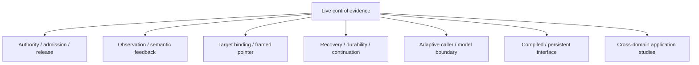

# Asynchronous live control: development evidence

> **Directory role:** retained live-control development evidence. For current project status, use the canonical status documents below; older “Latest” entries are historical within this directory.

## Navigate

| Need | Read |
|---|---|
| Current project objective | [../../docs/CURRENT_GOAL.md](../../docs/CURRENT_GOAL.md) |
| Latest cross-project handoff | [../../docs/LOCAL_RESEARCH_HANDOFF.md](../../docs/LOCAL_RESEARCH_HANDOFF.md) |
| Current Linux research caller | [CURRENT_CLIENT.md](CURRENT_CLIENT.md) |
| Project evidence ledger | [../../RESEARCH.md](../../RESEARCH.md) |
| Retained raw result artifacts | [results/README.md](results/README.md) |
| Recycled-XID process-incarnation guard (Issue #3555; scoped, provenance-limited) | [XRes guard report](x11_xres_incarnation_guard_3555_v1/REPORT.md) |
| X-server reincarnation identity boundary (Issue #3574; scoped, no promotion) | [lifetime replication report](../integration/typed_recovery_xserver_lifetime_v1/issue_3574_lifetime_01/evidence/REPORT.md) |
| Implemented live-control surface | [What is implemented](#what-is-implemented) |
| Reproduction notes | [Reproduce](#reproduce) |

## Track map



| Theme | Representative entry points |
|---|---|
| Authority, action validity, and release | [`ACTION_VALIDITY_ADMISSION_V1.md`](ACTION_VALIDITY_ADMISSION_V1.md), [`RUNNING_ACTION_GUARD_V1.md`](RUNNING_ACTION_GUARD_V1.md) |
| Observation and semantic feedback | [`CHROMIUM_SEMANTIC_PROBE_TRANSFER_V1.md`](CHROMIUM_SEMANTIC_PROBE_TRANSFER_V1.md), [`RELEASE_AWARE_PREPARATION_V1.md`](RELEASE_AWARE_PREPARATION_V1.md) |
| Target binding and coordinate frames | [`SCOPED_TARGET_HANDLES_V1.md`](SCOPED_TARGET_HANDLES_V1.md), [`FRAMED_POINTER_INTENTS_V1.md`](FRAMED_POINTER_INTENTS_V1.md) |
| Recovery, continuation, and durability | [`AUTO_RECOVER_INK.md`](AUTO_RECOVER_INK.md), [`CHECKPOINT_CONTINUATION.md`](CHECKPOINT_CONTINUATION.md) |
| Adaptive caller / local repair | [`ADAPTIVE_ACQUISITION_CALLER_V3.md`](ADAPTIVE_ACQUISITION_CALLER_V3.md), [`ADAPTIVE_SEMANTIC_REPAIR_LIVE_V2.md`](ADAPTIVE_SEMANTIC_REPAIR_LIVE_V2.md) |
| Compiled / persistent interface | [`COMPILED_GUI_INTERFACE_LIVE_V5.md`](COMPILED_GUI_INTERFACE_LIVE_V5.md), [`INTEGRATED_EFFICIENCY_LIVE_V1.md`](INTEGRATED_EFFICIENCY_LIVE_V1.md) |
| Cross-domain transfer | OpenTTD reports under `OPENTTD_*`, plus retained Calc/Inkscape/browser/Mindustry studies in this directory |

This is a navigation map, not a dependency graph or promotion hierarchy. Individual reports remain authoritative for scope and disposition.


<details>
<summary><strong>Expand retained live-control chronology</strong></summary>

Latest model-free boundary: [running action guard v1](RUNNING_ACTION_GUARD_V1.md)
uses the exact observations already emitted during held input to re-evaluate a
planner-authored action contract. Retained v31 replay accepts22/22 historical
primary frames; health-loss and zero-ammo controls require cancel and verified
empty release. It is not yet wired into a live controller and makes no latency
or gameplay claim.

Current next block: [integrated token-efficiency evaluation plan v1](INTEGRATED_EFFICIENCY_PLAN_V1.md).
Issue #57's three-arm comparison retains a batched plain baseline and measures the
same cold/warm/layout-invalidation/repair sequence against ephemeral and persistent
compiled paths.  The composition and requirement matrix are selected; the live
allocation is not yet preregistered or run.  The subsequent DOOM gate is a
continuously advancing Freedoom `MAP01` clear attempt, not the existing small
`basic.wad` transport scenario.

Fixture checkpoint: `integrated_efficiency_fixture_v1.py` implements one
append-only six-task scorer with A/A/A/B/B/B layouts.  Its exact, duplicate and
wrong-token controls pass, and runtime/socket adapters now expose it through the
existing `session_v33` checked-input path.  A no-input X11 smoke returns an exact
initial frame and correctly scores all six tasks missing.  No arm has been run.
The new `integrated_efficiency_protocol_v1.py` also fixes the arm schedule and
scores the frozen decision rule.  Five fail-closed controls pass after repairing
an initial cross-task duplicate-call-ID validation hole.  The live controller
and preregistration remain open.
The two-layout socket probe initially rejected query-string URL text before any
task input.  The preserved failure motivated path-only fixture URLs; the fresh
probe then observes distinct exact A/B frames and four verified releases through
the shared runtime.  It deliberately performs no model call or form submission.
Persistent mechanics then pass after four preserved failures: the final
engineering run submits all six expected tokens exactly once, reuses A and B
handles, refuses the old A handle as `MISSING` at task 4 with zero stale input,
repairs by minting B handles, records 12 intended button-down admissions and
verifies release on all 41 programs.  Human-inspected points and zero model calls
exclude this evidence from the formal efficiency result.
Issue #57's integration-gap follow-up is now represented by
`integrated_efficiency_discoveries_v1.json`: three interface mismatches and four
benchmark/setup/accounting defects, each tied to its retained allocation,
smallest repair, regression and non-additive overhead.  The protocol rejects
missing provenance and silent post-start repair, and returns HOLD when a formal
discovery invalidates the allocation.
The first common-client three-arm run then exposes and retains an invalid
hyphenated ephemeral alias after plain succeeds6/6.  Prefix normalization fixes
the adapter without weakening the registry.  Fresh v2 completes18/18 exact
tasks: mint counts0/12/4 and durable calls36/96/82 for plain/ephemeral/persistent,
with36 intended button downs and empty verified release on every terminal.

Latest target-reference result: [scoped target handles](SCOPED_TARGET_HANDLES_V1.md).
Exact session-local handles return explicit valid/revalidated/ambiguous/moved/
missing/stale/scope states. A flat archived region aliases and is retained as a
failure; v2 refuses it. One fresh OpenTTD handle follows observed X11 client
translation `[17,20]` and admits its derived click in280.790ms, but the
preregistered fixed-delta endpoint is false and no independent semantic effect is
proved. Candidate remains on hold; next allocation needs a different desktop
task plus an independent effect oracle.

A matched fresh Chromium pair supplies that oracle. Positive follows observed
client delta `[20,8]`, resolves Save to `[290,251]`, and the HTTP/file scorer
receives exact `t991005`; input ack to useful frame/semantic completion is
60.016/192.643ms. Same-surface navigation to `about:blank` returns `MISSING`
with zero pointer admission and no submission. All36 frames audit cross-OS.
Retain for a different matched-domain replication; no model/turn/token benefit
or general semantic identity is established.

Latest framed-intent result: [live binding-resolved pointer intents](FRAMED_POINTER_INTENTS_V1.md).
The runner sends original1024 coordinates while `executor_v4/session_v26`
resolve frame-bearing clicks, drags and condition boxes from a fresh1152x720
binding. Positive/repeat agree with the engine2/2 over69 frames. A separate
post-admission surface move is refused before any pointer admission in105.333ms.
Frame identity remains task-declared and local effect feedback remains about2.5s.

Latest resolution-transfer result: [OpenTTD coordinate frames](OPENTTD_COORDINATE_FRAMES_V1.md).
Two retained global-transform failures reveal that centered toolbar chrome and
window-relative map content move differently. Explicit frame transforms then
pass positive/repeat pairs4/4 across1280x720 and a preregistered1152x720
replication. Corrected evidence covers135 frames; all265 frames including
failures replay exactly cross-OS. One known save/path and2.46–2.60s local
feedback remain material limits.

Latest derived-condition result: [OpenTTD path-derived target/guard geometry](OPENTTD_TARGET_GUARD_DERIVED_GEOMETRY_V1.md).
The boxes now come from the admitted pointer path. Frozen calibration passes3/3;
a fresh wrong-row assumption is retained as an aliased positive under tile
snapping, and a separate completed-segment repeat is correctly stopped before
continuation. All106 fresh frames audit cross-OS. The path is development-known,
and roughly2.5s drag-to-condition timing remains.

Latest fresh placement result: [OpenTTD target/guard continuation](OPENTTD_TARGET_GUARD_LIVE_V1.md).
The first preregistered pair retains a driver failure: it omits the Road
Construction opener, so neither allocation builds A-to-B; both safely stop and
fail the independent score. Adding only the missing `(820,51)` click produces a
corrected pair, and an unchanged reverse-order replication reproduces it.
Across the corrected studies, target admits B-to-C and independently completes
the L2/2, while wrong-row stops before B-to-C2/2. All119 exact frames, releases,
process exits and save checks audit on Windows/WSL. Promote only as a same-seed
scripted candidate; boxes remain human-authored and first-drag-to-condition is
about2.5s.

Latest placement-condition result: [local target-and-guard postcondition v1](LOCAL_TARGET_GUARD_POSTCONDITION_V1.md).
A target/guard operator first fails two archived positives because it samples
before the road effect settles. The runtime now requires bounded settle. Without
changing boxes or thresholds, six archived OpenTTD effects classify6/6 and a
fresh Inkscape target/partial/guard allocation passes3/3 after one retained focus
interruption. The28 exact frames, SVGs and releases audit cross-OS. The fresh
OpenTTD transfer and reverse-order replication are recorded above; boxes remain
human-authored.

Latest authored-condition transfer: [fresh displacement transfer](LOCAL_DISPLACEMENT_TRANSFER_V1.md).
Two opposite-order fresh X11 pairs transfer the unchanged first Luna patch.
Target24px admits Save2/2 and partial20px stops before Save2/2; all38 exact frames,
source identity, SVGs and terminal releases audit on Windows/WSL. A line-ending
sensitive preregistration failure remains retained before input. Promote only as
a same-task moved-object local postcondition candidate; paths remain scripted.

Latest model-authorship result: [local displacement authorship v1](LOCAL_DISPLACEMENT_AUTHORSHIP_V1.md).
On one fixed initial Inkscape frame, Luna-low and Astra-medium each author strict
target patches2/2. All four conditions accept retained24px samples and reject
20px samples. Luna uses25,480 total input tokens and Astra30,812 across two calls;
the samples do not support a route comparison. Advance to one fresh live transfer
without promoting or extending the claim to placement.

Latest task-relative condition: [local displacement postcondition v1](LOCAL_DISPLACEMENT_POSTCONDITION_V1.md).
After one retained HOLD pair corrects a false input-to-screen assumption, a fresh
X11 target/partial pair distinguishes24px from20px displacement. Two stable
anchor samples admit the later Save only for24px;20px returns
`target_not_reached`. The saved SVG and18 exact frames pass Windows/WSL audit.
Advance only to fixed-context model authorship; road placement needs a different
target/guard structure.

Latest local-continuation result: [local visual barrier v1](LOCAL_VISUAL_BARRIER_V1.md).
A pure persistent-pixel condition passes selected archived first effects9/9 and
stops selected repeats2/2, but a fresh X11 task-relative check rejects it. A
requested24px Inkscape move ends at12px; the barrier still sees163 changed pixels
and starts the later Save step. The matched unmet case stops before Save. Keep
single-ROI change advisory-only; the next candidate must express target-relative
displacement or separate placement target/guard regions.

Latest effect-signal result: [persistent visual-effect receipt](PERSISTENT_EFFECT_RECEIPT_V1.md).
An archived pixel threshold separates selected new road effects9/9 from repeated
completed-segment drags2/2, but the matched model test is negative. On one frozen
v11 context, exact-prompt baseline is `observed`2/2 while the receipt condition is
`uncertain`2/2 and adds156 input tokens/call. Reject the prompt form and do not run
it live. The next design separates an agent-authored local postcondition from
action authority and uses it inside an already bounded program.

Latest changed-geometry result: [bounded effect memory on a new L fixture](OPENTTD_EFFECT_MEMORY_GEOMETRY_V3.md).
The seed991004 task moves the five target tiles and visible position. Two distinct
drags independently complete it with no surrounding changes or completed-segment
repeat, but Astra needs five inspection turns to accept the first effect and
leaves the second uncertain at the12-turn bound. It uses204,114 input tokens,
195.604s model wait,62 frames and50 durable calls. The controller does not declare
completion, and a stale result-filename assumption prevents the normal supervisor
summary. The raw independent success and exit0 audit cross-OS. Hold the candidate
while completion feedback and packaging are repaired.

Latest unchanged result: [effect-memory replication](OPENTTD_EFFECT_MEMORY_REPLICATION_V2.md).
The normalized v10 source matches v9 and independently completes the same L task
on turn9 through the same two inspect/resolve boundaries. V9/v10 are2/2 hard
success and2/2 zero completed-segment repeats. V10 uses151,842 input tokens and
160.837s and remains slow; advance to changed geometry without promotion.

Latest live result: [OpenTTD bounded effect memory](OPENTTD_EFFECT_MEMORY_LIVE_V1.md).
The first preregistered fresh episode carries each of two drag effects across one
inspection turn and independently completes the five-tile L on turn9. Two
different drags, zero completed-segment repeats,44 frames and17 released terminals
audit on Windows/WSL. It uses151,853 input tokens and153.027s, slower than v7, so
retain for unchanged replication without promotion.

Latest effect-memory candidate: [bounded OpenTTD effect memory](OPENTTD_EFFECT_MEMORY_V1.md).
One unresolved drag keeps its original before/after evidence beside the latest
inspection. In two preregistered archived v8 contexts, frozen outputs are
uncertain2/2 while new Astra-medium memory-image samples are observed2/2 and
choose the same B-to-C continuation. Input rises764 tokens total. This advances
to a fresh live episode; it is not promoted and has no live correctness claim.

Latest geometry result: [seed-991002 OpenTTD transfer](OPENTTD_GEOMETRY_V5.md).
The dynamic scorer derives target/forbidden/guard tiles from the baseline and
the new fixture moves the visible target. A preregistered negative control and
fixed-Astra episode both pass their declared gates. The positive run takes
89.097s with7 calls/114,177 input tokens/32 frames/24 durable calls. More
boundaries and tokens than the prior geometry are masked by shorter sampled
model waits, so no speedup or general-route claim is made.

Latest changed-state result: [pre-opened OpenTTD road toolbar](OPENTTD_INITIAL_STATE_V4.md).
One preregistered fixed-Astra episode retains the canonical task and independent
guard but changes the initial UI. It passes in89.272s with6 calls/97,696 input
tokens. The route skips main-toolbar discovery but spends the same total model
turns and durable calls on targeting confirmation. This is one UI-state transfer,
not a speedup, geometry generalization or human comparison.

Latest timing result: [typed OpenTTD finish outcome](OPENTTD_FINISH_V3.md).
A fresh zero-input/no-model control preserves independent score=false as a typed
failure with driver exit0. The same v3 path then completes a third fixed-Astra
episode in92.377s with6 calls/97,729 input tokens, taking the exact-task record to
3/3. Different task states and a human baseline remain.

Prior timing result: [matched OpenTTD replication](OPENTTD_MATCHED_MODELS_V2.md).
Across two preregistered blocks, fixed Astra passes2/2 in98.351s and94.929s,
adaptive passes1/2 and fixed Luna passes0/2. The new adaptive failure is a visual
completion false positive caught by the engine score. This rejects promotion of
the authored adaptive route; two episodes cannot promote Astra. Windows/WSL
audits cover47 model calls,172 durable calls and270 exact frames. New tasks,
fuller order balancing and the human baseline remain.

Prior timing result: [OpenTTD adaptive live control](TIMING_ENVELOPE_OPENTTD_V1.md).
One fresh v8 episode builds the guarded three-tile road and independently passes
all four checks in111.853s. It uses two Luna-low then six Astra-medium calls;
wrapper-observed model wait totals91.781s and actual reported input is126,420
tokens. Batched delayed-hover contact sheets preserve three tooltip observations
per planner boundary. The prior Calc envelope remains
[here](TIMING_ENVELOPE_V1.md). A human baseline and repeated matched blocks remain
before any speed claim.

Latest observation-boundary result: [actual pixel redaction](REDACTED_OBSERVATION.md).
One fresh Chromium frame yields exact text in 4/4 full calls and explicit policy
UNKNOWN in 4/4 redacted calls. V2 fixes and audits half-open region geometry;
metadata raises input by 112 tokens/call, so this is not compression evidence.
A follow-up completes the same adjacent visible Save task 2/2 under full,
unmarked-redaction and explicit-redaction conditions, with zero actions into the
hidden region and six independent successes.
A required-field mutation follow-up succeeds in the full condition and produces
zero post-observation input in both redacted conditions; both model calls stop
before the local gate. The first unsupported setup string is retained as an
atomic pre-input refusal.
A policy-race follow-up gives two fresh sessions the same full presentation and
prompt; both model calls propose the edit. The unchanged policy executes and
verifies, while a policy tightened after model return causes
`policy_binding_mismatch` and zero input. This proves one actual stale-proposal
refusal, while alternate-channel/history bypass remains.
The next seed254 session exercises that refinement: identical redacted pixels
produce stop without authority, then a new observation/policy permits one exact
whole replacement and Save. The task independently verifies, the private old
value is absent from model I/O, and stale replay refuses.
The follow-up presentation bundle accepts one current full-coverage redacted
artifact and refuses 13 crop/history/alternate-channel variants before model
delivery. Eight plan-shape controls exclude append, partial selection and
caller-supplied steps from whole-replacement authority.

Latest live integration: [bounded effect wait after a partial terminal](PARTIAL_TERMINAL_WAIT.md).
The model again distinguishes expiry before and after Return; one verifier query
replaces ten caller queries on the fresh-submission path.

Latest round-trip experiment: [bounded verifier wait](EFFECT_WAIT.md). One
declared long poll replaces ten caller checkpoint calls in a fixed delayed-effect
A/B while retaining explicit UNKNOWN/VERIFIED evidence.

Latest measured boundary: [partial-terminal live decisions](PARTIAL_TERMINAL_LIVE.md).
Two same-seed Chromium programs expire before versus after Return; strict evidence
drives one fresh submission versus zero-resend waiting and both finish with an
independent saved-value check.

Latest: [optional compact presentation and actual assistant pair](PRESENTATION.md)
in `interactive_v10.py`. Full output remains the default.

Latest trial: [bounded pixel-quiet observation](PIXEL_QUIET.md) in
`interactive_v9.py`. Quietness is advisory, never task completion.

Latest: [recovery observation and actual Calc modal transition](RECOVERY.md).
`interactive_v8.py` permits observation after ambiguous focus without granting
input authority to the same program's tail.

Latest experiment: [observed-focus binding and wrong-target probes](FOCUS.md).
`interactive_v7.py` is experimental; observe-only recovery still needs work.

Latest: [independent input release under blocked logging/capture](INPUT_OWNER.md).
The [interactive owner follow-up](OWNER_SELF_USE.md) adds `interactive_v6.py`
and records actual assistant use, including a retained Calc task failure.

Follow-up: [cooperative intent expiry and input-boundary fault injection](LEASE.md).
Use `session_v4.py` for the current lease experiment; other revisions retain
their original behavior and evidence.

Follow-up: [revision 2 decision boundaries and assistant trial](DECISION_BOUNDARY.md).
The description below records the original `session.py` revision.

This research prototype separates command reading from a single GUI execution
worker. A planner can submit a finite program, receive early acknowledgements
and observations, and request cancellation while the worker is active.
It uses the existing private Xvfb application fixtures and exact O2 transport.
It is not yet a general desktop runtime or a human-speed agent benchmark.


</details>

## What is implemented

- Whole-program validation and a private copy before any input; 1–16 steps.
- One active program, explicit identifiers and rejection of implicit queuing.
- Text, key, chord, held keys, public-window-title wait and observation steps.
- Held-key duration up to 5 seconds per step; combined hold/wait budget up to
  10 seconds. These are nominal bounds, not hard deadlines under blocking I/O.
- A separate cancellation reader, per-character/loop cancellation checks,
  key release on every terminal path, and X11 keymap release verification.
- Periodic observations during holds and title waits, exact packet decoding,
  PNG reuse and separate input/observation/terminal timestamps.
- Independent task scoring only after execution ends.

`completed` means the submitted program ended; it does not assert task success.
Title matching uses public X11 window metadata and is not visual-only control.
No idle observation stream, pointer control, focus/stale-state guard, hard
watchdog, disconnect lease or production protocol hardening is implemented.
Only trusted local JSON producers are in scope. Blocking capture, file output
or stdout can delay cancellation; these measurements do not establish a bound.

## Recorded development runs

| Run | Result | Interpretation |
|---|---|---|
| `development-01` | Initial reader failed before task input | An Xlib setup warning polluted stdout; retained source snapshots and events document the failure. Setup diagnostics were then separated from JSON. |
| `development-02` | 6/6 scripted tasks; 54 exact frames | XTerm and Calc, three seeds each. Tests cancellation, input release, invalid-tail/busy rejection and timeout stopping subsequent steps. |
| `development-03` | 6/6 scripted tasks; 54 exact frames | Fresh seeds 820301–820303 after copying accepted programs and rejecting unverified release. Same functional checks pass. |
| `dogfood-01` | Assistant missed cancellation; recovered task succeeds | The five-second hold finished and its trailing text ran before the assistant's cancel arrived. Cancellation reported `matched: false`. The assistant inspected the image, cleared the line with Ctrl+U and submitted the required token; independent output equals `t830101`. |

In `development-03`, server cancellation-request timestamp to verified key
release ranged from **0.50 to 20.79 ms** across six scripted probes. These are
local, uncontrolled development observations, not model response times or a
latency guarantee. See each `probe.json` and `events.jsonl`; source snapshots
and inherited source hashes are retained with the runs.

The actual assistant's missed cancellation is the important counterexample:
the cancel request arrived roughly **176.20 seconds after program completion**,
across a conversation context handoff. This is not a typical-latency estimate.
It shows why a responsive local cancel channel alone cannot ensure timely
planner intervention. The trailing `must-not-run` string was ordinary test
input, not an executor invariant: it ran because no cancellation had arrived.

Next design work should give movement intents an explicit expiry policy and
stop/deoptimize before actions requiring another decision. A normal finite
hold currently ends successfully and continues to the next submitted step.
Do not infer a lease or a semantic guard from its duration field.

## Reproduce

Run under the documented Ubuntu/WSL X11 research environment, from this folder:

```sh
python3 -m unittest test_executor -v
python3 probe.py --out results-local-fresh --seed 840101 --pairs 3
python3 session.py --app xterm --seed 840201 --out results-local-session
```

Choose unused output paths; generated local folders above are examples, not
ignored repository paths. Use the repository's `results-local/` directory for
unpublished work. The interactive process accepts newline-delimited JSON:

```json
{"op":"submit","id":"move-1","steps":[{"op":"hold","keys":["Left"],"duration_ms":1000}]}
{"op":"cancel","id":"move-1"}
{"op":"finish"}
```

Use pipes for machine consumption; the assistant's PTY adds terminal wrapping
to displayed output, while `events.jsonl` retains the original event records.
The ready event supplies the fixture task. `finish` cancels any active program,
then scores the actual application output and closes its private session.

Five executor unit tests and the fresh six-task live probe passed. A separate
unit test mutates the caller's accepted program while execution is paused and
verifies that the originally accepted steps run to completion.
This is a development record, without preregistered efficacy comparisons,
measured model tokens, a comparable human baseline or a DOOM run.

## OpenTTD changed-objective allocation

The [five-tile L objective](OPENTTD_L_OBJECTIVE_V1.md) changes the task from one
straight segment to two connected directional segments sharing a guarded
corner. Its seed-991003 fixture, two fresh restores, dynamic score and zero-input
negative control pass on Windows and WSL. The first preregistered Astra
allocation is retained as a harness failure before pointer input: the new driver
incorrectly supplied an identity that the durable journal owns. A separately
preregistered v2 fixes that path and runs eight actions, but Astra then falsely
declares completion. The B-to-C leg is correct; the A-to-B leg remains empty and
a four-tile road is built one map row above it. The independent score rejects
the run after 148.339 seconds and 146,736 reported input tokens. No task success
or speed result is claimed. The next candidate is magnified changed-region
feedback with full-frame fallback. Its archived diagnostic is now negative:
full-only and composite both return `uncertain`, while the composite costs 526
more reported input tokens. The next candidate is an explicit semantic-subgoal
checkpoint before the next mutation.

That checkpoint has now run live. It prevents a second task mutation and the
earlier false verify, but Astra spends 11 turns and 182,284 input tokens before
an uncertain safe stop; the task remains incomplete. The frozen checkpoint-v1
parser incorrectly rejects that stop, and checkpoint v2 fixes the rule in
cross-OS probes. A no-model Ctrl+2 recovery probe makes the obstructing trees
transparent while preserving every scored road/owner field and save bytes.
Exposing that verified view method to the planner is the next live candidate.

That live candidate now exists. Fixed Astra calls the typed tree-transparency
method three times, performs no task mutation after its first drag and safely
stops on turn 12. It consumes 198,746 input tokens and does not complete the
task. The repeat calls reveal that a toggle is the wrong typed abstraction.
Fresh zero-model calibration shows the model's offset-0 drag coordinates can
build intended tiles 977..979, and the tool state survives a 15-second program
boundary. `semantic_checkpoint_v4.py` replaces the method with a tracked,
one-way `openttd.ensure_trees_transparent` candidate and refuses repeat or
unknown-state use. Its admission probe passes on Windows and WSL. Fresh model
efficacy is now measured: a preregistered v5 allocation applies the transition
before turn1 in428.854ms with no model boundary. Astra uses7 turns/115,045 input
tokens, but falsely verifies after placing A-to-B one row high. V6 adds only the
general sign-to-map-square relation and uses12 turns/199,613 tokens with no
verify or safe stop. The driver exits at its proposal limit before consuming
the abort, leaving the formal finish outcome unavailable. A later posthoc audit
of263 continuous observer records proves partial A-to-B construction and a
missing B-to-C leg. The model repeats the same A-to-B drag three times. See
[OPENTTD_EFFECT_POSTHOC_V1.md](OPENTTD_EFFECT_POSTHOC_V1.md). The run remains a
hard failure and no retry was made.

That finish handshake is repaired in `timing_envelope_openttd_l_driver_v5.py`.
The model-free limit probe reaches12 observe-only proposals and records the
independent bounded failure with50 durable calls,39 observations and exit0.
Ctrl+1 sign-transparency probes then preserve task/save state while changing
custom sign presentation on the L fixture and held-out seed991002 geometry.
Because normal simulation progress is present between frames, treat the paired
view as feasibility only. See [OPENTTD_VIEW_PAIR_V1.md](OPENTTD_VIEW_PAIR_V1.md).

The paused held-out probe isolates that view change to1,151 pixels after an
exact zero-change stability frame. A fixed Astra A/B/B/A endpoint diagnostic
then passes2/2 for opaque signs and2/2 for transparent signs, with30,572 input
tokens per condition. The sign transform has no detected grounding/token benefit
and is not promoted. Next target live tool/effect-state evidence.

That retained effect-state audit now exists. The final172 observer records keep
owned road on tiles977..979 while1043/1107 remain empty, with forbidden and
surrounding checks intact. Automatically derived drag-region sheets measure
3,628 changed pixels on the first A-to-B drag versus250/451 on its repeats.
These pixels do not score construction; the independent observer does. Next use
the evidence builder in a changed preregistered live comparison.

The first such live allocation succeeds. V7 keeps the seed991003 task,
Astra-medium route, checkpoint rules and engine scorer, then adds the current full
frame plus bounded drag before/after/difference panels. Turn6 recognizes A-to-B
and builds B-to-C; turn7 independently verifies the complete L. The run uses7
turns,116,879 input tokens,26 durable calls,32 frames and109.034s, with zero
repeated A-to-B drag. Retained v6 failed after12 turns/199,613 tokens and two
repeats. See [OPENTTD_EFFECT_LIVE_V1.md](OPENTTD_EFFECT_LIVE_V1.md). Retain for
replication; this one sequential same-task result is not a general speedup.

The unchanged preregistered v8 replication builds A-to-B once but remains
uncertain after two observation-only inspections and safely stops on turn8. It
does not repeat A-to-B. The candidate is1/2 hard success and2/2 repeat-prevention
on this task, so it remains HOLD pending persistent effect evidence and bounded
occlusion recovery. V8 also exposes a raw typed-stop/turn-limit classification
defect; explicit finish-kind v2 corrects future semantics. See
[OPENTTD_EFFECT_REPLICATION_V2.md](OPENTTD_EFFECT_REPLICATION_V2.md).

The active toolbar evidence path now has a compact presentation diagnostic.
Instead of repeating the source and five full toolbar strips, it validates and
packs only the five exact tooltip crops with their receipt/point bindings. A
preregistered Luna-low Full/Compact/Compact/Full comparison selects receipt5
`[485,51]` in all4 calls. Full reports10,170 input tokens twice; compact reports
8,274 twice, an18.64% mean reduction. Cross-OS reconstruction passes on decoded
RGB pixels and all raw model records. This is a fixed one-task presentation
result, not a dynamic or broad-GUI token claim. See
[OPENTTD_COMPACT_EVIDENCE_ABBA_V1.md](OPENTTD_COMPACT_EVIDENCE_ABBA_V1.md).

Compact evidence also succeeds in one fresh translated-window live allocation.
The X11 surface moves by `[21,28]`; a position-independent single-pass detector
finds toolbar row68 and30 slots in154.287ms. Luna-low proposes `[506,79]`, then
selects the matching compact finance receipt at that point. Exact rehover,
released click and a title oracle shifted by the observed delta pass. Inputs are
9,294+8,277 tokens, five hovers take6.199s and decision-to-evaluation is29.639s.
All50 frames audit Windows/WSL. This covers one translation, not resize/reflow or
unknown-app transfer. See
[OPENTTD_TRANSLATED_COMPACT_LIVE_V1.md](OPENTTD_TRANSLATED_COMPACT_LIVE_V1.md).

Anchor-first evidence now removes four unnecessary initial hovers on one fresh
translated task. A fixed Correct/Wrong/Wrong/Correct Luna-low allocation accepts
the finance receipt2/2 and requests bounded expansion for the retained
confidently-wrong receipt2/2. In live use, `[505,79]` normalizes to slot
`[506,79]`; one persistent receipt is accepted, exactly rehovered and clicked,
and the shifted oracle passes. Initial hover falls6,198.997->1,283.273ms,
durable calls16->14 and frames50->39. Decision-to-evaluation is25.964s versus
29.639s sequentially, so total latency is descriptive. The coded expansion path
still needs a fresh live wrong-anchor test. See
[OPENTTD_ANCHOR_FIRST_EVIDENCE_V1.md](OPENTTD_ANCHOR_FIRST_EVIDENCE_V1.md).

The bounded recovery branch now has one preregistered live fault allocation.
The retained archived wrong point translates to `[457,79]` and normalizes to
slot `[456,79]`. One verified receipt makes Luna-low return
`EXPANSION_REQUIRED`; the interface grants no click, collects four neighbours,
and the same model selects receipt5 `[506,79]`. Exact rehover, the only
button-down, release, and the shifted finance oracle pass. The path uses18
durable calls,50 frames and8,107+8,280 model-input tokens; decision start to
evaluation is24.956s. Windows/WSL audit passes. This is deterministic fault
injection, not a natural error-rate or speed sample. The first preregistration's
cross-OS path failure is retained separately. See
[OPENTTD_WRONG_ANCHOR_RECOVERY_V2.md](OPENTTD_WRONG_ANCHOR_RECOVERY_V2.md).

The same anchor contract now transfers to Mindustry's lower-right 4x4 build
palette. That transfer first exposed the OpenTTD compact sheet's fixed62px row:
a verified314x100 evidence panel was rejected before semantic decision or click.
`compact_hover_sheet_v2.py` keeps prior small OpenTTD pixels exact and adapts the
Mindustry row to104px. In the next preregistered run, Luna-low's `[1004,578]`
normalizes to screen-derived `[1007,577]`; one click-free receipt is accepted and
the only button-down selects Conveyor. Hover reply is909.187ms, full semantic
selection20.771s, and inputs are9,300+8,115. Fifteen frames audit Windows/WSL.
See
[Mindustry anchor transfer](../benchmark_discovery/MINDUSTRY_ANCHOR_FIRST_SELECT_V2.md).

`bounded_visual_target_contract_v3.py` removes the earlier simultaneous direct
`point` and candidate `points` fields. One flat, endpoint-compatible object uses
a single points array: cardinality1 for a direct target,1..3 for probes and0 for
a coordinate-free bounded stop. Mindustry adds a48px fresh-palette binding gate
and an independently typed world-receipt result. The positive v5 placement path
accounts for all four calls; retained v1-v4 failures show why local JSON Schema
validation alone is insufficient. See
[Mindustry single-tile placement](../benchmark_discovery/MINDUSTRY_SINGLE_TILE_LIVE_V5.md)
and Issue #54. Live negative abstention and a consolidated shared caller remain
open before promotion.

The first [output-schema endpoint preflight](SCHEMA_PREFLIGHT_V1.md) now catches
the two retained incompatible schemas before any GUI or input session starts.
Three corrected production schemas complete through the actual no-image CLI
response-format path; their fresh checks use23,674 input tokens in total. An
identical recorded schema/model/runner/CLI identity reuses the cache with no new
endpoint call or fresh usage. Windows/WSL audits pass. The endpoint server
revision is not independently identified, and no live runner invokes this gate
yet, so Issue #54 remains open.

The follow-up gate adds the remaining Mindustry world-receipt `oneOf` refusal:
one fresh 3,625.993ms endpoint request has no completed turn or usage. Three
production schemas pass from copied hash-pinned cache with zero calls. A new
Mindustry v6 wrapper places the gate ahead of its GUI continuation; the actual
cache test observes0 continuation calls after refusal and1 after acceptance.
The wrapper still needs the planned live positive/no-match/ambiguous block.

[Evidence target authority v2](EVIDENCE_TARGET_CONTRACT_V2.md) now separates
the ability to cite a verified receipt from the ability to decline every
observed receipt. Positive decisions return `TARGET_REFERENCE_ONLY`; four
bounded diagnostics all return `NO_TARGET_AUTHORITY` with no receipt or point.
Five archived OpenTTD receipts, the three retained Mindustry outcomes and four
invalid controls pass locally. One fresh no-GUI endpoint check accepts the flat
schema using 7,916 input tokens. Fresh OpenTTD live efficacy remains open.

That contract now passes a fresh [OpenTTD positive/no-match pair](OPENTTD_EVIDENCE_AUTHORITY_PAIR_V2.md).
The first allocation is retained failed because its generic anchor prompt omits
the target noun and accepts the wrong receipt before expansion, with zero button
input. V2 restores the condition target at both boundaries: Company Finances
selects receipt5 and passes its independent oracle; Airport construction is
absent from all five receipts and yields `NO_TARGET_AUTHORITY`, point null and
zero target buttons. Four calls use 32,992 input tokens; 93 frames audit cross-OS.

[Adaptive acquisition caller v1](ADAPTIVE_ACQUISITION_CALLER_V1.md) now gives
cold acquisition, warm reuse, invalidation and repair one injected-adapter
state machine. It journals every model attempt before invocation and reports
completed calls, field-level usage coverage, missing fields, duplicate IDs,
omitted stages and comparison class independently. Fifteen offline
retained-record/test-double branches pass Windows/WSL audit. Full-cold anchor
and expansion account for 2/17,386 and 3/25,675 calls/input tokens; the
historical injected subpath remains explicitly non-comparable. Live efficacy
and reuse savings remain untested.

[Compiled GUI interface v1](COMPILED_GUI_INTERFACE_V1.md) adds the deterministic
local continuation boundary requested by Issue #56. A strict symbol/predicate/
action state graph performs two observe/action transitions in a Calc-shaped
test double, with the second action selected from fresh intermediate evidence
and zero frontier-model resumptions. Every action still requires separate
fresh admission and verified release. Twelve typed stop/failure branches plus
cold/warm #53 caller integration bring the block to 15 scenarios; independent
audits pass on Windows and WSL. This is offline mechanics only. Live correctness,
token/latency benefit, evidence retention and break-even remain unmeasured.

[Adaptive acquisition caller v2](ADAPTIVE_ACQUISITION_CALLER_V2.md) preserves a
bounded local executor's typed safe-yield reason and completed-action count. Its
18 offline scenarios pass Windows/WSL. [Compiled GUI interface live v5](COMPILED_GUI_INTERFACE_LIVE_V5.md)
then validates the boundary on one fresh positive/changed Chromium pair: exact
submission succeeds after two local transitions, while the changed page issues no
Submit and retains `unknown_state / completed_actions=1 / confirmed_partial`.
The pair advances to matched efficiency comparison; it makes no rate, speed, token
or human-tempo claim.
