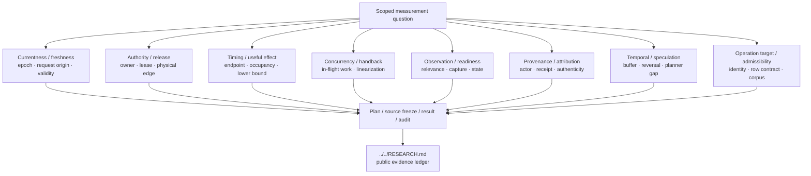

# Measurement research

This directory contains scoped measurement, composition, timing, currentness, authority, readiness, concurrency, and related formal/controlled experiments.

Each child directory is an evidence unit, not a release or automatically promoted component. Typical contents include a frozen plan/source, candidate/oracle code, formal result, audit, corruption controls, and a report.

## Measurement families

These families are navigation aids, not a mutually exclusive taxonomy. A child experiment may span several families; its own `PLAN.md` / `REPORT.md` remains authoritative for scope.

## Common naming cues

| Prefix/theme | Usually concerns |
|---|---|
| `currentness_*`, `freshness_*`, `*_validity_*` | Whether evidence/authority is still current at the decision or input boundary. |
| `input_owner_*`, `ordinary_*`, `physical_*`, `release_*` | Input authority, physical edge bracketing, release, and ownership. |
| `timing_*`, `useful_effect_*`, `useful_control_*` | Named timing endpoints, effect intervals, occupancy, and causal timing. |
| `concurrent_fast_decision_*`, `*_handback_*`, `*_inflight_*` | Concurrent local work and frontier/authority handback semantics. |
| `observation_*`, `readiness_*`, `inference_gap_*` | Observation production/relevance/readiness and planner-gap transfer. |
| `mutation_actor_*`, `*_authenticity_*`, `*_provenance_*` | Attribution and evidence authenticity. |
| `temporal_*`, `queryable_temporal_buffer_*`, `speculative_*` | Temporal buffering, prediction/speculation, reversal, and invalidation. |
| `operation_target_*` | Operation-target identity, admissibility, corpus, and row contracts. |

Do not infer PASS/FAIL/currentness from a directory name or version suffix; open the retained report and its source/audit artifacts.

## Reading order

1. Start with the top-level [`../../RESEARCH.md`](../../RESEARCH.md) for the project evidence ledger.
2. Use the linked Issue/PR or a child experiment's `REPORT.md` / `PLAN.md` to determine scope.
3. Treat PASS/FAIL/HOLD/STOP as scoped to the experiment's declared H/T/D/C/U and environment.
4. Do not infer runtime or product support from a measurement directory alone.

The large number of child directories is intentional retained evidence. Repository cleanup should add navigation or archival explanation rather than merge/rename completed evidence paths without a provenance-preserving reason.
