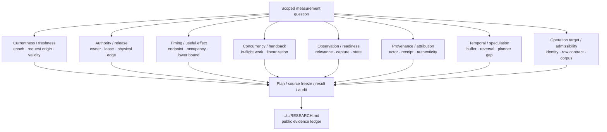

# Measurement research

This directory contains scoped measurement, composition, timing, currentness, authority, readiness, concurrency, and related formal/controlled experiments.

Each child directory is an evidence unit, not a release or automatically promoted component. Typical contents include a frozen plan/source, candidate/oracle code, formal result, audit, corruption controls, and a report.

## Measurement families

```mermaid
flowchart TD
    Q[Scoped measurement question]
    Q --> CUR[Currentness / freshness<br/>epoch · request origin · validity]
    Q --> AUTH[Authority / release<br/>owner · lease · physical edge]
    Q --> TIME[Timing / useful effect<br/>endpoint · occupancy · lower bound]
    Q --> CONC[Concurrency / handback<br/>in-flight work · linearization]
    Q --> OBS[Observation / readiness<br/>relevance · capture · state]
    Q --> PROV[Provenance / attribution<br/>actor · receipt · authenticity]
    Q --> TEMP[Temporal / speculation<br/>buffer · reversal · planner gap]
    Q --> TARGET[Operation target / admissibility<br/>identity · row contract · corpus]

    CUR --> A[Plan / source freeze / result / audit]
    AUTH --> A
    TIME --> A
    CONC --> A
    OBS --> A
    PROV --> A
    TEMP --> A
    TARGET --> A
    A --> L[../../RESEARCH.md<br/>public evidence ledger]
```

These families are navigation aids, not a mutually exclusive taxonomy. A child experiment may span several families; its own `PLAN.md` / `REPORT.md` remains authoritative for scope.

## Common naming cues

| Prefix/theme | Usually concerns |
|---|---|
| `currentness_*`, `freshness_*`, `*_validity_*` | Whether evidence/authority is still current at the decision or input boundary. |
| `input_owner_*`, `ordinary_*`, `physical_*`, `release_*` | Input authority, physical edge bracketing, release, and ownership. |
| `timing_*`, `useful_effect_*`, `useful_control_*` | Named timing endpoints, effect intervals, occupancy, and causal timing. |
| `concurrent_fast_decision_*`, `*_handback_*`, `*_inflight_*` | Concurrent local work and frontier/authority handback semantics. |
| `observation_*`, `readiness_*`, `inference_gap_*` | Observation production/relevance/readiness and planner-gap transfer. |
| `mutation_actor_*`, `*_authenticity_*`, `*_provenance_*` | Attribution and evidence authenticity. |
| `temporal_*`, `queryable_temporal_buffer_*`, `speculative_*` | Temporal buffering, prediction/speculation, reversal, and invalidation. |
| `operation_target_*` | Operation-target identity, admissibility, corpus, and row contracts. |

Do not infer PASS/FAIL/currentness from a directory name or version suffix; open the retained report and its source/audit artifacts.

## Reading order

1. Start with the top-level [`../../RESEARCH.md`](../../RESEARCH.md) for the project evidence ledger.
2. Use the linked Issue/PR or a child experiment's `REPORT.md` / `PLAN.md` to determine scope.
3. Treat PASS/FAIL/HOLD/STOP as scoped to the experiment's declared H/T/D/C/U and environment.
4. Do not infer runtime or product support from a measurement directory alone.

The large number of child directories is intentional retained evidence. Repository cleanup should add navigation or archival explanation rather than merge/rename completed evidence paths without a provenance-preserving reason.

## Retained application-capture transfer

- [`o2_stream_real_capture_dot_v1/REPORT.md`](o2_stream_real_capture_dot_v1/REPORT.md) — Issue #4362 offline retained Calc/Inkscape/xterm transfer: 144-call exact wire/pixel/state parity; 12 changed transitions had median paired temporary traced-allocation ratio 0.667. No speedup, total-RSS, live-GUI, model or runtime-adoption claim; first outcomes and independent audit retained.

## Frozen O2 streaming source with formal-result publication HOLD

- [`o2_stream_memory_m6r1_v1/RECOVERY_STATUS.md`](o2_stream_memory_m6r1_v1/RECOVERY_STATUS.md) — Issue #4362 synthetic O2 streaming allocation: exact preformal sources and 12 inputs preserved and locally reconstruction-checked. The Issue reports a 12/12 formal PASS, but its raw result package is not in this branch/PR and the branch's two Actions runs have no artifacts; the reported formal outcome remains unaudited from repository-retained raw data. No formal rerun or runtime-adoption claim.

## Retained real-input transport accounting

- [Public-summary cost successor to #4395](retained_public_summary_cost_4395_dot_v1/REPORT.md): `STOP_CLOCK_GRANULARITY` after 225 calls; 42 of 54 CPU aggregates failed the frozen guard. Original output identities and fallback facts are retained, but no cost-characterization PASS or formal post-baseline control result is claimed. [Lossless raw restoration](retained_public_summary_cost_4395_dot_v1/PACKAGING.md).

## Retained exact-crop cache construction

- [#4083 source recovery](exact_crop_partial_recompute_1663_v1/RECOVERY_STATUS.md): preserves the exact 25-file branch package and six passing construction/unit tests, while the formal raw capsule and audit-v2 delivery remain incomplete. The Issue-reported 9-case contract/cost PASS is historical and was not re-audited by this recovery; original branch retained.
- [#5254 / source PR #5257 archival qualification](exact_crop_cache_memory_bound_4083_v1/ARCHIVAL_QUALIFICATION.md): 15 exact historical construction/preparation files; source-to-receipt reconstruction HOLD. Retained 12/12 score equality and 28,800-byte RGB-payload values are historical claims, not repository-reproducible execution; mismatched hashes, original failure, and bespoke-predicate control limits remain explicit. Formal workload unrun; source PR stays Draft and #5254 stays open.

## Same-connection focus/key-state acquisition — raw-publication HOLD

- [#4389 / Draft PR #4410 archival qualification](key_state_piggyback_q4s8_v1/ARCHIVAL_QUALIFICATION.md): 18 exact source/freeze/audit blobs. The Issue-reported 612-acquisition contract PASS and full-cost HOLD are preserved as historical outcomes; the complete 261-file capsule and raw receipts remain absent, so no repository-only raw re-audit or full-cost benefit is claimed. Ten pure contract tests were run locally for this preservation; no allocation rerun. Keep the original Draft and branch for exact-byte recovery.
