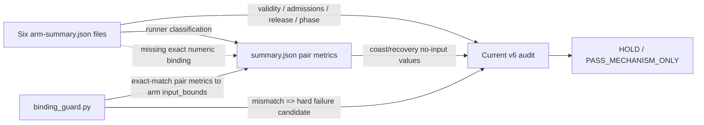

# MAP01 recovery v6 audit-integrity preflight — retained result

Issue: #1609  
Task: `MAP01-RECOVERY-V6-AUDIT-INTEGRITY-20260918-001`  
Decision: **CONFIRMED_V6_SUMMARY_ARM_BINDING_GAP**

## Result

The exact retained v4/v6 audit sources were reconstructed byte-for-byte and verified by Git blob identity before execution:

- `audit_map01_recovery_cover_mechanism_v4.py`: `c193b8e985b5e047d4a28f8f04b2ccaf60daac12`
- `audit_map01_recovery_cover_mechanism_v6.py`: `e3c34caad26a5a7e17d2464c945b74f747b75d4b`

A deterministic six-arm synthetic artifact was constructed with valid release/input/scorer/boundary evidence. The arm-level no-retained-input upper bounds were fixed at 600 ms for coast and 570 ms for recovery in all three pairs.

| Case | Non-summary tree | Median paired reduction | retained v6 decision | valid experiment |
|---|---|---:|---|---|
| truthful summary | `f54ae24c...5519` | 0.05 | `HOLD` | true |
| summary-only corruption | **same** `f54ae24c...5519` | 0.20 | `PASS_MECHANISM_ONLY` | true |

The corrupted case changed only the three pair-level recovery values in `summary.json` from 570 ms to 480 ms. The current retained audit emitted no hard failure. The pre-frozen additive `binding_guard.py` independently detected three summary↔arm mismatches.

Negative controls remained effective:

- one arm with `input_bounds.valid=false` → `FAIL`, `valid_experiment=false`;
- one arm with wrong v6 planner-end phase → `FAIL`, `valid_experiment=false`.

Independent result audit passed with no errors.

## Why the decision can flip

The current v4 base audit computes continuity reductions from pair-level numbers in `summary.json`. It separately verifies that each arm's `input_bounds` is valid and has the expected admission count, but it does not read `input_bounds.no_retained_input_upper_bound_ns` to reconstruct or exact-match the pair-level continuity values. The v6 wrapper adds planner-boundary checks but does not add that numeric binding.

## Claim boundary

This is **not** evidence that the honest v6 runner produces an incorrect summary. In the intended runner, `summary.json` is generated from in-memory arm results. It is also not a result about MAP01 recovery efficacy, useful task effect, planner latency, or gameplay competence.

The narrower result is auditability: retained `summary.json` decision numbers are trusted inputs rather than independently reconstructed from the retained arm evidence. Whole-artifact digest retention can detect later byte changes if the digest is independently trusted, but that is a different integrity layer from recomputing the scientific decision from primary arm artifacts.

## Recommended additive repair boundary

Do not modify or rerun v5. Do not silently rewrite the frozen v6 scientific condition. Before promoting any future v6 `PASS_MECHANISM_ONLY` or `HOLD`, add an audit successor that either:

1. recomputes each pair's coast/recovery no-input upper bounds directly from the six arm summaries, or
2. exact-matches the pair summary fields against `arm-summary.json -> input_bounds.no_retained_input_upper_bound_ns` and fails closed on any mismatch.

The pre-frozen `binding_guard.py` implements option 2 as a minimal candidate and detects the constructed corruption while accepting the truthful tree.

## H / T / D / C / U disposition

**H — confirmed.** Summary-only continuity-field corruption can flip the current audit's scientific decision while arm evidence remains byte-identical and valid.

**T — completed.** Exact-source identity, deterministic truth/corrupt pair, two negative controls, identical non-summary tree proof and independent result audit all passed.

**D — `CONFIRMED_V6_SUMMARY_ARM_BINDING_GAP`.** Result SHA-256 `dcf82ea62d0c41a6665a3a97b8020b1323e85eb84925a3b82097a32789dd7a2d`; independent audit SHA-256 `376b5f1a9a7ecda9d9f20846d531930c04125291795bb087fa76daff455c5241`.

**C — competing explanation bounded.** The observed flip is not caused by altered arm evidence: the complete non-summary tree digest is identical. The result also does not imply accidental runner corruption in an honest workflow.

**U — uncertainty.** This synthetic fixture tests audit integrity, not the frequency or operational likelihood of artifact corruption. A future integrated repair still needs exact-source tests against a real retained v6 artifact if/when that live allocation exists.

## Execution environment

Python 3.13.5 on Linux x86_64, container-visible 5 CPUs, AMD EPYC 9V74. The deterministic probe completed in 3.20 s wall time with max RSS about 94 MB. These are diagnostics only, not a performance benchmark.
