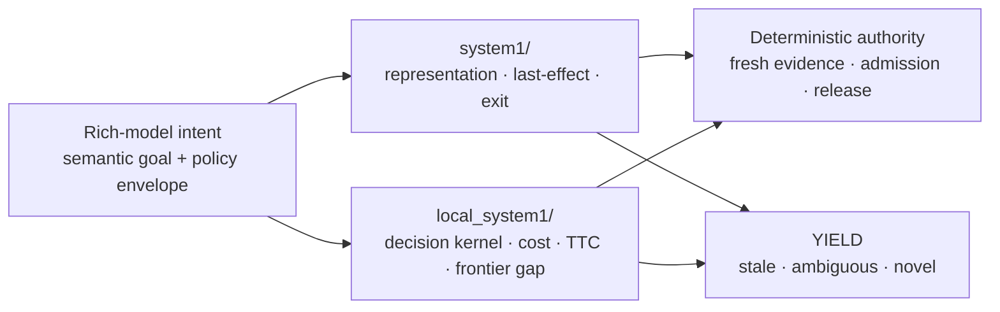

# System-1 research

This directory contains bounded fast-path / local decision experiments associated with System-1-style low-latency control.

These studies do not imply that a local model replaces the rich planner. Current project policy is to preserve rich-model intent and use local mechanisms only inside bounded, fresh-evidence-controlled authority.

## Relationship to Local System-1

This is a navigation view, not a mandatory runtime pipeline. Individual studies may test only one representation or decision boundary.

## Track map

| Theme | Retained studies |
|---|---|
| Latency-aware exit | [`latency_aware_exit_v1/`](latency_aware_exit_v1/), [`latency_aware_exit_v2/`](latency_aware_exit_v2/) |
| Last-effect receipt | [`map01_last_effect_receipt_v1/`](map01_last_effect_receipt_v1/) |
| Last-effect representation | [`map01_last_effect_representation_v1/`](map01_last_effect_representation_v1/), [`map01_last_effect_representation_v31_r2/`](map01_last_effect_representation_v31_r2/) |
| Representation collision / ambiguity | [`map01_representation_collision_v1/`](map01_representation_collision_v1/) |

For lower-level local decision mechanics, route cost, TTC admission, typed evidence, and useful-work-per-frontier-boundary studies, use [`../local_system1/`](../local_system1/).

## Read next

- Current governing direction: [`../../docs/CURRENT_GOAL.md`](../../docs/CURRENT_GOAL.md)
- Research method: [`../../docs/RESEARCH_METHOD.md`](../../docs/RESEARCH_METHOD.md)
- Evidence ledger: [`../../RESEARCH.md`](../../RESEARCH.md)
- Research workspace map: [`../README.md`](../README.md)

Read each child experiment for its allowed decision vocabulary, authority boundary, and scoped disposition.
